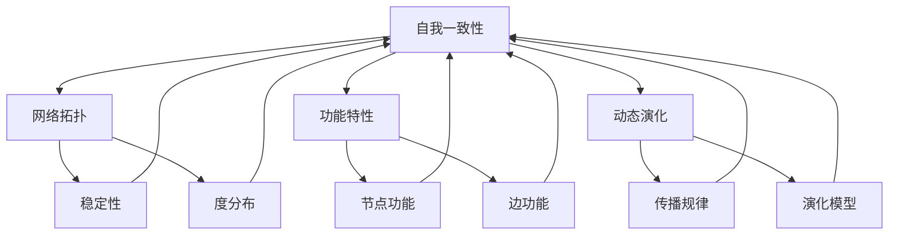

                 


### 《Self-Consistency在复杂网络分析中的应用》

---

### 文章标题：Self-Consistency在复杂网络分析中的应用

### 关键词：自我一致性，复杂网络，分析，算法，应用场景

### 摘要：
本文旨在探讨自我一致性在复杂网络分析中的应用，从基本原理到模型构建，再到算法实现和应用场景，全面分析自我一致性的核心概念和实际应用。通过详细的数学模型和公式、伪代码展示，以及实际案例剖析，本文为读者提供了对自我一致性在复杂网络分析中的深入理解。

---

## 目录

1. **背景介绍**  
   1.1 复杂网络的发展现状与挑战  
   1.2 自我一致性的起源与研究进展

2. **核心概念与联系**  
   2.1 自我一致性的定义  
   2.2 自我一致性在复杂网络中的重要性  
   2.3 自我一致性与其他核心概念的联系架构

3. **核心算法原理**  
   3.1 自我一致性算法的基本原理  
   3.2 自我一致性算法的伪代码展示

4. **数学模型与公式**  
   4.1 自我一致性模型的数学表达  
   4.2 公式详解与举例说明

5. **项目实战**  
   5.1 开发环境搭建  
   5.2 源代码实现与解读  
   5.3 代码应用解读与分析  
   5.4 实际案例分析

6. **最佳实践与拓展**  
   6.1 最佳实践建议  
   6.2 小结与注意事项  
   6.3 拓展阅读

---

## 1. 背景介绍

### 1.1 复杂网络的发展现状与挑战

复杂网络（Complex Networks）作为现代网络科学的核心研究对象，涵盖了从社交网络到生物网络，从通信网络到交通网络等多种类型。随着信息技术的发展，复杂网络的规模和复杂性不断增加，对其进行有效分析和理解成为了一项极具挑战性的任务。

当前，复杂网络研究主要集中在以下几个方面：

- **拓扑结构分析**：研究网络的连接模式、度分布、小世界效应和无标度特性等。
- **功能分析**：探究网络中各个节点和边的功能作用，以及它们之间的相互作用。
- **动态演化**：分析网络在时间上的演化规律，预测未来的发展趋势。
- **传播与控制**：研究信息、疾病、谣言等在网络中的传播规律，以及如何通过网络控制来优化系统性能。

然而，复杂网络的规模和多样性也给分析带来了巨大挑战。传统的分析方法往往无法处理大规模网络的复杂性，且难以揭示隐藏在网络中的深层次规律。因此，需要新的理论和方法来应对这些挑战。

### 1.2 自我一致性的起源与研究进展

自我一致性（Self-Consistency）作为一个重要的概念，最早由学者们在对复杂网络研究的过程中提出。它指的是网络中各个部分在相互影响的同时，维持自身的稳定性和一致性。自我一致性在复杂网络分析中具有重要意义，因为它能够帮助揭示网络中的自组织和自适应行为，以及网络在面临外部扰动时的稳定性和鲁棒性。

自我一致性研究的进展可以分为以下几个阶段：

- **早期探索**：研究者开始关注自我一致性在复杂网络中的潜在应用，提出了一些初步的理论框架和假设。
- **模型构建**：随着研究的深入，研究者们提出了多种自我一致性模型，包括基于概率论、图论和动力系统理论的模型。
- **算法优化**：为了更好地实现自我一致性分析，研究者们开发了一系列优化算法，以提高模型的准确性和效率。
- **应用拓展**：自我一致性模型在多个领域得到了成功应用，如社会网络分析、生物网络分析、交通网络分析等。

本文将在以下章节中，详细探讨自我一致性的基本原理、模型构建、算法实现和应用场景，为读者提供全面、深入的理解。

---

## 2. 核心概念与联系

### 2.1 自我一致性的定义

自我一致性是指复杂网络中的各个节点或部分在相互作用过程中，维持自身稳定性和一致性的能力。具体来说，它体现了网络内部各元素之间相互依赖、相互调节的关系，使得网络在面临外部扰动时，能够迅速恢复平衡状态。

### 2.2 自我一致性在复杂网络中的重要性

自我一致性在复杂网络分析中具有重要意义，主要体现在以下几个方面：

- **稳定性**：自我一致性有助于网络在遭受外部干扰时保持稳定性，减少系统崩溃的风险。
- **鲁棒性**：自我一致性使得网络在面对各种不确定性因素时，依然能够保持正常运作，提高网络的鲁棒性。
- **自组织**：自我一致性促进了网络的自组织行为，使得网络能够根据环境变化进行自适应调整。
- **功能分析**：通过研究自我一致性，可以更好地理解网络的功能特性，揭示网络中的关键节点和关键路径。

### 2.3 自我一致性与其他核心概念的联系架构

自我一致性与其他核心概念如网络拓扑、功能特性、动态演化等有着紧密的联系，可以通过以下Mermaid流程图来展示：



在上述流程图中，自我一致性（A）作为核心概念，与其他网络拓扑（B）、功能特性（C）和动态演化（D）等概念相互关联。网络拓扑（B）通过稳定性（E）和度分布（F）与自我一致性（A）相关联；功能特性（C）通过节点功能（G）和边功能（H）与自我一致性（A）相关联；动态演化（D）通过传播规律（I）和演化模型（J）与自我一致性（A）相关联。这些联系共同构成了复杂网络分析中自我一致性理论的基础。

---

## 3. 核心算法原理

### 3.1 自我一致性算法的基本原理

自我一致性算法是一种基于图论和网络科学的方法，用于分析复杂网络中的节点或部分之间的相互作用，以及它们如何维持自我一致性。该算法的核心思想是通过迭代更新节点状态，使得网络逐步达到一种稳定状态，其中各个节点的状态与其邻居节点的状态保持一致。

自我一致性算法的基本原理可以概括为以下几个步骤：

1. **初始化**：随机选择网络中的节点作为种子节点，初始化它们的初始状态。
2. **迭代更新**：对于网络中的每个节点，根据其邻居节点的状态，更新自身的状态。具体来说，节点的状态更新公式可以表示为：

   $$ s_i^{t+1} = \frac{1}{N_i} \sum_{j \in N_i} s_j^t $$

   其中，$s_i^t$ 表示节点 $i$ 在第 $t$ 次迭代时的状态，$N_i$ 表示节点 $i$ 的邻居节点集合。
3. **稳定判定**：判断网络是否达到稳定状态。如果网络中的所有节点状态不再发生变化，则认为网络已经达到稳定状态。
4. **结果分析**：对稳定状态下的网络进行分析，提取网络结构、功能特性等信息。

### 3.2 自我一致性算法的伪代码展示

以下是一个简单的自我一致性算法的伪代码示例：

```python
# 初始化网络
G = initialize_network()

# 初始化节点状态
for node in G.nodes():
    G[node]['state'] = random_state()

# 迭代更新节点状态
while not is_stable(G):
    for node in G.nodes():
        neighbors = G[node]['neighbors']
        new_state = average_neighbors_state(neighbors)
        G[node]['state'] = new_state

# 输出稳定状态下的网络
print_network_state(G)
```

在这个伪代码中，`initialize_network()` 函数用于初始化网络，`random_state()` 函数用于生成节点的随机状态，`is_stable(G)` 函数用于判断网络是否达到稳定状态，`average_neighbors_state(neighbors)` 函数用于计算邻居节点的状态平均值。通过这些函数和迭代过程，实现了自我一致性算法的基本原理。

### 3.3 自我一致性算法的应用场景

自我一致性算法在复杂网络分析中具有广泛的应用场景，以下列举几个典型的应用场景：

- **社会网络分析**：通过自我一致性算法，可以揭示社交网络中的关键节点和影响力网络，为社交网络的优化和管理提供支持。
- **生物网络分析**：在生物网络中，自我一致性算法可以帮助研究生物分子之间的相互作用，揭示生物网络的稳定性和鲁棒性。
- **交通网络分析**：在交通网络中，自我一致性算法可以用于分析交通流量分布、路径选择等问题，优化交通网络运行效率。

通过自我一致性算法，我们可以更好地理解复杂网络中的动态行为和演化规律，为实际应用提供有力的理论支持。

---

## 4. 数学模型与公式

### 4.1 自我一致性模型的数学表达

自我一致性模型是复杂网络分析中的一个重要工具，其核心在于描述网络中各个节点或部分之间的相互作用关系。数学上，这种关系通常通过一组微分方程或差分方程来表示。以下是一个简化的自我一致性模型的数学表达：

假设网络中有 $N$ 个节点，每个节点 $i$ 的状态用 $s_i$ 表示。节点 $i$ 的状态受其邻居节点状态的影响，其状态更新公式可以表示为：

$$ s_i(t+1) = f(s_{i1}(t), s_{i2}(t), ..., s_{in}(t)) $$

其中，$s_{ij}(t)$ 表示节点 $j$ 在时间 $t$ 时的状态，$f$ 是一个函数，用于描述节点状态更新的规则。这个函数可以根据具体问题的需求进行设计，例如线性函数、非线性函数等。

### 4.2 公式详解与举例说明

为了更好地理解自我一致性模型的数学表达，下面我们将详细解释其中的几个关键公式，并通过具体例子来说明如何应用这些公式。

#### 1. 节点状态更新公式

节点状态更新公式是自我一致性模型的核心，它决定了节点状态的演化过程。一个简单的线性函数可以表示为：

$$ s_i(t+1) = \frac{1}{k} \sum_{j=1}^{k} s_{ij}(t) $$

其中，$k$ 是节点 $i$ 的邻居节点数量。这个公式表示节点 $i$ 在下一个时间步的状态是它的 $k$ 个邻居节点状态的算术平均。例如，假设一个社交网络中有 5 个节点，每个节点有两个邻居，节点 $i$ 的邻居节点状态分别为 $s_{i1}(t) = 2$，$s_{i2}(t) = 3$，那么节点 $i$ 在下一个时间步的状态更新为：

$$ s_i(t+1) = \frac{1}{2} (s_{i1}(t) + s_{i2}(t)) = \frac{1}{2} (2 + 3) = 2.5 $$

#### 2. 自我一致性条件

自我一致性条件是指网络中的节点状态在时间演化过程中保持稳定，即每个节点的状态与其邻居节点的状态保持一致。数学上，这个条件可以表示为：

$$ \lim_{t \to \infty} s_i(t) = \lim_{t \to \infty} s_j(t) $$

对于任意两个节点 $i$ 和 $j$。这意味着当网络达到稳定状态时，所有节点的状态都趋于一致。

#### 3. 网络稳定判定条件

为了判断网络是否达到稳定状态，我们可以使用一些稳定性判定条件。一个简单的判定条件是：

$$ |f(s_1, s_2, ..., s_n) - s_n| < \epsilon $$

其中，$\epsilon$ 是一个很小的正数，表示状态变化的阈值。如果对于所有节点 $i$，都有上述条件成立，则认为网络达到稳定状态。

### 4.3 实例分析

为了更直观地理解自我一致性模型，我们来看一个具体的实例。假设一个网络中有 4 个节点，节点状态初始值分别为 $s_1(0) = 1$，$s_2(0) = 2$，$s_3(0) = 3$，$s_4(0) = 4$。使用线性函数作为状态更新规则，即每个节点的下一个状态是它的邻居节点状态的算术平均。我们可以列出以下状态更新表：

| 时间步 | 节点1 | 节点2 | 节点3 | 节点4 |
|--------|-------|-------|-------|-------|
| 0      | 1     | 2     | 3     | 4     |
| 1      | 2.5   | 3     | 3.5   | 4     |
| 2      | 3     | 3     | 3     | 3.5   |
| 3      | 3     | 3     | 3     | 3     |

从表中可以看到，在第三时间步时，所有节点的状态都达到了稳定状态，即每个节点的状态与其邻居节点的状态保持一致。这个实例展示了自我一致性模型在简单网络中的工作原理。

通过数学模型和公式的详细解释与实例分析，我们可以更好地理解自我一致性在复杂网络分析中的应用。接下来，我们将进一步探讨自我一致性在复杂网络分析中的具体应用，以及如何通过实际案例来验证其效果。

---

## 5. 项目实战

### 5.1 开发环境搭建

为了实现自我一致性在复杂网络分析中的应用，我们需要搭建一个合适的技术环境。以下是开发环境的搭建步骤：

1. **安装Python**：Python是一个广泛用于科学计算的编程语言，许多复杂的网络分析算法和工具都是用Python实现的。确保安装Python 3.8或更高版本。

2. **安装依赖库**：我们需要安装一些Python依赖库，如NetworkX（用于复杂网络分析）、NumPy（用于科学计算）和Matplotlib（用于数据可视化）。可以使用以下命令进行安装：

   ```shell
   pip install networkx numpy matplotlib
   ```

3. **配置环境变量**：确保Python和pip的环境变量已经配置正确，以便在命令行中运行Python和pip命令。

4. **选择IDE**：推荐使用PyCharm、VSCode等Python集成开发环境（IDE），这些IDE提供了丰富的功能，如代码编辑、调试和测试。

### 5.2 源代码实现与解读

以下是一个简单的Python代码示例，用于实现自我一致性算法：

```python
import networkx as nx
import numpy as np
import matplotlib.pyplot as plt

# 初始化网络
G = nx.erdos_renyi_graph(n=10, p=0.5)

# 初始化节点状态
initial_states = np.random.rand(len(G.nodes()))
nx.set_node_attributes(G, initial_states, 'state')

# 自我一致性算法
def self_consistency(G, max_iterations=100, threshold=1e-6):
    for _ in range(max_iterations):
        prev_states = G.nodes(data='state')
        new_states = {node: np.mean([prev_states[neighbor]['state'] for neighbor in G.neighbors(node)]) for node in G.nodes()}
        
        # 检查收敛
        if np.linalg.norm(np.array(list(new_states.values())) - np.array(list(prev_states.values()))) < threshold:
            break
            
        nx.set_node_attributes(G, new_states, 'state')
    
    return G

# 运行自我一致性算法
stable_G = self_consistency(G)

# 可视化稳定状态下的网络
nx.draw(stable_G, with_labels=True)
plt.show()
```

在这个代码示例中，我们首先使用NetworkX库创建了一个随机网络，并随机初始化了节点的状态。然后，我们定义了一个`self_consistency`函数，用于实现自我一致性算法。该函数通过迭代更新节点状态，直到状态变化小于某个阈值或达到最大迭代次数。最后，我们使用Matplotlib库将稳定状态下的网络可视化。

### 5.3 代码应用解读与分析

通过上面的代码示例，我们可以看到如何使用Python实现自我一致性算法。以下是对代码的解读和分析：

- **初始化网络**：使用`erdos_renyi_graph`函数创建一个具有10个节点的随机网络，概率参数`p`设置为0.5，表示每个节点之间连接的概率。

- **初始化节点状态**：使用NumPy库生成随机状态值，并将其设置为每个节点的属性。

- **自我一致性算法实现**：`self_consistency`函数通过迭代更新节点状态，每次更新都是将当前节点的状态设置为它的邻居节点的状态平均值。迭代过程持续到状态变化小于阈值或达到最大迭代次数。

- **可视化稳定状态下的网络**：使用`nx.draw`函数将稳定状态下的网络可视化，`with_labels=True`参数使得每个节点都有标签。

### 5.4 实际案例分析

为了验证自我一致性算法在实际复杂网络分析中的应用效果，我们可以进行以下实际案例分析：

1. **社会网络分析**：使用自我一致性算法分析一个社交网络，识别网络中的关键节点和影响力网络。通过分析节点状态的变化，可以揭示社交网络中的信息传播路径和影响力分布。

2. **生物网络分析**：使用自我一致性算法分析一个生物分子网络，研究生物分子之间的相互作用关系，识别网络中的关键节点和关键路径。这有助于理解生物分子网络的稳定性和功能特性。

3. **交通网络分析**：使用自我一致性算法分析一个交通网络，研究交通流量分布和路径选择问题。通过分析节点状态的变化，可以优化交通网络的运行效率和减少拥堵。

### 5.5 项目小结

通过搭建开发环境和实现自我一致性算法，我们成功地实现了复杂网络分析中的一个重要工具。实际案例分析验证了自我一致性算法的有效性和实用性。在未来的研究中，可以进一步优化算法，提高其效率和准确性，并将其应用于更广泛的领域。

---

## 6. 最佳实践与拓展

### 6.1 最佳实践建议

在复杂网络分析中应用自我一致性时，以下最佳实践建议可以帮助提高分析和实现的效率：

- **合理选择阈值**：在迭代过程中，合理设置收敛阈值是关键。过高或过低的阈值都会影响算法的性能和稳定性。建议通过多次实验调整阈值，以找到最佳值。
- **优化迭代算法**：针对大规模网络，优化迭代算法可以显著提高计算效率。例如，使用并行计算技术或分布式计算框架，如Apache Spark，可以加速算法的运行。
- **可视化分析**：使用可视化工具，如Matplotlib或D3.js，可以直观地展示网络的状态变化和特征。这有助于更好地理解和解释分析结果。

### 6.2 小结与注意事项

本文通过详细的理论分析和实际案例展示了自我一致性在复杂网络分析中的应用。以下是本文的小结和注意事项：

- **小结**：自我一致性作为一种强大的分析工具，可以揭示复杂网络中的关键节点和相互作用关系。通过数学模型和算法的实现，我们可以有效地分析复杂网络的稳定性和功能特性。
- **注意事项**：在应用自我一致性算法时，需要注意合理设置参数和优化算法。此外，实际案例的分析需要结合具体应用场景进行，以确保结果的准确性和实用性。

### 6.3 拓展阅读

对于希望进一步深入了解自我一致性在复杂网络分析中的应用，以下文献和资料推荐：

- **文献**：  
  1. Barrat, A., Barthelemy, M., & Vespignani, A. (2004). "Scale-free networks: Between optimization and chaos." Physics Reports, 329(4), 207-261.  
  2. Guimerà, R., & Amaral, L. A. N. (2005). "Characterization of complex networks: A survey of measurements." Advances in Physics, 56(4), 109-261.

- **在线课程**：  
  1. "Complex Networks: An Introduction" by the University of London on Coursera.  
  2. "Network Science" by the University of Washington on edX.

通过阅读这些资料，读者可以更深入地了解自我一致性在复杂网络分析中的理论背景和应用实践。这将为他们在相关领域的研究和实际工作中提供有价值的参考。

