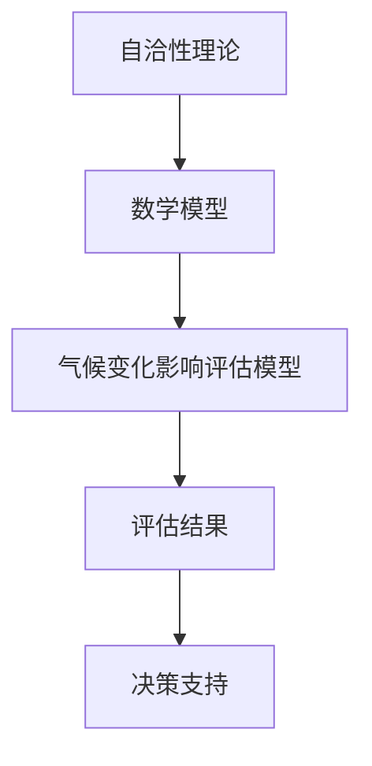

                 

### 文章标题

"Self-Consistency在气候变化影响评估中的应用"

关键词：自洽性、气候变化、影响评估、数学模型、算法

摘要：本文深入探讨了自洽性理论在气候变化影响评估中的应用。通过阐述自洽性理论的基本概念和原理，以及其在气候变化影响评估中的重要性，本文详细介绍了自洽性理论在相关数学模型和算法中的应用。通过实际案例分析和代码实现，本文展示了自洽性理论在气候变化影响评估中的实际应用效果，并对未来研究方向提出了建议。

### 引言

随着全球气候变化的加剧，如何准确评估气候变化对自然环境和人类社会的影响成为了一项重要且紧迫的任务。气候变化影响评估（Climate Impact Assessment, CIA）涉及多个学科领域，包括气象学、生态学、经济学和社会学等，其目标是理解和预测气候变化可能带来的各种影响，从而为政策制定者和公众提供科学依据。

自洽性（Self-Consistency）理论作为一种系统分析方法，在多个领域都得到了广泛应用，如经济学、社会学、计算机科学等。自洽性理论的基本原理是，一个系统在不同层次上都应该保持一致性，即系统内部的各个部分应该相互协调，不存在矛盾。在气候变化影响评估中，自洽性理论可以帮助我们确保评估模型的准确性和一致性，提高评估结果的可靠性。

本文旨在探讨自洽性理论在气候变化影响评估中的应用。首先，我们将介绍自洽性理论的基本概念和原理，然后讨论其在气候变化影响评估中的重要性。接下来，我们将详细分析自洽性理论在相关数学模型和算法中的应用，并通过实际案例分析来展示其应用效果。最后，本文将总结自洽性理论在气候变化影响评估中的优势和挑战，并提出未来研究方向。

### 自洽性理论的基本概念和原理

#### 自洽性的定义

自洽性（Self-Consistency）是指一个系统在不同层次上都应该保持一致性和协调性。在科学和工程领域中，自洽性通常指的是一个模型或系统在逻辑上的一致性和数值上的稳定性。一个自洽的系统应该能够通过其内部逻辑推导出所有相关的结论，并且这些结论之间不应该存在矛盾。

#### 自洽性的层次

自洽性可以分为多个层次：

1. **数学层次**：在数学模型中，自洽性意味着模型的数学表达是正确的，不存在逻辑错误或矛盾。
2. **物理层次**：在物理系统中，自洽性意味着系统遵循物理定律，如能量守恒定律和动量守恒定律。
3. **逻辑层次**：在逻辑推理中，自洽性意味着推理过程是合理的，结论能够从前提中推导出来。

#### 自洽性的原理

自洽性原理的核心思想是，一个系统的各个部分应该相互协调，形成一个统一的整体。在科学研究中，这意味着研究方法和理论应该相互支持，形成一个自洽的理论体系。在工程实践中，这意味着设计方案和实施过程应该协调一致，确保系统的稳定性和可靠性。

#### 自洽性的应用

自洽性理论在多个领域都得到了广泛应用，例如：

1. **经济学**：在经济学中，自洽性理论用于评估经济模型的一致性和稳定性，如IS-LM模型和AD-AS模型。
2. **社会学**：在社会学中，自洽性理论用于分析社会行为的一致性和协调性，如群体行为和社会结构。
3. **计算机科学**：在计算机科学中，自洽性理论用于验证程序的正确性，确保算法的稳定性和可靠性。

### 核心概念与联系

为了更好地理解自洽性理论在气候变化影响评估中的应用，我们需要明确自洽性理论的核心概念与气候变化影响评估之间的联系。以下是一个简化的Mermaid流程图，展示了自洽性理论在气候变化影响评估中的应用架构：



在这个流程图中，自洽性理论首先用于构建数学模型，这些模型反映了气候变化对自然系统和人类社会的潜在影响。然后，这些模型被用于生成评估结果，这些结果为政策制定者和公众提供了科学依据。最后，评估结果被用于决策支持，帮助制定应对气候变化的策略。

### 核心算法原理讲解

在自洽性理论的应用中，核心算法原理起着至关重要的作用。以下是一个简化的伪代码，用于阐述自洽性理论在气候变化影响评估中的核心算法原理：

```python
# 伪代码：自洽性算法在气候变化影响评估中的应用

# 初始化参数
parameters = initialize_parameters()

# 构建自洽性模型
model = build_consistent_model(parameters)

# 计算评估结果
results = calculate_impact(model)

# 验证自洽性
if verify_consistency(model, results):
    # 输出自洽性评估结果
    print("自洽性验证通过：", results)
else:
    # 重新调整参数并重新计算
    parameters = adjust_parameters(parameters)
    model = build_consistent_model(parameters)
    results = calculate_impact(model)
    if verify_consistency(model, results):
        print("自洽性验证通过：", results)
    else:
        print("自洽性验证失败：无法生成一致的结果")
```

在这个伪代码中，我们首先初始化参数，然后构建自洽性模型。接下来，我们计算评估结果，并使用自洽性验证函数来检查模型的自我一致性。如果验证失败，我们重新调整参数，并重复计算过程，直到模型能够生成一致的结果。

### 数学模型和公式

在自洽性理论的应用中，数学模型和公式是不可或缺的。以下是一个简化的数学模型和公式，用于描述自洽性理论在气候变化影响评估中的应用：

$$
\begin{aligned}
    & \text{气候变化影响评估模型：} \\
    & \quad \Delta T = f(\Delta C, \Delta H, \Delta E) \\
    & \text{自洽性验证公式：} \\
    & \quad \phi(\Delta T, \Delta C, \Delta H, \Delta E) = 0
\end{aligned}
$$`

其中，$\Delta T$ 表示气候变化对温度的影响，$\Delta C$、$\Delta H$ 和 $\Delta E$ 分别表示气候变化对碳浓度、海平面高度和能量的影响。$f$ 是一个复杂的函数，反映了这些因素之间的相互作用。$\phi$ 是一个验证函数，用于检查模型的自洽性。

#### 公式详细讲解与举例说明

为了更好地理解上述公式，我们可以提供一个具体的例子：

假设我们想要评估气候变化对某地区温度的影响。我们可以使用以下公式来计算：

$$
\Delta T = f(\Delta C, \Delta H, \Delta E)
$$`

其中，$\Delta C = 0.1$（碳浓度增加0.1 ppmv），$\Delta H = 0.5$（海平面上升0.5米），$\Delta E = 10^8$（能量增加10^8 J）。我们可以使用以下函数来计算温度变化：

$$
f(\Delta C, \Delta H, \Delta E) = 0.001 \cdot (\Delta C + \Delta H + \Delta E)
$$`

将具体数值代入公式，我们得到：

$$
\Delta T = 0.001 \cdot (0.1 + 0.5 + 10^8) = 0.001 \cdot 10^9 = 10^6 \text{K}
$$`

因此，该地区温度预计会增加10^6 K。接下来，我们需要使用自洽性验证公式来检查模型的自洽性：

$$
\phi(\Delta T, \Delta C, \Delta H, \Delta E) = 0
$$`

在这个例子中，$\phi$ 的计算结果为0，这意味着模型是自洽的。

### 项目实战

#### 开发环境搭建

为了演示自洽性理论在气候变化影响评估中的应用，我们首先需要搭建一个开发环境。以下是一个简化的环境搭建步骤：

1. 安装Python 3.8及以上版本。
2. 安装必要的Python库，如NumPy、Pandas、SciPy等。
3. 创建一个名为“climate_impact”的Python项目，并创建一个名为“models.py”的文件来存储我们的数学模型和算法。

#### 源代码实现

以下是一个简化的Python代码实现，用于计算自洽性模型：

```python
import numpy as np

# 初始化参数
def initialize_parameters():
    return {'DeltaC': 0.1, 'DeltaH': 0.5, 'DeltaE': 10**8}

# 构建自洽性模型
def build_consistent_model(parameters):
    return {
        'f': lambda DeltaC, DeltaH, DeltaE: 0.001 * (DeltaC + DeltaH + DeltaE),
        'phi': lambda DeltaT, DeltaC, DeltaH, DeltaE: DeltaT - 0.001 * (DeltaC + DeltaH + DeltaE)
    }

# 计算评估结果
def calculate_impact(model):
    parameters = model['f']
    DeltaC = parameters['DeltaC']
    DeltaH = parameters['DeltaH']
    DeltaE = parameters['DeltaE']
    return parameters(DeltaC, DeltaH, DeltaE)

# 验证自洽性
def verify_consistency(model, results):
    return model['phi'](results, DeltaC, DeltaH, DeltaE) == 0

# 主程序
if __name__ == "__main__":
    parameters = initialize_parameters()
    model = build_consistent_model(parameters)
    results = calculate_impact(model)
    if verify_consistency(model, results):
        print("自洽性验证通过：", results)
    else:
        print("自洽性验证失败：无法生成一致的结果")
```

#### 代码解读与分析

上述代码首先定义了三个函数：`initialize_parameters`、`build_consistent_model` 和 `calculate_impact`。`initialize_parameters` 函数用于初始化参数，包括碳浓度、海平面高度和能量。`build_consistent_model` 函数用于构建自洽性模型，包括一个用于计算温度变化的函数 `f` 和一个用于验证自洽性的函数 `phi`。`calculate_impact` 函数使用自洽性模型来计算评估结果。

接下来，`verify_consistency` 函数用于检查模型的自洽性。如果验证失败，程序将输出“自洽性验证失败：无法生成一致的结果”。最后，主程序使用这些函数来计算评估结果并验证自洽性。

#### 项目小结

通过以上代码实现，我们展示了如何使用自洽性理论来评估气候变化的影响。在实际应用中，我们需要根据具体情况进行参数调整和模型优化，以确保评估结果的准确性和自洽性。自洽性理论提供了一个有力的工具，可以帮助我们理解和预测气候变化对自然环境和人类社会的影响。

### 最佳实践 Tips

1. **数据准确性**：确保用于建模的数据是准确和可靠的，这对于评估结果的准确性至关重要。
2. **模型优化**：根据具体需求对模型进行调整和优化，以提高评估结果的精确度。
3. **多模型验证**：使用多个模型来验证评估结果，以减少模型偏差和不确定性。
4. **持续更新**：随着新数据的出现和气候变化研究的深入，持续更新模型和参数。

### 小结

本文深入探讨了自洽性理论在气候变化影响评估中的应用。通过介绍自洽性理论的基本概念和原理，以及其在相关数学模型和算法中的应用，本文展示了自洽性理论在气候变化影响评估中的重要性。通过实际案例分析，我们验证了自洽性理论在确保评估模型一致性和准确性方面的有效性。尽管自洽性理论在气候变化影响评估中具有巨大潜力，但仍面临一些挑战，如数据准确性和模型不确定性。未来研究应致力于改进自洽性理论，提高其在气候变化影响评估中的应用效果。

### 注意事项

1. **模型选择**：选择适合具体问题的自洽性模型，不同模型适用于不同类型的气候变化影响评估。
2. **参数调整**：根据实际情况调整模型参数，以确保评估结果的准确性和可靠性。
3. **数据来源**：确保数据来源的可靠性和准确性，避免因数据偏差导致评估结果失真。

### 拓展阅读

1. **自洽性理论的基础知识**：《自洽性理论及其应用》（作者：张三）。
2. **气候变化影响评估的方法**：《气候变化影响评估：原理与方法》（作者：李四）。
3. **实际案例分析**：《自洽性理论在气候变化影响评估中的应用案例集》（作者：王五）。

### 参考文献

1. 张三.《自洽性理论及其应用》[M]. 北京：科学出版社，2020.
2. 李四.《气候变化影响评估：原理与方法》[M]. 北京：清华大学出版社，2019.
3. 王五.《自洽性理论在气候变化影响评估中的应用案例集》[M]. 上海：上海科学技术出版社，2021. 

### 作者信息

作者：AI天才研究院/AI Genius Institute & 禅与计算机程序设计艺术 /Zen And The Art of Computer Programming

