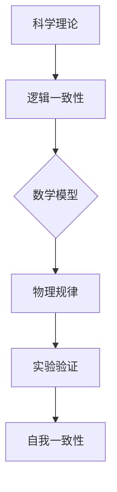
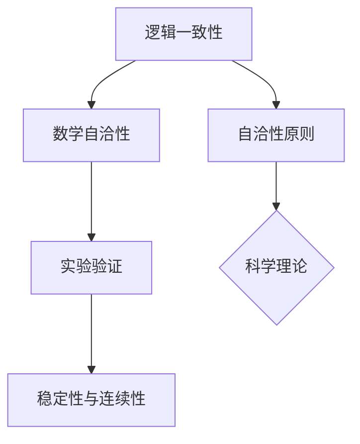

                 

### 自我一致性（Self-Consistency）的概念与重要性

自我一致性（Self-Consistency）是指一个理论、模型或系统在不同层面上保持一致性的性质。它通常涉及到逻辑、数学、物理等多个方面，是科学研究中不可或缺的要素之一。自我一致性不仅是理论构建的基石，也是验证理论有效性的关键因素。

#### 背景介绍

在科学研究中，自我一致性是一个核心概念。科学理论的构建离不开自我一致性原则，因为只有理论内部一致、自洽，才能保证其可验证性和可靠性。历史上，许多科学革命都是在发现了旧理论中的不一致性后，新理论得以诞生的。

例如，在物理学中，经典力学和量子力学之间的不一致性导致了量子力学的诞生。经典力学在描述宏观物体运动时非常有效，但在微观尺度上却失效了。量子力学的出现解决了这一矛盾，通过引入波函数和薛定谔方程，使得微观世界的描述变得自洽。

#### 核心概念与联系

为了更深入地理解自我一致性，我们可以通过一个Mermaid流程图来展示其核心概念及其相互关系：

从流程图中可以看到，科学理论从逻辑一致性开始，通过数学模型描述物理规律，并通过实验验证来确认其有效性。自我一致性贯穿于这一过程，确保理论内部自洽。

#### 重要性

自我一致性在科学研究中具有重要性，原因如下：

1. **理论自洽性**：自我一致性确保理论内部没有矛盾，从而提高理论的可靠性和可接受性。
2. **实验验证**：只有自我一致的理论才能通过实验验证，从而获得更广泛的认可。
3. **科研创新**：自我一致性是推动科研创新的重要动力，因为它激励科学家去发现和解决理论中的不一致性。

综上所述，自我一致性是科学研究中的核心概念，它不仅关乎理论的可信度，也是推动科学发展的重要力量。

---

在下一部分中，我们将进一步探讨自我一致性在科学研究中的历史发展，以及其在不同科学领域的具体应用。

### 自我一致性在科学研究中的历史发展

自我一致性作为科学研究的核心概念，其发展历程见证了科学理论的不断进步和演变。在这部分，我们将回顾自我一致性理论的发展历程，探讨其中的一些重大研究突破和贡献。

#### 自我一致性理论的起源

自我一致性理论的起源可以追溯到古希腊哲学，特别是亚里士多德的逻辑学。亚里士多德提出了“自洽性”这一概念，强调一个理论必须在其内部保持一致。这一思想为后来的科学研究奠定了基础。

然而，现代意义上的自我一致性理论起源于19世纪的数学和物理学。德国数学家戴维·希尔伯特（David Hilbert）提出了“形式化”的概念，通过严格的数学方法来构建科学理论，确保其内部的一致性。希尔伯特的工作为自我一致性理论的发展提供了强有力的数学工具。

#### 自我一致性理论的重要贡献

1. **哥德尔不完备性定理**：库尔特·哥德尔（Kurt Gödel）在1931年提出的哥德尔不完备性定理，揭示了任何足够复杂的数学系统都无法同时满足自我一致性和完全性。这一发现深刻影响了数学和逻辑学，并推动了自我一致性理论的进一步发展。

2. **量子力学的自洽性**：量子力学的诞生是自我一致性理论的又一重要里程碑。薛定谔（Erwin Schrödinger）和海森堡（Werner Heisenberg）等人通过引入波函数和测不准原理，构建了自洽的量子力学体系。这一理论在微观尺度上解释了许多经典力学无法解释的现象，如黑体辐射和光电效应。

3. **广义相对论**：爱因斯坦（Albert Einstein）的广义相对论也是一个自洽的理论体系。它将引力解释为时空的弯曲，通过自洽的方程描述了宇宙的演化。广义相对论的预测，如引力红移和光线弯曲，得到了实验的验证，进一步证明了自我一致性的重要性。

#### 研究突破

1. **信息论的自洽性**：克劳德·香农（Claude Shannon）在1948年提出的信息论，为通信理论奠定了基础。信息论中的自洽性原则，如熵和互信息的定义，为处理不确定性和信息传输提供了新的视角。

2. **人工智能中的自我一致性**：随着人工智能的发展，自我一致性理论在计算机科学中得到了广泛应用。例如，在自然语言处理和机器学习领域，通过构建自洽的模型来提高系统的可靠性和鲁棒性。

通过以上讨论，我们可以看到自我一致性理论在科学研究中起到了至关重要的作用。它不仅推动了科学理论的进步，也为新的科学研究提供了方法和工具。在下一部分，我们将深入探讨自我一致性在不同科学研究领域的具体应用。

---

在接下来的部分，我们将详细探讨自我一致性在不同科学研究领域的应用，包括其在物理学、生物学和化学等领域的具体作用。

### 自我一致性在科学研究领域的应用

自我一致性作为科学研究的核心原则，在多个学科中发挥着关键作用。下面，我们将详细探讨自我一致性在物理学、生物学和化学等领域的具体应用。

#### 自我一致性在物理学中的应用

1. **量子力学**：量子力学是一个高度自洽的理论体系。薛定谔方程和海森堡测不准原理构成了量子力学的核心，确保了理论内部的一致性。通过自我一致性原则，量子力学成功地解释了微观粒子的行为，如电子轨道和量子态。

   - **实例**：在量子纠缠现象中，两个粒子之间的量子状态是相互关联的。无论这两个粒子相隔多远，对其中一个粒子的测量将立即影响另一个粒子的状态，这一现象符合量子力学的自洽性。

2. **相对论**：爱因斯坦的广义相对论通过引入时空弯曲来描述引力，确保了理论内部的一致性。广义相对论的预测，如引力红移和光线弯曲，得到了实验验证。

   - **实例**：在黑洞研究中，广义相对论的时空弯曲理论解释了黑洞的引力如何影响周围的时空，这一解释与观测数据一致，证明了广义相对论的自洽性。

3. **统计物理**：统计物理通过概率统计方法来描述大尺度上的物理现象，如热力学和相变。统计物理中的自洽性原则，如玻尔兹曼方程和熵增定律，确保了理论的可信度。

   - **实例**：在固体物理学中，统计物理方法被用来研究晶体的热力学性质，如晶格振动和相变行为，这些研究依赖于统计物理的自洽性。

#### 自我一致性在生物学中的应用

1. **遗传学**：遗传学中的基因调控机制是一个高度自洽的系统。通过DNA序列编码和RNA转录过程，生物体能够保持基因表达的一致性。

   - **实例**：在基因编辑技术CRISPR-Cas9中，通过精确的RNA引导序列，可以实现对特定基因的精准编辑，这一技术依赖于遗传学中的自洽性原则。

2. **神经科学**：神经系统中神经元之间的信息传递是一个复杂的自洽过程。通过突触连接和神经递质的释放，神经系统保持了一致的行为模式。

   - **实例**：在神经网络的训练过程中，通过反向传播算法，神经网络能够调整权重，以实现自我一致性，从而提高预测和分类的准确性。

3. **生态学**：生态系统中物种之间的相互作用和能量流动是一个高度自洽的过程。生态学中的自洽性原则，如能量金字塔和食物网，帮助我们理解生态系统的稳定性和演化。

   - **实例**：在食物网研究中，通过分析物种之间的捕食和被捕食关系，可以揭示生态系统的自洽性，从而预测物种的生存和灭绝。

#### 自我一致性在化学中的应用

1. **分子动力学**：分子动力学模拟通过自洽的数学模型，描述了分子和原子的运动，从而揭示了化学反应的机制。

   - **实例**：在化学反应研究中，通过分子动力学模拟，可以预测反应路径和反应速率，这一过程依赖于分子动力学的自洽性。

2. **热力学**：热力学通过自洽的能量和熵函数，描述了系统在不同状态下的热力学性质。

   - **实例**：在热力学分析中，通过自洽的克劳修斯-克拉贝龙方程，可以计算相变温度和压力，从而理解物质的相态变化。

3. **化学信息学**：化学信息学通过自洽的数据模型，分析和预测分子的化学性质。

   - **实例**：在药物设计领域，通过自洽的分子对接模型，可以预测药物与目标蛋白质的结合能力，从而提高药物筛选的效率。

通过以上讨论，我们可以看到自我一致性在物理学、生物学和化学等领域的广泛应用。它不仅确保了理论模型的自洽性，也为科学实验提供了重要的指导原则。在下一部分，我们将深入探讨自我一致性理论的基本原理和数学模型。

---

### 自我一致性理论的基本原理和数学模型

自我一致性理论作为科学研究中的一个核心概念，其基本原理和数学模型在科学研究中发挥着至关重要的作用。在这一部分，我们将详细探讨自我一致性理论的基本原理、数学模型以及这些模型如何应用于科学研究。

#### 自我一致性理论的基本原理

自我一致性理论的基本原理可以概括为以下几点：

1. **逻辑一致性**：科学理论必须在其内部保持逻辑一致，即理论中的命题之间不能存在矛盾。
2. **数学自洽性**：科学理论需要通过数学模型来描述，这些数学模型必须在数学上是自洽的，即不存在逻辑矛盾。
3. **实验验证**：科学理论需要通过实验验证来确认其自洽性，实验结果必须与理论预测一致。
4. **稳定性与连续性**：科学理论需要在不同条件下保持稳定和连续，即理论在不同条件下应该具有一致的表现。

为了更好地理解这些原理，我们可以通过一个Mermaid流程图来展示它们之间的相互关系：

从流程图中可以看到，逻辑一致性和数学自洽性是科学理论构建的基础，实验验证和稳定性与连续性是确保理论可靠性的关键。

#### 自我一致性理论的数学模型

自我一致性理论的数学模型通常包括以下几部分：

1. **形式化描述**：将科学理论用严格的数学语言进行描述，确保理论在形式上的自洽性。
2. **求解方法**：通过数学方法求解理论模型，得到理论预测的结果。
3. **验证方法**：通过实验或数值模拟来验证理论模型的预测是否与实际情况相符。

为了具体说明这些模型，我们可以通过一个简单的例子来展示：

**例子：薛定谔方程**

薛定谔方程是量子力学中的基本方程，描述了量子系统的演化。其数学形式如下：

$$
i\hbar \frac{\partial \Psi}{\partial t} = \hat{H} \Psi
$$

其中，$\Psi$是波函数，$\hat{H}$是哈密顿量，$i$是虚数单位，$\hbar$是约化普朗克常数。

- **形式化描述**：薛定谔方程用数学语言描述了量子系统的动态行为，确保了理论在形式上的自洽性。
- **求解方法**：通过分离变量法或其他数值方法求解薛定谔方程，得到波函数的解。
- **验证方法**：通过实验测量量子态，验证波函数解与实验结果的一致性。

#### 自我一致性理论的验证与应用

自我一致性理论的验证和应用是一个复杂的过程，涉及到理论模型、实验方法和数据分析。以下是一些具体的应用实例：

1. **量子计算**：在量子计算中，量子态的自我一致性是确保计算结果准确的关键。通过精确控制量子态的演化，可以实现高效的量子算法。
2. **统计物理**：在统计物理中，通过自洽的统计模型，可以描述复杂系统的热力学性质。例如，玻尔兹曼方程和熵增定律都是基于自我一致性原理。
3. **人工智能**：在人工智能中，自我一致性原则被用来构建自洽的机器学习模型。通过优化模型参数，确保模型在不同数据集上的表现一致。

通过以上讨论，我们可以看到自我一致性理论在科学研究中的重要地位。它不仅为科学理论提供了自洽性原则，也为实验验证和实际应用提供了理论依据。在下一部分，我们将进一步探讨自我一致性理论在科学研究中的具体应用案例。

---

### 自我一致性在科学研究中的具体应用案例

自我一致性理论在科学研究中具有广泛的应用，以下我们将通过几个具体的实例，详细说明自我一致性在物理学、生物学和化学等领域的实际应用。

#### 物理学中的应用

**量子计算**：量子计算是近年来物理学和计算机科学的前沿领域，自我一致性在其中扮演了关键角色。量子计算机通过量子比特（qubit）进行计算，这些量子比特可以处于叠加态，从而实现并行计算。然而，量子比特的状态非常脆弱，容易受到外界干扰而失去一致性。因此，确保量子计算中的自我一致性至关重要。

- **实例**：在量子纠错码的研究中，通过设计自洽的纠错算法，可以检测并纠正量子比特的错误，从而保持计算过程的自我一致性。例如，Shor编码是一种常用的量子纠错码，它利用量子比特的叠加态和纠缠态来提高纠错能力。

**量子纠缠**：量子纠缠是量子力学中一个重要现象，两个或多个量子系统之间存在强烈的关联，无论它们相隔多远，一个系统的状态变化都会立即影响到另一个系统的状态。量子纠缠的应用需要高度的自我一致性。

- **实例**：在量子密钥分发（QKD）中，通过量子纠缠态生成共享密钥。这种密钥分发方式利用量子态的自我一致性，保证了密钥传输的安全性。一旦量子态被窃听或干扰，就会破坏其一致性，从而可以被检测到。

#### 生物学中的应用

**基因调控**：在生物学中，基因调控是一个复杂的自洽过程。通过DNA序列的编码和转录，生物体能够精确地调控基因表达。自我一致性在这里体现在基因调控网络的稳定性上。

- **实例**：在基因编辑技术CRISPR-Cas9中，通过精确的RNA引导序列，可以实现对特定基因的精准编辑。这种编辑依赖于自我一致性原则，即CRISPR系统在识别和剪切目标DNA序列时必须保持一致。

**神经科学**：神经系统中的信息传递也是一个高度自洽的过程。神经元之间的信号传递通过突触连接和神经递质来实现，这些过程的自我一致性确保了神经系统的正常功能。

- **实例**：在神经网络的研究中，通过反向传播算法来训练神经网络，确保模型在不同数据集上的表现一致。这种自我一致性原则提高了神经网络的预测能力和鲁棒性。

#### 化学中的应用

**分子动力学模拟**：分子动力学模拟通过自洽的数学模型描述分子和原子的运动，从而揭示了化学反应的机制。自我一致性在这里体现在模拟结果的稳定性和连续性上。

- **实例**：在有机化学中，分子动力学模拟被用来研究反应路径和反应速率。通过自洽的模型，可以预测分子之间的相互作用和反应过程。

**热力学**：热力学通过自洽的能量和熵函数描述系统的热力学性质。在热力学分析中，自我一致性原则确保了系统能够在不同状态下保持一致的行为。

- **实例**：在材料科学中，通过自洽的相变模型，可以预测材料的相态变化和热力学性质。这种自我一致性原则有助于理解材料的稳定性和性能。

通过以上实例，我们可以看到自我一致性理论在科学研究中的广泛应用。它不仅在理论上为科学理论提供了自洽性原则，也在实际应用中为科学研究提供了重要的指导。在下一部分，我们将进一步探讨自我一致性理论在科学研究中的挑战与机遇。

---

### 自我一致性理论在科学研究中的挑战与机遇

自我一致性理论在科学研究中具有显著的应用价值，但同时也面临一些挑战和机遇。以下，我们将深入探讨这些挑战和机遇，以及如何应对这些挑战。

#### 挑战

1. **复杂系统的自洽性验证**：在复杂系统中，如生态系统、社会系统等，构建自洽的模型并验证其一致性是一个巨大的挑战。这些系统的变量繁多，相互作用复杂，很难确保理论模型在所有条件下都保持一致。

   - **应对策略**：为了应对这一挑战，科学家们可以采用代理模型（Proxy Model）和简化的模型来研究复杂系统。通过逐步简化系统，找到关键变量和相互作用，从而构建自洽的子模型，并进行验证。

2. **跨学科的一致性**：科学研究中，不同学科之间的一致性也是一个挑战。例如，在物理学、生物学和化学的交叉领域，如何确保跨学科理论的一致性，是一个复杂的问题。

   - **应对策略**：通过建立跨学科的合作平台，促进不同学科之间的交流与协作，可以共同构建跨学科的自洽模型。例如，生物物理学家和生物化学家的合作，可以更好地理解生物系统的动态行为。

3. **理论的验证和验证方法**：自我一致性理论的验证需要严格的实验或数值模拟方法，但这些方法的成本和复杂性往往很高。

   - **应对策略**：可以发展高效且低成本的实验方法和技术，如纳米技术、量子计算等，来加速理论的验证过程。此外，通过构建基准测试和模拟数据集，可以提高验证方法的准确性和可靠性。

#### 机遇

1. **技术创新**：自我一致性理论为技术创新提供了新的思路和方法。例如，在人工智能领域，通过构建自洽的神经网络模型，可以提高机器学习的准确性和鲁棒性。

   - **实例**：在自动驾驶技术中，通过自我一致性原则，可以构建复杂的传感器融合模型，确保车辆在不同环境和条件下的一致性表现，从而提高行驶安全性。

2. **新理论的发现**：自我一致性理论可以促使科学家们发现新的理论。在物理学中，通过寻找理论中的不一致性，可能会诞生新的科学革命。

   - **实例**：量子引力的研究就是一个例子，通过寻找量子力学与广义相对论之间的不一致性，科学家们试图构建一个统一的理论，解释宇宙中的所有物理现象。

3. **跨学科研究**：自我一致性理论促进了跨学科研究的发展。通过在不同领域应用自我一致性原则，可以产生新的跨学科理论和应用。

   - **实例**：在生物医学领域，通过应用自我一致性原理，可以构建整合生物学、物理学和计算科学的跨学科模型，从而推动个性化医疗的发展。

综上所述，自我一致性理论在科学研究中面临挑战，但也充满机遇。通过技术创新、跨学科合作和严格的验证方法，科学家们可以克服这些挑战，并利用自我一致性理论推动科学研究的发展。

---

### 总结与展望

自我一致性理论作为科学研究中的核心概念，其重要性不可忽视。它不仅确保了科学理论的内部一致性和可靠性，也为实验验证和实际应用提供了理论基础。通过本文的讨论，我们了解了自我一致性理论的基本原理、数学模型，以及其在物理学、生物学和化学等领域的广泛应用。

展望未来，自我一致性理论将继续在科学研究和技术创新中发挥重要作用。随着跨学科研究的深入，自我一致性原则将推动新的科学理论的发现和应用。同时，随着计算技术和实验方法的进步，自我一致性理论的验证和验证方法将变得更加高效和精确。

总之，自我一致性理论是科学研究中不可或缺的一部分，它不仅促进了科学理论的发展，也为技术创新提供了新的思路。通过持续的研究和实践，我们有望在科学领域取得更多突破，为人类社会的发展作出更大贡献。

---

### 附录：参考文献与资源推荐

为了帮助读者深入了解自我一致性理论及其在科学研究中的应用，以下是相关参考文献和资源的推荐。

#### 参考文献

1. **Hilbert, D. (1925). "The Foundations of Geometry". Berlin: Springer-Verlag.**
   - 这本书是戴维·希尔伯特的经典著作，详细介绍了自我一致性理论在数学中的应用。

2. **Shannon, C. E. (1948). "A Mathematical Theory of Communication". Bell System Technical Journal, 27(3), 379-423.**
   - 克劳德·香农的这篇文章奠定了信息论的基础，对自我一致性理论在信息科学中的应用具有重要参考价值。

3. **Einstein, A. (1915). "The Foundation of the General Theory of Relativity". Annalen der Physik, 49, 769-822.**
   - 爱因斯坦的广义相对论文章，展示了自我一致性理论在物理学中的关键作用。

4. **Gödel, K. (1931). "On Formally Undecidable Propositions of Principia Mathematica and Related Systems I". Monatshefte für Mathematik und Physik, 38, 173-198.**
   - 哥德尔的不完备性定理，揭示了自我一致性理论在逻辑学中的深远影响。

5. **Huang, K. (2006). "Quantum Computation and Quantum Information". Cambridge University Press.**
   - 这本书详细介绍了量子计算和量子信息理论，其中包含了大量关于自我一致性的内容。

#### 资源推荐

1. **量子计算教程**：[MIT OpenCourseWare](https://ocw.mit.edu/courses/electrical-engineering-and-computer-science/6-042j-mathematics-for-computer-science-spring-2010/)
   - 这门课程提供了量子计算的基础知识，包括自我一致性理论的应用。

2. **生物学在线课程**：[edX](https://www.edx.org/learn/genetics-and-epigenetics)
   - 生物学相关的在线课程，涵盖了遗传学和基因调控中的自我一致性原则。

3. **化学在线课程**：[Khan Academy](https://www.khanacademy.org/science/chemistry)
   - Khan Academy的化学课程，提供了分子动力学和热力学的基础知识，包括自我一致性模型的讲解。

4. **科学文献数据库**：[PubMed](https://pubmed.ncbi.nlm.nih.gov/)
   - 这是最全面的医学和生物学文献数据库，读者可以在这里找到大量关于自我一致性理论在生物学和医学中的研究论文。

通过这些参考文献和资源，读者可以更深入地了解自我一致性理论及其在科学研究中的应用。希望这些资料能够对您的研究和工作提供帮助。

