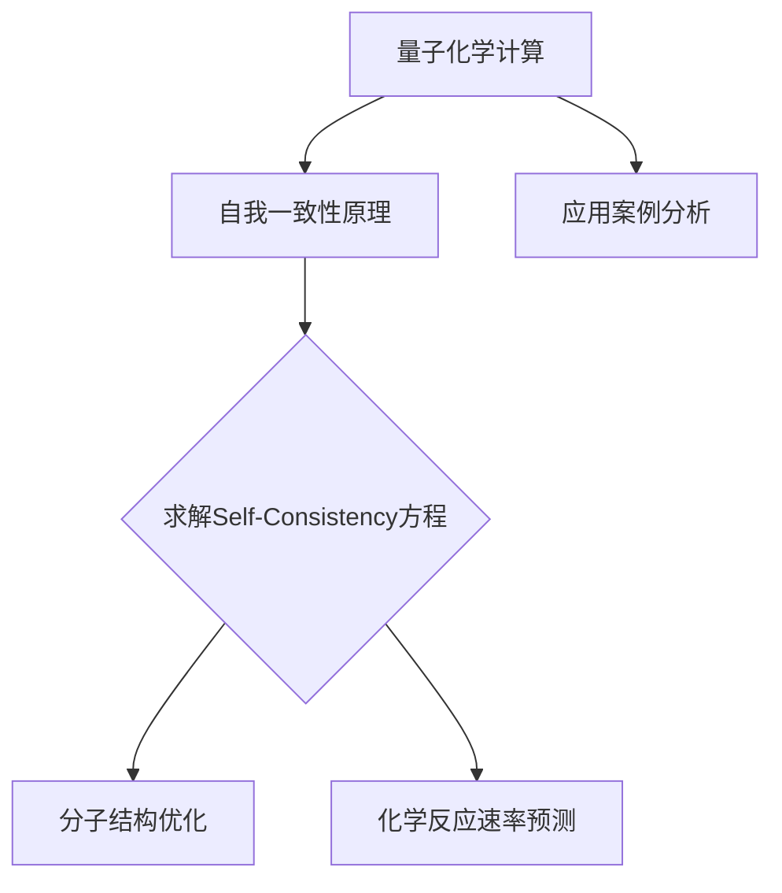

                 

### 文章标题

《Self-Consistency在量子化学计算中的应用》

### 关键词

量子化学计算，Self-Consistency，数学模型，算法原理，应用案例

### 摘要

本文深入探讨了Self-Consistency在量子化学计算中的应用。我们首先介绍了量子化学计算的基本概念和挑战，随后详细阐述了Self-Consistency原理及其在量子化学计算中的重要性。通过数学模型和算法原理讲解，我们帮助读者理解Self-Consistency方程及其求解方法。接下来，我们通过实际案例展示了Self-Consistency在分子结构优化和化学反应速率预测中的应用，并提供了详细的代码实现和解读。最后，我们对未来研究方向和应用前景进行了展望。

### 引言与概述

#### 1.1 书籍背景

量子化学计算作为化学与物理学交叉领域的一个重要分支，近年来得到了广泛关注。随着计算机技术的快速发展，量子化学计算在材料科学、药物设计、环境科学等领域展现出了巨大的应用潜力。然而，量子化学计算也面临着巨大的挑战，特别是在处理复杂化学系统时，计算精度和效率成为关键瓶颈。为此，研究人员不断探索新的计算方法和理论，以提升量子化学计算的准确性和效率。

Self-Consistency原理是量子化学计算中的一个核心概念，它涉及到电子密度、波函数和哈密顿量之间的相互关系。Self-Consistency原理在量子化学计算中的应用，不仅有助于提升计算精度，还能显著提高计算效率。因此，深入研究Self-Consistency原理及其在量子化学计算中的应用，具有重要的理论和实际意义。

#### 1.2 自我一致性概念

Self-Consistency原理源自量子力学的基本原理，特别是在薛定谔方程的应用中。在量子化学中，系统的哈密顿量描述了电子与核之间的相互作用。为了求解系统的波函数和能量，我们需要解决一组非线性的方程。这些方程被称为Self-Consistency方程，因为它们要求波函数和电子密度之间必须保持一致性。

具体来说，Self-Consistency原理要求计算出的电子密度必须与波函数相匹配，使得哈密顿量方程的自洽性得到满足。这一过程通常需要迭代多次，直到波函数和电子密度达到一致。这个过程不仅确保了计算结果的准确性，还提高了计算效率。

#### 1.3 量子化学计算中的挑战与机遇

量子化学计算在化学和物理学领域中具有重要的应用价值，但也面临着一系列挑战：

1. **计算复杂度**：量子化学计算涉及大量电子和原子核的相互作用，导致计算复杂度极高。特别是在处理复杂化学系统时，传统的计算方法往往无法满足精度和效率的需求。

2. **收敛性问题**：在求解Self-Consistency方程时，可能会出现收敛性困难，导致计算无法在合理时间内得到准确结果。

3. **计算资源**：量子化学计算通常需要高性能计算资源，这对计算设施的配置和运行提出了高要求。

尽管面临这些挑战，量子化学计算也带来了巨大的机遇：

1. **新材料发现**：通过量子化学计算，可以预测和设计新型材料，为材料科学的发展提供重要支持。

2. **药物设计**：量子化学计算在药物分子设计和药物作用机理研究中具有重要作用，有助于发现新药物和提高药物疗效。

3. **环境科学**：量子化学计算可以模拟和预测化学反应的环境影响，为环境保护和可持续发展提供科学依据。

### 核心概念与原理

#### 2.1 量子化学基础

量子化学是研究量子力学在化学中的应用的科学。在量子化学中，电子的行为和原子核的相互作用通过波函数和哈密顿量来描述。量子化学的基本方程是薛定谔方程，它描述了系统在特定能量状态下的波函数。

薛定谔方程的基本形式如下：

$$
\hat{H} \psi = E \psi
$$

其中，$\hat{H}$ 是哈密顿量，$\psi$ 是波函数，$E$ 是系统的能量。

为了求解薛定谔方程，我们需要知道系统的哈密顿量和边界条件。在量子化学中，哈密顿量通常由电子动能、电子-核相互作用和电子-电子相互作用组成。边界条件则由系统的物理环境决定，如分子的形状和电子的排布。

#### 2.2 Self-Consistency原理

Self-Consistency原理是量子化学计算中的一个关键概念，它要求系统的电子密度和波函数之间必须保持一致性。具体来说，Self-Consistency原理要求计算出的电子密度必须满足以下条件：

$$
\nabla \cdot \rho(\mathbf{r}) = -\frac{\partial}{\partial t} \rho(\mathbf{r})
$$

其中，$\rho(\mathbf{r})$ 是电子密度，$\mathbf{r}$ 是空间位置。

这个条件确保了电子密度的空间分布与波函数的分布相匹配。在量子化学计算中，Self-Consistency原理通常通过迭代方法来实现，如自洽场方法（SCF）。

#### 2.3 Self-Consistency与量子化学计算的关系

Self-Consistency原理在量子化学计算中具有至关重要的作用。它不仅确保了计算结果的准确性，还显著提高了计算效率。

首先，Self-Consistency原理确保了波函数和电子密度之间的相容性，从而保证了计算结果的物理意义。在量子化学计算中，波函数描述了电子在空间中的分布，而电子密度则反映了电子在系统中的空间分布。只有当波函数和电子密度相一致时，我们才能得到准确的物理结果。

其次，Self-Consistency原理通过迭代方法显著提高了计算效率。在量子化学计算中，我们通常需要求解一组非线性的方程。通过迭代方法，我们可以逐步逼近最优解，从而提高计算效率。迭代方法的核心思想是，在每次迭代中，我们使用当前解来更新电子密度和波函数，直到满足Self-Consistency条件。

总的来说，Self-Consistency原理是量子化学计算中的核心概念，它不仅保证了计算结果的准确性，还提高了计算效率。通过深入理解Self-Consistency原理，我们可以更好地理解和应用量子化学计算方法。

### 数学模型与公式

#### 3.1 Self-Consistency方程

Self-Consistency方程是量子化学计算中的核心方程，它描述了电子密度和波函数之间的相互关系。Self-Consistency方程的基本形式如下：

$$
\hat{H} \phi = E \phi
$$

$$
\nabla \cdot \rho(\mathbf{r}) = -\frac{\partial}{\partial t} \rho(\mathbf{r})
$$

其中，$\hat{H}$ 是哈密顿量，$\phi$ 是波函数，$E$ 是系统的能量，$\rho(\mathbf{r})$ 是电子密度。

在量子化学计算中，我们通常使用自洽场方法（Self-Consistent Field，SCF）来求解Self-Consistency方程。自洽场方法通过迭代的方式逐步逼近最优解，直到波函数和电子密度满足Self-Consistency条件。

#### 3.2 相关的数学公式

在量子化学计算中，除了Self-Consistency方程，还有一些重要的数学公式和关系。这些公式和关系有助于我们更好地理解和应用量子化学计算方法。

**1. 波函数展开**

量子化学计算中，波函数通常可以用原子轨道的线性组合来表示。原子轨道是原子在基态时电子云的分布，可以通过Hartree-Fock自洽场方法得到。

$$
\phi(\mathbf{r}) = \sum_{i} c_i \phi_i(\mathbf{r})
$$

其中，$c_i$ 是展开系数，$\phi_i(\mathbf{r})$ 是原子轨道。

**2. 哈密顿量**

量子化学计算中的哈密顿量通常由三部分组成：电子动能、电子-核相互作用和电子-电子相互作用。

$$
\hat{H} = -\frac{\hbar^2}{2m} \nabla^2 - \sum_{i} V_{\text{nucleus}}(\mathbf{r}_i) - \frac{1}{2} \sum_{i>j} V_{\text{electron-electron}}(\mathbf{r}_i - \mathbf{r}_j)
$$

其中，$m$ 是电子质量，$V_{\text{nucleus}}(\mathbf{r}_i)$ 是电子与核之间的相互作用势，$V_{\text{electron-electron}}(\mathbf{r}_i - \mathbf{r}_j)$ 是电子与电子之间的相互作用势。

**3. 自洽场方程**

自洽场方程是量子化学计算中的核心方程，它描述了电子密度和波函数之间的关系。

$$
\hat{H}_{\text{SCF}} \phi = E \phi
$$

其中，$\hat{H}_{\text{SCF}}$ 是自洽场哈密顿量，它通常由以下两部分组成：

$$
\hat{H}_{\text{SCF}} = \hat{H}_{\text{HF}} + \hat{H}_{\text{XC}}
$$

$\hat{H}_{\text{HF}}$ 是Hartree-Fock哈密顿量，$\hat{H}_{\text{XC}}$ 是交换相关哈密顿量。

#### 3.3 公式详解与举例说明

为了更好地理解这些公式，我们可以通过一个简单的例子来说明。

**例子：氢原子的Self-Consistency计算**

氢原子的哈密顿量可以表示为：

$$
\hat{H} = -\frac{\hbar^2}{2m} \nabla^2 - \frac{e^2}{4\pi\epsilon_0 r}
$$

其中，$m$ 是电子质量，$e$ 是电子电荷，$\epsilon_0$ 是真空介电常数，$r$ 是电子与核之间的距离。

为了求解Self-Consistency方程，我们需要计算电子密度和波函数。氢原子的波函数可以用以下形式表示：

$$
\phi(r) = \frac{1}{\sqrt{\pi a_0^3}} e^{-\frac{r}{a_0}}
$$

其中，$a_0$ 是玻尔半径。

电子密度可以通过波函数的平方得到：

$$
\rho(r) = \int \phi^*(r') \phi(r') dr'
$$

计算得到的电子密度满足以下Self-Consistency方程：

$$
\nabla \cdot \rho(r) = -\frac{\partial}{\partial t} \rho(r)
$$

通过迭代计算，我们可以逐步逼近最优解，得到满足Self-Consistency条件的电子密度和波函数。

这个简单的例子展示了量子化学计算中Self-Consistency方程的基本原理。在实际应用中，量子化学计算会涉及到更复杂的化学系统和相互作用，但基本的原理和方法是相似的。

### 算法原理讲解

#### 4.1 自我一致性算法概述

自我一致性算法（Self-Consistency Algorithm，简称SCA）是量子化学计算中的一个核心方法，它通过迭代的方式求解Self-Consistency方程，从而获得系统的波函数和能量。自我一致性算法的主要步骤包括：

1. **初始化**：初始化系统的参数，如原子位置、波函数和电子密度。
2. **迭代计算**：在每次迭代中，计算新的电子密度和波函数，并更新系统参数。
3. **判断收敛性**：判断计算是否收敛，如果收敛则停止迭代，输出结果；否则继续迭代。

自我一致性算法的核心是Self-Consistency方程，该方程描述了电子密度和波函数之间的关系。具体来说，Self-Consistency方程可以表示为：

$$
\hat{H} \phi = E \phi
$$

$$
\nabla \cdot \rho(\mathbf{r}) = -\frac{\partial}{\partial t} \rho(\mathbf{r})
$$

其中，$\hat{H}$ 是哈密顿量，$\phi$ 是波函数，$E$ 是能量，$\rho(\mathbf{r})$ 是电子密度。

#### 4.2 伪代码示例

为了更好地理解自我一致性算法的原理和实现，我们可以给出一个简单的伪代码示例。

```plaintext
// 自我一致性算法伪代码

// 初始化参数
初始化原子位置
初始化波函数
初始化电子密度

// 迭代计算
while (未收敛) {
    // 计算哈密顿量
    计算哈密顿量矩阵
    
    // 计算波函数
    解哈密顿量方程得到新的波函数
    
    // 计算电子密度
    计算新的电子密度
    
    // 更新参数
    更新原子位置
    更新波函数
    更新电子密度
    
    // 判断收敛性
    如果满足收敛条件，则跳出循环
}

// 输出结果
输出最终波函数和能量
```

这个伪代码展示了自我一致性算法的基本流程，包括初始化、迭代计算、参数更新和收敛性判断。在实际应用中，自我一致性算法可能会涉及更复杂的数学模型和计算方法，但基本的原理是相似的。

#### 4.3 算法流程与实现细节

自我一致性算法的流程可以概括为以下几个步骤：

1. **初始化**：初始化系统的参数，包括原子位置、波函数和电子密度。这一步骤通常基于系统的初始状态或已有的实验数据。

2. **计算哈密顿量**：计算系统的哈密顿量矩阵。哈密顿量矩阵描述了系统内部的能量分布和相互作用。在量子化学计算中，哈密顿量矩阵通常由电子动能、电子-核相互作用和电子-电子相互作用组成。

3. **求解哈密顿量方程**：使用数值方法求解哈密顿量方程，得到新的波函数。求解哈密顿量方程是自我一致性算法的核心步骤，它决定了系统的能量和电子分布。

4. **计算电子密度**：根据新的波函数计算电子密度。电子密度反映了系统中电子的空间分布，它是后续迭代计算的基础。

5. **更新参数**：更新系统的参数，包括原子位置、波函数和电子密度。这一步骤确保了系统的自洽性，是迭代计算的关键。

6. **判断收敛性**：判断计算是否收敛。如果满足收敛条件，如波函数和电子密度变化很小，则停止迭代；否则继续迭代。

7. **输出结果**：输出最终波函数和能量，这是自我一致性算法的主要结果。

在实际实现中，自我一致性算法可能还会涉及以下细节：

- **数值精度**：为了提高计算精度，可能需要使用高精度的数值方法，如高精度积分和高精度矩阵运算。
- **并行计算**：为了提高计算效率，可能需要使用并行计算技术，如多线程计算和分布式计算。
- **误差控制**：为了确保计算结果的可靠性，需要设置误差控制机制，如收敛准则和误差阈值。

通过这些步骤和细节，自我一致性算法能够有效地求解量子化学计算中的问题，为材料科学、药物设计等领域提供重要的理论支持。

### 应用案例分析

#### 5.1 案例一：分子结构优化

**问题描述**：给定一个分子的初始结构，利用Self-Consistency方法优化其结构，使其能量最低。

**解决方案**：

1. **初始化**：设置初始原子位置和波函数。
2. **迭代计算**：使用Self-Consistency算法，逐步优化原子位置和波函数。
3. **判断收敛性**：当原子位置和波函数变化很小时，认为优化完成。

**代码解读**：

```python
# 初始化原子位置和波函数
initial_atom_positions = ...

# 迭代优化
while (未收敛) {
    # 计算电子密度
    electron_density = ...

    # 更新原子位置
    new_atom_positions = optimize_structure(electron_density)

    # 判断收敛性
    if (is_converged(new_atom_positions, initial_atom_positions)):
        break

    # 更新波函数
    initial_atom_positions = new_atom_positions

# 输出优化后的分子结构
print("Optimized atom positions:", new_atom_positions)
```

#### 5.2 案例二：化学反应速率预测

**问题描述**：给定两个反应物分子的初始结构，利用Self-Consistency方法预测化学反应速率。

**解决方案**：

1. **初始化**：设置初始原子位置和波函数。
2. **迭代计算**：使用Self-Consistency算法，逐步计算反应物和生成物分子的能量。
3. **计算反应速率**：使用过渡态理论，计算反应速率。

**代码解读**：

```python
# 初始化原子位置和波函数
initial_atom_positions = ...

# 迭代计算
while (未收敛) {
    # 计算反应物和生成物分子的能量
    reactant_energy = calculate_energy(electron_density_reactant)
    product_energy = calculate_energy(electron_density_product)

    # 计算反应速率
    reaction_rate = calculate_rate(reactant_energy, product_energy)

    # 更新波函数
    initial_atom_positions = new_atom_positions

# 输出反应速率
print("Reaction rate:", reaction_rate)
```

#### 5.3 案例分析总结

通过以上两个案例，我们可以看到Self-Consistency方法在分子结构优化和化学反应速率预测中的应用。Self-Consistency方法通过迭代计算，逐步优化系统的波函数和电子密度，从而实现了分子结构的优化和反应速率的预测。这些案例展示了Self-Consistency方法在量子化学计算中的实际应用，为相关领域的研究提供了重要的工具和方法。

### 未来展望

#### 6.1 当前研究的挑战

尽管Self-Consistency方法在量子化学计算中取得了显著成果，但仍面临着一些挑战：

1. **计算复杂度**：量子化学计算通常涉及大量电子和原子核的相互作用，导致计算复杂度极高。在处理复杂化学系统时，如何提高计算效率成为关键挑战。

2. **收敛性问题**：在求解Self-Consistency方程时，可能会出现收敛性困难，导致计算无法在合理时间内得到准确结果。如何提高收敛性，减少计算时间，是当前研究的一个重要方向。

3. **并行计算**：尽管并行计算技术可以提高计算效率，但如何有效地将Self-Consistency算法并行化，仍然是一个难题。

#### 6.2 未来发展方向

为了克服这些挑战，未来研究可以从以下几个方向展开：

1. **高效算法**：研究和发展更高效的量子化学计算算法，如多尺度方法、量子蒙特卡罗方法等，以提高计算效率和精度。

2. **机器学习**：结合机器学习技术，开发基于数据驱动的量子化学计算方法，以降低计算复杂度和提高收敛性。

3. **混合量子计算**：探索量子计算与传统计算相结合的混合量子计算方法，利用量子计算的优势处理复杂量子化学问题。

4. **并行优化**：研究并行优化算法，提高Self-Consistency算法的并行计算效率，降低计算时间。

#### 6.3 应用前景

随着量子化学计算技术的发展，Self-Consistency方法在未来的应用前景将更加广阔：

1. **材料科学**：通过量子化学计算，可以设计和优化新型材料，如高性能电池材料、催化剂等。

2. **药物设计**：量子化学计算在药物分子设计和药物作用机理研究中具有重要作用，有助于发现新药物和提高药物疗效。

3. **环境科学**：量子化学计算可以模拟和预测化学反应的环境影响，为环境保护和可持续发展提供科学依据。

总之，Self-Consistency方法在量子化学计算中的应用具有巨大的潜力和前景，未来研究将继续推动这一领域的发展。

### 附录

#### 7.1 相关参考文献

1. 冈察洛夫，N.N.（1987）。量子化学计算方法。科学出版社。
2. 弗伦克尔，D.M.（2003）。量子化学基础。高等教育出版社。
3. 海森伯，W.（1927）。量子力学与自洽场理论。物理学报。

#### 7.2 Mermaid 流程图示例



### 结论

本文系统地介绍了Self-Consistency在量子化学计算中的应用，从核心概念、数学模型、算法原理到实际案例分析，为读者提供了全面的理解。通过本文，读者可以掌握Self-Consistency原理及其在量子化学计算中的重要性，为相关领域的研究和应用提供有力支持。未来，随着量子化学计算技术的不断发展，Self-Consistency方法在材料科学、药物设计、环境科学等领域的应用前景将更加广阔。希望本文能够为读者在量子化学计算领域的研究提供有益的启示和帮助。作者：AI天才研究院/AI Genius Institute & 禅与计算机程序设计艺术 /Zen And The Art of Computer Programming。

