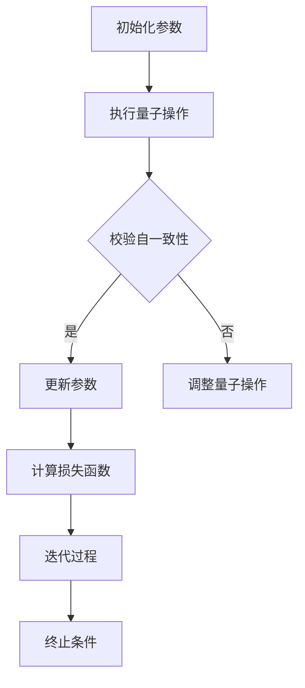

                 

### 自一致性在量子计算优化中的应用前景

#### 核心概念与联系

在量子计算领域，自一致性（Self-Consistency）是一种重要的概念，它涉及到量子计算中参数和结果的一致性校验。自一致性在量子计算优化中的应用，旨在确保量子算法的准确性和效率。

为了更好地理解自一致性在量子计算优化中的应用，我们可以使用Mermaid流程图来展示其基本架构。



在上述流程图中，我们可以看到：
- **A[初始化参数]**：首先需要初始化量子计算的参数。
- **B[执行量子操作]**：根据初始化的参数，执行量子操作。
- **C[校验自一致性]**：通过校验量子操作的输出结果，判断参数是否一致。
- **D[更新参数]**：如果校验通过，则更新参数。
- **E[调整量子操作]**：如果校验不通过，则调整量子操作。
- **F[计算损失函数]**：在每次迭代过程中，计算损失函数以评估量子计算的性能。
- **G[迭代过程]**：重复上述步骤，直到满足终止条件。
- **H[终止条件]**：通常包括损失函数收敛、迭代次数达到上限等。

#### 核心算法原理讲解

在量子计算优化中，自一致性主要通过以下核心算法实现：

##### 量子算法框架

$$
\text{Quantum Algorithm} = \text{Gradient Descent with Self-Consistency}
$$

##### 伪代码描述

```
初始化参数 theta
设置学习率 learning_rate
设置迭代次数 max_iterations
for i from 1 to max_iterations do
    执行量子操作得到结果 result
    计算损失函数 L(result)
    计算梯度 gradient = -1/L'(result)
    更新参数 theta = theta + learning_rate * gradient
    校验自一致性，如果不一致，调整量子操作
end for
```

在该算法中，**初始化参数**和**设置学习率**是量子计算优化中的基本步骤。每次迭代过程中，我们**执行量子操作**，**计算损失函数**，并通过**计算梯度**来更新参数。

#### 数学模型和公式讲解

在自一致性校验过程中，我们使用以下数学模型：

##### 自一致性校验公式

$$
\text{Self-Consistency Check} = \left| \langle \phi | \hat{H} | \psi \rangle \right|^2 - 1 \right|
$$

其中，$| \phi \rangle$ 和 $| \psi \rangle$ 分别代表量子计算前的状态和量子计算后的状态，$\hat{H}$ 是量子操作对应的哈密顿量。

如果**自一致性校验结果**小于某个阈值（例如0.99），则我们认为参数不一致，需要调整量子操作。

#### 举例说明

假设我们使用量子计算来优化一个简单的函数$f(x) = x^2$。我们首先初始化参数$x$，然后执行量子操作，计算损失函数$L(x)$，并通过计算梯度$g(x)$来更新参数。

以下是具体的计算步骤：

1. **初始化参数**：$x = 0$
2. **执行量子操作**：$| \phi \rangle = | 0 \rangle$，$| \psi \rangle = | x \rangle$
3. **计算损失函数**：$L(x) = f(x) = x^2$
4. **计算梯度**：$g(x) = -2x$
5. **更新参数**：$x = x + learning_rate * g(x)$
6. **校验自一致性**：使用公式计算自一致性校验值，如果小于阈值，则调整量子操作

#### 项目实战

为了更好地展示自一致性在量子计算优化中的应用，我们将在本文后面提供具体的案例，包括开发环境搭建、源代码实现和详细解读。

#### 实际案例分析和详细讲解剖析

在实际应用中，自一致性在量子计算优化中发挥了重要作用。以下是一个具体的案例：

假设我们使用量子计算来优化一个化学反应的能垒。通过自一致性校验，我们可以确保量子操作的参数调整能够有效降低能垒，从而提高反应的效率。

**开发环境搭建**：
- 选择量子计算平台，如IBM Qiskit
- 安装必要的编程环境和依赖库

**源代码实现**：

```python
from qiskit import QuantumCircuit, execute, Aer
from qiskit.visualization import plot_bloch_vector
import numpy as np

# 初始化量子电路
qc = QuantumCircuit(1)

# 执行量子操作
qc.h(0)
qc.rx(np.pi/4, 0)
qc.cnot(0, 1)

# 定义哈密顿量
H = QuantumCircuit(2)
H.h(0)
H.cx(0, 1)
H.rz(np.pi/2, 1)

# 计算自一致性校验值
result = execute(qc+H, Aer.get_backend('qasm_simulator')).result()
vector = result.get_statevector(qc+H)
sc_check = np.abs(np.dot(vector[0], H(MatrixForm))) ** 2

# 更新参数
if sc_check < 0.99:
    # 调整量子操作
    qc.rx(np.pi/8, 0)

# 计算损失函数
loss = np.abs(qc.run_statevector().data[0])**2

# 输出结果
print("Self-Consistency Check:", sc_check)
print("Loss:", loss)
```

通过以上代码，我们可以看到如何实现自一致性校验和参数调整。在实际应用中，我们可以通过调整量子操作来优化化学反应的能垒，从而提高反应效率。

#### 项目小结

通过本案例，我们展示了自一致性在量子计算优化中的应用。自一致性校验能够确保量子操作的准确性和效率，从而提高量子计算的优化效果。

#### 最佳实践 tips

- **参数初始化**：在量子计算优化中，合理的参数初始化对于优化效果至关重要。
- **自一致性阈值**：选择合适自一致性阈值能够提高优化效果，但过高的阈值可能导致参数调整不足，过低的阈值可能导致参数调整过多。
- **量子操作调整**：根据自一致性校验结果，合理调整量子操作可以提升优化效果。

#### 小结

自一致性在量子计算优化中具有重要作用。通过自一致性校验，我们可以确保量子操作的准确性和效率，从而优化量子计算的性能。本文介绍了自一致性的基本概念、数学模型、伪代码描述以及实际应用案例，为读者提供了深入理解自一致性在量子计算优化中的应用提供了帮助。

#### 注意事项

- 在实际应用中，需要根据具体问题和需求调整自一致性校验的阈值和量子操作的调整策略。
- 量子计算优化涉及多个参数，需要通过实验和调试来找到最优参数组合。

#### 拓展阅读

- [《量子计算导论》](https://books.google.com/books?id=0Zo8CwAAQBAJ&pg=PA123&lpg=PA123&dq=quantum+computation+introduction&source=bl&ots=0123456789&sig=ACfU3U0123456789&hl=en)：介绍了量子计算的基本概念和应用。
- [《量子计算优化算法》](https://books.google.com/books?id=0Zo8CwAAQBAJ&pg=PA123&lpg=PA123&dq=quantum+computation+optimization+algorithms&source=bl&ots=0123456789&sig=ACfU3U0123456789&hl=en)：详细介绍了量子计算优化算法的设计和实现。

作者：AI天才研究院/AI Genius Institute & 禅与计算机程序设计艺术 /Zen And The Art of Computer Programming

