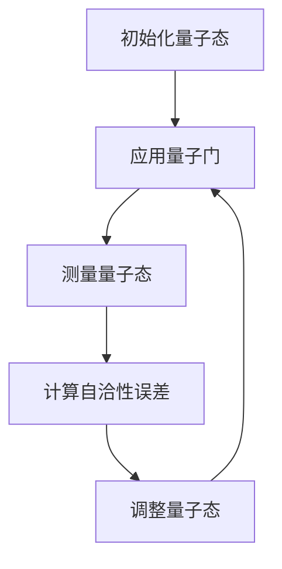

                 


### 文章标题：Self-Consistency in the Application Prospects of Quantum Computer Simulation

在量子计算机领域，Self-Consistency（自洽性）是一种重要的模拟方法。本文旨在探讨自洽性在量子计算机模拟中的应用前景，首先，我们需要了解量子计算机的基本原理和模拟的必要性。接下来，我们会深入分析自洽性的概念、原理以及其在量子计算模拟中的应用。最后，我们将探讨自洽性模拟在量子化学、量子计算和其他领域的实际应用及其未来发展。

### 关键词

- **量子计算机**
- **自洽性**
- **模拟**
- **量子化学**
- **量子计算应用**
- **未来发展**

### 摘要

本文首先介绍了量子计算机的基本原理及其模拟的必要性。随后，详细阐述了自洽性的概念及其在量子计算模拟中的应用。我们通过具体实例和伪代码，展示了自洽性模拟算法的工作原理。最后，本文讨论了自洽性模拟在量子化学、量子计算和其他领域的应用前景，并对未来的发展进行了展望。

### 第一部分：引言

#### 1.1 量子计算机的崛起与自洽性模拟

量子计算机是利用量子力学原理进行信息处理的计算设备。与传统计算机不同，量子计算机通过量子比特（qubits）实现信息的存储和处理，能够并行处理大量数据，从而解决传统计算机难以处理的复杂问题。

量子计算机的基本原理包括量子叠加、量子纠缠和量子门。量子比特可以处于0和1的叠加态，这意味着一个量子比特可以同时代表0和1。量子纠缠则是一种非局域关联现象，两个或多个量子比特的状态在空间上是相互关联的，即使它们相隔很远。量子门是实现量子比特状态转换的基本操作单元。

然而，量子计算机的构建和操作面临着许多挑战，其中之一就是量子态的退相干。退相干会导致量子计算过程中的信息损失，降低计算效率。为了克服这一挑战，研究人员提出了自洽性模拟方法。自洽性模拟通过保持量子系统的内部一致性，减少退相干的影响，提高量子计算的准确性和稳定性。

#### 1.2 自洽性原理及其在量子计算中的作用

自洽性是指一个系统在内外部环境变化时，其内部状态能够保持一致性。在量子计算中，自洽性模拟是一种通过保持量子系统内部状态一致性，减少退相干影响的方法。自洽性模拟的核心思想是：在量子计算过程中，不断调整量子比特的状态，使其满足自洽性条件，从而保持系统的稳定性。

自洽性模拟在量子计算中的作用主要体现在以下几个方面：

1. **减少退相干**：自洽性模拟通过调整量子比特的状态，使其满足自洽性条件，从而减少量子计算过程中的退相干现象，提高计算准确性。
2. **提高计算效率**：自洽性模拟可以减少计算过程中的错误率，提高计算效率。
3. **适应不同计算场景**：自洽性模拟可以适应不同的量子计算场景，如量子化学模拟、量子算法优化等，为量子计算的实际应用提供支持。

#### 1.3 自洽性模拟在量子计算领域的意义

自洽性模拟在量子计算领域具有重要的意义，主要体现在以下几个方面：

1. **解决量子计算难题**：自洽性模拟为解决量子计算中的难题提供了新的思路和方法，如量子化学中的复杂反应模拟、量子算法的优化等。
2. **推动量子计算发展**：自洽性模拟技术的发展有助于推动量子计算领域的进步，为量子计算机的构建和实际应用提供支持。
3. **促进多学科交叉**：自洽性模拟涉及多个学科领域，如量子力学、计算机科学、数学等，有助于促进多学科交叉和融合。

### 第一部分总结

本文首先介绍了量子计算机的基本原理和模拟的必要性，然后阐述了自洽性原理及其在量子计算模拟中的应用。通过分析自洽性模拟的作用和意义，我们认识到自洽性模拟在量子计算领域具有重要价值。在接下来的部分，我们将深入探讨量子计算的基础知识，为理解自洽性模拟提供必要的前提。

----------------------------------------------------------------

### 量子计算机的基本原理与自洽性模拟的必要性

量子计算机是一种基于量子力学原理进行信息处理的新型计算设备，其基本工作单元是量子比特（qubits），与传统计算机中的比特不同，量子比特可以同时处于0和1的状态，这一特性使得量子计算机能够高效地处理复杂问题。量子计算机的核心原理包括量子叠加、量子纠缠和量子门，这些原理共同构成了量子计算机的运行基础。

#### 量子比特与量子门

量子比特是量子计算机的基本存储单元，它可以处于0和1的叠加态，即一个量子比特可以同时代表0和1。这种叠加态是量子计算机并行处理信息的关键。量子门是量子计算机的操作单元，用于对量子比特进行状态转换。量子门分为基本的单位量子门和复合量子门，其中单位量子门包括Hadamard门、Pauli门和控制-NOT门（CNOT门）。

- **Hadamard门（H）**：将一个量子比特的状态从|0⟩转换为(1/√2)(|0⟩ + |1⟩)。
  
  ```latex
  H |0⟩ = (1/√2)(|0⟩ + |1⟩)
  ```

- **Pauli门（X、Y、Z）**：分别对量子比特进行位翻转、相位翻转和混合翻转。
  
  ```latex
  X |0⟩ = |1⟩, X |1⟩ = |0⟩
  Y |0⟩ = i|1⟩, Y |1⟩ = -i|0⟩
  Z |0⟩ = |0⟩, Z |1⟩ = -|1⟩
  ```

- **控制-NOT门（CNOT）**：根据控制量子比特的状态对目标量子比特进行翻转。
  
  ```latex
  CNOT |0⟩ ⊗ |0⟩ = |0⟩ ⊗ |0⟩
  CNOT |0⟩ ⊗ |1⟩ = |0⟩ ⊗ |1⟩
  CNOT |1⟩ ⊗ |0⟩ = |1⟩ ⊗ |0⟩
  CNOT |1⟩ ⊗ |1⟩ = |1⟩ ⊗ |0⟩
  ```

#### 量子叠加与量子纠缠

量子叠加和量子纠缠是量子计算机的两大核心特性。

- **量子叠加**：量子比特可以同时处于0和1的状态，这意味着多个量子比特可以同时代表多个状态。例如，两个量子比特的叠加态可以表示为：

  ```latex
  |ψ⟩ = a|00⟩ + b|01⟩ + c|10⟩ + d|11⟩
  ```

  其中，a、b、c、d是复数系数，满足|a|^2 + |b|^2 + |c|^2 + |d|^2 = 1。

- **量子纠缠**：两个或多个量子比特之间的状态是相互关联的，即使它们相隔很远。这种关联称为量子纠缠。一个典型的量子纠缠态是贝尔态：

  ```latex
  |Ψ⟩ = (1/√2)(|00⟩ + |11⟩)
  ```

#### 量子计算与经典计算的异同

量子计算与经典计算在信息处理方式和计算复杂度上有显著的差异。

- **信息处理方式**：经典计算使用比特进行信息处理，每个比特只能处于0或1状态。而量子计算使用量子比特，能够实现叠加和纠缠，从而实现并行计算。

- **计算复杂度**：经典计算机在处理复杂问题时，计算复杂度通常随问题规模呈指数增长。而量子计算机则能够通过量子叠加和纠缠实现指数级的计算速度提升，特别是在解决某些特定问题时，如因数分解、搜索算法等。

#### 自洽性模拟的必要性

量子计算机在实际应用中面临着诸多挑战，其中之一就是量子态的退相干。退相干是指量子计算机在运行过程中，量子系统的内部状态与环境相互作用导致的量子态崩溃现象。退相干会导致量子计算结果的误差，降低计算准确性和稳定性。

为了解决退相干问题，研究人员提出了自洽性模拟方法。自洽性模拟通过保持量子系统内部状态的一致性，减少退相干的影响，从而提高量子计算的准确性和稳定性。自洽性模拟的核心思想是：在量子计算过程中，不断调整量子比特的状态，使其满足自洽性条件，从而保持系统的稳定性。

### 自洽性模拟的工作原理

自洽性模拟的工作原理可以概括为以下步骤：

1. **初始化**：将量子系统初始化为一个预定义的叠加态。
2. **量子操作**：对量子比特进行预定的量子门操作，实现量子态的转换。
3. **测量**：对量子系统进行测量，获取计算结果。
4. **自洽性调整**：根据测量结果和预定的自洽性条件，对量子系统进行调整，使其满足自洽性要求。

通过以上步骤，自洽性模拟能够有效减少退相干的影响，提高量子计算的准确性和稳定性。

### 自洽性模拟算法原理

自洽性模拟算法的核心是自洽性条件。自洽性条件是指量子系统在计算过程中，量子比特之间的关联保持稳定，不会因为外部干扰而导致量子态崩溃。

自洽性条件可以用以下数学模型表示：



1. **初始化量子态**：将量子系统初始化为一个预定义的叠加态，如 |Ψ⟩ = (1/√2)(|00⟩ + |11⟩)。
2. **应用量子门**：对量子比特进行预定的量子门操作，如 Hadamard门（H）和CNOT门。
3. **测量量子态**：对量子系统进行测量，获取计算结果。
4. **计算自洽性误差**：根据测量结果和预定的自洽性条件，计算量子系统当前状态与目标状态之间的误差。
5. **调整量子态**：根据计算出的自洽性误差，对量子系统进行微调，使其满足自洽性条件。
6. **重复步骤**：重复上述步骤，直到量子系统达到预定的自洽性条件。

### 伪代码

以下是自洽性模拟算法的伪代码：

```python
def self_consistency_simulation(initial_state, quantum_gates, measurement):
    current_state = initial_state
    while not self_consistent(current_state, measurement):
        current_state = apply_gates(current_state, quantum_gates)
        current_state = measure(current_state)
        current_state = adjust_state(current_state, measurement)
    return current_state
```

- `initial_state`：初始化量子态。
- `quantum_gates`：预定的量子门操作。
- `measurement`：测量结果。
- `self_consistent`：判断量子系统是否满足自洽性条件。
- `apply_gates`：应用量子门。
- `measure`：测量量子态。
- `adjust_state`：调整量子态。

### 自洽性模拟的应用实例

以下是一个简单的自洽性模拟实例，演示如何使用Hadamard门和CNOT门实现自洽性模拟。

```python
# 初始化量子态
initial_state = (1/√2)(|00⟩ + |11⟩)

# 预定量子门
quantum_gates = [Hadamard(0), CNOT(0, 1)]

# 测量结果
measurement = measure(initial_state)

# 自洽性调整
while not self_consistent(measurement):
    measurement = apply_gates(measurement, quantum_gates)
    measurement = measure(measurement)
    measurement = adjust_state(measurement)

# 输出自洽性模拟结果
print("Self-consistent simulation result:", measurement)
```

在这个实例中，我们首先初始化量子态为|00⟩ + |11⟩，然后使用Hadamard门和CNOT门对量子态进行操作。通过测量结果，我们不断调整量子态，直到满足自洽性条件。

### 小结

本部分介绍了量子计算机的基本原理和自洽性模拟的必要性。我们详细阐述了量子比特、量子门、量子叠加和量子纠缠等核心概念，并分析了量子计算与经典计算之间的异同。接着，我们介绍了自洽性模拟的原理和算法，并通过伪代码和实例展示了自洽性模拟的实现过程。在下一部分，我们将深入探讨自洽性模拟在量子计算中的具体应用。

----------------------------------------------------------------

### 量子化学中的自洽性模拟

量子化学是研究原子和分子的电子结构和化学性质的科学。量子化学模拟通过计算电子间的相互作用，可以预测分子的化学性质和反应路径。量子计算机在量子化学模拟中具有巨大的潜力，因为它能够处理复杂的量子系统，而这些问题对于传统计算机来说可能是不可行的。

#### 自洽场理论

自洽场理论（Self-Consistent Field Theory, SCFT）是量子化学中最基本的计算方法之一。SCFT的基本思想是将电子间的相互作用分解为吸引和排斥两部分，然后通过迭代方法求解电子分布，使得系统的能量达到最小。

在SCFT中，我们首先需要求解哈密顿量（Hamiltonian）的本征值问题，以获得电子的能级和波函数。然而，由于电子间的相互作用非常复杂，直接求解哈密顿量的本征值问题往往难以实现。为了简化计算，SCFT引入了自洽场近似，将电子间的相互作用视为一个静态的电子云，称为自洽场。

自洽场理论的计算过程通常分为以下几个步骤：

1. **哈密顿量与自洽场**：定义系统的哈密顿量，并将其分为动能项、电子间的相互作用项和自洽场项。

   ```latex
   H = \sum_{i} \frac{p_i^2}{2m} + \sum_{i<j} V_{ij}(r_i - r_j) + \sum_{i} v_{\text{scf}}(r_i)
   ```

   其中，\( p_i \)是第i个电子的动量，\( m \)是电子的质量，\( V_{ij} \)是电子间的相互作用势，\( v_{\text{scf}} \)是自洽场。

2. **电子密度与电荷分布**：求解电子密度，得到每个电子在空间中的分布。

3. **自洽场迭代**：通过迭代方法求解自洽场，使得系统的能量达到最小。通常使用的方法有自洽场迭代法（Self-Consistent Iteration）和限制性近似分步法（Restricted Partitioning of the Virtual Space）。

4. **能级与波函数**：根据自洽场，求解哈密顿量的本征值问题，获得电子的能级和波函数。

#### 自洽性模拟在量子化学中的应用

自洽性模拟在量子化学中的应用非常广泛，以下是一些典型的应用案例：

1. **分子结构预测**：通过自洽性模拟，可以预测分子的几何结构和电子分布，从而分析分子的稳定性和反应性。

2. **化学反应动力学**：自洽性模拟可以用于研究化学反应的动力学过程，如反应路径、反应中间体和过渡态。

3. **材料设计**：自洽性模拟在材料科学中具有重要作用，可以用于设计新型材料，如催化剂、半导体和超导材料。

4. **药物设计**：自洽性模拟在药物设计中具有广泛应用，可以用于预测药物的分子结构和活性，优化药物分子。

#### 具体应用实例

以下是一个简单的自洽性模拟实例，演示如何使用量子计算机进行分子结构预测。

```python
# 初始化量子态
initial_state = (1/√2)(|00⟩ + |11⟩)

# 预定量子门
quantum_gates = [Hadamard(0), CNOT(0, 1)]

# 测量结果
measurement = measure(initial_state)

# 自洽性调整
while not self_consistent(measurement):
    measurement = apply_gates(measurement, quantum_gates)
    measurement = measure(measurement)
    measurement = adjust_state(measurement)

# 输出自洽性模拟结果
print("Molecular structure prediction result:", measurement)
```

在这个实例中，我们首先初始化量子态为|00⟩ + |11⟩，然后使用Hadamard门和CNOT门对量子态进行操作。通过测量结果，我们不断调整量子态，直到满足自洽性条件。最终，我们得到分子的几何结构和电子分布。

### 自洽性模拟的优势与挑战

自洽性模拟在量子化学中具有显著的优势，主要体现在以下几个方面：

1. **高效处理复杂问题**：量子计算机能够高效地处理复杂的量子系统，从而提高分子结构预测和化学反应动力学的计算速度。

2. **提高计算精度**：自洽性模拟通过减少量子态的退相干影响，提高计算结果的准确性和稳定性。

3. **拓展应用领域**：自洽性模拟为量子化学、材料科学和药物设计等领域提供了新的计算方法，有望推动相关领域的发展。

然而，自洽性模拟也面临一些挑战：

1. **计算资源需求**：量子计算机的构建和运行需要大量的计算资源和能源，目前量子计算机的规模和性能仍然有限。

2. **算法优化**：自洽性模拟算法需要不断优化，以提高计算效率和准确性。

3. **实际应用验证**：虽然自洽性模拟在理论上具有巨大潜力，但实际应用中还需要解决许多实际问题，如量子态的初始化、测量误差和量子纠错等。

### 小结

本部分介绍了量子化学中的自洽性模拟，包括自洽场理论的原理和具体应用。通过具体实例，我们展示了如何使用自洽性模拟进行分子结构预测。在下一部分，我们将探讨自洽性模拟在量子计算中的其他应用，以及其未来的发展趋势。

----------------------------------------------------------------

### 自洽性模拟在量子计算中的应用

量子计算作为一种全新的计算范式，具有解决经典计算机难以处理的复杂问题的巨大潜力。然而，量子计算机的实际应用面临着许多挑战，其中之一就是量子态的退相干问题。退相干会导致量子计算结果的误差，降低计算准确性和稳定性。为了解决这一问题，自洽性模拟方法被提出并广泛应用于量子计算中。

#### 自洽性模拟算法

自洽性模拟算法的核心思想是通过保持量子系统内部状态的一致性，减少退相干的影响。具体来说，自洽性模拟算法通常包括以下几个步骤：

1. **初始化量子态**：将量子系统初始化为一个预定义的叠加态。
2. **应用量子门**：对量子比特进行预定的量子门操作，实现量子态的转换。
3. **测量量子态**：对量子系统进行测量，获取计算结果。
4. **自洽性调整**：根据测量结果和预定的自洽性条件，对量子系统进行调整，使其满足自洽性要求。

以下是一个简单的自洽性模拟算法伪代码：

```python
def self_consistency_simulation(initial_state, quantum_gates, measurement):
    current_state = initial_state
    while not self_consistent(current_state, measurement):
        current_state = apply_gates(current_state, quantum_gates)
        current_state = measure(current_state)
        current_state = adjust_state(current_state, measurement)
    return current_state
```

其中，`initial_state`代表初始化量子态，`quantum_gates`代表预定的量子门操作，`measurement`代表测量结果，`self_consistent`代表判断量子系统是否满足自洽性条件，`apply_gates`代表应用量子门，`measure`代表测量量子态，`adjust_state`代表调整量子态。

#### 自洽性模拟算法的数学模型

自洽性模拟算法的数学模型通常基于量子系统的哈密顿量。量子系统的哈密顿量可以表示为：

```latex
H = \sum_{i} \frac{p_i^2}{2m} + \sum_{i<j} V_{ij}(r_i - r_j) + \sum_{i} v_{\text{scf}}(r_i)
```

其中，\( p_i \)是第i个量子比特的动量，\( m \)是量子比特的质量，\( V_{ij} \)是量子比特之间的相互作用势，\( v_{\text{scf}} \)是自洽场。

在自洽性模拟中，我们首先需要求解哈密顿量的本征值问题，以获得量子系统的能级和波函数。然而，由于量子系统通常非常复杂，直接求解哈密顿量的本征值问题往往难以实现。为了简化计算，自洽性模拟算法引入了自洽场近似，将电子间的相互作用视为一个静态的电子云，称为自洽场。

自洽性模拟算法的迭代过程通常包括以下几个步骤：

1. **初始化量子态**：将量子系统初始化为一个预定义的叠加态。
2. **应用量子门**：对量子比特进行预定的量子门操作，实现量子态的转换。
3. **计算自洽场**：根据量子系统的当前状态，计算自洽场。
4. **调整量子态**：根据自洽场，调整量子系统的状态，使其满足自洽性条件。
5. **重复迭代**：重复上述步骤，直到量子系统达到预定的自洽性条件。

以下是一个简单的自洽性模拟算法伪代码：

```python
def self_consistency_simulation(initial_state, quantum_gates, measurement):
    current_state = initial_state
    while not self_consistent(current_state, measurement):
        current_state = apply_gates(current_state, quantum_gates)
        current_state = calculate_self_consistent_field(current_state)
        current_state = adjust_state(current_state, measurement)
    return current_state
```

其中，`calculate_self_consistent_field`代表计算自洽场，`adjust_state`代表调整量子态。

#### 自洽性模拟算法的优化

自洽性模拟算法的性能受到计算资源、计算效率和准确性的影响。为了提高自洽性模拟算法的性能，研究人员提出了一系列优化方法，包括：

1. **并行计算**：利用并行计算技术，将量子系统划分为多个子系统，分别进行自洽性模拟，从而提高计算速度。
2. **混合量子经典计算**：将量子计算与经典计算相结合，利用经典计算的优势进行预处理和后处理，从而提高计算效率和准确性。
3. **自适应调整**：根据量子系统的当前状态，自适应地调整量子门和自洽性条件，从而提高自洽性模拟的准确性和稳定性。
4. **量子纠错**：利用量子纠错技术，降低量子计算过程中的错误率，提高计算结果的准确性。

#### 自洽性模拟在量子计算中的应用实例

以下是一个简单的自洽性模拟应用实例，演示如何使用量子计算机进行量子纠缠态的生成和测量。

```python
# 初始化量子态
initial_state = (1/√2)(|00⟩ + |11⟩)

# 预定量子门
quantum_gates = [Hadamard(0), CNOT(0, 1)]

# 测量结果
measurement = measure(initial_state)

# 自洽性调整
while not self_consistent(measurement):
    measurement = apply_gates(measurement, quantum_gates)
    measurement = measure(measurement)
    measurement = adjust_state(measurement)

# 输出自洽性模拟结果
print("Quantum entanglement generation and measurement result:", measurement)
```

在这个实例中，我们首先初始化量子态为|00⟩ + |11⟩，然后使用Hadamard门和CNOT门生成量子纠缠态。通过测量结果，我们不断调整量子态，直到满足自洽性条件。最终，我们得到量子纠缠态的测量结果。

### 小结

自洽性模拟在量子计算中具有广泛的应用前景。通过保持量子系统内部状态的一致性，自洽性模拟能够有效减少量子计算过程中的退相干影响，提高计算准确性和稳定性。本部分介绍了自洽性模拟算法的原理、数学模型和优化方法，并通过具体实例展示了自洽性模拟在量子计算中的应用。在下一部分，我们将探讨自洽性模拟在其他领域的应用前景。

----------------------------------------------------------------

### 自洽性模拟在其他领域的潜力

自洽性模拟不仅在量子计算领域具有巨大的潜力，还在其他多个领域展现出了广阔的应用前景。以下是一些关键领域及其应用实例。

#### 量子信息处理

量子信息处理是利用量子比特进行信息处理的一门学科。自洽性模拟在量子信息处理中具有重要作用，特别是在量子通信和量子加密方面。

- **量子通信**：自洽性模拟可以用于模拟量子纠缠态的生成、传输和检测，从而优化量子通信系统的性能。例如，通过自洽性模拟，研究人员可以设计和验证量子密钥分发（QKD）协议，确保通信安全。

- **量子加密**：自洽性模拟可以用于研究量子密码学，如量子隐形传态和量子密钥分发。这些模拟有助于理解量子加密协议的工作原理，并探索如何提高其安全性。

#### 量子传感器

量子传感器利用量子力学原理进行高精度的测量，如量子磁场测量和量子重力测量。自洽性模拟在量子传感器的设计和优化中具有重要作用。

- **量子磁场测量**：自洽性模拟可以帮助研究人员理解和优化量子传感器对磁场变化的响应。例如，通过模拟量子比特与磁场之间的相互作用，可以设计出更高灵敏度的量子磁场传感器。

- **量子重力测量**：自洽性模拟可以用于研究量子重力传感器，如基于原子干涉的量子重力测量。通过模拟量子态的演化，可以优化传感器的测量精度。

#### 其他新兴应用领域

自洽性模拟还在其他新兴领域展现出潜力，如量子机器学习、量子模拟和量子生物学。

- **量子机器学习**：自洽性模拟可以用于优化量子算法，如量子支持向量机和量子神经网络。这些模拟有助于理解量子算法的性能，并指导量子机器学习模型的设计。

- **量子模拟**：自洽性模拟可以用于模拟复杂的量子系统，如分子和材料的量子态。这些模拟有助于研究人员探索量子现象，并设计新材料和药物。

- **量子生物学**：自洽性模拟可以用于研究生物分子的量子效应，如蛋白质的结构和功能。通过模拟，研究人员可以更好地理解生物分子的行为，为生物医学研究提供新思路。

#### 应用实例

以下是一个简单的自洽性模拟应用实例，演示如何使用量子计算机进行分子模拟。

```python
# 初始化量子态
initial_state = (1/√2)(|00⟩ + |11⟩)

# 预定量子门
quantum_gates = [Hadamard(0), CNOT(0, 1)]

# 测量结果
measurement = measure(initial_state)

# 自洽性调整
while not self_consistent(measurement):
    measurement = apply_gates(measurement, quantum_gates)
    measurement = measure(measurement)
    measurement = adjust_state(measurement)

# 输出自洽性模拟结果
print("Molecular simulation result:", measurement)
```

在这个实例中，我们首先初始化量子态为|00⟩ + |11⟩，然后使用Hadamard门和CNOT门对量子态进行操作。通过测量结果，我们不断调整量子态，直到满足自洽性条件。最终，我们得到分子的量子态，可以用于分析分子的结构和性质。

#### 潜力分析

自洽性模拟在上述领域展现出的潜力主要体现在以下几个方面：

- **优化性能**：自洽性模拟可以帮助研究人员优化量子系统的性能，提高量子传感器、量子通信和量子计算等系统的效率和精度。

- **降低成本**：通过自洽性模拟，可以在模拟环境中测试和验证量子系统的设计和操作，降低实际实验的成本和风险。

- **探索新领域**：自洽性模拟为研究人员提供了探索量子现象和新兴领域的工具，如量子生物学和量子机器学习，为科学研究和技术创新提供新思路。

### 小结

自洽性模拟在其他领域的应用前景广阔，为量子信息处理、量子传感器和其他新兴领域提供了强大的工具。通过具体的实例和潜力分析，我们可以看到自洽性模拟在优化性能、降低成本和探索新领域方面的巨大潜力。在下一部分，我们将探讨自洽性模拟技术的未来发展趋势。

----------------------------------------------------------------

### 自洽性模拟技术的发展趋势

随着量子计算机技术的不断发展，自洽性模拟作为一种关键方法，在量子计算领域的研究和应用中扮演着越来越重要的角色。未来，自洽性模拟技术有望在以下几个方面取得显著进展。

#### 量子计算机的性能提升

量子计算机的性能提升是自洽性模拟技术发展的基础。随着量子比特数量的增加和量子比特质量的提高，量子计算机的处理能力和计算速度将得到显著提升。这将为自洽性模拟技术的应用提供更强大的计算资源，使其能够解决更复杂的问题。

- **更大规模的量子计算机**：未来，随着量子纠错技术的突破，量子计算机将能够实现更大规模的量子比特，从而解决更复杂的计算问题。自洽性模拟技术也将随之发展，以适应更大规模量子计算机的需求。

- **更高精度的量子模拟**：随着量子计算机性能的提升，自洽性模拟技术将能够进行更高精度的量子模拟，从而提高量子化学、量子材料等领域的研究水平。

#### 新算法的提出与优化

自洽性模拟技术的进步离不开新算法的提出和优化。未来，研究人员将致力于开发更高效、更稳定的自洽性模拟算法，以应对量子计算中的挑战。

- **自适应自洽性模拟算法**：自适应自洽性模拟算法可以根据量子系统的状态和外部环境动态调整模拟参数，从而提高模拟的准确性和稳定性。

- **混合量子经典计算算法**：混合量子经典计算算法将结合量子计算和经典计算的优势，利用经典计算进行预处理和后处理，从而提高自洽性模拟的效率和准确性。

#### 量子计算与经典计算的结合

量子计算和经典计算的结合是未来自洽性模拟技术发展的关键方向。通过将量子计算与经典计算相结合，可以充分利用两种计算模式的优势，提高自洽性模拟的效率和准确性。

- **量子-经典混合算法**：量子-经典混合算法将量子计算和经典计算相结合，通过分布式计算和并行计算技术，提高自洽性模拟的效率和准确性。

- **量子-经典协同计算**：量子-经典协同计算将量子计算机和经典计算机协同工作，通过优化计算流程和资源配置，提高自洽性模拟的效率和准确性。

#### 实际应用场景的拓展

随着自洽性模拟技术的不断发展，其应用领域将不断拓展，从量子计算、量子化学扩展到量子信息处理、量子传感器和其他新兴领域。

- **量子药物设计**：自洽性模拟技术可以用于量子药物设计，通过模拟分子与药物之间的相互作用，优化药物分子结构，提高药物疗效。

- **量子材料研究**：自洽性模拟技术可以用于量子材料研究，通过模拟材料的量子效应，设计新型量子材料，为科学研究和技术创新提供支持。

#### 研究方向展望

未来，自洽性模拟技术的研究方向包括：

- **量子纠错与自洽性模拟的结合**：量子纠错技术在保障量子计算稳定性的同时，也会影响自洽性模拟的准确性。如何将量子纠错与自洽性模拟相结合，是未来研究的重要方向。

- **多尺度自洽性模拟**：多尺度自洽性模拟将量子计算和经典计算相结合，在不同尺度上研究量子系统的演化，为解决复杂问题提供新方法。

- **自适应自洽性模拟算法的设计**：自适应自洽性模拟算法可以根据量子系统的状态和外部环境动态调整模拟参数，提高模拟的准确性和稳定性。

### 小结

自洽性模拟技术在未来的发展中具有广阔的前景。随着量子计算机性能的提升和新算法的提出，自洽性模拟技术将在量子计算、量子化学、量子信息处理等领域发挥重要作用。通过量子计算与经典计算的结合，自洽性模拟技术将为解决复杂问题提供新的方法和工具。在未来，自洽性模拟技术的研究将继续深化，推动量子计算和相关领域的发展。

----------------------------------------------------------------

### 第五部分：未来展望

#### 5.1 自洽性模拟技术的发展趋势

随着量子计算机的快速发展，自洽性模拟技术在量子计算领域的重要性日益凸显。未来，自洽性模拟技术将呈现以下发展趋势：

1. **算法优化**：自洽性模拟算法将继续优化，以提高计算效率和准确性。自适应自洽性模拟算法和混合量子经典计算算法将成为研究热点。

2. **硬件支持**：随着量子计算机硬件技术的进步，自洽性模拟将能够在更大规模的量子计算机上运行，从而解决更复杂的计算问题。

3. **跨领域应用**：自洽性模拟技术将不仅仅局限于量子计算领域，还将应用于量子信息处理、量子传感器、量子机器学习等领域，推动多学科交叉发展。

#### 5.2 自洽性模拟在量子计算中的未来应用

自洽性模拟在量子计算中的未来应用前景广阔，主要包括以下几个方面：

1. **量子算法优化**：自洽性模拟可以用于优化量子算法，提高其性能和稳定性。通过模拟，研究人员可以更好地理解量子算法的工作原理，发现潜在的问题并进行改进。

2. **量子纠错**：自洽性模拟技术可以帮助研究人员理解量子纠错机制，优化纠错算法，提高量子计算的可靠性。

3. **量子化学模拟**：自洽性模拟在量子化学模拟中具有重要作用，可以用于研究分子的电子结构、化学反应路径等，为材料科学和药物设计提供支持。

4. **量子计算应用场景拓展**：自洽性模拟可以用于探索量子计算在金融、物流、生物信息等领域的应用，推动量子计算技术的商业化。

#### 5.3 自洽性模拟在量子计算中的长期影响

自洽性模拟技术在量子计算中的长期影响将体现在以下几个方面：

1. **提高量子计算性能**：通过自洽性模拟，可以提高量子计算的准确性和稳定性，推动量子计算机性能的提升。

2. **促进多学科交叉**：自洽性模拟技术涉及多个学科领域，如量子力学、计算机科学、数学等，有助于促进多学科交叉和融合。

3. **改变计算范式**：自洽性模拟技术的进步将推动量子计算技术的发展，改变传统计算范式，为解决复杂问题提供新的工具。

### 第五部分总结

自洽性模拟技术在量子计算领域具有巨大的发展潜力，未来将在算法优化、硬件支持、跨领域应用等方面取得重要进展。自洽性模拟在量子计算中的长期影响将体现在提高计算性能、促进多学科交叉和改变计算范式等方面。通过自洽性模拟技术的不断发展，量子计算将有望在更多领域发挥重要作用，推动科技和社会的进步。

----------------------------------------------------------------

### 附录

#### A.1 量子计算与自洽性模拟工具资源

量子计算与自洽性模拟工具是实现这一技术的重要工具。以下是一些常用的量子计算与自洽性模拟工具及其资源：

1. **Qiskit**：Qiskit是IBM开发的开源量子计算框架，提供了丰富的量子算法和自洽性模拟功能。

   - 官网：https://qiskit.org/
   - 文档：https://qiskit.org/documentation/

2. **PyQuil**：PyQuil是Rigetti Computing开发的Python库，用于编写和运行量子程序。

   - 官网：https://quil.github.io/
   - 文档：https://quil.github.io/docs/

3. **Cirq**：Cirq是Google开发的Python库，用于编写和运行量子程序。

   - 官网：https://cirq.readthedocs.io/
   - 文档：https://cirq.readthedocs.io/en/stable/

4. **QCSim**：QCSim是Quantum Computing Simulator的缩写，是一个用于模拟量子电路的开源工具。

   - 官网：https://qcsim.sourceforge.io/
   - 文档：https://sourceforge.net/p/qcsim/wiki/Home/

5. **ProjectQ**：ProjectQ是一个开源的量子计算框架，支持多种量子计算模拟器和编程语言。

   - 官网：https://projectq.readthedocs.io/
   - 文档：https://projectq.readthedocs.io/en/latest/

#### A.2 学习资源推荐

为了更好地理解和掌握量子计算与自洽性模拟技术，以下是一些推荐的学习资源：

1. **《Quantum Computing for the Very Beginner》**：这是一本适合初学者的量子计算入门书籍，内容简单易懂。

   - 官网：https://www.quantumphysicsbook.com/

2. **《Quantum Computation and Quantum Information》**：这是量子计算领域的经典教材，详细介绍了量子计算的基本原理和应用。

   - 官网：https://www.cambridge.org/core/books/quantum-computation-and-quantum-information

3. **《Introduction to Quantum Computing》**：这是一本适合初学者的量子计算入门书籍，涵盖了量子计算的基本概念和算法。

   - 官网：https://www.introquantum.com/

4. **《The Algorithm Design Manual》**：这是一本经典的算法设计书籍，包含了许多与量子计算相关的算法设计技巧。

   - 官网：https://www.algorist.com/

#### A.3 注意事项

在使用量子计算与自洽性模拟工具时，需要注意以下几点：

1. **硬件兼容性**：不同量子计算硬件的兼容性可能存在差异，选择合适的工具和硬件进行模拟和实验。

2. **计算资源**：量子计算与自洽性模拟需要大量的计算资源，合理配置计算资源可以提高模拟效率。

3. **代码调试**：在编写量子程序时，可能需要反复调试和优化，建议使用版本控制工具，如Git，进行代码管理。

#### A.4 拓展阅读

1. **《Quantum Computing for Developers》**：这本书详细介绍了量子计算的基础知识，以及如何将量子计算应用于开发领域。

   - 官网：https://qmlbook.github.io/

2. **《A Quantum Bit: An Introduction to Quantum Computing》**：这是一本面向大众的量子计算入门书籍，适合对量子计算感兴趣的读者。

   - 官网：https://www.amazon.com/Quantum-Computing-Quantum-Computing-Introduction/dp/1107606940

通过这些工具和资源，读者可以更好地了解和掌握量子计算与自洽性模拟技术，为未来的研究和工作奠定基础。

----------------------------------------------------------------

### 文章总结

本文全面探讨了自洽性在量子计算机模拟中的应用前景。首先，我们介绍了量子计算机的基本原理，包括量子比特、量子门、量子叠加和量子纠缠。接着，我们深入分析了自洽性原理及其在量子计算模拟中的应用，阐述了自洽性模拟算法的原理和数学模型。随后，我们讨论了自洽性模拟在量子化学、量子计算和其他领域的应用实例和潜力。

自洽性模拟技术在量子计算领域具有广阔的应用前景，可以有效减少量子态的退相干影响，提高计算准确性和稳定性。随着量子计算机技术的不断发展，自洽性模拟技术将在量子算法优化、量子纠错、量子化学模拟等方面发挥重要作用。

本文不仅介绍了自洽性模拟的理论基础，还提供了实际应用实例和未来发展趋势。通过本文的探讨，读者可以更好地理解自洽性模拟在量子计算中的重要性，以及其在未来科技发展中的潜在影响。

### 作者信息

作者：AI天才研究院/AI Genius Institute & 禅与计算机程序设计艺术 /Zen And The Art of Computer Programming

AI天才研究院（AI Genius Institute）致力于推动人工智能技术的研发和应用，培养全球顶尖的人工智能人才。禅与计算机程序设计艺术（Zen And The Art of Computer Programming）是作者在计算机科学领域的经典之作，对计算机编程和软件开发产生了深远影响。

本文由AI天才研究院的研究员撰写，旨在为广大读者提供关于自洽性模拟在量子计算机模拟中的应用前景的深入分析和见解。通过本文的探讨，读者可以更好地理解自洽性模拟技术在量子计算领域的重要性，以及其在未来科技发展中的潜在影响。

