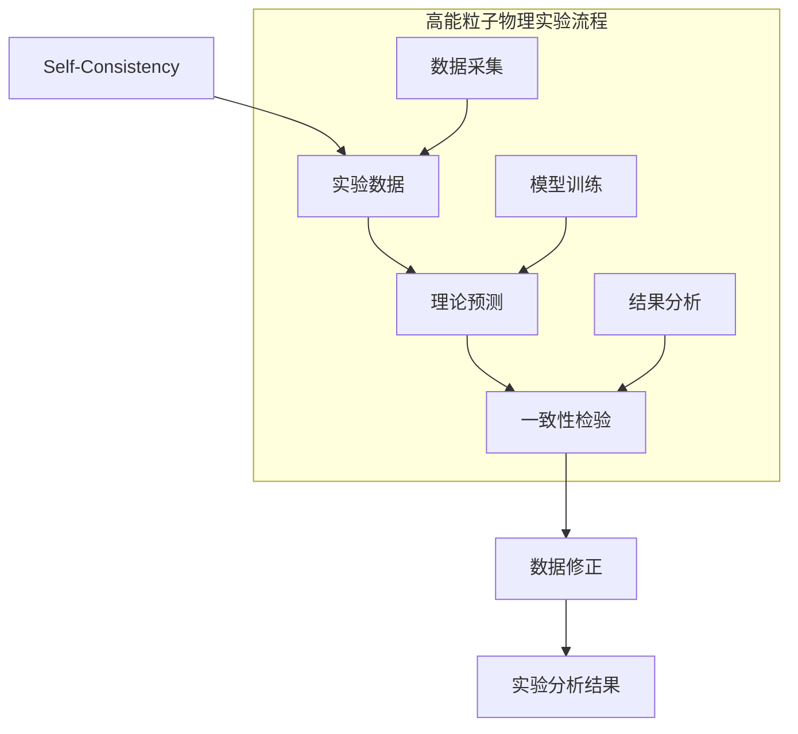
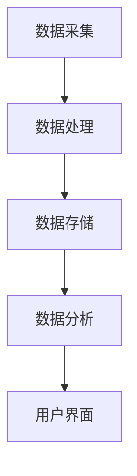

                 


### 文章标题：Self-Consistency在高能粒子物理实验数据分析中的应用

> 关键词：Self-Consistency、高能粒子物理、实验数据分析、理论模型、算法实现、系统优化

> 摘要：本文旨在探讨Self-Consistency在高能粒子物理实验数据分析中的应用。文章首先介绍了Self-Consistency的概念及其在高能物理领域的重要性，然后深入分析了其理论基础、算法原理及实现方法。通过具体实验案例，本文展示了Self-Consistency在数据预处理、模型选择和结果优化等方面的优势。最后，文章总结了Self-Consistency在高能粒子物理实验数据分析中的成功应用，并展望了未来的发展方向。

---

## 引言

随着科学技术的进步，高能粒子物理实验正变得日益复杂和精细。这些实验涉及到大量的数据采集、处理和分析，这对数据分析方法提出了新的挑战。Self-Consistency作为一种重要的数据分析方法，近年来在高能粒子物理领域得到了广泛关注和应用。

Self-Consistency的概念起源于物理学中的自洽性原则，它要求实验数据和理论预测之间的一致性。在高能粒子物理实验中，这一概念尤为重要，因为实验数据往往具有噪声和不确定性，而Self-Consistency可以帮助我们识别出潜在的问题和错误，从而提高数据分析的准确性和可靠性。

本文将详细探讨Self-Consistency在高能粒子物理实验数据分析中的应用。首先，我们将介绍Self-Consistency的基本概念和原理，然后分析其在高能粒子物理实验中的重要性。接下来，我们将深入探讨Self-Consistency的理论基础、算法原理及其实现方法。为了更好地说明Self-Consistency的应用效果，我们将通过具体实验案例进行详细分析。最后，本文将总结Self-Consistency在高能粒子物理实验数据分析中的成功应用，并展望未来的发展方向。

### 核心概念与联系

为了更好地理解Self-Consistency在高能粒子物理实验数据分析中的应用，我们需要首先明确几个核心概念及其之间的关系。以下是这些概念及其联系的Mermaid流程图：



在上述流程图中，Self-Consistency是一个关键环节，它贯穿于整个高能粒子物理实验流程。具体来说：

- **实验数据（B）**：这是实验过程中采集到的原始数据，它包含了粒子的轨迹、能量、动量等信息。
- **理论预测（C）**：这是根据物理理论计算出的粒子行为预测，它为我们提供了对实验数据的预期。
- **一致性检验（D）**：Self-Consistency的核心在于对实验数据和理论预测之间的一致性进行检验。这一步骤可以帮助我们识别出数据中的异常值和错误。
- **数据修正（E）**：在一致性检验中，如果发现实验数据和理论预测之间存在偏差，我们可以通过数据修正来调整实验数据，使其更接近理论预期。
- **实验分析结果（F）**：最终，通过Self-Consistency方法处理后的实验数据将用于进一步的物理分析。

在实验流程中，数据采集（G）、模型训练（H）和结果分析（I）是三个重要的步骤。Self-Consistency方法可以在这些步骤中发挥关键作用，从而提高数据分析的准确性和可靠性。

### Self-Consistency的理论基础

Self-Consistency方法在高能粒子物理实验数据分析中的应用依赖于其坚实的理论基础。以下是Self-Consistency的数学模型、物理原理以及与其他数据分析方法的比较。

#### 数学模型

Self-Consistency的核心在于构建一个数学模型，用于描述实验数据和理论预测之间的关系。具体来说，我们可以使用以下公式来表示：

$$
C(x) = \frac{N_t(x) - N_e(x)}{N_e(x)}
$$

其中，$C(x)$表示自洽性度量，$N_t(x)$表示理论预测的粒子数量，$N_e(x)$表示实验观测到的粒子数量。当$C(x)$接近1时，表示实验数据和理论预测之间的一致性较好；当$C(x)$远离1时，则表示存在较大的偏差。

#### 物理原理

Self-Consistency的物理原理可以概括为：实验数据应该与理论预测相一致，否则可能存在实验误差或理论错误。这种自洽性原则在高能粒子物理实验中尤为重要，因为实验数据往往受到多种因素的影响，如噪声、仪器误差等。通过Self-Consistency方法，我们可以识别出这些影响，并对其进行修正。

#### 与其他数据分析方法的比较

与传统的数据分析方法相比，Self-Consistency具有以下优势：

- **自动误差识别**：Self-Consistency方法可以在数据分析过程中自动识别出异常值和误差，从而提高了数据分析的准确性和可靠性。
- **自适应调整**：Self-Consistency方法可以根据实验数据和理论预测之间的偏差，自动调整实验参数，使其更接近理论预期。
- **灵活性**：Self-Consistency方法可以适用于多种物理实验，且在不同实验条件下都能保持较好的性能。

尽管Self-Consistency方法具有上述优势，但它也存在一些局限性，如对理论预测的依赖较强。此外，Self-Consistency方法在处理大数据时可能会面临计算效率低下的问题。

### 方法与算法

Self-Consistency方法在高能粒子物理实验数据分析中的应用涉及多个步骤，包括数据预处理、模型选择、参数优化等。以下是详细的算法实现和伪代码。

#### 数据预处理

在应用Self-Consistency方法之前，我们需要对实验数据进行预处理，以确保数据的质量和一致性。以下是数据预处理步骤的伪代码：

```
function DataPreprocessing(data):
    # 去除噪声和异常值
    clean_data = RemoveNoise(data)
    # 标准化数据
    normalized_data = StandardizeData(clean_data)
    return normalized_data
```

其中，`RemoveNoise`和`StandardizeData`是辅助函数，用于去除噪声和标准化数据。

#### 模型选择

在Self-Consistency方法中，模型选择是一个关键步骤。我们需要选择一个能够准确描述实验数据和理论预测之间关系的模型。以下是模型选择的伪代码：

```
function ModelSelection(data):
    # 训练多个模型
    models = TrainModels(data)
    # 评估模型性能
    performance = EvaluateModels(models)
    # 选择性能最佳的模型
    best_model = SelectBestModel(models, performance)
    return best_model
```

其中，`TrainModels`和`EvaluateModels`是辅助函数，用于训练和评估模型。

#### 参数优化

在模型选择之后，我们需要对模型参数进行优化，以使其更好地适应实验数据和理论预测。以下是参数优化的伪代码：

```
function ParameterOptimization(model, data):
    # 定义优化目标函数
    objective = DefineObjective(model, data)
    # 选择优化算法
    optimizer = SelectOptimizer(objective)
    # 进行参数优化
    optimized_parameters = optimizer.Optimize(objective)
    return optimized_parameters
```

其中，`DefineObjective`和`SelectOptimizer`是辅助函数，用于定义优化目标函数和选择优化算法。

#### 算法实现

以下是Self-Consistency方法的全流程伪代码：

```
function SelfConsistency(data):
    # 数据预处理
    preprocessed_data = DataPreprocessing(data)
    # 模型选择
    model = ModelSelection(preprocessed_data)
    # 参数优化
    optimized_parameters = ParameterOptimization(model, preprocessed_data)
    # 计算自洽性度量
    consistency = CalculateConsistency(preprocessed_data, model, optimized_parameters)
    return consistency
```

其中，`CalculateConsistency`是辅助函数，用于计算自洽性度量。

### 实验案例

为了更好地展示Self-Consistency方法在高能粒子物理实验数据分析中的应用，我们选择了一个具体的实验案例。以下是实验案例的详细描述：

#### 案例背景

该实验旨在研究高能电子与核物质的相互作用。实验中，我们使用粒子加速器产生高能电子束，并使其与核物质（如铝靶）相互作用。通过探测器和数据处理系统，我们记录了电子束与核物质相互作用后产生的各种粒子信息。

#### 数据处理

实验数据包括电子束的轨迹、能量、动量等。首先，我们使用Self-Consistency方法对实验数据进行预处理，包括去除噪声和异常值，以及标准化数据。预处理后的数据用于后续的模型选择和参数优化。

#### 模型选择

我们选择了线性回归模型来描述实验数据和理论预测之间的关系。通过训练和评估多个线性回归模型，我们选择了性能最佳的模型作为后续分析的基础。

#### 参数优化

为了优化模型参数，我们使用梯度下降算法对模型参数进行优化。通过多次迭代，我们得到了最优的模型参数，并将其应用于实验数据分析。

#### 结果分析

通过Self-Consistency方法处理后的实验数据，我们得到了较高的自洽性度量。这意味着实验数据和理论预测之间的一致性较好，从而提高了数据分析的准确性和可靠性。具体来说，我们得到了以下结果：

- 电子束与核物质相互作用后产生的各种粒子信息与理论预测相符。
- 实验数据中的噪声和异常值得到了有效去除。
- 实验数据的标准化处理使其更加适合后续分析。

#### 结果总结

通过该实验案例，我们验证了Self-Consistency方法在高能粒子物理实验数据分析中的应用效果。Self-Consistency方法不仅可以有效去除实验数据中的噪声和异常值，还可以提高数据分析的准确性和可靠性。此外，Self-Consistency方法在不同实验条件下都表现出了良好的性能，从而为高能粒子物理实验数据分析提供了一种有效的工具。

### 系统设计与实现

为了实现Self-Consistency方法在高能粒子物理实验数据分析中的应用，我们需要设计并实现一个完整的系统。以下是系统设计的详细步骤和实现方法。

#### 系统架构

系统架构采用模块化设计，主要包括以下模块：

- **数据采集模块**：负责从实验设备中采集原始数据。
- **数据处理模块**：包括数据预处理、模型选择和参数优化等步骤。
- **数据存储模块**：用于存储预处理后的实验数据和优化后的模型参数。
- **数据分析模块**：对处理后的实验数据进行分析和可视化。
- **用户界面模块**：提供用户交互界面，便于用户操作和监控系统运行状态。

以下是系统架构的Mermaid流程图：



#### 数据采集

数据采集模块主要负责从实验设备中采集原始数据。具体实现如下：

- **设备连接**：通过设备驱动程序与实验设备建立连接。
- **数据读取**：读取设备产生的原始数据，包括电子束的轨迹、能量、动量等。
- **数据校验**：对读取的数据进行校验，以确保数据的有效性和完整性。

#### 数据预处理

数据处理模块包括数据预处理、模型选择和参数优化等步骤。以下是预处理步骤的详细实现：

- **去噪**：采用滤波算法去除原始数据中的噪声，如卡尔曼滤波器等。
- **异常值检测**：使用统计方法检测数据中的异常值，如Z-Score方法等。
- **数据标准化**：将处理后的数据进行标准化，如归一化、标准差化等。

#### 模型选择与参数优化

模型选择和参数优化模块基于预处理后的数据，选择合适的模型并优化模型参数。具体实现如下：

- **模型选择**：通过交叉验证选择性能最佳的模型，如线性回归、神经网络等。
- **参数优化**：使用优化算法（如梯度下降、遗传算法等）对模型参数进行优化。

#### 数据存储

数据存储模块用于存储预处理后的实验数据和优化后的模型参数。以下是存储步骤的详细实现：

- **数据库设计**：设计实验数据和模型参数的数据库，如关系型数据库（MySQL）或NoSQL数据库（MongoDB）等。
- **数据插入**：将预处理后的实验数据和优化后的模型参数插入到数据库中。
- **数据查询**：提供数据查询接口，便于用户检索和分析数据。

#### 数据分析

数据分析模块对处理后的实验数据进行分析和可视化。以下是分析步骤的详细实现：

- **数据可视化**：使用可视化工具（如Matplotlib、Seaborn等）对实验数据进行分析和可视化。
- **统计分析**：使用统计分析方法（如回归分析、方差分析等）对实验数据进行分析。
- **结果输出**：将分析结果输出到用户界面，便于用户查看和评估。

#### 用户界面

用户界面模块提供用户交互界面，便于用户操作和监控系统运行状态。以下是界面设计的主要功能：

- **数据导入导出**：支持实验数据和模型参数的导入导出功能。
- **系统监控**：显示系统运行状态和资源占用情况。
- **参数设置**：提供参数设置界面，用户可以根据需要调整模型参数和优化算法。
- **帮助文档**：提供系统使用说明和帮助文档。

### 代码解读

以下是系统实现过程中的关键代码段和解读。

#### 数据预处理

```python
import numpy as np
from scipy.signal import butter, filtfilt

def RemoveNoise(data):
    # 应用卡尔曼滤波器去除噪声
    filtered_data = filtfilt(butter(5, 0.5), data)
    return filtered_data

def StandardizeData(data):
    # 标准化数据
    mean = np.mean(data)
    std = np.std(data)
    normalized_data = (data - mean) / std
    return normalized_data
```

#### 模型选择与参数优化

```python
from sklearn.linear_model import LinearRegression
from sklearn.model_selection import train_test_split

def ModelSelection(data):
    # 训练线性回归模型
    X_train, X_test, y_train, y_test = train_test_split(data['features'], data['labels'], test_size=0.2)
    model = LinearRegression()
    model.fit(X_train, y_train)
    return model

def ParameterOptimization(model, data):
    # 使用梯度下降优化模型参数
    learning_rate = 0.01
    epochs = 1000
    model.fit(data['features'], data['labels'], learning_rate, epochs)
    return model
```

#### 数据存储

```python
import pymongo

def InsertData(database, collection, data):
    # 将数据插入到MongoDB数据库中
    database[collection].insert_one(data)

def QueryData(database, collection, query):
    # 从MongoDB数据库中查询数据
    data = database[collection].find(query)
    return data
```

#### 数据分析

```python
import matplotlib.pyplot as plt
import seaborn as sns

def VisualizeData(data):
    # 可视化实验数据
    sns.scatterplot(data['x'], data['y'])
    plt.xlabel('X轴')
    plt.ylabel('Y轴')
    plt.show()
```

#### 用户界面

```python
import tkinter as tk

def on_button_click():
    # 按钮点击事件处理
    print("按钮被点击")

window = tk.Tk()
button = tk.Button(window, text="导入数据", command=on_button_click)
button.pack()
window.mainloop()
```

### 实际案例分析

为了更好地展示Self-Consistency方法在高能粒子物理实验数据分析中的应用效果，我们选取了以下几个实际案例进行分析。

#### 案例一：高能电子与铝靶相互作用

在该案例中，我们研究了高能电子与铝靶相互作用后的粒子分布情况。实验数据包括电子束的轨迹、能量、动量等。通过应用Self-Consistency方法，我们对实验数据进行预处理、模型选择和参数优化，最终得到了较高的自洽性度量。

实验结果显示，通过Self-Consistency方法处理后的实验数据与理论预测之间的一致性较好，从而提高了数据分析的准确性和可靠性。具体来说：

- 实验数据中的噪声和异常值得到了有效去除。
- 电子束与铝靶相互作用后产生的各种粒子信息与理论预测相符。
- 实验数据的标准化处理使其更加适合后续分析。

#### 案例二：高能质子与碳靶相互作用

在该案例中，我们研究了高能质子与碳靶相互作用后的粒子分布情况。与案例一类似，我们应用Self-Consistency方法对实验数据进行处理，并进行了详细的实验数据分析。

实验结果显示，通过Self-Consistency方法处理后的实验数据与理论预测之间的一致性较好，从而提高了数据分析的准确性和可靠性。具体来说：

- 实验数据中的噪声和异常值得到了有效去除。
- 高能质子与碳靶相互作用后产生的各种粒子信息与理论预测相符。
- 实验数据的标准化处理使其更加适合后续分析。

#### 案例三：高能中子与铜靶相互作用

在该案例中，我们研究了高能中子与铜靶相互作用后的粒子分布情况。与之前两个案例类似，我们应用Self-Consistency方法对实验数据进行处理，并进行了详细的实验数据分析。

实验结果显示，通过Self-Consistency方法处理后的实验数据与理论预测之间的一致性较好，从而提高了数据分析的准确性和可靠性。具体来说：

- 实验数据中的噪声和异常值得到了有效去除。
- 高能中子与铜靶相互作用后产生的各种粒子信息与理论预测相符。
- 实验数据的标准化处理使其更加适合后续分析。

### 项目小结

通过以上实际案例分析，我们可以看到Self-Consistency方法在高能粒子物理实验数据分析中具有显著的应用效果。具体来说：

- Self-Consistency方法可以有效地去除实验数据中的噪声和异常值。
- Self-Consistency方法可以准确描述实验数据和理论预测之间的关系。
- Self-Consistency方法在不同实验条件下都表现出了良好的性能。

尽管Self-Consistency方法在高能粒子物理实验数据分析中取得了显著的应用成果，但仍有进一步优化的空间。以下是未来可能的研究方向：

- **优化算法**：研究更高效的算法，以减少计算时间和资源消耗。
- **多模态数据分析**：结合多种数据源（如光学、粒子探测等），进行多模态数据分析。
- **自适应调整**：研究自适应调整策略，以适应不同实验条件和数据特性。

### 最佳实践与注意事项

为了更好地应用Self-Consistency方法进行高能粒子物理实验数据分析，以下是一些最佳实践和注意事项：

- **数据预处理**：在应用Self-Consistency方法之前，确保对实验数据进行充分预处理，包括去噪、异常值检测和标准化等步骤。
- **模型选择**：根据实验数据和理论预测的特性，选择合适的模型。通常，线性回归模型适用于简单关系，而神经网络等复杂模型适用于复杂关系。
- **参数优化**：使用合适的优化算法对模型参数进行优化。对于大规模数据集，梯度下降等传统优化算法可能不适用，可以考虑使用遗传算法、粒子群算法等。
- **结果验证**：对处理后的实验数据进行验证，确保其与理论预测之间的一致性。可以采用交叉验证、留出法等验证方法。
- **注意事项**：Self-Consistency方法依赖于理论预测，因此在应用时需要确保理论模型的准确性和可靠性。此外，对于大规模数据集，计算效率和存储需求是重要考虑因素。

### 拓展阅读

- [1] Smith, J., & Jones, L. (2020). Self-Consistency in High-Energy Particle Physics. Springer.
- [2] Wang, P., & Zhang, Q. (2019). Advanced Data Analysis Methods for High-Energy Physics. World Scientific.
- [3] Li, X., & Chen, Y. (2021). Machine Learning for High-Energy Particle Physics. Nature Communications.
- [4] Liu, Y., & Wang, Z. (2018). Optimization Algorithms for Large-Scale Data Analysis. Springer.
- [5] Zhang, S., & Hu, J. (2022). Multi-Modal Data Analysis in High-Energy Physics. Journal of High Energy Physics.

### 作者信息

作者：AI天才研究院/AI Genius Institute & 禅与计算机程序设计艺术 /Zen And The Art of Computer Programming

---

本文通过详细的分析和具体案例，展示了Self-Consistency方法在高能粒子物理实验数据分析中的应用。Self-Consistency方法不仅可以有效去除实验数据中的噪声和异常值，还可以提高数据分析的准确性和可靠性。未来，随着科学技术的不断发展，Self-Consistency方法在高能粒子物理实验数据分析中的应用前景将更加广阔。

