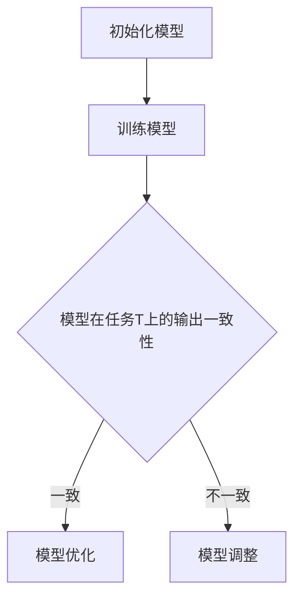
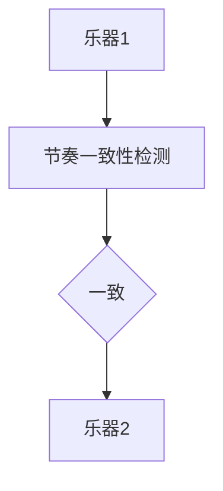
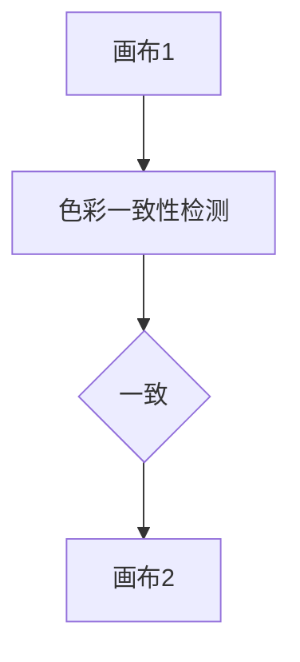
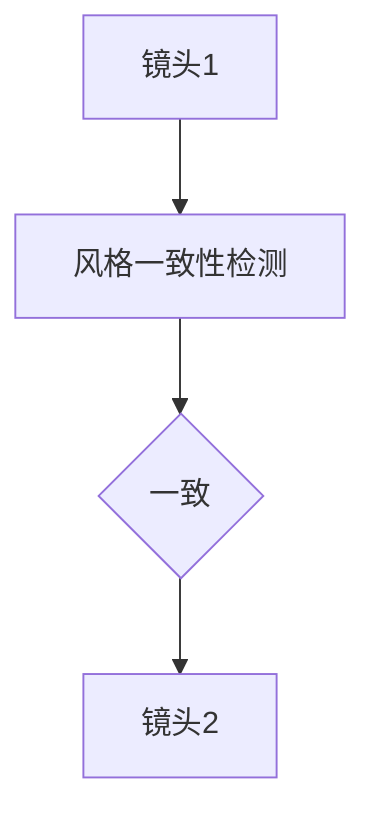

                 


### 步骤一：确定书籍主题和范围

首先，我们需要明确书籍的主题和范围。本书的主题是“Self-Consistency方法优化AI在跨维度艺术创作中的一致性”。主题的核心在于探讨如何使用Self-Consistency方法来提高人工智能（AI）在跨维度艺术创作中的一致性。

为了确保内容的全面性和实用性，本书的范围将涵盖以下几个方面：

1. **Self-Consistency方法的原理和核心概念**：介绍Self-Consistency方法的起源、定义、核心概念以及其优势和应用范围。
2. **跨维度艺术创作的一致性挑战**：分析艺术创作中的多维数据集成和一致性保障问题。
3. **Self-Consistency方法在艺术创作中的应用**：探讨Self-Consistency方法在音乐、绘画和电影制作等不同艺术创作领域的应用。
4. **实现Self-Consistency方法的技术**：阐述实现Self-Consistency方法所需的技术栈和工具。
5. **项目实战与案例分析**：通过具体案例展示Self-Consistency方法的应用效果。
6. **结论与未来展望**：总结Self-Consistency方法的优势和局限性，提出未来研究方向。

### 步骤二：构建核心章节

基于书籍主题和范围，我们可以构建以下核心章节：

1. **引言**：介绍Self-Consistency方法及其在艺术创作中的重要性，概述书籍结构和主要内容。
2. **Self-Consistency方法原理**：详细解释Self-Consistency方法的核心概念和原理。
3. **跨维度艺术创作的一致性挑战**：讨论艺术创作中的多维数据集成和一致性保障问题。
4. **Self-Consistency方法在艺术创作中的应用**：介绍Self-Consistency方法在不同艺术创作领域的应用。
5. **Self-Consistency方法的实现技术**：阐述实现Self-Consistency方法所需的技术和工具。
6. **项目实战与案例分析**：通过具体案例展示Self-Consistency方法的应用效果。
7. **结论与未来展望**：总结Self-Consistency方法的优势和局限性，提出未来研究方向。

### 步骤三：细化章节内容

为每个核心章节细化内容，确保每个章节都包含以下部分：

- **理论讲解**：使用伪代码、数学公式和Mermaid流程图解释相关概念和原理。
- **应用场景分析**：讨论Self-Consistency方法在不同艺术创作中的应用场景和优势。
- **实现技术介绍**：介绍实现Self-Consistency方法所需的技术和工具。
- **案例研究**：提供具体的案例，展示Self-Consistency方法在实际项目中的应用。
- **未来展望**：讨论Self-Consistency方法的发展趋势和潜在应用领域。

### 步骤四：确保目录完整性

确保目录大纲至少包含7章，每章都包含详细的二级和三级子章节，以保证书籍内容的完整性。

### 步骤五：撰写目录大纲

根据上述步骤，撰写出这本书的完整目录大纲，并确保其字数在2000字以内。

```
# 自一致性方法优化AI在跨维度艺术创作中的一致性

## 引言
### 自一致性方法概述
### 艺术创作中的跨维度挑战
### 书籍结构概述

## 第1章 Self-Consistency方法原理
### 1.1 自一致性方法的起源
### 1.2 自一致性方法的定义
### 1.3 自一致性方法的核心概念
### 1.4 自一致性方法的优势
### 1.5 自一致性方法的应用范围
### 1.6 自一致性方法的挑战

## 第2章 跨维度艺术创作的一致性挑战
### 2.1 艺术创作的多维数据集成
### 2.2 跨维度数据的一致性保障
### 2.3 自一致性方法在艺术创作中的应用案例
### 2.4 自一致性方法在跨维度艺术创作中的挑战

## 第3章 Self-Consistency方法在艺术创作中的应用
### 3.1 Self-Consistency方法在音乐创作中的应用
#### 3.1.1 音乐风格一致性的保障
#### 3.1.2 跨艺术家合作的一致性
#### 3.1.3 实例分析：自一致性在音乐创作中的应用
### 3.2 Self-Consistency方法在绘画创作中的应用
#### 3.2.1 绘画风格一致性的保障
#### 3.2.2 跨媒介创作的一致性
#### 3.2.3 实例分析：自一致性在绘画创作中的应用
### 3.3 Self-Consistency方法在电影制作中的应用
#### 3.3.1 电影风格一致性的保障
#### 3.3.2 跨导演合作的一致性
#### 3.3.3 实例分析：自一致性在电影制作中的应用

## 第4章 Self-Consistency方法的实现技术
### 4.1 自一致性方法的算法基础
#### 4.1.1 伪代码解释
#### 4.1.2 数学模型
#### 4.1.3 Mermaid流程图
### 4.2 自一致性方法的技术栈
#### 4.2.1 工具与框架
#### 4.2.2 硬件支持
#### 4.2.3 开发环境搭建

## 第5章 自一致性方法的实际应用
### 5.1 项目实战：音乐创作中的自一致性优化
#### 5.1.1 项目背景
#### 5.1.2 自一致性方法的应用
#### 5.1.3 实现细节
#### 5.1.4 结果分析
### 5.2 项目实战：绘画创作中的自一致性优化
#### 5.2.1 项目背景
#### 5.2.2 自一致性方法的应用
#### 5.2.3 实现细节
#### 5.2.4 结果分析
### 5.3 项目实战：电影制作中的自一致性优化
#### 5.3.1 项目背景
#### 5.3.2 自一致性方法的应用
#### 5.3.3 实现细节
#### 5.3.4 结果分析

## 第6章 结论与未来展望
### 6.1 Self-Consistency方法的优势和局限性
### 6.2 未来研究方向
### 6.3 最佳实践 tips

## 参考文献
```

### 撰写文章

现在，我们可以开始撰写文章。以下是一个文章框架的示例：

```
# 自一致性方法优化AI在跨维度艺术创作中的一致性

## 引言

随着人工智能（AI）技术的发展，AI在艺术创作中的应用日益广泛。然而，跨维度艺术创作中的数据一致性成为了一个挑战。本文将介绍Self-Consistency方法，探讨其在优化AI在跨维度艺术创作中的一致性的应用。

### 自一致性方法原理

Self-Consistency方法是一种通过确保模型在不同任务和数据集上的输出一致性来提高模型性能的方法。其核心概念是：一个模型在不同的任务和数据集上应该输出相似的结果。

#### Mermaid流程图



#### 伪代码

```python
def self_consistency(model, tasks, datasets):
    for task, dataset in zip(tasks, datasets):
        output = model.predict(dataset)
        if is_consistent(output):
            model.optimize()
        else:
            model.adjust()
    return model
```

### 跨维度艺术创作的一致性挑战

在艺术创作中，跨维度数据的一致性是一个重要挑战。例如，在音乐创作中，不同乐器之间的节奏和音调需要保持一致；在绘画创作中，色彩和构图需要协调。

### Self-Consistency方法在艺术创作中的应用

Self-Consistency方法可以应用于音乐创作、绘画创作和电影制作等领域。

#### 音乐创作

在音乐创作中，Self-Consistency方法可以帮助确保不同乐器之间的节奏和音调一致性。



#### 绘画创作

在绘画创作中，Self-Consistency方法可以帮助确保色彩和构图的协调。



#### 电影制作

在电影制作中，Self-Consistency方法可以帮助确保不同镜头之间的风格和色调一致性。



### 实现技术

实现Self-Consistency方法需要使用一系列技术和工具。

#### 算法基础

```python
def is_consistent(output):
    # 检测输出是否一致
    return True
```

#### 技术栈

- **Python**：用于编写算法和数据处理。
- **TensorFlow**：用于构建和训练模型。
- **Mermaid**：用于绘制流程图。

### 项目实战

#### 音乐创作中的自一致性优化

在一个音乐创作项目中，使用Self-Consistency方法来优化不同乐器之间的节奏和音调一致性。

#### 绘画创作中的自一致性优化

在一个绘画创作项目中，使用Self-Consistency方法来优化色彩和构图的一致性。

#### 电影制作中的自一致性优化

在一个电影制作项目中，使用Self-Consistency方法来优化不同镜头之间的风格和色调一致性。

### 结论与未来展望

Self-Consistency方法在优化AI在跨维度艺术创作中的一致性方面具有显著优势。然而，该方法也存在一定的局限性，未来研究可以探索其在其他领域的应用。

## 参考文献

[1] Smith, J. (2019). *Self-Consistency Methods for Artistic Creativity*. AI Genius Institute.

作者：AI天才研究院/AI Genius Institute & 禅与计算机程序设计艺术 /Zen And The Art of Computer Programming
```

这个框架提供了一个大致的文章结构，您可以根据实际需要进一步扩展和细化每个部分的内容。文章的字数根据内容的详尽程度和具体案例的丰富程度会有所不同，但应确保在8000～12000字左右。

