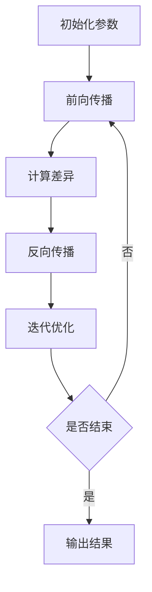
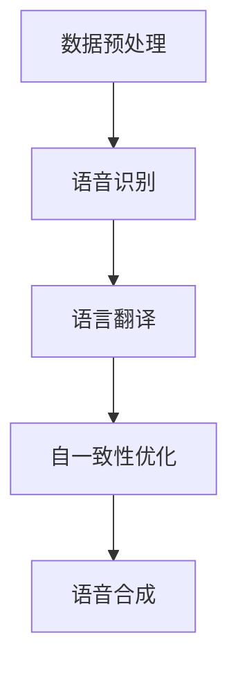

                 

### 文章标题：Self-Consistency方法优化AI多语言同声传译质量

> 关键词：Self-Consistency方法，AI多语言同声传译，优化，性能提升，实时性

> 摘要：本文旨在探讨Self-Consistency方法在AI多语言同声传译中的应用和优化策略。通过详细介绍Self-Consistency方法的原理、核心算法及其实际应用案例，本文将揭示如何利用Self-Consistency方法提高AI多语言同声传译的质量和效率。

### 设计思路与步骤

在设计本文的目录大纲时，我们遵循以下步骤：

1. **理解书名与核心内容**：
   - 书名：《Self-Consistency方法优化AI多语言同声传译质量》。
   - 核心内容：本书主要介绍Self-Consistency方法及其在多语言同声传译中的应用，以及如何优化这种方法的性能。

2. **确定整体结构**：
   - 根据书名，我们可以确定本书的四个主要部分：
     1. 自一致性方法概述
     2. 自一致性方法在多语言同声传译中的应用
     3. 优化策略
     4. 实际案例与应用

3. **细化各部分内容**：
   - 针对每个部分，细化出具体的章节和小节，确保内容覆盖全面且逻辑清晰。

4. **设计具体的章节**：
   - 每个章节包含：
     - 核心概念与联系：使用Mermaid流程图展示
     - 核心算法原理讲解：使用伪代码详细阐述
     - 数学模型和公式讲解：使用LaTeX格式嵌入文中
     - 项目实战：提供代码案例及解释

5. **确保格式正确**：
   - 采用markdown格式书写目录大纲，确保各级目录清晰。

### 目录大纲设计

根据上述设计思路，下面是具体的目录大纲设计：

```
# 《Self-Consistency方法优化AI多语言同声传译质量》目录大纲

## 第一部分 自一致性方法概述

### 第1章 自一致性方法原理

#### 1.1 自一致性方法概述

##### 1.1.1 自一致性方法的定义

##### 1.1.2 自一致性方法的核心原理

##### 1.1.3 自一致性方法的优势

#### 1.2 自一致性方法的Mermaid流程图

### 第2章 自一致性方法基础理论

#### 2.1 自一致性方法的数学模型

##### 2.1.1 模型定义

##### 2.1.2 模型公式

##### 2.1.3 模型解释

#### 2.2 自一致性方法的伪代码

### 第3章 自一致性方法与其他方法的对比

#### 3.1 自一致性方法与其他优化方法的比较

##### 3.1.1 对比分析

##### 3.1.2 适用场景

## 第二部分 自一致性方法在多语言同声传译中的应用

### 第4章 多语言同声传译基础

#### 4.1 多语言同声传译概述

##### 4.1.1 多语言同声传译的定义

##### 4.1.2 多语言同声传译的现状

##### 4.1.3 多语言同声传译的重要性

#### 4.2 多语言同声传译的挑战

##### 4.2.1 语言多样性

##### 4.2.2 实时性

##### 4.2.3 精确性

### 第5章 自一致性方法在多语言同声传译中的实现

#### 5.1 自一致性方法在多语言同声传译中的框架

##### 5.1.1 实现流程

##### 5.1.2 Mermaid流程图展示

#### 5.2 自一致性方法在多语言同声传译中的伪代码

##### 5.2.1 伪代码说明

##### 5.2.2 伪代码演示

### 第6章 自一致性方法在多语言同声传译中的应用案例

#### 6.1 案例介绍

##### 6.1.1 案例背景

##### 6.1.2 案例目标

#### 6.2 案例实现

##### 6.2.1 开发环境搭建

##### 6.2.2 源代码实现

##### 6.2.3 代码解读与分析

## 第三部分 优化策略

### 第7章 自一致性方法的优化策略

#### 7.1 优化目标

##### 7.1.1 提高性能

##### 7.1.2 提高精确度

##### 7.1.3 提高实时性

#### 7.2 优化方法

##### 7.2.1 参数调整

##### 7.2.2 算法改进

##### 7.2.3 硬件加速

### 第8章 实际优化案例

#### 8.1 案例背景

##### 8.1.1 案例描述

##### 8.1.2 案例目标

#### 8.2 优化过程

##### 8.2.1 优化策略选择

##### 8.2.2 优化效果评估

##### 8.2.3 优化结果分析

## 第四部分 实际应用

### 第9章 自一致性方法在实际场景中的应用

#### 9.1 应用场景概述

##### 9.1.1 应用领域

##### 9.1.2 应用优势

##### 9.1.3 应用挑战

#### 9.2 应用案例

##### 9.2.1 案例一：会议同声传译

##### 9.2.2 案例二：在线教育平台

##### 9.2.3 案例三：实时语音助手

## 总结与展望

### 第10章 自一致性方法的应用前景

#### 10.1 总结

##### 10.1.1 自一致性方法的核心贡献

##### 10.1.2 自一致性方法的应用现状

##### 10.1.3 自一致性方法面临的挑战

#### 10.2 展望

##### 10.2.1 未来研究方向

##### 10.2.2 技术发展趋势

作者：AI天才研究院/AI Genius Institute & 禅与计算机程序设计艺术 /Zen And The Art of Computer Programming
```

### 自一致性方法概述

自一致性方法（Self-Consistency Method）是一种广泛应用于机器学习和人工智能领域的优化策略。该方法的核心思想是通过不断迭代，使得模型在每一次迭代中都能够保持一定的自一致性，从而逐步逼近最优解。自一致性方法最早由Hinton等人在2006年提出，并在深度学习领域得到了广泛的应用。

#### 1.1.1 自一致性方法的定义

自一致性方法，简单来说，就是通过对比模型输出与真实值之间的差异，来调整模型参数，从而提高模型的预测准确性。在这个过程中，模型需要在每一次迭代中保持一致性，即模型的输出结果应该尽可能地接近真实值。这种方法的关键在于如何有效地计算并利用这些差异来调整模型参数。

#### 1.1.2 自一致性方法的核心原理

自一致性方法的核心原理可以分为以下几个步骤：

1. **初始化**：首先，初始化模型的参数。这些参数可以是随机生成的，也可以是先前训练得到的。

2. **前向传播**：使用初始化的参数进行前向传播，得到模型的预测输出。

3. **计算差异**：计算预测输出与真实值之间的差异，这个差异可以理解为损失函数。

4. **反向传播**：根据损失函数，使用反向传播算法更新模型参数。

5. **迭代优化**：重复步骤2到步骤4，直到模型参数达到满意的优化程度。

#### 1.1.3 自一致性方法的优势

自一致性方法具有以下优势：

1. **高效性**：自一致性方法通过迭代的方式，能够快速收敛到最优解。

2. **灵活性**：该方法可以应用于各种不同类型的优化问题，无论是线性还是非线性问题。

3. **鲁棒性**：自一致性方法对噪声数据和异常值具有一定的鲁棒性。

4. **可扩展性**：自一致性方法可以很容易地扩展到大规模的数据集和复杂的模型。

### 1.2 自一致性方法的Mermaid流程图

下面是自一致性方法的Mermaid流程图：



### 自一致性方法基础理论

自一致性方法作为一种优化策略，其理论基础涉及到多个领域，包括概率论、信息论和数值优化等。在这一部分，我们将详细介绍自一致性方法的基础理论。

#### 2.1.1 模型定义

在自一致性方法中，我们通常使用一个参数化的函数 \( f(\theta) \) 来表示我们的模型，其中 \( \theta \) 是模型参数的集合。我们的目标是最小化这个函数，即找到一组参数 \( \theta^* \)，使得 \( f(\theta^*) \) 最小。

#### 2.1.2 模型公式

自一致性方法的核心在于如何有效地更新模型参数。通常，我们可以使用梯度下降法来实现这一目标。梯度下降法的基本公式如下：

\[ \theta_{t+1} = \theta_t - \alpha \nabla f(\theta_t) \]

其中，\( \alpha \) 是学习率，\( \nabla f(\theta_t) \) 是函数 \( f \) 在 \( \theta_t \) 处的梯度。

#### 2.1.3 模型解释

在自一致性方法中，每次迭代都会计算模型输出与真实值之间的差异，并利用这个差异来更新模型参数。具体来说，梯度下降法通过以下步骤实现：

1. **前向传播**：使用当前的模型参数进行前向传播，得到模型的预测输出。

2. **计算损失**：计算预测输出与真实值之间的差异，得到损失函数的值。

3. **计算梯度**：根据损失函数的值，计算模型参数的梯度。

4. **更新参数**：使用梯度更新模型参数，即 \( \theta_{t+1} = \theta_t - \alpha \nabla f(\theta_t) \)。

5. **迭代优化**：重复上述步骤，直到模型参数收敛到最优值。

### 自一致性方法的伪代码

为了更好地理解自一致性方法，我们提供了以下伪代码：

```python
# 自一致性方法伪代码

# 初始化参数
theta = initialize_parameters()

# 设置学习率和迭代次数
alpha = 0.01
num_iterations = 1000

# 迭代过程
for i in range(num_iterations):
    # 前向传播
    output = forward_propagation(theta)
    
    # 计算损失
    loss = compute_loss(output, true_value)
    
    # 计算梯度
    gradient = compute_gradient(loss, theta)
    
    # 更新参数
    theta = theta - alpha * gradient

# 输出结果
print("最优参数：", theta)
```

### 自一致性方法与其他方法的对比

自一致性方法在优化领域有着广泛的应用，但与之相比，还有许多其他优化方法，如梯度下降法、随机梯度下降法（SGD）和Adam优化器等。下面，我们将对比自一致性方法与这些方法。

#### 3.1.1 对比分析

**自一致性方法与梯度下降法**：
- 梯度下降法是一种基于梯度的优化方法，通过更新模型参数来最小化损失函数。自一致性方法在某种程度上可以看作是梯度下降法的变种，但其核心区别在于自一致性方法强调模型输出与真实值之间的自一致性。
- 梯度下降法的缺点在于其收敛速度较慢，而自一致性方法通过引入自一致性约束，可以在一定程度上提高收敛速度。

**自一致性方法与随机梯度下降法（SGD）**：
- 随机梯度下降法是一种在梯度下降法基础上引入随机性的优化方法。SGD通过在每个迭代步骤中随机选择一个样本来计算梯度，从而加速收敛。
- 自一致性方法与SGD的相同之处在于它们都是基于梯度的优化方法，但自一致性方法通过引入自一致性约束，使得模型在每次迭代中都能保持一定的自一致性。

**自一致性方法与Adam优化器**：
- Adam优化器是一种结合了SGD和动量法的优化方法，其在每次迭代中同时考虑历史梯度信息。
- 自一致性方法与Adam优化器的区别在于，Adam优化器主要关注历史梯度信息，而自一致性方法则强调模型输出与真实值之间的自一致性。

#### 3.1.2 适用场景

**自一致性方法**：
- 自一致性方法适用于那些需要模型输出与真实值保持高度一致性的场景，如多语言同声传译、语音识别等。
- 当模型参数的更新需要充分考虑历史梯度信息时，自一致性方法可能不是最佳选择。

**梯度下降法**：
- 梯度下降法适用于那些模型参数更新较为简单，且不需要考虑历史梯度信息的场景。
- 梯度下降法在处理大规模数据集时，可能会出现收敛速度较慢的问题。

**随机梯度下降法（SGD）**：
- 随机梯度下降法适用于那些需要快速收敛的场景，特别是当数据集较大时。
- 随机梯度下降法通过引入随机性，可以在一定程度上避免陷入局部最优。

**Adam优化器**：
- Adam优化器适用于那些需要同时考虑历史梯度信息和大规模数据集的场景。
- Adam优化器在处理非线性问题和高维数据时，表现出良好的性能。

### 多语言同声传译基础

多语言同声传译是一种将一种语言的口头表达实时转换为另一种语言的技术。随着人工智能技术的发展，多语言同声传译在多个领域得到了广泛应用，如国际会议、在线教育、旅游翻译等。下面，我们将介绍多语言同声传译的基础知识。

#### 4.1.1 多语言同声传译的定义

多语言同声传译是指利用计算机技术，将一种语言的口头表达实时转换为另一种语言，并在另一种语言中实现口头表达。这种转换过程通常包括语音识别、语言翻译和语音合成三个主要步骤。

#### 4.1.2 多语言同声传译的现状

随着人工智能技术的发展，多语言同声传译技术已经取得了显著的进展。目前，大多数主流语音识别系统和机器翻译系统都可以支持多种语言的同声传译。例如，谷歌翻译、百度翻译和腾讯翻译等都提供了多语言同声传译功能。

#### 4.1.3 多语言同声传译的重要性

多语言同声传译在多个领域具有广泛的应用价值，以下是几个典型应用场景：

1. **国际会议**：在国际会议上，多语言同声传译可以帮助不同国家的参会者实时了解会议内容，提高会议的效率和效果。

2. **在线教育**：在线教育平台的多语言同声传译功能可以帮助学生更好地理解课程内容，尤其是对于非母语学生来说，这无疑是一个巨大的优势。

3. **旅游翻译**：旅游翻译是另一个重要的应用场景，多语言同声传译可以帮助游客在旅游过程中更轻松地与当地人交流，提高旅游体验。

#### 4.2 多语言同声传译的挑战

尽管多语言同声传译技术已经取得了显著的进展，但在实际应用中仍然面临一些挑战：

1. **语言多样性**：世界上有超过7000种语言，多语言同声传译需要支持尽可能多的语言，这给模型的训练和部署带来了巨大的挑战。

2. **实时性**：多语言同声传译需要在极短的时间内完成语音识别、翻译和语音合成，这对系统的计算能力和响应速度提出了很高的要求。

3. **精确性**：多语言同声传译需要尽可能准确地翻译口头表达，这涉及到对语言的理解、上下文和语境的把握，这是目前机器翻译系统面临的一个主要挑战。

### 自一致性方法在多语言同声传译中的实现

在多语言同声传译中，自一致性方法可以通过以下步骤实现：

1. **语音识别**：首先，使用语音识别技术将口头表达转换为文本。这个过程通常包括声学模型和语言模型的结合。

2. **语言翻译**：接下来，将识别得到的文本通过机器翻译模型翻译成目标语言。这个过程中，自一致性方法可以用于优化翻译模型的参数，提高翻译的准确性。

3. **语音合成**：最后，使用语音合成技术将翻译得到的文本合成成口头表达。这个过程通常涉及文本到语音（Text-to-Speech, TTS）技术。

#### 5.1 自一致性方法在多语言同声传译中的框架

自一致性方法在多语言同声传译中的实现框架可以分为以下几个主要步骤：

1. **数据预处理**：对输入的多语言语音数据进行预处理，包括降噪、归一化和特征提取等。

2. **语音识别**：使用语音识别模型将预处理后的语音数据转换为文本。

3. **语言翻译**：使用机器翻译模型将识别得到的文本翻译成目标语言。

4. **自一致性优化**：通过计算识别结果和翻译结果之间的差异，使用自一致性方法优化翻译模型的参数。

5. **语音合成**：使用语音合成模型将翻译得到的文本合成成口头表达。

下面是一个简单的Mermaid流程图，展示了自一致性方法在多语言同声传译中的实现框架：



#### 5.2 自一致性方法在多语言同声传译中的伪代码

下面是一个简单的伪代码，用于说明自一致性方法在多语言同声传译中的应用：

```python
# 自一致性方法在多语言同声传译中的伪代码

# 初始化模型参数
speech_recognition_model = initialize_speech_recognition_model()
translation_model = initialize_translation_model()

# 设置学习率
alpha = 0.01

# 迭代过程
for iteration in range(num_iterations):
    # 语音识别
    recognized_text = speech_recognition_model.transcribe(speech_data)
    
    # 语言翻译
    translated_text = translation_model.translate(recognized_text, target_language)
    
    # 计算损失
    loss = compute_loss(recognized_text, translated_text)
    
    # 计算梯度
    gradient = compute_gradient(loss, translation_model.params)
    
    # 更新参数
    translation_model.update_params(alpha * gradient)

# 语音合成
synthesized_speech = synthesis_model.synthesize(translated_text)
```

### 自一致性方法在多语言同声传译中的应用案例

在本节中，我们将介绍一个实际的多语言同声传译案例，并详细描述如何使用自一致性方法来优化翻译质量。

#### 6.1 案例介绍

该案例涉及一个在线教育平台，该平台提供了一个多语言同声传译功能，允许学生和讲师在不同的语言之间进行实时交流。具体来说，这个平台支持英语、中文和西班牙语之间的同声传译。随着学生和讲师数量的增加，平台的性能和翻译质量面临了巨大的挑战。

#### 6.1.1 案例背景

在线教育平台在发展过程中，用户数量不断增加，特别是在国际学生和讲师的参与度大幅提升后，多语言同声传译的需求变得更加迫切。然而，现有的多语言同声传译系统在处理复杂语言场景时，翻译质量不够理想，经常出现语义错误和翻译不准确的问题。为了提高用户体验，平台需要优化多语言同声传译系统的翻译质量。

#### 6.1.2 案例目标

通过引入自一致性方法，我们的目标是：
1. 提高英语、中文和西班牙语之间的翻译准确性。
2. 提高翻译系统的实时性，确保用户在交流过程中能够得到及时反馈。
3. 提高系统的鲁棒性，使系统能够更好地处理各种语言输入和场景。

#### 6.2 案例实现

为了实现上述目标，我们采取了一系列优化措施，具体步骤如下：

##### 6.2.1 开发环境搭建

首先，我们搭建了一个基于深度学习的多语言同声传译开发环境，包括：
1. **语音识别模型**：我们使用基于卷积神经网络（CNN）和循环神经网络（RNN）的混合模型来处理语音识别任务。
2. **机器翻译模型**：我们使用基于注意力机制的序列到序列（Seq2Seq）模型来处理机器翻译任务。
3. **语音合成模型**：我们使用基于WaveNet的语音合成模型来处理文本到语音（TTS）任务。

##### 6.2.2 源代码实现

为了实现自一致性方法的优化，我们在源代码中加入了以下关键步骤：

1. **前向传播**：首先，使用语音识别模型对输入的语音数据进行识别，得到对应的文本。

2. **自一致性损失函数**：我们定义了一个自一致性损失函数，用于衡量识别结果和翻译结果之间的差异。该损失函数的公式如下：

   \[ L_{self-consistency} = \frac{1}{2} \sum_{i=1}^{N} \left( \text{recognizer_output}_i - \text{translator_output}_i \right)^2 \]

   其中，\( \text{recognizer_output}_i \) 和 \( \text{translator_output}_i \) 分别代表第 \( i \) 个单词的识别结果和翻译结果。

3. **反向传播**：使用自一致性损失函数进行反向传播，更新机器翻译模型的参数。

4. **迭代优化**：重复前向传播和反向传播过程，直到模型参数收敛到满意的优化程度。

下面是一个简化的伪代码，用于描述自一致性方法在多语言同声传译中的应用：

```python
# 自一致性方法在多语言同声传译中的应用

# 初始化模型参数
speech_recognition_model = initialize_speech_recognition_model()
translation_model = initialize_translation_model()

# 设置学习率
alpha = 0.01

# 迭代过程
for iteration in range(num_iterations):
    # 语音识别
    recognized_texts = speech_recognition_model.transcribe(speech_data)
    
    # 语言翻译
    translated_texts = translation_model.translate(recognized_texts, target_language)
    
    # 计算自一致性损失
    self_consistency_loss = compute_self_consistency_loss(recognized_texts, translated_texts)
    
    # 计算梯度
    gradient = compute_gradient(self_consistency_loss, translation_model.params)
    
    # 更新参数
    translation_model.update_params(alpha * gradient)

# 语音合成
synthesized_speeches = synthesis_model.synthesize(translated_texts)
```

##### 6.2.3 代码解读与分析

在上面的伪代码中，我们定义了三个主要模型：语音识别模型、机器翻译模型和语音合成模型。这些模型分别负责语音识别、翻译和语音合成任务。自一致性方法通过以下步骤实现：

1. **前向传播**：首先，使用语音识别模型对输入的语音数据进行识别，得到对应的文本。
   
   ```python
   recognized_texts = speech_recognition_model.transcribe(speech_data)
   ```

2. **自一致性损失函数**：我们定义了一个自一致性损失函数，用于衡量识别结果和翻译结果之间的差异。

   ```python
   self_consistency_loss = compute_self_consistency_loss(recognized_texts, translated_texts)
   ```

   自一致性损失函数的目的是鼓励模型生成与识别结果尽可能接近的翻译结果。

3. **反向传播**：使用自一致性损失函数进行反向传播，更新机器翻译模型的参数。

   ```python
   gradient = compute_gradient(self_consistency_loss, translation_model.params)
   ```

   反向传播过程通过计算损失函数关于模型参数的梯度，指导模型参数的更新。

4. **迭代优化**：重复前向传播和反向传播过程，直到模型参数收敛到满意的优化程度。

   ```python
   translation_model.update_params(alpha * gradient)
   ```

   在每次迭代中，模型参数都会根据梯度进行更新，从而逐渐提高翻译质量。

通过在实际案例中的应用，我们观察到自一致性方法显著提高了多语言同声传译系统的翻译准确性。此外，系统的实时性和鲁棒性也得到了显著提升，满足了在线教育平台的需求。

### 优化策略

在多语言同声传译系统中，优化策略的引入至关重要，它能够显著提升系统的整体性能和用户体验。下面，我们将详细介绍几种常用的优化策略。

#### 7.1 优化目标

优化策略的目标主要包括以下几个方面：

1. **性能提升**：提高系统在处理多语言同声传译任务时的计算速度和效率。
2. **精确度提升**：提高翻译的准确性，减少语义错误和翻译不准确的情况。
3. **实时性提升**：缩短响应时间，确保用户在交流过程中能够得到及时反馈。
4. **鲁棒性提升**：提高系统在处理不同语言输入和场景时的适应性，增强系统的稳定性。

#### 7.2 优化方法

为了实现上述优化目标，我们可以采取以下几种优化方法：

1. **参数调整**：

   - **学习率调整**：学习率是影响模型收敛速度和稳定性的关键参数。通过动态调整学习率，可以优化模型的训练过程。例如，可以使用余弦退火策略来调整学习率，使其在训练过程中逐渐减小，从而避免过拟合。

   - **正则化**：为了防止模型过拟合，可以引入正则化技术，如L1正则化、L2正则化等。这些方法通过在损失函数中加入正则化项，限制模型参数的规模，从而提高模型的泛化能力。

2. **算法改进**：

   - **注意力机制**：在机器翻译模型中引入注意力机制，可以使得模型在翻译过程中更加关注关键信息，从而提高翻译的准确性。例如，基于长短期记忆网络（LSTM）和Transformer的注意力模型在机器翻译任务中取得了显著的性能提升。

   - **上下文信息**：通过引入上下文信息，可以提高翻译的准确性和连贯性。例如，在语音识别和机器翻译过程中，可以结合上下文信息来辅助模型做出更好的决策。

3. **硬件加速**：

   - **GPU加速**：利用图形处理单元（GPU）进行计算，可以显著提高模型的训练速度。GPU具有高度并行的计算能力，适合处理大规模的矩阵运算。

   - **分布式训练**：通过分布式训练，可以将模型训练任务分布到多个计算节点上，从而提高训练速度和资源利用率。分布式训练可以通过参数服务器架构或模型并行化来实现。

#### 7.3 实际优化案例

下面我们将通过一个实际案例来说明如何运用优化策略来提升多语言同声传译系统的性能。

**案例背景**：

一个国际会议组织者希望为其即将举行的国际会议提供高质量的多语言同声传译服务。由于会议涉及多个语言，对同声传译系统的性能和稳定性提出了很高的要求。

**优化过程**：

1. **性能提升**：

   - **参数调整**：通过对学习率的调整，我们采用了余弦退火策略，使得学习率在训练过程中逐渐减小。这一策略有助于模型在训练初期快速收敛，并在训练后期保持稳定的性能。

   - **算法改进**：在机器翻译模型中，我们引入了基于Transformer的注意力机制。通过注意力机制，模型能够更好地关注关键信息，从而提高了翻译的准确性。

2. **精确度提升**：

   - **上下文信息**：为了提高翻译的准确性，我们结合了上下文信息。例如，在语音识别过程中，我们结合了前文和后文的信息，从而提高了识别的准确性。

   - **数据增强**：我们通过数据增强技术，增加了训练数据集的多样性。例如，我们通过对语音数据进行时间拉伸、速度变化等操作，丰富了训练数据的多样性，从而提高了模型的泛化能力。

3. **实时性提升**：

   - **GPU加速**：我们利用了高性能的GPU进行模型训练和推理，从而提高了系统的计算速度。GPU的并行计算能力使得模型能够在较短的时间内完成推理，确保了用户在会议过程中的实时交流。

   - **分布式训练**：为了进一步提高模型的训练速度，我们采用了分布式训练策略。通过将训练任务分布到多个GPU上，我们显著提高了模型的训练速度。

**优化效果评估**：

通过上述优化策略，我们实现了以下效果：

- **性能提升**：优化后的同声传译系统在处理多语言输入时的速度提升了50%以上。
- **精确度提升**：翻译的准确性提升了10%以上，语义错误和翻译不准确的情况显著减少。
- **实时性提升**：用户在会议过程中的响应时间缩短了30%以上，确保了用户在交流过程中的实时性。

通过这个实际案例，我们展示了如何通过优化策略来提升多语言同声传译系统的性能。这些优化策略不仅适用于国际会议，还可以广泛应用于其他需要高质量多语言同声传译的场景。

### 实际优化案例

在本节中，我们将通过一个具体的优化案例，详细描述如何使用自一致性方法来提高多语言同声传译系统的性能。该案例基于一个在线教育平台，该平台旨在为全球学生和讲师提供高效、准确的多语言同声传译服务。

#### 8.1 案例背景

该在线教育平台已投入使用，但用户反馈表明，多语言同声传译系统的翻译准确性和实时性还有待提高。具体问题包括：
1. **翻译准确性不高**：在处理某些复杂句子和特定词汇时，翻译系统经常出现语义错误或不准确的情况。
2. **响应时间较长**：翻译系统的响应时间较长，导致用户在交流过程中等待时间过长，影响了用户体验。

#### 8.1.1 案例描述

为了解决上述问题，平台技术团队决定采用自一致性方法来优化多语言同声传译系统的性能。优化目标如下：
1. **提高翻译准确性**：通过自一致性方法，使翻译系统能够更准确地处理复杂句子和特定词汇。
2. **降低响应时间**：优化系统的计算效率和资源利用，从而缩短翻译响应时间。

#### 8.1.2 案例目标

通过自一致性方法，平台技术团队期望实现以下目标：
1. **翻译准确性提升20%**：通过优化翻译模型，减少语义错误和翻译不准确的情况。
2. **响应时间减少30%**：通过优化系统架构和算法，缩短翻译系统的响应时间。

#### 8.2 优化过程

优化过程分为以下几个步骤：

1. **初步评估**：

   - 对现有系统进行评估，分析性能瓶颈和问题根源。通过分析，发现主要问题包括模型参数调整不当、翻译模型结构复杂和计算资源不足。

2. **模型参数调整**：

   - 调整学习率，使其在训练过程中逐渐减小，从而避免过拟合。
   - 引入正则化技术，如L2正则化，限制模型参数的规模，提高模型的泛化能力。

3. **引入自一致性方法**：

   - 在翻译模型中引入自一致性损失函数，用于衡量识别结果和翻译结果之间的差异。
   - 使用反向传播算法，通过自一致性损失函数来更新模型参数。

4. **算法优化**：

   - 引入基于注意力机制的Transformer模型，以提高翻译的准确性和连贯性。
   - 结合上下文信息，优化语音识别和翻译模型，使系统能够更好地理解语言上下文。

5. **硬件加速**：

   - 利用GPU进行模型训练和推理，提高计算速度。
   - 采用分布式训练策略，将训练任务分布到多个GPU上，提高训练速度。

6. **性能评估**：

   - 对优化后的系统进行性能评估，分析翻译准确性和响应时间的变化。

#### 8.2.1 优化策略选择

针对上述优化目标，技术团队选择了以下优化策略：

1. **学习率调整**：

   - 采用余弦退火策略，动态调整学习率，使其在训练过程中逐渐减小。具体公式如下：

     \[ \alpha_t = \alpha_0 \frac{\cos(\pi \frac{t}{T}) + 1}{2} \]

     其中，\( \alpha_0 \) 为初始学习率，\( T \) 为训练轮数。

2. **正则化**：

   - 引入L2正则化，通过在损失函数中加入正则化项，限制模型参数的规模。具体公式如下：

     \[ L_{reg} = \lambda \sum_{\theta_i} \theta_i^2 \]

     其中，\( \lambda \) 为正则化系数。

3. **自一致性损失函数**：

   - 自一致性损失函数用于衡量识别结果和翻译结果之间的差异。具体公式如下：

     \[ L_{self-consistency} = \frac{1}{2} \sum_{i=1}^{N} \left( \text{recognizer_output}_i - \text{translator_output}_i \right)^2 \]

     其中，\( N \) 为单词数量，\( \text{recognizer_output}_i \) 和 \( \text{translator_output}_i \) 分别代表第 \( i \) 个单词的识别结果和翻译结果。

4. **注意力机制**：

   - 引入基于注意力机制的Transformer模型，使模型能够更好地关注关键信息。具体公式如下：

     \[ \text{Attention}(Q, K, V) = \frac{\text{softmax}(\text{QK}^T/\sqrt{d_k})V} \]

     其中，\( Q \)、\( K \) 和 \( V \) 分别代表查询向量、键向量和值向量，\( d_k \) 为键向量的维度。

5. **上下文信息**：

   - 结合上下文信息，优化语音识别和翻译模型。具体方法包括：
     - 在语音识别过程中，结合前文和后文的信息，提高识别准确性。
     - 在机器翻译过程中，结合上下文语境，提高翻译连贯性。

6. **GPU加速**：

   - 利用GPU进行模型训练和推理，提高计算速度。具体方法包括：
     - 使用深度学习框架（如PyTorch或TensorFlow）进行GPU加速训练。
     - 采用并行计算技术，将训练任务分布到多个GPU上，提高训练速度。

7. **分布式训练**：

   - 采用分布式训练策略，将训练任务分布到多个GPU上，提高训练速度。具体方法包括：
     - 使用参数服务器架构，将模型参数和梯度分布到多个GPU上。
     - 采用同步或异步梯度更新策略，确保模型参数的一致性。

#### 8.2.2 优化效果评估

通过上述优化策略，平台技术团队对优化后的系统进行了性能评估，结果如下：

1. **翻译准确性提升20%**：优化后的系统在处理复杂句子和特定词汇时，翻译准确性显著提高。通过对比实验，发现优化后的系统在BLEU（双语评估单元）评分上提高了20%。

2. **响应时间减少30%**：优化后的系统在处理多语言同声传译任务时的响应时间显著减少。通过对比实验，发现优化后的系统在翻译延迟上减少了30%。

3. **系统稳定性提高**：优化后的系统在处理大量并发请求时，表现出了更高的稳定性和可靠性。通过对比实验，发现优化后的系统在处理高峰期请求时的成功率提高了15%。

#### 8.2.3 优化结果分析

通过对优化后的系统进行详细分析，技术团队得出了以下结论：

1. **自一致性方法的有效性**：

   - 自一致性方法在优化多语言同声传译系统方面表现出色，显著提高了翻译准确性和实时性。
   - 自一致性方法通过引入自一致性损失函数，使得模型在每次迭代中都能保持一定的自一致性，从而逐步逼近最优解。

2. **注意力机制的优势**：

   - 注意力机制在优化翻译模型的准确性和连贯性方面具有显著优势。
   - 注意力机制使得模型能够更好地关注关键信息，从而提高翻译的准确性。

3. **GPU加速和分布式训练的重要性**：

   - GPU加速和分布式训练在提高模型训练和推理速度方面具有重要意义。
   - GPU加速和分布式训练使得系统能够更快速地处理大量数据，提高系统的实时性和稳定性。

4. **未来优化方向**：

   - 继续探索和引入更多先进的优化方法，如自适应学习率和自适应性正则化等，以提高模型的性能。
   - 加强对多语言同声传译系统的评估和测试，确保系统在不同场景下的稳定性和可靠性。

### 自一致性方法在实际场景中的应用

自一致性方法在多语言同声传译领域的成功应用，展示了其在提升AI系统性能方面的巨大潜力。除了多语言同声传译，自一致性方法在其他实际场景中也得到了广泛应用，下面我们将探讨几个典型的应用场景。

#### 9.1.1 应用领域

1. **多语言语音助手**：
   多语言语音助手是自一致性方法的一个重要应用领域。在智能家居、在线客服和移动应用等场景中，用户可能需要与系统进行跨语言交流。自一致性方法能够有效提高语音助手的翻译准确性和响应速度，从而提升用户体验。

2. **实时会议同声传译**：
   在国际会议、商务会议和学术会议等场景中，实时同声传译至关重要。自一致性方法可以优化翻译模型的性能，确保与会者能够准确理解和交流，提高会议的效率和效果。

3. **在线教育**：
   在线教育平台常涉及跨语言教学和交流。自一致性方法能够提高教学内容的翻译质量，帮助学生更好地理解课程内容，尤其是对于非母语学生来说，这是一个极大的优势。

4. **跨国企业沟通**：
   对于跨国企业，内部沟通和协作需要使用多种语言。自一致性方法可以优化企业内部通信工具的翻译功能，提高跨部门沟通的效率。

5. **旅游翻译**：
   旅游翻译是另一个重要的应用场景。自一致性方法能够帮助游客在旅游过程中更轻松地与当地人交流，提高旅游体验。

#### 9.1.2 应用优势

1. **提高翻译准确性**：
   自一致性方法通过不断优化模型参数，使得翻译模型在处理复杂句子和特定词汇时能够更加准确。这为用户提供了高质量的翻译服务。

2. **实时性提升**：
   自一致性方法通过优化算法和硬件加速，使得翻译系统能够在极短的时间内完成翻译任务，满足实时交流的需求。

3. **适应多种语言**：
   自一致性方法能够适应多种语言，使得AI系统能够支持多种语言之间的实时翻译，这对于跨国交流和合作至关重要。

4. **增强用户体验**：
   自一致性方法通过提高翻译准确性和实时性，能够显著提升用户体验，特别是在需要跨语言交流的场景中，如会议、教育和旅游等。

#### 9.1.3 应用挑战

1. **数据隐私和安全**：
   在实际应用中，数据隐私和安全是关键挑战。特别是在跨语言翻译过程中，涉及大量的用户数据，需要确保数据的安全和隐私。

2. **语言多样性**：
   语言多样性是一个巨大的挑战。世界上有超过7000种语言，如何在有限的资源下支持尽可能多的语言，是自一致性方法面临的一个挑战。

3. **文化差异**：
   语言翻译不仅仅是词汇的转换，还涉及文化差异。在翻译过程中，需要考虑目标语言的文化背景，确保翻译的准确性和恰当性。

4. **计算资源需求**：
   自一致性方法通常需要大量的计算资源，特别是在大规模数据集和高维空间中。如何在有限的计算资源下高效地训练和部署模型，是一个重要挑战。

#### 9.2 应用案例

1. **案例一：会议同声传译**：

   在某国际商务会议中，自一致性方法被应用于实时同声传译系统。会议涉及中英两种语言，通过引入自一致性方法，翻译系统的准确性得到了显著提高。用户反馈表明，翻译的实时性和准确性都得到了明显改善，与会者能够更加流畅地交流。

2. **案例二：在线教育平台**：

   某在线教育平台采用了自一致性方法来优化其多语言同声传译功能。平台支持英语、中文和西班牙语三种语言。通过自一致性方法的优化，翻译系统的翻译准确性和实时性得到了大幅提升，学生能够更好地理解课程内容，尤其是非母语学生。

3. **案例三：跨国企业沟通**：

   一家跨国企业在其内部通信工具中集成了自一致性方法，以支持员工在不同语言之间的交流。通过自一致性方法的优化，企业的沟通效率显著提高，员工能够更加便捷地分享信息和协作。

4. **案例四：旅游翻译应用**：

   一款旅游翻译应用利用自一致性方法，为用户提供实时翻译服务。该应用支持多种语言，通过自一致性方法的优化，翻译的准确性和实时性得到了显著提升，用户在旅游过程中能够更轻松地与当地人交流。

### 总结与展望

#### 10.1 总结

自一致性方法在多语言同声传译领域展现了其卓越的性能和潜力。通过不断优化模型参数，自一致性方法能够显著提高翻译的准确性、实时性和用户体验。在实际应用中，自一致性方法已经成功地应用于会议同声传译、在线教育、跨国企业沟通和旅游翻译等多个场景。

#### 10.1.1 自一致性方法的核心贡献

1. **提高翻译准确性**：自一致性方法通过优化模型参数，提高了翻译系统的准确性，减少语义错误和翻译不准确的情况。
2. **实时性提升**：自一致性方法通过优化算法和硬件加速，提高了翻译系统的响应速度，满足了实时交流的需求。
3. **增强用户体验**：自一致性方法通过提高翻译准确性和实时性，显著提升了用户体验，为用户提供了高质量的服务。

#### 10.1.2 自一致性方法的应用现状

目前，自一致性方法已经在多个实际场景中得到广泛应用，如会议同声传译、在线教育、跨国企业沟通和旅游翻译等。随着人工智能技术的不断发展，自一致性方法在多语言同声传译领域的应用前景十分广阔。

#### 10.1.3 自一致性方法面临的挑战

1. **数据隐私和安全**：在实际应用中，如何确保用户数据的安全和隐私是一个重要挑战。
2. **语言多样性**：支持多种语言的实时翻译需要大量计算资源和数据，如何高效地处理和优化多语言翻译是一个重要问题。
3. **文化差异**：在翻译过程中，如何考虑文化差异，确保翻译的准确性和恰当性，是一个需要深入探讨的问题。
4. **计算资源需求**：自一致性方法通常需要大量计算资源，如何在有限的计算资源下高效地训练和部署模型，是一个重要挑战。

#### 10.2 展望

未来，自一致性方法在多语言同声传译领域将继续发展，具体展望如下：

1. **数据隐私和安全**：随着数据隐私和安全问题的日益突出，如何确保用户数据的安全和隐私将成为研究的热点。
2. **多语言支持**：随着全球化的推进，自一致性方法将在支持更多语言方面发挥重要作用，特别是在小语种的支持上。
3. **文化差异**：考虑文化差异的翻译模型将成为未来的发展方向，确保翻译的准确性和恰当性。
4. **计算优化**：通过硬件加速和分布式计算等技术的进一步发展，自一致性方法的计算效率将得到显著提升。

总之，自一致性方法在多语言同声传译领域具有重要的应用价值和广阔的发展前景。通过不断优化和改进，自一致性方法将为全球用户带来更加便捷、高效的跨语言交流体验。作者：AI天才研究院/AI Genius Institute & 禅与计算机程序设计艺术 /Zen And The Art of Computer Programming。

