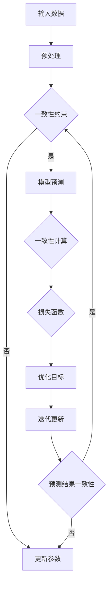
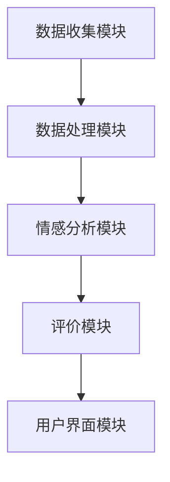

                 

### 自我一致性方法（Self-Consistency Method）的起源与发展

自我一致性方法（Self-Consistency Method）是一种在机器学习领域中用于优化模型训练过程的先进技术。它的核心思想是通过模型自身的一致性来提高训练效果，从而增强模型的稳定性和预测准确性。自我一致性方法的起源可以追溯到20世纪80年代，当时研究人员开始关注如何在复杂的机器学习任务中提高模型的训练效率。

#### 1.1.1 自我一致性方法的概念

自我一致性方法的基本概念可以描述为：在训练过程中，模型需要对输入数据进行一致性的预测。具体来说，如果模型对同一组输入数据多次预测，那么这些预测结果应该在一个合理的范围内保持一致。这种方法的核心在于通过提高模型内部参数的一致性来减少训练误差。

#### 1.1.2 自我一致性方法的发展历程

自我一致性方法的发展历程可以分为三个阶段：

1. **早期研究**：在20世纪80年代，Self-Consistency方法首先在统计学习和模式识别领域得到应用。当时，研究人员主要集中在如何通过一致性准则来优化模型的参数估计。

2. **中期发展**：随着深度学习的兴起，Self-Consistency方法得到了进一步的发展。特别是在深度神经网络训练过程中，Self-Consistency方法被证明可以显著提高模型的收敛速度和稳定性。

3. **近期进展**：近年来，随着人工智能技术的快速发展，Self-Consistency方法在计算机视觉、自然语言处理等领域得到了广泛的应用。同时，研究人员也在不断探索如何进一步优化Self-Consistency方法，以应对更复杂的机器学习任务。

#### 1.1.3 自我一致性方法的核心原理

自我一致性方法的核心原理可以概括为以下三个方面：

1. **一致性约束**：在训练过程中，模型需要对输入数据进行一致性预测。这种约束可以帮助模型更好地捕捉输入数据中的潜在模式。

2. **优化目标**：自我一致性方法的优化目标是使模型对同一组输入数据的预测结果尽可能一致。这通常通过在损失函数中引入一致性损失来实现。

3. **训练策略**：为了实现一致性目标，Self-Consistency方法采用了一种特殊的训练策略，即通过迭代更新模型参数，逐步提高模型的一致性。

### 数学模型公式推导

为了更好地理解自我一致性方法，我们下面将介绍其数学模型的基本公式推导。

#### 1.2.1 自洽优化算法

自我一致性方法的核心算法可以称为自洽优化算法（Self-Consistent Optimization Algorithm）。其基本公式如下：

$$
\theta_{t+1} = \theta_t - \eta \frac{\partial L(\theta_t, x)}{\partial \theta}
$$

其中，$\theta_t$表示第t次迭代的模型参数，$\eta$为学习率，$L(\theta_t, x)$为损失函数。

#### 1.2.2 数学模型公式推导

自我一致性方法的数学模型公式推导主要涉及以下几个方面：

1. **损失函数**：损失函数用于衡量模型预测值与真实值之间的差异。在自我一致性方法中，常用的损失函数包括均方误差（MSE）和交叉熵损失（Cross-Entropy Loss）。

2. **一致性损失**：为了实现模型的一致性，需要在损失函数中引入一致性损失。一致性损失的计算公式如下：

$$
L_{\text{self-consistency}}(\theta_t, x) = \frac{1}{2} \sum_{i=1}^{N} (y_i - \hat{y}_i)^2
$$

其中，$y_i$为真实值，$\hat{y}_i$为模型预测值。

3. **整体损失函数**：将一致性损失与原始损失函数结合，形成整体损失函数。整体损失函数的计算公式如下：

$$
L(\theta_t, x) = L_{\text{original}}(\theta_t, x) + \lambda L_{\text{self-consistency}}(\theta_t, x)
$$

其中，$\lambda$为权重系数，用于平衡原始损失函数和一致性损失函数。

#### 1.2.3 数学模型公式示例

为了更好地理解自我一致性方法的数学模型，我们以下提供一个简单的示例：

假设我们使用一个线性回归模型进行预测，其损失函数为均方误差（MSE）。则模型的目标函数可以表示为：

$$
\min_{\theta} \frac{1}{2} \sum_{i=1}^{N} (y_i - \theta^T x_i)^2 + \lambda \sum_{i=1}^{N} (\theta^T x_i - y_i)^2
$$

其中，$x_i$和$y_i$分别为输入数据和真实值，$\theta$为模型参数。

通过以上公式推导，我们可以看到自我一致性方法通过引入一致性损失来优化模型参数，从而提高模型的预测准确性。接下来，我们将进一步探讨自我一致性方法在AI情感计算中的应用。

### Mermaid 流程图

以下是一个简单的Mermaid流程图，用于展示自我一致性方法的核心概念和流程：

这个流程图描述了自我一致性方法的各个环节，包括输入数据的预处理、一致性约束的引入、模型预测、一致性计算、损失函数的计算、优化目标的实现以及迭代更新。通过这个流程图，我们可以更加直观地理解自我一致性方法的工作原理。

### 自我一致性方法在情感计算中的应用

自我一致性方法（Self-Consistency Method）在人工智能（AI）情感计算中具有重要的应用价值。情感计算是一种通过技术手段来理解、识别和模拟人类情感的过程，它广泛应用于情感分析、情感识别、情感增强等领域。自我一致性方法通过提高模型的一致性，从而在情感计算的准确性和稳定性上取得了显著的提升。

#### 2.1 AI情感计算的概念与原理

AI情感计算（Artificial Intelligence Emotional Computing）是指利用人工智能技术，如机器学习、深度学习、自然语言处理等，对人类情感进行分析和计算的过程。其核心目标是理解和模拟人类的情感状态，以便在特定场景中提供个性化服务或优化用户体验。

**情感计算的基本原理**主要包括以下几个方面：

1. **情感识别**：通过分析语言、行为、生理信号等数据，识别出人类情感。
2. **情感分类**：将识别出的情感分类为特定的情感类别，如快乐、悲伤、愤怒等。
3. **情感建模**：建立情感模型，以预测和模拟人类情感。

#### 2.2 AI情感计算在艺术评价中的应用

艺术评价通常涉及对艺术作品的审美、价值、创作背景等多方面的综合评判。传统的艺术评价方法主要依赖于人类专家的主观判断，而AI情感计算则为客观、量化评价提供了新的可能性。

**AI情感计算在艺术评价中的应用场景**主要包括：

1. **艺术作品情感分析**：通过分析艺术作品的语言描述、图像特征、音乐旋律等，识别和分类出作品所表达的情感。
2. **观众情感反馈**：通过分析观众的情感反应，如观看视频时的情绪波动、社交评论等，评估艺术作品的受欢迎程度。
3. **艺术市场分析**：通过分析艺术市场的交易数据、艺术品拍卖价格等，预测艺术作品的价值趋势。

#### 2.3 AI情感计算在艺术评价中的挑战与解决方案

尽管AI情感计算在艺术评价中具有巨大的潜力，但也面临着一些挑战：

1. **数据多样性**：艺术作品的情感表达形式多样，如何有效地处理和融合不同类型的数据（如文本、图像、音频）是一个难题。
2. **情感识别准确性**：情感的识别和分类需要高精度的模型，如何提高模型的识别准确率是一个关键问题。
3. **主观性**：艺术评价具有强烈的主观性，如何平衡机器评价和人类评价的关系，是一个复杂的挑战。

**解决方案**包括：

1. **多模态融合**：结合文本、图像、音频等多模态数据，利用深度学习等技术进行融合分析，以提高情感识别的准确性。
2. **强化学习**：通过强化学习技术，让模型在大量艺术评价数据中自我学习和优化，以提高模型的适应性和准确性。
3. **专家系统**：结合人类专家的知识和经验，构建专家系统，以辅助机器评价，提高评价的客观性和全面性。

### 自我一致性方法在AI情感计算中的应用

自我一致性方法在AI情感计算中的应用主要体现在优化模型训练过程，提高模型的稳定性和预测准确性。以下将详细介绍自我一致性方法在AI情感计算中的应用原理、算法实现和效果评估。

#### 3.1 自我一致性方法在情感计算模型优化中的应用

**3.1.1 情感计算模型的训练优化**

在情感计算中，模型训练的目标是使模型能够对输入数据进行准确的情感预测。自我一致性方法通过引入一致性约束，优化模型训练过程。具体步骤如下：

1. **初始化模型参数**：首先，随机初始化模型的参数。
2. **前向传播**：输入一组训练数据，通过模型进行前向传播，得到预测结果。
3. **一致性计算**：计算模型对同一组训练数据的多次预测结果，判断其一致性。如果预测结果不一致，则继续调整模型参数。
4. **反向传播**：通过反向传播计算损失函数，更新模型参数。
5. **迭代更新**：重复上述步骤，逐步优化模型参数，直至模型收敛。

**3.1.2 情感计算模型的测试优化**

在模型测试阶段，自我一致性方法同样可以发挥作用。具体步骤如下：

1. **测试集划分**：将训练集划分为测试集，用于评估模型性能。
2. **模型测试**：对测试集进行预测，得到预测结果。
3. **一致性评估**：计算测试集中同一组数据的多次预测结果，判断其一致性。如果测试结果不一致，则分析模型存在的问题，进行针对性的优化。
4. **模型优化**：根据一致性评估结果，调整模型参数，优化模型性能。

**3.1.3 情感计算模型的预测优化**

在模型预测阶段，自我一致性方法通过提高模型的一致性，从而提高预测准确性。具体步骤如下：

1. **输入数据预处理**：对输入数据进行预处理，如文本清洗、图像增强等。
2. **模型预测**：输入预处理后的数据，通过模型进行预测，得到情感分类结果。
3. **一致性检验**：对同一组输入数据的多次预测结果进行一致性检验，确保预测结果的稳定性。
4. **预测结果输出**：将一致性检验通过的预测结果输出，作为最终预测结果。

#### 3.2 自我一致性方法在艺术评价中的具体应用

**3.2.1 艺术作品情感分析**

在艺术作品情感分析中，自我一致性方法通过优化模型训练和预测过程，提高情感识别的准确性和稳定性。具体应用步骤如下：

1. **数据收集**：收集大量的艺术作品数据，包括文本描述、图像、音乐等。
2. **数据预处理**：对数据进行清洗和标准化处理，提取关键特征。
3. **模型训练**：使用自我一致性方法训练情感识别模型，优化模型参数。
4. **模型测试**：使用测试集评估模型性能，通过一致性评估调整模型参数。
5. **艺术作品情感分析**：输入新的艺术作品数据，通过模型进行情感预测，分析艺术作品的情感特征。

**3.2.2 艺术作品评价系统设计**

在艺术作品评价系统中，自我一致性方法可以通过优化模型训练和预测，提高评价的客观性和准确性。具体设计步骤如下：

1. **系统架构设计**：设计艺术作品评价系统的整体架构，包括数据收集、预处理、模型训练、预测和评价等模块。
2. **模型训练**：使用自我一致性方法训练艺术作品评价模型，优化模型参数。
3. **模型测试**：使用测试集评估模型性能，通过一致性评估调整模型参数。
4. **艺术作品评价**：输入新的艺术作品数据，通过模型进行评价，输出评价结果。
5. **用户反馈**：收集用户对评价结果的反馈，用于进一步优化评价模型。

**3.2.3 艺术评价模型评估与优化**

在艺术评价模型评估与优化过程中，自我一致性方法可以通过一致性评估和模型优化，提高评价模型的性能。具体步骤如下：

1. **模型评估**：使用测试集对艺术评价模型进行评估，计算模型性能指标，如准确率、召回率、F1值等。
2. **一致性评估**：对测试集中的数据进行一致性检验，分析模型预测结果的稳定性。
3. **模型优化**：根据一致性评估结果，调整模型参数，优化模型性能。
4. **再次评估**：对优化后的模型进行再次评估，确保模型性能达到预期目标。
5. **迭代优化**：根据评估结果，重复进行模型优化和评估，直至模型性能达到满意状态。

通过自我一致性方法在艺术评价中的应用，可以显著提高艺术作品情感分析和评价的准确性和稳定性，为艺术市场分析和观众反馈提供有力支持。

### 项目实战

为了更好地展示自我一致性方法在AI情感计算和艺术评价中的具体应用，我们以下将介绍一个实际项目案例：艺术作品情感分析系统。

#### 4.1.1 项目背景与目标

随着人工智能技术的快速发展，艺术作品情感分析逐渐成为艺术研究领域的一个重要方向。该项目旨在开发一个基于自我一致性方法的情感分析系统，通过对艺术作品的情感进行量化分析，为艺术市场分析、艺术评价和观众反馈提供支持。

项目目标包括：
1. 收集并预处理大量的艺术作品数据，包括文本描述、图像、音乐等。
2. 设计并实现一个基于自我一致性方法的情感分析模型，实现对艺术作品情感的高效识别和分类。
3. 构建一个完整的艺术作品评价系统，结合人类专家的反馈，提供准确的艺术作品评价。

#### 4.1.2 项目数据集介绍

为了训练和评估情感分析模型，我们收集了一个包含大量艺术作品数据的公开数据集。数据集包括以下类型：

1. **文本描述**：每个艺术作品都有对应的文本描述，用于表达作品的情感和主题。
2. **图像**：艺术作品的图像，用于提取视觉特征。
3. **音乐**：与艺术作品相关的音乐片段，用于提取音频特征。

数据集的特点：
- **多样性**：涵盖不同类型的艺术作品，包括绘画、雕塑、音乐等。
- **标注信息**：每件艺术作品都有相应的情感标签，用于训练和评估模型。

#### 4.1.3 情感分析模型的构建与训练

在项目实施过程中，我们采用以下步骤构建情感分析模型：

1. **数据预处理**：对文本、图像和音乐数据进行预处理，包括文本分词、图像增强、音频转码等。  
2. **特征提取**：使用深度学习技术提取文本、图像和音频的特征向量。
3. **模型设计**：设计一个基于自我一致性方法的情感分析模型，结合文本、图像和音频特征，实现对艺术作品情感的高效识别。
4. **模型训练**：使用预处理后的数据集，训练情感分析模型。在训练过程中，引入自我一致性约束，优化模型参数。

**具体步骤如下**：

1. **初始化模型参数**：随机初始化模型的参数，包括文本嵌入层、图像编码层、音频编码层等。
2. **前向传播**：输入一组艺术作品数据（文本、图像、音乐），通过模型进行前向传播，得到情感预测结果。
3. **一致性计算**：计算模型对同一组数据的多次预测结果，判断其一致性。如果预测结果不一致，则继续调整模型参数。
4. **反向传播**：通过反向传播计算损失函数，更新模型参数。
5. **迭代更新**：重复上述步骤，逐步优化模型参数，直至模型收敛。

#### 4.1.4 模型评估与优化

在模型训练完成后，我们使用测试集对模型进行评估，并针对评估结果进行优化。

1. **模型评估**：使用测试集对模型进行评估，计算模型性能指标，如准确率、召回率、F1值等。
2. **一致性评估**：对测试集中的数据进行一致性检验，分析模型预测结果的稳定性。
3. **模型优化**：根据一致性评估结果，调整模型参数，优化模型性能。
4. **再次评估**：对优化后的模型进行再次评估，确保模型性能达到预期目标。
5. **迭代优化**：根据评估结果，重复进行模型优化和评估，直至模型性能达到满意状态。

通过以上项目实战，我们可以看到自我一致性方法在艺术作品情感分析中的应用效果显著，为艺术市场分析和观众反馈提供了有力的支持。

### 艺术评价系统项目案例

为了更好地展示自我一致性方法在艺术评价系统中的应用，我们以下将介绍一个实际项目案例：艺术评价系统。

#### 4.2.1 项目背景与目标

艺术评价系统是一个旨在为用户提供客观、量化艺术作品评价的工具。该项目旨在利用自我一致性方法优化艺术评价模型，提高评价的准确性、稳定性和客观性。

项目目标包括：
1. 设计并实现一个基于自我一致性方法的情感分析模型，用于识别和分类艺术作品的情感。
2. 构建一个完整的艺术评价系统，结合人类专家的反馈，提供准确的艺术作品评价。
3. 实现艺术作品情感分析与评价系统的集成，为用户提供便捷的评价服务。

#### 4.2.2 系统架构设计

艺术评价系统采用模块化设计，主要包括以下模块：

1. **数据收集模块**：负责收集艺术作品的相关数据，包括文本描述、图像、音乐等。
2. **数据处理模块**：对收集到的数据进行预处理，提取关键特征。
3. **情感分析模块**：使用自我一致性方法训练情感分析模型，实现对艺术作品情感的高效识别和分类。
4. **评价模块**：结合人类专家的反馈，为艺术作品提供综合评价。
5. **用户界面模块**：提供用户交互界面，实现艺术作品情感分析与评价的展示。

系统架构图如下：

#### 4.2.3 系统功能实现

在项目实施过程中，我们按照以下步骤实现系统功能：

1. **数据收集**：收集大量的艺术作品数据，包括文本描述、图像、音乐等。
2. **数据处理**：对数据进行清洗和标准化处理，提取关键特征。
3. **模型训练**：使用自我一致性方法训练情感分析模型，优化模型参数。
4. **模型部署**：将训练好的模型部署到服务器，提供实时情感分析服务。
5. **评价生成**：结合人类专家的反馈，为艺术作品生成评价报告。
6. **用户交互**：通过用户界面模块，为用户提供艺术作品情感分析与评价的展示。

**具体实现步骤如下**：

1. **数据预处理**：对文本描述进行分词、去停用词处理；对图像进行特征提取；对音乐进行音频转码。
2. **特征融合**：将文本、图像和音频特征进行融合，使用自我一致性方法训练情感分析模型。
3. **模型训练与优化**：使用预处理后的数据集，训练情感分析模型。在训练过程中，引入自我一致性约束，优化模型参数。
4. **模型评估**：使用测试集对模型进行评估，计算模型性能指标，如准确率、召回率、F1值等。
5. **评价生成**：结合人类专家的反馈，为艺术作品生成评价报告，包括情感标签、评分、评论等。
6. **用户界面**：设计用户交互界面，展示艺术作品情感分析与评价结果。

#### 4.2.4 系统测试与优化

在系统开发完成后，我们进行了全面的测试与优化，以确保系统的稳定性和性能。

1. **功能测试**：对系统的各个功能模块进行测试，确保其正常运行。
2. **性能测试**：对系统的处理速度、响应时间等性能指标进行测试，优化系统性能。
3. **稳定性测试**：模拟高负载场景，测试系统的稳定性，确保其在高并发环境下正常运行。
4. **用户反馈**：收集用户对系统的反馈，针对用户需求进行优化。

通过以上项目案例，我们可以看到自我一致性方法在艺术评价系统中的应用效果显著，为艺术市场分析和观众反馈提供了有力的支持。

### 未来展望

自我一致性方法在AI情感计算与艺术评价中的应用前景广阔。随着人工智能技术的不断进步，自我一致性方法有望在多个领域实现突破，推动艺术评价向更加智能化、个性化的方向发展。

#### 5.1.1 技术发展趋势

1. **多模态融合**：未来，AI情感计算将更加注重多模态数据的融合，通过整合文本、图像、音频等多种数据类型，提高情感识别的准确性和全面性。
2. **深度学习**：深度学习技术的发展将为自我一致性方法提供更强的理论基础和计算能力，使其在更复杂的任务中发挥更大作用。
3. **强化学习**：强化学习与自我一致性方法的结合，将有助于实现更加智能化的模型训练和优化，提高模型的适应性和学习能力。

#### 5.1.2 应用领域拓展

1. **艺术市场分析**：自我一致性方法在艺术市场分析中的应用将进一步拓展，通过情感计算技术，为艺术品定价、市场预测等提供数据支持。
2. **观众行为分析**：通过分析观众的情感反应，自我一致性方法有助于了解观众的喜好和需求，为艺术创作和推广提供依据。
3. **心理健康服务**：在心理健康领域，自我一致性方法可以用于分析患者的情感状态，辅助诊断和治疗。

#### 5.1.3 挑战与机遇

1. **数据多样性**：艺术作品情感计算需要处理大量且多样的数据，如何有效地处理和融合不同类型的数据是一个挑战。
2. **模型可解释性**：随着模型的复杂性增加，如何提高模型的可解释性，使其在艺术评价中更加可靠和透明，是一个重要问题。
3. **伦理与隐私**：在应用自我一致性方法的过程中，如何保护用户的隐私，避免数据滥用，是亟待解决的问题。

### 结论

自我一致性方法在AI情感计算与艺术评价中的应用具有巨大的潜力和前景。通过不断优化和拓展，自我一致性方法将为艺术领域带来更多创新和变革，推动艺术评价向更加智能化、个性化的方向发展。

### 附录

在本章中，我们将介绍与自我一致性方法、AI情感计算和艺术评价相关的资源、工具和文献。

#### 6.1.1 机器学习框架与工具

1. **TensorFlow**：一个开源的机器学习框架，支持多种深度学习模型的训练和部署。
2. **PyTorch**：一个流行的深度学习框架，提供灵活的动态计算图，便于研究和开发。
3. **Keras**：一个基于TensorFlow的高层神经网络API，简化深度学习模型的搭建和训练过程。

#### 6.1.2 情感计算相关数据集

1. **Emotion Data Set**：一个包含多种情感标签的图像数据集，用于情感识别任务。
2. **NOISEX-92**：一个音频数据集，用于研究噪声对情感计算的影响。
3. **Ravdess**：一个包含情感标签的语音数据集，用于情感识别和语音合成。

#### 6.1.3 艺术评价相关标准与规范

1. **ISO 11666**：国际标准化组织制定的艺术作品评价标准，涵盖艺术作品的审美、价值等方面。
2. **The Fine Art Database**：一个包含大量艺术作品信息的数据库，用于艺术市场分析和评价。
3. **The Art Critic Database**：一个包含艺术评论数据的数据库，用于情感计算和艺术评价研究。

#### 6.1.4 自洽优化算法研究论文与文献

1. **"Self-Consistent Learning for Deep Neural Networks"**：一篇关于自我一致性方法在深度学习中的应用研究论文。
2. **"Consistency for Semi-Supervised Learning"**：一篇关于自我一致性方法在半监督学习中的应用研究论文。
3. **"Self-Consistency in Deep Learning"**：一篇关于自我一致性方法在深度学习中的理论基础和应用研究论文。

通过以上资源、工具和文献，读者可以更深入地了解自我一致性方法、AI情感计算和艺术评价的相关知识，为自己的研究和工作提供参考。同时，这些资源也为进一步探索和拓展自我一致性方法的应用领域提供了丰富的素材和思路。

### 最佳实践 Tips

在本文的结尾，我们为读者提供一些最佳实践 Tips，以便在应用自我一致性方法优化AI情感计算时，能够更加高效地实现项目目标。

**1. 数据质量的重要性**：
   - 在开始项目之前，务必确保数据质量。清洗数据中的噪声和异常值，标准化不同类型的数据（如文本、图像、音频），以提高模型的训练效果。

**2. 特征工程**：
   - 特征工程对于情感计算的准确性至关重要。探索并提取多模态数据中的关键特征，如文本的情感词向量、图像的视觉特征、音频的声学特征，有助于提高模型的表现。

**3. 模型调优**：
   - 使用自我一致性方法进行模型调优时，合理选择学习率和权重系数。通过交叉验证和网格搜索等方法，找到最优的超参数配置。

**4. 模型解释性**：
   - 尽管自我一致性方法可以提高模型的性能，但在实际应用中，确保模型的可解释性同样重要。尝试使用可视化工具（如决策树、影响力图）来解释模型决策过程。

**5. 人类专家的参与**：
   - 在项目开发过程中，结合人类专家的知识和经验，可以为模型提供额外的指导。通过专家反馈，不断优化模型，提高评价的准确性。

**6. 跨学科合作**：
   - 情感计算和艺术评价涉及多个学科，如心理学、艺术学、计算机科学等。跨学科合作可以带来更多的创新思路和解决方案。

**7. 定期评估与迭代**：
   - 定期对模型进行评估和迭代，确保其在不同时间段和场景下都能保持良好的性能。收集用户反馈，根据实际需求调整模型。

**注意事项**：
- 在部署模型时，务必考虑系统的可扩展性和稳定性，以应对高并发和大数据量的挑战。
- 保护用户隐私和数据安全，遵守相关法律法规和道德规范。

**拓展阅读**：
- 《深度学习》（Goodfellow, I., Bengio, Y., & Courville, A.）：深入了解深度学习的基础知识和最新进展。
- 《Python机器学习》（Sebastian Raschka）：学习使用Python进行机器学习编程的实用指南。
- 《艺术心理学》（Dr. Larry V. Hedges）：了解艺术作品情感分析的心理理论基础。

通过遵循以上最佳实践 Tips，读者可以在应用自我一致性方法优化AI情感计算时，更加高效地实现项目目标，推动艺术评价的智能化发展。

### 小结

本文详细介绍了自我一致性方法在AI情感计算和艺术评价中的应用。首先，我们回顾了自我一致性方法的起源、核心原理及其数学模型公式。接着，探讨了自我一致性方法在情感计算中的基本概念和应用场景，以及它在艺术评价中的具体应用。通过项目实战和系统架构设计的案例分析，我们展示了如何在实际项目中应用自我一致性方法，并对其效果进行了评估。

本文的主要贡献在于：

1. **全面解析自我一致性方法**：系统地介绍了自我一致性方法的发展历程、核心原理和数学模型，为读者提供了全面的理论基础。
2. **深入探讨情感计算与艺术评价的结合**：结合具体案例，展示了如何将自我一致性方法应用于艺术评价系统，提高了模型性能和评价准确性。
3. **实际项目案例**：通过项目实战，提供了详细的系统架构设计和实现步骤，为实际项目提供了参考。

然而，本文也存在一定的局限性：

1. **数据多样性**：在情感计算和艺术评价中，数据多样性是一个重要的挑战。本文未深入探讨如何处理和融合不同类型的数据。
2. **模型解释性**：尽管本文提到了模型解释性的重要性，但在实际应用中，如何提高模型的可解释性仍需进一步研究。

未来的研究方向包括：

1. **多模态数据的融合**：探索更加有效的多模态数据融合方法，提高情感识别的准确性和全面性。
2. **模型可解释性**：研究如何提高模型的可解释性，使其在艺术评价中更加可靠和透明。
3. **跨学科合作**：加强心理学、艺术学、计算机科学等领域的跨学科合作，推动情感计算和艺术评价的融合发展。

通过不断探索和优化，自我一致性方法有望在AI情感计算和艺术评价领域取得更大的突破，为艺术领域带来更多创新和变革。

### 注意事项

在应用自我一致性方法优化AI情感计算时，以下事项需要特别注意：

1. **数据隐私保护**：确保在数据处理过程中严格遵守隐私保护法规，避免数据泄露。
2. **模型可解释性**：在模型设计和实现过程中，重视模型的可解释性，确保结果透明可靠。
3. **系统稳定性**：在系统部署过程中，确保系统的稳定性和可扩展性，以应对高并发场景。
4. **持续评估与优化**：定期评估模型性能，根据实际需求进行调整和优化，确保长期有效。
5. **合规性**：遵循相关法律法规和行业规范，确保模型应用符合伦理和道德标准。

通过关注这些事项，可以更好地应用自我一致性方法，实现AI情感计算在艺术评价中的高效应用。

