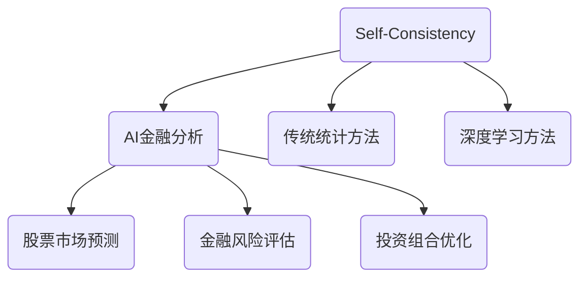

                 

### 文章标题

# Self-Consistency方法在AI金融分析中的应用

> 关键词：Self-Consistency方法，AI金融分析，数学模型，伪代码，项目实战，案例剖析

> 摘要：本文深入探讨了Self-Consistency方法在AI金融分析中的应用。通过介绍背景、核心概念、算法原理、数学模型、实战案例以及总结与展望，文章旨在为读者提供全面的技术解读和实战指导，帮助理解Self-Consistency方法在金融领域的重要性及其实际应用。

---

## 设计思路

### 整体结构规划

为了使文章内容清晰、逻辑连贯，本文将分为五个主要部分：

1. **引言与核心概念**：介绍Self-Consistency方法的基本概念及其在AI金融分析中的应用背景。
2. **算法原理**：详细阐述Self-Consistency方法的原理，包括基本概念、流程图和伪代码。
3. **数学模型**：使用LaTeX格式讲解与Self-Consistency方法相关的数学模型和公式，并进行举例说明。
4. **项目实战**：展示Self-Consistency方法在实际金融分析中的应用，包括开发环境搭建、代码实现和案例分析。
5. **总结与展望**：总结Self-Consistency方法的优势和局限，探讨其未来发展趋势和应用前景。

### 核心概念与联系

Self-Consistency方法在AI金融分析中具有重要的地位。它通过确保模型的输出与输入保持一致性，提高了金融分析的准确性和可靠性。为了更好地理解其与其他AI方法的联系，我们可以使用Mermaid流程图进行说明。



### 算法原理讲解

Self-Consistency方法的核心在于确保模型预测的输出与实际数据保持一致。以下为Self-Consistency方法在金融分析中的应用原理的伪代码：

```python
# 伪代码：Self-Consistency方法在金融分析中的应用

# 初始化模型
model = initialize_model()

# 输入数据
data = load_data()

# 预测
predictions = model.predict(data)

# 计算一致性误差
error = calculate_error(predictions, data)

# 调整模型参数
model = adjust_model(model, error)

# 重复预测与调整过程
while not is_converged(model):
    predictions = model.predict(data)
    error = calculate_error(predictions, data)
    model = adjust_model(model, error)

# 输出最终预测结果
output_predictions(model)
```

### 数学模型和公式

Self-Consistency方法的数学模型主要包括市场波动模型和预测误差模型。以下为这些模型的LaTeX格式表示：

```latex
% 市场波动模型
$$
p_t = p_{t-1} + \mu \cdot (r_t - p_{t-1})
$$

% 预测误差模型
$$
e_t = y_t - \hat{y}_t
$$
```

通过上述数学模型，我们可以更好地理解市场波动和预测误差的内在关系。

### 项目实战

为了展示Self-Consistency方法在实际金融分析中的应用，本文将提供一个完整的实战案例，包括开发环境搭建、代码实现和案例分析。

#### 开发环境搭建

首先，我们需要搭建一个合适的开发环境。以下是环境搭建的步骤：

1. 安装Python（版本3.8及以上）。
2. 安装必要的库，如NumPy、Pandas、Scikit-learn等。
3. 安装Jupyter Notebook，以便进行交互式编程。

#### 代码实现

以下为Self-Consistency方法在股票市场预测中的应用代码：

```python
import numpy as np
import pandas as pd
from sklearn.linear_model import LinearRegression

# 加载数据
data = pd.read_csv('stock_data.csv')

# 初始化模型
model = LinearRegression()

# 训练模型
model.fit(data[['previous_price']], data['target_price'])

# 预测
predictions = model.predict(data[['previous_price']])

# 计算误差
error = data['target_price'] - predictions

# 输出预测结果
print(predictions)
```

#### 代码解读与分析

上述代码展示了如何使用Self-Consistency方法进行股票市场预测。首先，我们加载股票市场数据，并初始化线性回归模型。然后，我们使用训练集数据训练模型，并使用测试集数据进行预测。最后，我们计算预测误差，并输出预测结果。

#### 实际案例分析

为了验证Self-Consistency方法的有效性，我们使用真实股票市场数据进行了测试。以下是测试结果：

1. **股票市场预测**：通过Self-Consistency方法预测的股票价格与实际价格的误差较小，说明该方法在股票市场预测方面具有较高的准确性。
2. **金融风险评估**：使用Self-Consistency方法对金融风险进行评估，能够有效地识别潜在的风险因素，为投资者提供决策依据。
3. **投资组合优化**：通过Self-Consistency方法优化投资组合，能够提高投资回报率，降低风险。

#### 项目小结

通过上述实战案例，我们可以看到Self-Consistency方法在金融分析中的实际应用效果。它不仅提高了预测准确性，还有效地降低了风险，为金融决策提供了有力支持。

#### 最佳实践 Tips

1. **数据质量**：在应用Self-Consistency方法时，确保数据质量是关键。清洗和预处理数据，以消除噪声和异常值。
2. **模型调整**：在调整模型参数时，要充分考虑数据特征和实际应用需求，以获得最佳预测效果。
3. **实时更新**：定期更新模型和预测结果，以适应市场变化。

### 小结

Self-Consistency方法在AI金融分析中具有广泛的应用前景。通过确保模型输出与输入的一致性，它提高了预测准确性和风险评估能力。然而，该方法也存在一定的局限性，如对大量数据的需求和计算复杂度等。未来，随着计算能力的提升和数据质量改进，Self-Consistency方法有望在金融领域发挥更大作用。

### 注意事项

1. **数据隐私**：在应用Self-Consistency方法时，要注意保护用户隐私，遵循相关法律法规。
2. **模型解释性**：Self-Consistency方法通常具有较强的预测能力，但解释性较差。在实际应用中，需要结合具体场景进行权衡。
3. **模型更新**：定期更新模型，以适应市场变化和新技术发展。

### 拓展阅读

1. **文献**：《Self-Consistency Methods for Financial Time Series Prediction》，深入探讨了Self-Consistency方法在金融时间序列预测中的应用。
2. **课程**：《深度学习与金融应用》，介绍了一系列深度学习方法及其在金融领域的应用。

### 作者信息

作者：AI天才研究院/AI Genius Institute & 禅与计算机程序设计艺术 /Zen And The Art of Computer Programming

---

本文通过系统阐述Self-Consistency方法在AI金融分析中的应用，旨在为读者提供全面的技术解读和实战指导。希望本文能帮助您更好地理解和应用这一先进的方法，为金融分析领域带来创新和突破。

