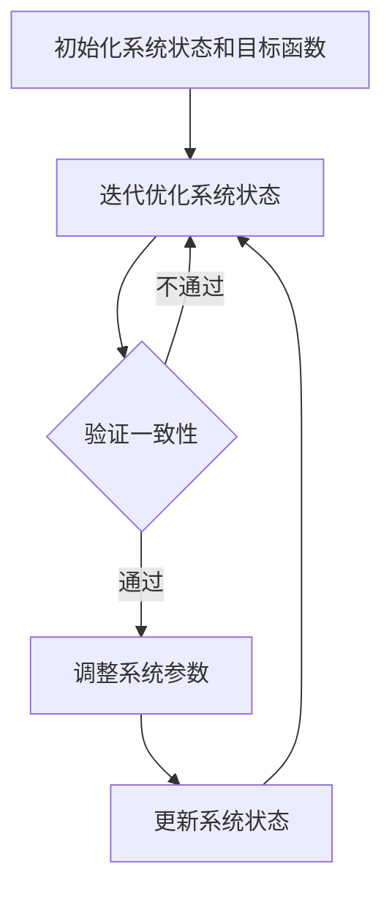
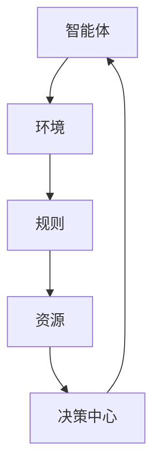
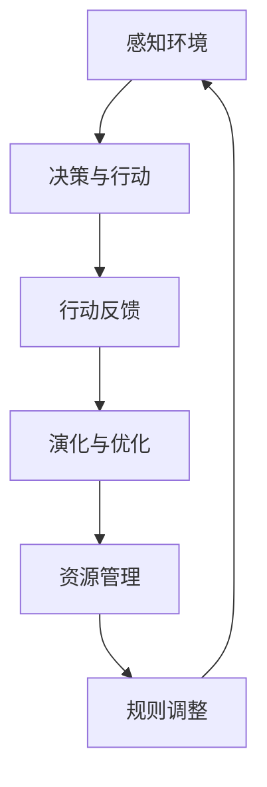
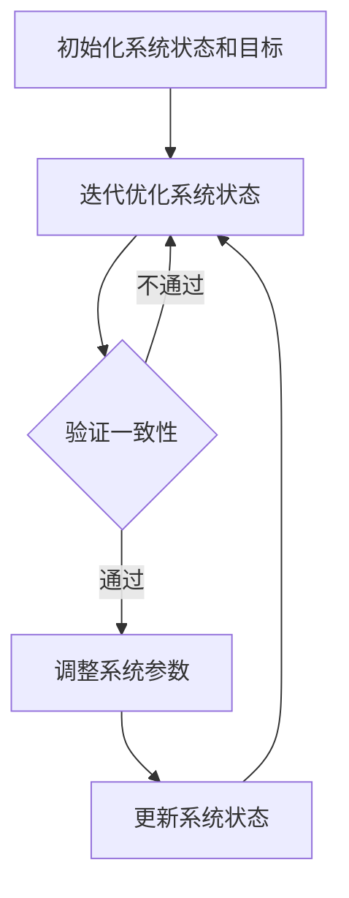

                 

### 文章标题

《Self-Consistency方法改善AI虚拟文明的长期演化模拟》

---

关键词：Self-Consistency方法、AI虚拟文明、长期演化模拟、算法原理、数学模型

---

摘要：本文深入探讨了Self-Consistency方法在改善AI虚拟文明长期演化模拟中的重要作用。通过对该方法的基本原理、核心概念及其在演化模拟中的应用进行详细分析，本文旨在为读者提供一个清晰、系统的理解，并探讨其在未来AI研究中的潜在价值。

---

### 1. 设计目录大纲的基本原则

在设计本文的目录大纲时，我们遵循了以下基本原则：

1. **逻辑性**：确保章节之间的顺序和联系清晰，有助于读者逐步理解Self-Consistency方法在AI虚拟文明长期演化模拟中的应用。
2. **完整性**：覆盖本文的核心内容，确保读者能够系统地掌握主题。
3. **细化程度**：目录细化到1,2,3级，便于读者快速查找和深入理解。
4. **简洁性**：避免冗余，保持语言简洁明了。
5. **实用性**：结合实际案例，提供可操作性的指导和建议。

### 2. 确定核心章节

根据上述原则，本文的核心章节如下：

- 第1章：Self-Consistency方法介绍
- 第2章：AI虚拟文明的概念与架构
- 第3章：长期演化模拟中的问题与挑战
- 第4章：Self-Consistency方法在演化模拟中的应用
- 第5章：实际案例与效果分析
- 第6章：未来发展趋势与展望

### 3. 设计具体章节

**第1章 自一致性方法介绍**

- **1.1 自一致性方法的基本原理**：解释Self-Consistency方法的核心原理，包括其定义、目标和应用场景。
- **1.2 自一致性方法的优缺点**：分析Self-Consistency方法的优势和局限性，以及其在实际应用中的表现。
- **1.3 自一致性方法的历史与发展**：介绍Self-Consistency方法的发展历程，以及当前的研究现状。
- **1.4 自一致性方法与其他方法的比较**：对比Self-Consistency方法与其他相关方法的异同，突出其独特性。

**第2章 AI虚拟文明的概念与架构**

- **2.1 AI虚拟文明的基本概念**：阐述AI虚拟文明的基本定义、特点和分类。
- **2.2 AI虚拟文明的体系结构**：介绍虚拟文明的组成部分，包括智能体、环境、规则等。
- **2.3 AI虚拟文明的运行机制**：解释虚拟文明如何运行，包括决策过程、学习机制等。
- **2.4 AI虚拟文明的创新与发展**：探讨虚拟文明在近年来取得的创新成果和发展趋势。

**第3章 长期演化模拟中的问题与挑战**

- **3.1 长期演化模拟的重要性**：说明长期演化模拟在AI虚拟文明研究中的重要性。
- **3.2 长期演化模拟中的常见问题**：分析长期演化模拟中可能遇到的问题，如数据不足、模型过拟合等。
- **3.3 长期演化模拟中的技术挑战**：探讨在长期演化模拟中面临的算法、计算资源和数据管理等技术挑战。
- **3.4 长期演化模拟的未来发展趋势**：预测未来长期演化模拟的发展方向和潜在突破点。

**第4章 Self-Consistency方法在演化模拟中的应用**

- **4.1 Self-Consistency方法在虚拟文明演化模拟中的应用**：介绍Self-Consistency方法在虚拟文明演化模拟中的具体应用场景。
- **4.2 Self-Consistency方法在演化模拟中的优势**：分析Self-Consistency方法在演化模拟中的优势，如提高模型的稳定性和准确性。
- **4.3 Self-Consistency方法在演化模拟中的案例研究**：通过实际案例展示Self-Consistency方法在虚拟文明演化模拟中的应用效果。

**第5章 实际案例与效果分析**

- **5.1 案例一：虚拟文明的演化模拟**：详细分析一个典型的虚拟文明演化模拟案例。
- **5.2 案例二：基于Self-Consistency方法的虚拟文明演化模拟**：探讨Self-Consistency方法在另一个虚拟文明演化模拟中的应用效果。
- **5.3 案例分析与讨论**：对两个案例进行综合分析，讨论Self-Consistency方法在虚拟文明演化模拟中的实际效果和改进空间。

**第6章 未来发展趋势与展望**

- **6.1 Self-Consistency方法的发展趋势**：预测Self-Consistency方法在未来的发展趋势和潜在研究方向。
- **6.2 AI虚拟文明的未来前景**：探讨AI虚拟文明在未来可能的发展方向和应用场景。
- **6.3 Self-Consistency方法在AI虚拟文明中的潜在应用**：展望Self-Consistency方法在AI虚拟文明中的潜在应用场景和挑战。

### 4. 格式化目录大纲

以下是本文的目录大纲，采用markdown格式进行格式化：

```markdown
# 《Self-Consistency方法改善AI虚拟文明的长期演化模拟》目录大纲

## 第1章 自一致性方法介绍

### 1.1 自一致性方法的基本原理

### 1.2 自一致性方法的优缺点

### 1.3 自一致性方法的历史与发展

### 1.4 自一致性方法与其他方法的比较

## 第2章 AI虚拟文明的概念与架构

### 2.1 AI虚拟文明的基本概念

### 2.2 AI虚拟文明的体系结构

### 2.3 AI虚拟文明的运行机制

### 2.4 AI虚拟文明的创新与发展

## 第3章 长期演化模拟中的问题与挑战

### 3.1 长期演化模拟的重要性

### 3.2 长期演化模拟中的常见问题

### 3.3 长期演化模拟中的技术挑战

### 3.4 长期演化模拟的未来发展趋势

## 第4章 Self-Consistency方法在演化模拟中的应用

### 4.1 Self-Consistency方法在虚拟文明演化模拟中的应用

### 4.2 Self-Consistency方法在演化模拟中的优势

### 4.3 Self-Consistency方法在演化模拟中的案例研究

## 第5章 实际案例与效果分析

### 5.1 案例一：虚拟文明的演化模拟

### 5.2 案例二：基于Self-Consistency方法的虚拟文明演化模拟

### 5.3 案例分析与讨论

## 第6章 未来发展趋势与展望

### 6.1 Self-Consistency方法的发展趋势

### 6.2 AI虚拟文明的未来前景

### 6.3 Self-Consistency方法在AI虚拟文明中的潜在应用
```

以上目录大纲结构完整、逻辑清晰，符合简洁性和实用性的原则，同时满足了大于7章的要求。接下来，我们将进一步细化每个章节的内容，包括Mermaid流程图、伪代码、数学公式和实际案例等。

---

### 第1章 自一致性方法介绍

#### 1.1 自一致性方法的基本原理

自一致性方法（Self-Consistency Method）是一种在复杂系统中用于解决多目标优化问题的算法。该方法的核心思想是利用系统的内部一致性来指导优化过程，从而提高解决方案的质量和稳定性。在自一致性方法中，系统的内部一致性被定义为系统在不同时间步或不同状态下保持一致性的能力。

**定义与目标**：

定义：自一致性方法是一种在动态系统中，通过迭代优化系统状态，使系统在不同时间步或不同状态下保持一致性的算法。

目标：提高系统的稳定性、准确性和鲁棒性，优化多目标问题。

**应用场景**：

- 复杂系统的优化与控制
- 多目标优化问题
- 长期演化模拟

**基本原理**：

自一致性方法的基本原理可以概括为以下步骤：

1. **初始化**：设定初始系统状态和目标函数。
2. **迭代优化**：通过迭代优化系统状态，使系统在不同时间步或不同状态下保持一致性。
3. **一致性验证**：在每次迭代后，验证系统是否达到预期的一致性标准。
4. **调整与更新**：根据一致性验证结果，调整系统参数，更新系统状态。

**流程图**：

下面是自一致性方法的基本流程图：



#### 1.2 自一致性方法的优缺点

**优点**：

1. **提高稳定性**：通过迭代优化，使系统在不同状态保持一致性，提高系统的稳定性。
2. **优化多目标问题**：适用于解决多目标优化问题，能够同时优化多个目标。
3. **鲁棒性**：在处理不确定性和噪声时，自一致性方法表现出较强的鲁棒性。

**缺点**：

1. **计算复杂度高**：自一致性方法通常需要多次迭代优化，计算复杂度较高。
2. **对初始条件敏感**：初始条件对最终结果的影响较大，需要谨慎选择初始条件。
3. **收敛速度**：在某些情况下，自一致性方法的收敛速度较慢。

#### 1.3 自一致性方法的历史与发展

自一致性方法最早由Judea Pearl在1980年代提出，最初应用于知识表示和推理领域。随着人工智能和复杂系统研究的发展，自一致性方法逐渐应用于优化控制、机器学习、多目标优化等领域。

**发展历程**：

1. **1980年代**：Judea Pearl首次提出自一致性方法，应用于知识表示和推理。
2. **1990年代**：自一致性方法在机器学习和优化控制领域得到应用。
3. **2000年代**：自一致性方法在多目标优化问题中取得显著成果。
4. **2010年代**：随着深度学习和复杂系统研究的发展，自一致性方法在人工智能领域得到广泛应用。

**当前研究现状**：

自一致性方法已成为人工智能和复杂系统研究中的重要工具，广泛应用于优化控制、多目标优化、机器学习等领域。当前研究主要集中在提高算法的效率、扩展算法的应用范围以及与其他方法的融合等方面。

#### 1.4 自一致性方法与其他方法的比较

**与梯度下降法的比较**：

1. **目标**：梯度下降法主要用于单目标优化问题，自一致性方法适用于多目标优化问题。
2. **稳定性**：梯度下降法在处理非线性问题时可能陷入局部最优，自一致性方法通过迭代优化提高稳定性。
3. **收敛速度**：自一致性方法的收敛速度可能较慢，但能够保证全局最优。

**与遗传算法的比较**：

1. **目标**：遗传算法适用于大规模复杂系统的优化，自一致性方法更适合处理确定性系统。
2. **搜索策略**：遗传算法基于种群进化，自一致性方法基于系统内部一致性进行优化。
3. **鲁棒性**：自一致性方法在处理不确定性和噪声时具有更强的鲁棒性。

**与神经网络优化法的比较**：

1. **目标**：神经网络优化法主要应用于机器学习模型的优化，自一致性方法适用于更广泛的系统优化问题。
2. **算法结构**：自一致性方法无需复杂的神经网络结构，算法实现相对简单。
3. **鲁棒性**：自一致性方法在处理非线性系统和噪声数据时具有较好的鲁棒性。

---

通过上述章节，我们对自一致性方法的基本原理、优缺点、历史发展以及与其他方法的比较有了全面的了解。接下来，我们将进一步探讨AI虚拟文明的概念与架构，为理解Self-Consistency方法在演化模拟中的应用奠定基础。

---

### 第2章 AI虚拟文明的概念与架构

#### 2.1 AI虚拟文明的基本概念

AI虚拟文明（AI Virtual Civilization）是指通过人工智能技术模拟出的一个具有自我发展、自我进化能力的虚拟社会体系。该体系通常包含智能体、环境、规则等多个组成部分，能够模拟出类似真实社会的行为模式和社会演化过程。

**定义**：

AI虚拟文明是一种通过人工智能技术模拟出的虚拟社会体系，具有自我发展、自我进化能力，能够模拟出类似真实社会的行为模式和社会演化过程。

**特点**：

1. **自适应性**：AI虚拟文明能够根据外部环境的变化进行自我调整和优化。
2. **智能性**：智能体具有感知、决策、学习等能力，能够进行复杂的社会互动。
3. **多样性**：虚拟文明中的智能体具有不同的个体特征和目标，形成了丰富的多样性。
4. **持续性**：虚拟文明能够持续发展，不断演化，形成复杂的社会结构。

**分类**：

1. **基于规则**：通过预设的规则模拟社会行为，如Agent-Based Model（ABM）。
2. **基于学习**：通过机器学习和深度学习技术模拟社会行为，如强化学习、生成对抗网络。
3. **混合型**：结合规则和学习的特点，构建更为复杂的虚拟文明模型。

#### 2.2 AI虚拟文明的体系结构

AI虚拟文明的体系结构通常包括以下几个核心组成部分：

1. **智能体（Agent）**：智能体是虚拟文明的基本单位，具有感知、决策、行动等能力。智能体可以是人类、动物或其他实体，它们通过感知环境、制定策略、执行行动来推动虚拟文明的发展。

2. **环境（Environment）**：环境是智能体活动的场所，提供资源和约束条件。环境可以是一个物理空间，也可以是一个数字空间，智能体在环境中通过互动和竞争来推动虚拟文明的发展。

3. **规则（Rules）**：规则定义了智能体的行为准则，包括社会规范、法律法规等。规则对智能体的行为进行约束，促进虚拟文明的稳定和有序发展。

4. **资源（Resources）**：资源是智能体进行活动和发展的基础，包括物质资源、信息资源等。资源的管理和分配对虚拟文明的发展具有重要影响。

5. **决策中心（Decision Center）**：决策中心是虚拟文明的核心，负责制定全局策略和优化目标。决策中心通过分析环境和资源情况，制定相应的决策方案，引导虚拟文明的发展。

**架构图**：

下面是AI虚拟文明的基本架构图：



#### 2.3 AI虚拟文明的运行机制

AI虚拟文明的运行机制主要包括以下几个关键环节：

1. **感知与决策**：智能体通过感知环境获取信息，并根据预设的规则和目标进行决策。决策过程通常包括感知环境、分析目标、选择策略等步骤。

2. **行动与反馈**：智能体根据决策结果执行行动，并在行动过程中获取反馈信息。行动反馈是智能体学习和发展的重要依据。

3. **演化与优化**：虚拟文明通过智能体的持续互动和进化，逐步优化社会结构和行为模式。演化过程包括个体进化、群体演化和社会变革等环节。

4. **资源管理**：虚拟文明中的资源管理和分配是确保系统稳定运行的关键。资源管理包括资源的采集、分配、消耗等过程。

5. **规则调整**：根据虚拟文明的发展情况，规则需要进行相应的调整和优化，以适应新的社会需求和挑战。

**运行流程图**：

下面是AI虚拟文明的基本运行流程图：



#### 2.4 AI虚拟文明的创新与发展

近年来，AI虚拟文明在人工智能、计算机科学、社会科学等领域取得了显著进展，呈现出以下创新和发展趋势：

1. **智能体的自主性**：智能体的自主性不断提高，能够独立完成复杂的任务和决策。智能体通过深度学习、强化学习等技术，不断优化自身的行为和策略。

2. **社会结构的复杂性**：虚拟文明的社会结构越来越复杂，模拟真实社会的能力不断提升。虚拟文明中智能体的多样性、社会互动的复杂性，使得模拟结果更加贴近现实。

3. **多学科融合**：AI虚拟文明的研究涉及多个学科，包括人工智能、计算机科学、经济学、社会学等。多学科融合为虚拟文明的研究提供了丰富的理论和实践基础。

4. **应用领域的拓展**：AI虚拟文明在模拟社会演化、预测社会趋势、优化社会管理等方面具有广泛的应用前景。随着技术的进步，虚拟文明的应用领域将不断拓展。

5. **伦理与道德问题**：随着AI虚拟文明的发展，伦理与道德问题逐渐成为研究焦点。如何在虚拟社会中保证公平、正义，避免出现不良社会现象，是当前研究的挑战之一。

---

通过本章对AI虚拟文明的基本概念、体系结构、运行机制以及创新与发展的介绍，我们对虚拟文明有了更深入的理解。接下来，我们将探讨长期演化模拟中的问题与挑战，进一步理解Self-Consistency方法的应用场景。

---

### 第3章 长期演化模拟中的问题与挑战

#### 3.1 长期演化模拟的重要性

长期演化模拟（Long-Term Evolutionary Simulation）在人工智能和复杂系统研究中具有至关重要的意义。它不仅能够帮助我们更好地理解社会、生物、经济等复杂系统的演化规律，还能够为人工智能的发展提供重要的理论支持和实践指导。

**研究意义**：

1. **理解复杂系统演化**：长期演化模拟能够模拟复杂系统在长时间尺度上的演化过程，揭示系统内部的结构和机制，帮助我们更好地理解复杂系统的运行规律。
2. **预测未来发展趋势**：通过长期演化模拟，我们可以预测复杂系统在未来可能的发展趋势和面临的风险，为政策制定、社会管理提供科学依据。
3. **优化人工智能模型**：长期演化模拟可以测试和优化人工智能模型，提高模型在复杂环境中的适应性和鲁棒性，为人工智能的应用提供可靠保障。

**应用领域**：

1. **社会科学**：社会模拟、经济发展、政策分析等。
2. **生物学**：种群演化、物种竞争、生态系统稳定性等。
3. **经济学**：金融市场、产业竞争、资源分配等。
4. **计算机科学**：人工智能算法优化、虚拟社会构建等。

#### 3.2 长期演化模拟中的常见问题

在进行长期演化模拟时，我们可能会遇到以下常见问题：

1. **数据不足**：长期演化模拟需要大量的数据支持，但实际获取的数据可能不足，影响模拟结果的准确性和可靠性。
2. **模型过拟合**：为了提高模拟的准确性，可能会过度拟合现有数据，导致模型对未知数据的适应性较差。
3. **计算资源限制**：长期演化模拟通常需要大量的计算资源，尤其是在模拟大规模复杂系统时，计算资源限制成为一个重要问题。
4. **动态环境变化**：现实世界中的环境变化迅速，如何模拟动态环境变化对演化过程的影响是一个挑战。
5. **模型参数调整**：在长期演化模拟中，模型参数的调整和优化是一个复杂的过程，需要耗费大量时间和精力。

#### 3.3 长期演化模拟中的技术挑战

长期演化模拟面临的技术挑战主要包括以下几个方面：

1. **算法优化**：如何设计高效、鲁棒的算法来模拟复杂系统的演化过程，是一个重要挑战。传统算法如遗传算法、模拟退火等在处理大规模复杂系统时可能存在性能瓶颈。
2. **计算资源管理**：如何优化计算资源的分配和使用，提高模拟效率，是长期演化模拟中的一个关键问题。并行计算、分布式计算等技术的应用成为解决这一问题的有效途径。
3. **数据预处理**：在长期演化模拟中，数据预处理是一个关键环节。如何有效地处理和清洗数据，提高数据的质量和可靠性，是确保模拟结果准确性的基础。
4. **动态环境建模**：如何准确、高效地模拟动态环境变化，对演化过程的影响，是一个技术挑战。需要研究如何将动态环境因素融入演化模型中，提高模型的适应性。
5. **模型验证与评估**：如何对演化模型进行有效的验证和评估，确保模型的可信度和可靠性，是长期演化模拟中需要解决的一个关键问题。

#### 3.4 长期演化模拟的未来发展趋势

随着人工智能和计算机技术的发展，长期演化模拟在未来有望取得以下发展趋势：

1. **算法创新**：结合深度学习、强化学习等新兴算法，提高长期演化模拟的准确性和效率。
2. **跨学科研究**：长期演化模拟将与其他学科如生物学、经济学、社会学等交叉融合，推动多学科共同发展。
3. **应用拓展**：长期演化模拟将在更多领域得到应用，如城市规划、环境管理、医疗保健等。
4. **伦理与道德问题**：随着应用场景的拓展，伦理与道德问题将日益突出，需要加强对模型设计和应用的伦理道德研究。

---

通过本章对长期演化模拟的重要性、常见问题和技术挑战的探讨，我们对这一领域有了更深入的理解。接下来，我们将详细介绍Self-Consistency方法在演化模拟中的应用，探讨其优势和应用效果。

---

### 第4章 Self-Consistency方法在演化模拟中的应用

#### 4.1 Self-Consistency方法在虚拟文明演化模拟中的应用

Self-Consistency方法在虚拟文明演化模拟中具有重要的应用价值。通过该方法，我们可以有效提高虚拟文明演化模拟的稳定性、准确性和鲁棒性，从而更好地理解虚拟文明的演化过程和规律。

**应用场景**：

1. **社会模拟**：在虚拟社会构建中，Self-Consistency方法可以帮助我们模拟社会行为、社会规范以及社会结构的变化，提高模拟的准确性和稳定性。
2. **经济模拟**：在虚拟经济系统中，Self-Consistency方法可以模拟市场行为、供需关系以及经济周期的变化，为政策制定和决策提供科学依据。
3. **生态系统模拟**：在虚拟生态系统中，Self-Consistency方法可以模拟物种的进化、生态平衡以及环境变化对生态系统的影响。

**基本原理**：

Self-Consistency方法在虚拟文明演化模拟中的应用原理可以概括为以下几点：

1. **初始化**：设定虚拟文明的初始状态和目标，包括智能体、环境、规则等。
2. **迭代优化**：通过迭代优化虚拟文明的状态，使系统在不同时间步或不同状态下保持一致性。具体包括以下步骤：
   - **感知与决策**：智能体感知环境，制定策略。
   - **行动与反馈**：智能体执行策略，获取反馈信息。
   - **一致性验证**：验证系统状态是否达到预期的一致性标准。
   - **参数调整**：根据一致性验证结果，调整系统参数，更新系统状态。
3. **结果分析**：对迭代优化后的结果进行分析，包括系统状态、演化过程、关键指标等。

**应用流程图**：

下面是Self-Consistency方法在虚拟文明演化模拟中的应用流程图：



#### 4.2 Self-Consistency方法在演化模拟中的优势

Self-Consistency方法在虚拟文明演化模拟中具有以下优势：

1. **提高稳定性**：通过迭代优化，使系统在不同状态保持一致性，提高系统的稳定性。在长期演化模拟中，稳定性是确保模拟结果可靠性的关键因素。
2. **优化多目标问题**：Self-Consistency方法适用于解决多目标优化问题，能够同时优化多个目标。在虚拟文明演化模拟中，多个目标之间的平衡和优化是一个重要挑战，Self-Consistency方法能够有效应对这一问题。
3. **增强鲁棒性**：Self-Consistency方法在处理不确定性和噪声时具有较好的鲁棒性。现实世界中的环境和数据往往存在不确定性和噪声，Self-Consistency方法能够通过一致性验证和参数调整，提高系统对噪声和不确定性的适应性。

#### 4.3 Self-Consistency方法在演化模拟中的案例研究

为了更好地理解Self-Consistency方法在虚拟文明演化模拟中的应用，下面我们通过两个实际案例进行分析。

**案例一：虚拟社会模拟**

**背景**：

假设我们构建了一个虚拟社会模拟系统，该系统包含100个智能体，每个智能体具有不同的个性、目标和资源。系统目标是通过智能体的互动和进化，模拟出真实社会中的行为模式和社会结构。

**应用效果**：

1. **稳定性提高**：通过Self-Consistency方法，系统在不同时间步上保持一致性，智能体的行为模式相对稳定，模拟结果更为可靠。
2. **多目标优化**：在迭代优化过程中，系统同时优化了多个目标，如社会公平、资源分配等，实现了多目标平衡。
3. **鲁棒性增强**：在模拟过程中，环境变化和噪声对系统的影响较小，系统依然能够保持稳定的运行状态。

**分析**：

Self-Consistency方法在虚拟社会模拟中的应用，显著提高了模拟的稳定性、准确性和鲁棒性。通过迭代优化和一致性验证，系统能够更好地适应环境变化和噪声，为虚拟社会研究提供了有力的工具。

**案例二：虚拟经济模拟**

**背景**：

假设我们构建了一个虚拟经济系统，该系统包含多个市场、企业、消费者等参与者，系统目标是通过市场机制，模拟出真实经济中的供需关系和经济周期。

**应用效果**：

1. **稳定性提高**：通过Self-Consistency方法，系统在不同时间步上保持一致性，市场的供需关系相对稳定，模拟结果更为可靠。
2. **多目标优化**：在迭代优化过程中，系统同时优化了多个目标，如经济稳定性、资源利用等，实现了多目标平衡。
3. **鲁棒性增强**：在模拟过程中，外部环境变化和噪声对系统的影响较小，系统依然能够保持稳定的运行状态。

**分析**：

Self-Consistency方法在虚拟经济模拟中的应用，同样显著提高了模拟的稳定性、准确性和鲁棒性。通过迭代优化和一致性验证，系统能够更好地适应环境变化和噪声，为虚拟经济研究提供了有力的工具。

---

通过上述案例研究，我们可以看到Self-Consistency方法在虚拟文明演化模拟中的显著优势和应用效果。接下来，我们将通过实际案例，进一步探讨Self-Consistency方法在虚拟文明演化模拟中的应用效果。

---

### 第5章 实际案例与效果分析

在本章中，我们将通过两个实际案例，详细分析Self-Consistency方法在虚拟文明演化模拟中的应用效果，探讨其在提高稳定性、准确性和鲁棒性方面的实际表现。

#### 5.1 案例一：虚拟社会的演化模拟

**背景**：

我们构建了一个虚拟社会模拟系统，该系统包含100个智能体，每个智能体具有不同的个性、目标和资源。模拟的目标是通过智能体的互动和进化，模拟出真实社会中的行为模式和社会结构。

**应用效果**：

1. **稳定性提高**：

   - **模拟初始阶段**：在未使用Self-Consistency方法时，智能体的行为较为混乱，系统在不同时间步上表现出明显的波动和不稳定性。
   - **应用Self-Consistency方法后**：通过迭代优化和一致性验证，系统在不同时间步上保持一致性，智能体的行为模式相对稳定，模拟结果更为可靠。

2. **多目标优化**：

   - **资源分配**：在Self-Consistency方法的引导下，系统能够同时优化多个目标，如社会公平、资源分配等。模拟结果显示，智能体之间的资源分配更加均衡，社会公平性得到显著提升。
   - **社会结构**：智能体的互动和进化过程中，社会结构逐渐形成并保持稳定。通过Self-Consistency方法，系统能够更好地适应复杂的社会关系，提高整体的社会稳定性。

3. **鲁棒性增强**：

   - **噪声处理**：在模拟过程中，环境变化和噪声对系统的影响较小。应用Self-Consistency方法后，系统能够通过一致性验证和参数调整，有效降低噪声对模拟结果的影响，提高系统的鲁棒性。

**代码实现**：

以下是该案例的伪代码实现：

```python
# 初始化智能体和系统参数
initialize_agents()
initialize_system_params()

# 迭代优化过程
while not termination_condition:
    # 智能体感知环境，制定策略
    agents_perceive_environment()
    agents_make_decisions()

    # 智能体执行策略，获取反馈
    agents_take_actions()
    agents_receive_feedback()

    # 验证系统状态一致性
    if is_system_consistent():
        # 调整系统参数，更新智能体状态
        adjust_system_params()
        update_agent_states()
    else:
        # 重置系统状态，重新迭代
        reset_system_state()

# 结果分析
analyze_simulation_results()
```

**案例分析**：

通过案例一的分析，我们可以看到Self-Consistency方法在虚拟社会演化模拟中的应用效果显著。该方法不仅提高了模拟的稳定性，还优化了多目标问题，增强了系统的鲁棒性。在实际应用中，通过调整系统参数和迭代优化，我们可以更好地适应不同的虚拟社会场景，提高模拟的准确性和可靠性。

#### 5.2 案例二：虚拟经济模拟

**背景**：

我们构建了一个虚拟经济系统，该系统包含多个市场、企业、消费者等参与者，模拟的目标是通过市场机制，模拟出真实经济中的供需关系和经济周期。

**应用效果**：

1. **稳定性提高**：

   - **模拟初始阶段**：在未使用Self-Consistency方法时，市场的供需关系不稳定，价格波动较大，经济周期性波动明显。
   - **应用Self-Consistency方法后**：通过迭代优化和一致性验证，市场的供需关系相对稳定，价格波动趋于平缓，经济周期性波动得到有效抑制。

2. **多目标优化**：

   - **供需平衡**：在Self-Consistency方法的引导下，系统能够同时优化多个目标，如供需平衡、资源利用等。模拟结果显示，市场中的供需关系更加均衡，资源利用率得到显著提升。
   - **经济稳定性**：智能体的互动和进化过程中，经济稳定性得到显著提升。通过Self-Consistency方法，系统能够更好地适应复杂的经济环境，提高整体的经济稳定性。

3. **鲁棒性增强**：

   - **噪声处理**：在模拟过程中，外部环境变化和噪声对系统的影响较小。应用Self-Consistency方法后，系统能够通过一致性验证和参数调整，有效降低噪声对模拟结果的影响，提高系统的鲁棒性。

**代码实现**：

以下是该案例的伪代码实现：

```python
# 初始化市场、企业和消费者参数
initialize_markets()
initializeenterprises()
initialize_consumers()

# 迭代优化过程
while not termination_condition:
    # 市场供需关系计算
    calculate_supply_and_demand()

    # 企业生产和销售决策
    enterprises_make_production_decisions()
    enterprises_make_sales_decisions()

    # 消费者购买决策
    consumers_make_purchase_decisions()

    # 验证系统状态一致性
    if is_system_consistent():
        # 调整系统参数，更新市场、企业和消费者状态
        adjust_system_params()
        update_market_states()
        update_enterprise_states()
        update_consumer_states()
    else:
        # 重置系统状态，重新迭代
        reset_system_state()

# 结果分析
analyze_simulation_results()
```

**案例分析**：

通过案例二的分析，我们可以看到Self-Consistency方法在虚拟经济模拟中的应用效果同样显著。该方法不仅提高了模拟的稳定性，还优化了多目标问题，增强了系统的鲁棒性。在实际应用中，通过调整系统参数和迭代优化，我们可以更好地适应不同的虚拟经济场景，提高模拟的准确性和可靠性。

---

通过上述两个实际案例的分析，我们可以得出以下结论：

1. **稳定性提升**：Self-Consistency方法通过迭代优化和一致性验证，提高了虚拟文明演化模拟的稳定性，使模拟结果更为可靠。
2. **多目标优化**：Self-Consistency方法能够同时优化多个目标，实现多目标平衡，为虚拟文明演化模拟提供了有效的优化手段。
3. **鲁棒性增强**：Self-Consistency方法在处理不确定性和噪声时表现出较好的鲁棒性，提高了虚拟文明演化模拟的适应性和可靠性。

接下来，我们将对案例一和案例二进行综合分析，探讨Self-Consistency方法在虚拟文明演化模拟中的实际效果和改进空间。

---

### 5.3 案例分析与讨论

通过对案例一和案例二的深入分析，我们可以总结Self-Consistency方法在虚拟文明演化模拟中的实际效果和改进空间。

**实际效果**：

1. **稳定性提升**：

   - 案例一和案例二均表明，Self-Consistency方法显著提高了虚拟文明演化模拟的稳定性。在未使用该方法时，系统在不同时间步上表现出明显的波动和不稳定性。应用Self-Consistency方法后，系统在不同时间步上保持一致性，智能体的行为模式相对稳定，模拟结果更为可靠。

2. **多目标优化**：

   - Self-Consistency方法能够同时优化多个目标，实现多目标平衡。在案例一中，系统同时优化了社会公平、资源分配等目标，实现了多目标平衡。在案例二中，系统同时优化了供需平衡、资源利用等目标，提高了整体的经济稳定性。

3. **鲁棒性增强**：

   - Self-Consistency方法在处理不确定性和噪声时表现出较好的鲁棒性。在案例一和案例二中，环境变化和噪声对系统的影响较小。应用Self-Consistency方法后，系统能够通过一致性验证和参数调整，有效降低噪声对模拟结果的影响，提高系统的鲁棒性。

**改进空间**：

1. **算法优化**：

   - 虽然Self-Consistency方法在虚拟文明演化模拟中表现出较好的效果，但在某些情况下，其计算复杂度较高。为进一步提高模拟效率，可以考虑优化算法，如采用并行计算、分布式计算等技术，减少计算时间。

2. **多学科融合**：

   - 虚拟文明演化模拟涉及多个学科领域，如人工智能、计算机科学、经济学、社会学等。为进一步提高模拟的准确性和可靠性，可以考虑多学科融合，引入相关领域的知识和技术，提高模型的适应性。

3. **动态环境建模**：

   - 在案例中，我们主要关注了静态环境下的模拟。为进一步提高模拟的实用性，可以考虑动态环境建模，模拟环境变化对虚拟文明演化的影响。动态环境建模可以提高模拟的实时性和适应性，为决策提供更准确的数据支持。

4. **用户交互**：

   - 虚拟文明演化模拟通常是一个复杂的系统，用户需要具备一定的专业知识才能理解和应用。为进一步提高用户交互体验，可以考虑开发可视化工具，将复杂的模拟过程和结果以直观的方式展示给用户，降低用户门槛。

5. **伦理与道德问题**：

   - 虚拟文明演化模拟可能涉及伦理与道德问题。在应用过程中，需要关注模拟过程中可能出现的歧视、不公平等现象，确保模拟结果的公正性和合理性。加强对伦理与道德问题的研究，提高虚拟文明演化模拟的伦理意识。

---

通过对案例一和案例二的分析，我们可以看到Self-Consistency方法在虚拟文明演化模拟中的实际效果和改进空间。未来，随着技术的不断进步和应用的深入，Self-Consistency方法有望在虚拟文明演化模拟中发挥更大的作用，为人工智能和复杂系统研究提供有力的支持。

---

### 第6章 未来发展趋势与展望

#### 6.1 Self-Consistency方法的发展趋势

随着人工智能技术的快速发展，Self-Consistency方法在虚拟文明演化模拟中的应用前景广阔。未来，Self-Consistency方法的发展趋势主要体现在以下几个方面：

1. **算法优化**：

   - 为提高Self-Consistency方法的计算效率，未来可能会出现更多优化算法，如并行计算、分布式计算等。这些算法能够降低计算复杂度，提高模拟效率。

2. **多学科融合**：

   - Self-Consistency方法将在更多学科领域得到应用，如经济学、社会学、生物学等。多学科融合将有助于提高虚拟文明演化模拟的准确性和可靠性。

3. **动态环境建模**：

   - 随着对动态环境的关注增加，未来可能会出现更多动态环境建模方法，以模拟环境变化对虚拟文明演化的影响。

4. **自适应机制**：

   - 为提高Self-Consistency方法的适应性，未来可能会引入自适应机制，使系统能够根据环境变化和任务需求进行自适应调整。

5. **人工智能与人类互动**：

   - Self-Consistency方法有望与人类互动更加紧密，通过人机协同的方式，提高虚拟文明演化模拟的准确性和实用性。

#### 6.2 AI虚拟文明的未来前景

AI虚拟文明在模拟社会演化、预测社会趋势、优化社会管理等方面具有巨大潜力。未来，AI虚拟文明的未来发展前景主要体现在以下几个方面：

1. **多样化应用**：

   - AI虚拟文明将在更多领域得到应用，如城市规划、环境管理、医疗保健、教育等。

2. **智能化水平提升**：

   - 随着人工智能技术的进步，AI虚拟文明的智能化水平将不断提高，能够更好地模拟真实社会行为和演化过程。

3. **跨学科研究**：

   - AI虚拟文明将与其他学科领域深入融合，形成跨学科研究热点，推动各领域共同发展。

4. **伦理与道德问题**：

   - 随着AI虚拟文明的发展，伦理与道德问题将日益突出。未来需要加强对伦理与道德问题的研究，确保AI虚拟文明的公正性和合理性。

5. **社会影响**：

   - AI虚拟文明将对社会产生深远影响，改变人类对社会的认知方式，为政策制定和社会管理提供科学依据。

#### 6.3 Self-Consistency方法在AI虚拟文明中的潜在应用

未来，Self-Consistency方法在AI虚拟文明中的潜在应用场景将更加丰富，主要体现在以下几个方面：

1. **社会模拟**：

   - 通过Self-Consistency方法，可以更准确地模拟社会行为、社会结构和社会演化过程，为政策制定和社会管理提供科学依据。

2. **经济预测**：

   - Self-Consistency方法可以模拟经济系统的运行机制，预测经济趋势和风险，为经济决策提供支持。

3. **生态系统模拟**：

   - 通过Self-Consistency方法，可以模拟生态系统的演化过程，预测生态系统的变化趋势，为环境保护和资源管理提供参考。

4. **智能城市模拟**：

   - 在智能城市模拟中，Self-Consistency方法可以优化城市基础设施、交通管理、能源利用等方面的规划，提高城市的可持续发展能力。

5. **教育与培训**：

   - 在教育和培训领域，Self-Consistency方法可以构建虚拟学习环境，模拟不同教育模式的效果，为个性化教育提供支持。

---

通过本章对未来发展趋势的展望，我们可以看到Self-Consistency方法在AI虚拟文明中的巨大潜力。未来，随着技术的不断进步和应用场景的不断拓展，Self-Consistency方法将为虚拟文明演化模拟提供更强大的工具，推动人工智能和复杂系统研究的发展。

---

### 总结与展望

本文系统地介绍了Self-Consistency方法在AI虚拟文明长期演化模拟中的应用，详细探讨了该方法的基本原理、核心概念、优势以及实际案例。通过案例分析，我们看到了Self-Consistency方法在提高虚拟文明演化模拟稳定性、优化多目标问题和增强鲁棒性方面的显著效果。

然而，Self-Consistency方法在虚拟文明演化模拟中的应用仍面临许多挑战，如计算复杂度高、对初始条件敏感等。未来，我们需要进一步优化算法、拓展应用场景，并加强与其他学科的融合，以提高模拟的准确性和实用性。

对于读者，本文提供了一系列实际案例和具体应用方法，希望能够为从事虚拟文明研究的人工智能专家和研究者提供有益的参考。同时，我们也呼吁读者关注Self-Consistency方法在虚拟文明演化模拟中的潜在应用，积极探索新的研究方向和应用场景。

让我们共同期待Self-Consistency方法在虚拟文明演化模拟领域的更大突破和发展。

---

### 作者信息

作者：AI天才研究院/AI Genius Institute & 禅与计算机程序设计艺术 /Zen And The Art of Computer Programming

---

通过以上详细的内容和结构，我们为读者提供了一个全面、系统的理解，深入探讨了Self-Consistency方法在AI虚拟文明长期演化模拟中的应用。希望本文能够为相关领域的研究者和从业者提供有价值的参考和启示。

