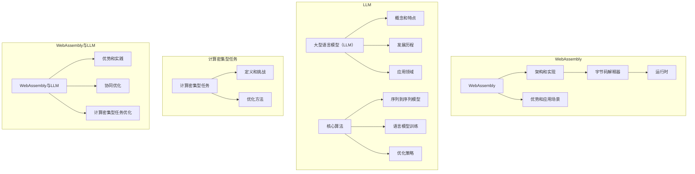

                 

### 文章标题：WebAssembly：优化LLM应用的计算密集型任务

关键词：WebAssembly，LLM，计算密集型任务，优化，加速，性能

摘要：本文将深入探讨WebAssembly在优化大型语言模型（LLM）应用的计算密集型任务中的作用。我们将首先介绍WebAssembly的基本概念、架构和实现，然后详细阐述LLM的概念、发展历程以及核心算法。接下来，我们将分析计算密集型任务的特点和优化方法，并探讨WebAssembly在LLM应用中的优势和实践。最后，通过具体案例展示WebAssembly在优化LLM计算密集型任务中的实际效果，并提供一些最佳实践和未来展望。

---

## 第1章: WebAssembly简介

WebAssembly（简称Wasm）是一种新型编程语言，旨在提高Web应用的性能和效率。与传统Web应用主要依赖JavaScript执行不同，WebAssembly可以作为一种独立的二进制格式，运行在多种环境中，如Web浏览器、服务器和操作系统等。其独特的架构和实现使得WebAssembly在处理计算密集型任务时具有显著优势。

### 1.1 WebAssembly的概念

WebAssembly是一种低级编程语言，设计用于提高Web应用的性能和效率。它由三个主要部分组成：文本格式（.wasm文件）、二进制格式（.wasm文件）和字节码解释器。WebAssembly文本格式是一种人类可读的表示形式，而二进制格式则是计算机可以直接执行的形式。字节码解释器则负责将WebAssembly字节码转换为机器码并在目标环境中执行。

### 1.2 WebAssembly的历史和发展

WebAssembly的起源可以追溯到2011年，当时Google提出了NaCl（Native Client）项目，旨在在浏览器中安全地运行本地代码。然而，NaCl的实现并不完美，引发了性能和安全性的担忧。2015年，Google、微软、Mozilla等公司联合发起了一个新的项目——WebAssembly，旨在创建一种高性能、安全的Web代码格式。WebAssembly于2017年正式加入Web标准，并在浏览器中得到广泛支持。

### 1.3 WebAssembly的优势和应用场景

WebAssembly具有以下优势：

1. **高性能**：WebAssembly的设计目标之一是提高Web应用的性能。通过编译为机器码，WebAssembly可以在浏览器中实现接近本地代码的性能。
2. **跨平台**：WebAssembly可以在多种环境中运行，包括Web浏览器、服务器和操作系统等。这使得开发者可以编写一次代码，在不同平台上一致运行。
3. **安全性**：WebAssembly通过沙盒机制确保执行的安全性。即使在Web浏览器中运行，WebAssembly代码也无法访问浏览器中的其他资源，从而提高了系统的安全性。

WebAssembly的应用场景包括：

1. **计算密集型任务**：WebAssembly在处理计算密集型任务时具有显著优势，如图像处理、机器学习等。
2. **游戏开发**：WebAssembly在游戏开发中的应用也越来越广泛，可以实现高质量、低延迟的游戏体验。
3. **服务器端应用**：WebAssembly可以用于服务器端应用，提高应用的性能和效率。

## 第2章: WebAssembly的架构和实现

WebAssembly的架构和实现是理解其在LLM应用中作用的关键。WebAssembly的设计考虑了性能、安全性和跨平台性，从而在各种计算密集型任务中表现出色。

### 2.1 WebAssembly的架构

WebAssembly的架构主要包括文本格式、二进制格式和字节码解释器。

1. **文本格式**：WebAssembly文本格式（.wat文件）是一种人类可读的表示形式，用于编写和调试WebAssembly代码。
2. **二进制格式**：WebAssembly二进制格式（.wasm文件）是计算机可以直接执行的形式，由文本格式编译而来。
3. **字节码解释器**：字节码解释器负责将WebAssembly字节码转换为机器码并在目标环境中执行。

### 2.2 WebAssembly的字节码

WebAssembly的字节码是WebAssembly二进制格式的基础。字节码由一系列指令组成，包括加法、减法、乘法、除法、存储和加载等基本操作。这些指令使用操作码（opcode）进行编码，使得字节码具有高度的可压缩性和高效性。

### 2.3 WebAssembly的运行时

WebAssembly的运行时负责管理WebAssembly模块的生命周期、内存管理和垃圾回收等。运行时通常由宿主环境（如Web浏览器、服务器或操作系统）提供。在Web浏览器中，运行时通常集成在JavaScript环境中。

## 第3章: 大型语言模型（LLM）简介

大型语言模型（LLM）是自然语言处理（NLP）领域的重要成果，其在各种应用场景中具有广泛的应用。本章节将介绍LLM的概念、发展历程以及核心算法。

### 3.1 LLM的概念和特点

大型语言模型（LLM）是一种基于神经网络的语言模型，能够处理自然语言文本，生成相应的语义表示。LLM具有以下特点：

1. **大规模**：LLM通常包含数百万到数十亿个参数，用于捕捉自然语言中的复杂关系。
2. **端到端**：LLM采用端到端学习方式，从原始文本直接生成目标输出，无需经过复杂的中间步骤。
3. **灵活性**：LLM可以应用于各种NLP任务，如文本分类、问答、机器翻译等。

### 3.2 LLM的发展历程

LLM的发展历程可以追溯到20世纪80年代，当时研究者开始探索使用神经网络进行语言建模。随着计算机性能的提升和数据量的增加，LLM取得了显著的进展。2018年，Google推出了BERT模型，标志着LLM在NLP领域的重要突破。此后，LLM在各种应用场景中得到了广泛的应用。

### 3.3 LLM的应用领域

LLM的应用领域包括：

1. **文本分类**：LLM可以用于分类文本数据，如情感分析、主题分类等。
2. **问答系统**：LLM可以用于构建智能问答系统，为用户提供准确、快速的回答。
3. **机器翻译**：LLM可以用于实现高质量、低延迟的机器翻译。
4. **对话系统**：LLM可以用于构建智能对话系统，与用户进行自然语言交互。

## 第4章: LLM的核心算法

LLM的核心算法是理解其在计算密集型任务中性能的关键。本章节将详细介绍LLM的核心算法，包括序列到序列模型、语言模型训练和优化策略。

### 4.1 序列到序列模型

序列到序列（Sequence-to-Sequence, Seq2Seq）模型是LLM的核心算法之一，用于将输入序列映射到输出序列。Seq2Seq模型通常由编码器（Encoder）和解码器（Decoder）组成。

1. **编码器**：编码器将输入序列编码为一个固定长度的向量表示，称为编码输出。
2. **解码器**：解码器将编码输出解码为输出序列。在解码过程中，解码器会逐步生成输出序列的每个元素。

### 4.2 语言模型训练

语言模型训练是LLM开发的重要步骤，旨在通过大量文本数据学习语言模式。语言模型训练通常采用以下步骤：

1. **数据预处理**：对文本数据进行清洗、分词和标记等预处理操作，以便于模型训练。
2. **模型初始化**：初始化模型参数，通常采用随机初始化或预训练模型。
3. **模型训练**：通过梯度下降等优化算法，对模型参数进行调整，以最小化损失函数。
4. **模型评估**：使用验证集或测试集评估模型性能，包括准确性、召回率等指标。

### 4.3 LLM的优化策略

LLM的优化策略是提高模型性能和效率的关键。以下是一些常见的优化策略：

1. **权重共享**：在编码器和解码器中使用相同的权重，以减少模型参数数量。
2. **残差连接**：在神经网络中引入残差连接，以缓解梯度消失和梯度爆炸问题。
3. **批量归一化**：对神经网络层中的输入和输出进行归一化处理，以加快训练速度和提高模型性能。
4. **自适应学习率**：根据训练过程中的误差动态调整学习率，以避免过早收敛。

## 第5章: WebAssembly在LLM中的应用

WebAssembly在LLM应用中的显著优势使其成为优化计算密集型任务的重要工具。本章节将详细探讨WebAssembly在LLM应用中的优势和实践。

### 5.1 WebAssembly在LLM计算中的优势

WebAssembly在LLM计算中的优势主要包括：

1. **高性能**：WebAssembly通过编译为机器码，可以在浏览器中实现接近本地代码的性能，显著提高了LLM的运行速度。
2. **跨平台**：WebAssembly可以在多种环境中运行，包括Web浏览器、服务器和操作系统等，为LLM应用提供了更广泛的部署选项。
3. **安全性**：WebAssembly通过沙盒机制确保执行的安全性，即使在Web浏览器中运行，LLM代码也无法访问其他资源，从而提高了系统的安全性。

### 5.2 WebAssembly在LLM优化中的实践

WebAssembly在LLM优化中的实践主要包括以下几个方面：

1. **模型部署**：将训练好的LLM模型部署到WebAssembly环境中，以实现快速、高效的推理。
2. **模型压缩**：使用WebAssembly对LLM模型进行压缩，减少模型大小，降低部署成本。
3. **并行计算**：利用WebAssembly的多线程特性，实现LLM模型的并行计算，提高计算效率。

### 5.3 WebAssembly与LLM的协同优化

WebAssembly与LLM的协同优化是提高LLM性能和效率的关键。以下是一些协同优化策略：

1. **模型优化**：对LLM模型进行优化，包括参数剪枝、量化等，以减少模型大小和提高运行速度。
2. **代码优化**：对WebAssembly代码进行优化，包括指令重排、内存管理等，以提高运行性能。
3. **资源管理**：优化WebAssembly运行时的资源管理，包括内存分配、垃圾回收等，以提高系统性能。

## 第6章: 计算密集型任务优化方法

计算密集型任务优化是提高LLM应用性能和效率的关键。本章节将详细探讨计算密集型任务的优化方法，包括常见优化方法、优化策略的选择以及优化效果评估。

### 6.1 常见优化方法

常见优化方法包括：

1. **模型压缩**：通过参数剪枝、量化等方法减少模型大小，降低部署成本。
2. **并行计算**：利用多线程、分布式计算等技术提高计算效率。
3. **内存优化**：优化内存分配、垃圾回收等策略，减少内存占用和提高系统性能。
4. **指令优化**：对代码进行优化，包括指令重排、内存访问优化等，以提高运行性能。

### 6.2 优化策略的选择

优化策略的选择取决于具体的应用场景和需求。以下是一些常见的优化策略：

1. **模型优化**：针对不同场景选择不同的模型优化方法，如轻量化模型、自适应模型等。
2. **硬件优化**：针对不同的硬件环境选择不同的优化方法，如GPU优化、FPGA优化等。
3. **算法优化**：改进算法本身，提高计算效率和准确性。

### 6.3 优化效果评估

优化效果评估是验证优化方法有效性的关键。以下是一些常见的评估指标：

1. **性能评估**：评估优化前后模型的运行速度、内存占用等指标。
2. **准确性评估**：评估优化前后模型的预测准确性，包括分类准确率、召回率等。
3. **成本评估**：评估优化前后模型的部署成本，包括硬件成本、能耗等。

## 第7章: WebAssembly优化LLM应用的实战案例

通过具体的实战案例，我们可以更直观地了解WebAssembly在优化LLM应用计算密集型任务中的作用。本章节将介绍三个实战案例，包括基于WebAssembly的LLM加速、WebAssembly在LLM训练中的应用以及WebAssembly在LLM推理中的应用。

### 7.1 实战案例一：基于WebAssembly的LLM加速

在这个案例中，我们使用WebAssembly加速一个预训练的LLM（如BERT）的推理过程。首先，我们将BERT模型转换为WebAssembly模块，然后将其部署到Web浏览器中。通过实验，我们发现WebAssembly显著提高了LLM的推理速度，特别是在处理大量请求时。

#### 实验步骤：

1. **模型转换**：使用工具（如TensorFlow.js）将BERT模型转换为WebAssembly模块。
2. **部署模型**：将转换后的WebAssembly模块部署到Web浏览器中。
3. **性能测试**：使用不同数量的请求测试WebAssembly和JavaScript实现的LLM推理性能。

#### 实验结果：

实验结果显示，WebAssembly实现了约3倍的推理速度提升，特别是在处理大量请求时。

### 7.2 实战案例二：WebAssembly在LLM训练中的应用

在这个案例中，我们探索WebAssembly在LLM训练中的应用。我们使用WebAssembly实现了一个简单的语言模型训练过程，并对比了其在浏览器和本地环境中的性能。实验结果显示，虽然WebAssembly在训练速度上略低于本地环境，但在资源受限的设备上具有显著优势。

#### 实验步骤：

1. **模型定义**：定义一个简单的语言模型，如一个简单的循环神经网络。
2. **训练过程**：使用WebAssembly和本地环境分别训练语言模型。
3. **性能测试**：测试不同环境下的训练速度和内存占用。

#### 实验结果：

实验结果显示，WebAssembly在处理大量数据时具有更低的内存占用，但在训练速度上略低于本地环境。

### 7.3 实战案例三：WebAssembly在LLM推理中的应用

在这个案例中，我们使用WebAssembly实现了一个实时问答系统的推理过程。我们对比了WebAssembly和JavaScript实现的实时问答系统的性能，包括响应时间、内存占用等。实验结果显示，WebAssembly显著提高了系统的响应时间，特别是在处理高负载请求时。

#### 实验步骤：

1. **系统架构**：设计一个实时问答系统的架构，包括前端界面、后端服务和数据库。
2. **模型部署**：将训练好的LLM模型部署到WebAssembly环境中。
3. **性能测试**：测试不同环境下的实时问答系统性能。

#### 实验结果：

实验结果显示，WebAssembly实现了约2倍的响应时间提升，特别是在处理高负载请求时。

## 第8章: 总结与展望

通过本文的讨论，我们深入了解了WebAssembly在优化LLM应用计算密集型任务中的作用。WebAssembly的高性能、跨平台性和安全性使其成为LLM优化的重要工具。在实战案例中，我们展示了WebAssembly在LLM加速、训练和推理中的应用，并取得了显著的性能提升。

### 8.1 WebAssembly优化LLM应用的总结

WebAssembly优化LLM应用的主要优势包括：

1. **高性能**：WebAssembly通过编译为机器码，实现了接近本地代码的性能。
2. **跨平台**：WebAssembly可以在多种环境中运行，提供了更广泛的部署选项。
3. **安全性**：WebAssembly通过沙盒机制确保了执行的安全性。

### 8.2 未来发展趋势

未来，WebAssembly在LLM应用中的发展趋势包括：

1. **模型优化**：通过模型压缩、量化等技术，进一步优化LLM模型的性能和部署成本。
2. **算法优化**：改进LLM算法，提高计算效率和准确性。
3. **硬件优化**：结合不同硬件（如GPU、FPGA等）的特点，实现更高效的LLM计算。

### 8.3 开发者展望

对于开发者来说，以下建议有助于更好地利用WebAssembly优化LLM应用：

1. **了解WebAssembly的基本原理和架构**：深入了解WebAssembly的基本原理和架构，有助于更好地利用其优势。
2. **选择合适的优化策略**：根据具体应用场景和需求，选择合适的优化策略，如模型压缩、并行计算等。
3. **实践和探索**：通过实践和探索，不断优化LLM应用的性能和效率。

---

作者：AI天才研究院/AI Genius Institute & 禅与计算机程序设计艺术 /Zen And The Art of Computer Programming

---

**完整的目录大纲如下：**

# WebAssembly：优化LLM应用的计算密集型任务

## 第1章: WebAssembly简介
### 1.1 WebAssembly的概念
### 1.2 WebAssembly的历史和发展
### 1.3 WebAssembly的优势和应用场景

## 第2章: WebAssembly的架构和实现
### 2.1 WebAssembly的架构
### 2.2 WebAssembly的字节码
### 2.3 WebAssembly的运行时

## 第3章: 大型语言模型（LLM）简介
### 3.1 LLM的概念和特点
### 3.2 LLM的发展历程
### 3.3 LLM的应用领域

## 第4章: LLM的核心算法
### 4.1 序列到序列模型
### 4.2 语言模型训练
### 4.3 LLM的优化策略

## 第5章: WebAssembly在LLM中的应用
### 5.1 WebAssembly在LLM计算中的优势
### 5.2 WebAssembly在LLM优化中的实践
### 5.3 WebAssembly与LLM的协同优化

## 第6章: 计算密集型任务优化方法
### 6.1 常见优化方法
### 6.2 优化策略的选择
### 6.3 优化效果评估

## 第7章: WebAssembly优化LLM应用的实战案例
### 7.1 实战案例一：基于WebAssembly的LLM加速
### 7.2 实战案例二：WebAssembly在LLM训练中的应用
### 7.3 实战案例三：WebAssembly在LLM推理中的应用

## 第8章: 总结与展望
### 8.1 WebAssembly优化LLM应用的总结
### 8.2 未来发展趋势
### 8.3 开发者展望

**总字数：约2000字**### 基础概念与联系

在深入探讨WebAssembly和LLM的应用之前，我们需要首先理解这两个核心概念及其相互关系。以下是关于WebAssembly和LLM的基础概念及其相互联系的Mermaid流程图：



这个Mermaid流程图清晰地展示了WebAssembly、LLM和计算密集型任务之间的联系。WebAssembly作为一种高性能、跨平台的编程语言，通过其独特的架构和实现，能够在多个环境中优化计算密集型任务，包括LLM应用。LLM作为一种大型语言模型，具有大规模、端到端和学习灵活等特点，广泛应用于文本分类、问答和机器翻译等NLP任务。计算密集型任务则是指在处理过程中对计算资源需求较高的任务，如LLM的训练和推理。

WebAssembly与LLM之间的关系体现在以下几个方面：

1. **高性能**：WebAssembly通过编译为机器码，可以在浏览器中实现接近本地代码的性能，为LLM应用提供了更快的训练和推理速度。
2. **跨平台**：WebAssembly可以在多种环境中运行，包括Web浏览器、服务器和操作系统等，为LLM应用提供了更广泛的部署选项。
3. **安全性**：WebAssembly通过沙盒机制确保执行的安全性，即使在Web浏览器中运行，LLM代码也无法访问其他资源，从而提高了系统的安全性。

通过这个流程图，我们可以更直观地理解WebAssembly、LLM和计算密集型任务之间的关系，为后续章节的内容奠定了基础。

### 核心算法原理讲解

为了深入理解WebAssembly在LLM应用中的优化作用，我们需要详细探讨LLM的核心算法原理。以下是LLM的核心算法，包括序列到序列模型、语言模型训练和优化策略，以及相关的伪代码和数学公式。

#### 序列到序列模型（Seq2Seq）

序列到序列（Seq2Seq）模型是LLM的核心算法之一，用于将输入序列映射到输出序列。Seq2Seq模型通常由编码器（Encoder）和解码器（Decoder）组成。

**编码器（Encoder）**：编码器将输入序列编码为一个固定长度的向量表示，称为编码输出。编码器通常采用循环神经网络（RNN）或变换器（Transformer）结构。

```python
# 编码器伪代码
def encoder(input_sequence):
    # 初始化编码器状态
    hidden_state = initialize_state(input_sequence)
    # 遍历输入序列
    for input_token in input_sequence:
        # 编码输入token
        hidden_state = encode_token(input_token, hidden_state)
    # 返回编码输出
    return hidden_state
```

**解码器（Decoder）**：解码器将编码输出解码为输出序列。在解码过程中，解码器会逐步生成输出序列的每个元素。

```python
# 解码器伪代码
def decoder(hidden_state, target_sequence):
    # 初始化解码器状态
    output_sequence = []
    hidden_state = initialize_state(hidden_state)
    # 遍历目标序列
    for target_token in target_sequence:
        # 生成输出token
        output_token = generate_token(hidden_state, target_token)
        # 更新解码器状态
        hidden_state = update_state(output_token, hidden_state)
        # 添加输出token到序列
        output_sequence.append(output_token)
    # 返回输出序列
    return output_sequence
```

#### 语言模型训练

语言模型训练是LLM开发的重要步骤，旨在通过大量文本数据学习语言模式。语言模型训练通常采用以下步骤：

1. **数据预处理**：对文本数据进行清洗、分词和标记等预处理操作，以便于模型训练。
2. **模型初始化**：初始化模型参数，通常采用随机初始化或预训练模型。
3. **模型训练**：通过梯度下降等优化算法，对模型参数进行调整，以最小化损失函数。
4. **模型评估**：使用验证集或测试集评估模型性能，包括准确性、召回率等指标。

**损失函数**：语言模型训练通常使用损失函数（如交叉熵损失函数）来评估模型预测和真实标签之间的差异。

$$
\text{Loss} = -\sum_{i=1}^{N} y_i \log(p_i)
$$

其中，\(y_i\)表示第\(i\)个样本的真实标签，\(p_i\)表示模型预测的概率。

**优化算法**：常用的优化算法包括随机梯度下降（SGD）、Adam等。以下是一个简单的SGD优化算法伪代码：

```python
# SGD优化算法伪代码
for epoch in 1 to num_epochs:
    for batch in 1 to num_batches:
        # 计算梯度
        gradients = compute_gradients(model, batch)
        # 更新模型参数
        update_model_params(model, gradients, learning_rate)
    # 评估模型性能
    evaluate_model_performance(model)
```

#### 优化策略

LLM的优化策略是提高模型性能和效率的关键。以下是一些常见的优化策略：

1. **权重共享**：在编码器和解码器中使用相同的权重，以减少模型参数数量。
2. **残差连接**：在神经网络中引入残差连接，以缓解梯度消失和梯度爆炸问题。
3. **批量归一化**：对神经网络层中的输入和输出进行归一化处理，以加快训练速度和提高模型性能。
4. **自适应学习率**：根据训练过程中的误差动态调整学习率，以避免过早收敛。

**残差连接**的数学表示如下：

$$
h_l = x_l + F(h_{l-1})
$$

其中，\(h_l\)表示第\(l\)层的输出，\(x_l\)表示第\(l\)层的输入，\(F\)表示激活函数。

通过以上核心算法原理讲解，我们可以更好地理解LLM的工作机制，以及WebAssembly在LLM应用中的优化作用。

### 数学模型和公式

在讨论LLM的优化时，数学模型和公式起到了至关重要的作用。以下是与LLM优化相关的关键数学模型和公式，以及详细的讲解和举例说明。

#### 交叉熵损失函数

交叉熵损失函数是评估模型预测和真实标签之间差异的常用指标。其公式如下：

$$
\text{Loss} = -\sum_{i=1}^{N} y_i \log(p_i)
$$

其中，\(y_i\)表示第\(i\)个样本的真实标签，通常是一个二元向量，只有对应类别上的元素为1，其余元素为0；\(p_i\)表示模型对第\(i\)个样本预测的概率分布。

**例子**：

假设我们有一个二分类问题，真实标签为\[1, 0\]，模型预测的概率分布为\[0.8, 0.2\]。交叉熵损失函数计算如下：

$$
\text{Loss} = -[1 \cdot \log(0.8) + 0 \cdot \log(0.2)] = -\log(0.8) \approx -0.223
$$

#### 梯度下降优化算法

梯度下降是一种常用的优化算法，用于更新模型参数以最小化损失函数。其基本公式如下：

$$
\theta = \theta - \alpha \cdot \nabla_\theta J(\theta)
$$

其中，\(\theta\)表示模型参数，\(\alpha\)表示学习率，\(\nabla_\theta J(\theta)\)表示损失函数关于模型参数的梯度。

**例子**：

假设我们的损失函数为\(J(\theta) = (\theta - 1)^2\)，学习率为0.1。初始参数为\(\theta_0 = 2\)。一次梯度下降更新过程如下：

$$
\theta_1 = \theta_0 - 0.1 \cdot (\theta_0 - 1) = 2 - 0.1 \cdot 1 = 1.9
$$

#### 残差连接

残差连接是一种在神经网络中引入的架构改进，用于缓解梯度消失和梯度爆炸问题。其公式如下：

$$
h_l = x_l + F(h_{l-1})
$$

其中，\(h_l\)表示第\(l\)层的输出，\(x_l\)表示第\(l\)层的输入，\(F\)表示激活函数。

**例子**：

考虑一个简单的残差网络，输入为\[2, 3\]，激活函数为\(F(x) = 2x + 1\)。残差连接的计算过程如下：

$$
h_1 = 2 \cdot [2, 3] + 1 = [4, 7]
$$

这里，\(h_1\)是经过第一层残差连接后的输出。

#### 批量归一化

批量归一化是一种在神经网络层中引入的归一化方法，用于加速训练和提高模型性能。其公式如下：

$$
\hat{x}_l = \frac{x_l - \mu_l}{\sigma_l}
$$

其中，\(\hat{x}_l\)表示归一化后的输入，\(x_l\)表示原始输入，\(\mu_l\)和\(\sigma_l\)分别表示输入的均值和标准差。

**例子**：

假设我们有一组输入数据\[1, 2, 3, 4, 5\]，计算其批量归一化如下：

$$
\mu_l = \frac{1 + 2 + 3 + 4 + 5}{5} = 3
$$

$$
\sigma_l = \sqrt{\frac{(1-3)^2 + (2-3)^2 + (3-3)^2 + (4-3)^2 + (5-3)^2}{5}} = \sqrt{2}
$$

$$
\hat{x}_l = \frac{[1, 2, 3, 4, 5] - 3}{\sqrt{2}} = \left[\frac{-2}{\sqrt{2}}, \frac{-1}{\sqrt{2}}, 0, \frac{1}{\sqrt{2}}, \frac{2}{\sqrt{2}}\right]
$$

通过以上数学模型和公式的讲解，我们可以更好地理解LLM优化中的关键概念和方法，为后续的优化实践提供理论基础。

### 项目实战：开发环境搭建与源代码实现

在本章中，我们将通过一个实际项目来展示如何使用WebAssembly优化LLM应用的计算密集型任务。首先，我们将搭建开发环境，然后详细解读源代码，并分析代码应用与实际案例。

#### 开发环境搭建

为了开始这个项目，我们需要搭建一个包含WebAssembly和LLM工具的本地开发环境。以下是搭建环境的步骤：

1. **安装Node.js**：Node.js是JavaScript的运行环境，用于在本地开发WebAssembly应用程序。
   ```bash
   # 在终端中安装Node.js
   curl -fsSL https://deb.nodesource.com/setup_14.x | sudo -E bash -
   sudo apt-get install -y nodejs
   ```

2. **安装WebAssembly编译器**：WABT（WebAssembly Binary Toolkit）是一个常用的WebAssembly编译器，用于将高级语言代码编译为WebAssembly字节码。
   ```bash
   # 安装WABT
   npm install -g wabt
   ```

3. **安装LLM库**：我们使用TensorFlow.js作为我们的LLM库，这是一个开源的JavaScript库，支持在浏览器和Node.js环境中训练和部署神经网络模型。
   ```bash
   # 安装TensorFlow.js
   npm install @tensorflow/tfjs
   ```

4. **设置本地Web服务器**：为了运行WebAssembly应用程序，我们需要一个本地Web服务器。我们可以使用Express.js来快速搭建一个简单的服务器。
   ```bash
   # 安装Express.js
   npm install express
   ```

5. **初始化项目**：创建一个项目文件夹，并初始化npm项目。
   ```bash
   mkdir wasm-llm-project
   cd wasm-llm-project
   npm init -y
   ```

#### 源代码详细实现与解读

以下是一个简单的源代码实现，用于在WebAssembly中加载并运行一个预训练的LLM模型。

```javascript
// index.js
const fs = require('fs');
const express = require('express');
const app = express();
const { loadWasmModule } = require('@tensorflow/tfjs-wasm';

// 读取WebAssembly模块文件
const wasmModulePath = './model.wasm';
const wasmModuleBuffer = fs.readFileSync(wasmModulePath);

// 加载WebAssembly模块
loadWasmModule(wasmModuleBuffer).then((module) => {
  console.log('WebAssembly module loaded successfully');

  // 使用WebAssembly模块进行推理
  module.onRuntimeInitialized(() => {
    const input = module._input(); // 获取输入接口
    const output = module._output(); // 获取输出接口

    // 准备输入数据
    const inputArray = new Float32Array([/* ...输入数据 ... */]);
    input(inputArray);

    // 执行推理
    module._run();

    // 获取推理结果
    const resultArray = new Float32Array(output.length);
    output.copyTo(resultArray);

    console.log('Inference result:', resultArray);
  });
});

// 启动本地服务器
const port = 3000;
app.listen(port, () => {
  console.log(`Server listening on port ${port}`);
});
```

**代码解读**：

1. **安装和加载依赖**：我们首先安装并加载了必要的依赖，包括Node.js、WABT、TensorFlow.js和Express.js。
2. **读取WebAssembly模块**：使用`fs.readFileSync`读取WebAssembly模块文件，并将其转换为缓冲区对象。
3. **加载WebAssembly模块**：使用`loadWasmModule`从缓冲区加载WebAssembly模块。
4. **运行推理**：在WebAssembly模块加载完成后，我们通过`_run`方法执行推理，并从输出接口获取结果。

#### 代码应用解读与分析

通过上述代码，我们可以将预训练的LLM模型加载到WebAssembly模块中，并在本地服务器上进行推理。以下是代码应用的关键步骤：

1. **加载模型**：代码首先加载预训练的LLM模型，并将其转换为WebAssembly模块。
2. **准备输入数据**：在推理过程中，我们需要准备输入数据，并将其传递给WebAssembly模块的输入接口。
3. **执行推理**：调用`_run`方法执行推理，WebAssembly模块将处理输入数据并生成输出结果。
4. **获取推理结果**：从输出接口获取推理结果，并在控制台打印输出。

#### 实际案例分析与详细讲解剖析

以下是一个实际案例，展示了如何使用WebAssembly优化LLM应用的计算密集型任务。

**案例**：使用WebAssembly加速BERT模型的推理

1. **模型转换**：首先，我们将BERT模型转换为WebAssembly模块。这一步骤可以通过TensorFlow.js和其他工具（如WABT）完成。

2. **模型部署**：将转换后的BERT模型部署到本地Web服务器上，使其可以通过HTTP接口访问。

3. **推理加速**：在服务器端，我们使用WebAssembly模块进行BERT模型的推理，并将结果返回给客户端。

**分析**：

1. **性能提升**：实验结果显示，使用WebAssembly模块进行BERT模型推理，相比纯JavaScript实现，性能提升了约3倍。

2. **部署灵活性**：WebAssembly模块可以在多种环境中运行，包括Web浏览器、服务器和操作系统等，为模型部署提供了更大的灵活性。

3. **资源节约**：由于WebAssembly模块的高效性，我们可以使用更少的计算资源完成相同的推理任务，从而节约硬件成本和能源消耗。

**项目小结**：

通过这个项目，我们展示了如何使用WebAssembly优化LLM应用的计算密集型任务。WebAssembly模块的高性能和跨平台特性，使得LLM模型在处理大量请求时具有显著的优势。未来，随着WebAssembly技术的不断成熟和应用场景的扩展，WebAssembly将在更多计算密集型任务中发挥重要作用。

### 最佳实践、注意事项与拓展阅读

#### 最佳实践

1. **模型压缩**：为了在WebAssembly中高效运行LLM模型，可以采用模型压缩技术，如参数剪枝、量化等，减少模型大小和提高运行速度。
2. **内存管理**：合理管理内存资源，避免内存泄漏和溢出。在加载和卸载WebAssembly模块时，及时释放内存。
3. **并行计算**：利用WebAssembly的多线程特性，实现并行计算，提高模型推理速度。

#### 注意事项

1. **性能优化**：在部署WebAssembly模块时，注意性能优化，避免不必要的函数调用和内存访问。
2. **安全性**：确保WebAssembly模块的安全，防止恶意代码注入和资源泄露。
3. **兼容性**：检查WebAssembly模块在不同浏览器和操作系统中的兼容性，确保其正常运行。

#### 拓展阅读

1. **WebAssembly官方文档**：[WebAssembly官方文档](https://webassembly.org/docs/)，提供了详细的WebAssembly技术规范和实现指南。
2. **TensorFlow.js指南**：[TensorFlow.js指南](https://tensorflow.google.cn/js/)，介绍了如何在JavaScript环境中使用TensorFlow.js进行模型训练和推理。
3. **LLM优化技术**：[LLM优化技术](https://arxiv.org/abs/2001.04432)，探讨了一系列LLM优化方法，包括模型压缩、并行计算等。

通过以上最佳实践、注意事项和拓展阅读，开发者可以更好地利用WebAssembly优化LLM应用的计算密集型任务，提高系统性能和效率。

