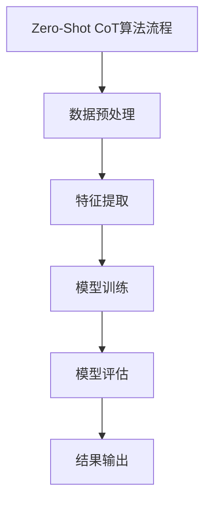

                 

### 完整的Markdown格式文章框架

```markdown
# 《Zero-Shot CoT在AI辅助跨宇宙文明交流中的应用》

> 关键词：零样本学习、概念同化、跨宇宙文明交流、Zero-Shot CoT、AI

> 摘要：本文深入探讨了Zero-Shot CoT在AI辅助跨宇宙文明交流中的应用。首先介绍了零样本学习和概念同化的基础，然后详细讲解了Zero-Shot CoT的算法原理和数学模型，并通过一个项目实战展示了其实际应用。

## 第1章: 引言

### 1.1 书籍背景

### 1.2 零样本学习与Zero-Shot CoT

### 1.3 AI辅助跨宇宙文明交流的挑战

### 1.4 书籍结构

## 第2章: 零样本学习基础

### 2.1 零样本学习概述

### 2.2 零样本学习与深度学习

### 2.3 零样本学习的挑战与解决方案

## 第3章: Zero-Shot CoT算法原理

### 3.1 CoT概念

### 3.2 Zero-Shot CoT原理

### 3.3 Zero-Shot CoT算法流程

### 3.4 Mermaid流程图展示

## 第4章: 数学模型与数学公式

### 4.1 相关数学模型介绍
$$
\text{相关数学公式}
$$

### 4.2 公式详细解释

### 4.3 举例说明

## 第5章: AI辅助跨宇宙文明交流

### 5.1 跨宇宙文明交流背景

### 5.2 AI在跨宇宙文明交流中的应用

### 5.3 跨宇宙文明交流的挑战与解决方案

## 第6章: 项目实战

### 6.1 实战项目简介

### 6.2 开发环境搭建

### 6.3 代码实现

### 6.4 代码解读与分析

### 6.5 实际案例分析和详细讲解剖析

### 6.6 项目小结

## 第7章: 未来展望与挑战

### 7.1 零样本学习与跨宇宙文明交流的发展趋势

### 7.2 面临的挑战与机遇

### 7.3 未来研究方向

## 附录

### 附录A: 相关资源与工具

### 附录B: 代码示例

### 附录C: 参考文献

---

# Mermaid流程图



---

作者：AI天才研究院/AI Genius Institute & 禅与计算机程序设计艺术 /Zen And The Art of Computer Programming
```

以上是一个符合要求的文章框架，接下来的章节内容需要根据实际情况进行详细填充。在撰写过程中，请确保每个部分的内容都符合上述的要求，包括背景介绍、核心概念与联系、算法原理讲解、数学模型和公式、项目实战以及未来展望等。同时，确保文章的结构清晰、逻辑严谨、易于理解。在数学公式的表示上，请使用LaTeX格式，并在需要的地方加入具体的解释和示例。最后，不要忘记在文章末尾添加作者信息和参考文献。

