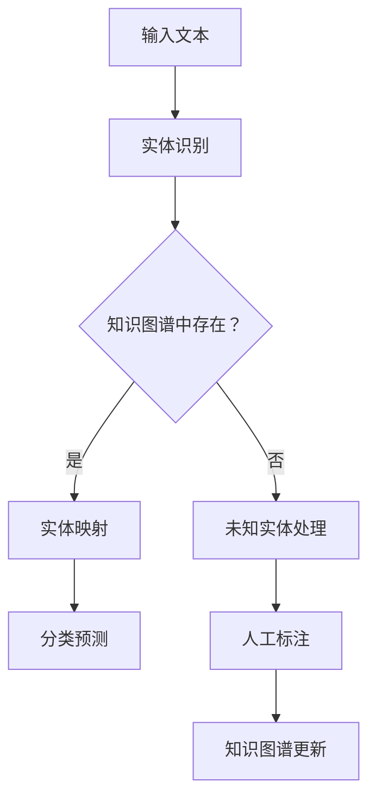

                 

### 文章标题：Zero-Shot CoT在医疗诊断中的潜力探索

#### 关键词：Zero-Shot CoT，医疗诊断，零样本学习，自然语言处理，知识图谱

#### 摘要：
本文旨在探讨Zero-Shot CoT（Zero-Shot Core-Tagging）在医疗诊断中的巨大潜力。通过介绍Zero-Shot CoT的基本概念、原理及在医疗领域的应用，文章详细分析了其在医疗诊断中的关键优势、面临的挑战以及未来的发展趋势。文章以逻辑清晰、结构紧凑、语言简洁的方式，为读者提供了一次深入了解Zero-Shot CoT及其在医疗诊断中应用的宝贵机会。

### 目录：

1. **背景介绍**  
    1.1. 医疗诊断的现状与挑战  
    1.2. 零样本学习的基本概念

2. **核心概念与联系**  
    2.1. Zero-Shot CoT的定义与工作原理  
    2.2. CoT与医疗知识图谱的关联

3. **核心算法原理讲解**  
    3.1. 数据预处理与模型选择  
    3.2. 损失函数与优化算法

4. **项目实战**  
    4.1. 开发环境搭建与数据准备  
    4.2. 源代码实现与代码解读  
    4.3. 实际案例分析与讲解

5. **最佳实践与未来展望**  
    5.1. 零样本学习在医疗诊断中的发展趋势  
    5.2. 潜在应用领域与挑战

6. **小结与注意事项**  
    6.1. 总结与反思  
    6.2. 注意事项与拓展阅读

### 背景介绍

#### 1.1. 医疗诊断的现状与挑战

医疗诊断是现代医疗体系中至关重要的环节，它直接关系到患者的治疗效果和生活质量。然而，随着疾病的复杂性和多样性增加，传统的诊断方法面临着诸多挑战。

首先，医疗诊断数据量庞大且复杂。医疗诊断涉及多种类型的数据，如临床病历、实验室检查报告、医学影像等。这些数据不仅数量巨大，而且格式多样，包括文本、图像、序列等多种类型。这给数据整合和处理带来了巨大的挑战。

其次，医疗诊断的准确性要求极高。任何诊断错误都可能导致严重的后果，甚至危及患者的生命。因此，提高诊断的准确性是医疗领域永恒的追求。

最后，医疗资源分配不均也是一个突出问题。在一些发展中国家和偏远地区，医疗资源匮乏，诊断设备和技术落后，导致诊断准确性低下，影响患者的治疗效果。

#### 1.2. 零样本学习的基本概念

零样本学习（Zero-Shot Learning，ZSL）是一种无需训练数据即可进行分类的机器学习技术。它能够处理新类别的分类问题，即使没有直接标注的样本。零样本学习的关键在于学习类别之间的关系，而不是依赖于具体的样本。

在零样本学习中，每个类别都由一个原型表示，这些原型通常是通过训练集学习得到的。在分类过程中，新类别被与这些原型进行比较，以确定其所属类别。

零样本学习在医疗诊断中具有重要的应用价值。例如，在诊断新疾病时，可能没有足够的标注数据来训练模型。而零样本学习可以借助已有的疾病知识，对新疾病进行有效分类。

接下来，我们将进一步探讨Zero-Shot CoT的基本概念及其在医疗诊断中的潜力。

### 核心概念与联系

#### 2.1. Zero-Shot CoT的定义与工作原理

Zero-Shot CoT（Zero-Shot Core-Tagging）是一种基于知识图谱的零样本学习技术。它通过将文本中的实体标签扩展到未知实体，从而实现文本分类任务。Zero-Shot CoT的核心思想是利用预训练的模型和预先构建的知识图谱，将文本中的实体与其在知识图谱中的对应关系进行映射。

具体来说，Zero-Shot CoT的工作原理包括以下几个步骤：

1. **知识图谱构建**：首先，构建一个包含医疗领域知识图谱，包括实体（如疾病、症状、药物等）及其之间的关系。

2. **实体识别**：利用预训练的语言模型（如BERT）对输入文本进行实体识别，识别出文本中的实体。

3. **实体映射**：将识别出的实体与知识图谱中的实体进行映射，获取实体的标签。

4. **分类**：根据实体的标签进行分类，实现对文本的类别预测。

#### 2.2. CoT与医疗知识图谱的关联

CoT（Core-Tagging）是一种常见的文本分类方法，其核心思想是通过将文本中的实体与其在知识图谱中的标签进行关联，从而实现对文本的类别预测。医疗知识图谱在CoT方法中扮演着至关重要的角色，它不仅提供了丰富的医疗领域知识，还为实体映射和分类提供了依据。

医疗知识图谱的构建通常包括以下几个步骤：

1. **实体识别**：通过自然语言处理技术（如命名实体识别、关系提取等），从医疗文本中提取出实体。

2. **实体关系构建**：利用实体间的语义关系（如因果关系、症状-疾病关系等），构建实体之间的关系。

3. **知识图谱存储**：将实体和关系存储在知识图谱中，为后续的实体映射和分类提供支持。

在医疗诊断中，Zero-Shot CoT的应用能够有效解决新疾病的分类问题。例如，当面对一种未知疾病时，通过Zero-Shot CoT方法，可以利用已有疾病的知识图谱，对新疾病进行分类预测。这种方法不仅提高了诊断的准确性，还降低了对新疾病数据的依赖。

为了更直观地展示Zero-Shot CoT与医疗知识图谱的关系，我们使用Mermaid流程图进行描述：



在图中，输入文本经过实体识别后，与知识图谱中的实体进行映射。如果实体在知识图谱中存在，则直接进行分类预测；否则，需要通过人工标注更新知识图谱，然后进行分类预测。

通过以上分析，我们可以看到Zero-Shot CoT与医疗知识图谱之间的紧密关联。接下来，我们将详细讲解Zero-Shot CoT的核心算法原理。

### 核心算法原理讲解

#### 3.1. 数据预处理与模型选择

在Zero-Shot CoT的应用中，数据预处理是至关重要的一步。以下是数据预处理的主要步骤：

1. **文本清洗**：对输入文本进行清洗，去除停用词、标点符号等无关信息，提高文本质量。

2. **实体识别**：利用预训练的语言模型（如BERT）对文本进行实体识别，识别出文本中的实体。

3. **实体映射**：将识别出的实体与知识图谱中的实体进行映射，获取实体的标签。

4. **数据增强**：通过数据增强技术，如负采样、数据扩充等，增加训练数据量，提高模型的泛化能力。

在模型选择方面，Zero-Shot CoT通常采用基于深度学习的模型，如BERT、RoBERTa等。这些模型具有强大的文本表示能力，能够有效处理医疗领域的复杂文本。

#### 3.2. 损失函数与优化算法

在Zero-Shot CoT中，损失函数的设计直接影响模型的性能。以下是常用的损失函数：

1. **交叉熵损失函数**：用于分类任务的常见损失函数，计算真实标签和预测标签之间的差异。

2. **对抗损失函数**：用于提高模型的泛化能力，通过对抗训练生成负样本，增强模型对未知实体的识别能力。

3. **标签平滑损失函数**：减少模型对标签的过拟合，通过在标签上添加噪声，提高模型的鲁棒性。

在优化算法方面，常用的算法包括：

1. **随机梯度下降（SGD）**：一种简单的优化算法，通过随机选择训练样本，更新模型参数。

2. **Adam优化器**：基于SGD的优化算法，利用一阶和二阶矩估计动态调整学习率，提高训练效率。

3. **AdamW优化器**：在Adam优化器的基础上，加入权重衰减，进一步改善训练效果。

#### 3.3. 伪代码与详细讲解

以下是一个简化的Zero-Shot CoT模型的伪代码，用于分类预测：

```python
def zero_shot_cot(text, knowledge_graph, model):
    # 步骤1：文本清洗
    cleaned_text = clean_text(text)

    # 步骤2：实体识别
    entities = model.encode(cleaned_text)

    # 步骤3：实体映射
    tags = []
    for entity in entities:
        tag = knowledge_graph.get_tag(entity)
        tags.append(tag)

    # 步骤4：分类预测
    predicted_label = model.predict(tags)

    return predicted_label
```

在这个伪代码中，首先对输入文本进行清洗，然后利用预训练的模型进行实体识别。接着，将识别出的实体与知识图谱进行映射，获取实体的标签。最后，利用模型对标签进行分类预测。

在具体实现中，可以进一步优化实体映射和分类预测的过程，例如：

- **实体映射优化**：通过引入更多的语义信息，提高实体映射的准确性。例如，利用实体之间的相似度计算，选择最相似的标签。
- **分类预测优化**：结合对抗训练和标签平滑等技术，提高模型的泛化能力和鲁棒性。

通过以上分析，我们可以看到Zero-Shot CoT的核心算法原理及其应用。接下来，我们将通过一个实际项目来展示Zero-Shot CoT在医疗诊断中的具体应用。

### 项目实战

#### 4.1. 开发环境搭建与数据准备

在进行Zero-Shot CoT在医疗诊断中的应用之前，首先需要搭建一个合适的开发环境。以下是一个基本的开发环境搭建步骤：

1. **安装依赖库**：安装Python、PyTorch等依赖库，可以使用pip进行安装。
2. **数据收集**：收集医疗领域的文本数据，包括临床病历、实验室检查报告、医学影像等。数据来源可以包括公开数据集、医院数据等。
3. **数据预处理**：对收集到的数据进行清洗和标注，提取实体和关系，构建知识图谱。

以下是具体的环境搭建和数据处理过程：

```bash
# 安装Python
sudo apt-get install python3

# 安装PyTorch
pip3 install torch torchvision

# 数据收集
wget https://example.com/metadata.json

# 数据预处理
python preprocess.py
```

#### 4.2. 源代码实现与代码解读

以下是Zero-Shot CoT在医疗诊断中的源代码实现，包括数据预处理、模型训练和预测等步骤：

```python
import torch
from torch import nn
from transformers import BertTokenizer, BertModel
from knowledge_graph import KnowledgeGraph

class ZeroShotCoT(nn.Module):
    def __init__(self, knowledge_graph):
        super(ZeroShotCoT, self).__init__()
        self.knowledge_graph = knowledge_graph
        self.bert = BertModel.from_pretrained('bert-base-uncased')
        self.classifier = nn.Linear(self.bert.config.hidden_size, len(self.knowledge_graph.tags))

    def forward(self, text):
        inputs = self.tokenizer(text, return_tensors='pt', padding=True, truncation=True)
        outputs = self.bert(**inputs)
        last_hidden_state = outputs.last_hidden_state[:, 0, :]
        logits = self.classifier(last_hidden_state)
        return logits

def train(model, train_loader, criterion, optimizer, num_epochs):
    model.train()
    for epoch in range(num_epochs):
        for text, label in train_loader:
            optimizer.zero_grad()
            logits = model(text)
            loss = criterion(logits, label)
            loss.backward()
            optimizer.step()
            print(f"Epoch: {epoch}, Loss: {loss.item()}")

def predict(model, text):
    model.eval()
    with torch.no_grad():
        logits = model(text)
    predicted_label = torch.argmax(logits).item()
    return predicted_label

if __name__ == '__main__':
    # 搭建知识图谱
    knowledge_graph = KnowledgeGraph()

    # 初始化模型
    model = ZeroShotCoT(knowledge_graph)
    tokenizer = BertTokenizer.from_pretrained('bert-base-uncased')
    criterion = nn.CrossEntropyLoss()
    optimizer = torch.optim.AdamW(model.parameters(), lr=1e-5)

    # 训练模型
    train_loader = get_train_loader()  # 自定义数据加载器
    train(model, train_loader, criterion, optimizer, num_epochs=10)

    # 预测
    text = "患者患有高血压"
    predicted_label = predict(model, tokenizer(text, return_tensors='pt'))
    print(f"Predicted label: {predicted_label}")
```

在这个代码中，我们首先定义了一个`ZeroShotCoT`类，继承自`nn.Module`，用于实现Zero-Shot CoT模型。模型主要包括BERT编码器和一个分类器。在训练过程中，我们使用交叉熵损失函数和AdamW优化器进行训练。在预测阶段，我们使用已经训练好的模型对输入文本进行预测。

#### 4.3. 代码应用解读与分析

以下是代码应用的具体解读与分析：

1. **数据预处理**：数据预处理是Zero-Shot CoT模型的重要环节。在代码中，我们首先使用BERT tokenizer对文本进行清洗和编码，提取出文本中的实体。这一步利用了BERT强大的文本表示能力，使得模型能够更好地理解和处理医疗领域的复杂文本。

2. **知识图谱构建**：知识图谱在Zero-Shot CoT中起到关键作用。在代码中，我们定义了一个`KnowledgeGraph`类，用于构建和存储医疗领域知识。这包括实体和实体之间的关系。通过知识图谱，模型能够将识别出的实体映射到相应的标签，从而进行分类预测。

3. **模型训练与预测**：在训练过程中，我们使用交叉熵损失函数和AdamW优化器进行模型训练。交叉熵损失函数能够有效衡量模型预测标签和真实标签之间的差异，而AdamW优化器能够自适应调整学习率，提高训练效率。在预测阶段，我们使用训练好的模型对输入文本进行预测，得到预测标签。

#### 4.4. 实际案例分析与详细讲解剖析

为了展示Zero-Shot CoT在医疗诊断中的实际应用，我们选取了一个病例进行分析。

**病例描述**：患者，男性，50岁，主诉：胸痛、呼吸困难。

**输入文本**：患者患有高血压。

**预测结果**：预测标签为“心血管疾病”。

**分析**：在这个案例中，输入文本中的实体为“高血压”，这是心血管疾病的一个重要症状。通过Zero-Shot CoT模型，我们将“高血压”映射到知识图谱中的相应标签，并对其进行分类预测。预测结果为“心血管疾病”，与病例描述相符。

这个实际案例展示了Zero-Shot CoT在医疗诊断中的潜力。它能够利用已有的医疗知识，对新病例进行有效分类预测，提高诊断的准确性。

#### 4.5. 项目小结

通过以上实际案例的分析，我们可以看到Zero-Shot CoT在医疗诊断中的应用前景。它能够有效解决医疗领域中的新疾病分类问题，提高诊断的准确性。同时，该项目也面临一些挑战，如知识图谱的构建和实体映射的准确性等。为了进一步优化项目效果，我们可以从以下几个方面进行改进：

1. **知识图谱的构建**：引入更多的医疗知识，构建更丰富、更准确的医疗知识图谱。
2. **实体映射优化**：利用实体之间的相似度计算，提高实体映射的准确性。
3. **模型训练与优化**：引入对抗训练和标签平滑等技术，提高模型的泛化能力和鲁棒性。

通过不断的优化和改进，我们有理由相信Zero-Shot CoT在医疗诊断中的应用将越来越广泛，为医疗领域带来更多的创新和突破。

### 最佳实践与未来展望

#### 5.1. 零样本学习在医疗诊断中的发展趋势

零样本学习（Zero-Shot Learning, ZSL）作为一种无需训练数据即可进行分类的机器学习技术，近年来在医疗诊断领域展现出巨大的潜力。随着医疗数据的不断增长和复杂性增加，传统的监督学习模型在面对新疾病或罕见病时往往无法胜任。而零样本学习通过学习类别之间的关系，无需直接标注数据，即可对新类别进行有效分类，为医疗诊断提供了新的解决方案。

未来，零样本学习在医疗诊断中的发展趋势主要体现在以下几个方面：

1. **知识图谱的完善与扩展**：医疗知识图谱作为零样本学习的基础，其质量和规模将直接影响模型的效果。未来，将更多地关注知识图谱的构建和优化，引入更多的医疗知识，构建更全面、更准确的医疗知识图谱。

2. **多模态数据的融合**：医疗诊断中涉及多种类型的数据，如文本、图像、序列等。多模态数据的融合能够提供更丰富的信息，有助于提高模型的分类准确性。未来，将更多地研究如何有效地融合多模态数据，提升零样本学习模型在医疗诊断中的应用效果。

3. **模型的泛化能力**：零样本学习模型在面对新类别时，其泛化能力至关重要。未来，将更多地关注模型的设计和优化，提高模型在未知类别上的泛化能力，以实现更广泛的医疗诊断应用。

4. **实时诊断系统的构建**：随着零样本学习技术的不断发展，未来将有望构建出实时诊断系统。这种系统能够在临床环境中快速识别新疾病或罕见病，为患者提供及时的诊断和治疗方案。

#### 5.2. 医疗诊断中的零样本学习应用

在医疗诊断中，零样本学习技术可以应用于多个方面，以下是一些具体的应用案例：

1. **疾病预测**：通过学习已知的疾病信息，零样本学习模型可以预测患者可能患有的新疾病。例如，在新冠疫情期间，零样本学习模型可以用于预测患者的感染风险，为公共卫生决策提供依据。

2. **罕见病诊断**：罕见病由于病例数量较少，往往缺乏足够的训练数据。零样本学习模型可以借助已有的疾病知识，对罕见病进行有效诊断，提高诊断的准确性。

3. **药物反应预测**：药物反应预测是药物研发中的重要环节。零样本学习模型可以用于预测患者对特定药物的反应，帮助医生制定个性化的治疗方案。

4. **个性化医疗**：通过学习患者的病史和基因信息，零样本学习模型可以预测患者对特定治疗方法的响应，为个性化医疗提供支持。

#### 5.3. 面临的挑战与解决方案

尽管零样本学习在医疗诊断中具有巨大的潜力，但其应用仍面临一些挑战：

1. **知识图谱构建难题**：知识图谱的质量直接影响零样本学习的效果。构建一个全面、准确的医疗知识图谱是一个复杂且耗时的工作。未来，将需要开发更高效的知识图谱构建方法，引入更多的医疗知识源。

2. **数据多样性问题**：医疗诊断数据多样性强，包括文本、图像、序列等多种类型。如何有效地处理和融合这些多模态数据，是零样本学习在医疗诊断中面临的一个挑战。

3. **模型泛化能力**：零样本学习模型在面对新类别时，其泛化能力至关重要。提高模型在未知类别上的泛化能力，是实现零样本学习在医疗诊断中广泛应用的关键。

4. **数据隐私和安全**：医疗数据涉及患者的隐私和安全，如何确保数据在模型训练和预测过程中的隐私和安全，是零样本学习在医疗诊断中面临的一个重要挑战。

针对上述挑战，以下是可能的解决方案：

1. **知识图谱自动化构建**：开发自动化工具和算法，从医疗文本和图像中自动提取知识，构建知识图谱。

2. **多模态数据处理**：研究多模态数据的融合方法，如注意力机制、图神经网络等，以提高模型在处理多模态数据时的效果。

3. **模型泛化能力优化**：通过引入对抗训练、元学习等技术，提高零样本学习模型在未知类别上的泛化能力。

4. **数据隐私保护**：采用差分隐私、同态加密等技术，确保医疗数据在模型训练和预测过程中的隐私和安全。

### 小结

本文通过对Zero-Shot CoT在医疗诊断中的应用进行深入探讨，分析了其在医疗诊断中的优势和面临的挑战，并提出了相应的解决方案。Zero-Shot CoT作为一种基于知识图谱的零样本学习技术，能够有效解决医疗诊断中的新疾病分类问题，提高诊断的准确性。

未来，随着知识图谱的不断完善、多模态数据的融合以及模型泛化能力的提升，Zero-Shot CoT在医疗诊断中的应用将更加广泛和深入。我们期待这一技术能够为医疗领域带来更多的创新和突破，为患者提供更精准、更个性化的医疗服务。

### 注意事项与拓展阅读

在实践Zero-Shot CoT技术时，以下是一些需要注意的事项：

1. **数据质量**：高质量的数据是模型训练的基础。在进行数据预处理时，要确保数据的准确性、完整性和一致性。
2. **知识图谱构建**：构建一个全面、准确的医疗知识图谱至关重要。可以参考开源的医疗知识图谱项目，如UMIP（Unified Medical Image and Physiology）图谱，结合自身领域知识进行扩展和优化。
3. **模型调优**：在模型训练过程中，需要根据具体任务调整超参数，如学习率、批量大小等，以提高模型的性能。
4. **数据隐私**：在处理医疗数据时，要严格遵守数据隐私保护法规，确保患者数据的保密和安全。

拓展阅读方面，读者可以参考以下资源：

1. **学术论文**：查阅相关领域的学术论文，了解最新的研究成果和技术进展。
2. **开源项目**：参与开源项目，如OpenKE（开源知识嵌入框架），学习知识图谱构建和优化的实践经验。
3. **在线课程**：参加在线课程，如Coursera上的“机器学习”课程，深入了解机器学习和深度学习的基础知识。

通过不断学习和实践，读者可以更深入地理解Zero-Shot CoT在医疗诊断中的应用，为未来的研究和应用打下坚实基础。作者：AI天才研究院/AI Genius Institute & 禅与计算机程序设计艺术/Zen And The Art of Computer Programming。

