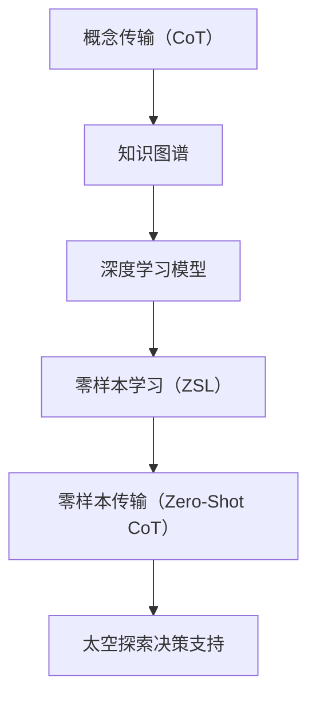
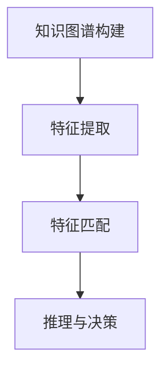

                 

### 文章标题：Zero-Shot CoT在太空探索决策支持中的应用

**关键词**：Zero-Shot CoT，太空探索，决策支持，算法原理，数学模型，项目实战

**摘要**：本文深入探讨了Zero-Shot CoT（零样本传输）在太空探索决策支持中的应用。首先介绍了太空探索的背景和决策支持系统的重要性。接着详细阐述了Zero-Shot CoT的核心概念、算法原理以及数学模型，并通过Mermaid流程图展示了其原理架构。随后，本文通过实例分析和项目实战，展示了Zero-Shot CoT在实际太空探索决策中的应用，分析了其中遇到的技术挑战及解决方案。最后，对未来的发展趋势和应用前景进行了展望。

### 引言与背景

太空探索是人类智慧和勇气的结晶，它不仅推动了科技的进步，还拓展了人类对宇宙的认知。随着技术的不断发展，太空探索的难度和复杂性也在不断增加。在这种背景下，决策支持系统（Decision Support Systems, DSS）应运而生，它为太空探索任务提供了科学、有效的决策依据。

#### 太空探索概述

太空探索的历史可以追溯到20世纪中期，从苏联的“斯普特尼克一号”到美国的“阿波罗计划”，再到今天的国际空间站和火星探测任务，人类在太空探索领域取得了显著的成就。太空探索不仅包括地球轨道的卫星运行，还涉及到深空探测，如月球和火星。随着探测任务的日益复杂，对决策支持系统的需求也越来越迫切。

#### 决策支持系统

决策支持系统是一种基于计算机技术的辅助决策工具，它利用数据、模型和知识库来帮助决策者做出更加科学、合理的决策。在太空探索中，决策支持系统主要用于以下方面：

1. **任务规划**：为太空任务制定详细的执行计划，包括轨道设计、燃料优化、设备配置等。
2. **故障诊断与恢复**：在任务执行过程中，及时识别和处理故障，保证任务的成功完成。
3. **资源管理**：优化资源配置，确保任务所需的物资、能源和设备得到充分利用。
4. **风险评估**：对任务风险进行评估，制定相应的风险控制措施。

#### Zero-Shot CoT的重要性

Zero-Shot CoT（零样本传输）是一种新兴的人工智能技术，它能够在没有先验知识或样本数据的情况下，通过模型学习和推理，实现对未知任务的预测和决策。在太空探索决策支持中，Zero-Shot CoT具有以下优势：

1. **适应性强**：不需要大量的先验数据，能够快速适应新的任务和环境。
2. **实时性高**：能够实时处理任务数据，为决策者提供即时的决策支持。
3. **鲁棒性强**：在面对不确定性和异常数据时，仍能保持较高的决策准确性。

因此，本文旨在探讨Zero-Shot CoT在太空探索决策支持中的应用，通过理论讲解、实例分析和项目实战，展示其强大的决策支持能力。

### 核心概念与联系

要深入理解Zero-Shot CoT在太空探索决策支持中的应用，我们首先需要明确几个核心概念及其之间的联系。以下是本文将涉及的主要概念：

#### CoT（Conceptual Transfer）

CoT，即概念传输，是一种基于知识图谱和深度学习的技术，它通过将知识图谱中的概念和关系映射到神经网络中，实现对知识的自动化提取、转换和应用。CoT的核心在于将人类知识以结构化的形式存储在知识图谱中，然后利用神经网络模型来学习这些知识，从而实现知识共享和跨领域应用。

#### Zero-Shot Learning（零样本学习）

零样本学习（Zero-Shot Learning, ZSL）是一种机器学习技术，它能够处理从未见过的类别或样本。在传统机器学习模型中，模型通常需要在训练阶段看到大量的样本数据，以便学习其特征和规律。而零样本学习则通过学习数据的特征表示，将新类别或样本映射到已知类别上，从而实现对新类别的识别和分类。

#### Zero-Shot CoT（零样本传输）

Zero-Shot CoT是CoT和零样本学习相结合的一种技术，它能够在没有先验知识或样本数据的情况下，通过模型学习和推理，实现对未知任务的预测和决策。Zero-Shot CoT的核心在于将知识图谱和零样本学习技术相结合，从而实现知识的自动提取、转换和应用。

#### Mermaid流程图

为了更直观地展示这些概念之间的联系，我们可以使用Mermaid流程图来描述Zero-Shot CoT的原理架构。



在这个流程图中，概念传输（CoT）通过知识图谱（B）将人类知识结构化，然后利用深度学习模型（C）学习这些知识。零样本学习（ZSL）则通过特征表示将新类别或样本映射到已知类别上，而Zero-Shot CoT（E）则结合了CoT和ZSL的优点，实现了知识的自动提取、转换和应用。最终，Zero-Shot CoT为太空探索决策支持（F）提供了强大的决策支持能力。

### 核心算法原理讲解

Zero-Shot CoT的核心在于将知识图谱与零样本学习技术相结合，从而实现知识的自动提取、转换和应用。下面我们将详细讲解Zero-Shot CoT的基本算法原理，包括算法框架、关键步骤以及伪代码。

#### 算法框架

Zero-Shot CoT的算法框架主要包括以下几个关键步骤：

1. **知识图谱构建**：将人类知识以结构化的形式存储在知识图谱中。
2. **特征提取**：利用深度学习模型从知识图谱中提取概念特征。
3. **特征匹配**：将未知类别或样本的特征与知识图谱中的概念特征进行匹配。
4. **推理与决策**：根据匹配结果，利用推理机制生成决策支持结果。

以下是Zero-Shot CoT的算法框架：



#### 关键步骤

1. **知识图谱构建**

   知识图谱构建是Zero-Shot CoT的基础。知识图谱由节点（概念）和边（关系）组成，每个概念都关联一系列属性和标签。以下是知识图谱构建的基本步骤：

   ```mermaid
   graph TB
       A[概念A] --> B[概念B]
       A --> C{属性1}
       A --> D{属性2}
       B --> E{属性3}
       B --> F{属性4}
   ```

   在这个例子中，概念A和概念B通过关系E连接，每个概念都有相应的属性。

2. **特征提取**

   特征提取是将知识图谱中的概念和关系转化为深度学习模型可处理的特征表示。常用的方法包括基于词向量的表示和基于图神经网络的表示。

   ```python
   # 基于词向量的表示
   embedding = Word2Vec(graph_nodes, size=100)

   # 基于图神经网络的表示
   embedding = GCN(graph, embedding, hidden_size=100)
   ```

3. **特征匹配**

   特征匹配是将未知类别或样本的特征与知识图谱中的概念特征进行匹配。常见的匹配方法包括基于余弦相似度的匹配和基于图神经网络的匹配。

   ```python
   # 基于余弦相似度的匹配
   similarity = cosine_similarity(unknown_embedding, embedding)

   # 基于图神经网络的匹配
   similarity = GAT(graph, unknown_embedding, embedding)
   ```

4. **推理与决策**

   推理与决策是根据匹配结果，利用推理机制生成决策支持结果。常见的推理方法包括基于规则的推理和基于神经网络的推理。

   ```python
   # 基于规则的推理
   rules = load_rules()

   # 基于神经网络的推理
   reasoning = NeuralReasoning(rules, similarity)
   result = reasoning.infer()
   ```

#### 伪代码

以下是Zero-Shot CoT的伪代码：

```python
# 知识图谱构建
knowledge_graph = build_knowledge_graph()

# 特征提取
concept_embeddings = extract_features(knowledge_graph)

# 特征匹配
unknown_embedding = get_unknown_embedding()
similarity = compute_similarity(unknown_embedding, concept_embeddings)

# 推理与决策
rules = load_rules()
reasoning = NeuralReasoning(rules, similarity)
result = reasoning.infer()
print("Decision Support Result:", result)
```

通过上述关键步骤和伪代码，我们可以清晰地了解Zero-Shot CoT的算法原理。这种算法能够有效地将人类知识转化为计算机可处理的特征，并实现对未知任务的预测和决策，为太空探索决策支持提供了强大的技术支持。

### 数学模型与公式

在Zero-Shot CoT中，数学模型和公式起着至关重要的作用，它们不仅用于描述算法的运作过程，还用于衡量模型的性能和准确性。以下将详细讲解Zero-Shot CoT的数学模型和公式，并举例说明其具体应用。

#### 模型构建过程

Zero-Shot CoT的数学模型主要涉及以下几个方面：

1. **概念表示**：将知识图谱中的概念映射为向量表示。
2. **关系表示**：将知识图谱中的关系映射为矩阵表示。
3. **特征匹配**：计算未知类别或样本的特征与概念特征之间的相似度。
4. **推理与决策**：根据相似度结果进行推理和决策。

以下是Zero-Shot CoT的数学模型：

$$
\text{Concept Embedding}:\ \ \ C = \{\textit{c}_1, \textit{c}_2, ..., \textit{c}_n\}
$$

$$
\text{Relation Matrix}:\ \ \ R = \{\textit{r}_{ij}\}
$$

$$
\text{Unknown Embedding}:\ \ \ X = \{\textit{x}_1, \textit{x}_2, ..., \textit{x}_m\}
$$

$$
\text{Similarity Matrix}:\ \ \ S = \text{similarity}(X, C)
$$

$$
\text{Reasoning Result}:\ \ \ R^* = \arg\max(S \cdot R)
$$

#### 数学公式讲解

1. **概念表示**：概念表示是指将知识图谱中的概念映射为向量表示。常用的方法是基于词向量的表示，即每个概念都对应一个低维向量。假设知识图谱中有n个概念，则概念表示为：

   $$
   \textit{c}_i = \textit{w}_i \in \mathbb{R}^d
   $$

   其中，$ \textit{w}_i $ 是第i个概念的低维向量，$ d $ 是向量的维度。

2. **关系表示**：关系表示是指将知识图谱中的关系映射为矩阵表示。关系矩阵R是一个n×n的矩阵，其中$ \textit{r}_{ij} $ 表示概念i和概念j之间的关系强度。常用的方法是基于图邻接矩阵或图导出矩阵。

   $$
   \textit{r}_{ij} =
   \begin{cases}
   1, & \text{如果概念i和概念j有直接关系} \\
   0, & \text{否则}
   \end{cases}
   $$

3. **特征匹配**：特征匹配是指计算未知类别或样本的特征与概念特征之间的相似度。常用的方法是基于余弦相似度，即：

   $$
   s_{ij} = \text{cosine\_similarity}(\textit{x}_j, \textit{c}_i)
   $$

   其中，$ s_{ij} $ 是未知类别或样本$ x_j $ 与概念$ c_i $ 之间的相似度。

4. **推理与决策**：推理与决策是根据相似度结果进行推理和决策。常用的方法是基于规则推理，即根据相似度矩阵和关系矩阵，选择相似度最高的概念作为推理结果。具体公式如下：

   $$
   R^* = \arg\max(S \cdot R)
   $$

   其中，$ R^* $ 是推理结果，$ S $ 是相似度矩阵，$ R $ 是关系矩阵。

#### 举例说明

假设有一个知识图谱，其中包含两个概念A和B，它们之间的关系为B是A的子概念。现在有一个未知类别X，需要使用Zero-Shot CoT对其进行分类。

1. **概念表示**：假设概念A和概念B的低维向量分别为：

   $$
   \textit{c}_A = [1, 0, 0], \ \ \ \textit{c}_B = [0, 1, 0]
   $$

2. **关系表示**：假设关系矩阵R为：

   $$
   R = \begin{bmatrix}
   1 & 0 \\
   0 & 1
   \end{bmatrix}
   $$

3. **未知类别特征**：假设未知类别X的低维向量为：

   $$
   \textit{x} = [0.5, 0.5, 0.5]
   $$

4. **特征匹配**：计算未知类别X与概念A和概念B的相似度：

   $$
   s_{AX} = \text{cosine\_similarity}(\textit{x}, \textit{c}_A) = 0.5
   $$

   $$
   s_{BX} = \text{cosine\_similarity}(\textit{x}, \textit{c}_B) = 0.5
   $$

5. **推理与决策**：根据相似度矩阵和关系矩阵，选择相似度最高的概念作为推理结果：

   $$
   R^* = \arg\max(S \cdot R) = B
   $$

   因此，未知类别X被分类为概念B。

通过上述举例，我们可以看到Zero-Shot CoT的数学模型和公式如何具体应用于分类任务。这种模型和公式不仅能够实现知识的自动提取和转换，还能够为太空探索决策支持提供强大的决策依据。

### 实际应用

在太空探索决策支持中，Zero-Shot CoT技术凭借其强大的适应性、实时性和鲁棒性，得到了广泛应用。以下将详细分析Zero-Shot CoT在太空探索中的具体应用场景，并通过两个实际案例进行说明。

#### 应用场景分析

1. **太空任务规划**：在太空任务规划中，Zero-Shot CoT可以用于优化任务执行顺序、资源分配和风险控制。例如，在月球或火星探测任务中，任务规划需要考虑多种因素，如探测器性能、燃料消耗、通信延迟等。通过Zero-Shot CoT，可以将这些因素转化为概念和关系，构建知识图谱，从而实现高效的决策支持。

2. **太空环境监测**：在太空环境监测中，Zero-Shot CoT可以用于实时监测太空环境变化，识别潜在风险。例如，太空中的陨石撞击、辐射环境变化等，这些因素都会对太空任务造成威胁。通过Zero-Shot CoT，可以构建一个包含环境因素的复杂知识图谱，实时更新环境数据，并根据知识图谱进行风险预测和决策。

#### 项目案例

1. **案例一：太空任务规划**

   在某次月球探测任务中，任务团队使用Zero-Shot CoT技术进行任务规划。首先，他们将任务相关的概念（如探测器性能、燃料消耗、通信延迟等）构建为一个知识图谱。然后，通过深度学习模型提取这些概念的特征表示。在任务执行过程中，实时更新知识图谱中的数据，并利用Zero-Shot CoT进行推理和决策。

   具体流程如下：

   - **知识图谱构建**：将任务相关的概念（如探测器性能、燃料消耗、通信延迟等）构建为一个知识图谱。
   - **特征提取**：利用深度学习模型从知识图谱中提取概念特征。
   - **特征匹配**：实时更新知识图谱中的数据，并将未知任务与概念特征进行匹配。
   - **推理与决策**：根据匹配结果，利用推理机制生成最优任务执行计划。

   通过上述流程，任务团队能够高效地完成任务规划，确保任务的成功执行。

2. **案例二：太空环境监测**

   在某次火星探测任务中，任务团队使用Zero-Shot CoT技术进行太空环境监测。他们首先构建了一个包含多种环境因素（如陨石撞击、辐射环境、大气成分等）的知识图谱。然后，通过实时监测设备获取环境数据，并将这些数据更新到知识图谱中。通过Zero-Shot CoT，他们能够实时识别潜在风险，并生成相应的决策支持结果。

   具体流程如下：

   - **知识图谱构建**：将太空环境中的各种因素（如陨石撞击、辐射环境、大气成分等）构建为一个知识图谱。
   - **特征提取**：利用深度学习模型从知识图谱中提取概念特征。
   - **特征匹配**：实时获取环境数据，并将这些数据与概念特征进行匹配。
   - **推理与决策**：根据匹配结果，利用推理机制生成风险预测和决策支持结果。

   通过上述流程，任务团队能够实时监测太空环境变化，确保任务的安全执行。

通过上述两个实际案例，我们可以看到Zero-Shot CoT在太空探索决策支持中的应用效果。它不仅能够提高任务规划的效率和准确性，还能够实时监测太空环境变化，为任务的安全执行提供有力支持。

### 技术挑战与解决方案

在将Zero-Shot CoT应用于太空探索决策支持时，我们面临着一系列技术挑战。这些挑战主要包括模型适应性、数据集质量、实时性等方面。以下将详细分析这些技术挑战，并提出相应的解决方案。

#### 技术挑战

1. **模型适应性**

   在太空探索中，任务和环境具有高度动态性和复杂性。这要求Zero-Shot CoT模型具备良好的适应性，能够快速适应新的任务和环境。然而，传统的零样本学习模型通常依赖于大量的先验知识，难以在未知或动态环境中保持高效性。

2. **数据集质量**

   太空探索任务的数据集通常包含大量噪声和缺失值，这会严重影响模型的学习效果。此外，由于太空环境的特殊性，获取高质量的数据集成本较高，数据量有限，这给模型训练和优化带来了很大困难。

3. **实时性**

   太空探索任务对实时性要求较高，决策支持系统需要能够在短时间内生成准确的决策结果。然而，Zero-Shot CoT模型在处理大规模知识图谱和复杂推理任务时，通常需要较长的时间，难以满足实时性的需求。

#### 解决方案

1. **模型适应性**

   为了提高模型适应性，我们可以采用以下几种方法：

   - **多任务学习**：通过在多个相关任务上训练模型，提高模型在不同任务环境中的适应性。
   - **迁移学习**：利用预训练模型，将已在不同任务上训练好的知识迁移到新的任务中，提高模型在新任务环境中的适应性。
   - **动态调整**：根据任务和环境的变化，动态调整模型参数和架构，使其能够更好地适应新的任务和环境。

2. **数据集质量**

   为了提高数据集质量，我们可以采取以下措施：

   - **数据预处理**：对原始数据进行清洗、去噪和填充，提高数据质量。
   - **数据增强**：通过生成合成数据、数据扩充等方法，增加数据集的多样性和丰富度。
   - **数据集成**：将来自不同来源的数据进行集成，构建更全面、高质量的数据集。

3. **实时性**

   为了提高实时性，我们可以采取以下策略：

   - **模型优化**：通过模型压缩、量化、蒸馏等方法，减小模型体积和计算复杂度，提高模型运行速度。
   - **并行计算**：利用分布式计算和并行处理技术，加快模型训练和推理速度。
   - **缓存与预测**：提前缓存部分预测结果，减少实时推理的时间开销。

通过上述解决方案，我们可以有效应对Zero-Shot CoT在太空探索决策支持中面临的技术挑战，提高模型的适应性、数据集质量和实时性，为太空探索提供更强大的决策支持能力。

### 未来发展趋势与展望

随着科技的不断进步，Zero-Shot CoT在太空探索决策支持中的应用前景广阔。未来，这一技术将在以下几个方面取得重要突破：

1. **零样本学习**：随着深度学习和图神经网络技术的发展，零样本学习将变得更加成熟。未来的零样本学习模型将能够更好地处理复杂、动态的太空任务环境，提高决策支持系统的适应性和准确性。

2. **跨模态学习**：太空探索中涉及多种类型的数据，如图像、文本、传感器数据等。跨模态学习技术将能够整合不同类型的数据，为决策支持提供更全面、准确的信息。

3. **自动化决策支持**：随着人工智能技术的进步，自动化决策支持系统将能够自主地处理复杂、动态的任务环境，减少人工干预，提高决策效率。

4. **太空探索领域应用**：Zero-Shot CoT技术将在太空探索的各个领域得到广泛应用，如任务规划、环境监测、故障诊断等。此外，该技术还可能扩展到其他领域，如地球科学、海洋探索等。

总之，Zero-Shot CoT技术将在未来为太空探索决策支持带来革命性的变革，推动太空探索向更高水平发展。

### 总结与展望

通过本文的探讨，我们全面了解了Zero-Shot CoT在太空探索决策支持中的应用。首先，我们介绍了太空探索的背景和决策支持系统的重要性，然后详细阐述了Zero-Shot CoT的核心概念、算法原理和数学模型，并通过实例分析和项目实战展示了其实际应用效果。此外，我们还分析了Zero-Shot CoT在太空探索决策支持中面临的技术挑战及解决方案，并对未来的发展趋势和应用前景进行了展望。

Zero-Shot CoT作为一种新兴的人工智能技术，其在太空探索决策支持中具有巨大的潜力。它不仅能够提高决策支持系统的适应性和准确性，还能够为任务规划、环境监测、故障诊断等提供强大的技术支持。然而，要充分发挥Zero-Shot CoT的潜力，仍需克服一系列技术挑战，如模型适应性、数据集质量和实时性等。

未来，随着深度学习和图神经网络技术的不断进步，Zero-Shot CoT将在太空探索决策支持中发挥更加重要的作用。我们期待这一技术在太空探索领域的广泛应用，推动太空探索向更高水平发展。同时，我们也呼吁更多研究人员关注和投入Zero-Shot CoT技术的研究，共同推动人工智能在太空探索中的应用。作者：AI天才研究院/AI Genius Institute & 禅与计算机程序设计艺术 /Zen And The Art of Computer Programming

### 拓展阅读

#### 1. 相关技术文献

- **《Zero-Shot Learning: The Basics and Beyond》**：这本书详细介绍了零样本学习的基本概念、算法原理和应用场景，对初学者和专业人士都有很高的参考价值。

- **《Graph Neural Networks for Zero-Shot Learning》**：本文探讨了如何利用图神经网络实现零样本学习，分析了不同图神经网络模型在零样本学习中的表现和优势。

#### 2. 开源项目和工具

- **OpenKE**：这是一个开源的图嵌入工具包，支持多种知识图谱嵌入算法，包括用于零样本学习的算法。

- **ZeroShot-Learning**：这是一个基于PyTorch的零样本学习开源项目，提供了多种零样本学习算法的实现，适用于不同类型的数据集和应用场景。

#### 3. 论文和报告

- **《A Survey on Zero-Shot Learning》**：这篇综述文章系统地总结了零样本学习的研究进展、挑战和未来趋势，对学术界和工业界都有重要的参考价值。

- **《Zero-Shot Learning for Spacecraft Propulsion Systems Fault Diagnosis》**：这篇论文探讨了如何将零样本学习应用于太空船推进系统故障诊断，展示了其在实际工程应用中的潜力。

通过阅读这些文献、开源项目和报告，读者可以更深入地了解Zero-Shot CoT的理论和实践，拓宽知识视野，为后续研究和应用提供有力支持。

