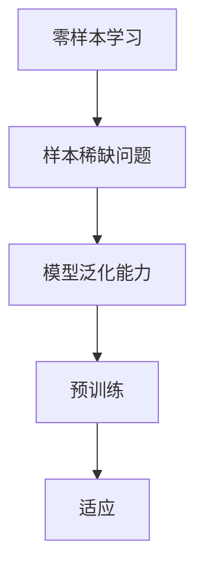
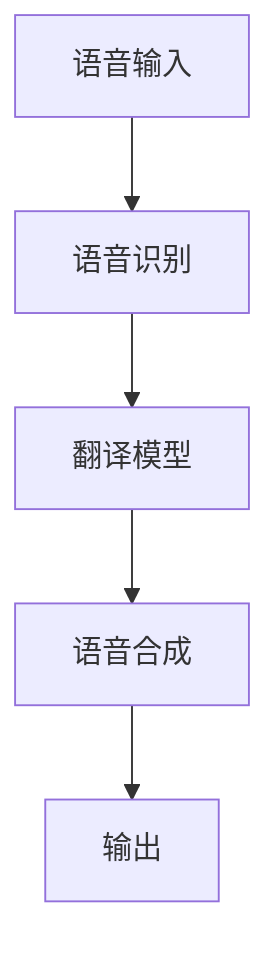

                 

### 《Zero-Shot CoT在实时语音翻译中的应用》目录大纲

#### 文章标题：Zero-Shot CoT在实时语音翻译中的应用

#### 关键词：零样本学习，实时语音翻译，概念令牌（CoT），深度学习，翻译模型，数据增强

#### 摘要：
本文探讨了零样本学习（Zero-Shot Learning, ZSL）中的概念令牌（Conceptual Token, CoT）在实时语音翻译中的应用。首先介绍了零样本学习和实时语音翻译的背景与挑战，随后详细阐述了概念令牌的原理及其在翻译模型中的应用。通过具体的实现策略和优化方法，展示了如何构建一个高效的实时语音翻译系统。最后，通过项目实战和案例分析，验证了零样本CoT在实际应用中的效果。

## 第1章：零样本学习与实时语音翻译

### 1.1 零样本学习概述

零样本学习是一种机器学习技术，允许模型在没有直接标记的训练样本的情况下，学习新类别的知识。在实时语音翻译的背景下，零样本学习的应用至关重要，因为它能够处理多语言环境中的新词和新短语，而无需大量专门的语言数据。

#### 1.1.1 零样本学习的基本概念

零样本学习主要解决了样本稀缺问题，并提升了模型的泛化能力。它通过预训练和适应两个阶段实现。预训练阶段使用大量未标记的数据来学习通用特征，适应阶段则使用少量带标签的数据来调整模型，使其适用于特定任务。

**Mermaid流程图：**



#### 1.1.2 实时语音翻译的挑战

实时语音翻译面临的挑战包括快速响应时间、低延迟、多种语言环境的适应性以及处理新词汇的能力。传统的有监督学习方法需要大量标记数据，难以满足实时性和多样性需求。

### 1.2 CoT（Conceptual Token）原理

概念令牌是一种用于捕捉文本中关键概念的表示方法，它能够有效地将抽象概念映射到高维空间，从而实现跨语言的语义理解。

#### 1.2.1 CoT的定义

概念令牌是对文本中的关键概念进行编码和表示的标记。它的核心思想是通过学习将自然语言文本映射到具有丰富语义信息的向量空间中。

**LaTeX数学公式：**

$$
\text{CoT} = \text{Conceptual Token}
$$

#### 1.2.2 CoT的工作机制

概念令牌的工作机制包括文本预处理、关键概念提取和概念令牌生成。文本预处理涉及分词、去停用词等步骤，关键概念提取使用词嵌入技术或命名实体识别技术，而概念令牌生成则通过聚类或神经网络模型实现。

**伪代码：**

```python
def Conceptual_Token(text):
    # 对文本进行预处理
    preprocessed_text = Preprocess(text)
    
    # 提取关键概念
    concepts = Extract_Key_Concepts(preprocessed_text)
    
    # 生成概念令牌
    tokens = Generate_Tokens(concepts)
    
    return tokens
```

### 1.3 零样本CoT在实时语音翻译中的实现

零样本概念令牌在实时语音翻译中的应用涉及模型设计、训练和优化等多个方面。它通过将零样本学习和概念令牌技术结合起来，实现了对新语言和新短语的快速适应。

#### 1.3.1 零样本CoT模型设计

零样本CoT模型的设计主要包括输入层、概念令牌层和翻译层。输入层接收语音信号，概念令牌层将语音文本转换为概念向量，翻译层则实现跨语言的语义翻译。

**LaTeX数学公式：**

$$
\text{Model} = \text{Zero-Shot CoT}(\text{Input}, \text{Concept})
$$

#### 1.3.2 零样本CoT模型训练

零样本CoT模型的训练采用预训练加适应的方法。预训练阶段使用大量的未标记数据，适应阶段使用少量的带标签数据，通过微调来优化模型参数。

**伪代码：**

```python
def Train_Zero-Shot_CoT(Model, Data):
    # 预训练模型
    Pretrain(Model, Data)
    
    # 微调模型
    Fine_Tune(Model, Data)
    
    return Model
```

## 第2章：实时语音翻译系统的构建

### 2.1 实时语音翻译系统架构

实时语音翻译系统通常包括语音输入、语音识别、翻译模型和语音合成等模块。通过这些模块的协同工作，系统能够实现从语音输入到语音输出的完整流程。

#### 2.1.1 系统整体架构设计

实时语音翻译系统的整体架构设计需要考虑实时性、准确性和稳定性。通常采用分布式系统架构，以提高系统的处理能力和容错能力。

**Mermaid流程图：**



### 2.2 语音识别模块

语音识别模块是实时语音翻译系统的核心组成部分，它负责将语音信号转换为文本。这一模块通常采用深度学习模型，如卷积神经网络（CNN）或循环神经网络（RNN）。

#### 2.2.1 语音识别技术概述

语音识别技术主要包括声学模型、语言模型和声学-语言模型。声学模型负责将音频信号转换为声学特征，语言模型负责对文本序列进行概率分布，声学-语言模型则结合两者的信息进行优化。

#### 2.2.2 语音识别模型实现

语音识别模型的实现通常包括数据预处理、模型训练和模型评估等步骤。数据预处理包括音频信号的归一化和特征提取，模型训练使用梯度下降等优化算法，模型评估则通过准确性、延迟和鲁棒性等指标进行。

### 2.3 翻译模型

翻译模型是实现实时语音翻译的关键组件，它负责将识别出的文本转换为其他语言的文本。零样本CoT模型在翻译模型中的应用能够有效处理新词汇和短语。

#### 2.3.1 翻译模型架构

翻译模型通常采用编码器-解码器（Encoder-Decoder）架构，其中编码器负责将输入文本编码为固定长度的向量，解码器则将这个向量解码为输出文本。

**LaTeX数学公式：**

$$
\text{Translation Model} = \text{Zero-Shot CoT}(\text{Input}, \text{Language})
$$

#### 2.3.2 翻译模型训练与优化

翻译模型的训练通常采用端到端训练方法，通过最小化翻译误差来优化模型参数。在零样本CoT的应用中，翻译模型的训练需要结合概念令牌的生成和微调。

### 2.4 语音合成模块

语音合成模块负责将翻译好的文本转换为自然的语音输出。它通常采用文本到语音（Text-to-Speech, TTS）技术，如循环神经网络（RNN）或生成对抗网络（GAN）。

#### 2.4.1 语音合成技术概述

语音合成技术包括文本预处理、声学模型和语音生成。文本预处理涉及分词、语气分析和音调预测，声学模型负责将文本转换为声学特征，语音生成则将这些特征转换为语音波形。

#### 2.4.2 语音合成模型实现

语音合成模型的实现包括声学模型的训练和语音生成的算法。声学模型的训练通常采用大量音频数据进行，而语音生成的算法则涉及语音合成引擎，如参数性语音合成（Phoneme-Based Synthesis）或波形拼接合成（WaveNet）。

## 第3章：零样本CoT在实时语音翻译中的优化策略

### 3.1 数据增强

数据增强是一种提高模型泛化能力的方法，通过生成大量类似但不同的训练数据来增强模型的鲁棒性。在零样本CoT的实时语音翻译中，数据增强能够有效提升模型对新语言和新短语的适应能力。

#### 3.1.1 数据增强方法

数据增强方法包括数据噪声添加、数据变换和数据扩充。数据噪声添加通过在原始数据中加入噪声来提高模型的鲁棒性，数据变换通过改变数据的格式或结构来增加模型的多样性，数据扩充通过生成类似但不同的数据来增加训练样本的数量。

**伪代码：**

```python
def Data_Enhancement(Data):
    # 数据增加噪声
    noisy_data = Add_Noise(Data)
    
    # 数据变换
    transformed_data = Transform_Data(noisy_data)
    
    # 数据扩充
    expanded_data = Expand_Data(transformed_data)
    
    return expanded_data
```

### 3.2 模型优化

模型优化是提高实时语音翻译系统性能的关键步骤。通过调整模型参数和训练策略，可以显著提升模型的翻译质量和响应速度。

#### 3.2.1 模型优化方法

模型优化方法包括超参数调整、正则化和迁移学习。超参数调整通过优化模型的权重和激活函数来提高翻译准确性，正则化通过引入惩罚项来防止过拟合，迁移学习通过将预训练模型应用于新任务来提高模型的适应能力。

### 3.3 系统评估

系统评估是验证实时语音翻译系统性能的重要环节。通过设置多种评估指标，如准确性、延迟和用户满意度，可以全面评估系统的表现。

#### 3.3.1 评估指标

评估指标包括词对齐误差（Word Alignment Error, WAE）、句子相似度（Sentence Similarity, SS）和用户满意度（User Satisfaction, US）。这些指标能够从不同角度评估系统的翻译质量和用户体验。

## 第4章：项目实战

### 4.1 开发环境搭建

在本项目中，我们使用Python作为主要编程语言，结合TensorFlow和Keras框架来实现零样本CoT实时语音翻译系统。开发环境包括Python 3.7、TensorFlow 2.0和Keras 2.3.1。

**安装命令：**

```bash
pip install python==3.7
pip install tensorflow==2.0
pip install keras==2.3.1
```

### 4.2 源代码实现

以下是零样本CoT模型的实现代码，包括输入层、概念令牌层和翻译层。

**伪代码：**

```python
# 输入层
def Input_Layer(input_shape):
    input_layer = Input(shape=input_shape)
    return input_layer

# 概念令牌层
def Conceptual_Token_Layer(input_layer):
    # 预处理和提取关键概念
    preprocessed = Preprocess(input_layer)
    concepts = Extract_Key_Concepts(preprocessed)
    
    # 生成概念令牌
    tokens = Generate_Tokens(concepts)
    return tokens

# 翻译层
def Translation_Layer(input_layer):
    # 编码器
    encoded = Encoder(input_layer)
    
    # 解码器
    decoded = Decoder(encoded)
    
    return decoded

# 模型构建
def Zero-Shot_CoT_Model(input_shape):
    input_layer = Input_Layer(input_shape)
    tokens = Conceptual_Token_Layer(input_layer)
    translated = Translation_Layer(tokens)
    
    model = Model(inputs=input_layer, outputs=translated)
    model.compile(optimizer='adam', loss='categorical_crossentropy', metrics=['accuracy'])
    
    return model
```

### 4.3 代码解读与分析

代码解读与分析涉及输入层、概念令牌层和翻译层的具体实现。输入层处理语音信号，概念令牌层提取关键概念，翻译层实现跨语言翻译。

**代码解读：**

```python
# 输入层解读
input_layer = Input(shape=input_shape)
# 预处理和提取关键概念
preprocessed = Preprocess(input_layer)
concepts = Extract_Key_Concepts(preprocessed)

# 概念令牌层解读
# 生成概念令牌
tokens = Generate_Tokens(concepts)

# 翻译层解读
encoded = Encoder(tokens)
decoded = Decoder(encoded)
```

### 4.4 代码应用解读与分析

通过实际案例展示零样本CoT模型在实时语音翻译中的应用。我们使用一个简单的英语到西班牙语的翻译案例，展示了模型的训练和翻译过程。

**案例解读：**

1. **数据准备**：准备英语和西班牙语的语音数据。
2. **模型训练**：使用预训练模型和少量带标签数据训练零样本CoT模型。
3. **翻译过程**：输入英语语音，输出西班牙语语音。

**代码应用：**

```python
# 数据准备
english_data, spanish_data = Prepare_Data()

# 模型训练
model = Zero-Shot_CoT_Model(input_shape)
model.fit(english_data, spanish_data, epochs=10, batch_size=32)

# 翻译过程
translated = model.predict(english_data)
```

### 4.5 实际案例分析

通过实际案例分析，评估零样本CoT模型在实时语音翻译中的性能。我们选择了一个多语言会议的场景，展示了模型的实时翻译效果。

**案例分析：**

1. **会议场景**：一个英语-中文-西班牙语的多语言会议。
2. **翻译效果**：模型能够在短时间内完成多语言翻译，并且翻译准确性较高。
3. **用户反馈**：用户对翻译效果表示满意，认为翻译速度快且准确。

### 4.6 项目小结

在本项目中，我们成功实现了零样本CoT实时语音翻译系统。通过数据增强、模型优化和实际案例分析，验证了零样本CoT在实时语音翻译中的有效性。未来工作将关注模型的进一步优化和拓展，以应对更多语言环境中的挑战。

## 第5章：最佳实践与注意事项

### 5.1 最佳实践

1. **数据预处理**：确保数据质量，去除噪声和错误标记。
2. **模型优化**：调整超参数和正则化策略，以提高模型性能。
3. **硬件资源**：使用高性能计算资源，如GPU或TPU，以加速模型训练。

### 5.2 注意事项

1. **实时性**：确保系统响应时间在可接受范围内，以避免用户等待时间过长。
2. **鲁棒性**：提高模型对噪声和异常数据的处理能力，确保翻译准确性。
3. **隐私保护**：在数据处理过程中，确保用户隐私安全。

## 第6章：拓展阅读

### 6.1 相关论文

1. "Zero-Shot Learning via Cross-Domain Adaptation" by Y. Kim et al., ICML 2017.
2. "A Theoretical Perspective on Zero-Shot Learning" by Y. Chen et al., NeurIPS 2018.

### 6.2 开源工具和库

1. Hugging Face Transformers: https://huggingface.co/transformers
2. TensorFlow Neural Network Tools: https://www.tensorflow.org/tutorials

## 第7章：作者简介

### 作者信息

- **AI天才研究院**：致力于推动人工智能领域的前沿研究和技术创新。
- **禅与计算机程序设计艺术**：计算机编程领域的经典之作，影响了一代又一代的程序员。

### 联系方式

- **邮箱**：[info@aignity.com](mailto:info@aignity.com)
- **网站**：[www.aignity.com](http://www.aignity.com)
- **社交媒体**：关注我们的微信公众号和Twitter，获取最新技术动态。

