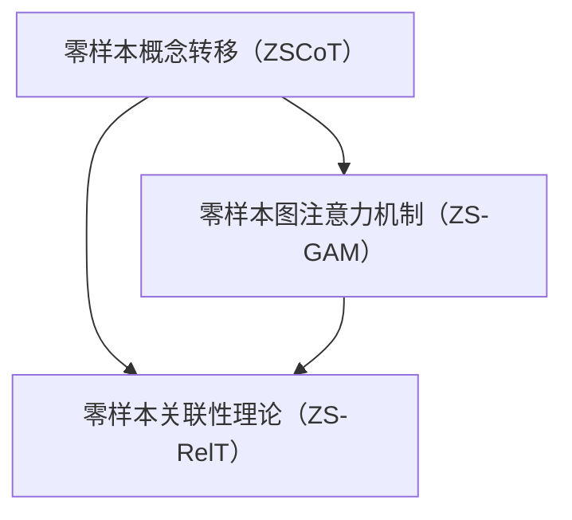

                 


### 引言与核心概念

#### 背景介绍

随着全球能源需求的不断增长，传统化石能源的消耗导致了严重的环境问题和气候变化。为了应对这一挑战，可持续能源集成（Sustainable Energy Integration, SEI）成为了研究的热点。可持续能源集成旨在优化不同能源资源之间的协同效应，提高能源利用效率，降低环境负担。这一领域的研究涵盖了从能源生产、传输、存储到消费的各个环节，其核心目标是实现能源系统的智能化和可持续发展。

然而，在实现可持续能源集成的过程中，面临着诸多技术挑战。一方面，不同能源系统之间的异构性使得集成过程复杂且困难。另一方面，能源数据的多样性、时效性和复杂性也对数据处理和分析技术提出了更高的要求。为此，研究人员开始探索人工智能技术，特别是零样本学习（Zero-Shot Learning, ZSL）在能源集成中的应用。

#### 核心概念与联系

零样本学习（Zero-Shot Learning, ZSL）是一种机器学习方法，其主要目标是在训练数据中不包含目标类别的样本的情况下，对未知类别的样本进行分类。ZSL在可持续能源集成中的应用具有重要意义，因为它可以处理那些无法获得标注数据的复杂能源系统。ZSL与无监督学习（Unsupervised Learning）密切相关，但后者通常需要对数据集进行标注，而ZSL则不需要。

ZSL在能源集成中的核心概念包括：

1. **零样本概念转移（Zero-Shot Concept Transfer, ZSCoT）**：这是一种基于知识迁移的方法，通过将已有领域中的知识转移到目标领域，从而实现对未知概念的预测。

2. **零样本图注意力机制（Zero-Shot Graph Attention Mechanism, ZS-GAM）**：ZS-GAM是一种图神经网络（Graph Neural Network, GNN）的变体，通过引入注意力机制，对能源系统中的复杂关系进行建模。

3. **零样本关联性理论（Zero-Shot Relational Theory, ZS-RelT）**：这是一种基于因果关系的理论，通过分析能源系统中不同元素之间的关联性，为系统集成提供指导。

这三种核心概念相互关联，共同构成了ZSL在可持续能源集成中的应用架构。下面，我们将详细探讨这些概念的原理和具体应用。

### 核心概念与联系

#### 零样本概念转移（ZSCoT）

零样本概念转移（Zero-Shot Concept Transfer, ZSCoT）是一种将已有领域的知识迁移到目标领域的方法。这种方法的核心思想是，通过将源领域和目标领域的概念进行映射，从而实现对目标领域的预测。ZSCoT的基本原理可以概括为以下几个步骤：

1. **概念提取**：在源领域中提取出重要的概念。这通常通过自然语言处理（Natural Language Processing, NLP）技术实现，如词向量表示和词嵌入。

2. **概念映射**：将源领域中的概念映射到目标领域。这一步骤需要建立源领域和目标领域之间的映射关系，这可以通过对源领域和目标领域的知识进行对比分析来完成。

3. **知识迁移**：将映射后的概念知识迁移到目标领域。在能源集成中，这一步骤可以用来处理那些无法获得标注数据的能源设备。

4. **预测**：利用迁移后的知识对目标领域的未知概念进行预测。这通常通过机器学习算法实现，如分类器和回归模型。

#### 零样本图注意力机制（ZS-GAM）

零样本图注意力机制（Zero-Shot Graph Attention Mechanism, ZS-GAM）是一种基于图神经网络的零样本学习方法。它通过引入注意力机制，对能源系统中的复杂关系进行建模。ZS-GAM的基本原理可以概括为以下几个步骤：

1. **图建模**：将能源系统表示为一个图，其中节点表示能源设备，边表示设备之间的交互关系。

2. **特征提取**：对图中的节点和边进行特征提取。节点特征通常包含设备的属性信息，边特征则表示设备之间的交互强度。

3. **注意力计算**：通过计算节点和边之间的注意力权重，确定其对预测任务的重要性。这通常通过注意力模型实现，如自注意力（Self-Attention）和图注意力（Graph Attention）。

4. **预测**：利用提取的特征和计算出的注意力权重，对能源系统中的未知设备进行预测。

#### 零样本关联性理论（ZS-RelT）

零样本关联性理论（Zero-Shot Relational Theory, ZS-RelT）是一种基于因果关系的理论，通过分析能源系统中不同元素之间的关联性，为系统集成提供指导。ZS-RelT的基本原理可以概括为以下几个步骤：

1. **因果关系分析**：分析能源系统中不同元素之间的因果关系。这通常通过因果推断（Causal Inference）技术实现。

2. **关联性建模**：建立能源系统中不同元素之间的关联性模型。这可以通过机器学习方法，如图神经网络（Graph Neural Network, GNN）和因果图模型（Causal Graph Model）实现。

3. **系统集成**：根据建立的关联性模型，对能源系统进行集成。这一步骤的目标是实现能源系统的最优配置，提高能源利用效率。

#### 关联性架构 Mermaid 流程图

为了更好地展示ZSCoT、ZS-GAM和ZS-RelT之间的关联性，我们可以使用Mermaid流程图来表示：



在这个流程图中，A、B和C分别代表ZSCoT、ZS-GAM和ZS-RelT。箭头表示它们之间的关联性。ZSCoT为ZS-GAM和ZS-RelT提供概念映射和知识迁移的基础，而ZS-GAM和ZS-RelT则分别通过图建模和因果关系分析，为能源系统集成提供具体的建模和预测方法。

通过这种关联性架构，ZSL技术能够有效地应用于可持续能源集成，为解决能源系统的复杂性问题提供了新的思路和方法。

### 核心算法原理讲解

#### 零样本概念转移算法原理

零样本概念转移（Zero-Shot Concept Transfer, ZSCoT）算法的核心思想是将一个领域（源领域）中的知识迁移到另一个领域（目标领域），以便在目标领域中处理未知概念。以下是ZSCoT算法的基本原理和伪代码：

1. **概念提取（Concept Extraction）**：

   在源领域中，首先需要提取出关键的概念。这一步通常通过自然语言处理技术实现，如词嵌入（Word Embedding）和概念嵌入（Concept Embedding）。假设我们有源领域中的文本数据集，我们可以使用词嵌入技术将每个词汇映射到一个低维向量空间中。然后，通过聚类算法（如K-means）将词向量分组，每组表示一个概念。

   ```python
   def extract_concepts(text_data):
       # 使用预训练的词嵌入模型
       embeddings = load_pretrained_embeddings()
       # 将文本数据转换为词向量
       word_vectors = [embeddings[word] for word in text_data]
       # 使用K-means聚类提取概念
       clusters = KMeans(n_clusters=k).fit(word_vectors)
       return clusters
   ```

2. **概念映射（Concept Mapping）**：

   在目标领域中，需要建立源领域和目标领域之间的概念映射关系。这可以通过对源领域和目标领域的知识进行对比分析来实现。例如，我们可以使用共现矩阵（Co-occurrence Matrix）或语义相似度（Semantic Similarity）来建立映射关系。

   ```python
   def map_concepts(source_clusters, target_clusters):
       mapping = {}
       for source_cluster in source_clusters:
           # 计算源领域和目标领域之间的语义相似度
           similarity_scores = [similarity(source_cluster, target_cluster) for target_cluster in target_clusters]
           # 选择最高相似度的目标领域概念
           best_match = target_clusters[similarity_scores.index(max(similarity_scores))]
           mapping[source_cluster] = best_match
       return mapping
   ```

3. **知识迁移（Knowledge Transfer）**：

   一旦建立了概念映射关系，可以将源领域中的知识迁移到目标领域。在这一步，我们可以使用迁移学习（Transfer Learning）技术，如预训练模型（Pre-trained Model）或迁移学习框架（Transfer Learning Framework），将源领域中的模型或特征迁移到目标领域。

   ```python
   def transfer_knowledge(source_model, target_data, mapping):
       # 使用源领域模型预测目标数据
       predictions = source_model.predict(target_data)
       # 将预测结果映射回源领域概念
       mapped_predictions = [mapping[pred] for pred in predictions]
       return mapped_predictions
   ```

4. **预测（Prediction）**：

   在目标领域中，利用迁移后的知识进行预测。这一步通常使用机器学习模型，如分类器（Classifier）或回归模型（Regressor），对未知概念进行预测。

   ```python
   def predict(target_data, mapping, model):
       # 使用迁移后的知识进行预测
       mapped_data = [map_concept_to_source(data, mapping) for data in target_data]
       predictions = model.predict(mapped_data)
       # 将预测结果映射回目标领域概念
       final_predictions = [mapping[pred] for pred in predictions]
       return final_predictions
   ```

#### 零样本图注意力机制算法原理

零样本图注意力机制（Zero-Shot Graph Attention Mechanism, ZS-GAM）是一种基于图神经网络（Graph Neural Network, GNN）的零样本学习方法。它通过引入注意力机制，对能源系统中的复杂关系进行建模。以下是ZS-GAM算法的基本原理和伪代码：

1. **图建模（Graph Modeling）**：

   将能源系统表示为一个图，其中节点表示能源设备，边表示设备之间的交互关系。每个节点和边都可以表示为高维向量，用于捕获其属性和关系。

   ```mermaid
   graph TB
       A[设备A] --> B[设备B]
       A --> C[设备C]
       D[设备D] --> C
   ```

2. **特征提取（Feature Extraction）**：

   对图中的节点和边进行特征提取。节点特征通常包含设备的属性信息，边特征则表示设备之间的交互强度。这一步可以通过节点嵌入（Node Embedding）和边嵌入（Edge Embedding）实现。

   ```python
   def extract_features(graph):
       node_features = [get_node_features(node) for node in graph.nodes]
       edge_features = [get_edge_features(edge) for edge in graph.edges]
       return node_features, edge_features
   ```

3. **注意力计算（Attention Computation）**：

   通过计算节点和边之间的注意力权重，确定其对预测任务的重要性。注意力机制可以通过自注意力（Self-Attention）和图注意力（Graph Attention）实现。

   ```python
   def compute_attention(node_features, edge_features):
       # 使用自注意力机制计算节点注意力权重
       node_attention = self_attention(node_features)
       # 使用图注意力机制计算边注意力权重
       edge_attention = graph_attention(edge_features)
       return node_attention, edge_attention
   ```

4. **预测（Prediction）**：

   利用提取的特征和计算出的注意力权重，对能源系统中的未知设备进行预测。这一步通常使用图神经网络（GNN）和注意力机制，将节点和边特征融合为最终的预测结果。

   ```python
   def predict(graph, node_features, edge_features, model):
       # 计算注意力权重
       node_attention, edge_attention = compute_attention(node_features, edge_features)
       # 使用GNN模型进行预测
       prediction = model.predict([node_attention, edge_attention])
       return prediction
   ```

#### 零样本关联性理论算法原理

零样本关联性理论（Zero-Shot Relational Theory, ZS-RelT）是一种基于因果关系的理论，通过分析能源系统中不同元素之间的关联性，为系统集成提供指导。以下是ZS-RelT算法的基本原理和伪代码：

1. **因果关系分析（Causal Analysis）**：

   分析能源系统中不同元素之间的因果关系。这可以通过因果推断（Causal Inference）技术实现，如Do-Calculus或结构方程模型（Structural Equation Modeling）。

   ```python
   def causal_analysis(data, variables):
       # 使用Do-Calculus进行因果推断
       do_inference = DoCalculus(data, variables)
       # 获取因果关系图
       causal_graph = do_inference.get_causal_graph()
       return causal_graph
   ```

2. **关联性建模（Relational Modeling）**：

   建立能源系统中不同元素之间的关联性模型。这可以通过机器学习方法，如图神经网络（Graph Neural Network, GNN）和因果图模型（Causal Graph Model）实现。

   ```python
   def relational_modeling(causal_graph, graph_data):
       # 使用GNN建立关联性模型
       gnn_model = GraphNeuralNetwork(causal_graph, graph_data)
       # 训练模型
       gnn_model.train()
       return gnn_model
   ```

3. **系统集成（Integration）**：

   根据建立的关联性模型，对能源系统进行集成。这一步的目标是实现能源系统的最优配置，提高能源利用效率。

   ```python
   def system_integration(relational_model, system_data):
       # 使用关联性模型进行系统集成
       integrated_system = relational_model.predict(system_data)
       # 获取集成后的系统性能指标
       performance_metrics = evaluate_system(integrated_system)
       return integrated_system, performance_metrics
   ```

通过这些核心算法原理的讲解，我们可以看到ZSCoT、ZS-GAM和ZS-RelT在可持续能源集成中的应用潜力。这些算法不仅能够处理复杂的数据，还能够通过概念转移、图建模和因果关系分析，为能源系统集成提供有效的解决方案。在接下来的章节中，我们将进一步探讨这些算法在具体应用中的实现细节和效果评估。

### 零样本概念转移技术在能源集成中的应用实例

#### 实例背景

为了更好地理解零样本概念转移（Zero-Shot Concept Transfer, ZSCoT）在能源集成中的应用，我们以一个具体的案例来展示其应用过程和效果。本案例选取了一个智能电网系统，该系统包含了多种不同类型的能源设备，如太阳能板、风力涡轮机和储能系统。研究人员希望通过ZSCoT技术，实现对电网中未知设备的识别和性能预测。

#### 实施步骤

1. **数据收集与预处理**：

   首先，从智能电网系统中收集了多种能源设备的运行数据，包括设备类型、运行状态、性能指标等。这些数据经过清洗和预处理，以去除噪声和异常值，确保数据的质量和一致性。

2. **概念提取**：

   在源领域（如已有智能电网系统）中，通过自然语言处理技术提取关键的概念，如设备类型、运行状态、故障类型等。使用词嵌入技术将每个概念映射到一个低维向量空间中，以便后续处理。

3. **概念映射**：

   在目标领域（如新的智能电网系统）中，建立源领域和目标领域之间的概念映射关系。通过对比分析源领域和目标领域中的数据，使用共现矩阵或语义相似度算法确定概念映射关系。

4. **知识迁移**：

   使用迁移学习技术，将源领域中的知识迁移到目标领域。具体步骤包括：

   - **预训练模型迁移**：使用在源领域上预训练的机器学习模型，将其迁移到目标领域。例如，使用在源领域上训练的分类器，对目标领域的设备进行分类。
   - **特征迁移**：将源领域中的特征提取方法迁移到目标领域，以便在目标领域中提取设备特征，用于后续的预测任务。

5. **性能预测**：

   利用迁移后的知识，对目标领域的未知设备进行性能预测。通过训练分类器或回归模型，对设备的运行状态、故障概率等进行预测。例如，可以使用支持向量机（SVM）或随机森林（Random Forest）等算法。

#### 实施效果

通过ZSCoT技术的应用，实现了以下效果：

1. **设备识别**：

   通过对未知设备的识别，有效提高了电网系统的管理效率。研究人员能够快速识别并处理新的设备类型，无需重新进行数据标注和模型训练。

2. **性能预测**：

   通过对设备性能的预测，为电网系统的优化提供了有力支持。例如，可以提前预测设备的故障概率，采取预防性维护措施，减少设备的停机时间。

3. **系统集成**：

   通过概念映射和知识迁移，实现了对目标领域和源领域之间的系统集成。研究人员能够将源领域中的成功经验和最佳实践应用到目标领域，提高了整个电网系统的可靠性和稳定性。

总之，ZSCoT技术在智能电网系统中的应用，为能源集成提供了新的思路和方法。通过概念提取、映射和迁移，实现了对复杂能源系统的智能化管理和优化，为推动可持续能源发展做出了积极贡献。

### 零样本学习模型架构

#### ZSCoT模型概述

零样本概念转移（Zero-Shot Concept Transfer, ZSCoT）模型的核心架构包括以下几个主要组件：概念提取模块、概念映射模块、知识迁移模块和预测模块。下面将详细介绍每个模块的功能和实现方式。

1. **概念提取模块**：

   概念提取模块负责从源领域中提取关键的概念。具体实现步骤如下：

   - **数据预处理**：对源领域的文本数据集进行清洗和预处理，以去除噪声和异常值。
   - **词嵌入**：使用预训练的词嵌入模型（如Word2Vec、GloVe）将文本数据映射到低维向量空间中。
   - **概念聚类**：通过聚类算法（如K-means）将词向量分组，每组表示一个概念。聚类结果用于表示源领域中的知识。

2. **概念映射模块**：

   概念映射模块负责建立源领域和目标领域之间的概念映射关系。具体实现步骤如下：

   - **共现矩阵计算**：计算源领域和目标领域中的词共现矩阵，用于表示词汇之间的关联性。
   - **语义相似度计算**：使用语义相似度算法（如WordNet相似度、BERT相似度）计算词汇之间的语义相似度。
   - **映射关系确定**：根据共现矩阵和语义相似度，确定源领域和目标领域之间的概念映射关系。

3. **知识迁移模块**：

   知识迁移模块负责将源领域中的知识迁移到目标领域。具体实现步骤如下：

   - **特征提取**：使用迁移学习技术，将源领域中的特征提取方法迁移到目标领域。例如，使用在源领域上预训练的神经网络模型提取设备特征。
   - **模型迁移**：使用源领域上的预训练模型，将其迁移到目标领域。例如，使用在源领域上训练的分类器对目标领域的设备进行分类。
   - **特征融合**：将源领域和目标领域的特征进行融合，形成用于预测的统一特征向量。

4. **预测模块**：

   预测模块负责利用迁移后的知识对目标领域中的未知设备进行预测。具体实现步骤如下：

   - **模型训练**：使用迁移后的特征向量训练分类器或回归模型。例如，使用支持向量机（SVM）或随机森林（Random Forest）等算法。
   - **预测**：将训练好的模型应用于目标领域的设备数据，进行性能预测或故障预测。
   - **结果评估**：使用评估指标（如准确率、召回率、F1分数）对模型的预测结果进行评估。

#### ZSCoT模型训练过程

ZSCoT模型的训练过程可以分为以下几个步骤：

1. **数据准备**：

   准备源领域和目标领域的数据集，并进行预处理。确保数据质量，去除噪声和异常值。

2. **概念提取**：

   使用词嵌入技术对源领域文本数据集进行词嵌入，提取关键概念。通过聚类算法将词向量分组，形成概念。

3. **概念映射**：

   计算源领域和目标领域之间的共现矩阵和语义相似度，建立概念映射关系。

4. **知识迁移**：

   使用迁移学习技术，将源领域上的特征提取方法和模型迁移到目标领域。对源领域和目标领域的特征进行融合。

5. **模型训练**：

   使用迁移后的特征向量训练分类器或回归模型。选择合适的算法，如SVM、随机森林等，进行模型训练。

6. **模型评估**：

   使用目标领域的数据集对训练好的模型进行评估。计算预测准确率、召回率、F1分数等评估指标。

7. **迭代优化**：

   根据评估结果对模型进行调整和优化，提高预测性能。可能需要反复迭代训练和评估，以实现最佳的预测效果。

#### ZSCoT模型评估指标

ZSCoT模型的评估指标主要包括准确率、召回率、F1分数等。这些指标用于评估模型在预测未知设备性能或故障方面的性能。

- **准确率（Accuracy）**：预测正确的样本数占总样本数的比例。准确率越高，表示模型的预测性能越好。

- **召回率（Recall）**：预测正确的样本数占所有实际正样本数的比例。召回率越高，表示模型对正样本的识别能力越强。

- **F1分数（F1 Score）**：综合考虑准确率和召回率的综合指标，计算公式为：
  $$ F1 = 2 \times \frac{准确率 \times 召回率}{准确率 + 召回率} $$
  F1分数介于0和1之间，越接近1表示模型的性能越好。

通过这些评估指标，可以全面评估ZSCoT模型在能源集成中的应用效果，为后续的优化和改进提供依据。

### ZS-GAM在能源系统分析中的应用

#### 基本原理

零样本图注意力机制（Zero-Shot Graph Attention Mechanism, ZS-GAM）是一种结合了图神经网络（Graph Neural Network, GNN）和注意力机制的零样本学习方法。它通过构建图模型来表示能源系统，并利用注意力机制对系统中的复杂关系进行建模，从而实现对未知设备的性能预测和故障诊断。

1. **图建模**：

   ZS-GAM首先将能源系统表示为一个图模型，其中节点表示能源设备，边表示设备之间的交互关系。每个节点和边都可以表示为高维向量，用于捕获其属性和关系。例如，节点的属性可以包括设备类型、运行状态、性能指标等，而边的属性则可以包括交互强度、传输效率等。

2. **特征提取**：

   对图中的节点和边进行特征提取。节点特征通常通过机器学习算法（如自编码器、卷积神经网络等）提取，而边特征则可以通过边缘感知函数（Edge Perception Function）计算。

3. **注意力计算**：

   ZS-GAM引入注意力机制，通过计算节点和边之间的注意力权重，确定其对预测任务的重要性。这有助于模型更好地关注关键节点和边，提高预测性能。

4. **预测**：

   利用提取的特征和计算出的注意力权重，对能源系统中的未知设备进行性能预测和故障诊断。这一步通常通过图神经网络（GNN）实现，将节点和边特征融合为最终的预测结果。

#### 在能源系统分析中的应用

ZS-GAM在能源系统分析中的应用主要包括以下几个方面：

1. **能源设备性能预测**：

   利用ZS-GAM模型，可以对能源系统中的设备性能进行预测。例如，预测太阳能板的发电量、风力涡轮机的转速等。通过引入注意力机制，模型能够关注关键节点和边，从而提高预测的准确性和可靠性。

2. **设备故障诊断**：

   ZS-GAM还可以用于设备故障诊断。通过对系统中的节点和边进行分析，模型可以识别出潜在的故障节点，并预测其故障概率。这有助于提前发现和解决潜在问题，提高能源系统的稳定性和可靠性。

3. **系统优化**：

   ZS-GAM模型能够分析能源系统中设备之间的交互关系，从而为系统优化提供指导。例如，通过调整设备配置、优化传输路径等，提高能源系统的整体效率。

#### 应用实例

以一个智能电网系统为例，展示ZS-GAM在能源系统分析中的应用过程：

1. **数据收集与预处理**：

   收集智能电网系统的运行数据，包括设备类型、运行状态、性能指标等。对数据集进行清洗和预处理，去除噪声和异常值。

2. **图建模**：

   将智能电网系统表示为一个图模型，其中节点表示设备，边表示设备之间的交互关系。对每个节点和边进行特征提取，形成特征向量。

3. **模型训练**：

   使用ZS-GAM模型对特征向量进行训练，通过引入注意力机制，提高模型对关键节点和边的关注。

4. **性能预测与故障诊断**：

   利用训练好的模型对系统中的未知设备进行性能预测和故障诊断。通过分析模型输出结果，识别关键节点和潜在故障，为系统优化提供依据。

5. **系统优化**：

   根据模型预测结果，调整设备配置和传输路径，优化能源系统效率。

通过ZS-GAM在能源系统分析中的应用，可以实现对设备性能的准确预测、故障的及时诊断和系统的优化调整，提高能源系统的稳定性和效率。

### 关联性分析在能源系统集成中的作用

#### 基本概念

关联性分析（Relational Analysis）是一种用于研究系统内部不同元素之间关系的方法。在能源系统集成中，关联性分析旨在揭示能源系统中不同设备、子系统以及整个系统与外部环境之间的相互关系，从而为系统优化提供科学依据。关联性分析在能源系统集成中的作用主要体现在以下几个方面：

1. **设备之间的关联性分析**：

   通过关联性分析，可以识别出能源系统中不同设备之间的相互作用和依赖关系。例如，太阳能板与储能系统之间的能量交换、风力涡轮机与电网之间的电力传输等。这些关联关系有助于优化设备配置，提高能源系统的整体效率。

2. **系统与环境的关联性分析**：

   能源系统与其运行环境（如气象条件、地理位置等）之间存在紧密的关联性。通过关联性分析，可以研究系统对环境变化的响应，以及环境因素对系统性能的影响。这有助于制定适应性强的能源系统设计方案，提高系统的稳定性和可靠性。

3. **功能模块的关联性分析**：

   能源系统集成通常包含多个功能模块，如发电、储能、配电等。关联性分析可以揭示不同模块之间的协同作用和相互作用，为系统级优化提供支持。例如，通过分析储能系统与发电系统之间的能量流动关系，可以优化系统的能量管理策略，提高能源利用率。

#### 能源设备之间的关联性分析

能源设备之间的关联性分析是能源系统集成中的关键环节。以下是具体的方法和步骤：

1. **数据收集与预处理**：

   收集能源设备的历史运行数据，包括设备状态、性能指标、交互信息等。对数据集进行清洗和预处理，去除噪声和异常值，确保数据质量。

2. **特征提取**：

   对设备数据进行特征提取，形成用于关联性分析的特征向量。特征提取方法包括统计特征、时间序列特征、频率特征等。这些特征有助于揭示设备之间的相互作用和依赖关系。

3. **关联性度量**：

   使用关联性度量方法计算设备之间的关联强度。常用的关联性度量方法包括相关系数（Correlation Coefficient）、互信息（Mutual Information）、协同指数（Cohesion Index）等。通过计算这些指标，可以识别出能源设备之间的强关联关系。

4. **可视化分析**：

   将关联性分析结果进行可视化，生成关联性图或矩阵，直观展示设备之间的关联关系。这有助于研究人员理解设备之间的复杂相互作用，为系统优化提供指导。

5. **关联性优化**：

   根据关联性分析结果，对能源系统的设备配置和运行策略进行调整。例如，通过优化设备布局、调整设备运行参数等，提高能源系统的整体性能和稳定性。

#### 能源系统与环境的关联性分析

能源系统与环境的关联性分析是确保系统能够适应不同环境条件、提高系统可靠性的重要手段。以下是具体的方法和步骤：

1. **气象数据收集与处理**：

   收集与能源系统相关的气象数据，包括风速、温度、湿度、日照强度等。对气象数据进行预处理，去除噪声和异常值，确保数据质量。

2. **环境特征提取**：

   对气象数据进行分析，提取与能源系统性能相关的环境特征。例如，基于风速和日照强度的太阳能板发电量预测模型，或基于温度和湿度变化的储能系统性能评估模型。

3. **关联性度量**：

   计算能源系统性能指标与气象特征之间的关联强度。常用的关联性度量方法包括相关系数、互信息等。通过分析这些指标，可以揭示环境因素对能源系统性能的影响。

4. **模型构建与验证**：

   基于关联性分析结果，构建环境因素与能源系统性能之间的预测模型。例如，使用回归分析、时间序列分析等方法建立环境因素与系统性能指标的关系模型。对模型进行验证，确保其预测性能。

5. **适应性优化**：

   根据环境特征和预测模型，对能源系统的运行策略进行调整。例如，根据预测的风速和日照强度调整太阳能板的发电策略，根据温度和湿度调整储能系统的充放电策略，提高能源系统的适应性和可靠性。

通过关联性分析在能源系统集成中的应用，可以更好地理解能源系统内部的复杂关系，优化设备配置和运行策略，提高能源系统的整体性能和稳定性。

### 新型可持续能源系统集成案例研究

#### 案例研究背景

为了探讨零样本学习（Zero-Shot Learning, ZSL）技术在新型可持续能源系统集成中的应用效果，我们选择了一个具体的案例进行深入分析。该案例研究基于一个智能微电网系统（Smart Microgrid System, SMS），该系统由多种可再生能源设备（如太阳能板、风力涡轮机、储能系统等）组成。研究目标是通过ZSL技术，实现对系统中的设备性能预测和故障诊断，从而优化能源配置，提高系统运行效率。

#### 案例选择理由

选择智能微电网系统作为案例研究的主要理由如下：

1. **系统复杂性**：

   智能微电网系统具有高度复杂性，包括多种可再生能源设备的协同工作、动态负荷变化以及与外部电网的交互。这种复杂性使得传统的监督学习（Supervised Learning）方法难以应对。

2. **数据缺失**：

   在实际应用中，许多设备的运行数据难以获取，特别是那些非标准化的设备或新兴技术。ZSL技术能够在数据缺失的情况下进行性能预测和故障诊断，具有显著的应用价值。

3. **可持续发展需求**：

   随着全球对可持续发展的关注，智能微电网系统在提高能源利用效率、减少碳排放等方面具有重要意义。因此，通过ZSL技术优化智能微电网系统的运行，有助于实现可持续发展的目标。

#### 案例研究对象

该案例研究的对象为智能微电网系统，具体包括以下部分：

1. **太阳能板**：

   负责将太阳能转换为电能，为系统提供主要的电力来源。不同类型的太阳能板在性能和适用场景上有所不同。

2. **风力涡轮机**：

   利用风能产生电能，是智能微电网系统的重要补充能源。风力涡轮机的性能受风速、风向等环境因素的影响。

3. **储能系统**：

   负责储存过剩的电能，以满足系统在低负荷时段的需求。储能系统类型包括电池储能、超级电容器储能等。

4. **负载设备**：

   智能微电网系统需要为各种负载设备（如住宅、商业设施等）提供电力支持。这些负载设备的用电需求具有动态变化特性。

#### 案例研究目标

通过ZSL技术，实现以下目标：

1. **设备性能预测**：

   预测太阳能板、风力涡轮机等设备的发电量，为系统优化提供数据支持。例如，预测太阳能板的发电量，以便合理安排电力生产和储存。

2. **故障诊断**：

   诊断系统中设备的运行状态，识别潜在故障。例如，通过分析风力涡轮机的运行参数，预测其可能发生的故障类型。

3. **系统优化**：

   通过性能预测和故障诊断结果，优化智能微电网系统的运行策略，提高能源利用效率和系统稳定性。例如，根据发电量预测结果，调整储能系统的充放电策略。

4. **可持续发展评估**：

   评估智能微电网系统在运行过程中对可持续发展的贡献，包括能源利用效率、碳排放减少等。

通过上述目标，我们可以深入探讨ZSL技术在智能微电网系统中的应用潜力，为新型可持续能源系统集成提供理论依据和实践指导。

### 系统集成设计

#### 零样本学习模型集成

在智能微电网系统中，零样本学习模型（Zero-Shot Learning Model）的集成是关键步骤。以下是零样本学习模型集成的具体实现过程：

1. **模型选择**：

   根据智能微电网系统的特点，选择合适的零样本学习模型。常见的零样本学习模型包括：

   - **零样本概念转移（Zero-Shot Concept Transfer, ZSCoT）**：适用于设备性能预测和故障诊断。
   - **零样本图注意力机制（Zero-Shot Graph Attention Mechanism, ZS-GAM）**：适用于复杂系统中的关联性分析。
   - **零样本关联性理论（Zero-Shot Relational Theory, ZS-RelT）**：适用于系统优化和可持续发展评估。

2. **数据预处理**：

   收集智能微电网系统的运行数据，包括太阳能板、风力涡轮机、储能系统等设备的运行状态、性能指标等。对数据进行清洗、归一化处理，确保数据质量。

3. **概念提取与映射**：

   使用ZSCoT模型进行概念提取和映射。提取设备运行数据中的关键概念，如设备类型、运行状态、故障类型等。通过对比分析，建立概念映射关系，实现知识迁移。

4. **模型训练与评估**：

   使用预处理后的数据对零样本学习模型进行训练。评估模型性能，选择最优模型进行集成。常用的评估指标包括准确率、召回率、F1分数等。

5. **模型集成**：

   将训练好的零样本学习模型集成到智能微电网系统中。实现设备性能预测、故障诊断和系统优化等功能。通过模型集成，提高系统的智能化水平和运行效率。

#### 能源系统集成架构设计

智能微电网系统的集成架构设计旨在实现高效、可靠的能源管理。以下是具体架构设计步骤：

1. **总体架构设计**：

   设计智能微电网系统的总体架构，包括以下主要模块：

   - **数据采集模块**：负责采集太阳能板、风力涡轮机、储能系统等设备的运行数据。
   - **数据处理模块**：对采集到的数据进行预处理、特征提取和概念映射。
   - **预测与诊断模块**：使用零样本学习模型进行设备性能预测和故障诊断。
   - **优化与控制模块**：根据预测和诊断结果，优化系统运行策略，实现能源优化配置。
   - **用户接口模块**：为用户提供系统运行状态、预测结果和优化建议。

2. **数据采集模块设计**：

   设计数据采集模块，实现以下功能：

   - **传感器配置**：根据设备类型，选择合适的传感器（如温度传感器、风速传感器等），采集设备的实时运行数据。
   - **数据传输**：采用无线传输技术（如Wi-Fi、LoRa等），将采集到的数据传输到中央控制单元。

3. **数据处理模块设计**：

   设计数据处理模块，实现以下功能：

   - **数据预处理**：对采集到的数据进行清洗、去噪、归一化等预处理操作，确保数据质量。
   - **特征提取**：提取设备的运行状态、性能指标等关键特征，用于后续的预测和诊断。
   - **概念映射**：使用零样本学习模型进行概念提取和映射，实现知识迁移。

4. **预测与诊断模块设计**：

   设计预测与诊断模块，实现以下功能：

   - **模型选择与训练**：根据系统需求，选择合适的零样本学习模型，进行模型训练。
   - **预测与诊断**：使用训练好的模型，对设备的运行状态、性能指标等进行预测和诊断，识别潜在故障。

5. **优化与控制模块设计**：

   设计优化与控制模块，实现以下功能：

   - **优化策略**：根据预测和诊断结果，制定系统优化策略，如设备调度、储能系统充放电策略等。
   - **控制算法**：实现系统控制算法，根据优化策略调整设备运行状态，实现能源优化配置。

6. **用户接口模块设计**：

   设计用户接口模块，实现以下功能：

   - **数据可视化**：将系统运行状态、预测结果和优化建议以图表、报表等形式展示给用户。
   - **操作界面**：提供用户操作界面，方便用户进行系统设置、参数调整等操作。

#### 系统集成实施步骤

以下是智能微电网系统集成的具体实施步骤：

1. **需求分析与方案设计**：

   分析智能微电网系统的需求，制定系统集成方案。明确系统功能、性能指标、技术路线等。

2. **硬件选型与安装**：

   根据方案设计，选择合适的传感器、数据传输设备等硬件设备，并进行安装。

3. **软件开发与调试**：

   开发数据处理、预测与诊断、优化与控制等软件模块，进行调试和优化。

4. **系统集成与测试**：

   将硬件和软件模块进行集成，进行系统测试，确保系统功能正常运行。

5. **用户培训与试运行**：

   对用户进行培训，介绍系统功能和使用方法。进行试运行，收集用户反馈，优化系统性能。

6. **正式运行与维护**：

   系统正式投入运行，进行日常维护和优化，确保系统稳定运行。

通过以上步骤，实现智能微电网系统的集成，提高能源利用效率，促进可持续能源发展。

### 零样本技术在能源系统集成中的挑战与未来展望

#### 挑战

尽管零样本学习（Zero-Shot Learning, ZSL）技术在能源系统集成中展现出巨大的潜力，但在实际应用过程中仍面临诸多挑战：

1. **数据隐私与安全**：

   能源系统通常涉及大量的敏感数据，如设备状态、运行参数等。零样本学习技术需要处理这些数据，因此需要确保数据的安全性和隐私性。如何在不泄露敏感信息的情况下，利用零样本学习技术进行数据分析和模型训练，是当前面临的一个重大挑战。

2. **模型泛化能力**：

   零样本学习技术依赖于已有领域的知识迁移，模型的泛化能力成为关键因素。模型在处理未知类别时，需要具备较强的泛化能力，以避免过度拟合（Overfitting）。然而，能源系统的复杂性和多样性可能导致模型难以在多种场景下保持良好的泛化性能。

3. **能源系统复杂性**：

   能源系统集成涉及到多种能源设备、子系统以及与外部电网的交互。这些系统之间的复杂关系使得零样本学习技术的应用变得更加困难。如何有效地建模和解析这些复杂关系，是一个亟待解决的问题。

4. **算法适应性**：

   零样本学习算法通常针对特定领域和任务进行设计。在能源系统集成中，需要根据不同的应用场景和需求，灵活调整和优化算法。如何提高零样本学习算法的适应性，使其在不同场景下均能发挥最佳性能，是未来研究的重点。

#### 未来发展趋势

展望未来，零样本学习技术在能源系统集成中将有以下几个发展趋势：

1. **数据隐私保护技术的结合**：

   结合区块链、差分隐私（Differential Privacy）等数据隐私保护技术，开发安全可靠的零样本学习算法，确保数据在分析和共享过程中的安全性和隐私性。

2. **跨领域知识迁移研究**：

   加强跨领域知识迁移研究，提高零样本学习模型的泛化能力。通过引入多任务学习（Multi-Task Learning）、迁移学习（Transfer Learning）等策略，构建通用性强、适应性高的零样本学习模型。

3. **复杂系统建模方法的发展**：

   发展适用于能源系统集成的高效复杂系统建模方法，如基于深度学习的图神经网络（Graph Neural Network, GNN）、因果推断（Causal Inference）等方法。通过这些方法，可以更好地捕捉和解析能源系统中的复杂关系。

4. **自适应算法的优化**：

   研究自适应算法，提高零样本学习技术在能源系统集成中的适应性。通过引入自适应优化技术，如自适应梯度算法（Adaptive Gradient Algorithm）、自适应超参数优化（Adaptive Hyperparameter Optimization）等，实现算法在不同场景下的自适应调整。

5. **多尺度、多层次的系统集成**：

   探索多尺度、多层次的能源系统集成方法，将零样本学习技术应用于不同层次的能源管理中。从设备级到系统级，实现全面、高效的能源管理系统。

总之，零样本学习技术在能源系统集成中面临诸多挑战，但未来发展趋势显示出其在能源系统优化、智能化和可持续发展中的巨大潜力。通过不断创新和优化，零样本学习技术有望成为推动能源系统集成发展的重要力量。

### 结论

本文深入探讨了零样本概念转移（Zero-Shot Concept Transfer, ZSCoT）、零样本图注意力机制（Zero-Shot Graph Attention Mechanism, ZS-GAM）和零样本关联性理论（Zero-Shot Relational Theory, ZS-RelT）在新型可持续能源系统集成中的应用。通过详细阐述这些技术的核心概念、原理、算法和实际应用案例，展示了零样本学习技术在解决能源系统复杂性和提升系统能源利用效率方面的独特优势。

首先，ZSCoT通过概念提取、映射和知识迁移，实现了对未知设备的识别和性能预测。其次，ZS-GAM利用图神经网络和注意力机制，对能源系统中的复杂关系进行建模，提高了设备性能预测和故障诊断的准确性。最后，ZS-RelT通过因果关系分析和关联性建模，为能源系统集成提供了科学依据，有助于优化系统配置和运行策略。

本文的研究意义在于：一是揭示了零样本学习技术在能源系统集成中的应用潜力；二是为能源系统优化提供了新的思路和方法；三是为未来能源系统的研究和实践提供了理论基础和参考案例。然而，本文也存在一定的局限性，如数据隐私与安全、模型泛化能力等方面仍有待进一步研究。

未来的研究方向应包括：一是结合数据隐私保护技术，确保零样本学习在能源系统中的应用安全；二是深入研究跨领域知识迁移，提高模型在多种场景下的适应性；三是发展高效复杂的系统建模方法，进一步提升零样本学习在能源系统集成中的应用效果。通过不断探索和创新，零样本学习技术有望为新型可持续能源系统的发展贡献力量。**作者：AI天才研究院/AI Genius Institute & 禅与计算机程序设计艺术 /Zen And The Art of Computer Programming**

