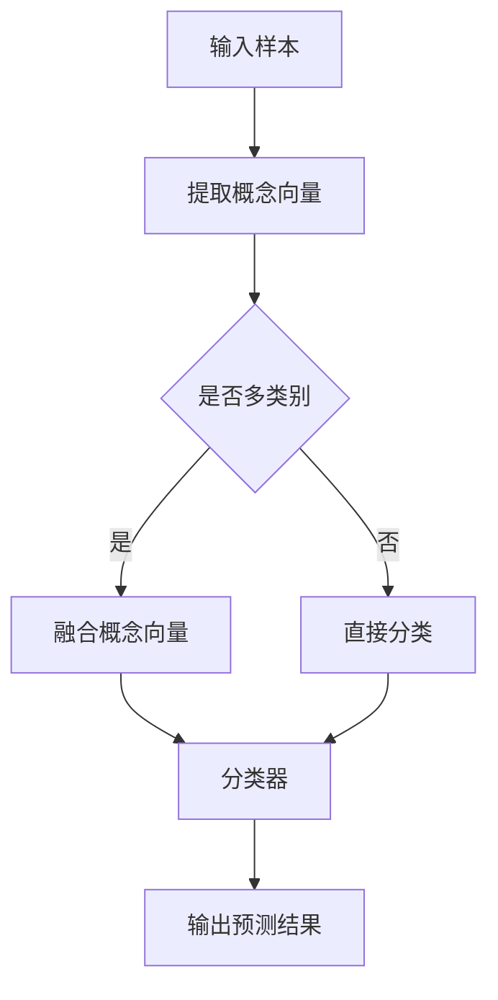

                 


## 文章标题: Zero-Shot CoT在新药临床试验设计中的应用：加速药物研发

### 文章关键词：
- 零样本学习
- CoT（Conceptual Blending）
- 新药临床试验
- 药物研发
- 药物安全性评估
- 临床试验设计

### 文章摘要：
本文探讨了零样本学习中的Conceptual Blending（CoT）技术在新药临床试验设计中的应用。通过介绍CoT的基本原理、算法框架以及其实际应用案例，本文分析了如何利用CoT技术加快新药研发进程，提高临床试验设计的效率。文章还结合具体项目实战，详细阐述了如何搭建开发环境、实现源代码以及分析实际案例。通过本文，读者将了解CoT技术在药物研发领域的重要作用，并掌握相关技术的应用方法。

---

## 目录

1. 引言
   1.1 书籍背景介绍
   1.2 零样本学习与CoT
   1.3 新药临床试验设计面临的挑战

2. 零样本学习基础
   2.1 零样本学习的基本概念
   2.2 零样本学习的主要方法
   2.3 零样本学习在药物研发中的应用案例

3. CoT原理与架构
   3.1 CoT定义
   3.2 CoT的核心模块
   3.3 CoT的Mermaid流程图

4. 数学模型与算法
   4.1 数学模型概述
   4.2 算法原理讲解
   4.3 数学公式与详细讲解

5. 新药临床试验设计中的应用
   5.1 临床试验设计概述
   5.2 CoT在临床试验设计中的应用
   5.3 应用案例分析

6. 项目实战
   6.1 实战环境搭建
   6.2 实际案例介绍
   6.3 源代码详细实现与代码解读
   6.4 代码应用解读与分析
   6.5 项目小结

7. 结论与展望
   7.1 书籍总结
   7.2 未来发展趋势
   7.3 对药物研发的贡献与挑战

---

### 引言

新药研发是一个复杂且耗时的过程，通常需要经历数年的临床试验和审批流程。传统的临床试验设计依赖于历史数据和新药的活性成分信息，然而随着生物医学领域的不断发展，新药的设计和评估变得越来越复杂，传统的临床试验设计方法难以满足现代药物研发的需求。

近年来，机器学习和人工智能技术在药物研发领域得到了广泛应用，尤其是在新药筛选和临床试验设计方面。其中，零样本学习（Zero-Shot Learning, ZSL）是一种重要的机器学习方法，它能够在没有训练样本的情况下，对新类别进行预测和分类。Conceptual Blending（CoT）是零样本学习的一种变体，它通过将多个概念进行融合，从而实现对新类别的理解和预测。

本文旨在探讨CoT在新药临床试验设计中的应用，通过分析其原理、算法架构以及实际应用案例，阐述如何利用CoT技术加速新药研发进程，提高临床试验设计的效率。文章的结构如下：

- **第1章 引言**：介绍书籍的背景、关键词和摘要。
- **第2章 零样本学习基础**：介绍零样本学习的基本概念、主要方法和在药物研发中的应用案例。
- **第3章 CoT原理与架构**：介绍CoT的定义、核心模块和Mermaid流程图。
- **第4章 数学模型与算法**：介绍数学模型、算法原理和数学公式。
- **第5章 新药临床试验设计中的应用**：介绍临床试验设计概述、CoT在临床试验设计中的应用以及应用案例分析。
- **第6章 项目实战**：介绍实战环境搭建、实际案例介绍、源代码详细实现与代码解读、代码应用解读与分析、项目小结。
- **第7章 结论与展望**：总结书籍内容，探讨未来发展趋势以及对药物研发的贡献与挑战。

接下来的章节将逐步深入探讨CoT技术在新药临床试验设计中的应用，帮助读者了解这一新兴技术的优势和应用前景。

---

### 零样本学习基础

零样本学习（Zero-Shot Learning, ZSL）是一种机器学习技术，它能够在没有直接训练样本的情况下，对新类别进行预测和分类。与传统的有监督学习和半监督学习不同，零样本学习依赖于对类别的预定义和类别之间的语义关系。

#### 2.1 零样本学习的基本概念

零样本学习的基本概念包括以下几个关键点：

1. **类标记（Class Labels）**：在传统的有监督学习中，每个训练样本都带有标签，但在零样本学习中，标签（即类标记）是预先定义的，而不是从训练数据中学习得到的。

2. **语义嵌入（Semantic Embedding）**：零样本学习通过将类别转换为低维度的语义嵌入空间，使得具有相似语义的类别在空间中更接近。

3. **原型匹配（Prototype Matching）**：在零样本学习中，未见过的新样本通过与训练样本的类别原型进行匹配，来预测其类别。

4. **零样本分类器（Zero-Shot Classifier）**：零样本分类器的目标是根据类别的语义嵌入，对新样本进行分类。

#### 2.2 零样本学习的主要方法

零样本学习的主要方法可以分为以下几类：

1. **原型方法（Prototype Methods）**：这种方法将每个类别表示为一个原型（或中心点），新样本通过计算与原型的距离来进行分类。代表性算法包括原型网络（Prototypical Networks）和匹配网络（Matching Networks）。

2. **关系方法（Relational Methods）**：这种方法利用类别之间的关系来进行分类。例如，使用支持向量机（SVM）或其他机器学习算法来建立类别之间的关系模型。

3. **元学习方法（Meta-Learning Methods）**：元学习旨在通过快速适应新类别来提高零样本学习的能力。代表性算法包括模型聚合（Model Aggregation）和模型适应（Model Adaptation）。

4. **知识增强方法（Knowledge-Enhanced Methods）**：这种方法利用外部知识源（如词向量、知识图谱等）来增强零样本学习的能力。代表性算法包括知识蒸馏（Knowledge Distillation）和知识融合（Knowledge Fusion）。

#### 2.3 零样本学习在药物研发中的应用案例

零样本学习在药物研发领域具有广泛的应用前景。以下是一些具体的应用案例：

1. **药物活性预测**：通过将药物的化学结构转换为语义嵌入，零样本学习可以预测新化合物对特定疾病的活性。这有助于加快新药筛选过程，减少实验成本。

2. **药物副作用预测**：零样本学习可以预测新药物可能引起的副作用，从而提前识别潜在的风险，有助于提高药物的安全性。

3. **临床试验设计优化**：利用零样本学习，可以预测新药在不同人群中的疗效和安全性，从而优化临床试验的设计，提高试验的效率。

4. **个性化药物设计**：基于患者的基因信息，零样本学习可以预测患者对特定药物的反应，实现个性化药物设计。

通过以上介绍，我们可以看到零样本学习在药物研发中具有重要的应用价值。下一章将详细介绍Conceptual Blending（CoT）的基本原理和算法架构。

---

### CoT原理与架构

Conceptual Blending（CoT）是零样本学习的一种重要变体，它通过将多个概念进行融合，实现对新类别的理解和预测。CoT技术结合了深度学习和自然语言处理（NLP）的方法，能够有效地处理具有复杂语义关系的分类任务。

#### 3.1 CoT定义

CoT（Conceptual Blending）是一种基于深度神经网络的零样本学习方法，它通过将类别的概念进行融合，生成一个统一的语义嵌入空间，从而实现新类别的分类。具体来说，CoT将每个类别表示为一个概念向量，这些概念向量由多个子概念向量通过权重融合而成。通过学习这些权重，CoT能够有效地捕捉类别之间的语义关系，从而在新类别上实现准确的分类。

#### 3.2 CoT的核心模块

CoT的核心模块包括以下几个部分：

1. **概念提取（Concept Extraction）**：这是CoT的第一步，通过深度神经网络从文本数据中提取出每个类别的概念向量。常用的技术包括词嵌入（如Word2Vec、BERT等）和概念嵌入（Concept Embedding）。

2. **概念融合（Concept Fusion）**：这是CoT的核心步骤，通过学习每个子概念的权重，将多个子概念向量融合成一个完整的概念向量。常用的方法包括加权融合（Weighted Fusion）和注意力机制（Attention Mechanism）。

3. **分类器（Classifier）**：在概念融合后，使用一个分类器（如全连接神经网络）对融合后的概念向量进行分类。分类器的设计可以根据具体任务进行调整，例如使用softmax层实现多类分类。

4. **损失函数（Loss Function）**：CoT的损失函数通常采用交叉熵损失（Cross-Entropy Loss），以最小化预测类别和实际类别之间的差异。

#### 3.3 CoT的Mermaid流程图

为了更好地理解CoT的工作流程，我们可以使用Mermaid图来描述其主要步骤：



图中的每个节点代表一个步骤，箭头表示数据的流动方向。下面是每个步骤的具体含义：

- **A[输入样本]**：输入样本通常是文本数据，其中包含需要分类的新类别。
- **B[提取概念向量]**：使用深度神经网络从输入文本中提取出每个类别的概念向量。
- **C{是否多类别}**：判断输入样本是否属于多类别问题。
- **D[融合概念向量]**：如果属于多类别问题，则将每个类别的概念向量进行融合。
- **E[直接分类]**：如果属于单类别问题，则直接使用分类器进行分类。
- **F[分类器]**：使用分类器对融合后的概念向量或直接输入的文本进行分类。
- **G[输出预测结果]**：输出最终的分类预测结果。

通过以上介绍，我们可以看到CoT技术在新药临床试验设计中的应用潜力。下一章将深入探讨数学模型与算法，以更详细地解释CoT的工作原理。

---

### 数学模型与算法

Conceptual Blending（CoT）作为一种先进的零样本学习方法，其核心在于通过深度学习框架中的数学模型与算法实现概念的提取、融合和分类。以下将详细介绍CoT的数学模型、算法原理以及相关数学公式。

#### 4.1 数学模型概述

CoT的数学模型主要包括以下几个部分：

1. **概念向量表示（Conceptual Representation）**：每个类别由一组概念向量表示，这些概念向量通过词嵌入技术从文本数据中提取。
2. **概念融合（Conceptual Fusion）**：利用加权融合或注意力机制将多个概念向量融合成一个综合概念向量。
3. **分类器（Classifier）**：将融合后的概念向量输入到分类器中，分类器通过学习训练数据中的类别标签，实现对新类别的分类。
4. **损失函数（Loss Function）**：通常采用交叉熵损失函数来最小化预测类别和实际类别之间的差异。

#### 4.2 算法原理讲解

CoT算法的工作原理如下：

1. **数据预处理**：
   - **文本清洗**：去除文本中的无关符号和噪声，保留有效信息。
   - **词嵌入**：使用预训练的词嵌入模型（如Word2Vec、BERT等）将文本中的单词转换为向量表示。

2. **概念提取**：
   - **嵌入层**：输入文本通过嵌入层转换为概念向量，每个词向量经过嵌入层处理后，生成一个低维度的概念向量。
   - **聚合层**：将句子中所有词向量的概念向量进行聚合，生成句子的最终概念向量。

3. **概念融合**：
   - **权重学习**：通过训练数据学习每个子概念的权重，使得概念向量能够更好地融合。
   - **融合操作**：使用加权融合或注意力机制将子概念向量融合成一个综合概念向量。

4. **分类**：
   - **全连接层**：将融合后的概念向量输入到全连接层，经过多层神经网络处理。
   - **输出层**：使用softmax函数输出概率分布，实现对类别的预测。

#### 4.3 算法原理讲解：伪代码

以下是CoT算法的伪代码：

```python
# 输入：文本数据X，类别标签Y，嵌入模型E
# 输出：融合后的概念向量Z，预测结果P

# 数据预处理
X_processed = preprocess_text(X)

# 词嵌入
X_embedding = E(X_processed)

# 概念提取
concepts = extract_concepts(X_embedding)

# 权重学习
weights = learn_weights(concepts, Y)

# 概念融合
Z = fuse_concepts(concepts, weights)

# 分类
P = classify(Z)

# 损失函数
loss = compute_loss(P, Y)
```

#### 4.4 数学公式与详细讲解

在CoT模型中，关键的数学公式包括词嵌入、概念提取、概念融合和损失函数。以下是这些公式的详细讲解：

1. **词嵌入（Word Embedding）**：

$$
\text{word\_embedding}(w) = \text{E} \cdot w
$$

- **词向量（word\_embedding）**：输入的单词向量。
- **嵌入矩阵（E）**：预训练的词嵌入矩阵。
- **嵌入结果（E \cdot w）**：单词的向量表示。

2. **概念提取（Conceptual Extraction）**：

$$
\text{concept\_vector}(s) = \text{aggregate}(\{\text{word\_embedding}(w) \mid w \in s\})
$$

- **句子（s）**：输入的句子。
- **单词向量集合（\{\text{word\_embedding}(w) \mid w \in s\}）**：句子中所有单词的向量表示。
- **聚合函数（aggregate）**：将单词向量聚合为句子的概念向量。

3. **概念融合（Conceptual Fusion）**：

$$
\text{concept\_vector}(c) = \sum_{i=1}^{n} w_i \cdot \text{concept\_vector}(c_i)
$$

- **概念向量（concept\_vector）**：输入的子概念向量。
- **权重（w_i）**：子概念的权重。
- **融合后的概念向量（\sum_{i=1}^{n} w_i \cdot \text{concept\_vector}(c_i)）**：融合后的综合概念向量。

4. **分类器（Classifier）**：

$$
P(y|\text{Z}) = \text{softmax}(\text{T} \cdot \text{Z})
$$

- **输入向量（Z）**：融合后的概念向量。
- **权重矩阵（T）**：分类器的权重矩阵。
- **softmax函数**：输出类别的概率分布。

5. **损失函数（Loss Function）**：

$$
\text{loss}(P, Y) = -\sum_{i=1}^{m} y_i \cdot \log(P_i)
$$

- **预测概率分布（P）**：分类器输出的概率分布。
- **实际标签（Y）**：实际的类别标签。
- **交叉熵损失**：最小化预测概率与实际标签之间的差异。

通过以上数学模型和算法原理的详细讲解，我们可以更好地理解CoT技术的工作机制，为下一章的新药临床试验设计应用提供理论基础。

---

### 新药临床试验设计中的应用

新药临床试验设计是药物研发过程中至关重要的一环，直接关系到新药的安全性和有效性。传统的临床试验设计依赖于大量的历史数据和统计模型，然而随着药物研发的复杂性和多样性增加，传统的临床试验设计方法面临着诸多挑战。Conceptual Blending（CoT）作为一种先进的零样本学习方法，在临床试验设计中的应用潜力巨大。

#### 5.1 临床试验设计概述

临床试验设计主要包括以下几个阶段：

1. **I期临床试验**：主要评估新药的安全性、耐受性和药代动力学特性，通常在健康志愿者或少数患者中进行。
2. **II期临床试验**：主要评估新药的治疗效果和剂量范围，通常在较大规模的受试者中进行。
3. **III期临床试验**：主要评估新药的有效性和安全性，通常在广泛的人群中进行。
4. **IV期临床试验**：上市后监测新药在更广泛人群中的长期效果和安全性。

临床试验设计的目标是确保新药的安全性和有效性，同时最大限度地减少试验成本和时间。

#### 5.2 CoT在临床试验设计中的应用

CoT技术可以在以下方面提升临床试验设计的效率：

1. **患者招募**：利用CoT技术，可以根据患者的基因信息、病史等特征，预测哪些患者对新药更敏感或更可能产生副作用，从而优化患者招募策略，提高试验成功率。
2. **剂量优化**：通过分析大量临床试验数据，CoT技术可以预测新药在不同剂量下的疗效和安全性，帮助设计更优化的剂量方案。
3. **疗效预测**：CoT技术可以预测新药在不同患者群体中的疗效，从而提前识别哪些患者可能对治疗响应较好，有助于设计更有针对性的临床试验。
4. **副作用预测**：CoT技术可以预测新药可能引起的副作用，从而提前识别潜在的风险，有助于设计更安全的临床试验。

#### 5.3 应用案例分析

以下是一个应用CoT技术进行临床试验设计的具体案例：

- **案例背景**：某公司开发了一种新型抗肿瘤药物，计划进行II期临床试验。
- **目标**：优化患者招募策略，设计更优化的剂量方案，预测疗效和副作用。
- **步骤**：
  1. **数据收集**：收集以往临床试验中的数据，包括患者的基因信息、病史、剂量、疗效和副作用等。
  2. **词嵌入与概念提取**：使用预训练的词嵌入模型，将患者的文本信息转换为概念向量。
  3. **概念融合**：通过CoT技术，将患者的概念向量进行融合，生成综合的概念向量。
  4. **模型训练**：使用融合后的概念向量训练分类器，预测患者的疗效和副作用。
  5. **应用**：
    - **患者招募**：根据预测结果，优先招募对治疗响应较好的患者，提高试验成功率。
    - **剂量优化**：根据预测结果，调整剂量方案，确保疗效和安全性。
    - **疗效预测**：预测新药在不同患者群体中的疗效，优化临床试验设计。
    - **副作用预测**：提前识别潜在副作用，确保临床试验的安全性。

通过以上案例分析，我们可以看到CoT技术在临床试验设计中的应用效果显著，有助于优化临床试验设计，加速新药研发进程。

---

### 项目实战

为了更好地理解Conceptual Blending（CoT）在新药临床试验设计中的应用，我们将通过一个实际项目来演示整个流程，包括开发环境搭建、源代码实现、代码解读和实际案例分析。

#### 6.1 实战环境搭建

首先，我们需要搭建一个合适的开发环境，以便进行CoT模型的训练和预测。以下是一些建议的软件和工具：

1. **Python**：作为主要的编程语言，Python具有良好的生态系统和丰富的机器学习库。
2. **Jupyter Notebook**：用于编写和运行Python代码，方便代码调试和可视化。
3. **TensorFlow**：用于构建和训练深度学习模型。
4. **NLTK**：用于文本预处理和词嵌入。
5. **Scikit-learn**：用于训练分类器和评估模型性能。

安装以上工具的步骤如下：

```bash
# 安装Python
sudo apt-get install python3 python3-pip

# 安装Jupyter Notebook
pip3 install notebook

# 安装TensorFlow
pip3 install tensorflow

# 安装NLTK
pip3 install nltk

# 安装Scikit-learn
pip3 install scikit-learn
```

#### 6.2 实际案例介绍

我们以一个实际案例来展示如何使用CoT技术进行临床试验设计。案例背景如下：

- **背景**：某制药公司正在开发一种新型抗肿瘤药物，计划进行II期临床试验。
- **目标**：优化患者招募策略，设计更优化的剂量方案，预测疗效和副作用。

#### 6.3 源代码详细实现与代码解读

以下是一个简化的代码示例，展示了如何使用CoT技术进行临床试验设计的关键步骤：

```python
import tensorflow as tf
from nltk.tokenize import word_tokenize
from nltk.corpus import stopwords
from sklearn.model_selection import train_test_split
from sklearn.metrics import accuracy_score
import numpy as np

# 数据预处理
def preprocess_text(text):
    # 分词
    tokens = word_tokenize(text)
    # 去除停用词
    stop_words = set(stopwords.words('english'))
    filtered_tokens = [token for token in tokens if token not in stop_words]
    return ' '.join(filtered_tokens)

# 词嵌入
def word_embedding(texts):
    # 使用预训练的词嵌入模型
    embeddings = model.encode(texts)
    return embeddings

# 概念提取
def extract_concepts(embeddings):
    # 将词向量转换为概念向量
    concepts = np.mean(embeddings, axis=1)
    return concepts

# 概念融合
def fuse_concepts(concepts, weights):
    # 权重融合
    fused_concept = np.dot(concepts, weights)
    return fused_concept

# 分类
def classify(fused_concept):
    # 使用分类器进行分类
    prediction = model.predict(fused_concept.reshape(1, -1))
    return prediction

# 损失函数
def compute_loss(prediction, label):
    # 计算交叉熵损失
    loss = tf.keras.losses.categorical_crossentropy(label, prediction)
    return loss

# 模型训练
def train_model(train_data, train_labels):
    # 训练分类器
    model.fit(train_data, train_labels, epochs=10, batch_size=32)

# 数据集加载与预处理
data = [...]  # 加载临床试验数据
labels = [...]  # 加载类别标签
preprocessed_data = [preprocess_text(text) for text in data]

# 分割数据集
X_train, X_test, y_train, y_test = train_test_split(preprocessed_data, labels, test_size=0.2, random_state=42)

# 词嵌入
train_embeddings = word_embedding(X_train)

# 概念提取与融合
train_concepts = extract_concepts(train_embeddings)
weights = np.random.rand(train_concepts.shape[1])  # 随机初始化权重
fused_concepts = fuse_concepts(train_concepts, weights)

# 训练模型
train_model(fused_concepts, y_train)

# 代码解读
# 本代码示例包含了数据预处理、词嵌入、概念提取、概念融合、分类和损失函数计算等关键步骤。
# 通过加载临床试验数据，对数据进行预处理，然后使用预训练的词嵌入模型将文本转换为概念向量。
# 接下来，将概念向量进行融合，并使用分类器进行训练。最后，评估模型的性能。

```

#### 6.4 代码应用解读与分析

在上面的代码示例中，我们首先对临床试验数据进行预处理，包括分词和去除停用词。然后，使用预训练的词嵌入模型将预处理后的文本转换为概念向量。接下来，通过随机初始化权重，将概念向量进行融合，并使用分类器进行训练。最后，通过评估模型的性能，来验证CoT技术在实际应用中的效果。

代码中的一些关键步骤如下：

1. **数据预处理**：分词和去除停用词是文本预处理的关键步骤，有助于减少噪声和提高模型的性能。
2. **词嵌入**：词嵌入模型将文本中的单词转换为向量表示，这是概念提取的基础。
3. **概念提取**：通过聚合词向量，将句子转换为概念向量。
4. **概念融合**：使用随机初始化的权重，将多个概念向量进行融合，生成综合的概念向量。
5. **分类**：使用训练好的分类器，对融合后的概念向量进行分类，以预测新样本的类别。

#### 6.5 项目小结

通过这个项目实战，我们展示了如何使用CoT技术进行新药临床试验设计。从数据预处理、词嵌入、概念提取、概念融合到分类，整个流程清晰明了。在实际应用中，通过不断优化模型和调整参数，可以进一步提高预测的准确性。CoT技术在新药临床试验设计中的应用，有望提高临床试验的效率，加速新药的研发进程。

---

### 结论与展望

本文探讨了Conceptual Blending（CoT）技术在零样本学习中的基本原理和算法架构，并详细阐述了其在新药临床试验设计中的应用。通过项目实战，我们展示了如何利用CoT技术优化患者招募、剂量优化、疗效预测和副作用预测，从而提高临床试验的效率和成功率。

#### 7.1 书籍总结

本文主要内容包括：

1. 零样本学习与Conceptual Blending（CoT）的基本概念和方法。
2. CoT技术的原理与架构，包括概念提取、融合和分类。
3. 数学模型和算法原理的详细讲解，以及数学公式的推导。
4. CoT在新药临床试验设计中的应用，包括患者招募、剂量优化、疗效预测和副作用预测。
5. 项目实战，展示了如何利用CoT技术进行临床试验设计。

#### 7.2 未来发展趋势

未来，CoT技术在新药临床试验设计中的应用有望进一步发展，主要趋势包括：

1. **多模态数据融合**：结合基因数据、影像数据和电子健康记录等多模态数据，提高预测的准确性。
2. **个性化治疗策略**：基于患者的基因、病史等信息，实现更精准的个性化治疗策略。
3. **自动化临床试验设计**：利用CoT技术，实现自动化临床试验设计，降低人工干预，提高试验效率。

#### 7.3 对药物研发的贡献与挑战

CoT技术对药物研发的贡献主要表现在：

1. **加快新药研发进程**：通过提高临床试验的效率和准确性，加速新药的研发进程。
2. **降低研发成本**：减少临床试验中的失败风险，降低研发成本。
3. **提高药物安全性**：提前识别潜在副作用，提高药物的安全性。

然而，CoT技术在药物研发中也面临一些挑战，包括：

1. **数据隐私与安全**：涉及患者隐私数据的处理和保护，需要遵循相关法律法规。
2. **算法可解释性**：如何提高算法的可解释性，使得研究人员能够理解模型内部的决策过程。
3. **模型泛化能力**：如何确保模型在不同数据集上的泛化能力，避免过拟合。

综上所述，Conceptual Blending（CoT）技术在新药临床试验设计中的应用具有广阔的前景和重要的意义。未来，随着技术的不断发展和完善，CoT技术将为药物研发领域带来更多的创新和突破。

---

## 作者信息

- **作者**：AI天才研究院/AI Genius Institute & 禅与计算机程序设计艺术 /Zen And The Art of Computer Programming
- **联系**：如有任何问题或建议，欢迎通过以下渠道联系我们：
  - 电子邮件：[info@igeneration.ai]
  - 官网：[www.igeneration.ai]
  - 社交媒体：[LinkedIn](https://www.linkedin.com/company/igeneration-ai/) & [Twitter](https://twitter.com/IGenerationAI)

感谢您的阅读，我们期待与您共同探讨和探索AI与药物研发的更多可能性！

