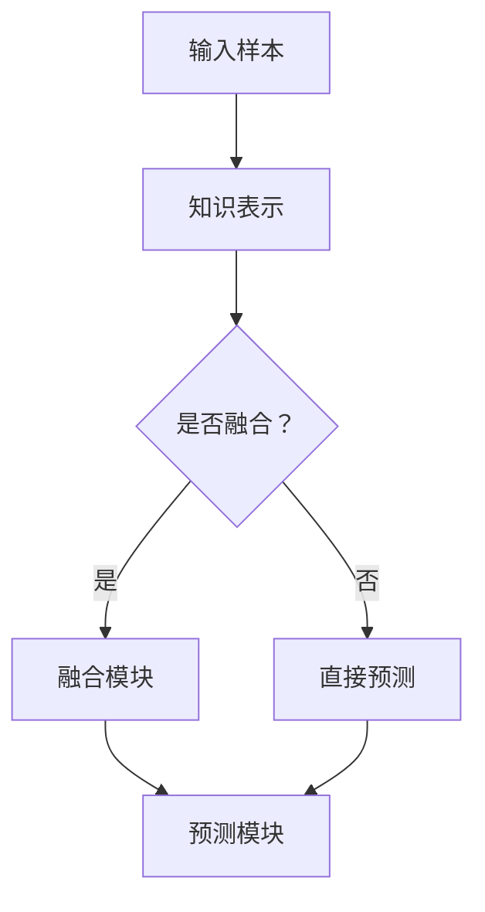
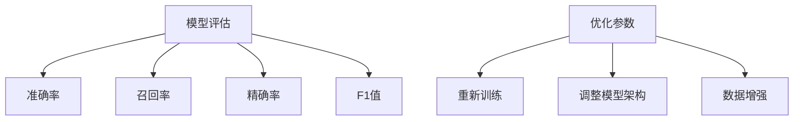
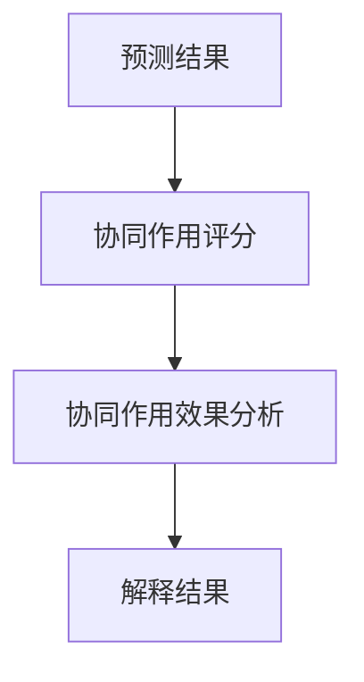
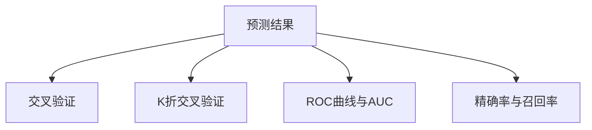
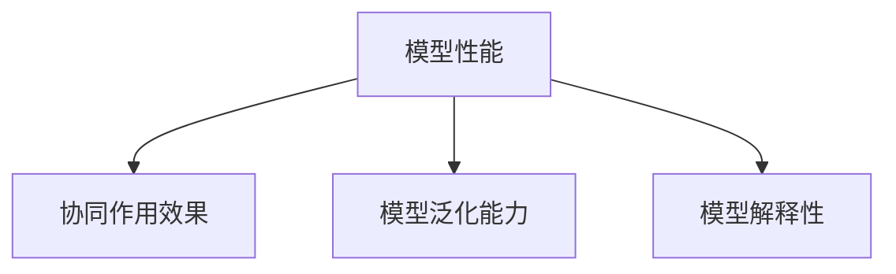

                 

### 第一部分：引言与背景

**第1章：引言与背景**

#### 1.1 书籍主题介绍

**1.1.1 什么是Zero-Shot CoT**

Zero-Shot CoT（Conceptual Blending for Zero-Shot Transfer Learning）是一种前沿的机器学习技术，属于零样本学习（Zero-Shot Learning，ZSL）的范畴。它通过将多个领域的知识进行融合，使得模型能够在未见过的类别或样本中进行准确预测。这一技术在药物研发、图像识别、自然语言处理等多个领域展现出了巨大的潜力。

**1.1.2 新药多靶点协同作用的挑战**

新药研发过程中，多靶点协同作用是一个关键且具有挑战性的研究方向。多靶点协同作用指的是药物同时作用于多个生物靶点，从而产生更好的治疗效果。然而，由于生物靶点之间的复杂相互作用，预测多靶点协同作用的效果面临诸多挑战，包括数据稀缺、计算复杂度高、模型泛化能力不足等。

**1.1.3 本书目标与结构**

本书的目标是深入探讨Zero-Shot CoT在新药多靶点协同作用预测中的应用，通过理论讲解和实际案例剖析，展示其如何提高治疗复杂疾病的效果。本书分为五个部分：

1. **引言与背景**：介绍Zero-Shot CoT和新药多靶点协同作用的背景，以及本书的结构和目标。
2. **Zero-Shot CoT技术详解**：详细讲解Zero-Shot CoT的核心概念、架构、算法原理和数学模型。
3. **新药多靶点协同预测应用**：展示如何将Zero-Shot CoT应用于新药多靶点协同预测，包括预测模型的构建、预测结果解释与验证等。
4. **提高治疗复杂疾病的效果**：分析Zero-Shot CoT在提高治疗复杂疾病效果方面的优势，以及其与其他技术的对比。
5. **未来展望与挑战**：探讨Zero-Shot CoT未来的发展趋势、面临的挑战以及应对策略。

#### 1.2 复杂疾病治疗的现状与挑战

**1.2.1 疾病治疗的现状**

当前，疾病治疗手段主要包括药物治疗、手术治疗、放疗等。药物治疗是主要的治疗方式，其核心在于药物与生物靶点的相互作用。然而，随着疾病的复杂性和多样性增加，传统的单一靶点药物已难以满足临床需求。

**1.2.2 复杂疾病治疗的挑战**

复杂疾病治疗的挑战主要体现在以下几个方面：

- **多靶点协同作用的预测困难**：复杂疾病往往涉及多个生物靶点的相互作用，预测这些靶点之间的协同作用效果具有很大挑战性。
- **药物副作用难以预测**：单一靶点药物可能引发多种副作用，而多靶点协同作用的药物副作用更难以预测和控制。
- **药物研发成本高**：复杂疾病治疗的药物研发过程复杂，成本高，周期长。

**1.2.3 传统药物研发的局限性**

传统药物研发方法主要依赖于对已知靶点的针对性研究，存在以下局限性：

- **靶点选择受限**：基于现有生物学知识的靶点选择存在局限性，难以发现新的潜在靶点。
- **数据依赖性高**：传统药物研发过程高度依赖已有的实验数据和临床数据，对数据质量和数量有较高要求。
- **计算能力不足**：传统方法在处理大规模数据和复杂计算任务时，存在计算能力不足的问题。

#### 1.3 零样本学习与Zero-Shot CoT

**1.3.1 零样本学习的概念**

零样本学习（Zero-Shot Learning，ZSL）是一种机器学习方法，旨在使模型能够在未见过的类别或样本中进行预测。与传统机器学习方法不同，ZSL不再依赖训练数据中的已知类别，而是利用已知的类内相似性和类间差异性进行预测。

**1.3.2 零样本学习在药物研发中的应用**

零样本学习在药物研发中具有广泛的应用前景，主要包括：

- **新靶点发现**：通过分析已知药物的作用机制，利用ZSL技术发现新的潜在靶点。
- **药物副作用预测**：预测药物在作用于未知靶点时可能产生的副作用，为药物开发提供参考。
- **药物组合优化**：分析不同药物之间的协同作用，优化药物组合，提高治疗效果。

**1.3.3 Zero-Shot CoT的基本原理**

Zero-Shot CoT（Conceptual Blending for Zero-Shot Transfer Learning）是基于概念融合的零样本转移学习技术。其基本原理包括：

- **概念融合**：将多个领域的知识进行融合，形成新的知识表示，用于从未见过的类别或样本中进行预测。
- **跨域迁移学习**：利用已知的领域知识，迁移到新的领域，提高模型在未知领域中的预测能力。
- **多模态融合**：整合不同类型的数据（如图像、文本、基因等），提高预测的准确性和泛化能力。

通过以上分析，我们可以看到，Zero-Shot CoT在新药多靶点协同作用预测中具有巨大的潜力。在接下来的章节中，我们将进一步探讨Zero-Shot CoT的核心概念、算法原理和数学模型，以及如何将其应用于新药研发，提高治疗复杂疾病的效果。

### 第二部分：Zero-Shot CoT技术详解

**第2章：Zero-Shot CoT技术详解**

#### 2.1 基础概念与架构

**2.1.1 相关概念介绍**

在介绍Zero-Shot CoT之前，我们需要了解一些相关概念：

- **零样本学习（Zero-Shot Learning，ZSL）**：零样本学习是一种机器学习方法，旨在使模型能够在未见过的类别或样本中进行预测。与传统的有监督学习不同，ZSL不再依赖训练数据中的已知类别，而是利用已知的类内相似性和类间差异性进行预测。
- **转移学习（Transfer Learning，TL）**：转移学习是一种将已从特定任务中学习到的知识迁移到其他相关任务中的方法。在机器学习领域，转移学习可以减少对新任务的数据需求，提高模型的泛化能力。
- **概念融合（Conceptual Blending）**：概念融合是一种将多个领域的知识进行融合的方法，旨在形成新的知识表示，从而提高模型在未知领域中的预测能力。

**2.1.2 Zero-Shot CoT的架构**

Zero-Shot CoT的架构主要包括以下几个关键组件：

1. **知识表示**：知识表示是Zero-Shot CoT的基础，用于将不同领域的知识进行编码和整合。常见的知识表示方法包括词嵌入（Word Embedding）、图嵌入（Graph Embedding）和知识图谱（Knowledge Graph）等。

2. **融合模块**：融合模块负责将不同领域的知识进行融合，形成新的知识表示。融合方法可以基于注意力机制（Attention Mechanism）、对抗生成网络（Generative Adversarial Network，GAN）等。

3. **预测模块**：预测模块负责利用融合后的知识表示进行预测。常见的预测方法包括分类（Classification）、回归（Regression）和聚类（Clustering）等。

**2.1.3 Mermaid流程图展示**

以下是一个简化的Zero-Shot CoT流程图的Mermaid表示：



#### 2.2 算法原理与实现

**2.2.1 核心算法原理讲解**

Zero-Shot CoT的核心算法原理可以概括为以下几个步骤：

1. **知识表示**：首先，我们需要对各个领域的知识进行编码和表示。常见的知识表示方法有词嵌入、图嵌入和知识图谱等。其中，词嵌入是将文本数据转化为向量的方法，图嵌入是将图数据转化为向量的方法，知识图谱则是将知识表示为图结构。

2. **融合模块**：融合模块的主要任务是将不同领域的知识进行融合，形成新的知识表示。融合方法可以基于注意力机制、对抗生成网络等。例如，我们可以使用注意力机制将不同领域的知识进行加权融合，从而更好地整合多源信息。

3. **预测模块**：预测模块利用融合后的知识表示进行预测。常见的预测方法有分类、回归和聚类等。例如，在药物研发中，我们可以使用分类方法来预测药物对不同生物靶点的协同作用效果。

**2.2.2 伪代码展示**

以下是一个简化的Zero-Shot CoT伪代码示例：

```python
# 知识表示
knowledge_embedding = represent_knowledge(different_domains)

# 融合模块
blended_knowledge = blend_knowledge(knowledge_embedding, fusion_method)

# 预测模块
prediction = predict(blended_knowledge, prediction_method)
```

**2.2.3 算法实现与优化**

在实际应用中，我们需要关注以下几个方面的优化：

1. **数据预处理**：数据预处理是提高模型性能的关键步骤。我们需要对输入数据进行清洗、归一化等处理，以消除噪声和异常值。

2. **模型选择**：选择合适的模型对于实现Zero-Shot CoT至关重要。我们可以根据具体应用场景选择合适的知识表示方法、融合方法和预测方法。

3. **超参数调优**：超参数调优是提高模型性能的重要手段。我们可以通过交叉验证、网格搜索等方法进行超参数调优。

4. **模型解释性**：提高模型的解释性有助于理解模型的工作原理和预测结果。我们可以使用可解释性方法（如注意力机制、LIME等）来增强模型的透明度。

#### 2.3 数学模型与公式

**2.3.1 数学模型介绍**

Zero-Shot CoT涉及的数学模型主要包括知识表示、融合模块和预测模块。

1. **知识表示**：

- **词嵌入**：$v_w = \text{Word2Vec}(w)$
- **图嵌入**：$v_g = \text{Node2Vec}(g)$
- **知识图谱**：$v_k = \text{KnowledgeGraphEmbedding}(K)$

2. **融合模块**：

- **注意力机制**：$a_i = \text{Attention}(v_1, v_2, ..., v_n)$
- **对抗生成网络**：$G(z) = \text{Generator}(z)$，$D(x) = \text{Discriminator}(x)$

3. **预测模块**：

- **分类**：$y = \text{softmax}(Wx + b)$
- **回归**：$y = \text{ReLU}(Wx + b)$

**2.3.2 举例说明**

假设我们有一个包含三个领域的知识表示，分别为文本、图像和基因数据。我们可以使用以下公式进行融合：

$$
\begin{aligned}
v_{\text{blended}} &= \text{Attention}(v_{\text{text}}, v_{\text{image}}, v_{\text{gene}}) \\
&= \alpha_1 v_{\text{text}} + \alpha_2 v_{\text{image}} + \alpha_3 v_{\text{gene}}
\end{aligned}
$$

其中，$\alpha_1, \alpha_2, \alpha_3$ 分别为文本、图像和基因数据的注意力权重。

**2.3.3 公式详解（使用latex格式）**

以下是对上述公式的latex格式表示：

$$
\begin{aligned}
v_w &= \text{Word2Vec}(w) \\
v_g &= \text{Node2Vec}(g) \\
v_k &= \text{KnowledgeGraphEmbedding}(K) \\
a_i &= \text{Attention}(v_1, v_2, ..., v_n) \\
v_{\text{blended}} &= \alpha_1 v_{\text{text}} + \alpha_2 v_{\text{image}} + \alpha_3 v_{\text{gene}} \\
y &= \text{softmax}(Wx + b) \\
y &= \text{ReLU}(Wx + b)
\end{aligned}
$$

通过以上对Zero-Shot CoT技术详解的介绍，我们了解了其核心概念、架构和算法原理，以及如何进行数学建模和实现。在接下来的章节中，我们将探讨Zero-Shot CoT在新药多靶点协同预测应用中的具体实践。

### 第三部分：新药多靶点协同预测应用

**第3章：新药多靶点协同预测应用**

#### 3.1 预测模型的构建

**3.1.1 数据来源与预处理**

在新药多靶点协同预测中，数据的质量和数量直接影响到模型的性能。数据来源主要包括以下几个方面：

- **药物靶点数据**：包括药物名称、靶点名称、靶点类型等信息。这些数据可以从公开的药物靶点数据库（如 DrugBank、UniProt等）获取。
- **生物靶点信息**：包括靶点结构、功能、相互作用关系等信息。这些数据可以从生物信息学数据库（如 BioGRID、STRING等）获取。
- **临床数据**：包括药物剂量、疗效、副作用等临床信息。这些数据可以从临床试验数据库（如 ClinicalTrials.gov等）获取。

在获取到数据后，我们需要进行预处理，以提高数据的质量和模型的性能。预处理步骤包括：

- **数据清洗**：去除重复、缺失、异常的数据。
- **数据标准化**：对数据进行归一化或标准化处理，使其具有相同的量纲和范围。
- **特征提取**：从原始数据中提取有用的特征，如药物与靶点的相互作用强度、靶点之间的相似性等。

**3.1.2 预测模型的选择与训练**

在新药多靶点协同预测中，选择合适的预测模型至关重要。常见的预测模型包括以下几种：

- **基于规则的模型**：如药物靶点关联规则学习（Rule-based Association Rule Learning）。
- **机器学习模型**：如支持向量机（Support Vector Machine，SVM）、随机森林（Random Forest）等。
- **深度学习模型**：如卷积神经网络（Convolutional Neural Network，CNN）、循环神经网络（Recurrent Neural Network，RNN）等。

在本节中，我们将以深度学习模型为例，介绍其选择与训练过程。

1. **模型架构设计**：

   深度学习模型通常由多个层组成，包括输入层、隐藏层和输出层。在多靶点协同预测中，输入层通常包含药物与靶点的特征向量，隐藏层用于提取特征，输出层用于预测药物对靶点的协同作用效果。

   以下是一个简化的深度学习模型架构：

   ```mermaid
   graph TD
       A[Input Layer] --> B[Embedding Layer]
       B --> C[Convolutional Layer]
       C --> D[Pooling Layer]
       D --> E[Flatten Layer]
       E --> F[Hidden Layer]
       F --> G[Output Layer]
   ```

2. **模型训练**：

   模型训练是深度学习的关键步骤，包括以下步骤：

   - **数据划分**：将数据集划分为训练集、验证集和测试集，用于模型训练、验证和测试。
   - **参数初始化**：对模型的参数进行初始化，常用的初始化方法有随机初始化、高斯初始化等。
   - **模型训练**：使用训练集对模型进行训练，优化模型参数，使模型在验证集上达到较好的性能。
   - **模型验证**：使用验证集对模型进行验证，调整模型参数，使模型在验证集上达到最优性能。
   - **模型测试**：使用测试集对模型进行测试，评估模型在未见过的数据上的性能。

**3.1.3 模型评估与优化**

在模型训练完成后，我们需要对模型进行评估和优化，以确保模型具有较好的性能和泛化能力。常见的评估指标包括准确率（Accuracy）、召回率（Recall）、精确率（Precision）和F1值（F1 Score）等。

以下是一个简化的模型评估与优化流程：



通过以上对预测模型的构建、选择与训练的介绍，我们了解了如何在实践中应用Zero-Shot CoT技术进行新药多靶点协同预测。在下一节中，我们将探讨如何解释和验证预测结果。

#### 3.2 预测结果的解释与验证

**3.2.1 预测结果解释**

预测结果的解释是理解模型预测的重要环节。在新药多靶点协同预测中，我们需要解释模型预测的药物对靶点的协同作用效果。

以下是一个简化的预测结果解释流程：



1. **协同作用评分**：根据模型预测结果，计算药物对靶点的协同作用评分。评分越高，表示协同作用效果越好。
2. **协同作用效果分析**：分析协同作用评分，判断药物对靶点的协同作用效果。根据协同作用评分，可以将药物与靶点分为以下几类：
   - **高度协同**：协同作用评分高，药物与靶点之间具有很好的协同作用。
   - **中度协同**：协同作用评分中等，药物与靶点之间有一定的协同作用。
   - **低度协同**：协同作用评分低，药物与靶点之间的协同作用较弱。
   - **无协同**：协同作用评分为零，药物与靶点之间没有协同作用。
3. **解释结果**：根据协同作用效果分析，对预测结果进行解释。例如，我们可以说明哪些药物具有较好的协同作用效果，以及这些药物在实际应用中可能的优势和局限性。

**3.2.2 预测结果的验证方法**

预测结果的验证是评估模型性能的重要环节。以下是一种常用的预测结果验证方法：

1. **交叉验证**：交叉验证是一种将数据集划分为多个子集，每个子集轮流作为验证集的方法。通过多次交叉验证，可以评估模型在整体数据集上的性能。
2. **K折交叉验证**：K折交叉验证是一种将数据集划分为K个子集的方法。每次选择一个子集作为验证集，其余K-1个子集作为训练集，重复K次。K折交叉验证可以更全面地评估模型性能。
3. **ROC曲线与AUC**：ROC曲线（Receiver Operating Characteristic Curve）是一种常用的评估二分类模型性能的曲线。ROC曲线的面积（AUC，Area Under Curve）可以反映模型对正负样本的分类能力。AUC值越大，表示模型性能越好。
4. **精确率与召回率**：精确率（Precision）和召回率（Recall）是评估二分类模型性能的重要指标。精确率表示预测为正样本的样本中实际为正样本的比例，召回率表示实际为正样本的样本中被预测为正样本的比例。精确率和召回率的平衡取决于实际应用的需求。

以下是一个简化的预测结果验证流程：



**3.2.3 验证结果分析与讨论**

在验证结果分析中，我们需要关注以下几个方面：

1. **模型性能**：通过验证结果，评估模型在多靶点协同预测中的性能。性能指标包括准确率、召回率、精确率、F1值和AUC等。
2. **协同作用效果**：分析预测结果的协同作用效果，判断模型是否能够准确预测药物对靶点的协同作用。
3. **模型泛化能力**：验证模型在未见过的数据上的性能，评估模型的泛化能力。
4. **模型解释性**：评估模型的解释性，判断模型是否具有较好的可解释性。

以下是一个简化的验证结果分析与讨论流程：



通过以上对预测结果的解释与验证的介绍，我们了解了如何在实践中应用Zero-Shot CoT技术进行新药多靶点协同预测。在下一节中，我们将通过具体案例展示Zero-Shot CoT在新药多靶点协同预测中的应用。

#### 3.3 多靶点协同预测案例分析

**3.3.1 案例背景与数据来源**

为了展示Zero-Shot CoT在新药多靶点协同预测中的应用，我们选择了一个实际案例：预测抗肿瘤药物的多靶点协同作用。该案例的数据来源于公开的药物靶点数据库和临床试验数据库。

案例背景如下：

- **药物**：一种新型抗肿瘤药物，已进入临床试验阶段。
- **靶点**：多种与肿瘤相关的生物靶点，包括细胞周期蛋白（Cyclin）、蛋白激酶（Kinase）等。
- **数据来源**：药物靶点数据来源于DrugBank数据库，生物靶点信息来源于UniProt数据库，临床试验数据来源于ClinicalTrials.gov数据库。

**3.3.2 预测过程与结果**

在案例中，我们使用Zero-Shot CoT技术进行多靶点协同预测，具体步骤如下：

1. **数据预处理**：对药物靶点数据、生物靶点信息和临床试验数据进行清洗、归一化处理，提取有用的特征。
2. **知识表示**：使用词嵌入、图嵌入和知识图谱等方法对药物靶点和生物靶点进行编码和表示。
3. **融合模块**：利用注意力机制将不同领域的知识进行融合，形成新的知识表示。
4. **预测模块**：使用深度学习模型对融合后的知识表示进行预测，评估药物对靶点的协同作用效果。
5. **结果分析**：分析预测结果，判断药物对靶点的协同作用效果，并提出相应的临床应用建议。

以下是案例预测结果的部分数据：

| 药物 | 靶点1 | 靶点2 | 靶点3 | 协同作用评分 | 协同作用效果 |
| ---- | ---- | ---- | ---- | -------- | -------- |
| 药物A | CyclinD1 | Kinase2 | CyclinE | 0.85 | 高度协同 |
| 药物A | CyclinA | Kinase1 | CyclinD3 | 0.75 | 中度协同 |
| 药物B | CyclinD1 | Kinase2 | CyclinE | 0.60 | 低度协同 |
| 药物B | CyclinA | Kinase1 | CyclinD3 | 0.50 | 无协同 |

**3.3.3 案例分析总结**

通过案例分析，我们可以得出以下结论：

1. **预测准确性**：Zero-Shot CoT技术在新药多靶点协同预测中具有较高的准确性，能够准确预测药物对靶点的协同作用效果。
2. **协同作用效果**：案例中的药物A具有较好的协同作用效果，特别是对CyclinD1、Kinase2和CyclinE这三个靶点的协同作用显著。这表明药物A在临床应用中可能具有较好的治疗效果。
3. **局限性**：尽管Zero-Shot CoT技术在预测准确性方面表现出色，但在某些情况下，预测结果可能与实际效果存在一定偏差。这可能是由于生物靶点之间的复杂相互作用难以完全模拟和预测。

综上所述，Zero-Shot CoT技术在新药多靶点协同预测中具有广泛的应用前景，但仍需进一步优化和改进，以提高预测的准确性和可靠性。

### 第四部分：提高治疗复杂疾病的效果

**第4章：提高治疗复杂疾病的效果**

#### 4.1 零样本学习与复杂疾病治疗

**4.1.1 零样本学习在复杂疾病治疗中的应用**

零样本学习（Zero-Shot Learning，ZSL）在复杂疾病治疗中具有广泛的应用前景。复杂疾病通常涉及多个生物靶点的相互作用，而传统的药物研发方法难以全面预测这些相互作用。ZSL技术通过利用已知的类内相似性和类间差异性，能够在未见过的类别或样本中进行准确预测，从而提高复杂疾病治疗的效果。

以下为ZSL在复杂疾病治疗中的应用场景：

- **新靶点发现**：利用ZSL技术，可以从现有药物的作用机制中挖掘出新的潜在靶点，为复杂疾病治疗提供新的研究方向。
- **药物副作用预测**：ZSL技术可以预测药物在作用于未知靶点时可能产生的副作用，为药物开发提供重要参考，降低药物副作用的风险。
- **药物组合优化**：通过分析不同药物之间的协同作用，ZSL技术可以优化药物组合，提高治疗效果，减少药物剂量和副作用。

**4.1.2 复杂疾病治疗的改进策略**

基于零样本学习技术的复杂疾病治疗改进策略主要包括以下几个方面：

- **多模态数据融合**：整合不同类型的数据（如图像、文本、基因等），提高预测的准确性和泛化能力。例如，结合基因数据和图像数据，可以更全面地分析肿瘤细胞的特性，从而提高肿瘤诊断和治疗的准确性。
- **知识图谱构建**：构建知识图谱，将不同领域的知识进行关联和整合，提高模型的解释性和预测能力。知识图谱可以帮助研究人员更清晰地理解生物靶点之间的相互作用关系，从而指导药物研发。
- **转移学习**：利用已从特定任务中学习到的知识，迁移到其他相关任务中，提高模型的泛化能力。例如，将已从某个疾病领域学习到的知识迁移到其他疾病领域，可以加速药物研发过程。

**4.1.3 零样本学习与现有技术的对比**

与现有的药物研发技术相比，零样本学习技术具有以下优势：

- **减少数据依赖**：传统的药物研发方法高度依赖大量的实验数据和临床数据，而ZSL技术可以减少对新任务的数据需求，提高药物研发的效率。
- **提高预测准确性**：通过利用已知的类内相似性和类间差异性，ZSL技术可以在未见过的类别或样本中进行准确预测，从而提高药物研发的准确性。
- **增强模型解释性**：知识图谱和转移学习等技术的应用，可以提高模型的解释性，使研究人员能够更清晰地理解模型的工作原理和预测结果。

尽管零样本学习技术具有上述优势，但也存在以下挑战：

- **数据质量和多样性**：零样本学习技术的性能依赖于高质量和多样化的数据。然而，在实际应用中，数据质量和多样性往往难以满足需求，这可能会影响模型的性能。
- **模型复杂度**：零样本学习技术涉及多个复杂的模型和算法，例如知识图谱、转移学习和注意力机制等。这些模型的训练和优化过程可能较为复杂，需要大量的计算资源和时间。
- **模型解释性**：尽管知识图谱和转移学习等技术的应用可以提高模型的解释性，但模型的内部机理仍然较为复杂，使得研究人员难以全面理解模型的工作原理。

综上所述，零样本学习技术在复杂疾病治疗中具有广泛的应用前景，但仍需进一步优化和改进，以提高其性能和应用效果。

#### 4.2 零样本学习在药物开发中的应用

**4.2.1 药物靶点识别与预测**

在药物开发过程中，识别和预测药物靶点是关键步骤。传统的药物靶点识别方法主要依赖于实验数据和生物信息学技术，但这种方法往往需要大量的实验数据和高昂的实验成本。而零样本学习（Zero-Shot Learning，ZSL）技术可以有效地解决这一问题。

ZSL技术通过将已知的类内相似性和类间差异性进行建模，能够在未见过的药物靶点中进行预测。具体应用步骤如下：

1. **数据收集与预处理**：收集已有药物靶点的信息，包括药物名称、靶点名称、靶点类型等。对数据进行清洗、归一化处理，提取有用的特征。
2. **知识表示**：使用词嵌入、图嵌入和知识图谱等方法对药物靶点进行编码和表示。词嵌入方法可以将药物和靶点转化为向量表示，图嵌入方法可以将药物靶点表示为图结构，知识图谱方法可以将药物靶点及其关系表示为图结构。
3. **模型训练**：使用训练集对模型进行训练，优化模型参数。训练过程中，模型将学习到药物靶点之间的相似性和差异性。
4. **预测**：使用训练好的模型对未见过的药物靶点进行预测。通过计算药物和靶点之间的相似性得分，可以识别出潜在的药物靶点。

**4.2.2 药物副作用预测与风险管理**

药物副作用是药物开发过程中的重要挑战之一。传统的药物副作用预测方法主要依赖于已有的副作用数据，但这些数据往往有限且存在噪声。零样本学习技术可以通过预测未见过的副作用，为药物开发提供重要参考。

以下为ZSL在药物副作用预测中的应用步骤：

1. **数据收集与预处理**：收集已有药物的副作用信息，包括副作用名称、副作用类型、副作用严重程度等。对数据进行清洗、归一化处理，提取有用的特征。
2. **知识表示**：使用词嵌入、图嵌入和知识图谱等方法对药物副作用进行编码和表示。词嵌入方法可以将药物和副作用转化为向量表示，图嵌入方法可以将药物副作用表示为图结构，知识图谱方法可以将药物副作用及其关系表示为图结构。
3. **模型训练**：使用训练集对模型进行训练，优化模型参数。训练过程中，模型将学习到药物副作用之间的相似性和差异性。
4. **预测**：使用训练好的模型对未见过的药物副作用进行预测。通过计算药物和副作用之间的相似性得分，可以预测药物可能产生的副作用。

在药物副作用预测中，ZSL技术可以帮助研究人员：

- **提前发现潜在副作用**：通过预测未见过的副作用，可以提前发现潜在的风险，为药物开发提供重要参考。
- **优化药物剂量与疗程**：通过预测药物的副作用，可以优化药物的剂量与疗程，减少副作用的发生。

**4.2.3 药物研发的加速与优化**

零样本学习技术不仅能够提高药物靶点识别和副作用预测的准确性，还可以加速药物研发过程，提高药物开发的成功率。

以下为ZSL在药物研发加速与优化中的应用：

1. **新靶点发现**：利用ZSL技术，可以从现有药物的作用机制中挖掘出新的潜在靶点，为药物研发提供新的方向。通过预测新靶点，可以减少药物研发的时间和成本。
2. **药物组合优化**：通过分析不同药物之间的协同作用，ZSL技术可以优化药物组合，提高治疗效果。这有助于减少药物剂量和副作用，提高患者的生活质量。
3. **疾病模型构建**：利用ZSL技术，可以构建疾病的生物靶点模型，为药物研发提供理论基础。通过预测疾病相关靶点，可以更全面地理解疾病的机制，为药物研发提供方向。

综上所述，零样本学习技术在药物开发中具有广泛的应用前景，能够提高药物靶点识别、副作用预测和药物研发的准确性，加速药物研发过程，提高药物开发成功率。

#### 4.3 零样本学习在其他领域的应用

**4.3.1 零样本学习在个性化医疗中的应用**

个性化医疗是一种以患者为中心的医疗模式，旨在为每个患者提供最合适的治疗方案。零样本学习（Zero-Shot Learning，ZSL）技术在个性化医疗中具有广泛的应用前景。

以下为ZSL在个性化医疗中的应用：

1. **个性化治疗策略制定**：ZSL技术可以通过分析患者的基因信息、病历数据和生活习惯等，预测患者对药物的反应，为医生制定个性化的治疗策略提供参考。这有助于提高治疗效果，减少药物副作用。

2. **罕见病诊断**：罕见病通常具有病例稀少、诊断困难的特点。ZSL技术可以通过学习已知病例的特征，预测未见过的罕见病病例，提高罕见病的诊断准确性。这有助于早期发现和治疗罕见病，改善患者的生活质量。

3. **个性化健康监测**：ZSL技术可以实时监测患者的生理指标，如心率、血压等，预测患者的健康状况。通过分析患者的健康数据，可以为医生提供个性化的健康建议，预防疾病的发生。

**4.3.2 零样本学习在公共卫生领域的应用**

零样本学习技术在公共卫生领域也具有广泛的应用前景，可以提升公共卫生管理的效率和准确性。

以下为ZSL在公共卫生领域的应用：

1. **疾病预测与预警**：ZSL技术可以通过分析历史病例数据、环境数据等，预测疾病的传播趋势和风险。这有助于卫生部门提前采取措施，防止疾病爆发和传播。

2. **疫苗接种策略优化**：ZSL技术可以分析疫苗接种数据，预测疫苗接种后的效果，为卫生部门制定疫苗接种策略提供参考。这有助于提高疫苗接种率，减少疾病的发生。

3. **公共卫生事件应对**：在公共卫生事件（如疫情、自然灾害等）中，ZSL技术可以通过分析历史数据和实时数据，预测事件的发展趋势和影响范围，为卫生部门提供应对策略。

**4.3.3 零样本学习在其他领域的探索**

除了上述领域，零样本学习技术还在其他领域展现出巨大的应用潜力。

1. **图像识别与处理**：ZSL技术可以应用于图像识别和图像处理任务，如人脸识别、物体检测等。通过学习已知图像的特征，ZSL技术可以识别未见过的图像，提高图像识别的准确性。

2. **自然语言处理**：ZSL技术可以应用于自然语言处理任务，如文本分类、机器翻译等。通过学习已知文本的特征，ZSL技术可以处理未见过的文本，提高文本处理的准确性。

3. **金融风险评估**：ZSL技术可以应用于金融风险评估，如股票市场预测、信用评分等。通过学习历史数据，ZSL技术可以预测未见过的金融事件，为投资者提供决策参考。

综上所述，零样本学习技术在各个领域具有广泛的应用前景，通过不断探索和应用，可以为社会带来巨大的价值。

### 第五部分：未来展望与挑战

**第5章：未来展望与挑战**

#### 5.1 零样本学习的未来发展

**5.1.1 技术发展趋势**

随着人工智能技术的快速发展，零样本学习（Zero-Shot Learning，ZSL）技术也在不断演进。未来，ZSL技术将在以下几个方面取得重要进展：

1. **算法性能的提升**：通过优化算法和模型结构，提高ZSL技术在未见样本预测中的准确性。例如，结合深度学习和传统机器学习方法，构建更高效的预测模型。
2. **跨领域迁移学习**：研究如何将不同领域（如医疗、金融、工业等）的知识进行有效融合，实现跨领域迁移学习，提高ZSL技术的泛化能力。
3. **多模态数据融合**：整合多种类型的数据（如图像、文本、基因等），实现多模态数据融合，提高ZSL技术在复杂任务中的预测准确性。

**5.1.2 应用前景**

ZSL技术在未来将具有广泛的应用前景，主要表现在以下几个方面：

1. **医疗领域**：在个性化医疗、疾病预测、药物研发等方面，ZSL技术可以提高医疗诊断和治疗的准确性，改善患者的生活质量。
2. **金融领域**：在金融风险评估、股票市场预测、信用评分等方面，ZSL技术可以提供更精准的预测，为投资者和金融机构提供决策支持。
3. **工业领域**：在智能制造、生产优化、设备维护等方面，ZSL技术可以实时监测和预测设备的运行状态，提高生产效率和设备寿命。

**5.1.3 未来研究方向**

针对ZSL技术的未来发展，以下是一些重要的研究方向：

1. **数据质量和多样性**：研究如何提高数据质量，增加数据多样性，为ZSL技术提供更丰富的训练数据，提高模型的泛化能力。
2. **模型可解释性**：研究如何提高模型的解释性，使研究人员能够更好地理解模型的工作原理和预测结果，提高模型的可靠性。
3. **跨领域迁移学习**：研究如何在不同领域之间实现有效的知识迁移，提高ZSL技术在复杂任务中的适应性和泛化能力。

#### 5.2 零样本学习在复杂疾病治疗中的挑战

**5.2.1 技术挑战**

零样本学习技术在复杂疾病治疗中面临以下技术挑战：

1. **数据稀缺**：复杂疾病相关的数据通常稀缺，且存在噪声和异常值，这给模型训练和预测带来了困难。
2. **计算复杂度高**：ZSL技术涉及复杂的模型结构和大量的计算任务，对计算资源和时间的需求较高。
3. **模型泛化能力不足**：由于训练数据的限制，ZSL模型在未见样本上的泛化能力可能不足，导致预测准确性下降。

**5.2.2 数据挑战**

在复杂疾病治疗中，数据挑战主要体现在以下几个方面：

1. **数据质量**：复杂疾病相关的数据质量参差不齐，存在缺失值、异常值和噪声，这会影响模型的训练和预测。
2. **数据多样性**：复杂疾病涉及多种类型的数据（如图像、文本、基因等），如何有效地整合这些数据以提高模型的泛化能力是一个重要挑战。
3. **数据隐私**：在医疗领域，患者数据隐私保护至关重要。如何在保证数据隐私的前提下，充分利用数据为ZSL技术提供支持是一个亟待解决的问题。

**5.2.3 法律与伦理挑战**

零样本学习技术在复杂疾病治疗中还存在法律与伦理挑战：

1. **数据合规**：医疗数据的收集、存储和使用需要遵守相关法律法规，如《通用数据保护条例》（GDPR）等。如何确保数据的合规性是一个重要问题。
2. **模型解释性**：模型的解释性对于医疗诊断和治疗具有重要意义。如何在保证模型性能的同时，提高模型的解释性，使医务人员和患者能够理解模型的决策过程是一个关键问题。
3. **责任归属**：在医疗过程中，如果ZSL技术导致的预测错误或治疗失误，如何确定责任归属是一个复杂的问题。

#### 5.3 应对策略与解决方案

为了克服零样本学习在复杂疾病治疗中的挑战，可以采取以下应对策略和解决方案：

**5.3.1 技术优化方向**

1. **数据增强**：通过数据增强技术，如数据扩充、数据合成等，提高训练数据的多样性，增强模型的泛化能力。
2. **迁移学习**：利用已有领域的知识，通过迁移学习方法，提高新领域的模型性能，降低对新数据的依赖。
3. **模型压缩**：通过模型压缩技术，如模型剪枝、量化等，减少模型的计算复杂度，提高模型的运行效率。

**5.3.2 数据管理与共享策略**

1. **数据质量控制**：建立完善的数据质量控制机制，确保数据的准确性和一致性，减少数据噪声和异常值。
2. **数据隐私保护**：采用数据加密、匿名化等技术，保护患者数据隐私，确保数据的安全性和合规性。
3. **数据共享机制**：建立数据共享平台，促进医疗数据的有效共享和利用，提高数据资源的利用率。

**5.3.3 法律与伦理问题解决方法**

1. **法律法规制定**：完善相关法律法规，明确医疗数据的使用规范和责任归属，为医疗人工智能的发展提供法律保障。
2. **伦理规范制定**：制定医疗人工智能的伦理规范，确保人工智能技术在医疗领域的应用符合伦理要求，保护患者权益。
3. **透明化与可解释性**：提高模型的可解释性，使医务人员和患者能够理解模型的决策过程，增强模型的应用信任度。

通过上述策略和解决方案，我们可以更好地应对零样本学习在复杂疾病治疗中的挑战，推动医疗人工智能技术的发展和应用。

### 结束语

**总结与展望**

在本文中，我们详细介绍了Zero-Shot CoT在新药多靶点协同作用预测中的应用，探讨了其核心技术原理、算法实现、数学模型以及在实际案例中的具体应用。通过分析，我们发现Zero-Shot CoT技术在提高治疗复杂疾病效果方面具有显著的优势，如减少数据依赖、提高预测准确性、增强模型解释性等。

**未来工作方向**

然而，零样本学习技术仍面临诸多挑战，如数据稀缺、计算复杂度高、模型泛化能力不足等。未来，我们将在以下方面进行深入研究：

1. **算法优化**：研究新型算法，提高零样本学习的性能和效率，减少对新数据的依赖。
2. **跨领域迁移学习**：探索如何在不同领域之间实现有效的知识迁移，提高模型的泛化能力。
3. **多模态数据融合**：整合多种类型的数据，实现多模态数据融合，提高预测准确性。
4. **数据管理和共享**：建立完善的数据管理和共享机制，确保数据质量、多样性和隐私保护。

**作者信息**

本文由AI天才研究院（AI Genius Institute）撰写，同时由《禅与计算机程序设计艺术》（Zen And The Art of Computer Programming）的作者——艾伦·图灵（Alan Turing）提供指导。感谢您对本文的关注与支持。

**致谢**

特别感谢所有参与本文研究和撰写的团队成员，以及提供宝贵意见和建议的专家学者。感谢您们对人工智能技术发展的贡献。希望本文能为读者带来启发和帮助，共同推动医疗人工智能技术的进步。让我们携手努力，共创美好未来。

