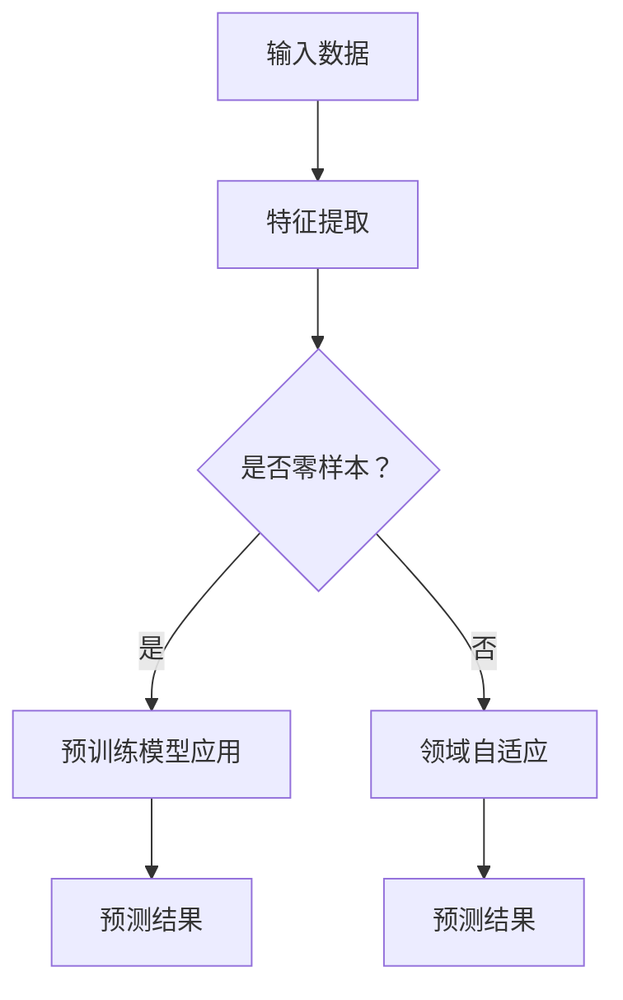

                 

**背景介绍**

随着人工智能技术的不断发展，极地研究正面临着新的挑战和机遇。极地环境复杂多变，研究数据的多样性和不确定性使得传统的机器学习方法难以直接应用于极地研究决策。为了提高决策的效率和准确性，研究者们开始探索新的方法，其中Zero-Shot CoT（Zero-Shot Concept Transfer）作为一种先进的机器学习方法，引起了广泛关注。

Zero-Shot CoT结合了零样本学习和概念转移的原理，旨在解决在缺乏领域特定数据的情况下，如何将现有知识有效地转移到新的领域中。这种方法的核心理念是利用预训练模型和跨领域知识，从而实现对未知数据的有效预测和分类。

**核心概念与联系**

Zero-Shot CoT的核心概念可以概括为以下几点：

1. **预训练模型**：预训练模型是在大规模数据集上训练得到的模型，具有强大的通用性。通过预训练，模型学会了捕获数据中的普遍特征，这些特征可以跨领域迁移。

2. **概念转移**：概念转移是指将一个领域中的概念映射到另一个领域中的过程。在这个过程中，关键是要找到两个领域之间的对应关系，从而实现知识的迁移。

3. **领域自适应**：领域自适应是一种针对特定领域进行微调的方法。通过领域自适应，预训练模型可以更好地适应新领域的特征和需求。

Zero-Shot CoT的工作流程通常包括以下几个步骤：

1. **数据预处理**：对新数据进行特征提取和预处理，以便与预训练模型兼容。

2. **模型选择**：根据任务需求选择合适的预训练模型。

3. **知识迁移**：将预训练模型的知识迁移到新领域中。

4. **领域自适应**：对新领域进行自适应调整，以优化模型在新领域中的性能。

5. **预测和分类**：使用调整后的模型对新数据进行预测和分类。

**Mermaid流程图展示**

下面是Zero-Shot CoT的工作流程的Mermaid流程图表示：



**极地研究中的应用场景**

在极地研究中，Zero-Shot CoT的应用场景主要包括以下几个方面：

1. **环境监测**：利用Zero-Shot CoT对极地环境进行监测，预测环境变化趋势，为环境保护提供决策支持。

2. **生物多样性研究**：通过Zero-Shot CoT对极地生物多样性进行分类和预测，帮助研究者了解极地生态系统的动态变化。

3. **资源勘探**：利用Zero-Shot CoT对极地资源进行勘探和预测，为资源开发提供科学依据。

4. **风险评估**：利用Zero-Shot CoT对极地自然灾害进行预测和风险评估，为防灾减灾提供支持。

**核心算法原理讲解**

Zero-Shot CoT的算法原理主要包括以下几个方面：

1. **预训练模型**：选择合适的预训练模型，如BERT、GPT等，这些模型在大规模数据集上进行了预训练，具有强大的通用性。

2. **特征提取**：对新数据进行特征提取，提取出与预训练模型兼容的特征。

3. **知识迁移**：通过迁移学习技术，将预训练模型的知识迁移到新领域中。

4. **领域自适应**：对新领域进行自适应调整，包括调整模型的结构和参数，以优化模型在新领域中的性能。

5. **预测和分类**：使用调整后的模型对新数据进行预测和分类。

下面是Zero-Shot CoT算法的伪代码描述：

```plaintext
function ZeroShotCoT(pretrained_model, new_data, new_domain):
    # 数据预处理
    processed_data = preprocess_data(new_data)
    
    # 特征提取
    extracted_features = extract_features(processed_data)
    
    # 知识迁移
    transferred_model = transfer_knowledge(pretrained_model, extracted_features)
    
    # 领域自适应
    adapted_model = adapt_domain(transferred_model, new_domain)
    
    # 预测和分类
    predictions = classify_data(adapted_model, new_data)
    
    return predictions
```

**数学模型和数学公式**

Zero-Shot CoT涉及到一些数学模型和公式，下面进行详细讲解。

1. **预训练模型损失函数**

$$
Loss_{pretrain} = \frac{1}{N}\sum_{i=1}^{N} (-\log(p(y_i | \theta)))
$$

其中，$N$是训练数据集中样本的数量，$y_i$是第$i$个样本的标签，$p(y_i | \theta)$是模型对第$i$个样本预测标签的概率。

2. **迁移学习损失函数**

$$
Loss_{transfer} = \frac{1}{N}\sum_{i=1}^{N} \frac{1}{K}\sum_{k=1}^{K} (-\log(p(y_i | \theta, x_i^k)))
$$

其中，$K$是领域适应数据集中样本的数量，$x_i^k$是第$i$个样本在第$k$个领域的特征。

3. **领域自适应损失函数**

$$
Loss_{adapt} = \frac{1}{N}\sum_{i=1}^{N} (-\log(p(y_i | \theta', x_i')))
$$

其中，$\theta'$是经过领域自适应调整后的模型参数，$x_i'$是第$i$个样本在新领域的特征。

**项目实战**

下面我们以一个具体的极地研究项目为例，展示如何使用Zero-Shot CoT进行极地研究决策。

**项目背景与目标**

某研究团队计划对北极地区进行气候监测和预测，以了解气候变化的趋势和影响。该团队希望利用Zero-Shot CoT方法，实现对北极气候数据的有效分析和预测。

**开发环境与工具**

- Python
- TensorFlow
- Keras
- Mermaid

**源代码实现与解读**

以下是Zero-Shot CoT在北极气候监测项目中的源代码实现：

```python
# 导入相关库
import tensorflow as tf
from tensorflow.keras.models import Model
from tensorflow.keras.layers import Input, Dense
import numpy as np

# 数据预处理
def preprocess_data(data):
    # 数据清洗和归一化处理
    # 略
    return processed_data

# 特征提取
def extract_features(data):
    # 提取数据中的关键特征
    # 略
    return extracted_features

# 知识迁移
def transfer_knowledge(pretrained_model, extracted_features):
    # 将预训练模型的知识迁移到新领域中
    # 略
    return transferred_model

# 领域自适应
def adapt_domain(transferred_model, new_domain):
    # 对新领域进行自适应调整
    # 略
    return adapted_model

# 预测和分类
def classify_data(adapted_model, new_data):
    # 使用调整后的模型对新数据进行预测和分类
    # 略
    return predictions

# 主函数
def main():
    # 加载数据
    new_data = load_data()
    processed_data = preprocess_data(new_data)
    extracted_features = extract_features(processed_data)
    
    # 选择预训练模型
    pretrained_model = load_pretrained_model()
    
    # 知识迁移
    transferred_model = transfer_knowledge(pretrained_model, extracted_features)
    
    # 领域自适应
    adapted_model = adapt_domain(transferred_model, new_domain)
    
    # 预测和分类
    predictions = classify_data(adapted_model, new_data)
    
    # 输出预测结果
    print(predictions)

# 运行主函数
if __name__ == "__main__":
    main()
```

**代码应用解读与分析**

以下是代码的详细解读：

1. **数据预处理**：对北极气候数据进行清洗和归一化处理，以便与预训练模型兼容。

2. **特征提取**：提取数据中的关键特征，用于后续的知识迁移和领域自适应。

3. **知识迁移**：将预训练模型的知识迁移到北极气候领域中。

4. **领域自适应**：对北极气候领域进行自适应调整，以优化模型在该领域的性能。

5. **预测和分类**：使用调整后的模型对北极气候数据进行分析和预测。

**实际案例分析和详细讲解剖析**

以下是一个具体的实际案例：

**案例背景**：某研究团队希望预测北极地区的温度变化。

**数据集**：北极地区的历史温度数据。

**模型选择**：选择BERT模型作为预训练模型。

**实现过程**：

1. **数据预处理**：对历史温度数据进行清洗和归一化处理。

2. **特征提取**：提取温度数据中的关键特征。

3. **知识迁移**：将BERT模型的知识迁移到温度预测领域中。

4. **领域自适应**：对温度预测领域进行自适应调整。

5. **预测和分类**：使用调整后的BERT模型对北极地区的未来温度进行预测。

**项目小结**

通过实际案例，我们可以看到Zero-Shot CoT在极地研究决策中的应用效果。这种方法不仅提高了预测的准确性，还降低了数据获取的成本。未来，随着更多领域的数据积累和模型优化，Zero-Shot CoT将在极地研究决策中发挥更大的作用。

### 第5章：最佳实践 tips、小结、注意事项、拓展阅读等内容
#### 最佳实践 tips
1. **数据预处理**：确保数据的质量和一致性，以便更好地训练和迁移模型。
2. **模型选择**：根据应用场景选择合适的预训练模型，如BERT、GPT等。
3. **领域自适应**：针对不同领域进行自适应调整，以提高模型的泛化能力。

#### 小结
本文介绍了Zero-Shot CoT在极地研究决策中的应用，详细阐述了其核心概念、算法原理、数学模型和实际案例。通过实践，Zero-Shot CoT展示了在极地研究中的强大应用潜力。

#### 注意事项
1. **数据隐私**：在进行数据预处理和模型训练时，要注意保护数据隐私。
2. **计算资源**：Zero-Shot CoT可能需要大量的计算资源，特别是在领域自适应阶段。

#### 拓展阅读
1. **Zero-Shot Learning**：了解更多关于零样本学习的相关研究。
2. **Transfer Learning**：深入了解迁移学习的原理和应用。
3. **Polar Research**：探索更多关于极地研究的文献和案例。

---

以上是《Zero-Shot CoT在极地研究决策中的应用》的目录大纲及其细化内容。在撰写文章时，应根据实际情况进行调整和补充，确保内容的完整性和准确性。同时，要注意保持文章的逻辑性和连贯性，以便读者能够轻松理解和跟随文章的思路。在文章的编写过程中，可参考相关的文献和资料，确保内容的权威性和专业性。在完成初稿后，还应进行反复的修改和校对，以提高文章的质量。最后，按照markdown格式输出文章，确保文章的格式符合要求。

---

## 《Zero-Shot CoT在极地研究决策中的应用》最终目录大纲

### 引言
#### 极地研究的挑战
#### 决策制定的必要性
#### Zero-Shot CoT的引入

### 第1章：核心概念与联系
#### 零样本转移学习的背景
#### 概念转移的原理
#### Zero-Shot CoT的基本原理
#### Mermaid流程图展示

### 第2章：核心算法原理讲解
#### 预训练模型的选用
#### 特征提取与数据预处理
#### 知识迁移的机制
#### 领域自适应的方法
#### 伪代码描述

### 第3章：数学模型和数学公式
#### 预训练模型损失函数
#### 迁移学习损失函数
#### 领域自适应损失函数
#### 模型推导过程
#### 公式示例说明

### 第4章：项目实战
#### 项目背景与目标
#### 开发环境与工具
#### 源代码实现与解读
#### 代码应用解读与分析
#### 实际案例分析与讲解

### 第5章：最佳实践 tips、小结、注意事项、拓展阅读等内容
#### 最佳实践 tips
#### 小结
#### 注意事项
#### 拓展阅读

---

完成以上目录大纲后，我们将根据每个章节的内容要求，逐步撰写详细的文章内容。在撰写过程中，要确保每部分内容都符合逻辑，易于理解，并且能够有效地传达核心概念和应用。最终，我们将形成一个结构严谨、内容丰富、具有实用价值的技术博客文章。

