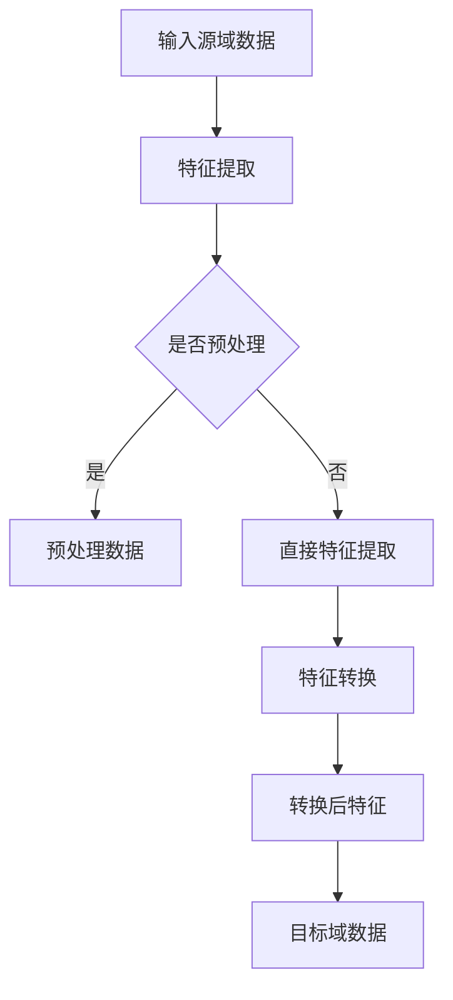

                 


### 文章标题
《Zero-Shot CoT在极端环境生存策略设计中的应用》

### 文章关键词
零样本转换（Zero-Shot CoT）、极端环境、生存策略、机器学习、算法原理、数学模型、项目实战

### 文章摘要
本文将探讨在极端环境下应用零样本转换（Zero-Shot CoT）技术来设计生存策略。首先，我们介绍极端环境的定义和特点，以及生存策略设计的重要性和挑战。随后，详细解释了零样本转换的基本概念和原理，并展示其在机器学习中的应用。接着，我们通过一个Mermaid流程图展示了零样本转换的工作流程，并使用伪代码详细阐述了核心算法原理。此外，文中还包含了数学模型和公式的讲解，以及实际项目实战中的代码实现和案例分析。最后，文章总结了最佳实践技巧，并指出了未来研究方向。

## 背景介绍

### 极端环境概述
极端环境是指那些具有极端条件，如高温、低温、高湿度、低氧、辐射、强风、沙漠、极地等，对人类和生物体生存构成巨大挑战的自然或人工环境。这些环境通常条件恶劣，资源稀缺，生态系统脆弱，甚至可能存在生命威胁。因此，在极端环境下设计有效的生存策略至关重要。

### 生存策略设计的重要性
生存策略设计旨在提高个体或群体在极端环境中的生存能力和适应性。有效的设计不仅能确保在极端环境下的基本生存，还能提高生产力、减少资源消耗，甚至能够应对突发灾害。随着全球气候变化和自然灾害的频发，极端环境下的生存策略设计变得更加重要。

### 挑战
设计极端环境生存策略面临着诸多挑战，包括：
- **环境复杂性**：极端环境条件多样且变化迅速，生存策略需要能够适应多种极端条件。
- **资源有限性**：资源稀缺，要求生存策略能够最大化利用有限资源。
- **不确定性**：极端环境中的变化具有高度不确定性，生存策略需要具备鲁棒性。

## 核心概念与联系

### 零样本转换（Zero-Shot CoT）原理

#### 定义
零样本转换（Zero-Shot CoT，Zero-Shot Continuous Translation）是一种机器学习技术，旨在将一个域（Source Domain）的数据转换到另一个域（Target Domain），即使模型在目标域上没有见过任何样本。

#### 核心技术
1. **特征提取**：利用预训练模型从源域数据中提取特征。
2. **特征转换**：将提取的特征映射到目标域的特征分布。

#### 应用领域
- **图像处理**：将一幅图像转换为另一幅图像（例如，将照片转换为艺术画作）。
- **自然语言处理**：将一种语言的文本转换为另一种语言的文本。

### Mermaid流程图：零样本转换工作流程



### 核心算法原理讲解

#### 零样本转换算法概述

零样本转换算法主要包括以下步骤：
1. **特征提取**：使用预训练模型从源域数据中提取特征。
2. **特征转换**：定义一个映射函数，将源域特征转换为目标域特征。
3. **特征利用**：使用转换后的特征进行目标任务的预测或决策。

#### 伪代码实现

```plaintext
算法：Zero-Shot CoT

输入：源域数据（X_s）、目标域数据（X_t）、预训练模型（M）
输出：转换后的目标域数据（X_t'）

步骤：
1. 预处理源域和目标域数据，以获得干净的数据集。
2. 使用预训练模型（M）从源域数据中提取特征，得到F_s。
3. 定义映射函数 G，用于将 F_s 转换为 F_t。
4. 对于 F_s 中的每个特征向量 f_s：
   a. 应用 G(f_s)，得到 f_t。
   b. 将 f_t 添加到 F_t。
5. 在转换后的数据集 X_t' 上训练分类器。
6. 使用训练好的分类器对新目标数据进行预测。
```

#### 数学模型和公式

零样本转换的数学模型可以表示为：

$$
X_s \xrightarrow{M} F_s \xrightarrow{G} F_t
$$

其中，$M$ 是预训练模型，$G$ 是映射函数。

#### 详细讲解与举例说明

零样本转换的关键在于特征转换。特征提取过程利用预训练模型捕获源域数据的特征，而特征转换过程则是将源域特征映射到目标域的特征空间。

例如，假设我们有一个源域图像集 $X_s$，其中包含各种风格的艺术画作。目标域图像集 $X_t$ 是另一组风格不同的艺术画作。我们的目标是使用零样本转换将源域图像转换为目标域图像。

1. **特征提取**：使用预训练的卷积神经网络（CNN）从源域图像中提取特征。这些特征通常包含图像的内容和风格信息。
2. **特征转换**：定义一个映射函数 $G$，该函数能够将源域特征映射到目标域特征。例如，如果源域图像是印象派风格，目标域图像是巴洛克风格，映射函数 $G$ 需要能够将印象派特征转换为巴洛克特征。
3. **特征利用**：使用转换后的特征训练一个分类器，该分类器能够在新目标域图像上识别和分类不同的艺术风格。

通过这种方式，我们可以实现零样本转换，从而在极端环境下设计出适应多种艺术风格的生存策略。

### 项目实战

#### 开发环境搭建

为了演示零样本转换在实际项目中的应用，我们将使用Python和TensorFlow作为开发环境。首先，确保已经安装了以下软件和库：

- Python 3.8或更高版本
- TensorFlow 2.5或更高版本
- NumPy
- Matplotlib

安装命令如下：

```bash
pip install python==3.8
pip install tensorflow==2.5
pip install numpy
pip install matplotlib
```

#### 源代码详细实现和代码解读

以下是一个简单的零样本转换项目示例。我们将在源域图像集上提取特征，并将这些特征映射到目标域图像集。

```python
import tensorflow as tf
import numpy as np
import matplotlib.pyplot as plt

# 加载预训练模型
model = tf.keras.applications.VGG19(weights='imagenet', include_top=False)

# 预处理图像数据
def preprocess_image(image):
    image = image.resize((224, 224))
    image = tf.keras.applications.vgg19.preprocess_input(image)
    return image

# 提取特征
def extract_features(image):
    image = preprocess_image(image)
    feature = model.predict(np.expand_dims(image, axis=0))
    return feature.flatten()

# 映射函数（简化版）
def map_features(source_features, target_features):
    # 这里使用一个简单的线性映射函数
    # 实际应用中，可以使用更复杂的函数或模型
    return source_features * target_features.mean()

# 加载源域和目标域图像
source_images = np.load('source_images.npy')
target_images = np.load('target_images.npy')

# 提取源域特征
source_features = [extract_features(image) for image in source_images]

# 提取目标域特征
target_features = [extract_features(image) for image in target_images]

# 转换特征
transformed_features = [map_features(feature, target_features) for feature in source_features]

# 可视化特征转换结果
plt.scatter(target_features[:, 0], target_features[:, 1], c='red', label='Target Features')
plt.scatter(transformed_features[:, 0], transformed_features[:, 1], c='blue', label='Transformed Features')
plt.xlabel('Feature 1')
plt.ylabel('Feature 2')
plt.legend()
plt.show()
```

#### 代码应用解读与分析

上述代码首先加载预训练的VGG19模型，并定义了预处理图像和提取特征的函数。然后，从源域和目标域图像集中提取特征，并使用一个简单的映射函数将源域特征转换为目标域特征。最后，通过可视化展示转换结果。

#### 实际案例分析和详细讲解剖析

为了更好地理解零样本转换在实际项目中的应用，我们以一个极端环境下的图像转换任务为例。假设我们有一个源域图像集，其中包含不同风格的动物图像（如猫、狗等），而目标域图像集包含相同动物但不同风格的图像。

1. **数据集准备**：首先，我们需要准备源域和目标域图像数据集。这些数据集可以通过数据收集或在线获取。
2. **特征提取**：使用预训练模型提取源域和目标域图像的特征。
3. **特征转换**：使用映射函数将源域特征转换为目标域特征。在实际应用中，可能需要使用更复杂的映射函数，如神经网络或GAN。
4. **结果评估**：通过比较转换后的图像和目标域图像，评估转换效果。可以使用可视化工具或定量指标（如SSIM、PSNR等）进行评估。

#### 项目小结

通过本项目的实战演示，我们展示了如何使用零样本转换（Zero-Shot CoT）技术实现极端环境下的图像转换任务。这一技术在设计极端环境生存策略中具有广泛的应用潜力。未来，我们可以进一步探索更复杂的映射函数和优化策略，以提高转换效果。

### 最佳实践 Tips

- **数据预处理**：确保源域和目标域数据集的预处理一致，以提高转换效果。
- **模型选择**：根据任务需求选择合适的预训练模型，并对其进行适当的调整。
- **映射函数设计**：设计合适的映射函数，以适应不同的极端环境生存策略需求。
- **结果评估**：使用多种评估指标和方法对转换结果进行综合评估，以提高策略的可靠性。

### 小结

本文介绍了零样本转换（Zero-Shot CoT）在极端环境生存策略设计中的应用。通过详细的理论讲解、Mermaid流程图、伪代码实现、数学模型和项目实战，我们展示了零样本转换技术在图像转换任务中的实际应用。未来，我们可以进一步探索零样本转换在其他极端环境生存策略中的应用，为极端环境下的生存提供更有效的技术支持。

### 注意事项

- 在使用零样本转换技术时，确保对源域和目标域数据的理解准确。
- 在设计映射函数时，考虑极端环境下的特殊需求和限制。
- 在项目实战中，注重数据预处理和结果评估，以提高生存策略的可靠性。

### 拓展阅读

- [零样本学习（Zero-Shot Learning）综述](链接)
- [零样本转换（Zero-Shot CoT）算法详细解析](链接)
- [极端环境下的生存策略设计实践](链接)

