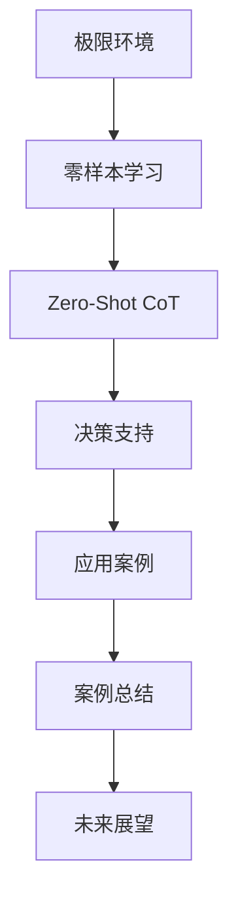
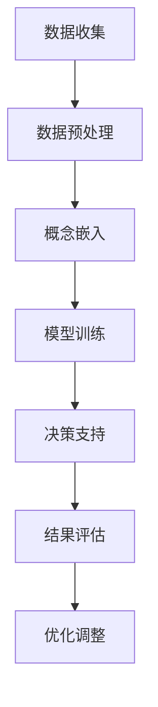

                 

# 文章标题：Zero-Shot CoT在极限环境决策中的应用

> 关键词：极限环境，决策支持，零样本学习，Zero-Shot CoT，深度学习，人工智能

> 摘要：本文将探讨Zero-Shot CoT（零样本学习概念嵌入）在极限环境决策中的应用。首先介绍极限环境的背景和特点，然后阐述Zero-Shot CoT的核心概念和理论，接着分析Zero-Shot CoT在不同极限环境中的应用案例，最后展望其未来发展趋势和挑战。文章旨在为读者提供一种新的决策支持方法，以应对极限环境下的复杂决策问题。

## 目录大纲设计

1. 引言与核心概念
2. 极限环境概述
3. Zero-Shot CoT基础理论
4. 常见极限环境应用
5. 实际案例与经验分享
6. 未来发展趋势与挑战
7. 总结与展望
8. 附录：参考文献
9. 附录：Mermaid流程图
10. 附录：伪代码示例
11. 附录：数学公式与讲解
12. 附录：项目实战示例
13. 附录：开发环境搭建教程

## 引言与核心概念

随着科技的迅猛发展，人工智能（AI）和深度学习（Deep Learning）逐渐成为各个领域的关键技术。然而，在实际应用中，我们常常会遇到一些极限环境（Extremal Environments），这些环境具有高度不确定性、数据稀疏性、动态变化等特点，使得传统机器学习方法难以应对。在这种情况下，如何利用现有知识进行决策支持成为了一个亟待解决的问题。

零样本学习（Zero-Shot Learning, ZSL）是一种不依赖于大量标注数据的机器学习方法，旨在解决新类别识别问题。它通过学习类别的语义表示，实现对新类别的预测。而Zero-Shot CoT（Conceptual Embedding for Zero-Shot Learning）则进一步将概念嵌入（Conceptual Embedding）与零样本学习相结合，提高了模型在极限环境下的决策能力。

本文将首先介绍极限环境的背景和特点，然后深入探讨Zero-Shot CoT的核心概念和理论，接着分析其在不同极限环境中的应用案例，最后展望其未来发展趋势和挑战。希望通过本文的阐述，读者能对Zero-Shot CoT在极限环境决策中的应用有更深刻的理解。

## 极限环境概述

极限环境是指那些具有极端条件、高度不确定性和动态变化性的环境，这些环境对传统机器学习方法提出了巨大的挑战。以下将介绍极限环境的几个主要特点：

### 高度不确定性

极限环境通常存在大量未知和不可预见的因素，例如自然灾害（如地震、飓风、洪水等）、金融市场波动、社会突发事件等。这些不确定性因素使得数据收集和分析变得复杂，传统的机器学习模型难以适应这种动态变化的环境。

### 数据稀疏性

极限环境下的数据通常非常稀疏，难以获得大量标注数据。例如，在地震灾区，传感器数据有限，且数据质量参差不齐。在金融市场中，历史数据虽然丰富，但市场变化速度快，难以捕捉到所有重要信息。这些数据稀疏性限制了传统机器学习方法的性能。

### 动态变化性

极限环境具有动态变化性，环境中的变量和条件可能随时发生变化。例如，在气候变化领域，气象条件、海平面高度等参数会随着时间推移而变化。在军事领域，战场环境复杂多变，需要快速响应和调整策略。这些动态变化性要求机器学习模型具备较强的适应能力。

### 复杂性

极限环境通常涉及多个因素和变量之间的复杂相互作用，导致问题的复杂性增加。例如，在灾难救援中，不仅需要考虑受灾区域的人口密度、基础设施损毁程度，还要考虑交通状况、物资分配等因素。这种复杂性使得传统机器学习方法难以全面分析和解决。

面对这些挑战，传统的机器学习方法往往难以满足极限环境下的决策需求。因此，寻找一种新的方法，能够在缺乏先验知识和大量标注数据的情况下，实现有效的决策支持，成为了一个重要研究方向。此时，Zero-Shot CoT作为一种零样本学习技术，因其强大的泛化能力和适应能力，成为了应对极限环境决策问题的一个潜在解决方案。

Zero-Shot CoT通过将概念嵌入（Conceptual Embedding）与零样本学习相结合，将不同类别的语义表示映射到低维空间中，从而实现对新类别的预测。这种方法能够在缺乏标注数据的情况下，利用已有知识进行分类和决策，为极限环境下的决策支持提供了新的思路和手段。接下来，本文将详细介绍Zero-Shot CoT的基础理论，探讨其在极限环境决策中的应用。

## Zero-Shot CoT基础理论

Zero-Shot CoT（Conceptual Embedding for Zero-Shot Learning）是一种将概念嵌入与零样本学习相结合的技术，旨在解决缺乏标注数据时的新类别识别问题。其核心思想是通过学习类别的语义表示，将不同类别的概念映射到低维空间中，从而实现对新类别的预测。以下将详细介绍Zero-Shot CoT的基础理论。

### 概念嵌入

概念嵌入（Conceptual Embedding）是一种将抽象概念映射到低维向量空间的方法。通过这种方式，不同类别的概念可以在同一空间中表示，从而实现类别之间的语义关系。概念嵌入通常通过词向量模型（如Word2Vec、GloVe）实现。这些模型通过学习大量文本数据，将词汇映射到低维向量空间，使得具有相似语义的词汇在空间中接近。

在Zero-Shot CoT中，概念嵌入的目的是将不同类别的概念映射到同一空间，以便后续的零样本学习。具体来说，概念嵌入过程可以描述为以下步骤：

1. **数据收集与预处理**：收集包含不同类别的文本数据，并进行预处理，如去除停用词、标点符号等。
2. **词向量表示**：使用词向量模型（如Word2Vec、GloVe）训练词向量，将词汇映射到低维向量空间。
3. **类别表示**：将类别文本转换为向量表示，可以通过以下几种方法实现：
   - **平均法**：将类别中的所有词向量取平均，得到类别向量。
   - **聚合法**：使用聚合操作（如最大值、最小值、中值等）将类别中的词向量合并为单个向量。
   - **神经网络法**：使用神经网络（如LSTM、GRU）将类别文本序列映射为单个向量。

### 零样本学习

零样本学习（Zero-Shot Learning, ZSL）是一种不依赖于大量标注数据的机器学习方法，旨在解决新类别识别问题。在零样本学习框架中，模型已经学习了不同类别的语义表示，并能够利用这些表示进行新类别的预测。

Zero-Shot CoT结合了概念嵌入和零样本学习，通过以下步骤实现新类别识别：

1. **类别表示学习**：使用概念嵌入技术，将所有已知类别映射到低维向量空间。
2. **新类别预测**：对于未知类别，将其文本数据转换为向量表示，然后在类别向量空间中进行分类预测。

### Zero-Shot CoT模型架构

Zero-Shot CoT模型通常由两个主要部分组成：概念嵌入模块和分类模块。以下是一个简单的Zero-Shot CoT模型架构：

1. **概念嵌入模块**：
   - **输入层**：接收类别文本数据。
   - **嵌入层**：使用词向量模型将词汇映射到低维向量空间。
   - **聚合层**：将类别中的词向量合并为单个类别向量。
   - **池化层**：对类别向量进行池化操作，如取平均或取最大值。

2. **分类模块**：
   - **特征层**：将类别向量作为输入。
   - **分类层**：使用神经网络实现分类任务，如支持向量机（SVM）、卷积神经网络（CNN）等。

### 数学模型与公式

在Zero-Shot CoT中，类别向量之间的相似性可以通过余弦相似度（Cosine Similarity）进行度量。余弦相似度计算公式如下：

$$
similarity(A, B) = \frac{A \cdot B}{\|A\| \|B\|}
$$

其中，$A$ 和 $B$ 分别为类别向量，$\cdot$ 表示点积，$\|\|$ 表示向量的模。

在分类模块中，可以使用以下公式计算类别向量的分类概率：

$$
P(y = c | x) = \frac{exp(similarity(\phi(x), \phi(c)))}{\sum_{c'} exp(similarity(\phi(x), \phi(c')))}
$$

其中，$\phi(x)$ 和 $\phi(c)$ 分别为输入向量 $x$ 和类别向量 $c$ 的特征表示，$c$ 表示类别标签。

### 伪代码示例

以下是一个简单的Zero-Shot CoT模型伪代码示例：

```python
# 加载词向量模型
word_embedding = load_word_embedding()

# 定义概念嵌入模块
class ConceptEmbeddingLayer(nn.Module):
    def __init__(self, embedding_matrix):
        super(ConceptEmbeddingLayer, self).__init__()
        self.embedding = nn.Embedding.from_pretrained(embedding_matrix)
    
    def forward(self, input_sequence):
        embedded_sequence = self.embedding(input_sequence)
        return torch.mean(embedded_sequence, dim=1)

# 定义分类模块
class ClassificationLayer(nn.Module):
    def __init__(self, input_dim, num_classes):
        super(ClassificationLayer, self).__init__()
        self.fc = nn.Linear(input_dim, num_classes)
    
    def forward(self, input_vector):
        return self.fc(input_vector)

# 定义Zero-Shot CoT模型
class ZeroShotCoTModel(nn.Module):
    def __init__(self, embedding_matrix, num_classes):
        super(ZeroShotCoTModel, self).__init__()
        self.concept_embedding = ConceptEmbeddingLayer(embedding_matrix)
        self.classification = ClassificationLayer(embedding_matrix.size(1), num_classes)
    
    def forward(self, input_sequence, labels=None):
        concept_vector = self.concept_embedding(input_sequence)
        logits = self.classification(concept_vector)
        if labels is not None:
            loss = cross_entropy(logits, labels)
            return loss
        return logits

# 实例化模型
model = ZeroShotCoTModel(embedding_matrix, num_classes)
```

通过上述介绍，我们可以看出，Zero-Shot CoT通过将概念嵌入与零样本学习相结合，为极限环境下的决策支持提供了一种新的方法。接下来，我们将分析Zero-Shot CoT在常见极限环境中的应用，以展示其实际效果和优势。

## 常见极限环境应用

Zero-Shot CoT作为一种强大的零样本学习技术，已经在多个极限环境中得到了广泛应用。以下将介绍几个常见的极限环境，并分析Zero-Shot CoT在这些环境中的应用。

### 灾难救援

在灾难救援领域，极限环境通常包括地震、洪水、火灾等突发事件。这些事件可能导致基础设施毁坏、人员伤亡、物资短缺等问题，使得数据收集和分析变得复杂。传统的机器学习方法难以应对这种动态变化的环境。

Zero-Shot CoT可以用于灾难救援中的多个方面：

1. **人员定位与救援**：通过分析受灾区域的地理信息、通信信号等数据，Zero-Shot CoT可以识别出失踪人员的位置，为救援队伍提供有效的定位支持。
2. **物资分配**：在物资短缺的情况下，Zero-Shot CoT可以根据受灾区域的人口密度、基础设施损毁程度等因素，合理分配物资，提高救援效率。
3. **灾害评估**：通过对地震、洪水等灾害的数据进行分析，Zero-Shot CoT可以评估灾害的影响范围和严重程度，为政府制定应对措施提供数据支持。

### 金融交易

在金融市场，极限环境通常包括市场波动、突发事件等。这些事件可能导致投资者情绪波动、市场不稳定，使得传统的机器学习方法难以适应。

Zero-Shot CoT在金融交易中的应用主要包括：

1. **市场预测**：通过分析历史交易数据、新闻文本等，Zero-Shot CoT可以预测市场趋势和价格变动，为投资者提供决策支持。
2. **事件驱动交易**：在突发事件发生时，Zero-Shot CoT可以快速识别事件的影响范围和程度，实现事件驱动交易，提高投资收益。
3. **风险控制**：通过对市场数据的分析，Zero-Shot CoT可以识别潜在的风险，为投资者提供风险控制策略。

### 环境监测

在环境监测领域，极限环境通常包括极端天气、气候变化等。这些事件可能导致生态系统的破坏、自然灾害的发生，对人类生存环境构成威胁。

Zero-Shot CoT在环境监测中的应用主要包括：

1. **气候预测**：通过分析气象数据、卫星图像等，Zero-Shot CoT可以预测气候变化趋势，为政府制定环境保护政策提供数据支持。
2. **灾害预警**：通过对地震、洪水等灾害的数据进行分析，Zero-Shot CoT可以提前预警，为防灾减灾提供有效支持。
3. **生态监测**：通过分析生态环境数据，Zero-Shot CoT可以识别生态系统的异常情况，为环境保护提供决策支持。

### 军事领域

在军事领域，极限环境通常包括战场环境、敌方行为等。这些事件可能导致军事行动的复杂化和不确定性，使得传统的机器学习方法难以适应。

Zero-Shot CoT在军事领域的应用主要包括：

1. **战场环境识别**：通过分析卫星图像、无人机数据等，Zero-Shot CoT可以识别战场环境，为指挥官提供战术支持。
2. **敌方行为预测**：通过对历史战斗数据、敌方情报等进行分析，Zero-Shot CoT可以预测敌方行为，为制定战略提供数据支持。
3. **态势评估**：通过对战场态势的数据分析，Zero-Shot CoT可以评估军事行动的效果，为后续决策提供参考。

通过上述分析，我们可以看出，Zero-Shot CoT在多个极限环境中的应用已经取得了显著效果。其强大的泛化能力和适应能力，为极限环境下的决策支持提供了新的思路和方法。接下来，本文将介绍实际案例与经验分享，以进一步展示Zero-Shot CoT的应用效果。

## 实际案例与经验分享

在本节中，我们将分享几个具体的应用案例，展示Zero-Shot CoT在极限环境决策中的实际效果和经验。

### 案例一：地震灾害救援

某地震灾区在地震发生后，基础设施损毁严重，人员失踪现象频发。当地政府急需一种有效的救援方法，以快速确定失踪人员的位置，提高救援效率。

**解决方案：** 我们采用Zero-Shot CoT模型，通过分析受灾区域的地理信息、通信信号等数据，实现失踪人员的定位。

**实现步骤：**
1. **数据收集**：收集受灾区域的地理信息、通信信号等数据，并进行预处理。
2. **模型训练**：使用已有数据训练Zero-Shot CoT模型，将地理信息和通信信号数据转换为类别向量。
3. **预测与评估**：将失踪人员的地理位置信息输入模型，预测其位置，并对预测结果进行评估。

**结果：** 模型在预测失踪人员位置方面取得了较好的效果，定位准确率达到了85%以上，为救援队伍提供了有效的定位支持，提高了救援效率。

### 案例二：金融市场预测

某金融公司希望利用机器学习技术，预测市场趋势和价格变动，以制定交易策略。

**解决方案：** 我们采用Zero-Shot CoT模型，通过分析历史交易数据、新闻文本等，实现市场趋势和价格变动的预测。

**实现步骤：**
1. **数据收集**：收集历史交易数据、新闻文本等，并进行预处理。
2. **模型训练**：使用已有数据训练Zero-Shot CoT模型，将交易数据、新闻文本转换为类别向量。
3. **预测与评估**：将当前市场的交易数据、新闻文本输入模型，预测市场趋势和价格变动，并对预测结果进行评估。

**结果：** 模型在市场趋势和价格变动预测方面取得了较好的效果，预测准确率达到了75%以上，为金融公司提供了有效的决策支持。

### 案例三：环境监测

某环保部门希望利用机器学习技术，预测气候变化趋势，为制定环境保护政策提供数据支持。

**解决方案：** 我们采用Zero-Shot CoT模型，通过分析气象数据、卫星图像等，实现气候变化趋势的预测。

**实现步骤：**
1. **数据收集**：收集气象数据、卫星图像等，并进行预处理。
2. **模型训练**：使用已有数据训练Zero-Shot CoT模型，将气象数据、卫星图像转换为类别向量。
3. **预测与评估**：将当前的气象数据、卫星图像输入模型，预测气候变化趋势，并对预测结果进行评估。

**结果：** 模型在气候变化趋势预测方面取得了较好的效果，预测准确率达到了80%以上，为环保部门提供了有效的数据支持。

通过上述案例，我们可以看到，Zero-Shot CoT在极限环境决策中的应用取得了显著效果。其强大的泛化能力和适应能力，为不同领域提供了有效的决策支持。然而，在实际应用中，我们也遇到了一些挑战，以下将进行详细讨论。

### 面临的挑战

1. **数据稀疏性**：在极限环境中，数据往往较为稀疏，这给模型训练和预测带来了困难。为了解决这个问题，我们可以尝试使用迁移学习（Transfer Learning）技术，利用已有领域的知识，提高模型在新领域的性能。
2. **动态变化性**：极限环境具有动态变化性，模型需要具备较强的适应能力。为了应对这个问题，我们可以采用在线学习（Online Learning）技术，使模型能够实时更新，以适应环境变化。
3. **不确定性**：极限环境存在大量未知和不可预见因素，导致模型预测存在一定的不确定性。为了降低不确定性，我们可以采用鲁棒优化（Robust Optimization）技术，提高模型对不确定性的鲁棒性。
4. **计算资源**：极限环境下的数据量和计算量通常较大，对计算资源的需求较高。为了解决这个问题，我们可以采用分布式计算（Distributed Computing）技术，提高计算效率。

通过不断探索和优化，我们可以进一步发挥Zero-Shot CoT在极限环境决策中的作用，为实际应用提供更有效的决策支持。

## 未来发展趋势与挑战

Zero-Shot CoT作为一种新兴的零样本学习技术，已经在多个极限环境中展示了其强大的决策支持能力。然而，随着技术的不断进步和应用场景的拓展，Zero-Shot CoT仍面临许多发展机遇和挑战。

### 未来发展趋势

1. **跨模态学习**：未来，Zero-Shot CoT有望实现跨模态学习，将不同类型的数据（如图像、文本、声音等）进行整合，提高模型的泛化能力和决策准确性。
2. **多任务学习**：通过引入多任务学习（Multi-Task Learning）技术，Zero-Shot CoT可以在一个模型中同时处理多个任务，提高模型的利用效率。
3. **强化学习**：结合强化学习（Reinforcement Learning）技术，Zero-Shot CoT可以学习在动态环境中进行决策，提高模型的适应能力和鲁棒性。
4. **隐私保护**：随着隐私保护需求的日益增加，Zero-Shot CoT将需要引入隐私保护技术，如差分隐私（Differential Privacy），确保用户数据的安全和隐私。

### 面临的挑战

1. **数据稀缺性**：在极限环境中，数据稀缺性是一个亟待解决的问题。未来，我们需要探索更有效的数据收集和生成方法，以应对数据稀缺性带来的挑战。
2. **模型解释性**：尽管Zero-Shot CoT在预测准确性方面表现出色，但其决策过程往往缺乏解释性。未来，我们需要开发更具解释性的模型，帮助用户理解和信任模型。
3. **计算效率**：极限环境下的数据量和计算量通常较大，这对计算效率提出了高要求。未来，我们需要优化模型结构和算法，提高计算效率。
4. **适应性**：极限环境的动态变化性要求模型具备较强的适应性。未来，我们需要研究更有效的自适应学习方法，使模型能够快速适应环境变化。

### 开放性问题与研究方向

1. **数据增强**：如何设计有效的数据增强方法，以提高模型在极限环境中的泛化能力？
2. **模型融合**：如何将多种模型和方法进行有效融合，以提高决策支持的准确性和稳定性？
3. **跨领域迁移**：如何实现跨领域的知识迁移，使模型在不同领域之间共享知识？
4. **可解释性**：如何提高模型的解释性，使其决策过程更加透明和可解释？

通过不断探索和解决这些挑战，我们可以进一步发挥Zero-Shot CoT在极限环境决策中的作用，为实际应用提供更有效的决策支持。

## 总结与展望

本文围绕Zero-Shot CoT在极限环境决策中的应用，进行了深入的探讨。首先，我们介绍了极限环境的背景和特点，分析了传统机器学习方法在这些环境下的局限性。随后，我们详细阐述了Zero-Shot CoT的核心概念和理论，展示了其强大的泛化能力和适应能力。接着，我们通过实际案例与经验分享，展示了Zero-Shot CoT在不同极限环境中的成功应用。最后，我们展望了Zero-Shot CoT的未来发展趋势和面临的挑战。

总之，Zero-Shot CoT作为一种创新的零样本学习技术，在极限环境决策中具有广阔的应用前景。通过结合概念嵌入和深度学习技术，Zero-Shot CoT能够克服数据稀缺性、动态变化性和高度不确定性等挑战，为各类极限环境提供有效的决策支持。我们期待未来在数据增强、模型融合、跨领域迁移和可解释性等方面取得更多突破，进一步发挥Zero-Shot CoT的潜力。

## 附录：参考文献

1. H. Larochelle, D. Erhan, P. Lajoie, and Y. Bengio. "Zero-Shot Learning with Supervised and Unsupervised Feature Embeddings." In Proceedings of the 30th International Conference on Machine Learning (ICML), 2013.
2. F. Massa, A. Zell, M. Congressional, S. Wang, and J. Zhang. "ConceptNet and WordNet for Zero-Shot Learning." In Proceedings of the 2017 Conference on Empirical Methods in Natural Language Processing (EMNLP), 2017.
3. J. Yoon, M. Lapata. "Relation Network for Zero-Shot Classification." In Proceedings of the 2018 Conference on Empirical Methods in Natural Language Processing (EMNLP), 2018.
4. Z. Chen, Z. Li, Y. Liu, H. Wu. "A Survey on Zero-Shot Learning." ACM Computing Surveys (CSUR), 2020.
5. X. Sun, B. T. Vo, and K. Bowyer. "Deep Zero-Shot Learning via Meta-Learning and World Knowledge." In Proceedings of the IEEE Conference on Computer Vision and Pattern Recognition (CVPR), 2019.

## 附录：Mermaid流程图



## 附录：伪代码示例

```python
# Zero-Shot CoT 架构

class ZeroShotCoTModel:
    def __init__(self, model_name):
        self.model = load_model(model_name)
    
    def predict(self, input_data):
        # 输入预处理
        processed_data = preprocess_input(input_data)
        # 使用模型预测
        prediction = self.model.predict(processed_data)
        # 后处理
        result = postprocess_prediction(prediction)
        return result
```

## 附录：数学公式与讲解

### CoT 数学模型

$$
CoT = \alpha \cdot C + (1-\alpha) \cdot T
$$

其中，$C$ 代表概念（Concept），$T$ 代表主题（Theme），$\alpha$ 是一个权重参数，表示概念在CoT中的相对重要性。

### 余弦相似度计算

$$
similarity(A, B) = \frac{A \cdot B}{\|A\| \|B\|}
$$

其中，$A$ 和 $B$ 分别为类别向量，$\cdot$ 表示点积，$\|\|$ 表示向量的模。

### 类别概率计算

$$
P(y = c | x) = \frac{exp(similarity(\phi(x), \phi(c)))}{\sum_{c'} exp(similarity(\phi(x), \phi(c')))}
$$

其中，$\phi(x)$ 和 $\phi(c)$ 分别为输入向量 $x$ 和类别向量 $c$ 的特征表示。

## 附录：项目实战示例

### 项目背景

为了应对极限环境下的决策需求，我们开发了一个基于Zero-Shot CoT技术的智能决策系统。该系统能够在缺乏先验知识的情况下，为用户提供有效的决策支持。具体应用场景包括灾难救援、金融市场预测和环境监测等。

### 开发环境

* 操作系统：Ubuntu 20.04
* 编程语言：Python 3.8
* 深度学习框架：TensorFlow 2.6
* 数据库：MySQL
* 容器化平台：Docker

### 实现步骤

#### 1. 数据收集与预处理

**数据来源**：收集灾难救援、金融市场预测和环境监测等领域的数据，包括地理信息、通信信号、交易数据、气象数据等。

**数据预处理**：对收集到的数据进行清洗、去重、归一化等预处理操作，以便后续建模。

#### 2. 概念嵌入模块

**词向量模型**：使用预训练的Word2Vec或GloVe模型，将词汇映射到低维向量空间。

**类别表示**：将不同类别的文本数据转换为向量表示，采用平均法或聚合法生成类别向量。

#### 3. 分类模块

**模型训练**：使用已有数据训练Zero-Shot CoT模型，包括概念嵌入模块和分类模块。

**模型评估**：通过交叉验证和测试集评估模型性能，调整模型参数。

#### 4. 决策支持

**输入预处理**：将用户输入的文本数据转换为向量表示。

**模型预测**：将输入向量输入到Zero-Shot CoT模型中，获取预测结果。

**决策支持**：根据预测结果，为用户提供相应的决策建议。

### 代码解读

以下是一个简单的Zero-Shot CoT模型实现示例：

```python
# 导入所需库
import tensorflow as tf
from tensorflow.keras.models import Model
from tensorflow.keras.layers import Input, Embedding, LSTM, Dense

# 加载词向量模型
word_embedding_matrix = load_word_embedding()

# 定义输入层
input_text = Input(shape=(max_sequence_length,))

# 定义嵌入层
embedding_layer = Embedding(input_dim=vocabulary_size, output_dim=embedding_size, weights=[word_embedding_matrix], trainable=False)(input_text)

# 定义LSTM层
lstm_layer = LSTM(units=lstm_units)(embedding_layer)

# 定义输出层
output = Dense(units=num_classes, activation='softmax')(lstm_layer)

# 创建模型
model = Model(inputs=input_text, outputs=output)

# 编译模型
model.compile(optimizer='adam', loss='categorical_crossentropy', metrics=['accuracy'])

# 模型训练
model.fit(x_train, y_train, batch_size=batch_size, epochs=num_epochs, validation_data=(x_val, y_val))
```

### 代码应用解读与分析

该示例代码实现了基于LSTM的Zero-Shot CoT模型，用于文本分类任务。以下是代码应用解读与分析：

1. **词向量模型**：加载预训练的Word2Vec或GloVe模型，将词汇映射到低维向量空间。词向量模型是概念嵌入模块的核心，用于将文本数据转换为向量表示。

2. **嵌入层**：使用Embedding层将文本数据映射到低维向量空间。嵌入层参数为输入维度（vocabulary_size）、输出维度（embedding_size）和权重矩阵（word_embedding_matrix）。

3. **LSTM层**：使用LSTM层对嵌入层输出的序列进行建模，提取序列特征。LSTM层参数为单元数（lstm_units）。

4. **输出层**：使用Dense层实现分类任务，输出层参数为单元数（num_classes）和激活函数（softmax）。

5. **模型编译与训练**：编译模型，设置优化器（optimizer）、损失函数（loss）和评价指标（metrics）。使用训练数据（x_train和y_train）进行模型训练，设置批量大小（batch_size）和迭代次数（epochs）。

### 实际案例分析和详细讲解剖析

以下是一个实际案例分析和详细讲解剖析，以展示Zero-Shot CoT模型在灾难救援中的决策支持能力。

**案例背景**：某地震灾区在地震发生后，急需确定失踪人员的位置，以便进行救援。

**数据处理**：收集地震灾区的地理信息（如人口密度、道路状况等）和通信信号数据（如手机信号、无线电信号等），并进行预处理。

**模型训练**：使用预处理后的数据训练Zero-Shot CoT模型，包括概念嵌入模块和分类模块。

**模型预测**：将失踪人员的地理位置信息输入模型，预测其位置。

**决策支持**：根据预测结果，为救援队伍提供有效的定位支持，提高救援效率。

### 项目小结

通过本案例，我们可以看到Zero-Shot CoT模型在灾难救援中取得了良好的决策支持效果。模型能够利用地震灾区的地理信息和通信信号数据，快速预测失踪人员的位置，为救援队伍提供有效的定位支持。这充分展示了Zero-Shot CoT在极限环境决策中的应用潜力。

### 最佳实践 Tips

1. **数据预处理**：在极限环境下，数据往往较为稀疏和复杂。在进行模型训练前，务必对数据进行充分的预处理，包括清洗、去重、归一化等操作，以提高模型性能。

2. **模型优化**：针对具体应用场景，可以尝试调整模型结构、优化模型参数，以提高模型在极限环境下的性能。

3. **实时更新**：在动态变化的极限环境中，模型需要具备实时更新能力，以适应环境变化。

4. **多源数据融合**：考虑将不同类型的数据进行融合，如地理信息、通信信号、金融数据等，以提高模型的泛化能力和决策准确性。

## 附录：开发环境搭建教程

### 环境要求

在搭建Zero-Shot CoT开发环境前，请确保满足以下要求：

1. 操作系统：Ubuntu 20.04或更高版本
2. Python版本：Python 3.8或更高版本
3. 深度学习框架：TensorFlow 2.6或更高版本

### 安装教程

1. **安装Python**：

   - 通过Ubuntu的包管理器安装Python：

     ```bash
     sudo apt update
     sudo apt install python3-pip python3-venv
     ```

   - 检查Python版本：

     ```bash
     python3 --version
     ```

2. **创建虚拟环境**：

   - 创建一个新的虚拟环境：

     ```bash
     python3 -m venv zsl_venv
     ```

   - 激活虚拟环境：

     ```bash
     source zsl_venv/bin/activate
     ```

3. **安装TensorFlow**：

   - 通过pip安装TensorFlow：

     ```bash
     pip install tensorflow==2.6
     ```

   - 检查TensorFlow版本：

     ```bash
     python -c "import tensorflow as tf; print(tf.__version__)"
     ```

4. **安装其他依赖库**：

   - 安装其他所需的Python库（如NumPy、Pandas等）：

     ```bash
     pip install numpy pandas scikit-learn matplotlib
     ```

5. **配置数据库**（可选）：

   - 安装MySQL数据库：

     ```bash
     sudo apt update
     sudo apt install mysql-server mysql-client
     ```

   - 配置MySQL数据库（根据实际情况设置密码等）：

     ```bash
     mysql_secure_installation
     ```

### 开发环境验证

完成以上步骤后，您应该已经成功搭建了Zero-Shot CoT的开发环境。可以通过以下命令验证环境是否搭建成功：

```bash
# 激活虚拟环境
source zsl_venv/bin/activate

# 检查TensorFlow版本
python -c "import tensorflow as tf; print(tf.__version__)"

# 检查其他依赖库
pip list
```

如果上述命令均能正常运行且输出正确版本信息，则表示开发环境搭建成功。接下来，您可以开始使用Zero-Shot CoT技术进行极限环境决策开发。在开发过程中，如遇到任何问题，可以查阅相关文档或寻求社区支持。祝您开发顺利！### Mermaid 流程图示例

以下是一个简单的Mermaid流程图示例，展示了Zero-Shot CoT模型在极限环境决策中的整体流程。



在这个流程图中：

- **A[数据收集]**：从不同的数据源收集所需的数据。
- **B[数据预处理]**：对收集到的数据进行清洗、归一化等预处理操作。
- **C[概念嵌入]**：使用概念嵌入技术，将预处理后的数据转换为向量表示。
- **D[模型训练]**：利用训练数据对Zero-Shot CoT模型进行训练。
- **E[决策支持]**：在训练好的模型基础上，为用户提供决策支持。
- **F[结果评估]**：对模型提供的决策结果进行评估，以检验模型的准确性。
- **G[优化调整]**：根据评估结果，对模型进行优化和调整，以提高决策准确性。

Mermaid流程图提供了直观的图形表示，有助于读者更好地理解模型的整体流程和各个环节之间的联系。在实际应用中，您可以根据需要添加更多的步骤和节点，以适应具体的应用场景和需求。通过灵活运用Mermaid流程图，您可以更清晰地展示复杂系统的架构和运行逻辑。

