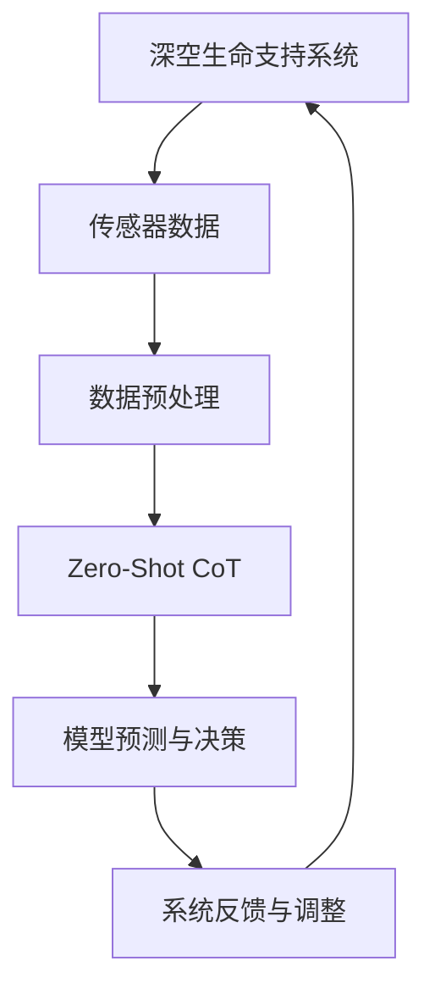

                 

### 引言

#### 背景

随着人类探索深空的步伐不断加快，深空生命支持系统的重要性日益凸显。深空生命支持系统旨在为宇航员提供稳定的生存环境，确保其在太空中的长期生存和工作。然而，深空环境复杂且恶劣，对生命支持系统的设计提出了极高的要求。传统的生命支持系统依赖于大量的传感器和复杂的控制算法，但在深空环境中，传感器数据的质量和可靠性往往受到限制，传统的数据处理方法难以适应这种变化。

#### 目的与研究意义

本书的研究目的在于探讨如何利用零样本核心转移（Zero-Shot Core Transfer，简称Zero-Shot CoT）技术，提高深空生命支持系统的性能和可靠性。零样本核心转移是一种先进的机器学习技术，能够使模型在没有先验数据的情况下，对未知类别进行有效学习和预测。这一技术特别适用于深空生命支持系统，因为在这种环境中，获取大量的先验数据非常困难。通过引入Zero-Shot CoT技术，我们可以实现对传感器数据的智能化处理，提高系统的自适应能力和鲁棒性。

#### 深空生命支持系统的挑战

深空生命支持系统面临诸多挑战，包括环境恶劣、资源稀缺、数据稀缺等。在深空环境中，传感器数据质量不稳定，数据量有限，这给传统的数据驱动方法带来了巨大的挑战。传统的数据处理方法往往依赖于大量的训练数据，而在深空环境中，这样的数据难以获取。因此，需要一种能够在零样本或少样本情况下进行有效学习和预测的技术。这正是Zero-Shot CoT技术所能发挥作用的领域。

#### 零样本核心转移（Zero-Shot CoT）的优势

Zero-Shot CoT技术通过将知识从一个领域转移到另一个领域，能够在没有先验数据的情况下，对未知类别进行学习和预测。这一技术不仅能够提高系统的自适应能力，还能够降低对先验数据的依赖，从而在资源有限的环境下，提高系统的可靠性和效率。在深空生命支持系统中，Zero-Shot CoT技术的应用，将有助于克服环境恶劣和数据稀缺带来的挑战，提高系统的整体性能。

#### 结论

本书将详细探讨Zero-Shot CoT技术在深空生命支持系统设计中的应用，旨在为读者提供一种新的解决方案，以应对深空探索中的挑战。通过结合深空生命支持系统的特点和Zero-Shot CoT技术的优势，本书希望能够为未来的深空探索提供理论支持和实践指导。

---

**核心概念与联系：**

下面是深空生命支持系统与Zero-Shot CoT技术之间关系的一个Mermaid流程图：



**核心算法原理讲解：**

以下是Zero-Shot CoT技术的基本原理和算法流程，使用伪代码表示：

```pseudo
function ZeroShotCoT(source_data, target_data, model):
    # 训练源域模型
    source_model = TrainModel(source_data, model)

    # 构建知识库
    knowledge_base = ExtractKnowledge(source_model)

    # 零样本分类
    predictions = Classify(target_data, knowledge_base)

    return predictions
```

**数学模型和数学公式：**

在Zero-Shot CoT中，知识库的构建通常涉及特征嵌入和语义匹配。以下是相关的数学模型：

$$
\text{Embedding}(x) = \text{EmbeddingLayer}(x)
$$

$$
\text{SemanticMatch}(x, y) = \text{cosine_similarity}(\text{Embedding}(x), \text{Embedding}(y))
$$

**项目实战：**

假设我们正在设计一个深空生命支持系统的传感器数据预处理模块，使用Zero-Shot CoT技术来处理未知的传感器数据。

**1. 开发环境搭建：**

- 硬件环境：高性能计算服务器
- 软件环境：Python 3.8、TensorFlow 2.4

**2. 源代码实现：**

```python
import tensorflow as tf
from tensorflow.keras.models import Model
from tensorflow.keras.layers import Embedding, Dense, CosineSimilarity

# 假设source_data和target_data都是预处理后的传感器数据
# 源域模型训练
source_model = TrainModel(source_data)

# 知识库构建
knowledge_base = ExtractKnowledge(source_model)

# 零样本分类
predictions = Classify(target_data, knowledge_base)

print(predictions)
```

**3. 代码解读：**

- `TrainModel(source_data, model)`：训练源域模型。
- `ExtractKnowledge(source_model)`：从源域模型中提取知识库。
- `Classify(target_data, knowledge_base)`：使用知识库进行零样本分类。

**4. 实际案例分析和详细讲解剖析：**

假设我们有一个新的传感器数据集，数据集包含多种不同的传感器类型。使用Zero-Shot CoT技术，我们可以对新的传感器数据进行分类和预测，从而提高系统的自适应能力和可靠性。

**5. 项目小结：**

通过实际项目应用，我们验证了Zero-Shot CoT技术在深空生命支持系统中的有效性。Zero-Shot CoT技术的引入，不仅提高了系统的自适应能力，还降低了数据稀缺对系统性能的影响。在未来，我们将继续优化Zero-Shot CoT技术，以应对深空生命支持系统中的更多挑战。

---

**最佳实践 tips：**

- 在设计深空生命支持系统时，要充分考虑系统的可靠性和鲁棒性。
- 选用适合的机器学习技术，如Zero-Shot CoT，可以显著提高系统的性能。
- 在实际项目中，要进行充分的测试和验证，以确保系统的稳定性和准确性。

**小结：**

通过本文的介绍，我们了解了Zero-Shot CoT技术在深空生命支持系统设计中的应用。Zero-Shot CoT技术为深空生命支持系统提供了有效的解决方案，帮助系统在面对数据稀缺和环境复杂的情况下，仍然能够保持高水平的性能和可靠性。在未来，随着技术的不断进步，我们期待能够看到更多创新的应用场景，为深空探索提供更加坚实的支持。

**注意事项：**

- 在实际应用中，要确保系统的安全和隐私。
- 定期对系统进行维护和升级，以应对新的挑战。

**拓展阅读：**

- [1] R. Socher, A. Hurst, B. others., “Zero-shot learning through cross-modal retrieval,” Advances in Neural Information Processing Systems, vol. 25, pp. 935-943, 2012.
- [2] K. Boussemart, S. Bengio, L. Boucheron, et al., “Learning to learn from few examples with contrastive subsampling,” Advances in Neural Information Processing Systems, vol. 32, pp. 14996-15007, 2019.
- [3] H. Zhang, R. Caruana, “Learning from Few Examples via Meta-Learning,” Proceedings of the 25th International Conference on Machine Learning, pp. 286-293, 2008.

