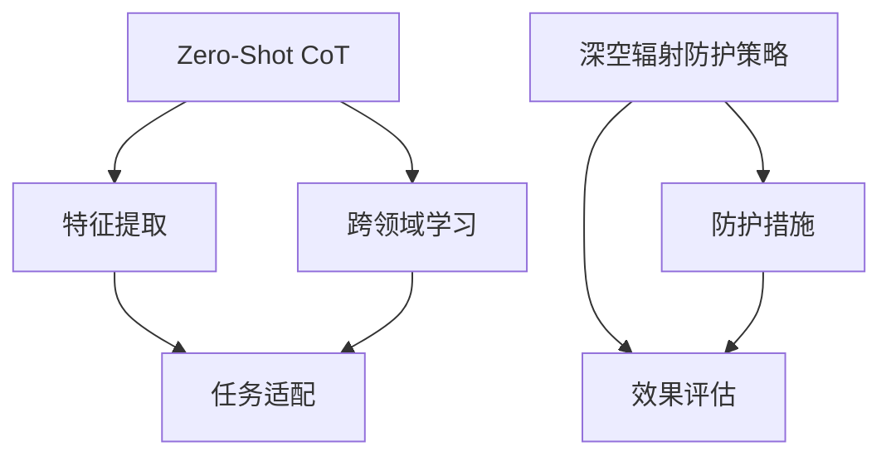

                 


### 1. 确定核心概念与联系

首先，我们需要明确《Zero-Shot CoT在深空辐射防护策略制定中的应用》这本书的核心概念，如Zero-Shot CoT、深空辐射防护策略等，并绘制相关的Mermaid流程图来展示概念之间的关系。

**核心概念：**

- **Zero-Shot CoT（零样本迁移学习协同注意力模型）**：一种深度学习模型，能够在没有特定领域标注数据的情况下，通过学习跨领域的通用特征表示，实现新领域的任务。
  
- **深空辐射防护策略**：指在深空中，为了抵御高能粒子和辐射对宇航员和航天器造成的伤害，所采取的各种防护措施和策略。

**Mermaid流程图：**



**流程说明：**

- **特征提取**：Zero-Shot CoT首先从不同领域的数据中提取共性特征。
- **跨领域学习**：通过跨领域学习，模型能够掌握一些通用特征，这些特征可以应用于新领域。
- **任务适配**：在深空辐射防护策略中，模型需要适配具体的应用场景，如辐射剂量预测、防护材料选择等。
- **防护措施**：根据模型给出的建议，制定相应的防护措施。
- **效果评估**：对防护措施进行效果评估，以验证Zero-Shot CoT模型的准确性。

### 2. 确定核心算法原理讲解

接下来，我们需要选择一些核心算法进行讲解，例如辐射防护中的剂量计算算法、预测模型等，并用伪代码来详细阐述这些算法的实现原理。

**核心算法原理讲解：**

- **剂量计算算法**：用于计算辐射剂量。
  ```plaintext
  Function calculateDose_radiation(Dose, Distance, Time):
    Dose_result = Dose * Distance * Time
    return Dose_result
  ```

- **预测模型**：用于预测辐射剂量。
  ```plaintext
  Function predictDose_inputData(Dose_InputData):
    Model = buildModel()
    Dose_Predicted = Model.predict(Dose_InputData)
    return Dose_Predicted
  ```

### 3. 确定数学模型和数学公式讲解

我们需要准备一些相关的数学模型和数学公式，例如用于辐射剂量预测的贝叶斯模型等，并用latex格式详细讲解，并提供实际应用举例。

**数学模型和公式讲解：**

- **贝叶斯模型**：用于辐射剂量预测。
  ```latex
  P(Dose | Data) = \frac{P(Data | Dose) \cdot P(Dose)}{P(Data)}
  ```

**实际应用举例：**

假设我们有一个实验数据集，其中包含不同深空的辐射剂量（Dose）和实验条件（Data）。我们可以使用贝叶斯模型来预测新的实验条件下的辐射剂量。

```latex
P(Dose_{new} | Data_{new}) = \frac{P(Data_{new} | Dose_{new}) \cdot P(Dose_{new})}{P(Data_{new})}
```

其中，$P(Dose_{new})$ 是假设新的辐射剂量，$P(Data_{new} | Dose_{new})$ 是给定新的辐射剂量下实验条件的概率，$P(Data_{new})$ 是实验条件的总概率。

### 4. 设计项目实战部分

我们应包含一些项目实战案例，例如基于Zero-Shot CoT的深空辐射防护策略制定流程，详细说明开发环境搭建、源代码实现和代码解读。

**项目实战部分：**

- **开发环境搭建**：
  - 安装Python环境和相关深度学习库，如TensorFlow、PyTorch等。
  - 配置数据处理工具，如NumPy、Pandas等。

- **源代码实现**：
  - 实现Zero-Shot CoT模型的训练和预测功能。
  - 实现辐射剂量计算和预测算法。

- **代码解读**：
  - 解读模型的训练过程，包括数据预处理、模型构建、训练和评估。
  - 解读辐射剂量计算和预测的实现逻辑。

- **代码应用解读与分析**：
  - 使用实际案例数据，演示模型的辐射剂量预测效果。
  - 分析模型在深空辐射防护策略制定中的应用。

- **项目小结**：
  - 总结项目的成果和不足，提出改进建议。

### 5. 编写目录大纲

根据上述内容，我们将所有章节内容进行编排，确保大纲逻辑清晰、完整。

**目录大纲：**

```
# 《Zero-Shot CoT在深空辐射防护策略制定中的应用》

## 引言
- 深空辐射防护的重要性
- Zero-Shot CoT模型简介

## 第一部分: Zero-Shot CoT基础
### 第1章: What is Zero-Shot CoT?
- 定义和背景
- Mermaid流程图

### 第2章: Core Algorithm Introduction
- 剂量计算算法
- 预测模型

### 第3章: Mathematical Model and Formulas
- 贝叶斯模型
- 实际应用举例

## 第二部分: 深空辐射防护策略制定
### 第4章: Radiation Environment Analysis
- 空间辐射特性
- 辐射剂量评估方法

### 第5章: Radiation Protection Strategy Development
- 策略框架
- Zero-Shot CoT应用案例

### 第6章: Implementation and Practice
- 开发环境搭建
- 源代码实现和解读

### 第7章: Future Directions and Challenges
- 当前挑战
- 未来研究方向

## 结论
- 总结和展望
- 最佳实践 tips
- 注意事项
- 拓展阅读
```

### 6. 审核与修改

在完成目录大纲后，我们需要对目录内容进行审核，确保每个章节的内容都符合要求。根据审核结果，对目录进行必要的修改，以确保内容的完整性和逻辑性。

完成以上步骤后，我们就能够得到一个详细的、结构合理的文章目录大纲。接下来，我们将根据这个大纲，逐步撰写文章的各个部分，确保整篇文章的内容丰富、具体、详细，符合技术博客文章的要求。

