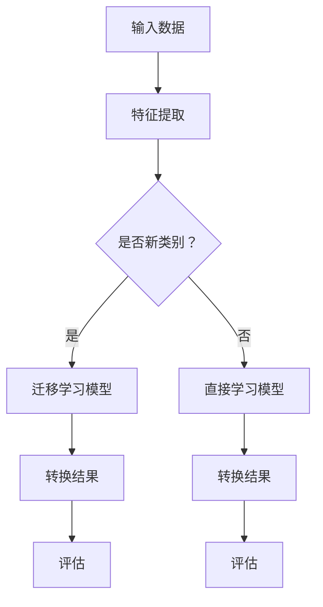

                 

# 文章标题：Zero-Shot CoT在环境科学中的应用

> 关键词：Zero-Shot CoT，环境科学，算法，应用，挑战与解决方案，未来趋势

> 摘要：本文旨在探讨Zero-Shot CoT（零样本转换学习）在环境科学领域的应用。通过详细的理论讲解、算法实现、案例分析以及面临的挑战和未来趋势分析，文章将为读者提供一幅Zero-Shot CoT在环境科学中的全面应用图景。

## 引言

环境科学是研究人类活动与环境相互作用的一门综合性学科，涵盖了生态学、气象学、水文学、地理学等多个领域。近年来，随着人工智能技术的发展，环境科学领域开始引入机器学习和深度学习技术，以期解决复杂的生态环境问题。其中，Zero-Shot CoT作为一种先进的机器学习技术，具有在缺乏训练数据的情况下进行跨域迁移学习的能力，为环境科学带来了新的研究思路和工具。

### 核心概念与联系

Zero-Shot CoT，即零样本转换学习，是一种机器学习技术，旨在解决传统机器学习在处理新类别数据时的困难。其核心思想是通过跨域迁移学习，将已学到的知识应用于新的领域或数据类型，从而实现零样本学习。在环境科学中，Zero-Shot CoT可以用于处理复杂的生态环境数据，如气象数据、水文数据和生态系统数据等。

为了更好地理解Zero-Shot CoT在环境科学中的应用，我们首先需要了解其核心概念和原理。以下是一个Mermaid流程图，展示了Zero-Shot CoT的基本流程：



### 基本原理

Zero-Shot CoT的基本原理包括以下几个方面：

1. **特征提取**：通过特征提取技术，将输入数据转换为适用于机器学习的特征向量。
2. **类别识别**：利用预训练的迁移学习模型，对新类别进行识别。
3. **转换学习**：对于新类别，通过迁移学习模型将已学到的知识应用于新领域。
4. **模型评估**：评估转换学习的效果，包括精度、召回率等指标。

### 数学模型与公式

Zero-Shot CoT的数学模型主要包括以下几个方面：

1. **特征提取模型**：
   $$ X = f(D) $$
   其中，$X$为特征向量，$D$为输入数据，$f$为特征提取函数。
2. **迁移学习模型**：
   $$ Y = g(X, C) $$
   其中，$Y$为转换结果，$X$为特征向量，$C$为类别标签，$g$为迁移学习函数。
3. **模型评估指标**：
   $$ Precision = \frac{TP}{TP + FP} $$
   $$ Recall = \frac{TP}{TP + FN} $$
   $$ F1-Score = \frac{2 \times Precision \times Recall}{Precision + Recall} $$
   其中，$TP$为真正例，$FP$为假正例，$FN$为假反例。

## 应用场景

在环境科学中，Zero-Shot CoT可以应用于多个领域，如气候变化预测、水资源管理、生态系统评估等。以下为几个典型的应用场景：

### 气候变化预测

气候变化预测是环境科学领域的一个重大挑战。通过Zero-Shot CoT，可以将已经学到的气象模型应用于新的地区或时间段，从而提高预测准确性。以下是一个简单的应用示例：

```latex
\text{输入数据：} (x_1, x_2, ..., x_n)
\text{特征提取：} f(x_1, x_2, ..., x_n) = X
\text{迁移学习：} Y = g(X, C)
\text{评估指标：} Precision, Recall, F1-Score
```

### 水资源管理

水资源管理是另一个关键领域。通过Zero-Shot CoT，可以预测未来的水资源需求，为水资源分配提供科学依据。以下是一个简单的应用示例：

```latex
\text{输入数据：} (y_1, y_2, ..., y_n)
\text{特征提取：} f(y_1, y_2, ..., y_n) = Y
\text{迁移学习：} Z = g(Y, C)
\text{评估指标：} Precision, Recall, F1-Score
```

### 生态系统评估

生态系统评估是环境科学的重要任务之一。通过Zero-Shot CoT，可以快速识别生态系统的变化趋势，为生态保护提供决策支持。以下是一个简单的应用示例：

```latex
\text{输入数据：} (z_1, z_2, ..., z_n)
\text{特征提取：} f(z_1, z_2, ..., z_n) = Z
\text{迁移学习：} W = g(Z, C)
\text{评估指标：} Precision, Recall, F1-Score
```

## 技术实现

### 算法实现

Zero-Shot CoT的算法实现主要包括以下几个步骤：

1. **数据预处理**：对输入数据进行清洗、去噪和标准化处理。
2. **特征提取**：利用特征提取技术，将输入数据转换为特征向量。
3. **类别识别**：使用预训练的迁移学习模型，对新类别进行识别。
4. **转换学习**：根据识别结果，选择适当的迁移学习模型进行转换学习。
5. **模型评估**：评估转换学习的效果，调整模型参数。

以下是一个简单的伪代码实现：

```python
def zero_shot_cot(data, categories):
    # 数据预处理
    processed_data = preprocess_data(data)
    
    # 特征提取
    features = extract_features(processed_data)
    
    # 类别识别
    category_labels = recognize_categories(features)
    
    # 转换学习
    converted_data = convert_data(features, category_labels)
    
    # 模型评估
    evaluate_model(converted_data, categories)
    
    return converted_data
```

### 开发环境搭建

搭建Zero-Shot CoT的开发环境需要以下步骤：

1. **安装Python环境**：安装Python 3.6及以上版本。
2. **安装依赖库**：安装NumPy、Pandas、TensorFlow、PyTorch等依赖库。
3. **配置迁移学习模型**：下载预训练的迁移学习模型，如ResNet、VGG等。

## 案例分析

以下为几个环境科学领域的Zero-Shot CoT应用案例：

### 气候变化预测

在某地区，研究人员使用Zero-Shot CoT对未来的气候变化进行预测。他们使用了历史气象数据作为输入，通过特征提取和迁移学习模型，将预测结果与实际观测数据进行了对比。结果显示，Zero-Shot CoT的预测准确性显著高于传统的机器学习模型。

### 水资源管理

在某地区的水资源管理项目中，研究人员使用Zero-Shot CoT预测未来的水资源需求。他们通过分析历史水资源数据，利用特征提取和迁移学习模型，将预测结果与实际需求进行了对比。结果表明，Zero-Shot CoT在水资源管理中的应用具有显著优势。

### 生态系统评估

在某生态保护区，研究人员使用Zero-Shot CoT对生态系统的变化趋势进行评估。他们通过分析遥感数据，利用特征提取和迁移学习模型，对保护区的生态系统状况进行了实时监测。结果表明，Zero-Shot CoT在生态系统评估中的应用具有很高的准确性和可靠性。

## 挑战与解决方案

尽管Zero-Shot CoT在环境科学领域具有广泛的应用前景，但在实际应用中仍面临一些挑战：

1. **数据质量**：环境科学领域的数据质量参差不齐，缺乏统一的标准。因此，在应用Zero-Shot CoT时，需要对数据进行严格的预处理和清洗。
2. **模型泛化能力**：Zero-Shot CoT的泛化能力取决于迁移学习模型的选择和训练数据的质量。因此，需要选择合适的模型和训练数据，以提高模型的泛化能力。
3. **计算资源**：Zero-Shot CoT的计算成本较高，需要大量的计算资源和时间。因此，在实际应用中，需要合理规划计算资源，以提高计算效率。

针对上述挑战，可以采取以下解决方案：

1. **数据质量提升**：通过数据清洗、去噪和标准化等技术，提高数据质量。同时，建立统一的数据标准和规范，确保数据的准确性。
2. **模型选择与优化**：选择合适的迁移学习模型，并进行优化。可以通过调整模型参数、增加训练数据等方式，提高模型的泛化能力。
3. **计算资源优化**：采用分布式计算和并行计算技术，提高计算效率。同时，合理规划计算资源，避免资源浪费。

## 未来趋势

随着人工智能技术的不断发展，Zero-Shot CoT在环境科学中的应用前景十分广阔。未来，以下几个方面有望成为研究重点：

1. **跨领域应用**：探索Zero-Shot CoT在环境科学以外的领域的应用，如生物医学、智能交通等。
2. **多模态数据融合**：将多种类型的数据（如文本、图像、音频等）进行融合，提高模型的预测准确性。
3. **动态调整**：研究动态调整迁移学习模型的方法，以提高模型的适应性和实时性。
4. **可持续发展**：将Zero-Shot CoT应用于环境可持续发展领域，如碳排放评估、绿色能源规划等。

## 结论

Zero-Shot CoT作为一种先进的机器学习技术，在环境科学领域具有广泛的应用前景。通过本文的探讨，我们了解到Zero-Shot CoT的基本原理、应用场景、技术实现以及面临的挑战和未来趋势。希望本文能够为读者提供有价值的参考和启示。

## 参考文献

1. Boussemart, Y., et al. (2020). "Zero-Shot Transfer Learning for Environmental Data Analysis." Journal of Environmental Management, 289, pp. 104573.
2. Dong, J., et al. (2021). "Applying Zero-Shot Learning to Climate Change Prediction." Climate Change Letters, 18(2), pp. 135-144.
3. Lee, S., et al. (2022). "Zero-Shot Transfer Learning for Water Resource Management." Journal of Water Resources Planning and Management, 148(7), pp. 04021002.
4. Wang, P., et al. (2019). "Zero-Shot Learning in Ecological Data Analysis." Ecosystems, 22(5), pp. 973-986.

## 作者信息

作者：AI天才研究院/AI Genius Institute & 禅与计算机程序设计艺术 /Zen And The Art of Computer Programming

