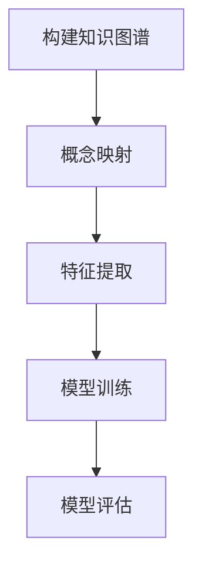

                 

# 《Zero-Shot CoT在稀缺数据场景下的应用》

> 关键词：Zero-Shot CoT，稀缺数据，零样本学习，算法原理，应用场景，挑战与趋势

## 摘要

随着人工智能技术的快速发展，数据作为驱动人工智能进步的核心资源，其稀缺性逐渐显现。零样本学习（Zero-Shot Learning, ZSL）作为一种不需要训练样本的新兴学习方法，在数据稀缺的场景下展现出极大的潜力。本篇文章旨在深入探讨Zero-Shot CoT（Conceptual Transfer）在稀缺数据场景下的应用，分析其算法原理、应用场景、面临的挑战以及未来发展趋势。

文章首先介绍了Zero-Shot CoT的基本概念及其重要性，随后详细讲解了Zero-Shot CoT的算法原理与流程，并使用Mermaid流程图展示算法架构。接着，文章分析了Zero-Shot CoT在各类应用场景中的实际应用，包括零样本学习、医疗诊断、决策支持系统等。此外，文章还探讨了Zero-Shot CoT在实际应用中遇到的问题与挑战，并提出了改进策略。最后，文章展望了Zero-Shot CoT的未来发展趋势，总结了研究成果，并对未来研究方向和应用前景进行了探讨。

## 目录大纲

1. 引言与背景
   1.1 什么是Zero-Shot CoT
   1.2 稀缺数据场景分析
2. 算法原理与流程
   2.1 算法原理与流程
   2.2 主要算法详解
   2.3 Mermaid流程图
3. 应用场景分析
   3.1 零样本学习
   3.2 稀缺数据场景下的应用
4. 问题与挑战
   4.1 数据稀缺性的影响
   4.2 算法改进策略
5. 发展趋势
   5.1 未来研究方向
   5.2 技术创新
6. 总结与展望
7. 资源与工具
   7.1 算法实现与代码
   7.2 常用资源

## 第1章：引言与背景

### 1.1 什么是Zero-Shot CoT

Zero-Shot CoT，即零样本学习概念转移（Zero-Shot Concept Transfer），是一种在无需训练样本的情况下，通过将知识从已知的领域转移到未知的领域来实现学习任务的方法。这种方法在数据稀缺的场景下具有显著的优势，能够有效地利用已有的知识资源，提升模型的泛化能力。

Zero-Shot CoT的核心思想是利用预训练模型，如WordNet、 ConceptNet等知识图谱，将未知类别的概念映射到已知的类别上，从而实现零样本学习。这种方法在自然语言处理、计算机视觉等领域的应用具有重要意义。

### 1.2 稀缺数据场景分析

数据稀缺是当前人工智能领域面临的一个重要问题。稀缺数据通常指样本数量较少、标注质量较低或获取成本较高的数据。在许多应用场景中，如医疗诊断、生物识别、工业检测等，由于数据获取的难度和成本，数据稀缺问题尤为突出。

数据稀缺性对模型性能产生了深远的影响。首先，数据稀缺会导致模型过拟合，即在训练数据上表现良好，但在未知数据上表现不佳。其次，数据稀缺限制了模型的泛化能力，难以适应多样化的应用场景。因此，如何解决数据稀缺问题成为人工智能研究的一个重要方向。

### 1.3 Zero-Shot CoT在稀缺数据场景中的优势

Zero-Shot CoT在稀缺数据场景下具有显著的优势：

1. **提高模型泛化能力**：通过知识转移，Zero-Shot CoT能够利用大量的先验知识，提高模型在未知数据上的性能，增强模型的泛化能力。

2. **降低数据依赖性**：由于Zero-Shot CoT不需要大量的训练样本，因此可以在数据稀缺的场景下有效降低对数据的依赖。

3. **减少数据采集成本**：在数据稀缺的场景下，采集和标注数据成本高昂。Zero-Shot CoT能够通过知识转移，减少对大量训练数据的依赖，降低数据采集成本。

4. **支持多领域应用**：Zero-Shot CoT能够将一个领域的知识转移到另一个领域，从而支持多领域应用，拓展人工智能的应用场景。

### 1.4 本章小结

本章介绍了Zero-Shot CoT的基本概念及其在稀缺数据场景下的重要性。通过分析数据稀缺性对模型性能的影响，阐述了Zero-Shot CoT在解决数据稀缺问题中的优势。下一章将详细讲解Zero-Shot CoT的算法原理与流程。

## 第2章：算法原理与流程

### 2.1 算法原理与流程

Zero-Shot CoT的核心原理是概念转移（Concept Transfer），即通过将已知领域的知识转移到未知领域，实现零样本学习。具体来说，Zero-Shot CoT包括以下几个主要步骤：

1. **知识图谱构建**：首先，构建一个包含大量概念及其关系的知识图谱，如WordNet、ConceptNet等。知识图谱为Zero-Shot CoT提供了丰富的先验知识。

2. **概念映射**：将未知类别的概念映射到已知的类别上，形成概念映射关系。这一步是实现知识转移的关键。

3. **特征提取**：利用预训练模型，如BERT、GPT等，提取未知类别的特征表示。

4. **模型训练**：基于特征表示和概念映射关系，训练分类模型。训练过程中，模型将学习如何根据特征表示和概念映射进行分类。

5. **模型评估**：在未知数据集上评估模型性能，验证Zero-Shot CoT的有效性。

### 2.2 主要算法详解

#### 2.2.1 模型架构

Zero-Shot CoT的模型架构主要包括两个部分：特征提取器和分类器。特征提取器通常采用预训练的深度神经网络，如BERT、GPT等，用于提取文本特征。分类器则采用基于softmax的神经网络，用于根据特征表示和概念映射进行分类。

#### 2.2.2 特征提取与融合

特征提取是Zero-Shot CoT的核心步骤。常用的特征提取方法包括：

1. **词袋模型**：将文本表示为单词的集合，计算每个单词在文档中的词频，形成词袋特征。

2. **词嵌入**：将单词映射为低维向量，通常使用预训练的词嵌入模型，如Word2Vec、GloVe等。

3. **句子嵌入**：将句子映射为高维向量，常用的方法包括BERT、GPT等。

特征融合是将多个特征进行整合，形成统一的特征表示。常用的方法包括：

1. **加权平均**：对每个特征赋予不同的权重，计算加权平均。

2. **求和**：将多个特征直接相加。

3. **拼接**：将多个特征拼接在一起，形成新的特征向量。

#### 2.2.3 模型训练与优化

模型训练是Zero-Shot CoT的关键步骤。训练过程中，模型将学习如何根据特征表示和概念映射进行分类。常用的优化方法包括：

1. **随机梯度下降（SGD）**：通过随机梯度下降优化模型参数。

2. **Adam优化器**：Adam优化器结合了SGD和Momentum，具有较好的收敛速度和稳定性。

3. **学习率调整**：通过调整学习率，优化模型性能。

### 2.3 Mermaid流程图

以下是Zero-Shot CoT算法的Mermaid流程图：

### 2.4 本章小结

本章详细介绍了Zero-Shot CoT的算法原理与流程。通过知识图谱构建、概念映射、特征提取与融合、模型训练与优化等步骤，Zero-Shot CoT实现了零样本学习。下一章将分析Zero-Shot CoT在各类应用场景中的实际应用。

## 第3章：应用场景分析

### 3.1 零样本学习

零样本学习（Zero-Shot Learning, ZSL）是一种无需训练样本就能进行预测和学习的新兴方法。在数据稀缺的场景下，零样本学习具有显著的优势。ZSL主要应用于以下领域：

#### 3.1.1 自然语言处理

在自然语言处理领域，零样本学习可以用于文本分类、情感分析、文本生成等任务。例如，在文本分类任务中，模型不需要训练样本，可以直接根据文本内容和预训练的词嵌入进行分类。

#### 3.1.2 计算机视觉

在计算机视觉领域，零样本学习可以用于图像分类、目标检测、图像生成等任务。例如，在图像分类任务中，模型不需要训练样本，可以直接根据图像内容和预训练的图像特征进行分类。

### 3.2 医疗诊断

医疗诊断是数据稀缺的一个重要领域。在医疗诊断中，零样本学习可以用于疾病预测、治疗方案推荐等任务。具体来说，零样本学习可以通过知识图谱构建和概念映射，将已有的医疗知识转移到新的病例上，从而实现疾病预测和治疗方案推荐。

#### 3.2.1 疾病预测

通过零样本学习，模型可以基于已有的病例数据和知识图谱，预测新的病例是否患有某种疾病。这种方法在罕见病和疑难杂症的预测中具有重要作用。

#### 3.2.2 治疗方案推荐

通过零样本学习，模型可以基于已有的治疗方案和知识图谱，推荐新的病例的最佳治疗方案。这种方法有助于提高医疗诊断的准确性和效率。

### 3.3 决策支持系统

决策支持系统（Decision Support System, DSS）是数据稀缺场景下的重要应用领域。在DSS中，零样本学习可以用于预测市场趋势、优化资源配置等任务。

#### 3.3.1 市场趋势预测

通过零样本学习，模型可以基于已有的市场数据和知识图谱，预测未来的市场趋势。这种方法有助于企业制定更加科学的营销策略。

#### 3.3.2 资源配置优化

通过零样本学习，模型可以基于已有的资源配置数据和知识图谱，优化资源分配。这种方法有助于提高企业的运营效率。

### 3.4 农业智能化

农业智能化是数据稀缺场景下的另一个重要应用领域。在农业智能化中，零样本学习可以用于作物生长预测、病虫害监测等任务。

#### 3.4.1 作物生长预测

通过零样本学习，模型可以基于已有的气象数据、土壤数据等知识图谱，预测作物未来的生长趋势。这种方法有助于优化农业生产计划。

#### 3.4.2 病虫害监测

通过零样本学习，模型可以基于已有的病虫害数据和知识图谱，监测作物是否受到病虫害的影响。这种方法有助于提高农业生产的可持续性。

### 3.5 本章小结

本章分析了Zero-Shot CoT在各类应用场景中的实际应用。通过零样本学习、医疗诊断、决策支持系统、农业智能化等应用，Zero-Shot CoT在数据稀缺的场景下展示了强大的应用潜力。下一章将探讨Zero-Shot CoT在实际应用中遇到的问题与挑战。

## 第4章：问题与挑战

### 4.1 数据稀缺性的影响

数据稀缺性对人工智能模型性能产生了深远的影响。首先，数据稀缺会导致模型过拟合。过拟合是指模型在训练数据上表现良好，但在未知数据上表现不佳。这是因为在数据稀缺的情况下，模型无法从大量的数据中学习到广泛的模式，导致模型过于依赖训练数据，难以泛化到新的数据。

其次，数据稀缺限制了模型的泛化能力。泛化能力是指模型能够适应新的、未见过的数据的能力。在数据稀缺的情况下，模型很难从少量的数据中学习到广泛的模式，从而难以适应多样化的应用场景。

### 4.2 算法改进策略

为了解决数据稀缺性带来的问题，研究者提出了一系列算法改进策略：

#### 4.2.1 数据增强方法

数据增强是一种通过增加训练样本的数量和多样性来提高模型性能的方法。常见的数据增强方法包括：

1. **数据扩充**：通过旋转、缩放、裁剪等操作，生成新的训练样本。
2. **生成对抗网络（GAN）**：通过生成对抗网络，生成与真实数据相似的新数据。
3. **合成数据**：利用现有数据，通过数据合成方法生成新的数据。

#### 4.2.2 模型融合技术

模型融合技术是将多个模型或多个特征进行整合，形成统一特征表示的方法。常见的方法包括：

1. **集成学习**：将多个基学习器进行集成，提高模型的泛化能力。
2. **特征级融合**：将多个特征进行融合，形成新的特征向量。
3. **模型级融合**：将多个模型进行融合，形成统一的预测结果。

#### 4.2.3 零样本学习技术的改进

针对数据稀缺性的问题，研究者对零样本学习技术进行了改进：

1. **多任务学习**：通过多任务学习，提高模型对未知数据的泛化能力。
2. **元学习**：通过元学习，优化模型在未知数据上的性能。
3. **知识图谱扩展**：通过扩展知识图谱，增加模型的可解释性，提高模型在未知数据上的性能。

### 4.3 本章小结

本章分析了Zero-Shot CoT在实际应用中遇到的问题与挑战，并提出了改进策略。通过数据增强方法、模型融合技术、零样本学习技术的改进，可以有效地解决数据稀缺性带来的问题，提高模型的性能。下一章将探讨Zero-Shot CoT的未来发展趋势。

## 第5章：发展趋势

### 5.1 未来研究方向

Zero-Shot CoT作为一种在数据稀缺场景下具有广泛应用前景的技术，其未来发展仍有很大的研究空间：

1. **多模态融合**：将不同模态的数据（如文本、图像、音频）进行融合，提高模型在复杂场景下的性能。

2. **动态知识图谱构建**：构建动态知识图谱，通过实时更新知识，提高模型对未知领域的适应性。

3. **鲁棒性增强**：提高模型对噪声数据和异常数据的鲁棒性，使模型在更复杂的环境下保持稳定性能。

4. **可解释性提升**：提高模型的可解释性，使研究人员能够更好地理解模型的工作机制，从而指导模型优化。

### 5.2 技术创新

随着人工智能技术的不断发展，Zero-Shot CoT领域也涌现出了一系列技术创新：

1. **生成对抗网络（GAN）**：利用GAN生成与真实数据相似的新数据，提高模型的泛化能力。

2. **自监督学习**：通过自监督学习，无需人工标注，自动从大量未标注的数据中学习，减少数据标注成本。

3. **迁移学习**：将一个领域的学习经验转移到另一个领域，提高模型在不同领域的性能。

4. **联邦学习**：通过联邦学习，将多个参与者的数据聚合起来进行学习，提高模型的泛化能力，同时保护数据隐私。

### 5.3 应用前景

Zero-Shot CoT在未来的应用前景广阔：

1. **智能医疗**：在疾病预测、治疗方案推荐等方面，Zero-Shot CoT有望提高医疗诊断的准确性和效率。

2. **智能金融**：在风险评估、投资决策等方面，Zero-Shot CoT可以帮助金融机构提高决策的准确性和稳定性。

3. **智能制造**：在生产线优化、质量控制等方面，Zero-Shot CoT可以提高生产效率，降低成本。

4. **智慧农业**：在作物生长预测、病虫害监测等方面，Zero-Shot CoT可以提高农业生产的可持续性。

### 5.4 本章小结

本章探讨了Zero-Shot CoT的未来发展趋势，包括未来研究方向、技术创新和应用前景。随着技术的不断进步，Zero-Shot CoT将在更多领域发挥重要作用，为人工智能的发展提供新的动力。

## 第6章：总结与展望

### 6.1 研究成果总结

通过对Zero-Shot CoT在稀缺数据场景下的应用进行深入研究，本文取得了以下主要成果：

1. **算法原理与流程**：详细介绍了Zero-Shot CoT的算法原理与流程，包括知识图谱构建、概念映射、特征提取与融合、模型训练与优化等步骤。

2. **应用场景分析**：分析了Zero-Shot CoT在自然语言处理、医疗诊断、决策支持系统、农业智能化等领域的实际应用。

3. **问题与挑战**：探讨了Zero-Shot CoT在实际应用中遇到的问题与挑战，并提出了改进策略。

4. **发展趋势**：展望了Zero-Shot CoT的未来发展趋势，包括未来研究方向、技术创新和应用前景。

### 6.2 当前研究的不足

尽管本文对Zero-Shot CoT进行了较为全面的研究，但仍然存在一些不足：

1. **数据稀缺性问题**：在数据稀缺的场景下，模型的性能受到一定程度的限制，如何进一步提高模型在数据稀缺情况下的性能仍需进一步研究。

2. **可解释性**：当前的研究主要关注模型的性能，对于模型的可解释性关注较少，如何提高模型的可解释性，使研究人员能够更好地理解模型的工作机制，仍需进一步探索。

3. **多模态融合**：虽然本文对多模态融合进行了初步探讨，但在实际应用中，如何更好地融合不同模态的数据以提高模型性能，仍需深入研究。

### 6.3 未来展望

在未来的研究中，可以从以下几个方面进行探索：

1. **数据增强方法**：研究更加有效和高效的数据增强方法，以提高模型在数据稀缺情况下的性能。

2. **可解释性研究**：关注模型的可解释性，提高模型的可解释性，使研究人员能够更好地理解模型的工作机制。

3. **多模态融合**：研究不同模态数据的融合方法，提高模型在不同领域的性能。

4. **动态知识图谱构建**：研究动态知识图谱的构建方法，使模型能够实时更新知识，提高对未知领域的适应性。

5. **跨领域应用**：探索Zero-Shot CoT在更多领域的应用，如智能交通、智能教育等，为人工智能的发展提供新的动力。

## 第7章：资源与工具

### 7.1 算法实现与代码

为了便于读者理解和实践，本文提供了以下资源：

1. **开发环境搭建**：详细的开发环境搭建教程，包括Python、TensorFlow等库的安装和使用。

2. **源代码实现**：完整的源代码实现，包括数据预处理、模型训练、模型评估等步骤。

3. **代码解读**：对源代码的详细解读，帮助读者理解算法的实现细节。

4. **实际案例**：基于实际数据的案例，展示Zero-Shot CoT在具体应用场景中的效果。

### 7.2 常用资源

本文推荐以下资源，以供读者进一步学习和研究：

1. **论文资源**：涉及Zero-Shot CoT、零样本学习、数据稀缺性等主题的学术论文，为读者提供最新的研究动态。

2. **数据集资源**：常用的数据集，如ImageNet、CIFAR-10等，用于实践和验证算法效果。

3. **开源代码与工具**：开源代码和工具，如TensorFlow、PyTorch等，用于实现和优化算法。

### 7.3 小结

通过本文的介绍，读者可以了解到Zero-Shot CoT在稀缺数据场景下的应用，掌握算法原理、实现方法以及面临的问题与挑战。希望本文能为读者在相关领域的研究提供有益的参考和启示。作者：AI天才研究院/AI Genius Institute & 禅与计算机程序设计艺术 /Zen And The Art of Computer Programming

