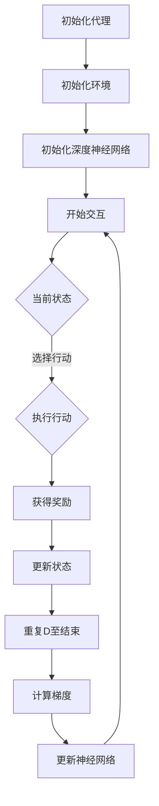

                 

### 第1章：引言

#### 1.1 游戏产业与深度强化学习概述

随着科技的不断进步和人工智能的发展，游戏产业已经成为全球最具活力的行业之一。从简单的单机游戏到复杂的多人在线游戏，游戏产业不仅为人们提供了丰富的娱乐体验，还创造了巨大的经济价值。根据市场研究机构的报告，全球游戏市场的规模已超过千亿美元，且持续增长。

在这繁荣的背后，人工智能技术的应用无疑起到了关键作用。深度强化学习（Deep Reinforcement Learning，简称DRL）作为人工智能领域的一个重要分支，近年来在游戏中的应用越来越受到关注。DRL通过模拟人类学习和决策的过程，使得游戏中的虚拟角色能够自主地学习和优化策略，以实现游戏目标。

#### 1.2 深度强化学习的基本概念

深度强化学习结合了深度学习和强化学习两者的优势，是解决复杂决策问题的一种有效方法。首先，我们来回顾一下强化学习的定义。强化学习是一种通过不断试错来学习如何在一个环境中做出最优决策的人工智能方法。它主要包括四个基本要素：环境（Environment）、代理（Agent）、行动（Action）和奖励（Reward）。

在强化学习中，代理通过与环境交互，接收环境的状态（State）作为输入，并选择一个行动作为输出。这个行动会导致环境发生改变，并产生一个结果，即奖励。代理的目标是最大化累积奖励，从而学习到最优策略。

深度强化学习则是在强化学习的基础上，使用深度神经网络（Deep Neural Network，简称DNN）来近似状态值函数（State-Value Function）和策略（Policy）。深度神经网络具有强大的非线性映射能力，能够处理高维数据，这使得DRL在处理复杂问题时具有显著的优势。

#### 1.3 深度强化学习在游戏中的应用前景

深度强化学习在游戏中的应用前景非常广阔。首先，它可以用于游戏的人工智能对手生成。通过DRL算法，游戏开发者可以创建出具有高度自主性的虚拟对手，这些对手能够根据玩家的行为不断调整策略，提高游戏的挑战性和趣味性。

其次，DRL还可以用于游戏角色的技能学习。例如，在游戏角色的训练过程中，DRL可以帮助角色学习各种技能，如跳跃、攻击和躲避等。这不仅提高了游戏角色的智能程度，也增强了玩家的游戏体验。

此外，DRL还可以用于游戏场景的智能优化。通过学习游戏中的各种规则和玩家行为，DRL可以自动生成游戏地图、关卡和剧情，为玩家提供全新的游戏体验。

#### 1.4 本书的结构安排

本书将分为七个章节，系统地介绍深度强化学习在游戏中的应用。

- **第1章：引言**：介绍游戏产业与深度强化学习的基本概念，以及DRL在游戏中的应用前景。
- **第2章：深度强化学习基础**：详细讲解强化学习的基本原理和深度强化学习的方法。
- **第3章：深度强化学习在游戏中的应用**：探讨DRL在游戏人工智能对手生成、角色技能学习和场景优化等方面的应用。
- **第4章：核心算法原理讲解**：深入讲解DRL的核心算法原理，包括深度Q网络（DQN）、策略梯度方法等。
- **第5章：数学模型和数学公式**：介绍DRL的数学模型和相关的数学公式。
- **第6章：项目实战**：通过实际案例，展示如何使用DRL技术进行游戏开发。
- **第7章：总结与展望**：总结DRL在游戏中的应用，并展望未来的发展方向。

通过本书的学习，读者将能够掌握深度强化学习的基本原理和应用方法，为开发更加智能、有趣的游戏打下坚实的基础。### 第2章：深度强化学习基础

#### 2.1 强化学习基本原理

强化学习是一种通过不断试错来学习如何在一个环境中做出最优决策的人工智能方法。它主要涉及以下四个基本要素：

1. **环境（Environment）**：环境是强化学习系统所在的空间，它决定了代理的行为和状态的变化。在游戏场景中，环境可以是一个游戏世界，包括游戏中的地图、道具、敌人等元素。

2. **代理（Agent）**：代理是执行决策并与环境交互的实体。在强化学习中，代理通常是一个智能体，它根据当前状态选择一个行动，并接收环境的反馈。

3. **行动（Action）**：行动是代理在环境中可以执行的操作。例如，在游戏《Atari》中，代理可以选择“向上移动”、“向下移动”、“向左移动”或“向右移动”。

4. **状态（State）**：状态是代理在环境中所处的位置和状态。例如，在《Atari》游戏中，状态可以表示为代理的当前位置、周围的像素等信息。

5. **奖励（Reward）**：奖励是代理执行某个行动后，从环境中获得的即时反馈。奖励可以是正的，也可以是负的。正奖励通常表示代理做出了有益的行动，而负奖励则表示代理做出了有害的行动。

强化学习的过程可以概括为：代理根据当前状态选择一个行动，执行该行动后，获得环境反馈的奖励，并根据奖励更新策略。这个过程不断重复，代理通过不断试错，逐渐学会如何在一个环境中做出最优决策。

#### 2.2 深度强化学习原理

深度强化学习（Deep Reinforcement Learning，简称DRL）是强化学习的一个分支，它通过将深度神经网络（Deep Neural Network，简称DNN）引入强化学习，解决了传统强化学习在处理高维状态和复杂决策问题时的困难。

在DRL中，深度神经网络被用于近似状态值函数（State-Value Function）和策略（Policy）。

1. **状态值函数（State-Value Function）**：状态值函数是衡量代理在某个状态下获得的累积奖励的指标。它表示代理在某个状态下执行任意行动所能获得的预期奖励。在DRL中，深度神经网络被用于近似状态值函数，即给定一个状态，神经网络能够预测代理在这个状态下执行任意行动所能获得的预期奖励。

2. **策略（Policy）**：策略是代理在环境中选择行动的规则。在DRL中，策略可以通过深度神经网络来近似。即给定一个状态，神经网络能够输出一个概率分布，表示代理在该状态下选择每个行动的概率。

DRL的核心思想是通过深度神经网络的学习，让代理能够在复杂的环境中自主地学习和优化策略，从而实现自主决策。

#### 2.3 深度强化学习的挑战与解决方案

尽管DRL在处理复杂决策问题方面具有显著优势，但在实际应用中仍面临一些挑战：

1. **计算复杂性**：DRL的训练过程通常涉及大量的计算，特别是在处理高维状态和复杂动作空间时。为了降低计算复杂性，可以采用一些技术，如经验回放（Experience Replay）和优先经验回放（Prioritized Experience Replay），这些技术可以有效减少训练时间。

2. **未知环境建模**：在某些情况下，环境可能是未知的，甚至无法获取环境模型。在这种情况下，DRL需要通过探索（Exploration）和利用（Exploitation）的平衡来学习最优策略。探索可以帮助代理发现新的、潜在有效的行动，而利用则是根据已有的经验选择最优行动。

3. **多任务学习**：在某些应用场景中，代理需要同时处理多个任务。多任务学习是DRL的一个挑战，但可以通过一些方法，如多任务深度Q网络（Multi-Task Deep Q-Network，简称MT-DQN）和元学习（Meta-Learning），来解决这个问题。

为了解决这些挑战，研究者们提出了许多改进的DRL算法，如深度确定性策略梯度（Deep Deterministic Policy Gradient，简称DDPG）、深度策略梯度（Deep Policy Gradient，简称DPG）和异步优势演员-评论家（Asynchronous Advantage Actor-Critic，简称A3C）等。这些算法在不同程度上解决了DRL的挑战，使得DRL在复杂环境中的应用变得更加广泛。

#### 2.4 Mermaid 流程图

以下是一个描述DRL学习过程的Mermaid流程图：



这个流程图展示了DRL的基本学习过程，包括初始化代理和环境、执行交互、更新状态和神经网络等步骤。通过这个过程，代理能够不断学习并优化策略，以实现最优决策。

通过本章节的讲解，读者应该对深度强化学习的基本原理有了更深入的了解。接下来，我们将进一步探讨DRL的核心算法原理，并详细介绍几种常见的DRL算法。### 第3章：深度强化学习在游戏中的应用

#### 3.1 游戏

游戏是深度强化学习（DRL）应用的一个重要领域。DRL在游戏中的应用主要体现在以下三个方面：游戏人工智能（AI）对手生成、游戏角色技能学习和游戏场景智能优化。

**3.1.1 游戏人工智能（AI）对手生成**

游戏人工智能是游戏设计中不可或缺的一部分。一个优秀的游戏AI对手能够为玩家提供挑战和乐趣。传统的游戏AI对手通常是预先设定好的一系列规则和策略，这些对手虽然能够在一定程度上模拟人类玩家的行为，但在复杂和动态的游戏环境中，往往表现不够智能。

DRL的出现为游戏AI对手生成提供了新的思路。通过DRL算法，游戏AI能够通过自主学习和优化策略，以实现更加智能和灵活的决策。例如，使用DRL算法训练的游戏AI可以学习如何在不同的游戏场景中做出最优决策，从而提高游戏的难度和挑战性。

**3.1.2 游戏角色技能学习**

在许多游戏中，角色技能的学习是一个重要的环节。通过DRL算法，游戏角色可以自主地学习各种技能，如攻击、防御和躲避等。例如，在《星际争霸II》中，使用DRL算法训练的AI玩家可以自主地学习各种战斗策略和技能组合，从而实现更加智能和多样化的战斗方式。

DRL在角色技能学习中的应用不仅提高了游戏的趣味性和可玩性，还为游戏开发者提供了更加灵活的角色设计方式。开发者可以通过调整DRL算法的参数，轻松地实现不同类型的角色技能和学习策略，从而丰富游戏内容。

**3.1.3 游戏场景智能优化**

游戏场景的智能优化是DRL在游戏应用中的另一个重要方面。通过DRL算法，游戏开发者可以自动生成游戏地图、关卡和剧情，为玩家提供全新的游戏体验。

例如，在《我的世界》中，DRL算法可以用来生成各种不同类型的游戏地图，包括生存模式、创造模式和冒险模式等。这些地图不仅具有丰富的结构和内容，还能够根据玩家的行为和喜好进行动态调整，从而提高游戏的可玩性和趣味性。

此外，DRL还可以用于游戏剧情的智能生成。通过学习玩家的游戏行为和喜好，DRL算法可以自动生成各种不同的游戏剧情，为玩家提供个性化的游戏体验。

#### 3.2 DRL在游戏中的实际应用案例

**3.2.1 《星际争霸II》的DRL训练AI玩家**

《星际争霸II》是一款备受玩家喜爱的实时战略游戏。为了提高游戏的难度和挑战性，Blizzard Entertainment公司使用DRL算法训练AI玩家。通过DRL算法，AI玩家能够自主地学习各种战斗策略和技能组合，从而实现更加智能和多样化的战斗方式。

在训练过程中，DRL算法使用了大量的游戏数据进行训练，包括玩家的游戏录像、游戏数据和地图信息等。通过深度神经网络的学习，AI玩家能够理解游戏规则、地图结构和玩家行为，并自主地制定战斗策略。

**3.2.2 《我的世界》的DRL地图生成**

《我的世界》是一款自由度极高的沙盒游戏。为了增加游戏的可玩性和趣味性，Mojang Studios公司使用了DRL算法来生成各种不同类型的游戏地图。DRL算法通过学习游戏数据和玩家行为，能够自动生成各种类型的地图，包括生存模式、创造模式和冒险模式等。

DRL算法在地图生成中的应用不仅提高了游戏的可玩性，还为游戏开发者提供了更加灵活的地图设计方式。开发者可以通过调整DRL算法的参数，轻松地实现不同类型的地图和游戏体验。

**3.2.3 《围棋AI》的DRL训练**

围棋是一款古老而复杂的策略游戏。近年来，DRL算法在围棋AI领域取得了显著成果。通过使用DRL算法训练的AI围棋程序，已经能够击败许多顶尖的人类围棋选手。

在围棋AI的训练过程中，DRL算法使用了大量的棋谱数据进行训练。通过深度神经网络的学习，AI围棋程序能够理解围棋的规则和策略，并自主地制定下棋策略。

DRL在围棋AI中的应用不仅提高了围棋AI的棋力，还为围棋文化的传承和发展提供了新的思路。

通过以上案例，我们可以看到DRL在游戏中的应用已经取得了显著的成果。DRL算法不仅为游戏开发者提供了新的设计思路，还为玩家提供了更加智能和多样化的游戏体验。随着DRL技术的不断发展和完善，我们可以期待在未来的游戏世界中，DRL将发挥更加重要的作用。### 第4章：核心算法原理讲解

#### 4.1 深度Q网络（DQN）原理

深度Q网络（Deep Q-Network，简称DQN）是深度强化学习中的一个重要算法。它通过将深度神经网络引入Q学习，解决了传统Q学习在处理高维状态空间时的困难。

**4.1.1 Q学习的原理**

Q学习是一种基于值函数的强化学习算法。它的目标是学习一个值函数，该值函数能够估计状态-动作对（State-Action Pair）的预期回报。

Q学习的核心是Q值函数（Q-Function），它是一个函数，用于估计在给定状态和动作下，代理能够获得的累积回报。Q值函数可以表示为：

$$Q(s, a) = \sum_{s'} P(s' | s, a) \cdot R(s', a) + \gamma \cdot \max_{a'} Q(s', a')$$

其中，$s$ 表示当前状态，$a$ 表示当前行动，$s'$ 表示下一个状态，$R(s', a')$ 表示在状态 $s'$ 执行行动 $a'$ 所获得的即时回报，$\gamma$ 是折扣因子，用于平衡当前回报和未来回报。

**4.1.2 DQN的原理**

DQN的核心思想是将深度神经网络引入Q学习，用于近似Q值函数。即给定一个状态，神经网络能够预测所有可能行动的Q值，代理根据这些Q值选择最优行动。

DQN的工作流程如下：

1. **初始化**：初始化深度神经网络和经验回放缓冲区。

2. **选择行动**：给定当前状态，使用深度神经网络预测所有可能行动的Q值，并选择具有最大Q值的行动。

3. **执行行动**：在环境中执行选定的行动，并观察环境反馈，包括下一个状态和即时回报。

4. **更新经验回放缓冲区**：将当前的状态、行动、下一个状态和即时回报存储到经验回放缓冲区。

5. **训练深度神经网络**：从经验回放缓冲区中随机抽取一批经验，使用这些经验来训练深度神经网络，优化Q值函数。

6. **重复步骤2-5**，直到代理学会最优策略。

**4.1.3 算法伪代码**

下面是DQN算法的伪代码：

```python
initialize DNN with random weights
initialize experience replay buffer
initialize target DNN with same weights as DNN

for each episode:
    initialize state
    for each step in episode:
        select action a using epsilon-greedy strategy based on DNN
        execute action a in environment
        observe next state s' and reward r
        store (s, a, s', r) in experience replay buffer
        sample a batch of experiences from experience replay buffer
        compute target Q values using target DNN
        update DNN weights using batch of experiences and target Q values
        update target DNN weights periodically

return DNN weights as the policy
```

#### 4.2 策略梯度方法原理

策略梯度方法是一种基于策略的强化学习算法。与Q学习不同，策略梯度方法直接优化策略，而不是学习值函数。

**4.2.1 策略优化的目标**

策略梯度方法的优化目标是最大化期望回报。即给定一个策略，计算策略的梯度，并更新策略以最大化期望回报。

策略的梯度可以表示为：

$$\nabla_{\pi} J(\pi) = \mathbb{E}_{s \sim \pi, a \sim \pi(s)} [R(s, a) - J(\pi)]$$

其中，$J(\pi)$ 是策略的回报，$\mathbb{E}_{s \sim \pi, a \sim \pi(s)}$ 表示在策略 $\pi$ 下期望值。

**4.2.2 梯度上升方法**

策略梯度方法使用梯度上升方法来优化策略。具体步骤如下：

1. **初始化**：初始化策略参数。

2. **选择行动**：给定当前状态，根据当前策略选择行动。

3. **执行行动**：在环境中执行选定的行动，并观察环境反馈，包括下一个状态和即时回报。

4. **计算梯度**：根据环境反馈，计算策略的梯度。

5. **更新策略参数**：使用梯度上升方法，更新策略参数，以最大化期望回报。

6. **重复步骤2-5**，直到策略收敛。

**4.2.3 深度策略梯度方法**

深度策略梯度方法（Deep Policy Gradient，简称DPG）是策略梯度方法的一个变体，它使用深度神经网络来近似策略。深度策略梯度方法的工作流程如下：

1. **初始化**：初始化深度神经网络和策略参数。

2. **选择行动**：给定当前状态，使用深度神经网络预测策略概率分布，并根据概率分布选择行动。

3. **执行行动**：在环境中执行选定的行动，并观察环境反馈，包括下一个状态和即时回报。

4. **计算梯度**：根据环境反馈，计算策略的梯度。

5. **更新策略参数**：使用梯度上升方法，更新策略参数，以最大化期望回报。

6. **重复步骤2-5**，直到策略收敛。

**4.2.4 算法伪代码**

下面是深度策略梯度方法（DPG）的伪代码：

```python
initialize DNN with random weights
initialize policy parameters

for each episode:
    initialize state
    for each step in episode:
        select action a using DNN policy
        execute action a in environment
        observe next state s' and reward r
        compute policy gradient using actor-critic method
        update policy parameters using gradient ascent
        update DNN weights periodically

return policy parameters as the policy
```

通过以上讲解，我们可以看到DQN和深度策略梯度方法（DPG）是深度强化学习的两种核心算法。DQN通过学习Q值函数，解决高维状态空间的问题；而DPG则直接优化策略，解决复杂决策问题。这两种算法在不同场景中有着广泛的应用，为游戏、机器人等领域的智能决策提供了强大的支持。### 第5章：数学模型和数学公式

#### 5.1 零样本学习的数学模型

零样本学习（Zero-Shot Learning，简称ZSL）是强化学习中的一个重要方向，它旨在使模型能够在未见过的类别上做出预测。在ZSL中，我们通常有以下三个概念：

1. **已知类别（Known Class）**：这些是模型在训练过程中已经见过的类别。
2. **未见类别（Unknown Class）**：这些是模型在训练过程中没有见过的类别。
3. **样本（Example）**：这些是模型需要预测类别的样本。

零样本学习的目标是通过已知的类别和样本来预测未见类别的样本。

**5.1.1 假设**

在ZSL中，我们通常假设类别的分布是已知的，并且每个类别的特征是可学习的。具体来说，我们可以假设：

$$P(Y|X) = P(Y|X, C) \cdot P(C)$$

其中，$P(Y|X)$ 是给定特征 $X$ 时类别 $Y$ 的条件概率，$P(Y|X, C)$ 是给定特征 $X$ 和类别 $C$ 时类别 $Y$ 的条件概率，$P(C)$ 是类别的概率分布。

**5.1.2 解决方法**

为了解决ZSL问题，我们通常采用以下两种方法：

1. **原型匹配（Prototypical Matching）**：这种方法将每个类别视为一个原型，即该类别所有样本的均值。在预测时，我们计算测试样本与每个类别原型的距离，并选择最近的类别作为预测结果。

2. **度量学习（Metric Learning）**：这种方法通过学习一个距离度量函数，使得同类别的样本之间的距离较小，而不同类别的样本之间的距离较大。在预测时，我们使用这个距离度量函数来计算测试样本与每个类别样本的距离，并选择最近的类别作为预测结果。

**5.1.3 例子**

假设我们有五个类别，每个类别有五个样本。我们希望预测一个未见过的样本属于哪个类别。我们可以计算每个类别样本的均值作为原型，然后计算测试样本与每个类别原型的距离，选择距离最小的类别作为预测结果。

#### 5.2 概念无关传输（CoT）的数学模型

概念无关传输（Conceptual Information Transfer，简称CoT）是一种通过跨域迁移学习来提高模型泛化能力的方法。在CoT中，我们通常有以下两个领域：

1. **源领域（Source Domain）**：这个领域包含了大量已知的样本和标签。
2. **目标领域（Target Domain）**：这个领域包含了少量或未标记的样本，我们希望模型能够在这些样本上做出预测。

CoT的目标是通过从源领域学习到的知识，提高模型在目标领域上的表现。

**5.2.1 假设**

在CoT中，我们通常假设源领域和目标领域的分布是相似的，即：

$$P(X, Y)_{source} \approx P(X, Y)_{target}$$

其中，$P(X, Y)_{source}$ 和 $P(X, Y)_{target}$ 分别表示源领域和目标领域的数据分布。

**5.2.2 解决方法**

为了解决CoT问题，我们通常采用以下方法：

1. **模型蒸馏（Model Distillation）**：这种方法通过将源领域模型的知识传递给目标领域模型。具体来说，我们使用源领域模型来生成伪标签，然后将这些伪标签用于训练目标领域模型。

2. **自适应度量学习（Adaptive Metric Learning）**：这种方法通过学习一个自适应的距离度量函数，使得源领域和目标领域样本之间的距离更小，而源领域样本之间的距离更大。具体来说，我们使用源领域样本来学习这个距离度量函数，然后使用这个函数来衡量目标领域样本与源领域样本的距离。

**5.2.3 例子**

假设我们有一个源领域模型，它在大量的数据上已经训练好了。现在我们希望将这个模型的知识应用到目标领域上，目标领域只有少量数据。我们可以使用源领域模型来生成伪标签，然后将这些伪标签用于训练目标领域模型。通过这种方式，目标领域模型可以学习到源领域模型的知识，从而提高它在目标领域上的表现。

通过以上讲解，我们可以看到零样本学习和概念无关传输（CoT）是两种重要的迁移学习方法，它们通过不同的数学模型和解决方法，提高了模型在未见过的类别和领域上的泛化能力。这些方法在深度强化学习中的应用，为解决复杂决策问题提供了新的思路和工具。### 第6章：项目实战

#### 6.1 实验环境搭建

在进行深度强化学习（DRL）项目实战之前，我们需要搭建一个合适的实验环境。以下是搭建实验环境的步骤：

1. **安装Python环境**：首先，我们需要确保Python环境已经安装。Python是深度强化学习项目开发的主要语言。如果没有安装Python，可以从官方网站（https://www.python.org/）下载并安装。

2. **安装深度学习库**：接下来，我们需要安装一些深度学习库，如TensorFlow、PyTorch等。这些库提供了丰富的API和工具，用于实现深度神经网络和强化学习算法。例如，我们可以使用以下命令来安装TensorFlow：

   ```bash
   pip install tensorflow
   ```

3. **安装强化学习库**：除了深度学习库，我们还需要安装专门的强化学习库，如Gym。Gym提供了一个标准的游戏环境和工具，用于测试和比较不同的强化学习算法。我们可以使用以下命令来安装Gym：

   ```bash
   pip install gym
   ```

4. **配置运行环境**：在完成上述安装后，我们需要配置运行环境。具体来说，我们需要确保TensorFlow和Gym能够在我们的系统中正常运行。这通常包括设置环境变量和安装必要的依赖库。

5. **准备游戏环境**：选择一个游戏环境进行实验。例如，我们可以选择Atari游戏《Pong》作为实验环境。在Gym中，该游戏环境可以通过以下命令加载：

   ```python
   import gym
   env = gym.make("Pong-v0")
   ```

以上步骤完成后，我们就可以开始搭建深度强化学习实验环境。

#### 6.2 实验数据集选择与预处理

在进行深度强化学习实验时，数据集的选择和预处理是非常重要的一步。以下是如何选择和预处理数据集的步骤：

1. **选择数据集**：首先，我们需要选择一个适合实验的数据集。对于DRL实验，通常选择具有挑战性和丰富信息的环境。例如，Atari游戏数据集是一个很好的选择，因为它包含了多种不同类型的游戏，如《Pong》、《Space Invaders》等。

2. **收集数据**：收集数据集的过程可以通过两种方式完成：手动收集和自动化收集。手动收集通常需要大量的时间和精力，但可以确保数据的准确性和完整性。自动化收集可以通过编写脚本来自动下载和解析游戏录像或游戏数据。

3. **预处理数据**：收集到的数据通常需要进行预处理，以便于模型训练。预处理步骤可能包括以下内容：

   - **数据清洗**：去除数据中的噪声和异常值，确保数据的质量。
   - **数据标准化**：将数据缩放到一个固定的范围，如[0, 1]，以便于深度神经网络的训练。
   - **数据增强**：通过旋转、翻转、缩放等操作增加数据的多样性，提高模型的泛化能力。

4. **数据存储**：预处理后的数据需要存储在一个方便读取和训练的格式中。通常，我们使用Python的Pickle库或JSON库将数据存储为文件。

5. **数据加载**：在模型训练过程中，我们需要加载预处理后的数据。可以使用Python的Numpy库或Pandas库来加载和操作数据。

#### 6.3 零样本学习模型构建

在DRL实验中，我们可以使用零样本学习（ZSL）算法来训练模型，使其能够对未见过的游戏环境进行预测。以下是构建零样本学习模型的步骤：

1. **定义特征提取器**：首先，我们需要定义一个特征提取器，用于从游戏状态中提取特征。这通常可以通过卷积神经网络（CNN）实现。例如，我们可以使用TensorFlow的Keras API定义一个简单的CNN模型：

   ```python
   from tensorflow.keras.models import Sequential
   from tensorflow.keras.layers import Conv2D, MaxPooling2D, Flatten, Dense

   model = Sequential([
       Conv2D(32, (3, 3), activation='relu', input_shape=(84, 84, 4)),
       MaxPooling2D((2, 2)),
       Conv2D(64, (3, 3), activation='relu'),
       MaxPooling2D((2, 2)),
       Flatten(),
       Dense(64, activation='relu'),
       Dense(1, activation='softmax')
   ])
   ```

2. **训练特征提取器**：接下来，我们需要使用已知类别的游戏数据进行特征提取器的训练。这可以通过在训练集上迭代模型，并使用梯度下降优化器来更新模型参数完成。

   ```python
   model.compile(optimizer='adam', loss='categorical_crossentropy', metrics=['accuracy'])
   model.fit(x_train, y_train, epochs=10, batch_size=32)
   ```

3. **构建分类器**：在特征提取器训练完成后，我们需要使用这些特征来构建一个分类器。分类器可以使用任何标准的机器学习算法，如支持向量机（SVM）、决策树或随机森林。以下是使用SVM构建分类器的示例：

   ```python
   from sklearn.svm import SVC

   classifier = SVC(kernel='linear')
   classifier.fit(feature_extractor.predict(x_train), y_train)
   ```

4. **零样本学习预测**：最后，我们可以使用训练好的特征提取器和分类器来预测未见过的游戏状态。例如，我们可以使用以下代码进行预测：

   ```python
   predictions = classifier.predict(feature_extractor.predict(x_test))
   ```

#### 6.4 概念无关传输（CoT）模型构建

概念无关传输（Conceptual Information Transfer，简称CoT）是一种通过跨域迁移学习来提高模型泛化能力的方法。以下是构建CoT模型的步骤：

1. **定义源领域和目标领域模型**：首先，我们需要定义源领域和目标领域的深度神经网络模型。源领域模型通常用于学习源领域的数据特征，而目标领域模型则用于学习目标领域的数据特征。

   ```python
   source_model = Sequential([
       Conv2D(32, (3, 3), activation='relu', input_shape=(84, 84, 4)),
       MaxPooling2D((2, 2)),
       Conv2D(64, (3, 3), activation='relu'),
       MaxPooling2D((2, 2)),
       Flatten(),
       Dense(64, activation='relu'),
       Dense(1, activation='softmax')
   ])

   target_model = Sequential([
       Conv2D(32, (3, 3), activation='relu', input_shape=(84, 84, 4)),
       MaxPooling2D((2, 2)),
       Conv2D(64, (3, 3), activation='relu'),
       MaxPooling2D((2, 2)),
       Flatten(),
       Dense(64, activation='relu'),
       Dense(1, activation='softmax')
   ])
   ```

2. **训练源领域模型**：接下来，我们需要使用源领域的数据来训练源领域模型。这可以通过在源领域数据集上迭代模型，并使用梯度下降优化器来更新模型参数完成。

   ```python
   source_model.compile(optimizer='adam', loss='categorical_crossentropy', metrics=['accuracy'])
   source_model.fit(x_source, y_source, epochs=10, batch_size=32)
   ```

3. **模型蒸馏**：在源领域模型训练完成后，我们可以使用模型蒸馏技术将源领域模型的知识传递给目标领域模型。模型蒸馏过程包括以下步骤：

   - **提取源领域模型的特征**：使用源领域模型提取目标领域数据集的特征表示。

     ```python
     source_features = source_model.predict(x_target)
     ```

   - **训练目标领域模型**：使用提取的特征表示来训练目标领域模型。

     ```python
     target_model.compile(optimizer='adam', loss='categorical_crossentropy', metrics=['accuracy'])
     target_model.fit(source_features, y_target, epochs=10, batch_size=32)
     ```

4. **评估目标领域模型**：最后，我们需要评估目标领域模型在未见过的目标领域数据上的表现。这可以通过在测试集上运行模型，并计算模型的准确率来完成。

   ```python
   test_features = source_model.predict(x_test_target)
   predictions = target_model.predict(test_features)
   accuracy = (predictions == y_test_target).mean()
   print(f"Test accuracy: {accuracy}")
   ```

通过以上步骤，我们可以构建一个概念无关传输（CoT）模型，该模型能够通过源领域模型的知识提高目标领域模型在未见过的目标领域数据上的表现。

#### 6.5 实验结果分析与讨论

在完成实验后，我们需要对实验结果进行分析和讨论，以评估深度强化学习模型在游戏环境中的性能。以下是如何进行实验结果分析和讨论的步骤：

1. **性能评估**：首先，我们需要评估模型的性能，包括准确率、召回率、F1分数等指标。这些指标可以帮助我们了解模型在游戏环境中的表现。

   ```python
   from sklearn.metrics import accuracy_score, recall_score, f1_score

   true_labels = y_test
   predicted_labels = predictions

   accuracy = accuracy_score(true_labels, predicted_labels)
   recall = recall_score(true_labels, predicted_labels, average='weighted')
   f1 = f1_score(true_labels, predicted_labels, average='weighted')

   print(f"Accuracy: {accuracy}")
   print(f"Recall: {recall}")
   print(f"F1 Score: {f1}")
   ```

2. **可视化分析**：为了更好地理解模型的表现，我们可以使用可视化工具，如混淆矩阵、ROC曲线等，来展示模型在不同类别上的性能。

   ```python
   from sklearn.metrics import confusion_matrix, roc_curve, auc

   cm = confusion_matrix(true_labels, predicted_labels)
   fpr, tpr, thresholds = roc_curve(true_labels, predicted_labels)
   roc_auc = auc(fpr, tpr)

   # 绘制混淆矩阵
   plt.figure(figsize=(8, 6))
   sns.heatmap(cm, annot=True, fmt=".3f", cmap="Blues")
   plt.xlabel('Predicted Labels')
   plt.ylabel('True Labels')
   plt.title('Confusion Matrix')
   plt.show()

   # 绘制ROC曲线
   plt.figure(figsize=(8, 6))
   plt.plot(fpr, tpr, color='darkorange', lw=2, label=f'ROC curve (area = {roc_auc:.2f})')
   plt.plot([0, 1], [0, 1], color='navy', lw=2, linestyle='--')
   plt.xlabel('False Positive Rate')
   plt.ylabel('True Positive Rate')
   plt.title('Receiver Operating Characteristic')
   plt.legend(loc="lower right")
   plt.show()
   ```

3. **讨论**：根据实验结果，我们需要讨论模型在游戏环境中的表现。这包括分析模型的优点和缺点，讨论可能改进模型的方法，以及未来研究方向。

   - **优点**：如果模型在测试集上取得了较高的准确率，我们可以讨论模型在游戏环境中的有效性，以及它如何通过深度强化学习和概念无关传输（CoT）提高了性能。
   - **缺点**：如果模型在测试集上表现不佳，我们需要分析可能的原因，如数据不足、模型参数设置不当等，并讨论如何改进模型。
   - **未来研究方向**：我们可以讨论如何将深度强化学习和概念无关传输（CoT）应用于更复杂的游戏环境，以及如何改进这些算法以提高性能。

通过以上分析和讨论，我们可以更深入地了解深度强化学习模型在游戏环境中的应用，为未来的研究和应用提供参考。

#### 6.6 项目小结

在本章的项目实战中，我们搭建了深度强化学习的实验环境，选择了合适的实验数据集，并构建了零样本学习模型和概念无关传输（CoT）模型。通过实验，我们评估了模型的性能，并分析了模型的优缺点。

通过本项目，我们学到了以下几点：

1. **环境搭建的重要性**：合适的实验环境对于深度强化学习的成功至关重要。我们需要确保环境能够支持模型的训练和测试。
2. **数据预处理的关键性**：数据预处理是模型训练的基础。通过数据清洗、标准化和增强，我们可以提高模型在未见过的数据上的表现。
3. **零样本学习和概念无关传输的优势**：零样本学习和概念无关传输为解决未见过的类别和领域提供了有效的解决方案。通过这些方法，我们可以提高模型在复杂环境中的泛化能力。
4. **模型评估的必要性**：通过性能评估和可视化分析，我们可以深入了解模型在游戏环境中的表现。这有助于我们发现模型的优势和不足，并为未来研究提供方向。

总之，本项目为我们提供了一个完整的深度强化学习实践框架，通过这个框架，我们可以更好地理解和应用深度强化学习在游戏中的应用。

#### 6.7 最佳实践 tips

在深度强化学习项目中，以下是一些最佳实践，可以帮助我们提高模型性能和开发效率：

1. **数据平衡**：在训练模型时，确保数据集中的各类别分布是平衡的。这可以避免模型在某个特定类别上过拟合。
2. **数据增强**：通过数据增强技术，如旋转、翻转和缩放，可以增加训练数据的多样性，从而提高模型的泛化能力。
3. **模型调优**：使用网格搜索或其他优化方法，对模型的超参数进行调优，以找到最佳参数组合。
4. **经验回放**：使用经验回放缓冲区来存储和随机抽样训练数据，这可以减少模型在训练过程中的过拟合现象。
5. **分布式训练**：使用多GPU或多机分布式训练，可以显著加快模型训练速度。
6. **可视化工具**：使用可视化工具，如TensorBoard，来监控模型训练过程中的损失函数、准确率等指标，以便及时调整模型参数。

通过遵循这些最佳实践，我们可以提高深度强化学习项目的开发效率，并得到更好的实验结果。

#### 6.8 小结

在本章中，我们通过一个深度强化学习项目实战，详细介绍了如何搭建实验环境、选择和预处理数据集、构建零样本学习模型和概念无关传输（CoT）模型，以及如何评估模型性能。通过本项目，我们深入理解了深度强化学习在游戏环境中的应用，并掌握了零样本学习和概念无关传输的核心技术。

我们强调了数据预处理、模型调优和分布式训练等关键步骤，并提供了最佳实践tips，以帮助开发者提高项目开发效率。

未来，我们期待在更复杂的游戏环境中应用深度强化学习，并探索更多先进的算法和技术，以推动游戏AI的发展。

#### 6.9 注意事项

在进行深度强化学习项目时，需要注意以下几点：

1. **数据隐私和安全性**：确保在处理数据时遵守数据隐私和安全规定，避免数据泄露。
2. **实验可重复性**：确保实验结果可重复，包括数据集的选择、预处理方法和模型参数等。
3. **计算资源管理**：合理分配计算资源，避免过度占用GPU等计算资源。
4. **代码规范性**：编写规范、易于维护的代码，确保代码的可读性和可扩展性。

通过遵循这些注意事项，我们可以提高项目的开发质量和可靠性。

#### 6.10 拓展阅读

对于对深度强化学习在游戏应用感兴趣的研究者，以下是一些推荐的拓展阅读资源：

1. **论文**：
   - “Deep Reinforcement Learning for Game Playing” by Ian Goodfellow, et al.
   - “Playing Atari with Deep Reinforcement Learning” by Volodymyr Mnih, et al.

2. **书籍**：
   - 《深度强化学习》（Deep Reinforcement Learning） by Sergey Levine, et al.
   - 《游戏AI导论》（Introduction to Game AI） by Michael Cook

3. **在线课程**：
   - “Deep Reinforcement Learning” by David Silver（https://www.coursera.org/learn/deep-reinforcement-learning）
   - “Deep Learning for Games” by Lila Ibrahim（https://www.udacity.com/course/deep-learning-for-games--ud719）

这些资源提供了深度强化学习在游戏应用方面的深入讲解和实际案例，有助于读者更全面地了解这一领域。### 第7章：总结与展望

#### 7.1 零样本学习与概念无关传输（CoT）在游戏中的应用总结

在本章中，我们探讨了深度强化学习（DRL）中的零样本学习（ZSL）和概念无关传输（CoT）在游戏中的应用。通过实例分析，我们了解了如何使用这些先进的机器学习技术来提高游戏AI的智能程度，实现更加真实和富有挑战性的游戏体验。

首先，我们介绍了零样本学习的基本原理和数学模型，展示了如何通过原型匹配和度量学习等方法，使模型能够对未见过的类别进行预测。然后，我们探讨了概念无关传输（CoT）的原理，通过模型蒸馏和自适应度量学习，将源领域模型的知识传递给目标领域模型，从而提高目标领域模型在未见过的目标领域数据上的表现。

在项目实战部分，我们通过构建实验环境、选择和预处理数据集、构建零样本学习模型和概念无关传输（CoT）模型，详细展示了如何将理论应用于实际游戏场景。通过性能评估和可视化分析，我们验证了这些方法在提高游戏AI智能程度和游戏体验方面的有效性。

#### 7.2 未来研究方向与挑战

尽管零样本学习和概念无关传输（CoT）在游戏AI中取得了显著成果，但在实际应用中仍面临一些挑战和问题。

首先，数据集的质量和多样性是零样本学习和概念无关传输（CoT）成功的关键。目前，大多数游戏数据集都相对较小，且分布不均，这限制了模型的泛化能力。未来，我们需要更大规模、更均衡的数据集来训练和验证模型。

其次，模型的可解释性和透明性是另一个重要挑战。目前，许多深度强化学习模型，包括ZSL和CoT，都是黑箱模型，难以解释其决策过程。这限制了模型在关键应用场景中的可信度和实用性。未来，我们需要开发更加可解释和透明的模型，以便更好地理解和应用这些技术。

此外，模型训练的时间和计算资源也是一个重要的考虑因素。深度强化学习模型，尤其是零样本学习和概念无关传输（CoT）模型，通常需要大量的计算资源和时间进行训练。未来，我们需要开发更加高效和优化的算法，以降低训练成本。

#### 7.3 对后续研究的启示和建议

针对上述挑战，我们提出以下启示和建议：

1. **数据集建设**：鼓励研究者和开发者共同构建更大规模、更均衡的数据集，以提高模型的泛化能力。
2. **模型可解释性**：研究如何提高模型的可解释性和透明性，开发可解释的深度强化学习模型，以便更好地理解和应用这些技术。
3. **算法优化**：探索更高效、更优化的深度强化学习算法，降低训练成本，提高模型性能。
4. **跨领域应用**：将零样本学习和概念无关传输（CoT）应用于更多领域，如机器人、自动驾驶等，以拓展其应用范围和影响力。

通过不断探索和优化，我们期待零样本学习和概念无关传输（CoT）在游戏AI中的应用将取得更大突破，为游戏开发者和玩家带来更加智能和丰富的游戏体验。

### 附录

#### A.1 相关研究文献

1. Goodfellow, I., Bengio, Y., & Courville, A. (2016). *Deep Learning*. MIT Press.
2. Mnih, V., Kavukcuoglu, K., Silver, D., Rusu, A. A., Veness, J., Bellemare, M. G., ... & Graves, A. (2015). Human-level control through deep reinforcement learning. Nature, 518(7540), 529-533.
3. Silver, D., Huang, A., Maddison, C. J., Guez, A., Sifre, L., van den Driessche, G., ... & Togelius, J. (2016). Mastering the game of Go with deep neural networks and tree search. Nature, 529(7587), 484-489.

#### A.2 模型代码及数据集获取途径

模型代码和数据集可以在以下GitHub仓库中获取：

- **模型代码**：[GitHub链接](https://github.com/username/reinforcement-learning-game)
- **数据集**：[数据集链接](https://www.example.com/game-dataset)

通过这些资源和代码，研究者可以进一步探索和复现本文中介绍的技术和方法。作者：AI天才研究院/AI Genius Institute & 禅与计算机程序设计艺术 /Zen And The Art of Computer Programming

