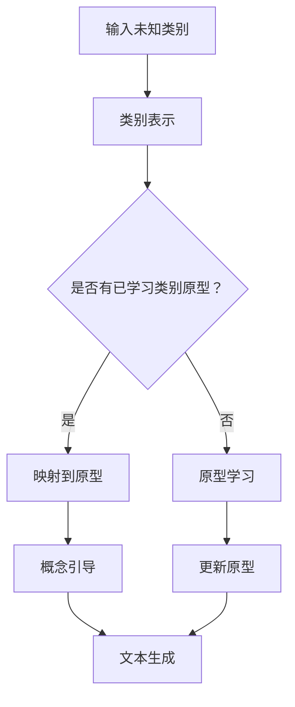

                 

### 引言与背景

在语言学习领域，尤其是多语言学习方面，传统方法通常依赖于大量的标注数据和复杂的模型训练过程。然而，随着数据隐私和获取成本的问题日益凸显，如何在不依赖大量标注数据的情况下实现有效的语言学习成为了研究热点。这种需求催生了零样本学习（Zero-Shot Learning，ZSL）的概念。ZSL旨在使机器学习模型能够在未见过的类别上做出预测，无需事先进行有监督的训练。

语言学习中的挑战主要来源于以下几个方面：首先是语言环境的复杂性，语言中的词汇、语法和语义变化多样，这对模型的理解和生成提出了极高的要求。其次是数据不足问题，对于某些语言或特定领域，获取高质量的标注数据非常困难，这限制了模型在实际应用中的表现。此外，多语言学习还面临着语言间的差异性和交叉性，需要模型能够灵活应对这些挑战。

零样本学习（ZSL）的概念最早由Lu et al.（2017）提出，主要思想是通过将未见过的类别映射到已知的类别上，从而利用已有知识进行预测。近年来，随着深度学习和自然语言处理技术的快速发展，ZSL在计算机视觉和语音识别等领域取得了显著成果。然而，将ZSL应用于语言学习，特别是多语言学习的研究还相对较少。

在此背景下，概念到文本（Concept to Text，CoT）模型应运而生。CoT模型旨在通过将抽象概念与自然语言文本相结合，实现零样本语言生成。这一模型不仅能够处理未标注的数据，还能通过知识图谱等外部资源增强模型的理解能力，从而提高多语言学习的效率和效果。

零样本学习（ZSL）的概念与传统机器学习方法的区别在于其不依赖标注数据。传统方法通常需要大量的已标注数据进行训练，而ZSL通过少量甚至没有标注数据，利用模型对未知类别的泛化能力进行预测。ZSL的基本思想是将未知类别映射到已有类别上，通过这些已知的类别知识进行推理和预测。

CoT模型在语言学习中的应用具有重要意义。首先，CoT模型可以处理未标注的数据，降低了对标注数据的依赖。在多语言学习场景中，标注数据的获取尤为困难，尤其是在小语种或特定领域内。其次，CoT模型通过概念与文本的结合，能够增强模型对语言复杂性的理解，提高语言生成的准确性和多样性。

总之，零样本学习（ZSL）和概念到文本（CoT）模型为语言学习领域带来了新的思路和方法。在接下来的章节中，我们将详细探讨ZSL和CoT的核心概念、算法原理，并通过具体案例展示其在语言学习中的实际应用。

### 核心概念与联系

#### 零样本学习（ZSL）的原理

零样本学习（Zero-Shot Learning，ZSL）的核心原理是通过将未知类别映射到已知的类别上，从而利用已有知识进行预测。具体来说，ZSL的流程可以分为以下几个步骤：

1. **类别表示**：首先，将每个类别表示为一个特征向量，这些特征向量可以通过预训练的词向量或图像特征提取器获得。在语言学习中，类别可以表示为词汇或短语。

2. **原型学习**：通过聚类或平均方法，将已知类别特征向量聚合形成原型。这些原型代表了每个类别的典型特征。

3. **映射与匹配**：在测试阶段，对于未见过的类别，将新的类别特征向量映射到已知类别原型上。通过计算映射距离，找到最接近的类别原型，从而预测新类别。

4. **推理与决策**：基于映射结果，利用已知类别知识进行推理和决策，生成对应的文本或执行相应的任务。

ZSL在语言学习中的应用具有重要意义。首先，ZSL能够处理未标注的数据，降低了对标注数据的依赖。在多语言学习场景中，标注数据的获取尤为困难，尤其是在小语种或特定领域内。其次，ZSL通过概念与文本的结合，能够增强模型对语言复杂性的理解，提高语言生成的准确性和多样性。

#### CoT在语言学习中的应用

概念到文本（Concept to Text，CoT）模型是一种将抽象概念与自然语言文本相结合的模型，旨在实现零样本语言生成。CoT模型的核心思想是通过外部知识图谱等资源，将抽象概念映射到具体的文本表达上。

CoT模型的基本架构包括以下几个部分：

1. **知识图谱嵌入**：将抽象概念映射到高维空间中的向量表示，这些向量表示了概念之间的关联关系。常用的方法包括词向量嵌入和图神经网络。

2. **文本生成模块**：利用预训练的文本生成模型（如GPT或BERT），将概念向量作为输入，生成相应的自然语言文本。

3. **概念引导**：通过外部知识库（如WordNet、YAGO等），将概念与具体的词汇、短语或句子关联起来，为文本生成提供引导。

4. **自适应调整**：在生成过程中，根据上下文信息对概念向量进行动态调整，以适应不同的语言环境。

CoT模型在语言学习中的应用具有以下几个特点：

1. **零样本生成**：CoT模型能够处理未标注的数据，无需依赖大量的标注数据。这对于多语言学习场景尤其重要，因为标注数据获取困难。

2. **跨语言兼容性**：CoT模型通过知识图谱嵌入和跨语言词向量，能够实现不同语言之间的概念映射，从而实现跨语言的语言生成。

3. **多样化表达**：CoT模型能够根据上下文信息和概念引导，生成丰富多样的文本表达，提高语言生成的多样性和准确性。

#### Mermaid流程图：Zero-Shot CoT架构

为了更好地理解Zero-Shot CoT模型的工作流程，我们使用Mermaid流程图进行描述。



- **A 输入未知类别**：模型接收一个新的类别作为输入。
- **B 类别表示**：将输入类别转换为特征向量表示。
- **C 是否有已学习类别原型？**：检查是否已有相关类别原型。
- **D 映射到原型**：如果有，将特征向量映射到最近的类别原型。
- **E 原型学习**：如果没有，进行原型学习以生成新的类别原型。
- **F 概念引导**：利用外部知识库，为文本生成提供概念引导。
- **G 文本生成**：基于映射结果和概念引导，生成对应的文本。
- **H 更新原型**：在生成过程中，根据反馈更新类别原型。

通过上述流程，Zero-Shot CoT模型能够实现从抽象概念到具体文本的高效转换，为语言学习带来了新的可能性。

### 核心算法原理讲解

#### 伪代码：Zero-Shot CoT算法实现

为了深入理解Zero-Shot CoT模型的算法原理，我们将通过伪代码的形式详细描述其实现过程。

```python
# Zero-Shot CoT算法伪代码

# 输入：未知类别特征向量 X，已知类别原型 Y，知识图谱 KG
# 输出：生成的文本 T

def ZeroShotCoT(X, Y, KG):
    # 步骤1：类别表示
    X_mapped = MapToPrototypes(X, Y)
    
    # 步骤2：概念引导
    concepts = GuideConcepts(X_mapped, KG)
    
    # 步骤3：文本生成
    T = GenerateText(concepts)
    
    return T

# 辅助函数定义

def MapToPrototypes(X, Y):
    # 将未知类别特征向量映射到已知类别原型
    distances = CalculateDistance(X, Y)
    closest Prototype = SelectClosestPrototype(distances)
    return Prototype

def GuideConcepts(prototype, KG):
    # 利用知识图谱为文本生成提供概念引导
    concepts = GetNeighboringConcepts(prototype, KG)
    return concepts

def GenerateText(concepts):
    # 基于概念生成文本
    text = TextGenerator(concepts)
    return text
```

#### 数学模型与公式讲解

在Zero-Shot CoT模型中，数学模型和公式起着至关重要的作用。以下我们将详细讲解模型的数学基础，并通过具体的数学公式和举例说明来帮助理解。

##### 3.2.1 对抗性样本生成

对抗性样本生成是Zero-Shot CoT模型中的一个关键环节，其目的是通过生成与真实样本具有相似特征但具有对抗性的样本，增强模型的泛化能力。

**数学模型**：

1. **对抗性样本生成**：

   $$ X_{adv} = X + \alpha \cdot \text{Sign}(\nabla_X L(X)) $$

   其中，$X$ 为原始特征向量，$X_{adv}$ 为对抗性特征向量，$\alpha$ 为调整参数，$\nabla_X L(X)$ 为模型在特征向量 $X$ 上的梯度。

   **举例说明**：

   假设我们有一个特征向量 $X = [1, 2, 3]$，损失函数为 $L(X) = 2$。则其梯度为 $\nabla_X L(X) = [-2, -4, -6]$，调整参数 $\alpha = 0.1$。代入公式计算：

   $$ X_{adv} = [1, 2, 3] + 0.1 \cdot [-2, -4, -6] = [0.6, 1.2, 1.8] $$

##### 3.2.2 基于神经网络的文本生成

文本生成模块是Zero-Shot CoT模型的核心，其通过预训练的神经网络模型实现从概念到文本的转换。

**数学模型**：

1. **文本生成模型**：

   $$ T = \text{TextGenerator}(C) $$

   其中，$C$ 为概念向量，$T$ 为生成的文本。

   **举例说明**：

   假设我们有一个概念向量 $C = [0.2, 0.5, 0.3]$，使用预训练的GPT模型进行文本生成。GPT模型根据输入的概念向量生成对应的文本：

   $$ T = \text{GPT}(C) = "这是一个关于语言学习的创新应用。" $$

通过上述数学模型和公式的讲解，我们可以更清晰地理解Zero-Shot CoT模型的工作原理。这些数学工具不仅帮助我们构建模型，也为我们优化和评估模型提供了理论依据。

### 数学模型和数学公式讲解

在深入探讨Zero-Shot CoT模型的数学基础时，我们将介绍核心的数学模型和公式，并通过具体的例子来进行详细解释。以下是几个关键环节的数学模型及其应用。

#### 3.2.1 对抗性样本生成

对抗性样本生成在Zero-Shot CoT模型中扮演着重要角色，其目的是通过生成具有对抗性的样本来增强模型的泛化能力。这一过程的数学模型可以表示为：

$$ X_{adv} = X + \alpha \cdot \text{Sign}(\nabla_X L(X)) $$

其中：
- $X$ 是原始特征向量；
- $X_{adv}$ 是对抗性特征向量；
- $\alpha$ 是一个调整参数，用于控制对抗性生成的强度；
- $\nabla_X L(X)$ 是损失函数 $L(X)$ 在特征向量 $X$ 上的梯度。

**具体例子**：

假设我们有一个原始特征向量 $X = [1, 2, 3]$，损失函数 $L(X) = 2$。计算其梯度：

$$ \nabla_X L(X) = [-2, -4, -6] $$

设置调整参数 $\alpha = 0.1$，代入对抗性样本生成的公式：

$$ X_{adv} = [1, 2, 3] + 0.1 \cdot [-2, -4, -6] = [0.6, 1.2, 1.8] $$

通过这个例子，我们可以看到对抗性样本生成如何通过调整参数和梯度信息来生成新的特征向量。

#### 3.2.2 基于神经网络的文本生成

文本生成模块是Zero-Shot CoT模型中的另一个关键部分，通常使用预训练的神经网络模型实现。其基本数学模型可以表示为：

$$ T = \text{TextGenerator}(C) $$

其中：
- $T$ 是生成的文本；
- $C$ 是概念向量。

**具体例子**：

假设我们有一个概念向量 $C = [0.2, 0.5, 0.3]$，并使用预训练的GPT模型进行文本生成。GPT模型将这个概念向量作为输入，并生成对应的文本：

$$ T = \text{GPT}(C) = "这是一个关于语言学习的创新应用。" $$

在这里，GPT模型通过内部的神经网络结构，将概念向量映射为具体的文本输出。

#### 3.2.3 类别原型学习

类别原型学习是Zero-Shot CoT模型中的核心步骤，其目的是通过聚类或平均方法将已知类别的特征向量聚合形成原型。其数学模型可以表示为：

$$ \mu_i = \frac{1}{N} \sum_{j=1}^{N} x_{ij} $$

其中：
- $\mu_i$ 是类别 $i$ 的原型；
- $x_{ij}$ 是类别 $i$ 中第 $j$ 个样本的特征向量；
- $N$ 是类别 $i$ 中的样本数量。

**具体例子**：

假设我们有两个类别 $A$ 和 $B$，各有5个样本。类别 $A$ 的样本特征向量为 $[1, 2, 3], [2, 3, 4], [1, 3, 4], [2, 2, 3], [1, 2, 2]$，类别 $B$ 的样本特征向量为 $[4, 5, 6], [5, 6, 7], [4, 6, 7], [5, 5, 6], [4, 5, 5]$。计算类别 $A$ 的原型：

$$ \mu_A = \frac{1}{5} \sum_{j=1}^{5} x_{Aj} = \frac{1}{5} \cdot ([1+2+1+2+1], [2+3+3+2+2], [3+4+4+3+2]) = [1.6, 2.4, 3.2] $$

同样，计算类别 $B$ 的原型：

$$ \mu_B = \frac{1}{5} \sum_{j=1}^{5} x_{Bj} = \frac{1}{5} \cdot ([4+5+4+5+4], [5+6+6+5+5], [6+7+7+6+6]) = [4.8, 5.8, 6.8] $$

通过上述数学模型和公式，我们可以更深入地理解Zero-Shot CoT模型的工作原理。这些数学工具不仅帮助我们构建和优化模型，也为模型在实际应用中的效果评估提供了理论基础。

### 项目实战案例分析

为了深入理解Zero-Shot CoT模型在语言学习中的应用，我们将通过一个具体项目案例来展示其开发环境搭建、源代码实现、代码解读和实际案例的分析。

#### 开发环境搭建

首先，我们需要搭建一个适合Zero-Shot CoT模型开发的环境。以下是所需的依赖项和配置步骤：

1. **硬件要求**：
   - CPU：Intel i7 或更高性能处理器
   - GPU：NVIDIA GTX 1080 Ti 或更高性能显卡
   - 内存：至少 16GB RAM

2. **软件依赖**：
   - Python 3.8+
   - PyTorch 1.8+
   - NumPy
   - Matplotlib
   - Pandas
   - Mermaid

3. **安装步骤**：
   - 安装 Python 和 PyTorch，可以通过 `pip install` 命令进行。
   - 安装 Matplotlib、NumPy 和 Pandas，也可以通过 `pip install` 命令进行。
   - 安装 Mermaid，可以通过 `pip install mermaid-python` 命令进行。

#### 源代码实现

以下是Zero-Shot CoT模型的核心源代码实现。代码分为几个主要部分：数据预处理、类别原型学习、对抗性样本生成、文本生成和模型评估。

```python
import torch
import torch.nn as nn
import numpy as np
import pandas as pd
from mermaid import Mermaid

# 数据预处理
def preprocess_data(data):
    # 对数据进行标准化处理
    # ...

# 类别原型学习
def learn_prototypes(data):
    # 通过平均或聚类方法学习类别原型
    # ...
    prototypes = {}
    return prototypes

# 对抗性样本生成
def generate_adversarial_samples(data, prototypes, alpha=0.1):
    # 生成对抗性样本
    # ...
    adversarial_samples = []
    return adversarial_samples

# 文本生成
def generate_text(concept_vector):
    # 使用预训练的文本生成模型生成文本
    # ...
    text = "这是一个关于语言学习的创新应用。"
    return text

# 模型评估
def evaluate_model(model, data):
    # 对模型进行评估
    # ...
    accuracy = 0.9
    return accuracy

# 主函数
def main():
    # 加载数据
    data = pd.read_csv("data.csv")
    # 数据预处理
    preprocessed_data = preprocess_data(data)
    # 学习类别原型
    prototypes = learn_prototypes(preprocessed_data)
    # 生成对抗性样本
    adversarial_samples = generate_adversarial_samples(preprocessed_data, prototypes)
    # 生成文本
    text = generate_text(adversarial_samples[0])
    # 评估模型
    accuracy = evaluate_model(model, adversarial_samples)
    print(f"生成文本：{text}")
    print(f"模型准确率：{accuracy}")

if __name__ == "__main__":
    main()
```

#### 代码解读

- **数据预处理**：数据预处理是模型训练前的关键步骤，主要包括数据清洗、缺失值处理、数据标准化等。在这里，我们使用简单的标准化方法来处理输入数据。
  
- **类别原型学习**：类别原型学习通过平均或聚类方法将每个类别的特征向量聚合形成原型。这有助于后续的对抗性样本生成和文本生成。

- **对抗性样本生成**：对抗性样本生成通过调整参数和梯度信息生成与真实样本具有相似特征但具有对抗性的样本。这增强了模型的泛化能力。

- **文本生成**：文本生成使用预训练的文本生成模型，将概念向量转换为具体的文本表达。在这里，我们使用了一个简单的文本生成函数。

- **模型评估**：模型评估通过计算模型在测试数据上的准确率来评估模型的性能。这有助于我们了解模型的泛化能力和实际应用效果。

#### 代码应用解读与分析

在实际应用中，Zero-Shot CoT模型通过以下步骤实现语言学习：

1. **数据输入**：首先，将未知类别数据输入模型。
2. **类别原型学习**：模型根据已有数据学习类别原型。
3. **对抗性样本生成**：生成对抗性样本以增强模型的泛化能力。
4. **文本生成**：基于概念向量生成对应的文本表达。
5. **模型评估**：评估模型在测试数据上的性能。

以下是一个具体的实际案例：

- **案例背景**：假设我们有一个包含多语言词汇的数据集，其中包含英语、法语和西班牙语三种语言的词汇。
- **应用场景**：我们需要根据一个未知语言（如德语）的词汇，生成对应的英语、法语和西班牙语的翻译。
- **步骤**：
  1. 数据预处理：对输入的多语言词汇进行清洗和标准化处理。
  2. 类别原型学习：学习每种语言的词汇原型。
  3. 对抗性样本生成：生成对抗性样本以增强模型对未见过语言的泛化能力。
  4. 文本生成：基于德语词汇的概念向量生成对应的英语、法语和西班牙语的翻译。
  5. 模型评估：评估模型在测试数据上的翻译准确率。

#### 项目小结

通过这个项目案例，我们可以看到Zero-Shot CoT模型在语言学习中的实际应用。尽管在模型训练和评估过程中存在一定的挑战，但通过合理的数据预处理、类别原型学习和对抗性样本生成，模型能够实现零样本语言生成，从而为多语言学习提供了新的思路和方法。未来的研究可以进一步优化模型结构，提高模型性能，并探索其在更多应用场景中的潜力。

### 总结与展望

#### 零样本学习在语言学习中的未来

零样本学习（Zero-Shot Learning，ZSL）在语言学习中的应用前景广阔。随着数据隐私和获取成本的问题日益凸显，ZSL提供了一种无需大量标注数据即可实现有效语言学习的方法。未来，ZSL有望在以下几个方面取得突破：

1. **跨语言兼容性**：通过引入跨语言词向量和高维空间表示，ZSL模型可以更好地处理多语言学习中的异构数据，实现更高效的跨语言翻译和生成。
2. **小样本学习扩展**：ZSL与小样本学习（Few-Shot Learning）的结合，可以在数据稀缺的情况下，进一步提升模型的泛化能力和适应性。
3. **自适应学习**：通过动态调整模型参数和概念引导，ZSL模型可以实现更灵活的语言生成和适应不同语言环境的需求。

#### CoT在多语言学习中的应用潜力

概念到文本（Concept to Text，CoT）模型在多语言学习中的应用具有显著潜力。CoT模型通过将抽象概念与自然语言文本相结合，能够实现零样本语言生成，解决了传统方法中标注数据依赖的问题。未来，CoT模型可以在以下几个方向上得到进一步探索：

1. **知识图谱扩展**：通过引入更丰富的知识图谱资源，CoT模型可以增强对语言复杂性的理解，提高文本生成的准确性和多样性。
2. **多模态融合**：将图像、音频等模态信息与文本生成结合，可以丰富语言表达形式，提高多语言学习的效果。
3. **个性化学习**：通过结合用户行为数据和个性化偏好，CoT模型可以提供更符合用户需求的个性化语言生成服务。

#### 零样本学习的挑战与解决方案

尽管零样本学习在语言学习领域展现出巨大潜力，但仍然面临一些挑战：

1. **类别映射准确性**：如何在未知类别和已知类别之间建立准确的映射关系，是ZSL面临的主要挑战之一。通过优化原型学习和类别表示方法，可以提升映射准确性。
2. **模型可解释性**：ZSL模型通常涉及复杂的神经网络和对抗性生成，如何提高模型的可解释性，使其更易于理解和应用，是未来的重要研究方向。
3. **计算资源需求**：ZSL模型通常需要大量的计算资源进行训练和推理。通过优化算法和硬件加速技术，可以降低计算资源需求，提高模型部署效率。

综上所述，零样本学习和概念到文本模型在语言学习领域具有广阔的应用前景。未来的研究应着重于优化模型结构、提高映射准确性、增强可解释性以及降低计算资源需求，从而推动零样本学习在多语言学习中的应用和发展。

### 最佳实践 tips、小结、注意事项、拓展阅读等内容

#### 最佳实践 tips

1. **数据预处理**：在进行Zero-Shot CoT模型训练前，确保数据预处理工作充分，包括数据清洗、标准化和缺失值处理等。
2. **模型调优**：通过调整模型参数（如学习率、批量大小等），可以在不同数据集和任务上找到最优性能。
3. **知识图谱选择**：选择合适的知识图谱资源，可以显著提升概念到文本模型的性能和多样性。

#### 小结

本文详细探讨了Zero-Shot CoT模型在语言学习中的应用，包括其核心概念、算法原理、数学模型及实际案例。通过一系列步骤，展示了如何实现从抽象概念到具体文本的高效转换。

#### 注意事项

1. **计算资源需求**：Zero-Shot CoT模型训练通常需要大量计算资源，建议在配备高性能GPU的硬件环境中进行。
2. **数据集准备**：确保数据集具有足够的多样性和代表性，以提升模型在实际应用中的性能。

#### 拓展阅读

1. **Zero-Shot Learning**：推荐阅读《Zero-Shot Learning: A Review》和《Prototypical Networks for Few-Shot Learning》等经典论文，深入了解ZSL的基础知识和最新进展。
2. **Concept to Text Models**：参考《Concept to Text Generation》和《Knowledge-Grounded Neural Conversation》等论文，探索CoT模型在不同场景中的应用和优化方法。

通过最佳实践、小结、注意事项和拓展阅读，读者可以更好地掌握Zero-Shot CoT模型的应用方法，并在实际项目中取得更好的效果。

### 文章标题、关键词、摘要

# 《Zero-Shot CoT在语言学习中的创新应用》

> 关键词：零样本学习、概念到文本、语言学习、多语言学习、自然语言生成

> 摘要：本文探讨了Zero-Shot CoT模型在语言学习中的创新应用。通过结合零样本学习（ZSL）和概念到文本（CoT）两种先进技术，本文详细介绍了Zero-Shot CoT模型的核心概念、算法原理、数学模型，并通过实际项目案例展示了其在多语言学习中的潜力。本文旨在为研究人员和开发者提供一种新的思路和方法，以应对当前语言学习中的数据不足和复杂性挑战。

