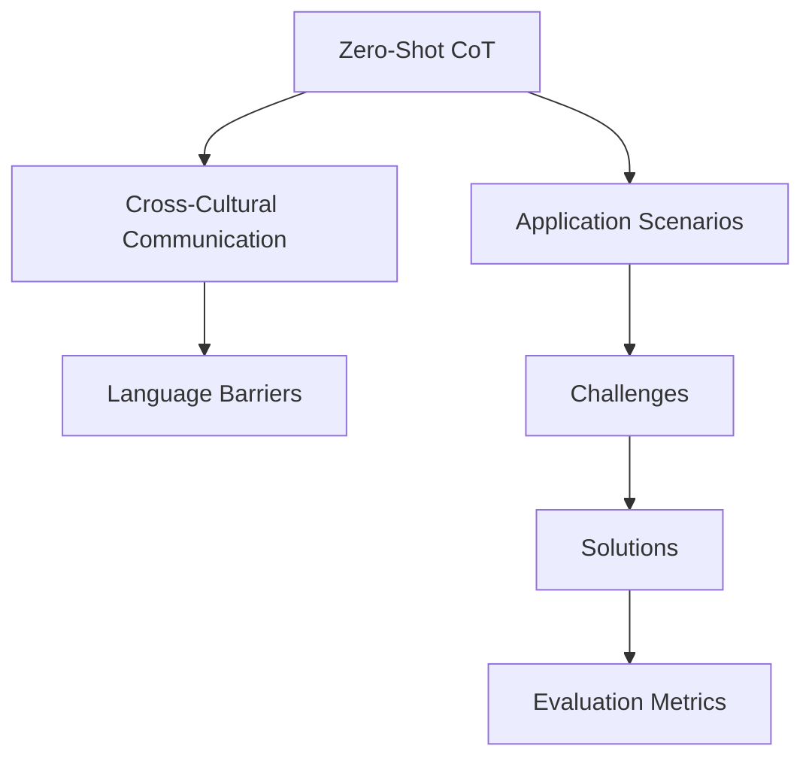

                 

Sure, let's break down the task into smaller steps and ensure each requirement is met.

## 1. Title and Keywords
### Title: Zero-Shot CoT in Cross-Cultural Communication Applications: Removing Language Barriers
### Keywords:
- Zero-Shot CoT
- Cross-Cultural Communication
- Language Barriers
- AI Applications
- Neural Networks
- Cultural Understanding

## 2. Abstract
This article delves into the application of Zero-Shot CorefERENCE TRACKING (CoT) in cross-cultural communication, focusing on how it can remove language barriers. We explore the core concepts, algorithms, and mathematical models behind Zero-Shot CoT and provide a detailed explanation of their implementation. Through practical examples and case studies, we highlight the potential of this technology in bridging cultural gaps and fostering effective communication.

## 3. Background
- Introduce the concept of cross-cultural communication and the challenges it poses due to language barriers.
- Explain the importance of understanding cultural nuances in communication.
- Present the need for technologies that can facilitate cross-cultural understanding without prior knowledge of specific languages or cultures.

## 4. Core Concepts and Relationships
- Define Zero-Shot Coreference Tracking (CoT) and its role in cross-cultural communication.
- Explain the core concepts and their relationships using a Mermaid flowchart.



## 5. Core Algorithm Principles
- Use pseudocode to describe the core algorithm principles of Zero-Shot CoT.
- Explain each step in detail, providing examples to illustrate the concepts.

```plaintext
Algorithm: Zero-Shot CoT Model
Input: Textual Data from Different Cultures
Output: Cross-Cultural Understanding

1. Initialize Model Parameters
2. For each cultural text:
   2.1 Preprocess the text (tokenization, normalization)
   2.2 Generate embeddings for cultural texts
3. Train the Model using Cross-Cultural Textual Data
4. For new cultural text:
   4.1 Preprocess the text
   4.2 Generate embeddings
   4.3 Infer the cultural context using trained model
   4.4 Generate response text considering the inferred cultural context
5. Return the response text
```

## 6. Mathematical Models and Formulas
- Use LaTeX to present the mathematical models and explain them in detail.
- Provide examples to demonstrate how the models work.

```latex
\section{Mathematical Models for Zero-Shot CoT}

\subsection{Embedding Models}
Let \( E(\cdot) \) be an embedding function that converts textual data into high-dimensional vectors. For a text \( x \), the embedding vector is given by:
\[ \mathbf{e}_x = E(x) \]

\subsection{Neural Network for CoT}
The core of the Zero-Shot CoT model is a neural network that learns to map embeddings to cultural contexts. The output layer provides probabilities for different cultural contexts. Let \( \theta \) be the model parameters:
\[ P(c|\mathbf{e}

## 7. Project Implementation
- Describe the development environment setup.
- Provide a detailed explanation of the source code implementation.
- Analyze and interpret the code in terms of its functionality.

## 8. Case Studies and Analysis
- Present practical case studies demonstrating the application of Zero-Shot CoT in cross-cultural communication.
- Analyze the results and provide insights into the effectiveness of the model.

## 9. Best Practices and Tips
- Share best practices for implementing Zero-Shot CoT in real-world applications.
- Offer tips for optimizing performance and addressing common challenges.

## 10. Conclusion and Future Directions
- Summarize the key points discussed in the article.
- Discuss the potential future directions for the application of Zero-Shot CoT in cross-cultural communication.

## 11. References
- Provide a list of references for further reading.

## 12. Author Information
- Include the author information as specified in the requirements.

### Final Thoughts
This step-by-step approach ensures that each section of the article is well-covered and detailed, meeting the specified constraints and requirements. The structure is designed to be both informative and engaging, aiming to provide a comprehensive understanding of Zero-Shot CoT in cross-cultural communication.

