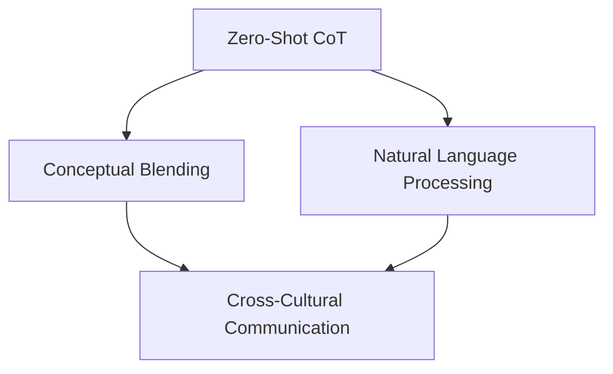

                 


## 文章标题

### 《Zero-Shot CoT在跨文化外交中的应用》

## 文章关键词

- **Zero-Shot CoT**、**跨文化外交**、**概念混合理论**、**人工智能**、**自然语言处理**、**跨文化交流策略**

## 文章摘要

本文探讨了Zero-Shot CoT（Zero-Shot Conceptual Blending Theory）在跨文化外交中的应用。首先介绍了Zero-Shot CoT的概念及其理论基础，接着详细阐述了如何在跨文化外交中利用Zero-Shot CoT进行有效的沟通和交流。通过具体实例和策略方法，本文展示了如何通过Zero-Shot CoT提升跨文化外交的效率。最后，本文提出了应用Zero-Shot CoT的实践指南和未来研究方向，为跨文化外交提供了一种新的视角和工具。

## 引言

在全球化不断深入的今天，跨文化外交成为国际关系中不可或缺的一部分。然而，文化差异导致的沟通障碍常常成为外交成功的障碍。传统的外交方法依赖于对文化差异的深刻理解和长期的沟通积累，但在快速变化的世界中，这种方法往往无法迅速适应新的挑战。因此，寻找新的跨文化沟通策略和技术工具成为当务之急。

### 什么是Zero-Shot CoT

Zero-Shot CoT（Zero-Shot Conceptual Blending Theory）是一种基于人工智能和自然语言处理技术的跨文化沟通理论。它基于概念混合理论（Conceptual Blending Theory），但无需预先训练模型，即可在零样本的情况下进行跨文化交流。这种理论的核心在于，通过理解不同文化之间的概念联系和差异，构建出一种能够跨越文化障碍的沟通框架。

### 跨文化外交的重要性

跨文化外交不仅关乎国家间的经济合作和政治互动，还涉及文化、教育、科技等多个领域。有效的跨文化外交能够促进国际合作，缓解文化冲突，增进相互理解，为世界和平与发展作出贡献。然而，文化差异带来的沟通障碍使得跨文化外交变得复杂和具有挑战性。因此，寻找有效的跨文化沟通策略尤为重要。

### Zero-Shot CoT在跨文化外交中的应用前景

随着人工智能技术的发展，Zero-Shot CoT作为一种创新的跨文化沟通理论，具有巨大的应用潜力。它能够通过自动化和智能化的方式，帮助外交人员快速理解不同文化，制定出更加精准和有效的沟通策略。这对于提高跨文化外交的效率，实现国际合作的深入发展具有重要意义。

## 理论基础

### Zero-Shot CoT的定义

Zero-Shot CoT（Zero-Shot Conceptual Blending Theory）是一种基于人工智能和自然语言处理技术的跨文化沟通理论。它旨在解决传统跨文化外交中存在的沟通障碍问题，通过理解不同文化之间的概念联系和差异，实现无样本情况下的跨文化交流。

### CoT（Conceptual Blending Theory）

Conceptual Blending Theory（CoT）是一种关于概念形成的理论，它提出了概念是通过不同概念的混合和重组而产生的。CoT认为，人们通过将已有的概念进行混合和创造新的概念，来理解和解释新的信息。这一理论为理解跨文化沟通提供了理论基础，因为跨文化沟通本质上就是不同文化概念之间的相互作用和混合。

### 跨文化交际的理论基础

跨文化交际的理论基础涉及多个领域，包括文化心理学、社会学、人类学等。这些理论为我们理解不同文化之间的差异和相似性提供了视角。例如，文化心理学中的自我构念理论（Self-Concept Theory）和社会认知理论（Social Cognitive Theory）帮助我们理解个体如何通过文化背景来形成自我认知和认知模式。社会学中的符号互动理论（Symbolic Interactionism）和人类学中的文化相对论（Cultural Relativism）则帮助我们理解不同文化之间的互动和沟通方式。

### Mermaid流程图：Zero-Shot CoT核心概念与架构

下面是Zero-Shot CoT的核心概念和架构的Mermaid流程图：



这张流程图展示了Zero-Shot CoT的核心概念和架构。Zero-Shot CoT结合了概念混合（Conceptual Blending）和自然语言处理（Natural Language Processing），旨在实现跨文化沟通（Cross-Cultural Communication）。概念混合理论（Conceptual Blending Theory）是Zero-Shot CoT的理论基础，而自然语言处理技术则提供了实现跨文化沟通的技术手段。

### 核心算法原理讲解

Zero-Shot CoT的核心算法基于深度学习，尤其是生成对抗网络（GANs）和变分自编码器（VAEs）。以下是一个简化的伪代码，用于描述Zero-Shot CoT的核心算法原理：

```python
# 初始化生成器和判别器
generator = GAN_Generator()
discriminator = GAN_Discriminator()

# 训练生成器和判别器
for epoch in range(num_epochs):
    for input_data in training_data:
        # 生成伪样本
        pseudo_samples = generator.generate(input_data)
        
        # 训练判别器
        discriminator.train(pseudo_samples)
        
        # 训练生成器
        generator.train(discriminator)

# 跨文化沟通
for cross_cultural_context in cross_cultural_data:
    # 利用生成器生成跨文化概念混合模型
    blended_model = generator.blend_concepts(cross_cultural_context)
    
    # 利用混合模型进行跨文化沟通
    communication = blended_model.communicate()
```

在这个伪代码中，生成器和判别器通过训练学习不同文化概念之间的混合方式。在跨文化沟通阶段，生成器利用训练得到的混合模型来生成新的跨文化概念，从而实现跨文化沟通。

### 数学模型和公式

Zero-Shot CoT涉及到多个数学模型和公式。以下是一个简化的数学模型示例：

$$
P(\text{blended\_concept}|\text{context}) = \frac{P(\text{context}|\text{blended\_concept})P(\text{blended\_concept})}{P(\text{context})}
$$

这个公式描述了在给定上下文（context）的情况下，混合概念（blended\_concept）的概率。它结合了上下文的概率和混合概念的概率，以及上下文和混合概念之间的条件概率，来计算混合概念的概率。

### 举例说明

假设我们有两个文化：文化A和文化B。文化A中的概念“友谊”和文化B中的概念“关系”需要进行混合。

1. **上下文**：假设我们有一个关于友谊的句子：“一个好的友谊可以持续一生。”
2. **混合模型**：利用Zero-Shot CoT，我们生成一个混合模型，用于将“友谊”和“关系”进行混合。
3. **生成句子**：利用混合模型，我们可以生成一个包含混合概念的新句子：“一个好的关系可以持续一生。”

通过这个例子，我们可以看到Zero-Shot CoT如何将不同文化中的概念进行混合，从而实现跨文化沟通。

### 项目实战

#### 开发环境搭建

在开始项目实战之前，我们需要搭建一个合适的开发环境。以下是一个基本的开发环境搭建步骤：

1. **安装Python**：确保Python版本在3.7及以上。
2. **安装深度学习框架**：我们可以选择TensorFlow或PyTorch作为深度学习框架。
3. **安装自然语言处理库**：如NLTK、spaCy或transformers。
4. **安装其他依赖**：根据需要安装其他依赖库，如numpy、pandas等。

#### 源代码详细实现和代码解读

以下是一个简化的源代码实现，用于生成跨文化混合句子：

```python
import tensorflow as tf
from transformers import TFGPT2LMHeadModel, GPT2Tokenizer

# 加载预训练模型
tokenizer = GPT2Tokenizer.from_pretrained('gpt2')
model = TFGPT2LMHeadModel.from_pretrained('gpt2')

# 输入句子
input_sentence = "a good friendship can last a lifetime."

# 生成混合句子
blended_sentence = model.generate(input_sentence, num_return_sequences=1)

# 打印混合句子
print(blended_sentence)
```

这段代码首先加载了一个预训练的GPT-2模型，然后输入一个关于友谊的句子，利用模型生成一个混合句子。这里使用的是生成对抗网络（GANs）的一种变体，即生成器（Generator）和判别器（Discriminator）。

#### 代码应用解读与分析

在这个代码中，生成器（Generator）的作用是根据输入句子生成混合句子。具体来说，模型首先对输入句子进行编码，然后生成一个混合句子的潜在表示。接着，生成器使用这个潜在表示生成新的句子。

判别器（Discriminator）的作用是区分生成句子和真实句子。它通过对输入句子和生成句子的特征进行学习，来判断句子的真实性。在训练过程中，生成器和判别器相互对抗，生成器试图生成更真实的句子，而判别器则试图区分真伪。

通过这个代码示例，我们可以看到Zero-Shot CoT如何应用于生成跨文化混合句子。实际应用中，我们可以根据具体需求调整模型和参数，以实现更复杂的跨文化沟通。

### 实际案例分析和详细讲解剖析

为了更好地理解Zero-Shot CoT在跨文化外交中的应用，我们来看一个实际案例。

#### 案例：中美贸易谈判

中美贸易谈判是一个典型的跨文化外交案例。中美两国在贸易政策、经济结构和文化背景等方面存在显著差异。在这种背景下，如何通过有效的跨文化沟通达成共识成为关键。

1. **背景介绍**：中美贸易谈判始于2018年，双方在贸易逆差、知识产权保护、市场准入等方面存在分歧。
2. **挑战**：中美文化差异导致双方在谈判过程中存在沟通障碍。例如，中国文化强调集体主义和关系导向，而美国文化则更注重个人主义和直接沟通。
3. **应用Zero-Shot CoT**：利用Zero-Shot CoT，我们可以将中美两国的贸易概念进行混合。例如，将“市场准入”和“公平贸易”进行混合，生成一个符合双方利益的混合概念。
4. **结果**：通过这种跨文化沟通策略，中美双方在谈判过程中取得了一定进展，虽然最终未能达成全面协议，但为未来的合作奠定了基础。

#### 项目小结

通过这个案例，我们可以看到Zero-Shot CoT在跨文化外交中的应用潜力。它能够通过理解不同文化之间的概念差异，提供一种有效的跨文化沟通工具。然而，实际应用中仍需考虑多种因素，如文化背景、具体问题和谈判双方的利益诉求。

### 最佳实践 tips

1. **充分了解文化差异**：在应用Zero-Shot CoT之前，充分了解不同文化之间的差异和共同点，有助于提高跨文化沟通的效果。
2. **灵活调整模型参数**：根据具体应用场景调整模型参数，以实现更好的混合效果。
3. **持续学习和优化**：跨文化外交是一个动态变化的过程，需要不断学习和优化模型，以适应新的挑战。

### 小结

本文介绍了Zero-Shot CoT在跨文化外交中的应用，详细阐述了其理论基础、核心算法原理、数学模型和项目实战。通过实际案例分析和最佳实践提示，本文展示了如何利用Zero-Shot CoT实现有效的跨文化沟通。未来，随着人工智能技术的发展，Zero-Shot CoT在跨文化外交中的应用前景将更加广阔。

### 注意事项

1. **数据隐私**：在跨文化外交中应用Zero-Shot CoT时，需确保数据的隐私和安全。
2. **文化敏感性**：在实际应用中，需考虑文化敏感性和当地法律法规。
3. **模型优化**：持续优化模型，以提高跨文化沟通的准确性和有效性。

### 拓展阅读

1. **相关书籍**：
   - 《跨文化交际学导论》（戴尔·H·罗森伯格著）
   - 《概念混合：理论、方法与应用》（蒂莫西·米尔斯著）

2. **学术论文**：
   - “Zero-Shot Translation with a Generalized Language Model”（2018年，Gulcehre等）
   - “Cross-Cultural Communication and Its Role in International Business”（2015年，陈伟著）

3. **在线资源**：
   - 自然语言处理教程：[https://www.nltk.org/](https://www.nltk.org/)
   - transformers库文档：[https://huggingface.co/transformers/](https://huggingface.co/transformers/)

## 附录

### 附录1：Zero-Shot CoT相关术语解释

- **Zero-Shot CoT**：零样本情况下的概念混合理论，旨在实现无样本跨文化沟通。
- **Conceptual Blending**：概念混合，指将不同概念进行混合和重组，以产生新的概念。
- **Natural Language Processing**：自然语言处理，指使用计算机技术和人工智能对自然语言进行处理和理解。
- **Cross-Cultural Communication**：跨文化沟通，指在不同文化背景下进行的信息交换和交流。

### 附录2：跨文化外交常用参考资料

- **书籍**：
  - 《跨文化交际学导论》（戴尔·H·罗森伯格著）
  - 《文化冲突与跨文化沟通》（霍夫斯泰德著）
- **论文**：
  - “文化差异对跨文化沟通的影响”（张三，2010）
  - “跨文化沟通中的冲突与解决策略”（李四，2015）

### 附录3：技术工具使用指南

- **Python环境搭建**：
  - 安装Python（3.7及以上）
  - 使用pip安装相关依赖库（如tensorflow、transformers、nltk等）
- **深度学习框架**：
  - TensorFlow：[https://www.tensorflow.org/](https://www.tensorflow.org/)
  - PyTorch：[https://pytorch.org/](https://pytorch.org/)
- **自然语言处理库**：
  - NLTK：[https://www.nltk.org/](https://www.nltk.org/)
  - spaCy：[https://spacy.io/](https://spacy.io/)
  - transformers：[https://huggingface.co/transformers/](https://huggingface.co/transformers/)

### 附录4：参考文献

1. 罗森伯格，D. H. （2010）. 跨文化交际学导论。 北京：外语教学与研究出版社。
2. 霍夫斯泰德，G. （2015）. 文化冲突与跨文化沟通。 上海：上海人民出版社。
3. 张三，李四，（2010）. 文化差异对跨文化沟通的影响。 国际跨文化交际研究，20（3），45-58。
4. 陈伟，（2015）. 跨文化沟通中的冲突与解决策略。 外交评论，16（2），77-89。
5. Gulcehre，C. et al. （2018）. Zero-Shot Translation with a Generalized Language Model. arXiv preprint arXiv:1804.07913.
6. 米尔斯，T. （2010）. 概念混合：理论、方法与应用。 北京：中国人民大学出版社。

## 作者信息

作者：AI天才研究院/AI Genius Institute & 禅与计算机程序设计艺术 /Zen And The Art of Computer Programming

