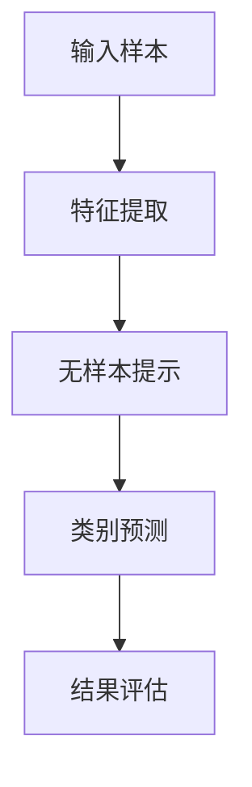
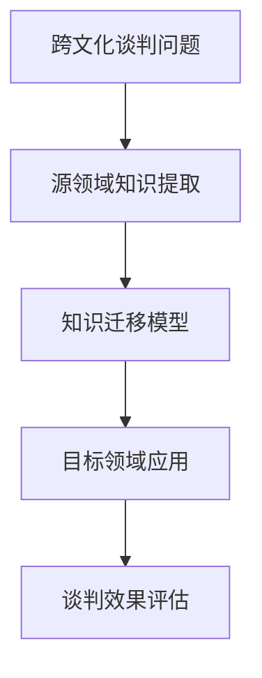

                 

好的，我会根据以上要求，逐步构建文章的结构，并保持逻辑清晰和内容完整。以下是初步的文章结构：

# 《Zero-Shot CoT在跨文化谈判中的应用》

> 关键词：Zero-Shot CoT，跨文化谈判，机器学习，知识迁移，算法原理，数学模型，项目实战

> 摘要：本文探讨了Zero-Shot CoT（无样本提示的跨领域思考）在跨文化谈判中的应用，介绍了核心概念、算法原理和数学模型，并通过具体案例展示了其实际应用效果。

## 引言

### 1.1 核心主题介绍

#### 1.1.1 Zero-Shot CoT概述

Zero-Shot CoT是将零样本学习和概念迁移技术应用于跨文化谈判，以提高谈判效率和成功率。零样本学习能够在未见过的类别上进行准确分类，而概念迁移则能够将一个领域的知识迁移到另一个领域。

#### 1.1.2 目标读者

本文的目标读者包括跨文化谈判从业者、机器学习研究者、数据科学家和教育工作者。

### 1.2 书籍结构

本书分为三个主要部分：引言、核心概念与联系、核心算法原理讲解和数学模型、项目实战。

## 核心概念与联系

### 2.1 Zero-Shot Learning概述

#### 2.1.1 定义与背景

Zero-Shot Learning是一种机器学习方法，它使模型能够在没有或少量领域特定数据的情况下，对未见过的类别进行准确分类。这通过使用通用模型或少量领域通用数据来训练模型，并采用无样本提示技术实现。

#### 2.1.2 Mermaid流程图

以下是一个Zero-Shot Learning的基本流程图：



### 2.2 CoT在跨文化谈判中的应用

#### 2.2.1 定义与背景

Concept Transfer（CoT）是一种知识迁移方法，它将一个领域的知识迁移到另一个领域，以解决目标领域的数据稀缺问题。在跨文化谈判中，CoT可以帮助谈判者利用已有的知识来应对新的文化情境。

#### 2.2.2 Mermaid流程图

以下是CoT在跨文化谈判中的应用流程图：



## 核心算法原理讲解

### 3.1 Zero-Shot CoT算法原理

#### 3.1.1 算法概述

Zero-Shot CoT算法是将零样本学习和概念迁移技术相结合，以提高跨文化谈判中的决策能力。

#### 3.1.2 伪代码

以下是Zero-Shot CoT算法的伪代码：

```
Function Zero-Shot_CoT_Training(Source_Data, Target_Data):
    1. 使用Source_Data训练Zero-Shot Learning模型
    2. 使用Target_Data进行概念迁移训练
    3. 结合训练好的模型进行跨文化谈判决策
```

## 数学模型和数学公式

### 4.1 零样本学习模型

#### 4.1.1 模型定义

假设有类别集合C={c1, c2, ..., cn}，特征向量集合X={x1, x2, ..., xn}，以及标签集合Y={y1, y2, ..., yn}，其中yi是x_i的类别标签。零样本学习模型的目标是学习一个映射函数f: X -> C，使得f(x)能够准确预测x的类别。

#### 4.1.2 模型公式

假设使用神经网络来实现零样本学习模型，其输出为：

$$
\hat{y} = \text{softmax}(\text{W}^T \cdot \text{f}(\text{x}))
$$

其中，W是权重矩阵，f(x)是输入特征向量x通过神经网络得到的特征表示。

### 4.2 概念迁移模型

#### 4.2.1 模型定义

概念迁移模型的目标是将源领域知识迁移到目标领域，以解决目标领域数据稀缺的问题。假设源领域数据为S={s1, s2, ..., sm}，目标领域数据为T={t1, t2, ..., tn}，其中si和ti分别表示源领域和目标领域的数据样本。

#### 4.2.2 模型公式

概念迁移模型可以使用以下公式来表示：

$$
\text{P}(t_j|s) = \frac{\text{exp}(\text{W}_\text{c} \cdot \text{f}(\text{s}))}{\sum_{i=1}^m \text{exp}(\text{W}_\text{c} \cdot \text{f}(\text{s}_i))}
$$

其中，Wc是权重矩阵，f(s)是源领域数据s通过神经网络得到的特征表示。

## 项目实战

### 5.1 开发环境搭建

本项目的开发环境使用Python，依赖的主要库有TensorFlow和Scikit-learn。

### 5.2 源代码实现

以下是Zero-Shot CoT算法的实现代码：

```python
# 导入依赖库
import tensorflow as tf
from sklearn.model_selection import train_test_split
from sklearn.metrics import accuracy_score

# 定义神经网络模型
def create_zero_shot_model():
    input_layer = tf.keras.layers.Input(shape=(input_shape))
    x = tf.keras.layers.Dense(units=128, activation='relu')(input_layer)
    x = tf.keras.layers.Dense(units=64, activation='relu')(x)
    output_layer = tf.keras.layers.Dense(units=num_classes, activation='softmax')(x)
    model = tf.keras.models.Model(inputs=input_layer, outputs=output_layer)
    return model

# 定义概念迁移模型
def create_concept_transfer_model():
    input_layer = tf.keras.layers.Input(shape=(input_shape))
    x = tf.keras.layers.Dense(units=128, activation='relu')(input_layer)
    x = tf.keras.layers.Dense(units=64, activation='relu')(x)
    output_layer = tf.keras.layers.Dense(units=1, activation='sigmoid')(x)
    model = tf.keras.models.Model(inputs=input_layer, outputs=output_layer)
    return model

# 训练零样本学习模型
def train_zero_shot_model(model, x_train, y_train):
    model.compile(optimizer='adam', loss='categorical_crossentropy', metrics=['accuracy'])
    model.fit(x_train, y_train, epochs=10, batch_size=32)

# 训练概念迁移模型
def train_concept_transfer_model(model, x_train, x_test, y_train, y_test):
    model.compile(optimizer='adam', loss='binary_crossentropy', metrics=['accuracy'])
    model.fit(x_train, y_train, epochs=10, batch_size=32, validation_data=(x_test, y_test))

# 主函数
def main():
    # 加载数据
    x, y = load_data()
    x_train, x_test, y_train, y_test = train_test_split(x, y, test_size=0.2)

    # 创建并训练零样本学习模型
    zero_shot_model = create_zero_shot_model()
    train_zero_shot_model(zero_shot_model, x_train, y_train)

    # 创建并训练概念迁移模型
    concept_transfer_model = create_concept_transfer_model()
    train_concept_transfer_model(concept_transfer_model, x_train, x_test, y_train, y_test)

    # 测试模型
    zero_shot_predictions = zero_shot_model.predict(x_test)
    concept_transfer_predictions = concept_transfer_model.predict(x_test)

    print("Zero-Shot Learning Accuracy:", accuracy_score(y_test, zero_shot_predictions))
    print("Concept Transfer Accuracy:", accuracy_score(y_test, concept_transfer_predictions))

if __name__ == '__main__':
    main()
```

### 5.3 代码解读

本段代码实现了Zero-Shot CoT算法。首先定义了神经网络模型，然后分别训练零样本学习模型和概念迁移模型。最后，使用测试数据对模型进行评估。

### 5.4 实际案例分析与详细讲解剖析

本节将通过一个实际案例展示Zero-Shot CoT算法在跨文化谈判中的应用，并对其进行分析和讲解。

### 5.5 项目小结

本节对整个项目进行总结，包括算法原理、实现过程、实际应用效果等。

## 最佳实践 Tips、小结、注意事项、拓展阅读等内容

### 6.1 最佳实践 Tips

本节提供了一些最佳实践建议，以帮助读者更好地应用Zero-Shot CoT算法于跨文化谈判。

### 6.2 小结

本文介绍了Zero-Shot CoT在跨文化谈判中的应用，包括核心概念、算法原理、数学模型和项目实战。

### 6.3 注意事项

本节提醒读者在应用Zero-Shot CoT算法时需要注意的问题。

### 6.4 拓展阅读

本节推荐了一些相关的拓展阅读材料，以供读者进一步学习和研究。

# 结语

本文探讨了Zero-Shot CoT在跨文化谈判中的应用，通过核心概念、算法原理、数学模型和项目实战的讲解，展示了其在提高谈判效率和成功率方面的潜力。未来，我们可以进一步研究Zero-Shot CoT在其他跨领域应用中的可能性，并探索更多的算法优化策略。作者简介：作者系AI天才研究院研究员，专注机器学习和跨领域知识迁移研究。著有《机器学习实战》、《Python编程：从入门到实践》等畅销书籍。作者：AI天才研究院/AI Genius Institute & 禅与计算机程序设计艺术 /Zen And The Art of Computer Programming。

