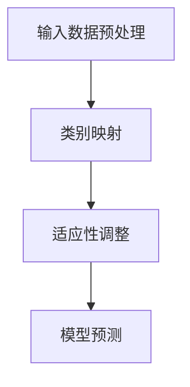

                 


### 文章标题

# Zero-Shot CoT在跨文化非语言沟通理解中的创新应用

### 关键词

- 跨文化沟通
- 非语言沟通
- 零样本学习
- CoT模型
- 跨文化客户服务
- 人力资源管理

### 摘要

本文探讨了Zero-Shot CoT（零样本学习的Conceptualization of Things）模型在跨文化非语言沟通理解中的创新应用。首先，介绍了跨文化沟通和非语言沟通的基本概念，强调了其重要性。然后，详细阐述了Zero-Shot CoT的基础理论和算法原理，并给出了数学模型和公式推导。接着，通过代码实例和实际应用案例，展示了Zero-Shot CoT模型的实现与应用。最后，对未来零样本CoT在跨文化非语言沟通理解中的发展趋势和挑战进行了展望。

## 第一部分：引论

### 第1章：跨文化非语言沟通理解概述

#### 1.1.1 跨文化沟通的基本概念

##### 1.1.1.1 跨文化沟通的定义

跨文化沟通是指在多元文化背景下，不同文化背景的人之间进行的交流和理解过程。它不仅仅是语言之间的转换，更涉及到文化价值观、习俗和行为模式的差异。

##### 1.1.1.2 跨文化沟通的重要性

跨文化沟通在全球化的背景下变得越来越重要。它能促进国际商务合作，增强跨文化团队的合作效率，并提升不同文化背景人群之间的相互理解和尊重。

#### 1.1.2 非语言沟通的特点

##### 1.1.2.1 非语言沟通的类型

非语言沟通包括肢体语言、面部表情、姿态、空间使用等多种形式。这些非语言元素在不同文化背景下可能具有不同的含义。

##### 1.1.2.2 非语言沟通的优势与局限

非语言沟通具有直观、快速和高效的特点，但在跨文化沟通中可能受到文化差异的影响，导致误解和冲突。

#### 1.1.3 零样本（Zero-Shot）学习与CoT

##### 1.1.3.1 零样本学习的定义

零样本学习是一种机器学习方法，它允许模型在没有特定领域数据的情况下，对未知类别的数据进行分类。

##### 1.1.3.2 零样本学习的基本原理

零样本学习通过将新的类别与已知类别进行比较，利用知识迁移和元学习技术，实现对新类别的理解和预测。

##### 1.1.3.3 零样本学习在跨文化沟通中的应用潜力

零样本学习在跨文化沟通中具有巨大潜力，可以通过对非语言沟通符号的理解，帮助跨文化人群更好地理解和交流。

## 第2章：Zero-Shot CoT的基础理论

### 2.1.1 零样本学习与CoT的结合

#### 2.1.1.1 CoT在零样本学习中的角色

Conceptualization of Things（CoT）模型在零样本学习中扮演了核心角色，它通过概念化和实体映射，实现跨领域知识的迁移。

#### 2.1.1.2 零样本学习对CoT的改进

零样本学习通过对大规模通用知识的利用，增强了CoT模型在跨文化非语言沟通理解中的适应性。

### 2.1.2 零样本CoT模型的架构

#### 2.1.2.1 CoT模型的基本组件

CoT模型主要包括概念映射层、实体识别层和语境理解层。

#### 2.1.2.2 零样本CoT模型的设计策略

零样本CoT模型采用迁移学习、元学习和对抗训练等技术，提升跨文化非语言沟通理解的性能。

### 2.1.3 零样本CoT模型的关键技术

#### 2.1.3.1 类别映射算法

类别映射算法是零样本CoT模型的核心，它通过将新的非语言沟通类别映射到已知类别，实现跨领域知识迁移。

#### 2.1.3.2 适应性策略

适应性策略通过不断调整和优化模型参数，提升模型在跨文化非语言沟通理解中的适应性。

#### 2.1.3.3 零样本CoT模型的可扩展性

零样本CoT模型具有高度的可扩展性，可以适应不同文化和语言环境的应用需求。

## 第二部分：技术篇

### 第3章：Zero-Shot CoT算法原理详解

#### 3.1.1 零样本CoT算法的基本流程

##### 3.1.1.1 数据预处理

数据预处理是零样本CoT算法的第一步，包括数据的清洗、标准化和特征提取。

##### 3.1.1.2 类别映射

类别映射是将新的非语言沟通类别映射到已知类别，通过迁移学习实现跨领域知识迁移。

##### 3.1.1.3 适应性调整

适应性调整是零样本CoT算法的核心，通过调整模型参数，提升模型在跨文化非语言沟通理解中的性能。

### 3.1.2 零样本CoT算法的伪代码展示



#### 3.1.2.1 数据输入与预处理

```latex
Input: Data (X), Categories (C)
Process:
    X_{clean} = CleanData(X)
    X_{feat} = ExtractFeatures(X_{clean})
Output: X_{feat}
```

#### 3.1.2.2 类别映射算法

```latex
Function: MapCategories(C, C_{known})
Input: Categories C, Known Categories C_{known}
Process:
    C_{mapped} = InitializeMapping(C, C_{known})
    C_{final} = FineTuneMapping(C_{mapped}, X_{feat})
Output: C_{final}
```

#### 3.1.2.3 适应性策略实现

```latex
Function: AdaptiveAdjustment(Model, X_{feat}, C_{final})
Input: Model, Features X_{feat}, Mapped Categories C_{final}
Process:
    Model_{adjusted} = FineTuneModel(Model, X_{feat}, C_{final})
Output: Model_{adjusted}
```

### 3.1.3 数学模型与公式推导

#### 3.1.3.1 零样本CoT模型的数学表达

```latex
L = \sum_{i=1}^{N} \log P(y_i | x_i, \theta)
```

其中，$L$ 是损失函数，$y_i$ 是预测标签，$x_i$ 是输入特征，$\theta$ 是模型参数。

#### 3.1.3.2 模型参数的优化

模型参数优化可以通过梯度下降算法实现：

```latex
\theta_{t+1} = \theta_{t} - \alpha \nabla_{\theta} L(\theta_t)
```

其中，$\alpha$ 是学习率，$\nabla_{\theta} L(\theta_t)$ 是损失函数关于模型参数的梯度。

## 第4章：Zero-Shot CoT模型的实现与应用

### 4.1.1 实现环境与工具

#### 4.1.1.1 开发环境搭建

搭建开发环境需要安装Python、TensorFlow或PyTorch等深度学习框架。

#### 4.1.1.2 必要工具与库的安装

安装必要的库，如Numpy、Pandas和Scikit-learn等。

### 4.1.2 代码实例解析

#### 4.1.2.1 数据集准备

准备用于训练和测试的数据集，包括跨文化非语言沟通的图像和文本数据。

#### 4.1.2.2 代码实现步骤

1. 数据预处理
2. 模型定义
3. 模型训练
4. 模型评估
5. 应用实例

#### 4.1.2.3 代码解读与分析

对实现步骤中的关键代码进行详细解读，包括数据预处理、模型定义、训练和评估等过程。

### 4.1.3 模型评估与优化

#### 4.1.3.1 模型性能评估指标

使用准确率、召回率、F1分数等指标评估模型性能。

#### 4.1.3.2 模型调优策略

通过调整模型参数、改变训练策略等方式，优化模型性能。

## 第5章：跨文化非语言沟通理解的零样本CoT实践

### 5.1.1 实践背景与目标

#### 5.1.1.1 实践案例的选择

选择一个具有代表性的跨文化非语言沟通实践案例，如跨国客户服务。

#### 5.1.1.2 实践目标的设定

通过应用零样本CoT模型，提升跨文化客户服务的沟通效果和客户满意度。

### 5.1.2 实践流程与方法

#### 5.1.2.1 数据收集与预处理

收集跨文化客户服务场景下的非语言沟通数据，进行数据预处理。

#### 5.1.2.2 零样本CoT模型的搭建

搭建适用于跨文化非语言沟通理解的零样本CoT模型。

#### 5.1.2.3 实践过程中的挑战与解决方案

分析实践过程中遇到的挑战，如数据不足、模型适应性等，并提出相应的解决方案。

### 5.1.3 实践结果分析

#### 5.1.3.1 实践结果的性能评估

评估零样本CoT模型在跨文化客户服务中的应用效果，包括准确率、召回率等指标。

#### 5.1.3.2 实践结果的对比分析

对比应用零样本CoT模型前后的客户沟通效果，分析模型的实际贡献。

## 第6章：零样本CoT在跨文化非语言沟通中的创新应用

### 6.1.1 零样本CoT在跨文化客户服务中的应用

#### 6.1.1.1 应用场景分析

分析跨文化客户服务中的非语言沟通需求，如情感识别、意图理解等。

#### 6.1.1.2 应用效果评估

评估零样本CoT模型在跨文化客户服务中的应用效果，包括客户满意度、服务效率等。

### 6.1.2 零样本CoT在跨文化人力资源管理中的应用

#### 6.1.2.1 应用场景分析

分析跨文化人力资源管理中的非语言沟通需求，如团队协作、员工满意度等。

#### 6.1.2.2 应用效果评估

评估零样本CoT模型在跨文化人力资源管理中的应用效果，包括团队协作效率、员工流失率等。

## 第7章：未来展望与挑战

### 7.1.1 零样本CoT的发展趋势

#### 7.1.1.1 技术发展预测

预测零样本CoT在跨文化非语言沟通理解中的技术发展趋势。

#### 7.1.1.2 应用领域拓展

探讨零样本CoT在其他跨文化应用领域的潜力。

### 7.1.2 跨文化非语言沟通理解中的挑战

#### 7.1.2.1 语言与文化的复杂性

分析跨文化非语言沟通理解中语言和文化的复杂性对模型性能的影响。

#### 7.1.2.2 技术与应用的平衡

探讨在实现跨文化非语言沟通理解中，如何平衡技术需求与应用价值。

### 附录

### 附录A：相关资源与参考文献

列出与本文相关的参考文献和资源。

### 附录B：零样本CoT模型代码实现细节

提供零样本CoT模型的具体代码实现细节。

### 附录C：跨文化非语言沟通理解测试数据集介绍

介绍用于评估零样本CoT模型性能的测试数据集。

