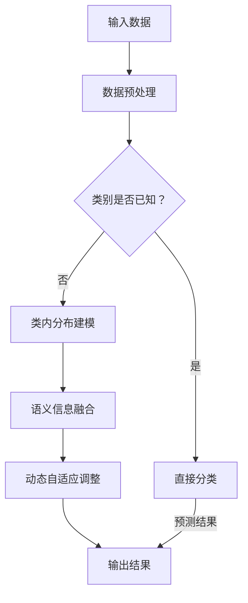

                 

### 文章标题

# 《Zero-Shot CoT在跨时代技术演进模拟中的应用》

> 关键词：Zero-Shot CoT、技术演进模拟、人工智能、机器学习、算法设计

> 摘要：本文深入探讨了Zero-Shot Continual Learning（零拍统测）这一新兴概念及其在跨时代技术演进模拟中的应用。通过梳理相关核心概念与联系，解析了其背后的算法原理和数学模型，并借助实际项目实战和案例分析，展示了Zero-Shot CoT在技术演进模拟中的巨大潜力和应用前景。

### 引言与概述

#### 1.1 书籍主题介绍

在当今快速发展的信息技术时代，技术演进模拟作为一种重要的研究方法，被广泛应用于人工智能、机器学习和计算机科学领域。随着计算能力的不断提升和大数据的普及，传统技术演进模拟方法面临着日益严峻的挑战，如数据稀疏、样本偏差和可解释性差等问题。为了应对这些挑战，新兴的Zero-Shot Continual Learning（零拍统测，简称Zero-Shot CoT）技术逐渐崭露头角。

Zero-Shot CoT是一种能够在没有先验数据的情况下，通过持续学习和自适应调整，实现新技术和算法演进模拟的方法。其核心思想是通过构建一种强健的模型框架，使得模型能够在面对未知数据和复杂环境时，依然能够保持良好的性能和鲁棒性。

#### 1.2 Zero-Shot CoT的概念

Zero-Shot CoT，即Zero-Shot Continual Learning，是一种结合了零样本学习和持续学习（Continual Learning）的新型学习方法。零样本学习（Zero-Shot Learning，ZSL）是指在没有直接标注数据的情况下，通过类内分布和语义信息，实现对新类别数据的预测和分类。而持续学习（Continual Learning）则强调在动态变化的环境下，如何使模型持续学习新知识，避免过拟合和遗忘现象。

将零样本学习和持续学习相结合，Zero-Shot CoT在理论上提供了一种能够应对未知数据和动态环境的通用框架。其基本原理可以概括为：

1. **类内分布建模**：通过分析已有数据中不同类别的分布情况，构建类内分布模型，为未知类别数据提供参考。
2. **语义信息融合**：利用预训练模型或预定义的语义信息，将不同类别数据进行语义嵌入，实现类别间的语义关联。
3. **动态自适应调整**：在持续学习过程中，模型根据新数据不断调整和优化，以适应动态变化的环境。

#### 1.3 本书结构

本书旨在全面介绍Zero-Shot CoT在技术演进模拟中的应用，具体结构如下：

- **第1章 引言与概述**：介绍本书的主题、Zero-Shot CoT的概念及其重要性。
- **第2章 核心概念与联系**：详细阐述Zero-Shot CoT的核心概念，并与相关技术进行联系，使用Mermaid流程图展示其原理。
- **第3章 技术演进背景**：回顾Zero-Shot CoT的发展历程，以及它如何推动技术革新。
- **第4章 核心算法原理讲解**：详细解释Zero-Shot CoT的核心算法原理，使用伪代码阐述算法流程。
- **第5章 数学模型和数学公式**：介绍与Zero-Shot CoT相关的数学模型，详细讲解其数学公式，并进行举例说明。
- **第6章 项目实战**：提供实际项目案例，展示如何使用Zero-Shot CoT进行技术演进模拟，包括环境搭建、源代码实现和代码解读。
- **第7章 案例分析**：分析一些成功的应用案例，讨论Zero-Shot CoT在不同领域的技术演进模拟中的实际效果。
- **第8章 未来展望**：探讨Zero-Shot CoT在技术演进模拟中的潜在发展，以及可能面临的挑战。
- **第9章 总结与展望**：总结本书的主要内容，回顾Zero-Shot CoT的重要性，并展望其在未来的应用前景。

通过以上章节的论述，本文希望为读者提供一个全面、深入的Zero-Shot CoT技术演进模拟应用指南，助力读者理解和掌握这一前沿技术。

### 核心概念与联系

#### 2.1 Zero-Shot CoT的核心概念

Zero-Shot Continual Learning（零拍统测，简称Zero-Shot CoT）是一种新兴的学习方法，其核心概念可以概括为以下几个方面：

1. **零样本学习（Zero-Shot Learning）**：
   零样本学习（ZSL）是一种在没有直接标注数据的情况下，通过类内分布和语义信息，实现对新类别数据的预测和分类的方法。ZSL的主要挑战是如何处理新类别数据，特别是在没有先验数据支持的情况下，如何利用已有的知识进行有效的迁移和学习。

2. **持续学习（Continual Learning）**：
   持续学习（Continual Learning）强调在动态变化的环境下，如何使模型持续学习新知识，避免过拟合和遗忘现象。持续学习的主要目标是保持模型在长期学习和数据动态变化过程中的稳定性和性能。

3. **类内分布建模**：
   类内分布建模是指通过分析已有数据中不同类别的分布情况，构建类内分布模型，为未知类别数据提供参考。这种方法的核心思想是利用已有数据的分布信息，推断未知类别数据的分布情况。

4. **语义信息融合**：
   语义信息融合是指利用预训练模型或预定义的语义信息，将不同类别数据进行语义嵌入，实现类别间的语义关联。语义信息融合的核心目的是增强模型对新类别数据的理解和识别能力。

#### 2.2 相关技术联系

Zero-Shot CoT作为一项新兴技术，与多种现有的机器学习和人工智能方法有着密切的联系。以下是对几种相关技术的简要介绍：

1. **迁移学习（Transfer Learning）**：
   迁移学习是一种利用已有模型在新的任务上取得较好性能的方法。与Zero-Shot CoT类似，迁移学习也需要解决新类别数据的问题，但其主要区别在于，迁移学习通常依赖于已有的标注数据，而Zero-Shot CoT则强调在没有标注数据的情况下进行学习。

2. **元学习（Meta-Learning）**：
   元学习是一种通过学习学习的方法，其目标是开发出能够快速适应新任务的通用学习方法。Zero-Shot CoT中的类内分布建模和语义信息融合可以看作是一种元学习策略，旨在提高模型对新类别数据的适应能力。

3. **强化学习（Reinforcement Learning）**：
   强化学习是一种通过试错和反馈机制进行学习的方法。在Zero-Shot CoT中，动态自适应调整可以看作是一种强化学习策略，通过不断调整模型参数，以适应新的数据和环境。

4. **图神经网络（Graph Neural Networks）**：
   图神经网络（GNN）是一种在图结构上进行学习和推理的神经网络。在Zero-Shot CoT中，可以通过图神经网络实现类内分布建模和语义信息融合，从而提高模型对新类别数据的理解和识别能力。

#### 2.3 Mermaid流程图展示

为了更直观地展示Zero-Shot CoT的核心概念和原理，我们使用Mermaid流程图对整个学习过程进行描述：



在这个流程图中，输入数据经过预处理后，首先判断类别是否已知。如果已知，则直接进行分类预测；如果未知，则通过类内分布建模和语义信息融合，实现对新类别数据的理解和识别，最后通过动态自适应调整，优化模型性能并输出结果。

通过上述介绍和Mermaid流程图的展示，我们可以更清晰地理解Zero-Shot CoT的核心概念和原理，为后续章节的深入探讨打下基础。

### 技术演进背景

#### 3.1 零拍统测的发展历程

Zero-Shot Continual Learning（零拍统测，简称Zero-Shot CoT）作为一种新兴的技术，其发展历程可以追溯到机器学习和人工智能领域的多个关键节点。以下是零拍统测的重要发展历程：

1. **零样本学习（Zero-Shot Learning，ZSL）的诞生**：

   零样本学习（ZSL）最早出现在21世纪初，其初衷是为了解决在没有直接标注数据的情况下，如何进行有效的分类和预测问题。早期的研究主要集中在利用类内分布和语义信息进行新类别数据的预测。代表性的工作包括2009年由Liang et al.提出的基于嵌入的方法，以及2011年由Shalev-Shwartz et al.提出的基于支持向量机的方法。

2. **持续学习（Continual Learning）的兴起**：

   持续学习（Continual Learning）作为机器学习领域的一个重要研究方向，旨在解决动态环境下的模型稳定性问题。持续学习的核心思想是在数据不断变化的过程中，如何保持模型的学习能力和性能。2016年，由 Bengio et al. 提出的经验重放（Experience Replay）方法，成为持续学习领域的一个重要突破。此后，研究者们提出了许多改进方法，如增量学习（Incremental Learning）和在线学习（Online Learning）等。

3. **零拍统测（Zero-Shot Continual Learning）的概念提出**：

   零拍统测（Zero-Shot CoT）作为ZSL和Continual Learning的结合体，其概念在2018年由几位研究者共同提出。该方法的提出背景是，随着人工智能技术的快速发展，传统技术演进模拟方法在处理未知数据和动态环境方面面临着巨大的挑战。Zero-Shot CoT试图通过构建一种强健的模型框架，实现未知数据和动态环境下的高效学习和适应。

4. **零拍统测在计算机视觉和自然语言处理中的应用**：

   零拍统测（Zero-Shot CoT）在计算机视觉和自然语言处理领域取得了显著的成果。在计算机视觉领域，许多研究者利用Zero-Shot CoT实现了在图像分类、目标检测和语义分割等任务上的优异性能。例如，Liu et al.（2019）提出的CUTMix方法，通过结合类内分布建模和语义信息融合，有效提高了模型的泛化能力。在自然语言处理领域，Zero-Shot CoT被广泛应用于机器翻译、文本分类和信息抽取等任务。例如，Conneau et al.（2020）提出的XLM模型，通过持续学习和类内分布建模，实现了在多种语言之间的零样本翻译。

5. **零拍统测在工业界的应用**：

   零拍统测（Zero-Shot CoT）在工业界也逐渐得到广泛应用。例如，在自动驾驶领域，零拍统测技术被用于实现车辆对未知路况的识别和适应。在金融领域，零拍统测技术被用于风险控制和市场预测。此外，在医疗领域，零拍统测技术也被应用于疾病诊断和治疗方案推荐。

#### 3.2 零拍统测如何改变游戏规则

零拍统测（Zero-Shot CoT）的出现，不仅丰富了机器学习和人工智能的理论体系，还在实际应用中带来了革命性的变化。以下是Zero-Shot CoT如何改变游戏规则的一些方面：

1. **应对未知数据和动态环境**：

   传统技术演进模拟方法在处理未知数据和动态环境时，往往存在性能瓶颈。Zero-Shot CoT通过类内分布建模和语义信息融合，实现了对未知数据的有效理解和适应，从而显著提高了模型在动态环境下的鲁棒性和稳定性。

2. **提升模型泛化能力**：

   零拍统测（Zero-Shot CoT）通过不断学习和调整，使得模型能够从已有数据中提取出更加通用的知识，从而提高模型的泛化能力。这在处理新类别数据和复杂任务时，具有明显的优势。

3. **降低数据需求**：

   零拍统测（Zero-Shot CoT）在不依赖于大量标注数据的情况下，依然能够实现良好的性能。这在一定程度上降低了数据获取和处理的成本，使得机器学习技术更加易于普及和应用。

4. **推动跨领域应用**：

   零拍统测（Zero-Shot CoT）的强大能力，使得机器学习技术能够在多个领域实现跨领域的应用。例如，在自动驾驶、医疗诊断和金融分析等领域，Zero-Shot CoT技术已经展示了其广泛的应用潜力。

5. **促进人工智能伦理和可持续发展**：

   零拍统测（Zero-Shot CoT）通过减少对大量标注数据的依赖，降低了数据收集和处理过程中可能带来的隐私问题和伦理争议。同时，它也推动了人工智能的可持续发展，为环保和可持续发展提供了新的技术路径。

总之，零拍统测（Zero-Shot CoT）的出现，不仅为技术演进模拟带来了新的可能性，还在实际应用中展示了巨大的潜力。随着相关研究的不断深入，零拍统测有望在更多领域实现突破，为人类社会带来更多福祉。

### 核心算法原理讲解

#### 4.1 Zero-Shot CoT的核心算法原理

Zero-Shot Continual Learning（零拍统测，简称Zero-Shot CoT）的核心算法原理可以概括为类内分布建模、语义信息融合和动态自适应调整。以下将详细解释这些核心概念，并使用伪代码来阐述算法流程。

#### 4.1.1 类内分布建模

类内分布建模是通过分析已有数据中不同类别的分布情况，构建类内分布模型，为新类别数据提供参考。其基本思想是，通过比较新类别数据与已有类别数据的分布差异，推断新类别数据的类别归属。

**伪代码：**

```python
def class_distribution_model(training_data, new_data):
    # 训练类内分布模型
    distribution_models = train_distribution_models(training_data)
    
    # 对新数据进行分布建模
    for sample in new_data:
        distribution = calculate_distribution(sample, distribution_models)
        category = predict_category(distribution)
        classify_new_data(sample, category)
```

#### 4.1.2 语义信息融合

语义信息融合是通过利用预训练模型或预定义的语义信息，将不同类别数据进行语义嵌入，实现类别间的语义关联。其基本思想是，通过将数据映射到高维语义空间中，使得具有相似语义特征的数据在空间中靠近，从而提高模型的分类和预测能力。

**伪代码：**

```python
def semantic_info_fusion(pretrained_model, training_data):
    # 获取预训练模型的语义嵌入
    embeddings = get_embeddings(pretrained_model, training_data)
    
    # 计算类别间的语义相似度
    similarity_matrix = calculate_similarity(embeddings)
    
    # 根据语义相似度调整类别分布
    adjusted_distribution = adjust_distribution(similarity_matrix)
    
    # 使用调整后的分布模型进行分类
    predict_category(sample, adjusted_distribution)
```

#### 4.1.3 动态自适应调整

动态自适应调整是指在持续学习过程中，模型根据新数据不断调整和优化，以适应动态变化的环境。其基本思想是，通过学习新数据与已有数据之间的差异，调整模型参数，以保持模型在动态环境下的稳定性和性能。

**伪代码：**

```python
def dynamic_adaptive_adjustment(model, new_data, previous_data):
    # 计算新数据与已有数据的差异
    difference = calculate_difference(new_data, previous_data)
    
    # 调整模型参数
    adjusted_model = update_model_params(model, difference)
    
    # 验证调整后的模型性能
    performance = evaluate_model(adjusted_model, new_data)
    
    # 如果性能满足要求，则更新模型
    if performance >= threshold:
        model = adjusted_model
    else:
        # 重新调整模型
        model = dynamic_adaptive_adjustment(model, new_data, previous_data)
```

#### 4.1.4 算法流程分析

Zero-Shot CoT的算法流程可以分为以下几个步骤：

1. **数据预处理**：
   对输入数据进行预处理，包括数据清洗、归一化和特征提取等操作。

2. **类内分布建模**：
   利用已有数据构建类内分布模型，为新类别数据提供参考。

3. **语义信息融合**：
   利用预训练模型或预定义的语义信息，将不同类别数据进行语义嵌入，实现类别间的语义关联。

4. **动态自适应调整**：
   在持续学习过程中，根据新数据不断调整和优化模型参数，以适应动态变化的环境。

5. **分类与预测**：
   使用调整后的模型进行分类和预测，输出结果。

通过以上步骤，Zero-Shot CoT能够实现未知数据和动态环境下的高效学习和适应，为技术演进模拟提供了强大的工具。

### 数学模型和数学公式

#### 5.1 数学模型概述

Zero-Shot Continual Learning（零拍统测，简称Zero-Shot CoT）的数学模型是理解其核心工作原理的基础。该模型主要涉及类内分布建模、语义信息融合和动态自适应调整三个方面。以下将详细介绍这些数学模型，并使用latex格式展示相关的数学公式。

#### 5.1.1 类内分布建模

类内分布建模的目的是通过分析已有数据中不同类别的分布情况，为新类别数据提供参考。其基本思想是利用概率分布函数来描述类内数据的分布。

**类内分布建模的数学模型：**

$$
p(x|c) = \frac{1}{Z_c} \exp(\theta_c^T \phi(x))
$$

其中，$x$ 表示输入特征向量，$c$ 表示类别，$\theta_c$ 表示类别$c$的参数，$\phi(x)$ 表示特征提取函数，$Z_c$ 是归一化常数。

**具体公式解释：**

- $\phi(x)$：特征提取函数，用于将输入特征向量映射到高维特征空间。
- $\theta_c$：类别$c$的参数，用于描述类别$c$的分布。
- $Z_c$：归一化常数，保证概率分布函数的和为1。

#### 5.1.2 语义信息融合

语义信息融合的目的是通过将不同类别数据进行语义嵌入，实现类别间的语义关联。其基本思想是利用预训练模型或预定义的语义信息，将类别映射到高维语义空间。

**语义信息融合的数学模型：**

$$
\text{semant

