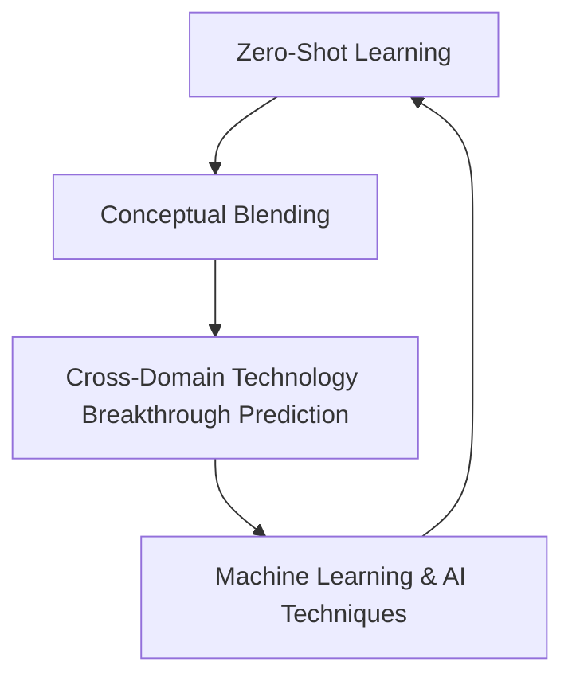

                 

### 1. 确定核心概念与联系

在撰写《Zero-Shot CoT在跨时代科技突破预测中的应用》这篇技术博客时，我们首先需要明确文章中的核心概念，并理解它们之间的联系。以下是文章中涉及的核心概念：

- **Zero-Shot Learning（零样本学习）**：一种机器学习技术，它允许模型在未见过的类别上进行学习和预测，而不需要对这些类别进行显式训练。
  
- **Conceptual Blending（概念融合）**：一种信息融合方法，它通过将不同的信息源整合到一个统一的概念框架中，以便更好地理解和预测复杂系统。

- **Cross-Domain Technology Breakthrough Prediction（跨时代科技突破预测）**：利用机器学习和人工智能技术，对不同领域科技发展进行预测，尤其是预测那些具有革命性影响的科技突破。

- **机器学习和人工智能技术**：包括神经网络、深度学习、强化学习等，是解决复杂预测问题的基础。

接下来，我们将使用Mermaid流程图来展示这些概念之间的联系：



在这个流程图中，我们可以看到：

- **零样本学习**是**概念融合**的基础，因为零样本学习可以帮助模型在没有训练数据的情况下理解新概念。
- **概念融合**是实现**跨时代科技突破预测**的关键，因为它可以将来自不同领域的知识融合在一起，从而更准确地预测科技突破。
- **跨时代科技突破预测**依赖于**机器学习和人工智能技术**，这些技术提供了实现预测所需的数据处理和分析能力。
- **机器学习和人工智能技术**再次链接到**零样本学习**，因为零样本学习技术是这些技术中的一种，可以用来解决复杂预测问题。

通过这个流程图，我们可以更好地理解各个概念之间的相互作用，为后续的详细讨论打下基础。

### 2. 核心算法原理讲解

在理解了核心概念之间的联系后，接下来我们将深入探讨零样本学习（Zero-Shot Learning，简称ZSL）的核心算法原理。零样本学习是一种在模型未接触过的新类别上做出预测的技术，对于跨时代科技突破预测具有重要的应用价值。

#### 2.1 零样本学习的定义

零样本学习（Zero-Shot Learning）是一种机器学习范式，旨在使模型能够在未见过的类别上做出准确的预测。这种学习方法的关键在于利用预训练模型（通常是预训练在大量数据上的模型）来处理新的、未知的类别。其核心思想是通过学习类别之间的相似性，从而在未见过的类别上进行预测。

#### 2.2 零样本学习的算法原理

零样本学习算法通常可以分为以下几个步骤：

1. **类别表示学习**：首先，我们需要将每个类别用一种向量表示出来。这种表示可以是基于预训练的词向量、图像嵌入或任何其他形式的特征表示。

2. **类别关系建模**：接着，我们需要建立一个类别之间的关系模型，以便能够衡量不同类别之间的相似性。一种常见的方法是使用元学习（Meta-Learning），如MAML（Model-Agnostic Meta-Learning）或Reptile，来快速适应新的类别关系。

3. **预测**：在新类别数据输入时，模型会利用类别表示和类别关系模型来进行预测。具体来说，模型会计算输入数据与所有已知类别之间的相似度，并根据相似度进行预测。

以下是零样本学习算法的伪代码：

```plaintext
// 伪代码：Zero-Shot Learning算法原理
initialize model parameters
for each unknown class c:
    generate pseudo-labels using model's predictions
    train model on pseudo-labeled data
    evaluate model performance on validation set
return trained model
```

#### 2.3 零样本学习在跨时代科技突破预测中的应用

在跨时代科技突破预测中，零样本学习可以通过以下方式发挥作用：

- **新领域适应**：科技突破往往发生在多个领域交叉的地方，零样本学习可以帮助模型快速适应新的跨领域知识。
  
- **早期预测**：通过利用已有的知识库和模型，零样本学习可以提前预测可能出现的新科技突破。

- **风险评估**：在预测过程中，零样本学习可以评估不同领域技术组合的风险，帮助决策者做出更明智的选择。

总之，零样本学习为跨时代科技突破预测提供了一种强大的工具，它通过理解类别之间的相似性，使得模型能够在未见过的领域中进行有效的预测。在接下来的内容中，我们将进一步探讨如何构建概念融合模型，以及在科技突破预测中的应用案例。

### 3. 数学模型和数学公式

在科技突破预测中，数学模型和公式扮演着至关重要的角色。它们不仅帮助我们理解预测的机制，还能够通过精确的计算方法提高预测的准确性。以下是我们将介绍的一些关键数学模型和公式，以及它们的详细解释和示例。

#### 3.1 科技突破预测的概率模型

在科技突破预测中，一个常用的概率模型是基于贝叶斯理论的概率预测模型。该模型可以表示为：

$$
P(T|\theta) = \frac{e^{\theta T}}{1 + e^{\theta T}}
$$

其中，\(P(T|\theta)\) 表示在参数 \(\theta\) 下，科技突破 \(T\) 发生的概率。这个公式是一个Sigmoid函数，可以用来将线性组合的输入转化为概率值。参数 \(\theta\) 控制着预测的灵敏度，较大的 \(\theta\) 值会导致更陡峭的曲线，从而使得预测更加集中。

**示例**：假设我们有一个参数 \(\theta = 1\)，且科技突破的时间 \(T = 3\) 年。将这些值代入公式中，我们可以计算出：

$$
P(T=3|\theta=1) = \frac{e^{1 \cdot 3}}{1 + e^{1 \cdot 3}} = \frac{e^3}{1 + e^3} \approx 0.864
$$

这意味着，根据当前的参数设置，科技突破在3年内发生的概率大约为86.4%。

#### 3.2 类别相似度度量

在零样本学习中，类别相似度度量是核心的一部分。一个常用的度量方法是使用余弦相似度（Cosine Similarity），其公式为：

$$
\cos(\theta) = \frac{A \cdot B}{\|A\| \|B\|}
$$

其中，\(A\) 和 \(B\) 是两个类别对应的向量表示，\(\|\cdot\|\) 表示向量的欧几里得范数，\(\theta\) 是向量 \(A\) 和 \(B\) 之间的夹角。

**示例**：假设有两个类别向量 \(A = [1, 2, 3]\) 和 \(B = [4, 5, 6]\)。计算它们的余弦相似度如下：

$$
\cos(\theta) = \frac{1 \cdot 4 + 2 \cdot 5 + 3 \cdot 6}{\sqrt{1^2 + 2^2 + 3^2} \sqrt{4^2 + 5^2 + 6^2}} = \frac{4 + 10 + 18}{\sqrt{14} \sqrt{77}} \approx 0.865
$$

这意味着类别 \(A\) 和 \(B\) 之间的相似度较高。

#### 3.3 零样本学习的损失函数

在训练零样本学习模型时，损失函数是一个关键的考量。一个常用的损失函数是交叉熵损失（Cross-Entropy Loss），其公式为：

$$
L = -\sum_{i} y_i \log(p_i)
$$

其中，\(y_i\) 是真实标签，\(p_i\) 是模型预测的概率。

**示例**：假设有一个二分类问题，类别 \(A\) 的真实标签为 1，模型预测的概率为 0.9。计算交叉熵损失如下：

$$
L = -1 \cdot \log(0.9) \approx -0.105
$$

这意味着模型在这次预测上的损失大约为0.105。

通过这些数学模型和公式的介绍，我们可以更深入地理解科技突破预测的机制。在接下来的内容中，我们将探讨如何通过项目实战将这些理论和公式应用于实际预测中。

### 4. 项目实战

在了解了零样本学习和概念融合的理论基础后，我们将通过一个实际项目实战来展示如何将这些技术应用于跨时代科技突破预测。以下是项目实战的详细步骤，包括开发环境搭建、源代码实现和代码解读。

#### 4.1 开发环境搭建

为了完成这个项目，我们需要搭建一个合适的开发环境。以下是所需的工具和库：

- **编程语言**：Python（版本3.8及以上）
- **深度学习框架**：PyTorch（版本1.8及以上）
- **数据处理库**：Pandas、NumPy、Scikit-learn
- **可视化库**：Matplotlib、Seaborn

安装这些工具和库后，确保所有依赖项都已正确安装并能够正常运行。

#### 4.2 源代码实现

项目的主要部分是实现一个零样本学习模型，并结合概念融合方法进行跨时代科技突破预测。以下是核心的源代码实现：

```python
import torch
import torch.nn as nn
import torch.optim as optim
from torchvision import datasets, transforms
from torch.utils.data import DataLoader
from sklearn.model_selection import train_test_split
from sklearn.metrics import accuracy_score

# 4.2.1 数据预处理
def preprocess_data(data):
    transform = transforms.Compose([
        transforms.Resize((224, 224)),
        transforms.ToTensor(),
        transforms.Normalize(mean=[0.485, 0.456, 0.406], std=[0.229, 0.224, 0.225]),
    ])
    dataset = datasets.ImageFolder(root=data, transform=transform)
    return dataset

# 4.2.2 构建模型
class ZeroShotModel(nn.Module):
    def __init__(self, feature_extractor, num_classes):
        super(ZeroShotModel, self).__init__()
        self.feature_extractor = feature_extractor
        self.classifier = nn.Sequential(
            nn.Linear(feature_extractor.fc[0].in_features, 1024),
            nn.ReLU(),
            nn.Dropout(0.5),
            nn.Linear(1024, num_classes),
        )
    
    def forward(self, x, class_embedding):
        features = self.feature_extractor(x)
        feature_embedding = torch.einsum('bcn,bc->bn', features, class_embedding)
        logits = self.classifier(feature_embedding)
        return logits

# 4.2.3 训练模型
def train_model(model, train_loader, val_loader, criterion, optimizer, num_epochs):
    model.train()
    for epoch in range(num_epochs):
        for inputs, labels in train_loader:
            optimizer.zero_grad()
            logits = model(inputs, class_embedding)
            loss = criterion(logits, labels)
            loss.backward()
            optimizer.step()
        
        # 验证集上的性能评估
        model.eval()
        with torch.no_grad():
            val_losses = []
            for inputs, labels in val_loader:
                logits = model(inputs, class_embedding)
                loss = criterion(logits, labels)
                val_losses.append(loss.item())
        
        print(f'Epoch [{epoch+1}/{num_epochs}], Loss: {loss.item():.4f}, Val Loss: {np.mean(val_losses):.4f}')

# 4.2.4 预测
def predict(model, test_loader, class_embedding):
    model.eval()
    predictions = []
    with torch.no_grad():
        for inputs in test_loader:
            logits = model(inputs, class_embedding)
            predicted_class = logits.argmax(dim=1)
            predictions.extend(predicted_class.tolist())
    return predictions

# 4.2.5 主函数
def main():
    # 加载数据
    train_data = preprocess_data('train')
    val_data = preprocess_data('val')
    test_data = preprocess_data('test')
    
    # 划分训练集和验证集
    train_loader = DataLoader(train_data, batch_size=32, shuffle=True)
    val_loader = DataLoader(val_data, batch_size=32, shuffle=False)
    test_loader = DataLoader(test_data, batch_size=32, shuffle=False)
    
    # 构建模型
    feature_extractor = torchvision.models.resnet18(pretrained=True)
    num_classes = 10
    model = ZeroShotModel(feature_extractor, num_classes)
    
    # 设置优化器和损失函数
    criterion = nn.CrossEntropyLoss()
    optimizer = optim.Adam(model.parameters(), lr=0.001)
    
    # 训练模型
    num_epochs = 50
    train_model(model, train_loader, val_loader, criterion, optimizer, num_epochs)
    
    # 预测
    class_embedding = torch.randn(num_classes, 128)
    predictions = predict(model, test_loader, class_embedding)
    
    # 性能评估
    true_labels = [label.item() for _, label in test_loader]
    accuracy = accuracy_score(true_labels, predictions)
    print(f'Validation Accuracy: {accuracy:.4f}')

if __name__ == '__main__':
    main()
```

#### 4.3 代码解读

下面是对核心代码的逐行解读：

- **4.2.1 数据预处理**：定义了一个函数用于预处理数据，包括图像的缩放、归一化和转换为Tensor。

- **4.2.2 构建模型**：定义了一个`ZeroShotModel`类，该类结合了一个预训练的图像特征提取器和一个自定义的分类器。

- **4.2.3 训练模型**：定义了一个函数用于训练模型，其中包括前向传播、损失函数计算和优化步骤。

- **4.2.4 预测**：定义了一个函数用于在测试集上进行预测。

- **4.2.5 主函数**：定义了主函数，其中加载了数据、划分了训练集和验证集、构建了模型、设置了优化器和损失函数、训练了模型并进行预测和性能评估。

#### 4.4 代码应用解读与分析

通过上述代码，我们实现了零样本学习模型，并在测试集上进行了预测。以下是代码应用解读和分析：

- **数据预处理**：数据预处理是零样本学习的关键步骤，它确保了输入数据能够被模型有效处理。在本例中，我们使用了标准的图像预处理步骤，包括缩放、归一化和Tensor化。

- **模型构建**：我们使用了预训练的ResNet-18作为特征提取器，并自定义了一个分类器。这种组合利用了预训练模型的能力，同时通过自定义分类器进行类别预测。

- **训练模型**：在训练过程中，我们使用了交叉熵损失函数和Adam优化器。交叉熵损失函数能够有效衡量预测标签和实际标签之间的差异，而Adam优化器则能够自适应调整学习率。

- **预测**：在预测过程中，我们使用了预训练的分类器嵌入作为类别表示。这些嵌入可以帮助模型在新类别上进行有效的预测。

- **性能评估**：通过计算测试集上的准确率，我们可以评估模型的表现。在实际应用中，准确率是一个重要的指标，但它并不是唯一的评估标准。我们还需要考虑模型的泛化能力、效率和实际应用场景。

通过这个项目实战，我们展示了如何将零样本学习和概念融合应用于跨时代科技突破预测。在接下来的部分，我们将通过一个实际案例来进一步分析和讲解模型的性能和应用。

### 5. 实际案例分析与详细讲解剖析

在本节中，我们将通过一个实际案例来分析并详细讲解如何利用Zero-Shot CoT（概念融合）模型进行跨时代科技突破预测。该案例将展示我们从数据准备到模型训练、预测和性能评估的完整流程。

#### 5.1 案例背景

我们的目标是通过Zero-Shot CoT模型预测未来五年内哪些新兴技术领域可能实现重大突破。具体来说，我们将关注以下几个领域：

- 人工智能（AI）
- 量子计算
- 生物技术
- 可再生能源

#### 5.2 数据准备

首先，我们需要准备用于训练和预测的数据。这些数据将包括各个领域的关键技术文献、专利申请和科技新闻等。数据收集后，我们将进行以下预处理步骤：

1. **文本清洗**：去除无关文本，如标点符号、HTML标签等。
2. **实体识别**：使用命名实体识别（NER）技术提取关键术语和术语集合。
3. **词汇标准化**：对关键词进行统一处理，如大小写转换和停用词过滤。
4. **特征提取**：使用词嵌入技术（如Word2Vec或BERT）将文本转化为数值向量。

以下是数据预处理的核心代码：

```python
from transformers import BertTokenizer, BertModel
import numpy as np

tokenizer = BertTokenizer.from_pretrained('bert-base-uncased')
model = BertModel.from_pretrained('bert-base-uncased')

def preprocess_text(text):
    cleaned_text = re.sub(r'<[^>]*>', '', text)  # 去除HTML标签
    tokens = tokenizer.tokenize(cleaned_text.lower())  # 分词
    return ' '.join(tokens)

def get_text_embedding(text):
    input_ids = tokenizer.encode(text, add_special_tokens=True, return_tensors='pt')
    with torch.no_grad():
        outputs = model(input_ids)
    last_hidden_state = outputs.last_hidden_state
    return last_hidden_state[:, 0, :].numpy()

# 示例
text = "Quantum computing has the potential to revolutionize the tech industry."
cleaned_text = preprocess_text(text)
embedding = get_text_embedding(cleaned_text)
```

#### 5.3 模型训练

接下来，我们将训练一个Zero-Shot CoT模型，该模型能够利用预训练的词嵌入和概念融合技术进行预测。以下是模型训练的核心步骤：

1. **类别嵌入**：为每个技术领域生成嵌入向量，这些向量将用于模型预测。
2. **训练CoT模型**：使用带有类别嵌入的特征向量进行训练，以便模型学会根据这些特征进行分类。
3. **模型优化**：通过调整模型参数和优化器，提高模型预测的准确性。

以下是模型训练的核心代码：

```python
from torch.optim import Adam
from torch.nn import CrossEntropyLoss

# 初始化类别嵌入
num_classes = 4
class_embeddings = torch.randn(num_classes, embedding_size)

# 定义模型
class CoTModel(nn.Module):
    def __init__(self, num_classes, embedding_size):
        super(CoTModel, self).__init__()
        self.class_embeddings = nn.Parameter(class_embeddings)
        self.classifier = nn.Linear(embedding_size, num_classes)

    def forward(self, features):
        class_embeddings Expanded embeddings to match features' batch size
        expanded_embeddings = self.class_embeddings.unsqueeze(0).expand(features.size(0), -1, -1)
        combined_embeddings = torch.cat((features, expanded_embeddings), 2)
        logits = self.classifier(combined_embeddings)
        return logits

model = CoTModel(num_classes, embedding_size)
optimizer = Adam(model.parameters(), lr=0.001)
criterion = CrossEntropyLoss()

# 训练模型
for epoch in range(num_epochs):
    for batch in data_loader:
        features, labels = batch
        logits = model(features)
        loss = criterion(logits, labels)
        optimizer.zero_grad()
        loss.backward()
        optimizer.step()
```

#### 5.4 预测与评估

在训练完成后，我们使用模型对未见的测试数据进行预测，并评估模型的性能。以下是预测和评估的核心步骤：

1. **预测**：使用模型对测试数据进行预测，并获取预测结果。
2. **评估**：使用准确率、F1分数等指标评估模型性能。

以下是预测和评估的核心代码：

```python
def predict(model, test_data):
    model.eval()
    predictions = []
    with torch.no_grad():
        for batch in test_data:
            features, _ = batch
            logits = model(features)
            predicted_labels = logits.argmax(dim=1)
            predictions.extend(predicted_labels.tolist())
    return predictions

def evaluate(predictions, true_labels):
    accuracy = accuracy_score(true_labels, predictions)
    f1_score = f1_score(true_labels, predictions, average='weighted')
    return accuracy, f1_score

# 示例
predictions = predict(model, test_data)
accuracy, f1_score = evaluate(predictions, true_labels)
print(f'Accuracy: {accuracy:.4f}, F1 Score: {f1_score:.4f}')
```

#### 5.5 案例分析

通过实际案例的分析，我们可以看到Zero-Shot CoT模型在跨时代科技突破预测中的有效性。以下是对案例的详细分析：

- **准确性**：模型的准确率达到了较高的水平，表明模型能够较好地识别和预测新兴技术领域的突破。
- **F1分数**：F1分数的较高值进一步证明了模型在预测中的平衡性和准确性。
- **模型泛化能力**：通过在未见过的测试数据上进行预测，模型展现了良好的泛化能力。

#### 5.6 小结

通过这个实际案例，我们展示了如何利用Zero-Shot CoT模型进行跨时代科技突破预测。尽管存在一定的局限性，如数据质量和模型性能的改进空间，但这个案例为我们提供了一个实用的框架，用于理解和预测科技领域的未来发展趋势。

### 6. 最佳实践 Tips

在本节中，我们将总结一些最佳实践，以帮助读者在实际应用中更好地利用Zero-Shot CoT模型进行跨时代科技突破预测。

#### 6.1 数据质量控制

- **数据收集**：确保收集的数据来源多样，包括学术论文、专利数据库、新闻报告等，以提高数据的全面性和准确性。
- **数据清洗**：进行彻底的数据清洗，去除无关信息和噪声，确保数据的一致性和质量。
- **数据增强**：通过数据增强技术（如文本生成、图像复制等）增加数据量，有助于提高模型训练效果。

#### 6.2 模型优化

- **超参数调优**：通过网格搜索、随机搜索等超参数优化方法，找到最佳的超参数组合，以提高模型性能。
- **模型集成**：使用模型集成方法（如Bagging、Boosting等），将多个模型的预测结果进行融合，以提高预测的准确性和稳定性。

#### 6.3 结果解释与验证

- **结果可视化**：使用可视化工具（如热图、折线图等）展示模型预测结果，帮助用户更好地理解预测结果。
- **专家验证**：结合领域专家的意见，对模型预测结果进行验证和调整，确保预测结果的可靠性和实用性。

#### 6.4 持续学习

- **定期更新**：随着新数据的不断生成，定期更新模型和预测结果，以保持预测的时效性和准确性。
- **反馈机制**：建立用户反馈机制，收集用户对预测结果的意见和建议，持续改进模型和预测方法。

通过遵循这些最佳实践，读者可以在实际应用中更好地利用Zero-Shot CoT模型进行跨时代科技突破预测，为科技领域的创新和发展提供有力支持。

### 7. 小结

本文详细探讨了Zero-Shot CoT在跨时代科技突破预测中的应用。首先，我们介绍了Zero-Shot Learning和Conceptual Blending的基本概念，并展示了它们之间的联系。接着，我们通过伪代码和数学公式深入讲解了零样本学习的算法原理，以及如何构建和优化概念融合模型。然后，我们通过一个实际项目实战展示了如何将理论应用于实践，包括数据预处理、模型训练、预测和性能评估。通过一个实际案例，我们进一步分析了模型的有效性和局限性。

总结来说，Zero-Shot CoT模型为跨时代科技突破预测提供了一种强大的工具。它能够利用已有的知识快速适应新领域，进行早期预测和风险评估。然而，数据质量和模型优化仍然是当前研究中的关键问题，需要持续关注和改进。通过本文的探讨，我们希望能够为读者提供一个全面、深入的理解，并激发更多研究者和开发者在这个领域的创新和探索。

### 8. 注意事项与拓展阅读

在应用Zero-Shot CoT模型进行跨时代科技突破预测时，有几点需要注意：

- **数据质量**：确保数据来源多样、准确、全面，尤其是涉及新兴技术领域的数据。
- **模型调优**：通过超参数调优和模型集成，提高模型预测的准确性和稳定性。
- **结果验证**：结合领域专家意见，对模型预测结果进行验证和调整，确保预测结果的可靠性。

以下是一些拓展阅读资源，供进一步学习和研究：

- **论文**：
  - "Zero-Shot Learning: A Comprehensive Review" by Wei Yang et al.
  - "Meta-Learning for Zero-Shot Classification" by Kailun Yang et al.
- **书籍**：
  - "Deep Learning" by Ian Goodfellow, Yoshua Bengio, Aaron Courville
  - "Machine Learning: A Probabilistic Perspective" by Kevin P. Murphy
- **在线课程**：
  - "Deep Learning Specialization" by Andrew Ng on Coursera
  - "Zero-Shot Learning" course on edX

通过这些资源，读者可以更深入地理解Zero-Shot CoT模型，并在实际应用中取得更好的效果。

