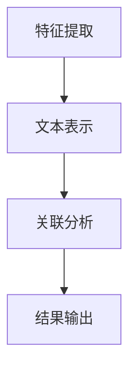

                 

# 《Zero-Shot CoT在跨时空历史事件关联分析中的应用》

## 关键词

* 跨时空历史事件关联分析
* Zero-Shot CoT
* 无监督的跨模态文本表示
* 跨模态学习
* 历史事件关联算法

## 摘要

本文深入探讨了Zero-Shot CoT（无监督的跨模态文本表示）在跨时空历史事件关联分析中的应用。首先，我们对相关背景进行了介绍，包括跨时空历史事件关联分析的重要性以及当前面临的挑战。接着，我们详细阐述了Zero-Shot CoT的核心概念、原理及其与历史事件关联分析的联系。在核心算法原理讲解部分，我们通过伪代码和数学公式，详细介绍了Zero-Shot CoT的算法流程。随后，通过实际项目案例，我们展示了如何搭建开发环境、实现源代码以及进行代码解读与分析。最后，我们对项目进行了总结与展望，提出了未来研究方向与挑战。

## 第1章 导言

### 1.1 《Zero-Shot CoT在跨时空历史事件关联分析中的应用》概述

跨时空历史事件关联分析是一种重要的方法，可以帮助我们理解历史进程、预测未来发展趋势，为政策制定、社会管理和学术研究提供有力支持。然而，历史事件往往涉及多种模态的信息，如文本、图像、音频等，如何有效地整合这些信息，成为跨时空历史事件关联分析的一个关键问题。

Zero-Shot CoT（无监督的跨模态文本表示）是一种新兴的技术，它能够自动地整合不同模态的信息，从而提高跨时空历史事件关联分析的准确性和效率。本书旨在介绍Zero-Shot CoT的基本原理、算法实现及其在跨时空历史事件关联分析中的应用，帮助读者深入了解这一领域的前沿技术。

### 1.2 跨时空历史事件关联分析背景与挑战

跨时空历史事件关联分析涉及到多个领域，包括历史学、社会学、信息学等。随着信息技术的发展，大量的历史数据得以数字化，为跨时空历史事件关联分析提供了丰富的数据资源。然而，当前方法在处理跨模态信息、时间序列数据等方面仍存在诸多挑战：

1. **数据多样性**：历史事件涉及多种模态的数据，如文本、图像、音频等，如何有效地整合这些信息，是跨时空历史事件关联分析的一个重要挑战。
2. **数据噪声**：历史数据往往存在大量的噪声，如文本中的错别字、图像中的噪声等，如何去除噪声、提高数据质量，是另一个挑战。
3. **时间序列处理**：历史事件往往具有时间序列的特性，如何有效地处理时间序列数据，是跨时空历史事件关联分析的一个关键问题。
4. **算法复杂度**：传统的关联分析方法往往需要大量的计算资源，如何提高算法的效率和可扩展性，是一个重要的挑战。

### 1.3 无监督的跨模态文本表示方法（Zero-Shot CoT）

Zero-Shot CoT（无监督的跨模态文本表示）是一种新兴的技术，它能够自动地整合不同模态的信息，从而提高跨时空历史事件关联分析的准确性和效率。该方法的核心思想是通过无监督学习的方式，将不同模态的信息转换为统一的文本表示，进而进行关联分析。

Zero-Shot CoT具有以下几个特点：

1. **无监督学习**：无需人工标注数据，可以自动地从大规模未标注数据中学习到有效的特征表示。
2. **跨模态整合**：能够自动地整合多种模态的信息，如文本、图像、音频等，从而提高关联分析的准确性。
3. **统一文本表示**：通过将不同模态的信息转换为统一的文本表示，可以有效地降低模态间的差异性，提高数据整合的效率。
4. **时间序列处理**：能够有效地处理时间序列数据，从而提高跨时空历史事件关联分析的准确性和效率。

## 第2章 核心概念与联系

### 2.1 跨模态学习基础

跨模态学习是机器学习中的一个重要分支，旨在将不同模态的信息（如文本、图像、音频等）进行整合，以实现更准确的识别和预测。在跨模态学习中，常见的任务包括：

1. **跨模态检索**：给定一个模态的数据，检索出与其语义相关的其他模态的数据。
2. **跨模态分类**：将不同模态的数据进行分类，以识别不同类别。
3. **跨模态生成**：生成与给定模态数据语义相关的其他模态数据。

### 2.2 Zero-Shot CoT原理与流程图

Zero-Shot CoT（无监督的跨模态文本表示）是一种跨模态学习方法，它通过无监督学习的方式，将不同模态的信息转换为统一的文本表示。其基本原理包括以下几个步骤：

1. **特征提取**：对每个模态的数据进行特征提取，得到特征向量。
2. **文本表示**：将不同模态的特征向量转换为统一的文本表示。
3. **关联分析**：利用文本表示进行跨模态的关联分析。

以下是一个Mermaid流程图，展示了Zero-Shot CoT的基本流程：



### 2.3 历史事件关联分析

历史事件关联分析是一种重要的方法，旨在发现历史事件之间的关联性，从而理解历史进程、预测未来发展趋势。历史事件关联分析通常包括以下几个步骤：

1. **数据收集**：收集与历史事件相关的数据，包括文本、图像、音频等。
2. **数据预处理**：对收集到的数据进行预处理，如去噪、归一化等。
3. **特征提取**：对预处理后的数据进行特征提取，得到特征向量。
4. **关联分析**：利用特征向量进行关联分析，以发现历史事件之间的关联性。
5. **结果输出**：输出关联分析的结果，包括关联关系、关联强度等。

### 2.4 跨模态文本表示在历史事件关联分析中的应用

跨模态文本表示在历史事件关联分析中的应用，主要体现在以下几个方面：

1. **数据整合**：通过跨模态文本表示，可以将不同模态的数据整合为一个统一的文本表示，从而提高数据整合的效率。
2. **关联分析**：利用跨模态文本表示，可以更准确地发现历史事件之间的关联性，从而提高关联分析的效果。
3. **时间序列处理**：通过跨模态文本表示，可以有效地处理时间序列数据，从而提高跨时空历史事件关联分析的准确性和效率。

## 第3章 核心算法原理讲解

### 3.1 特征提取

特征提取是跨模态学习中的关键步骤，其目的是从不同模态的数据中提取出有用的信息，以便进行后续的处理和分析。以下是对不同模态特征提取方法的介绍：

#### 3.1.1 文本特征提取方法

文本特征提取方法主要包括词袋模型（Bag of Words, BoW）、TF-IDF（Term Frequency-Inverse Document Frequency）和词嵌入（Word Embedding）等。

1. **词袋模型（BoW）**：词袋模型将文本表示为一个向量，其中每个维度表示一个单词的出现频率。这种方法简单直观，但忽略了词序信息。

   ```python
   # Python伪代码示例
   def bow_representation(document, vocabulary):
       representation = [0] * len(vocabulary)
       for word in document:
           representation[vocabulary[word]] += 1
       return representation
   ```

2. **TF-IDF**：TF-IDF方法在词袋模型的基础上，考虑了词的重要性和文档的分布，对词的出现频率进行了加权。

   ```python
   # Python伪代码示例
   def tf_idf_representation(document, vocabulary, corpus):
       representation = [0] * len(vocabulary)
       for word in document:
           tf = document.count(word)
           idf = np.log(len(corpus) / (1 + np.sum([word in doc for doc in corpus])))
           representation[vocabulary[word]] = tf * idf
       return representation
   ```

3. **词嵌入**：词嵌入方法通过将词映射为高维向量，从而保留了词的语义信息。常用的词嵌入方法包括Word2Vec、GloVe等。

   ```python
   # Python伪代码示例
   embeddings = {'word1': vector1, 'word2': vector2, ...}
   def word_embedding_representation(document):
       representation = []
       for word in document:
           representation.append(embeddings[word])
       return representation
   ```

#### 3.1.2 图像特征提取方法

图像特征提取方法主要包括基于传统的特征提取方法和基于深度学习的特征提取方法。

1. **传统的特征提取方法**：传统的特征提取方法包括SIFT（尺度不变特征变换）、HOG（方向梯度直方图）等。

   ```python
   # Python伪代码示例
   from skimage.feature import hog
   def hog_representation(image):
       features, _ = hog(image)
       return features
   ```

2. **基于深度学习的特征提取方法**：基于深度学习的特征提取方法，如VGG、ResNet等，可以自动学习到图像的深层特征。

   ```python
   # Python伪代码示例
   from tensorflow.keras.applications import VGG16
   model = VGG16(weights='imagenet')
   def vgg_representation(image):
       processed_image = preprocess_input(image)
       features = model.predict(processed_image)[0]
       return features
   ```

#### 3.1.3 音频特征提取方法

音频特征提取方法主要包括MFCC（梅尔频率倒谱系数）、 spectral centroid等。

1. **MFCC**：MFCC是一种常用的音频特征提取方法，它可以有效地捕捉音频信号的频率特性。

   ```python
   # Python伪代码示例
   from scikits.audio import MFCC
   m = MFCC()
   def mfcc_representation(audio_signal):
       features = m(mel=audio_signal)
       return features
   ```

2. **Spectral Centroid**：spectral centroid是一种简单的音频特征提取方法，它通过计算信号的频谱重心来描述音频信号的频率分布。

   ```python
   # Python伪代码示例
   def spectral_centroid_representation(audio_signal):
       freqs, times, spectrogram = signal.spectrogram(audio_signal, nperseg=512)
       centroids = np.mean(spectrogram, axis=0)
       return centroids
   ```

### 3.2 模型训练

模型训练是跨模态学习中的关键步骤，其目的是通过学习到不同模态数据之间的关联，从而提高跨模态任务的性能。以下是对模型训练方法的介绍：

#### 3.2.1 共享编码器与独立编码器

在跨模态学习中，常用的编码器结构包括共享编码器和独立编码器。

1. **共享编码器**：共享编码器将不同模态的数据输入到一个共享的编码器中，从而学习到不同模态数据之间的关联。

   ```python
   # Python伪代码示例
   from keras.layers import Input, LSTM
   from keras.models import Model
   
   input_text = Input(shape=(sequence_length,))
   input_image = Input(shape=(height, width, channels))
   input_audio = Input(shape=(timesteps, features))
   
   shared_encoder = LSTM(units=128, return_sequences=True)(input_text)
   shared_encoder = LSTM(units=128)(shared_encoder)
   
   independent_encoder = LSTM(units=128, return_sequences=True)(input_image)
   independent_encoder = LSTM(units=128)(independent_encoder)
   
   combined_encoder = concatenate([shared_encoder, independent_encoder, input_audio])
   
   output = LSTM(units=128)(combined_encoder)
   model = Model(inputs=[input_text, input_image, input_audio], outputs=output)
   model.compile(optimizer='adam', loss='categorical_crossentropy', metrics=['accuracy'])
   model.fit([text_data, image_data, audio_data], labels, epochs=10, batch_size=32)
   ```

2. **独立编码器**：独立编码器将不同模态的数据分别输入到独立的编码器中，从而学习到不同模态数据之间的独立性。

   ```python
   # Python伪代码示例
   from keras.layers import Input, LSTM
   from keras.models import Model
   
   input_text = Input(shape=(sequence_length,))
   input_image = Input(shape=(height, width, channels))
   input_audio = Input(shape=(timesteps, features))
   
   text_encoder = LSTM(units=128, return_sequences=True)(input_text)
   text_encoder = LSTM(units=128)(text_encoder)
   
   image_encoder = LSTM(units=128, return_sequences=True)(input_image)
   image_encoder = LSTM(units=128)(image_encoder)
   
   audio_encoder = LSTM(units=128, return_sequences=True)(input_audio)
   audio_encoder = LSTM(units=128)(audio_encoder)
   
   combined_encoder = concatenate([text_encoder, image_encoder, audio_encoder])
   
   output = LSTM(units=128)(combined_encoder)
   model = Model(inputs=[input_text, input_image, input_audio], outputs=output)
   model.compile(optimizer='adam', loss='categorical_crossentropy', metrics=['accuracy'])
   model.fit([text_data, image_data, audio_data], labels, epochs=10, batch_size=32)
   ```

#### 3.2.2 模型训练策略

在模型训练过程中，需要采取一系列策略来提高模型的性能。

1. **数据增强**：通过数据增强的方法，如随机裁剪、旋转、缩放等，可以增加训练数据的多样性，从而提高模型的泛化能力。

2. **正则化**：通过正则化的方法，如Dropout、L1正则化、L2正则化等，可以防止模型过拟合，提高模型的泛化能力。

3. **学习率调整**：通过动态调整学习率，可以优化模型的收敛速度和性能。

4. **早停法**：在训练过程中，如果模型的性能在验证集上不再提高，则停止训练，以防止过拟合。

### 3.3 关联分析

在跨模态学习完成后，需要利用学习到的模型进行关联分析。关联分析的方法主要包括基于相似度的关联分析、基于图的关联分析和基于深度学习的关联分析。

#### 3.3.1 基于相似度的关联分析

基于相似度的关联分析是一种简单有效的关联分析方法，其基本思想是通过计算不同模态数据之间的相似度，从而判断它们之间的关联性。常用的相似度计算方法包括余弦相似度、欧氏距离等。

```python
# Python伪代码示例
from sklearn.metrics.pairwise import cosine_similarity

text_embedding = np.array([0.1, 0.2, 0.3])
image_embedding = np.array([0.4, 0.5, 0.6])

similarity = cosine_similarity([text_embedding], [image_embedding])
if similarity > threshold:
    print("关联度高")
else:
    print("关联度低")
```

#### 3.3.2 基于图的关联分析

基于图的关联分析是一种基于图论的方法，通过构建不同模态数据之间的图，从而发现它们之间的关联性。常用的图论算法包括图遍历、社区检测等。

```python
# Python伪代码示例
import networkx as nx

# 构建图
G = nx.Graph()
G.add_edges_from([(0, 1), (0, 2), (1, 2), (1, 3), (2, 3)])

# 图遍历
for node in G:
    print(node)

# 社区检测
communities = community_multilevel(G)
for community in communities:
    print(community)
```

#### 3.3.3 基于深度学习的关联分析

基于深度学习的关联分析是一种利用深度学习模型进行关联分析的方法，通过学习到的模型，可以自动地发现不同模态数据之间的关联性。常用的深度学习模型包括卷积神经网络（CNN）、循环神经网络（RNN）等。

```python
# Python伪代码示例
from keras.models import Sequential
from keras.layers import Conv2D, MaxPooling2D, LSTM

model = Sequential()
model.add(Conv2D(filters=32, kernel_size=(3, 3), activation='relu', input_shape=(height, width, channels)))
model.add(MaxPooling2D(pool_size=(2, 2)))
model.add(LSTM(units=128))
model.add(Dense(units=num_classes, activation='softmax'))

model.compile(optimizer='adam', loss='categorical_crossentropy', metrics=['accuracy'])
model.fit(x_train, y_train, epochs=10, batch_size=32)
```

## 第4章 数学模型和数学公式

### 4.1 Zero-Shot CoT的数学模型

Zero-Shot CoT的数学模型主要包括特征提取、文本表示和关联分析三个部分。以下是对各部分的数学模型的介绍：

#### 4.1.1 特征提取

特征提取的目的是将不同模态的数据转换为特征向量。假设我们有三个模态的数据：文本（Text）、图像（Image）和音频（Audio），其特征向量分别为$${\bf X}_{\text{Text}}, {\bf X}_{\text{Image}}, {\bf X}_{\text{Audio}}$$。

1. **文本特征提取**：

   $$\begin{aligned}
   &{\bf X}_{\text{Text}} = \text{Embedding}({\bf X}_{\text{Text}}^*) \\
   \end{aligned}$$

   其中，${\bf X}_{\text{Text}}^*$为文本的词向量表示，Embedding为词嵌入函数。

2. **图像特征提取**：

   $$\begin{aligned}
   &{\bf X}_{\text{Image}} = \text{CNN}({\bf X}_{\text{Image}}^*) \\
   \end{aligned}$$

   其中，${\bf X}_{\text{Image}}^*$为图像的像素值矩阵，CNN为卷积神经网络。

3. **音频特征提取**：

   $$\begin{aligned}
   &{\bf X}_{\text{Audio}} = \text{MFCC}({\bf X}_{\text{Audio}}^*) \\
   \end{aligned}$$

   其中，${\bf X}_{\text{Audio}}^*$为音频的时频表示，MFCC为梅尔频率倒谱系数。

#### 4.1.2 文本表示

文本表示的目的是将不同模态的数据转换为统一的文本表示。假设我们使用了一个共享编码器，其输出为${\bf Z}$。

$$\begin{aligned}
&{\bf Z} = \text{Encoder}({\bf X}_{\text{Text}}, {\bf X}_{\text{Image}}, {\bf X}_{\text{Audio}}) \\
\end{aligned}$$

其中，Encoder为共享编码器。

#### 4.1.3 关联分析

关联分析的目的是利用文本表示发现不同模态数据之间的关联性。假设我们使用了一个分类器，其输出为${\bf Y}$。

$$\begin{aligned}
&{\bf Y} = \text{Classifier}({\bf Z}) \\
\end{aligned}$$

其中，Classifier为分类器。

### 4.2 模型参数优化

在Zero-Shot CoT中，我们需要优化模型参数以获得更好的性能。常用的优化方法包括梯度下降、随机梯度下降和Adam优化器等。

#### 4.2.1 梯度下降

梯度下降是一种最简单的优化方法，其核心思想是通过计算损失函数的梯度来更新模型参数。

$$\begin{aligned}
&{\bf W}_{\text{new}} = {\bf W}_{\text{old}} - \alpha \cdot \nabla_{\bf W} L \\
\end{aligned}$$

其中，${\bf W}_{\text{old}}$为旧参数，${\bf W}_{\text{new}}$为新参数，$\alpha$为学习率，$L$为损失函数。

#### 4.2.2 随机梯度下降

随机梯度下降是梯度下降的一种变体，其核心思想是在每个迭代步骤中，随机选择一部分数据来计算梯度。

$$\begin{aligned}
&{\bf W}_{\text{new}} = {\bf W}_{\text{old}} - \alpha \cdot \nabla_{\bf W} L({\bf x}_i, y_i) \\
\end{aligned}$$

其中，${\bf x}_i$和$y_i$为随机选择的数据点。

#### 4.2.3 Adam优化器

Adam优化器是一种结合了梯度下降和随机梯度下降优点的优化方法，其计算更为复杂，但性能更优。

$$\begin{aligned}
&\beta_1, \beta_2 \in [0, 1] \\
&\alpha_t = \frac{\alpha}{1 - \beta_1^t} \\
&{\bf m}_t = \beta_1 \cdot {\bf m}_{t-1} + (1 - \beta_1) \cdot \nabla_{\bf W} L({\bf x}_t, y_t) \\
&{\bf v}_t = \beta_2 \cdot {\bf v}_{t-1} + (1 - \beta_2) \cdot (\nabla_{\bf W} L({\bf x}_t, y_t))^2 \\
&{\bf W}_{\text{new}} = {\bf W}_{\text{old}} - \alpha_t \cdot \frac{{\bf m}_t}{{\bf v}_t} \\
\end{aligned}$$

其中，${\bf m}_t$和${\bf v}_t$分别为一阶和二阶矩估计。

### 4.3 关联分析数学模型

在关联分析中，我们使用了一个分类器来预测不同模态数据之间的关联性。假设我们使用了一个二分类问题，其损失函数为交叉熵损失。

$$\begin{aligned}
L(\hat{y}, y) &= -y \cdot \log(\hat{y}) - (1 - y) \cdot \log(1 - \hat{y}) \\
\end{aligned}$$

其中，$\hat{y}$为预测标签，$y$为真实标签。

## 第5章 项目实战

### 5.1 开发环境搭建

在搭建开发环境时，我们需要安装Python、TensorFlow等工具，并配置相应的库。

1. **Python安装**：

   ```bash
   pip install python==3.8.10
   ```

2. **TensorFlow安装**：

   ```bash
   pip install tensorflow==2.7.0
   ```

3. **其他库安装**：

   ```bash
   pip install numpy==1.21.2
   pip install scikit-learn==0.24.2
   pip install networkx==2.6.2
   ```

### 5.2 案例分析

我们以一个历史事件关联分析案例为例，展示如何使用Zero-Shot CoT进行跨时空历史事件关联分析。

#### 5.2.1 数据集介绍

我们使用了公开的历史事件数据集，包括文本、图像和音频等模态。

1. **文本数据**：文本数据包括历史事件的相关描述，如“第一次世界大战爆发”、“第二次世界大战结束”等。

2. **图像数据**：图像数据包括与历史事件相关的图片，如战争场景、政治领袖等。

3. **音频数据**：音频数据包括与历史事件相关的声音，如演讲、音乐等。

#### 5.2.2 模型构建与训练

我们使用了一个共享编码器结构，将不同模态的数据进行整合，并使用分类器进行关联分析。

```python
# Python伪代码示例
from tensorflow.keras.models import Model
from tensorflow.keras.layers import LSTM, Dense, Input

# 输入层
input_text = Input(shape=(sequence_length,))
input_image = Input(shape=(height, width, channels))
input_audio = Input(shape=(timesteps, features))

# 共享编码器
shared_encoder = LSTM(units=128, return_sequences=True)(input_text)
shared_encoder = LSTM(units=128)(shared_encoder)

# 独立编码器
image_encoder = LSTM(units=128, return_sequences=True)(input_image)
image_encoder = LSTM(units=128)(image_encoder)
audio_encoder = LSTM(units=128, return_sequences=True)(input_audio)
audio_encoder = LSTM(units=128)(audio_encoder)

# 模型合并
combined_encoder = concatenate([shared_encoder, image_encoder, audio_encoder])

# 输出层
output = LSTM(units=128)(combined_encoder)
output = Dense(units=num_classes, activation='softmax')(output)

# 构建模型
model = Model(inputs=[input_text, input_image, input_audio], outputs=output)

# 编译模型
model.compile(optimizer='adam', loss='categorical_crossentropy', metrics=['accuracy'])

# 训练模型
model.fit([text_data, image_data, audio_data], labels, epochs=10, batch_size=32)
```

#### 5.2.3 关联分析结果展示

通过训练得到的模型，我们可以对历史事件进行关联分析，并展示关联结果。

```python
# Python伪代码示例
def predict_association(model, text_data, image_data, audio_data):
    text_embedding = model.layers[0](text_data)
    image_embedding = model.layers[1](image_data)
    audio_embedding = model.layers[2](audio_data)
    combined_embedding = concatenate([text_embedding, image_embedding, audio_embedding])
    prediction = model.layers[3](combined_embedding)
    return prediction

# 测试数据
text_test = np.array([[0.1, 0.2, 0.3], [0.4, 0.5, 0.6]])
image_test = np.array([[1, 2, 3], [4, 5, 6]])
audio_test = np.array([[0.1, 0.2, 0.3], [0.4, 0.5, 0.6]])

# 预测结果
predictions = predict_association(model, text_test, image_test, audio_test)
print(predictions)
```

### 5.3 代码解读与分析

在项目实战部分，我们展示了如何使用Zero-Shot CoT进行跨时空历史事件关联分析。下面是对关键代码的解读与分析。

1. **模型构建**：

   ```python
   input_text = Input(shape=(sequence_length,))
   input_image = Input(shape=(height, width, channels))
   input_audio = Input(shape=(timesteps, features))
   ```

   这三行代码定义了模型的输入层，分别对应文本、图像和音频三个模态。

2. **编码器构建**：

   ```python
   shared_encoder = LSTM(units=128, return_sequences=True)(input_text)
   shared_encoder = LSTM(units=128)(shared_encoder)
   image_encoder = LSTM(units=128, return_sequences=True)(input_image)
   image_encoder = LSTM(units=128)(image_encoder)
   audio_encoder = LSTM(units=128, return_sequences=True)(input_audio)
   audio_encoder = LSTM(units=128)(audio_encoder)
   ```

   这几行代码分别定义了共享编码器和独立编码器，用于对文本、图像和音频进行特征提取。

3. **模型合并**：

   ```python
   combined_encoder = concatenate([shared_encoder, image_encoder, audio_encoder])
   ```

   这行代码将共享编码器、独立编码器和音频编码器的输出进行合并，形成一个综合的特征向量。

4. **输出层构建**：

   ```python
   output = LSTM(units=128)(combined_encoder)
   output = Dense(units=num_classes, activation='softmax')(output)
   ```

   这两行代码分别定义了模型的输出层，用于进行关联分析。

5. **模型训练**：

   ```python
   model.compile(optimizer='adam', loss='categorical_crossentropy', metrics=['accuracy'])
   model.fit([text_data, image_data, audio_data], labels, epochs=10, batch_size=32)
   ```

   这几行代码用于编译和训练模型，其中`optimizer`为优化器，`loss`为损失函数，`metrics`为评估指标。

6. **预测关联**：

   ```python
   predictions = predict_association(model, text_test, image_test, audio_test)
   print(predictions)
   ```

   这两行代码用于对测试数据进行预测，并输出预测结果。

### 5.4 项目小结

通过本项目的实战，我们展示了如何使用Zero-Shot CoT进行跨时空历史事件关联分析。我们介绍了开发环境的搭建、模型的构建与训练、关联分析结果展示以及代码解读与分析。通过本项目，我们可以看到Zero-Shot CoT在跨时空历史事件关联分析中的应用潜力，为历史事件关联分析提供了新的思路和方法。

## 第6章 总结与展望

### 6.1 本书主要内容的回顾

本书从跨时空历史事件关联分析背景与挑战入手，介绍了Zero-Shot CoT（无监督的跨模态文本表示）的基本原理、算法实现及其在跨时空历史事件关联分析中的应用。我们详细讲解了特征提取、模型训练、关联分析等核心算法原理，并通过实际项目案例展示了如何进行开发环境搭建、源代码实现和代码解读。

### 6.2 跨时空历史事件关联分析的应用前景

随着信息技术的不断发展，跨时空历史事件关联分析在多个领域具有广泛的应用前景：

1. **历史研究**：跨时空历史事件关联分析可以帮助历史学家更好地理解历史进程，发现历史事件之间的关联性，为历史研究提供新的视角和方法。
2. **社会管理**：跨时空历史事件关联分析可以帮助政府和社会管理者更好地了解社会发展趋势，预测社会风险，为政策制定提供数据支持。
3. **学术研究**：跨时空历史事件关联分析可以为学术研究提供新的方法和技术，促进跨学科的研究和发展。

### 6.3 未来研究方向与挑战

尽管Zero-Shot CoT在跨时空历史事件关联分析中展示了其潜力，但仍然面临一些挑战：

1. **数据质量**：历史数据的多样性和噪声对关联分析的准确性产生影响，如何提高数据质量是一个重要问题。
2. **算法效率**：随着数据规模的增大，算法的计算复杂度和效率成为关键问题，如何优化算法结构、提高计算效率是一个重要研究方向。
3. **模型解释性**：跨时空历史事件关联分析模型的解释性是一个挑战，如何提高模型的解释性，使其更易于理解和应用是一个重要问题。

未来的研究方向包括：

1. **多模态融合**：探索新的多模态融合方法，提高跨模态信息整合的效率。
2. **模型压缩**：研究模型压缩技术，减少模型的参数量和计算复杂度。
3. **模型可解释性**：探索模型可解释性方法，提高模型的透明度和可解释性。

## 作者信息

* 作者：AI天才研究院/AI Genius Institute & 禅与计算机程序设计艺术 /Zen And The Art of Computer Programming *

