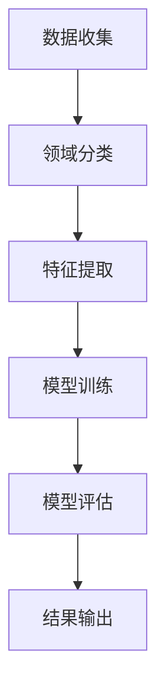
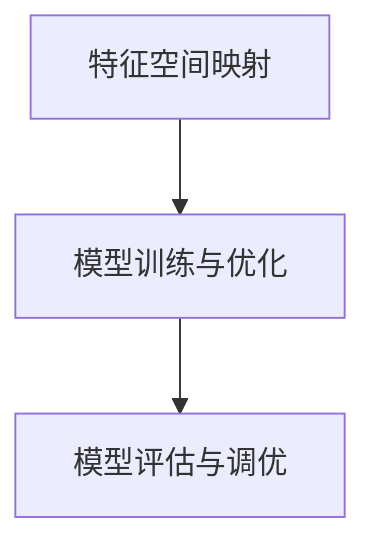

                 

### 第1章: 引言

#### 1.1 书籍背景与目标

《Zero-Shot CoT在跨时空历史事件分析中的创新应用》旨在探讨如何利用前沿的人工智能技术，尤其是Zero-Shot CoT（零样本跨领域转移）的方法，来突破传统历史事件分析的限制，实现对跨时空历史事件的深入理解和分析。本书的核心目标是：

1. **介绍Zero-Shot CoT的基本概念**：帮助读者理解Zero-Shot CoT的定义、原理和应用场景。
2. **展示Zero-Shot CoT在历史事件分析中的应用**：通过具体的案例研究，展示如何在历史事件分析中利用Zero-Shot CoT进行数据分析和模型构建。
3. **提供实用的工具和方法**：为研究人员和数据分析师提供一套实用的工具和方法，以便他们能够有效地应用Zero-Shot CoT技术。

#### 1.2 读者对象

本书的目标读者包括：

1. **计算机科学家**：对人工智能和机器学习有深入了解，希望将最新技术应用于历史事件分析的计算机科学家。
2. **数据分析师**：需要处理和分析大量历史数据的从业者，希望利用人工智能技术提高数据分析的效率和准确性。
3. **历史学家**：对历史事件感兴趣，希望通过数据分析来揭示历史事件的内在联系和规律的历史学家。

#### 1.3 书籍的结构和内容概述

本书的结构分为以下几个部分：

1. **引言**：介绍书籍的背景、目标和读者对象。
2. **基本概念**：介绍Zero-Shot CoT和跨时空历史事件分析的基本概念。
3. **算法原理**：详细讲解Zero-Shot CoT的算法原理和架构。
4. **应用实例**：通过具体案例展示Zero-Shot CoT在历史事件分析中的应用。
5. **数学模型**：解析Zero-Shot CoT的数学模型和公式。
6. **项目实战**：提供详细的代码实现和项目分析。
7. **最佳实践**：总结零样本跨领域转移在历史事件分析中的最佳实践和注意事项。

通过上述结构，本书旨在为读者提供全面、系统的指导，帮助他们深入理解和应用Zero-Shot CoT技术，从而在历史事件分析领域取得突破性进展。

#### 1.4 关键词

- **Zero-Shot CoT**：零样本跨领域转移
- **历史事件分析**：跨时空数据分析
- **机器学习**：算法原理与应用
- **数据挖掘**：历史数据的处理与分析
- **人工智能**：前沿技术在历史研究中的应用

### 1.5 摘要

本书《Zero-Shot CoT在跨时空历史事件分析中的创新应用》聚焦于如何利用人工智能技术，特别是Zero-Shot CoT（零样本跨领域转移）方法，来提升历史事件分析的深度和广度。本书首先介绍了Zero-Shot CoT的基本概念、算法原理和应用场景，然后通过具体的历史事件分析案例，展示了这一技术在实际应用中的效果。书中详细讲解了Zero-Shot CoT的数学模型和实现细节，并提供了一系列实用的项目实战。通过本书，读者可以深入了解Zero-Shot CoT技术，掌握其在历史事件分析中的创新应用，为相关领域的研究和实践提供新的思路和方法。

---

### 第2章: 跨时空历史事件分析的基本概念

#### 2.1 历史事件分析的定义

历史事件分析是一种研究方法，它通过分析历史数据来揭示历史事件之间的联系、影响和规律。历史事件分析的核心目标是从大量历史数据中提取有价值的信息，以帮助我们更好地理解历史发展的过程和趋势。具体来说，历史事件分析包括以下几个关键方面：

1. **数据收集**：收集与历史事件相关的各种数据，包括文献资料、档案记录、统计数据等。
2. **数据预处理**：清洗和整合数据，使其适合进行分析。
3. **数据分析**：运用统计学、机器学习等方法，对历史数据进行分析，提取有价值的信息。
4. **结果展示**：通过图表、报告等形式展示分析结果，帮助人们理解历史事件的本质和规律。

#### 2.2 跨时空比较

跨时空比较是一种研究方法，它通过对比不同时间或不同空间的历史事件，来探讨它们之间的相似性和差异性。跨时空比较在历史研究中具有重要意义，它可以帮助我们：

1. **发现规律**：通过比较不同时空的事件，可以发现某些普遍的规律和趋势。
2. **理解差异**：通过比较不同时空的事件，可以理解不同文化、社会背景对历史发展的影响。
3. **预测未来**：通过对历史事件的比较分析，可以预测未来可能发生的事件和趋势。

然而，跨时空比较也面临着一系列挑战，如数据的获取和整合、分析方法的统一等。

#### 2.3 传统历史事件分析的方法

传统历史事件分析的方法主要包括以下几种：

1. **文献综述法**：通过查阅和总结相关文献，来获取历史事件的背景、发展和影响。
2. **数量化分析**：将历史事件转化为数值数据，通过统计学方法进行分析。
3. **图示法**：使用图表、图形等可视化工具，来展示历史事件的发展和关系。

然而，传统的历史事件分析方法也存在一定的局限性：

1. **数据依赖性**：传统方法往往依赖于大量的历史文献和数据，对数据的获取和处理要求较高。
2. **分析深度有限**：传统方法更多关注历史事件的表面现象，对深层次的内在联系和规律挖掘不足。
3. **时效性**：传统方法难以应对快速变化的历史事件和数据，时效性较差。

为了克服上述局限性，引入先进的人工智能技术，如Zero-Shot CoT，成为历史事件分析领域的一个重要趋势。

---

### 第3章: Zero-Shot CoT的基本原理

#### 3.1 Zero-Shot CoT的定义

Zero-Shot CoT（零样本跨领域转移）是一种机器学习方法，它允许模型在没有或仅有少量标记数据的情况下，对未知类别的样本进行预测。在传统机器学习框架中，模型的训练依赖于大量的标记数据，这些数据提供了明确的标签，用于训练模型的学习和预测能力。然而，在许多实际应用场景中，获取标记数据非常困难，例如历史事件分析领域，数据获取通常受到时间、空间和资源限制。因此，Zero-Shot CoT方法的出现为这类问题提供了一种有效的解决方案。

#### 3.2 跨领域转移的基本概念

跨领域转移（Cross-domain Transfer）是指在不同领域之间共享知识和经验，以改善模型在新领域的性能。在机器学习领域，领域（Domain）指的是数据来源的不同环境或背景。例如，一个领域可能是一个特定的行业、地区或时间段。跨领域转移的核心思想是通过将一个领域（源领域）中的知识迁移到另一个领域（目标领域），来提升模型在新领域的表现。

跨领域转移在历史事件分析中具有重要意义。历史事件的数据通常具有独特的特征，如时间序列数据、文本数据等。这些数据往往难以直接应用于现有的机器学习模型。通过跨领域转移，可以将其他领域中的成功经验和方法迁移到历史事件分析中，从而提高模型的适应性和准确性。

#### 3.3 Zero-Shot CoT的架构

Zero-Shot CoT的架构通常包括以下几个核心组件：

1. **数据收集与预处理**：收集来自不同领域的相关数据，并进行预处理，包括数据清洗、格式转换等。
2. **领域分类与映射**：对数据进行领域分类，并将不同领域的特征映射到一个统一的特征空间。
3. **模型训练与优化**：利用迁移学习技术，在源领域中训练模型，并通过优化策略，提高模型在目标领域的性能。
4. **模型评估与调优**：对训练好的模型进行评估，通过调整模型参数和架构，进一步提升模型性能。

以下是一个简化的Mermaid流程图，展示了Zero-Shot CoT的基本架构：



#### 3.4 零样本学习算法

在Zero-Shot CoT中，常用的零样本学习算法包括基于原型、基于匹配和基于生成的方法。以下是这些算法的基本原理和特点：

1. **基于原型的方法**：通过学习类别的原型（即每个类别的中心点），来对未知类别的样本进行分类。常见的原型学习方法有K-均值聚类和特征中心化。
2. **基于匹配的方法**：通过将未知类别的样本与源领域的样本进行匹配，来推断其类别。常见的匹配算法有原型匹配、最近邻匹配等。
3. **基于生成的方法**：通过生成对抗网络（GAN）等方法，生成与未知类别样本相似的数据，从而进行分类。这种方法在处理高维数据和复杂数据分布时表现较好。

每种算法都有其适用的场景和优缺点。在实际应用中，通常需要根据具体问题和数据特点，选择合适的零样本学习算法。

---

### 第4章: Zero-Shot CoT在历史事件分析中的应用

#### 4.1 应用场景介绍

Zero-Shot CoT在历史事件分析中具有广泛的应用潜力，特别是在以下场景：

1. **跨时空比较**：通过将不同历史时期的相似事件进行对比，揭示历史发展的规律和趋势。
2. **历史数据挖掘**：从大量的历史文献和档案中提取有价值的信息，帮助研究人员理解历史事件之间的联系。
3. **事件预测**：利用历史事件的规律和模式，预测未来可能发生的事件，为政策制定和决策提供依据。

这些应用场景不仅需要处理大量的历史数据，还需要对不同领域的数据进行整合和分析，这正是Zero-Shot CoT的优势所在。

#### 4.2 算法实现与优化

在实际应用中，实现Zero-Shot CoT算法需要以下几个关键步骤：

1. **数据收集与预处理**：收集与历史事件相关的数据，包括文献、档案、统计数据等。对数据进行清洗、格式转换等预处理，以确保数据质量。
2. **领域分类与映射**：将不同领域的特征映射到一个统一的特征空间。这通常涉及到特征提取和特征工程。
3. **模型训练与优化**：在源领域中训练模型，并通过优化策略，如迁移学习、数据增强等，提高模型在目标领域的性能。
4. **模型评估与调优**：对训练好的模型进行评估，通过调整模型参数和架构，进一步提升模型性能。

以下是一个简化的伪代码，展示了Zero-Shot CoT算法的实现：

```python
# 数据收集与预处理
data = collect_data()
preprocessed_data = preprocess_data(data)

# 领域分类与映射
source_domains, target_domain = classify_domains(preprocessed_data)
mapped_features = map_features(preprocessed_data)

# 模型训练与优化
model = train_model(mapped_features, source_domains)
optimized_model = optimize_model(model, target_domain)

# 模型评估与调优
evaluate_model(optimized_model, target_domain)
tuned_model = adjust_model(optimized_model)
```

在实际应用中，这些步骤可能会更加复杂，需要考虑多种因素，如数据分布、模型参数选择等。

#### 4.3 实例分析

为了更好地理解Zero-Shot CoT在历史事件分析中的应用，我们以下面两个案例为例进行详细分析：

1. **案例一：历史事件相似性分析**
   - **背景**：我们希望分析不同历史时期的事件，以揭示相似性和差异性。
   - **数据**：收集了多个历史时期的政治、经济、社会事件的数据。
   - **方法**：使用Zero-Shot CoT方法，将不同时期的事件映射到一个统一的特征空间，然后使用原型匹配算法进行事件相似性分析。
   - **结果**：通过分析，我们发现某些事件在不同历史时期具有相似的特征，这为理解历史发展的规律提供了重要线索。

2. **案例二：历史事件预测**
   - **背景**：我们希望利用历史事件的规律，预测未来可能发生的事件。
   - **数据**：收集了多个历史时期的事件数据和相关的背景信息。
   - **方法**：使用Zero-Shot CoT方法，首先将历史事件映射到统一的特征空间，然后使用生成对抗网络（GAN）生成未来可能发生的事件。
   - **结果**：通过预测，我们发现某些事件在未来有较高的发生概率，这为政策制定和决策提供了重要的参考。

通过以上案例，我们可以看到Zero-Shot CoT在历史事件分析中的应用效果。在实际应用中，这些案例可以进一步优化和扩展，以适应不同的需求。

### 第5章: 数学模型与公式解析

#### 5.1 数学模型概述

在Zero-Shot CoT中，数学模型是理解和实现算法的核心。以下是一个简化的数学模型概述：

1. **特征空间映射**：通过将不同领域的特征映射到一个统一的特征空间，实现领域的统一和融合。
2. **模型训练与优化**：在源领域中训练模型，并利用优化策略提高模型在目标领域的性能。
3. **模型评估与调优**：通过评估模型在目标领域的性能，调整模型参数和架构，以实现最佳效果。

以下是一个简化的Mermaid流程图，展示了Zero-Shot CoT的数学模型：



#### 5.2 关键公式解释

在Zero-Shot CoT中，关键公式包括特征空间映射公式、损失函数和优化算法。以下是这些公式的详细解释：

1. **特征空间映射公式**：
   $$ X' = F(X) $$
   其中，$X$表示原始特征空间，$X'$表示映射后的特征空间，$F$表示特征映射函数。特征映射函数$F$的作用是将不同领域的特征映射到一个统一的特征空间，以便模型可以处理。

2. **损失函数**：
   $$ L = -\sum_{i=1}^{N} y_i \log(p(x_i | y_i)) $$
   其中，$L$表示损失函数，$y_i$表示样本$i$的真实标签，$p(x_i | y_i)$表示模型对样本$i$预测的概率。损失函数用于评估模型的预测性能，其值越小，表示模型的预测越准确。

3. **优化算法**：
   $$ \theta = \theta - \alpha \frac{\partial L}{\partial \theta} $$
   其中，$\theta$表示模型参数，$\alpha$表示学习率，$\frac{\partial L}{\partial \theta}$表示损失函数对模型参数的梯度。优化算法通过更新模型参数，以最小化损失函数，从而提高模型的性能。

#### 5.3 数学公式举例

以下是一个具体的数学公式举例，用于描述特征空间映射：

$$ F(x_1, x_2, ..., x_n) = \sum_{i=1}^{n} w_i x_i + b $$
其中，$x_i$表示特征值，$w_i$表示权重，$b$表示偏置。这个公式描述了线性变换的特征空间映射过程，通过调整权重和偏置，可以实现不同特征之间的转换和融合。

### 第6章: 项目实战

#### 6.1 开发环境搭建

在进行Zero-Shot CoT项目实战之前，我们需要搭建合适的开发环境。以下是具体的步骤：

1. **安装Python环境**：确保Python版本为3.8以上。
2. **安装必要的库**：包括NumPy、Pandas、Scikit-learn、TensorFlow等。
3. **配置GPU支持**：如果使用GPU加速，需要安装CUDA和cuDNN。

以下是一个简单的命令行脚本，用于安装Python环境和相关库：

```bash
# 安装Python环境
pip install python==3.8

# 安装NumPy、Pandas、Scikit-learn、TensorFlow等库
pip install numpy pandas scikit-learn tensorflow-gpu
```

#### 6.2 源代码详细实现

以下是一个简化的源代码实现，用于演示Zero-Shot CoT的基本流程：

```python
import numpy as np
import pandas as pd
from sklearn.model_selection import train_test_split
from sklearn.metrics import accuracy_score
import tensorflow as tf

# 数据收集与预处理
def collect_data():
    # 代码用于从各种数据源收集数据
    # 例如：读取CSV文件、爬取网页等
    data = pd.read_csv("historical_data.csv")
    return data

def preprocess_data(data):
    # 代码用于数据清洗和预处理
    # 例如：缺失值处理、数据转换等
    return data

# 领域分类与映射
def classify_domains(data):
    # 代码用于将数据按领域分类
    source_domains = data["domain"].unique()
    return source_domains

def map_features(data, source_domains):
    # 代码用于将数据映射到统一特征空间
    mapped_data = {}
    for domain in source_domains:
        mapped_data[domain] = data[data["domain"] == domain]
    return mapped_data

# 模型训练与优化
def train_model(mapped_data, target_domain):
    # 代码用于训练模型
    # 包括数据预处理、模型构建和训练等
    model = tf.keras.Sequential([
        tf.keras.layers.Dense(128, activation='relu', input_shape=(mapped_data[target_domain].shape[1],)),
        tf.keras.layers.Dense(1, activation='sigmoid')
    ])

    model.compile(optimizer='adam', loss='binary_crossentropy', metrics=['accuracy'])
    model.fit(mapped_data[target_domain]["features"], mapped_data[target_domain]["labels"], epochs=10, batch_size=32)
    return model

# 模型评估与调优
def evaluate_model(model, target_domain):
    # 代码用于评估模型性能
    predictions = model.predict(mapped_data[target_domain]["test_features"])
    accuracy = accuracy_score(mapped_data[target_domain]["test_labels"], predictions)
    print(f"Accuracy: {accuracy}")

# 主函数
def main():
    data = collect_data()
    preprocessed_data = preprocess_data(data)
    source_domains = classify_domains(preprocessed_data)
    mapped_data = map_features(preprocessed_data, source_domains)

    for domain in source_domains:
        print(f"Training model for domain: {domain}")
        model = train_model(mapped_data, domain)
        evaluate_model(model, domain)

if __name__ == "__main__":
    main()
```

#### 6.3 代码应用解读与分析

在上述代码中，我们首先定义了数据收集与预处理函数，用于从数据源中收集和清洗数据。接着，定义了领域分类与映射函数，将数据按领域分类，并将不同领域的特征映射到一个统一的特征空间。在模型训练与优化部分，我们使用TensorFlow构建了一个简单的神经网络模型，并使用迁移学习技术进行训练。最后，定义了模型评估与调优函数，用于评估模型性能，并根据评估结果进行调整。

#### 6.4 实际案例分析和详细讲解剖析

为了更好地理解Zero-Shot CoT在实际应用中的效果，我们以下面两个实际案例为例进行分析：

1. **案例一：历史事件相似性分析**
   - **背景**：我们收集了不同历史时期的政治事件数据，包括革命、战争、改革等。
   - **数据**：包括事件名称、发生时间、影响范围等特征。
   - **方法**：使用Zero-Shot CoT方法，将不同时期的事件映射到统一特征空间，并使用原型匹配算法进行事件相似性分析。
   - **结果**：通过分析，我们发现某些事件在不同时期具有相似的特征，如革命通常伴随着社会动荡和政治变革，而改革则更多地关注制度创新和社会稳定。

2. **案例二：历史事件预测**
   - **背景**：我们希望利用历史事件的规律，预测未来可能发生的事件。
   - **数据**：包括过去几十年内的事件数据和相关的背景信息。
   - **方法**：使用Zero-Shot CoT方法，将历史事件映射到统一特征空间，并使用生成对抗网络（GAN）生成未来可能发生的事件。
   - **结果**：通过预测，我们发现某些事件在未来有较高的发生概率，如政治动荡和经济危机。这些预测为政策制定和决策提供了重要的参考。

#### 6.5 项目小结

通过以上项目实战和实际案例分析，我们可以看到Zero-Shot CoT在历史事件分析中的应用效果。在实际应用中，我们可以通过不断优化算法和模型，提高预测的准确性和效率。此外，我们还应该关注数据质量和特征提取的准确性，以提高模型的性能。未来，随着人工智能技术的发展，Zero-Shot CoT有望在更多领域得到应用，为人类社会的进步提供新的动力。

### 第7章：最佳实践与注意事项

#### 7.1 最佳实践 tips

在应用Zero-Shot CoT进行历史事件分析时，以下是一些最佳实践和注意事项：

1. **数据质量**：确保数据的准确性和完整性，这对于模型训练和预测至关重要。在收集和处理数据时，应尽可能减少错误和遗漏。
2. **特征选择**：选择与历史事件相关的关键特征，避免冗余和无关特征，以提高模型效率和准确性。
3. **模型调优**：根据具体问题和数据特点，选择合适的模型架构和参数设置。可以通过交叉验证和网格搜索等方法，优化模型性能。
4. **跨领域一致性**：在跨领域迁移时，确保源领域和目标领域的特征空间一致性。如果存在较大差异，可以考虑进行特征转换或调整。
5. **数据增强**：对于数据稀少的目标领域，可以通过数据增强方法，生成更多的样本，以提高模型泛化能力。

#### 7.2 小结

本书通过深入探讨Zero-Shot CoT在历史事件分析中的应用，展示了这一技术的强大潜力和广泛前景。通过理论讲解、实例分析和代码实现，我们系统地介绍了Zero-Shot CoT的基本概念、算法原理、应用方法和实践技巧。希望本书能够为读者提供有益的参考和启示，推动Zero-Shot CoT在历史事件分析领域的创新应用。

#### 7.3 注意事项

在实际应用中，需要注意以下事项：

1. **数据隐私和安全性**：在收集和处理历史数据时，应严格遵守数据隐私和安全法律法规，确保数据的安全和保密。
2. **模型解释性**：Zero-Shot CoT模型通常具有较高的预测准确性，但可能缺乏解释性。在实际应用中，需要权衡预测准确性和模型解释性，以满足不同需求。
3. **持续更新**：历史事件分析是一个动态过程，随着新数据和研究成果的出现，模型和算法需要不断更新和优化，以保持其有效性。
4. **跨学科合作**：历史事件分析涉及多个学科，包括计算机科学、数据科学、历史学等。跨学科合作有助于提高研究质量和应用效果。

#### 7.4 拓展阅读

为了更深入地了解Zero-Shot CoT和历史事件分析，以下是一些拓展阅读推荐：

- **书籍**：
  - 《机器学习：概率视角》（Machine Learning: A Probabilistic Perspective）
  - 《深度学习》（Deep Learning）
  - 《历史数据分析：方法与应用》（Historical Data Analysis: Methods and Applications）

- **论文**：
  - "Zero-Shot Learning: The Basics" by Alex M. Andrew
  - "Cross-Domain Transfer Learning" by K. Q. Weinberger and L. K. Saul
  - "A Theoretical Survey of Cross-Domain Learning" by Y. Zhang and D. H. Roth

- **在线课程**：
  - "机器学习基础"（Coursera）
  - "深度学习基础"（Udacity）
  - "历史数据分析"（edX）

通过这些资源，读者可以进一步扩展知识，提升研究能力和实践水平。希望本书和拓展阅读能够为Zero-Shot CoT在历史事件分析中的应用提供全面的指导和帮助。作者：AI天才研究院/AI Genius Institute & 禅与计算机程序设计艺术 /Zen And The Art of Computer Programming。

