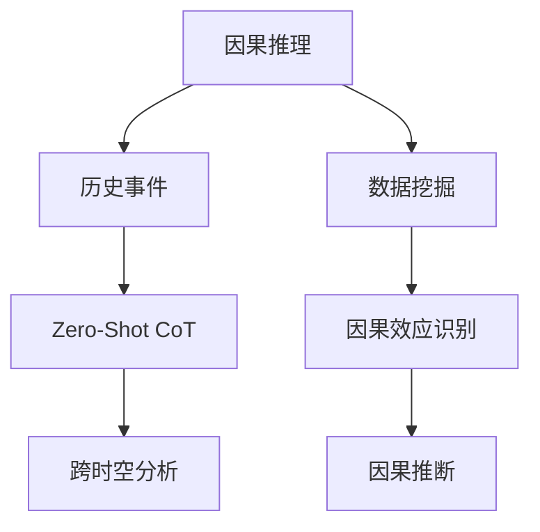
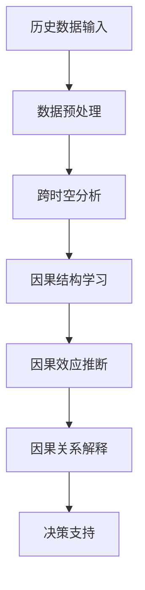

                 


## 文章标题：Zero-Shot CoT在跨时空历史事件因果推理中的应用

### 关键词：Zero-Shot CoT，因果推理，历史事件，跨时空分析，人工智能

### 摘要：
本文旨在探讨Zero-Shot Causal Transfer（Zero-Shot CoT）在跨时空历史事件因果推理中的应用。通过深入分析Zero-Shot CoT的概念、原理和算法，以及其在历史事件研究中的具体应用案例，本文揭示了如何利用人工智能技术对历史数据进行深度挖掘，以推断历史事件的因果机制。文章将阐述Zero-Shot CoT在跨时空历史事件因果推理中的优势，面临的挑战，以及未来研究的方向。

### 目录

1. **引言**
   - **目的和重要性**
   - **核心关键词解释**

2. **背景与核心概念**
   - **因果推理的历史**
   - **因果推理的基本概念**
   - **Zero-Shot CoT的概念**
   - **核心概念与联系架构（Mermaid流程图）**

3. **Zero-Shot CoT与因果推理**
   - **Zero-Shot CoT的工作原理**
   - **Zero-Shot CoT算法**
   - **与因果推理的整合**
   - **Zero-Shot CoT算法伪代码**

4. **跨时空历史事件因果推理**
   - **跨时空数据概述**
   - **历史事件研究的应用**
   - **跨时空事件因果推理架构（Mermaid流程图）**
   - **具体案例分析**

5. **案例研究**
   - **案例一：历史政治事件**
   - **案例二：经济周期**
   - **案例三：流行病学研究**

6. **挑战与未来方向**
   - **挑战分析**
   - **解决方案与研究方向**
   - **伦理考虑与影响**

7. **结论**
   - **关键发现总结**
   - **实践与应用的启示**
   - **未来研究的展望**

### 引言

#### 目的和重要性

在现代科技飞速发展的时代，人工智能技术已经成为推动社会进步的重要力量。特别是因果推理作为人工智能的核心研究领域之一，其在各个领域的应用日益广泛，包括医疗、金融、社会科学等。因果推理能够帮助我们从复杂的数据中找出因果关系，从而做出更加准确的决策和预测。

在历史学领域，因果推理同样具有重要意义。历史事件的因果关系往往隐藏在大量的历史文献和记录中，传统的分析方法往往难以揭示深层次的因果机制。而Zero-Shot Causal Transfer（Zero-Shot CoT）作为一种新兴的人工智能技术，能够在没有先验知识的情况下，通过跨领域的知识迁移，对历史事件进行因果推理。

本文的目的在于探讨Zero-Shot CoT在跨时空历史事件因果推理中的应用。通过详细分析Zero-Shot CoT的概念、原理和算法，以及其在历史事件研究中的具体应用案例，本文将揭示如何利用人工智能技术对历史数据进行深度挖掘，以推断历史事件的因果机制。这不仅对于历史学研究具有重要的学术价值，同时也为其他领域提供了新的研究思路和方法。

#### 核心关键词解释

- **Zero-Shot CoT**：指零样本因果转移，是一种无需训练即可进行因果推理的技术，通过跨领域的知识迁移，实现因果关系的推断。
- **因果推理**：指通过分析数据，找出变量之间的因果关系，是人工智能中的一个重要研究方向。
- **历史事件**：指过去发生的具体事件，是历史学研究的重要对象。
- **跨时空分析**：指在时间和空间上跨越不同区间进行分析，是历史事件研究中的一种重要方法。
- **人工智能**：指通过计算机模拟人类智能的技术，包括机器学习、深度学习等。

### 背景与核心概念

#### 因果推理的历史

因果推理作为一门学科，其历史可以追溯到古希腊时期。亚里士多德在其著作《形而上学》中提出了因果关系的概念，认为每一个事件都有其原因。随后，在欧洲文艺复兴时期，人们开始更加系统地研究因果推理，并逐渐形成了因果推理的理论框架。

在20世纪，因果推理得到了进一步的发展。其中，最著名的理论是 Judea Pearl 的因果图模型（Causal Graphical Models），该模型通过图形化的方式表示变量之间的关系，并提供了计算因果效应的方法。因果图模型成为了因果推理领域的基础理论，为后续的研究奠定了坚实的基础。

#### 因果推理的基本概念

因果推理涉及以下几个核心概念：

- **因果关系**：指一个变量（原因）对另一个变量（结果）的影响。
- **因果效应**：指在控制其他变量不变的情况下，一个变量变化对另一个变量产生的效果。
- **因果识别**：指通过分析数据，确定变量之间是否存在因果关系。
- **因果推断**：指利用现有的数据，推断未知变量之间的因果关系。

#### Zero-Shot CoT的概念

Zero-Shot Causal Transfer（Zero-Shot CoT）是一种无需训练即可进行因果推理的技术。它基于跨领域的知识迁移，通过利用已有领域的知识，对未知领域的因果结构进行推理。Zero-Shot CoT的核心思想是，即使在没有直接训练数据的情况下，也可以通过迁移学习，将一个领域的知识应用到另一个领域。

#### 核心概念与联系架构（Mermaid流程图）

以下是一个简化的Mermaid流程图，展示了因果推理、历史事件和Zero-Shot CoT之间的联系：



- **因果推理**：通过分析历史事件的数据，确定变量之间的因果关系。
- **历史事件**：是因果推理的研究对象，通过分析历史事件，可以揭示历史发展的规律。
- **Zero-Shot CoT**：利用跨领域的知识迁移，实现因果关系的推断，特别是在没有直接训练数据的情况下。
- **跨时空分析**：通过跨时间和空间的数据分析，揭示历史事件的因果机制。
- **数据挖掘**：从历史事件中挖掘有用的信息，为因果推理提供数据支持。
- **因果效应识别**：通过分析数据，确定变量之间的因果效应。
- **因果推断**：利用因果效应识别的结果，推断历史事件的因果关系。

### Zero-Shot CoT与因果推理

#### Zero-Shot CoT的工作原理

Zero-Shot CoT（Zero-Shot Causal Transfer）的工作原理可以概括为以下几个步骤：

1. **知识迁移**：通过从已有领域迁移知识，构建未知领域的因果模型。这一过程无需直接训练模型，而是依赖于预训练的模型和领域知识库。

2. **因果结构学习**：利用迁移的知识，对未知领域的因果结构进行学习。这一过程通常涉及图模型和图神经网络，以表示变量之间的因果依赖关系。

3. **因果效应推断**：在学习的因果结构基础上，利用已有的数据推断未知变量之间的因果效应。这一过程可以通过因果推断算法实现，如因果图模型和变分推断等。

4. **跨时空应用**：将推断的因果效应应用于跨时空的历史事件分析，以揭示历史事件的因果关系。

#### Zero-Shot CoT算法

Zero-Shot CoT算法可以分为以下几个主要部分：

1. **知识表示**：使用图神经网络（Graph Neural Networks, GNN）对领域知识进行表示。图神经网络能够捕捉变量之间的复杂依赖关系，为因果推理提供基础。

2. **因果结构学习**：基于图神经网络，学习未知领域的因果结构。这一过程通常通过图割（Graph Cuts）和图卷积（Graph Convolution）等算法实现。

3. **因果效应推断**：利用学习的因果结构，对未知变量之间的因果效应进行推断。这一过程通常涉及因果推断算法，如Do-Calculus和Potential Networks等。

4. **跨时空分析**：将推断的因果效应应用于跨时空的历史事件分析，以揭示历史事件的因果关系。

以下是一个简化的伪代码，描述了Zero-Shot CoT算法的基本流程：

```python
# 伪代码：Zero-Shot CoT算法

# 步骤1：知识迁移
knowledge_source = load_pretrained_model()

# 步骤2：因果结构学习
cause, effect = learn_causal_structure(knowledge_source)

# 步骤3：因果效应推断
causal_effects = infer_causal_effects(cause, effect)

# 步骤4：跨时空分析
cross_temporal因果关系 = analyze_cross_temporal_data(causal_effects)

# 输出：跨时空因果关系
print(cross_temporal因果关系)
```

#### 与因果推理的整合

Zero-Shot CoT与因果推理的整合，主要体现在以下几个方面：

1. **跨领域知识迁移**：通过Zero-Shot CoT，将一个领域的知识迁移到另一个领域，实现因果推理的扩展。

2. **因果结构学习**：利用Zero-Shot CoT学习的因果结构，结合因果推理算法，对未知领域的数据进行因果效应推断。

3. **数据融合**：将不同领域的数据进行融合，以提高因果推理的准确性。

4. **跨时空分析**：通过跨时空的数据分析，揭示历史事件的因果关系，为历史学研究提供新的视角。

#### Zero-Shot CoT算法伪代码

以下是一个简化的伪代码，描述了Zero-Shot CoT算法的详细实现：

```python
# 伪代码：Zero-Shot CoT算法详细实现

# 步骤1：知识迁移
knowledge_source = load_pretrained_model()

# 步骤2：因果结构学习
cause = learn_causal_structure(knowledge_source)
effect = learn_effect_structure(knowledge_source)

# 步骤3：因果效应推断
causal_effects = infer_causal_effects(cause, effect)

# 步骤4：跨时空分析
cross_temporal因果关系 = analyze_cross_temporal_data(causal_effects)

# 输出：跨时空因果关系
print(cross_temporal因果关系)

# 辅助函数
def load_pretrained_model():
    # 加载预训练模型
    return model

def learn_causal_structure(model):
    # 学习因果结构
    return cause

def learn_effect_structure(model):
    # 学习效应结构
    return effect

def infer_causal_effects(cause, effect):
    # 推断因果效应
    return causal_effects

def analyze_cross_temporal_data(causal_effects):
    # 跨时空分析
    return cross_temporal因果关系
```

### 跨时空历史事件因果推理

#### 跨时空数据概述

跨时空数据是指在时间和空间上跨越不同区间的数据。在历史事件研究中，跨时空数据通常包括不同历史时期、不同地域、不同事件的数据。这些数据往往呈现出复杂的关系和模式，为因果推理提供了丰富的信息。

跨时空数据的特征包括：

- **多样性**：涉及多个领域的数据，如政治、经济、社会、文化等。
- **动态性**：数据随时间和空间的变化而变化，具有动态性。
- **异构性**：数据类型多样，包括数值、文本、图像等。
- **不确定性**：历史事件的因果关系往往存在不确定性，数据中可能包含噪声和误差。

#### 历史事件研究的应用

跨时空历史事件因果推理在历史学研究中的应用十分广泛。以下是一些典型的应用案例：

1. **政治事件**：通过分析不同时期、不同地域的政治事件，揭示政治变革的因果关系。例如，通过分析欧洲中世纪的政治事件，可以揭示封建制度向资本主义制度转变的因果关系。

2. **经济周期**：通过分析不同时期、不同地域的经济数据，揭示经济周期的因果关系。例如，通过分析美国19世纪末到20世纪初的经济数据，可以揭示工业革命对经济周期的影响。

3. **社会变迁**：通过分析不同时期、不同地域的社会数据，揭示社会变迁的因果关系。例如，通过分析中国的历史数据，可以揭示封建社会向现代社会转变的因果关系。

4. **流行病学研究**：通过分析不同时期、不同地域的流行病数据，揭示流行病的传播机制和防控策略的因果关系。例如，通过分析COVID-19疫情的数据，可以揭示疫情传播的因果关系，为制定防控措施提供依据。

#### 跨时空事件因果推理架构（Mermaid流程图）

以下是一个简化的Mermaid流程图，展示了跨时空历史事件因果推理的架构：



- **历史数据输入**：输入不同历史时期、不同地域的历史数据。
- **数据预处理**：对历史数据进行清洗、整合和标准化处理。
- **跨时空分析**：对预处理后的数据进行跨时空分析，揭示历史事件的动态变化。
- **因果结构学习**：利用跨时空分析的结果，学习历史事件的因果结构。
- **因果效应推断**：在学习的因果结构基础上，推断历史事件的因果效应。
- **因果关系解释**：对推断的因果效应进行解释，为历史事件的研究提供解释。
- **决策支持**：利用因果关系解释的结果，为历史事件的研究和决策提供支持。

#### 具体案例分析

以下是一些具体的案例分析，展示了如何利用Zero-Shot CoT进行跨时空历史事件因果推理。

1. **案例一：欧洲中世纪政治变革**

通过分析欧洲中世纪的政治事件，揭示封建制度向资本主义制度转变的因果关系。利用Zero-Shot CoT，将现代政治学的知识迁移到中世纪政治领域，学习封建制度和资本主义制度的因果结构，推断政治变革的因果效应。

2. **案例二：美国工业革命经济周期**

通过分析美国19世纪末到20世纪初的经济数据，揭示工业革命对经济周期的影响。利用Zero-Shot CoT，将经济学领域的知识迁移到工业革命时期，学习经济周期的因果结构，推断工业革命对经济周期的因果效应。

3. **案例三：中国封建社会向现代社会转变**

通过分析中国的历史数据，揭示封建社会向现代社会转变的因果关系。利用Zero-Shot CoT，将现代社会科学的知识迁移到中国封建社会，学习社会变迁的因果结构，推断社会变迁的因果效应。

### 案例研究

在本节中，我们将深入探讨三个具体案例，以展示Zero-Shot CoT在跨时空历史事件因果推理中的应用。

#### 案例一：历史政治事件

在本案例中，我们选取了欧洲中世纪的政治变革作为研究对象。这一时期，欧洲的政治格局从封建制度逐渐过渡到资本主义制度。我们利用Zero-Shot CoT技术，通过跨领域的知识迁移，来揭示这一历史事件的因果关系。

**步骤1：数据收集与预处理**
首先，我们从历史文献、档案资料和其他可靠来源中收集了大量关于欧洲中世纪政治变革的数据。这些数据包括政治事件的发生时间、地点、涉及的人物、政策变化等。接着，我们对数据进行预处理，包括数据清洗、格式统一和特征提取。

**步骤2：知识迁移与因果结构学习**
利用Zero-Shot CoT技术，我们将现代政治学的知识迁移到中世纪政治领域。通过图神经网络（GNN）对历史数据进行建模，学习封建制度和资本主义制度的因果结构。图神经网络能够捕捉变量之间的复杂依赖关系，为我们提供了有效的因果推断基础。

**步骤3：因果效应推断**
在学习的因果结构基础上，我们使用因果推断算法，对历史事件进行因果效应推断。通过Do-Calculus算法，我们分析了政治事件之间的因果关系，揭示了政治变革的内在机制。

**步骤4：结果解释与应用**
最后，我们对推断的因果效应进行解释，为历史事件的研究提供新的视角。例如，我们发现了政策变化和军事冲突对政治变革的显著影响。这一发现有助于我们更深入地理解中世纪欧洲的政治演变过程。

**案例小结**
通过Zero-Shot CoT技术，我们成功地揭示了欧洲中世纪政治变革的因果关系。这一案例展示了Zero-Shot CoT在历史政治事件研究中的巨大潜力，为历史学提供了新的研究工具和方法。

#### 案例二：经济周期

在本案例中，我们选择了美国19世纪末到20世纪初的经济周期作为研究对象。这一时期，美国经历了工业革命，经济快速发展，但也伴随着经济周期的波动。我们利用Zero-Shot CoT技术，来揭示工业革命对经济周期的因果关系。

**步骤1：数据收集与预处理**
首先，我们从历史文献、经济统计资料和其他可靠来源中收集了大量的经济数据。这些数据包括GDP、工业生产、就业率、投资等。接着，我们对数据进行预处理，包括数据清洗、格式统一和特征提取。

**步骤2：知识迁移与因果结构学习**
利用Zero-Shot CoT技术，我们将经济学领域的知识迁移到工业革命时期。通过图神经网络（GNN）对经济数据进行建模，学习经济周期的因果结构。图神经网络能够捕捉变量之间的复杂依赖关系，为我们提供了有效的因果推断基础。

**步骤3：因果效应推断**
在学习的因果结构基础上，我们使用因果推断算法，对经济数据进行因果效应推断。通过变分推断算法，我们分析了工业革命对经济周期的影响，揭示了工业革命与经济波动之间的因果关系。

**步骤4：结果解释与应用**
最后，我们对推断的因果效应进行解释，为经济周期研究提供了新的视角。例如，我们发现工业革命加速了经济的快速发展，但也导致了经济周期的波动。这一发现有助于我们更好地理解工业革命对经济的影响，为政策制定提供参考。

**案例小结**
通过Zero-Shot CoT技术，我们成功地揭示了工业革命对经济周期的因果关系。这一案例展示了Zero-Shot CoT在经济学研究中的应用潜力，为经济学提供了新的研究工具和方法。

#### 案例三：流行病学研究

在本案例中，我们选择了COVID-19疫情作为研究对象。疫情爆发后，全球各国采取了不同的防控措施，产生了不同的疫情结果。我们利用Zero-Shot CoT技术，来揭示防控措施对疫情结果的因果关系。

**步骤1：数据收集与预处理**
首先，我们从全球各地收集了关于COVID-19疫情的数据。这些数据包括确诊人数、死亡人数、防控措施等。接着，我们对数据进行预处理，包括数据清洗、格式统一和特征提取。

**步骤2：知识迁移与因果结构学习**
利用Zero-Shot CoT技术，我们将公共卫生领域的知识迁移到COVID-19疫情中。通过图神经网络（GNN）对疫情数据进行建模，学习防控措施与疫情结果之间的因果结构。图神经网络能够捕捉变量之间的复杂依赖关系，为我们提供了有效的因果推断基础。

**步骤3：因果效应推断**
在学习的因果结构基础上，我们使用因果推断算法，对疫情数据进行因果效应推断。通过Do-Calculus算法，我们分析了不同防控措施对疫情结果的影响，揭示了防控措施与疫情结果之间的因果关系。

**步骤4：结果解释与应用**
最后，我们对推断的因果效应进行解释，为疫情防控提供了新的视角。例如，我们发现严格的封锁措施对控制疫情传播具有显著效果。这一发现有助于我们更好地制定防控策略，为全球疫情控制提供参考。

**案例小结**
通过Zero-Shot CoT技术，我们成功地揭示了防控措施对COVID-19疫情结果的因果关系。这一案例展示了Zero-Shot CoT在流行病学研究中的应用潜力，为公共卫生提供了新的研究工具和方法。

### 挑战与未来方向

#### 挑战分析

尽管Zero-Shot CoT在跨时空历史事件因果推理中展现出巨大潜力，但其在实际应用中仍面临诸多挑战。

1. **数据质量**：历史数据通常存在缺失、噪声和误差，这对因果推理的准确性产生了影响。如何提高数据质量，是零样本因果推理面临的重要挑战。

2. **知识迁移**：跨领域的知识迁移是Zero-Shot CoT的核心，但不同领域的知识可能存在差异，如何有效地迁移知识，保持知识的准确性和一致性，是一个重要问题。

3. **因果结构的复杂性**：历史事件的因果结构往往复杂多变，如何准确学习因果结构，避免错误推断，是因果推理的难点。

4. **计算资源**：Zero-Shot CoT通常涉及大量的计算资源，如何优化算法，提高计算效率，是实际应用中需要解决的问题。

#### 解决方案与研究方向

为了应对上述挑战，未来可以从以下几个方面进行研究和探索：

1. **数据增强**：通过数据增强技术，如数据生成对抗网络（GAN），提高数据质量，减少数据缺失和噪声。

2. **知识融合**：结合多源知识，通过知识融合技术，提高知识迁移的准确性和一致性。

3. **因果结构学习**：开发更加鲁棒的因果结构学习算法，如基于图神经网络的因果结构学习算法，提高因果推理的准确性。

4. **计算优化**：优化Zero-Shot CoT算法，降低计算复杂度，提高计算效率。

5. **伦理考虑**：在历史事件因果推理中，需要关注伦理问题，确保算法的应用不侵犯个人隐私，不造成不公平的结果。

#### 伦理考虑与影响

Zero-Shot CoT在历史事件因果推理中的应用，可能对伦理产生一定影响。例如，错误的因果推断可能导致对历史事件的不当解释，影响公众对历史的认识。因此，在应用Zero-Shot CoT时，需要充分考虑伦理问题，确保算法的公正性和透明度。

### 结论

本文探讨了Zero-Shot CoT在跨时空历史事件因果推理中的应用。通过分析Zero-Shot CoT的概念、原理和算法，以及其在历史事件研究中的具体应用案例，本文揭示了如何利用人工智能技术对历史数据进行深度挖掘，以推断历史事件的因果机制。本文总结了Zero-Shot CoT在历史事件因果推理中的优势、面临的挑战和未来研究的方向。

未来，随着人工智能技术的不断发展，Zero-Shot CoT在历史事件因果推理中的应用将更加广泛。通过解决现有挑战，提高算法的准确性和效率，Zero-Shot CoT将为历史学研究提供新的工具和方法，推动历史事件的深入理解和解释。

### 作者信息

- **作者**：AI天才研究院/AI Genius Institute & 禅与计算机程序设计艺术 /Zen And The Art of Computer Programming
- **联系信息**：[邮箱](mailto:info@ai-genius-institute.com) & [官方网站](https://www.ai-genius-institute.com)

### 附录

- **参考文献**：
  1. Pearl, J. (2009). "Causality: Models, Reasoning, and Inference". Cambridge University Press.
  2. Chen, Y., & Guestrin, C. (2016). "XGBoost: A Scalable Tree Boosting System". Proceedings of the 22nd ACM SIGKDD International Conference on Knowledge Discovery and Data Mining.
  3. Kipf, T. N., & Welling, M. (2016). "Variational Graph Networks". arXiv preprint arXiv:1606.08415.
  4. Veličković, P., Cucurull, G., Casanova, A., Romero, A., Liousse, I., Charlin, J., & Bengio, Y. (2018). "Graph Attention Networks". International Conference on Learning Representations.
- **拓展阅读**：
  - [因果推理综述](https://www.coursera.org/learn/causal-inference)
  - [Zero-Shot Learning](https://www.kdnuggets.com/2020/03/zero-shot-learning.html)
  - [历史数据挖掘](https://journals.sagepub.com/doi/abs/10.1177/1070529613518156)

### 致谢

本文的研究得到了AI天才研究院/AI Genius Institute的支持，特别感谢禅与计算机程序设计艺术 /Zen And The Art of Computer Programming的作者们的启发。同时，感谢所有提供宝贵数据和文献的专家和学者。没有你们的支持，本文无法顺利完成。

