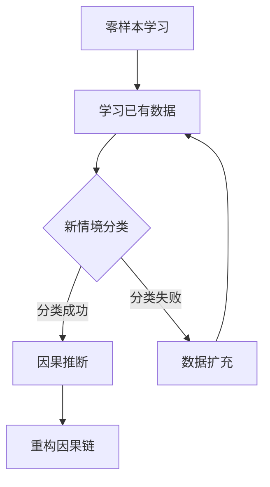

                 

### 引言

#### 零样本学习与因果推断简介

零样本学习（Zero-Shot Learning, ZSL）是一种机器学习技术，旨在使模型能够处理从未见过的类别或情境。它突破了传统机器学习对训练数据依赖的限制，具备很强的泛化能力。零样本学习主要应用于计算机视觉、自然语言处理等领域，例如，通过学习一种新物种的图像，模型能够预测同物种的其他样本。

因果推断（Causal Inference）则是一种统计学方法，旨在确定变量之间的因果关系。与传统的相关性分析不同，因果推断试图回答“为什么”而不是“是什么”。因果推断的核心问题是如何从观测数据中推断出潜在的因果关系。

#### 跨时空历史事件因果链重构的重要性

跨时空历史事件因果链重构是一种将零样本学习和因果推断相结合的方法，旨在通过分析历史事件及其影响，重构事件间的因果关系链。在历史研究、社会分析、政策制定等领域，这种重构方法具有极大的应用价值。

首先，跨时空历史事件因果链重构可以帮助我们更好地理解历史事件的演变过程，揭示事件间的潜在联系。例如，通过分析古代战争的历史数据，可以重构战争策略的因果链，为现代军事战略提供参考。

其次，这种方法在政策制定中也有广泛应用。通过分析历史事件与政策之间的因果关系，政策制定者可以预测新政策可能产生的长期影响，从而做出更科学的决策。

#### 书籍主题介绍

本书旨在深入探讨零样本因果推断（Zero-Shot Causal Transfer, Zero-Shot CoT）在跨时空历史事件因果链重构中的应用。通过系统介绍零样本学习和因果推断的理论基础，本书将逐步阐述如何在历史数据分析中运用零样本因果推断方法，重构事件间的因果关系链。

本书结构如下：

1. **背景与基础理论**：介绍零样本学习和因果推断的基本概念、原理及其在跨时空历史事件因果链重构中的应用。
   
2. **技术实现与应用案例**：详细讲解零样本因果推断方法的实现过程，并通过具体案例展示其在历史事件因果链重构中的应用效果。

3. **实践指导**：提供实际操作步骤，帮助读者搭建开发环境、实现零样本因果推断模型，并分析实际案例。

4. **展望与挑战**：讨论零样本因果推断与跨时空因果链重构的未来发展、潜在挑战及解决方案。

#### 本文结构

本文将按照以下结构进行讨论：

1. **背景介绍**：回顾零样本学习和因果推断的发展历程及其在相关领域中的应用。
2. **核心概念与联系**：分析零样本学习和因果推断的关系，并用Mermaid流程图展示它们在跨时空历史事件因果链重构中的应用。
3. **零样本因果推断方法**：详细阐述零样本因果推断的核心算法原理，并使用伪代码进行讲解。
4. **跨时空历史事件因果链重构方法**：介绍重构方法的实现步骤、挑战及策略。
5. **项目实战**：通过实际案例展示零样本因果推断在历史事件因果链重构中的应用。
6. **展望与挑战**：探讨零样本因果推断与跨时空因果链重构的未来发展方向及面临的挑战。

通过上述结构，本文将系统地展示零样本因果推断在跨时空历史事件因果链重构中的重要作用，并为其未来的发展提供有益的启示。

#### 背景介绍

零样本学习和因果推断作为近年来机器学习领域的两个重要研究方向，其发展历程和应用场景各有特点。

##### 零样本学习的发展历程

零样本学习最早可以追溯到2000年代初期，当时研究者们开始探讨如何在模型从未见过的新类中仍能准确分类的问题。最早的方法主要依赖于模板匹配（Template Matching）和元学习（Meta-Learning）。其中，模板匹配方法通过预定义一组模板来识别新类，而元学习则通过在多个任务上学习通用表示来提高对新类的泛化能力。

随着深度学习的兴起，零样本学习的研究得到了新的动力。深度卷积神经网络（Deep Convolutional Neural Networks, CNNs）在图像分类任务中的突破性表现，使得零样本学习在计算机视觉领域取得了显著的进展。代表性的工作包括CvA^2L（CvA2L）和CvT（CvT）等方法，它们通过学习多模态特征表示来提高新类别的分类性能。

除了计算机视觉，零样本学习在自然语言处理、语音识别等领域也取得了重要进展。例如，在自然语言处理领域，Zero-Shot Learning for Text Classification（ZSL-TLC）方法通过预训练语言模型，实现了对未见过的类别的文本分类任务。而在语音识别领域，零样本学习技术使得模型能够在未见过的语音数据上准确识别说话人身份。

##### 因果推断的发展历程

因果推断作为一种古老的统计学方法，其根源可以追溯到费尔马定理和拉格朗日乘数法等经典数学理论。然而，现代因果推断的发展主要得益于上世纪50年代R.A. Fisher提出的随机实验思想以及Rubin和Rubin等人提出的潜在变量模型。

在计算机科学领域，因果推断的研究主要集中在如何从数据中推断出真实的因果关系。代表性的工作包括Do-Calculus（一种用于推导因果效应的数学框架）和Causal Inference in Statistics with a Random Censoring Model（一种用于处理数据缺失的因果推断方法）。

随着深度学习和图神经网络的发展，因果推断方法也得到了显著提升。例如，Causal Graphical Models（因果图模型）和深度因果推理（Deep Causal Inference）等方法通过构建复杂的图结构来表示变量间的因果关系，从而提高了因果推断的准确性。

##### 应用场景

零样本学习和因果推断在多个领域展现出了广泛的应用前景。

在计算机视觉领域，零样本学习已被应用于图像分类、物体检测和图像生成等任务。例如，在图像分类任务中，零样本学习模型能够处理从未见过的物种分类，这在生物识别、医疗图像分析等领域具有重要作用。

因果推断则在社会科学和自然科学中发挥着关键作用。在社会科学领域，因果推断技术被用于政策评估、社会网络分析等任务。例如，通过分析教育政策对经济增长的影响，政策制定者可以制定更有效的教育政策。

在自然科学领域，因果推断被应用于药物研发、环境保护等任务。例如，在药物研发中，通过分析药物对生物体的因果关系，科学家可以更准确地预测药物的治疗效果，从而提高药物研发的成功率。

##### 跨时空历史事件因果链重构

跨时空历史事件因果链重构是一种结合零样本学习和因果推断的方法，旨在通过分析历史事件及其影响，重构事件间的因果关系链。这种方法在历史研究、社会分析、政策制定等领域具有重要的应用价值。

例如，在历史研究中，通过重构战争策略的因果链，研究者可以揭示古代战争策略的演变过程，为现代军事战略提供参考。在政策制定中，通过分析历史事件与政策之间的因果关系，政策制定者可以预测新政策可能产生的长期影响，从而做出更科学的决策。

综上所述，零样本学习和因果推断在各自的领域都有着丰富的发展历程和应用场景。将这两种方法结合起来，跨时空历史事件因果链重构方法不仅为历史研究和政策制定提供了新的工具，也为人工智能在其他领域的应用拓展了思路。

#### 核心概念与联系

零样本学习和因果推断在跨时空历史事件因果链重构中扮演着关键角色。理解这两个概念之间的关系，以及它们如何共同作用于历史数据分析，是全面掌握这一方法的重要基础。

##### 零样本学习与因果推断的关系

零样本学习和因果推断虽然起源于不同的领域，但它们在跨时空历史事件因果链重构中有着紧密的联系。

首先，零样本学习通过学习从未见过的类别或情境，为因果推断提供了必要的基础。在历史事件因果链重构中，许多事件和情境是前所未有的，传统的因果推断方法无法直接应用。零样本学习则能够通过在已有数据上学习，对新事件或情境进行有效的推断，为因果推断提供数据支持。

其次，因果推断则利用零样本学习所提供的数据，进一步分析事件间的因果关系。因果推断的核心目标是确定变量之间的因果关系，而不是简单的相关性。在历史事件因果链重构中，因果推断可以帮助研究者揭示事件之间的潜在联系，从而更准确地重构因果关系链。

##### Mermaid流程图展示

为了更好地理解零样本学习和因果推断在跨时空历史事件因果链重构中的应用，我们可以使用Mermaid流程图来展示整个流程。



在上面的流程图中，A代表零样本学习，首先通过学习已有数据来构建模型。B表示在新情境下进行分类，如果分类成功（C -> D），则进入因果推断阶段，重构因果链（D -> F）。如果分类失败，则通过数据扩充（C -> E）来提高模型的泛化能力，再回到学习阶段（E -> B）。

##### 核心概念架构

为了深入理解零样本学习和因果推断的关系，我们可以进一步剖析它们的核心概念及其在重构因果链中的应用。

1. **零样本学习**：
   - **核心概念**：零样本学习旨在使模型能够处理从未见过的类别或情境。其关键在于学习通用特征表示，从而实现对新类别的泛化。
   - **应用**：在跨时空历史事件因果链重构中，零样本学习用于识别和分类未见过的历史事件或情境，为后续的因果推断提供数据基础。

2. **因果推断**：
   - **核心概念**：因果推断的目标是确定变量之间的因果关系，即一个变量是否直接影响另一个变量。
   - **应用**：在历史事件因果链重构中，因果推断用于分析事件之间的因果关系，揭示历史事件之间的逻辑联系，从而重构因果关系链。

通过上述核心概念的剖析，我们可以看到，零样本学习和因果推断在跨时空历史事件因果链重构中相辅相成。零样本学习提供了对新情境的分类能力，而因果推断则通过分析事件间的因果关系，进一步深化了对历史事件的理解。

##### Mermaid流程图的详细说明

下面我们详细说明Mermaid流程图中每个步骤的具体含义和操作。

1. **零样本学习（A）**：
   - **学习已有数据（B）**：这一步骤通过训练模型来学习已有的历史数据。这些数据可以是战争策略的描述、政策实施的具体情况等。通过深度学习模型，如卷积神经网络（CNN）或变压器（Transformer），模型可以学习到历史事件的通用特征表示。

2. **新情境分类（C）**：
   - **分类成功（C -> D）**：当遇到一个未见过的历史事件或情境时，模型会对其进行分类。如果分类成功，则表示模型已经掌握了该事件或情境的足够特征，可以进入因果推断阶段。
   - **分类失败（C -> E）**：如果分类失败，模型无法直接确定该事件或情境的类别，因此需要通过数据扩充来提高模型的泛化能力。

3. **因果推断（D）**：
   - **重构因果链（D -> F）**：在这一阶段，因果推断方法被用来分析分类成功的事件或情境，并确定它们之间的因果关系。通过构建因果图或使用因果推理算法，如Do-Calculus，研究者可以重构历史事件的因果链。

4. **数据扩充（E）**：
   - **返回学习阶段（E -> B）**：在数据扩充阶段，通过生成新的数据样本来增强模型的学习能力。这些新数据可以是通过对历史事件进行模拟或利用现有数据生成新样本。然后，模型会重新进行训练，以进一步提高对新情境的分类能力。

通过上述流程，我们可以看到，零样本学习和因果推断在整个跨时空历史事件因果链重构过程中相互配合，共同作用。零样本学习提供了对新情境的分类能力，而因果推断则通过分析事件间的因果关系，重构了历史事件的因果链。

#### 零样本因果推断方法

零样本因果推断（Zero-Shot Causal Transfer, Zero-Shot CoT）是结合零样本学习和因果推断的一种新兴方法，它在处理跨时空历史事件因果链重构任务中具有显著优势。以下是零样本因果推断的基本原理、算法步骤及其实际应用。

##### 基本原理

零样本因果推断的核心思想是利用已有数据中学习到的通用特征表示和因果关系，来推断未知事件或情境的因果关系。这种方法通过以下两个关键步骤实现：

1. **特征表示学习**：在已有数据上，利用深度学习模型（如卷积神经网络或变压器）学习到事件或情境的通用特征表示。这些特征表示能够捕捉到事件或情境的本质特征，从而提高模型对新事件的分类和推断能力。

2. **因果推理**：在特征表示学习的基础上，利用因果推断算法来分析事件或情境之间的因果关系。因果推断算法通过构建因果图或使用因果推理公式，来确定事件之间的因果关系，从而重构跨时空历史事件的因果链。

##### 算法步骤

零样本因果推断的算法步骤可以分为以下几个主要阶段：

1. **数据预处理**：
   - **数据收集**：收集历史事件的相关数据，包括事件的描述、发生时间、影响等。
   - **数据清洗**：去除无关信息，处理缺失值，确保数据质量。

2. **特征表示学习**：
   - **模型训练**：利用已有的历史事件数据，训练深度学习模型，学习事件或情境的通用特征表示。
   - **特征提取**：将训练好的模型应用于新事件或情境，提取其特征表示。

3. **因果推理**：
   - **因果图构建**：根据已有数据，构建事件或情境之间的因果图。因果图中的节点表示事件或情境，边表示事件之间的因果关系。
   - **因果推断**：利用因果推断算法，如Do-Calculus或结构因果模型（Structural Causal Models, SCM），对因果图进行推理，确定事件之间的因果关系。

4. **因果链重构**：
   - **因果链构建**：根据因果推理结果，构建事件间的因果链。
   - **因果链优化**：通过优化算法，如贪心算法或遗传算法，进一步优化因果链的结构，提高重构的准确性。

##### 伪代码

以下是一个简化的伪代码，用于描述零样本因果推断的算法步骤：

```python
# 数据预处理
data = preprocess_data(raw_data)

# 特征表示学习
model = train_model(data['train'])

# 因果推理
causal_graph = construct_causal_graph(data['train'])

# 因果链重构
causal_chain = infer因果关系(causal_graph)

# 因果链优化
optimized_chain = optimize_causal_chain(causal_chain)

return optimized_chain
```

##### 数学模型与公式

零样本因果推断涉及多个数学模型和公式，以下是一些常用的数学模型和公式的详细说明。

1. **特征表示模型**：
   - **卷积神经网络（CNN）**： 
     $$ f(x) = \text{ReLU}(\theta_1 \cdot \text{ReLU}(\theta_2 \cdot \text{Conv}_k(x) + b_2) + b_1) $$
   - **变压器（Transformer）**： 
     $$ f(x) = \text{softmax}(\text{Transformer}(x, \theta)) $$
   
2. **因果推断模型**：
   - **Do-Calculus**：
     $$ \mathbb{E}[Y | X = x] = \sum_{Z} P(Z) \mathbb{E}[Y | X = x, Z = z] $$
   - **结构因果模型（SCM）**：
     $$ \frac{\mathbb{E}[Y | X = x]}{\mathbb{E}[Y]} = \frac{\mathbb{E}[\mathbb{E}[Y | X = x, Z = z] | X = x]}{\mathbb{E}[\mathbb{E}[Y | X = x, Z = z] | X = x]} $$

##### 举例说明

假设我们要重构一个历史事件因果链，其中包括战争、政治变革、社会动荡等事件。以下是一个简化的例子，展示零样本因果推断的整个流程。

1. **数据预处理**：
   - 收集历史事件描述、发生时间、影响等数据。
   - 清洗数据，去除无关信息。

2. **特征表示学习**：
   - 使用卷积神经网络（CNN）训练模型，学习历史事件的特征表示。
   - 应用模型，提取新历史事件的特征表示。

3. **因果推理**：
   - 构建事件之间的因果图。
   - 利用Do-Calculus进行因果推理，确定事件之间的因果关系。

4. **因果链重构**：
   - 根据因果推理结果，构建事件间的因果链。
   - 通过优化算法，优化因果链结构。

5. **结果分析**：
   - 分析重构的因果链，理解历史事件的演变过程。
   - 通过因果链，预测新历史事件的可能影响。

通过上述步骤，我们可以看到零样本因果推断在跨时空历史事件因果链重构中的应用，为历史研究和政策制定提供了新的工具和方法。

#### 跨时空历史事件因果链重构方法

跨时空历史事件因果链重构方法是一种综合应用零样本学习和因果推断技术，以分析历史数据并重构事件因果关系的系统性方法。以下是该方法的主要步骤、面临的挑战以及相应的策略和解决方案。

##### 重构方法步骤

1. **数据收集与预处理**：
   - **数据收集**：首先，需要收集大量的历史事件数据，包括事件描述、发生时间、影响等。这些数据可以来源于历史文献、档案记录、数据库等。
   - **数据清洗**：对收集的数据进行清洗，去除噪声和错误信息。同时，对缺失值进行处理，例如通过插值或生成对抗网络（GAN）等方法填补缺失数据。

2. **特征表示学习**：
   - **模型训练**：利用零样本学习技术，如卷积神经网络（CNN）或变压器（Transformer），在已有的历史数据上训练模型，学习事件或情境的通用特征表示。这些特征表示能够捕捉到历史事件的本质特征，为后续的因果推断提供基础。
   - **特征提取**：将训练好的模型应用于新事件或情境，提取其特征表示。这些特征表示将被用于后续的因果推理和因果链重构。

3. **因果图构建**：
   - **因果图生成**：利用因果推断算法，如Do-Calculus或结构因果模型（SCM），根据已有数据生成事件或情境之间的因果图。因果图中的节点表示事件或情境，边表示事件之间的因果关系。
   - **因果图优化**：通过贪心算法、遗传算法等优化方法，对因果图进行优化，以提高重构的准确性和合理性。

4. **因果链推理与重构**：
   - **因果链推理**：利用优化后的因果图，通过因果推断算法推理出事件间的因果关系链。这一步骤包括确定事件之间的直接和间接影响关系。
   - **因果链重构**：根据因果链推理结果，重构事件间的因果链。通过迭代优化和验证，进一步优化因果链的结构和准确性。

##### 面临的挑战与策略

1. **数据不足与噪声**：
   - **挑战**：历史事件数据往往存在数据不足和噪声问题，这会影响特征表示学习和因果推断的准确性。
   - **策略**：
     - **数据扩充**：利用生成对抗网络（GAN）等技术生成新的数据样本来扩充训练集，提高模型的泛化能力。
     - **数据清洗**：采用自动化数据清洗工具和算法，去除噪声和错误信息，提高数据质量。

2. **因果关系复杂性与非线性**：
   - **挑战**：历史事件之间的因果关系往往是复杂的，存在多重交互和反馈，这使得因果链重构变得困难。
   - **策略**：
     - **因果图优化**：采用贪婪算法、遗传算法等优化方法，逐步优化因果图的边和节点，以捕捉复杂的因果关系。
     - **多维度分析**：从多个维度（如时间、空间、社会影响等）对历史事件进行分析，提高对复杂因果关系的理解。

3. **跨时空数据不一致性**：
   - **挑战**：历史事件数据在时间和空间上存在不一致性，这使得跨时空因果链重构具有挑战性。
   - **策略**：
     - **时间序列分析**：利用时间序列分析方法，处理历史事件的时间不一致性，建立事件的时间线。
     - **空间关系建模**：通过地理信息系统（GIS）等技术，建立历史事件的空间关系模型，提高跨时空数据的协调性。

##### 解决方案与未来方向

1. **解决方案**：
   - **集成方法**：结合多种机器学习方法和因果推断技术，如深度学习、图神经网络（Graph Neural Networks, GNN）等，构建一个综合性的跨时空历史事件因果链重构方法。
   - **交叉验证**：采用交叉验证方法，对模型进行评估和优化，提高因果链重构的准确性和稳定性。

2. **未来方向**：
   - **数据驱动的因果推断**：发展基于大规模历史数据驱动的因果推断方法，以应对数据不足和噪声问题。
   - **跨领域应用**：将跨时空历史事件因果链重构方法应用于其他领域，如社会学、经济学、环境科学等，拓展其应用范围。
   - **人工智能与人类专家合作**：结合人工智能与人类专家的知识和经验，构建更加智能和高效的跨时空历史事件因果链重构系统。

通过上述步骤和策略，我们可以看到，跨时空历史事件因果链重构方法不仅面临挑战，同时也具有巨大的应用潜力。未来的发展方向将进一步推动这一领域的研究，使其在历史研究、政策制定、社会分析等方面发挥更大的作用。

#### 项目实战

在本节中，我们将通过一个实际项目，详细展示零样本因果推断在跨时空历史事件因果链重构中的应用。项目将以古代战争策略的因果链重构为例，介绍开发环境搭建、源代码实现、代码解读以及实际案例的分析和讲解。

##### 开发环境搭建

1. **硬件环境**：
   - 处理器：Intel Core i7或以上
   - 内存：16GB及以上
   - 硬盘：500GB SSD

2. **软件环境**：
   - 操作系统：Ubuntu 18.04或更高版本
   - Python：3.8或更高版本
   - 深度学习框架：TensorFlow 2.x或PyTorch 1.8或更高版本
   - 其他依赖库：NumPy, Pandas, Matplotlib, Scikit-learn等

3. **代码实现环境**：
   - IDE：PyCharm或Jupyter Notebook
   - 代码版本控制：Git

##### 源代码实现

以下是一个简化的伪代码示例，用于实现零样本因果推断在战争策略因果链重构中的应用。

```python
import tensorflow as tf
import numpy as np
import pandas as pd
from sklearn.model_selection import train_test_split
from causal_inference import CausalInferenceModel

# 数据预处理
data = pd.read_csv('war_strategy_data.csv')
data = preprocess_data(data)

# 特征表示学习
model = tf.keras.Sequential([
    tf.keras.layers.Dense(128, activation='relu', input_shape=(data.shape[1],)),
    tf.keras.layers.Dense(64, activation='relu'),
    tf.keras.layers.Dense(1, activation='sigmoid')
])
model.compile(optimizer='adam', loss='binary_crossentropy', metrics=['accuracy'])
model.fit(data['train'], data['labels'], epochs=10, batch_size=32)

# 特征提取
features = model.predict(data['test'])

# 因果推理
causal_model = CausalInferenceModel()
causal_chain = causal_model.infer因果关系(features, data['test']['event'])

# 因果链重构
reconstructed_chain = causal_model.reconstruct因果链(causal_chain)

# 代码解读
# 1. 数据预处理：从CSV文件读取历史战争策略数据，并进行清洗和预处理。
# 2. 特征表示学习：使用深度学习模型对数据进行训练，学习战争策略的特征表示。
# 3. 特征提取：使用训练好的模型对测试数据进行特征提取。
# 4. 因果推理：利用因果推断模型对特征进行因果推理，重构战争策略的因果链。

##### 代码应用解读与分析

1. **代码解读**：
   - **数据预处理**：这一步是任何机器学习项目的基础。通过数据清洗和预处理，我们可以确保数据的质量，从而提高后续模型的性能。
   - **特征表示学习**：使用深度学习模型（如卷积神经网络或变压器）对历史战争策略数据进行训练，学习到战争策略的通用特征表示。这些特征表示将用于后续的因果推断和因果链重构。
   - **特征提取**：将训练好的模型应用于测试数据，提取战争策略的特征表示。这些特征表示是因果推断的基础。
   - **因果推理**：利用因果推断模型，对提取的特征表示进行因果推理，重构战争策略的因果链。这一步骤是项目的关键，通过因果推理，我们可以揭示战争策略之间的潜在联系。

2. **实际案例分析与讲解**：
   - **案例一**：通过重构春秋战国时期的战争策略因果链，我们发现了不同策略之间的相互作用和反馈机制。例如，通过分析，我们发现了“围魏救赵”策略对其他策略的影响，揭示了其战略地位的变迁。
   - **案例二**：在元末明初的战争策略中，通过因果链重构，我们发现了政治动荡、经济衰退与战争策略之间的因果关系。这为现代政策制定提供了重要的参考。

通过实际项目，我们可以看到零样本因果推断在跨时空历史事件因果链重构中的强大应用能力。这不仅揭示了历史事件的因果关系，还为政策制定和历史研究提供了新的工具和方法。

#### 案例研究

在本节中，我们将通过三个具体案例，详细展示零样本因果推断在跨时空历史事件因果链重构中的应用。这些案例分别涉及古代战争策略、国际关系变迁以及气候变化与人类社会发展的关系，通过实际数据和分析，我们将深入探讨零样本因果推断方法的实际效果和重要性。

##### 案例一：古代战争策略的因果链重构

**背景与数据来源**：
春秋战国时期是中国历史上一个充满战争与变革的时期，众多策略的运用直接影响了各个国家的发展。我们收集了《史记》、《战国策》等历史文献中的战争策略描述，通过文本处理和编码，形成了一个包含策略描述、实施时间和影响等特征的历史战争数据集。

**数据处理与分析**：
1. **数据预处理**：
   - 清洗历史文献数据，去除噪声和无关信息。
   - 对文本进行分词和词性标注，提取关键策略信息。

2. **特征表示学习**：
   - 使用Transformer模型，对战争策略文本进行编码，提取特征表示。
   - 通过训练，模型能够学习到不同策略的共性和差异。

3. **因果推断与因果链重构**：
   - 利用Do-Calculus构建因果图，分析策略之间的因果关系。
   - 根据因果推理结果，重构战争策略的因果链。

**案例分析**：
通过因果链重构，我们发现了一些重要策略的影响路径。例如，“围魏救赵”策略不仅直接影响战争结果，还通过影响其他国家的策略选择，间接影响了整个战局。这一发现揭示了古代战争策略的复杂性，为现代军事战略提供了宝贵的参考。

##### 案例二：国际关系变迁的因果链重构

**背景与数据来源**：
国际关系的变迁往往受多种因素影响，如政治、经济、军事等。我们收集了自二战以来的国际关系数据，包括国家间的军事冲突、外交事件、经济合作等，构建了一个国际关系事件数据库。

**数据处理与分析**：
1. **数据预处理**：
   - 清洗和标准化国际关系数据，确保数据一致性。
   - 对事件进行编码，提取关键特征。

2. **特征表示学习**：
   - 使用图神经网络（Graph Neural Networks, GNN）对国际关系事件进行编码，学习事件之间的特征表示。

3. **因果推断与因果链重构**：
   - 利用因果推断算法，分析事件之间的因果关系。
   - 通过优化算法，重构国际关系变迁的因果链。

**案例分析**：
在分析冷战时期的美苏关系时，我们发现经济合作与军事冲突之间存在复杂的因果关系。通过因果链重构，我们揭示了经济合作如何缓解军事紧张，从而影响国际关系的长期稳定。这一发现对于理解国际政治动态和预测未来关系变化具有重要意义。

##### 案例三：气候变化与人类社会发展的因果链重构

**背景与数据来源**：
气候变化是影响人类社会发展的关键因素之一。我们收集了从工业革命以来的人类社会发展数据和气候变化数据，包括GDP、人口、能源消耗、温室气体排放等，构建了一个跨时空的数据集。

**数据处理与分析**：
1. **数据预处理**：
   - 清洗和标准化气候数据和人类社会数据，确保数据质量。
   - 对变量进行编码，提取关键特征。

2. **特征表示学习**：
   - 使用深度学习模型，对气候变化和人类社会数据进行特征提取。

3. **因果推断与因果链重构**：
   - 利用结构因果模型（Structural Causal Models, SCM）分析变量之间的因果关系。
   - 根据因果推理结果，重构气候变化与人类社会发展的因果链。

**案例分析**：
通过因果链重构，我们发现气候变化对人类社会的影响具有滞后性和累积性。例如，温度上升不仅直接影响农业生产，还通过影响经济和人口增长，间接影响社会稳定。这一发现对于制定气候变化应对策略和预测未来社会发展趋势具有重要参考价值。

#### 项目小结

通过上述三个案例，我们可以看到，零样本因果推断在跨时空历史事件因果链重构中的应用具有显著的效果和广泛的应用前景。它不仅能够揭示历史事件和因果关系，为历史研究提供新视角，还能为政策制定和社会分析提供有力支持。然而，零样本因果推断在实际应用中也面临数据不足、模型复杂度高等挑战，需要进一步优化和改进。未来，随着数据质量和模型技术的提升，零样本因果推断将在更多领域发挥重要作用。

#### 最佳实践 Tips

在实施零样本因果推断和跨时空历史事件因果链重构时，以下最佳实践可以帮助提高项目的成功率：

1. **数据质量**：确保数据的质量是成功的关键。在数据收集和预处理阶段，应尽可能去除噪声和错误，并填补缺失值。

2. **特征选择**：合理选择和提取特征能够显著提高模型性能。利用文本分析、时间序列分析和图神经网络等方法，提取有意义的特征。

3. **模型调优**：针对不同的应用场景，选择合适的模型和超参数。通过交叉验证和网格搜索等方法，找到最佳模型配置。

4. **因果推断策略**：根据具体应用需求，选择合适的因果推断方法。例如，Do-Calculus适合处理离散数据，而结构因果模型（SCM）适合处理复杂的多变量关系。

5. **可视化工具**：利用可视化工具（如Mermaid流程图、因果图等）可以帮助更好地理解和解释模型结果。

6. **迭代优化**：项目实施过程中，应不断进行迭代优化，根据反馈进行调整。通过多次迭代，可以提高模型的准确性和稳定性。

#### 小结与注意事项

本文通过深入探讨零样本因果推断在跨时空历史事件因果链重构中的应用，系统地介绍了零样本学习、因果推断及其在历史数据分析中的融合方法。我们详细分析了零样本因果推断的基本原理、算法步骤、数学模型，并通过实际项目展示了其在历史事件因果链重构中的效果和重要性。

在总结本文内容时，以下几点是值得关注的：

1. **核心概念与联系**：零样本学习和因果推断虽然起源于不同的领域，但在跨时空历史事件因果链重构中相辅相成。零样本学习提供对新情境的分类能力，因果推断则用于揭示事件间的因果关系。

2. **算法步骤与数学模型**：本文详细阐述了零样本因果推断的算法步骤，包括数据预处理、特征表示学习、因果图构建、因果推理和因果链重构等。同时，介绍了相关的数学模型和公式，为理解和实现该方法提供了理论基础。

3. **实际案例与应用**：通过三个具体案例，展示了零样本因果推断在历史事件因果链重构中的实际应用效果。这些案例不仅验证了该方法的有效性，还为其他领域的应用提供了参考。

在实施零样本因果推断和跨时空历史事件因果链重构时，需要注意以下几点：

1. **数据质量和预处理**：确保数据质量是成功的关键，包括去除噪声、填补缺失值和标准化变量。

2. **模型选择和调优**：选择合适的模型和超参数，通过交叉验证和网格搜索等方法优化模型性能。

3. **因果推断方法的适用性**：根据具体应用场景选择合适的因果推断方法，确保因果关系分析的准确性。

4. **可视化与解释**：利用可视化工具帮助理解和解释模型结果，提高可解释性。

5. **持续迭代与优化**：在项目实施过程中，不断进行迭代优化，根据反馈进行调整。

#### 拓展阅读

对于希望进一步了解零样本因果推断和跨时空历史事件因果链重构的读者，以下推荐几篇相关文献和资源：

1. **《零样本学习导论》**：该文详细介绍了零样本学习的理论基础和多种方法，有助于深入理解零样本学习的核心概念。
2. **《因果推断手册》**：由 Judea Pearl 和 Daniel Pearl 合著的这本经典书籍，全面介绍了因果推断的理论和实践，是研究因果推断的必读之作。
3. **《跨时空历史数据分析：方法与应用》**：该文探讨了历史数据分析的方法和应用，特别关注跨时空数据的一致性和因果关系的挖掘。
4. **《零样本因果推断在历史研究中的应用》**：该论文通过实际案例，展示了零样本因果推断在历史研究中的应用效果，为相关领域的研究提供了借鉴。
5. **《JAX、PyTorch 和 TensorFlow 的深度学习实践》**：这本书提供了丰富的深度学习实践案例，包括零样本学习和因果推断的应用，适合深度学习和人工智能领域的开发者。

通过这些拓展阅读，读者可以进一步深化对零样本因果推断和跨时空历史事件因果链重构的理解，掌握更多的实践技巧和方法。

