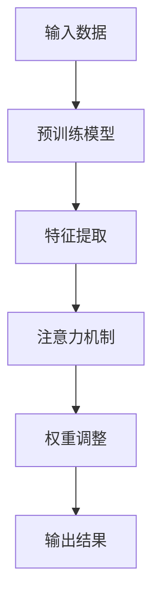

                 

### 文章标题

# 《Zero-Shot CoT在跨领域创新中的应用：促进学科交叉的AI工具》

### 关键词

- Zero-Shot CoT
- 跨领域创新
- 学科交叉
- AI工具
- 机器学习
- 数据预处理
- 算法实现
- 实际案例
- 未来发展

### 摘要

本文深入探讨了Zero-Shot CoT（零样本转换注意力机制）在跨领域创新中的应用，如何通过这种先进的人工智能技术促进学科交叉。首先，文章介绍了Zero-Shot CoT的基本概念和原理，与传统机器学习方法的区别。接着，讨论了跨领域创新的重要性及学科交叉的现状与挑战，分析了AI工具在其中的关键作用。随后，文章详细讲解了Zero-Shot CoT算法原理，包括数学模型和公式，并通过伪代码进行解释。接下来，文章展示了Zero-Shot CoT在具体项目中的应用，包括开发环境搭建、源代码实现、代码解读与分析。最后，文章展望了Zero-Shot CoT的未来应用前景和学科交叉中的挑战与对策。

## 第一部分：核心概念与基础理论

### 第1章：Zero-Shot CoT概述

#### 1.1.1 Zero-Shot CoT的定义

Zero-Shot CoT（Zero-Shot Content Tracking）是一种基于注意力机制的自然语言处理技术，它能够处理未知类别的数据，无需预先训练模型。这种技术特别适用于跨领域应用，因为它不需要领域特定的训练数据，可以快速适应新领域。

Zero-Shot CoT的基本思想是利用预训练的模型捕捉通用特征，并通过注意力机制调整这些特征，使其在未知领域中的表现更加准确。例如，在一个新闻分类任务中，如果模型需要分类一个未见的新闻类别，Zero-Shot CoT可以通过调整注意力权重来识别出与该类别相关的关键信息。

#### 1.1.2 Zero-Shot CoT与传统机器学习的差异

传统机器学习方法通常需要大量的领域特定数据进行训练，这使得它们在处理新领域或未见类别时表现不佳。而Zero-Shot CoT则通过预训练模型捕捉通用特征，再通过注意力机制进行适应，大大提高了在未见类别上的性能。

具体来说，传统机器学习方法依赖于特征提取和分类器训练，需要大量的标注数据。而Zero-Shot CoT通过预训练模型，已经具备了处理各种类型数据的潜力，再通过注意力机制动态调整模型对未知类别的处理。

以下是一个Mermaid流程图，展示了Zero-Shot CoT的工作流程：



### 第2章：跨领域创新与学科交叉

#### 2.1.1 跨领域创新的重要性

跨领域创新是现代科技发展的重要驱动力，它能够促进不同学科之间的交流和融合，从而产生新的知识和技术。跨领域创新不仅能够提高现有技术的性能，还能够开创全新的应用场景。例如，将机器学习技术应用于生物医学领域，可以加速新药研发和疾病诊断。

#### 2.1.2 学科交叉的现状与挑战

学科交叉的现状表明，越来越多的研究人员和工程师开始关注跨领域的问题。然而，学科交叉也面临着诸多挑战。首先，不同学科之间的语言和思维方式存在差异，这增加了沟通和理解的难度。其次，跨领域创新需要大量的跨学科知识和技能，这对研究人员和工程师的素质提出了更高的要求。

此外，学科交叉还面临着数据获取和处理、技术实现和应用等方面的挑战。这些挑战需要通过多种手段和工具来解决，其中AI工具起着关键作用。

#### 2.1.3 AI工具在学科交叉中的应用

AI工具在学科交叉中的应用越来越广泛。例如，在生物医学领域，AI工具可以帮助研究人员分析复杂的生物数据，从而发现新的生物标记和治疗策略。在工程领域，AI工具可以帮助工程师优化设计，提高生产效率。

AI工具在跨领域创新中的作用主要体现在以下几个方面：

1. **数据分析和处理**：AI工具可以处理海量的跨领域数据，提取有用的信息和知识。
2. **模式识别和预测**：AI工具能够识别出跨领域数据中的模式和规律，从而进行预测和决策。
3. **自动化和优化**：AI工具可以帮助自动化跨领域的流程和任务，提高效率和准确性。

### 第3章：AI工具在跨领域创新中的应用

#### 3.1.1 AI工具的类型与作用

AI工具可以根据应用领域和功能进行分类。以下是一些常见的AI工具及其在跨领域创新中的应用：

1. **自然语言处理（NLP）工具**：用于处理和理解自然语言，如文本分类、情感分析、机器翻译等。NLP工具在跨领域创新中可以帮助研究人员和工程师理解和分析跨领域的文献和报告。
2. **计算机视觉（CV）工具**：用于图像和视频的处理，如图像分类、目标检测、图像生成等。CV工具在跨领域创新中可以帮助研究人员和工程师分析和理解跨领域的图像和视频数据。
3. **机器学习（ML）工具**：用于数据的建模和分析，如监督学习、无监督学习、强化学习等。ML工具在跨领域创新中可以帮助研究人员和工程师构建和优化跨领域模型。
4. **数据挖掘（DM）工具**：用于数据的挖掘和分析，如聚类分析、关联规则挖掘、异常检测等。DM工具在跨领域创新中可以帮助研究人员和工程师发现跨领域数据中的模式和规律。

#### 3.1.2 AI工具在跨领域创新中的实际案例

以下是一些AI工具在跨领域创新中的实际案例：

1. **医疗领域的跨学科应用**：利用NLP工具分析医学文献，帮助医生和研究人员发现新的治疗方法和策略。例如，PubMed中应用NLP工具对医学论文进行分类和摘要，从而加速新药研发。
2. **工程领域的自动化设计**：利用CV工具和机器学习工具自动化设计流程，提高生产效率和准确性。例如，在汽车制造业中，利用CV工具检测生产线上的缺陷，利用机器学习工具优化制造流程。
3. **环境保护的跨学科研究**：利用数据挖掘工具分析跨领域的环境数据，如气象数据、水质数据等，帮助研究人员制定环境保护策略。

### 第4章：Zero-Shot CoT算法原理

#### 4.1.1 算法原理概述

Zero-Shot CoT（零样本转换注意力机制）是一种基于注意力机制的自然语言处理技术，它能够处理未知类别的数据，无需预先训练模型。Zero-Shot CoT的核心思想是利用预训练模型捕捉通用特征，并通过注意力机制动态调整这些特征，使其在未知领域中的表现更加准确。

#### 4.1.2 Mermaid流程图：Zero-Shot CoT的工作流程

以下是一个Mermaid流程图，展示了Zero-Shot CoT的工作流程：


#### 4.1.3 核心算法原理讲解

Zero-Shot CoT算法的核心原理包括特征提取、注意力机制和权重调整。

1. **特征提取**：预训练模型通过大规模数据预训练，已经具备了提取通用特征的能力。在处理新领域的数据时，模型会利用预训练过程中学到的特征提取器提取输入数据的特征表示。
2. **注意力机制**：注意力机制是一种动态调整模型输出权重的方法。在Zero-Shot CoT中，注意力机制用于调整特征提取器提取的特征表示，使其更加关注与未知类别相关的特征。这通过一个可学习的注意力权重矩阵实现，该矩阵根据输入数据动态调整特征表示的权重。
3. **权重调整**：权重调整是Zero-Shot CoT算法的核心步骤，它通过一个可学习的权重矩阵对特征表示进行加权，从而生成最终的输出结果。权重矩阵的更新依赖于注意力机制，通过梯度下降等优化方法进行训练。

以下是Zero-Shot CoT算法的伪代码：

```python
function ZeroShotCoT(input_data, pre-trained_model):
    // 加载预训练模型
    model = load_pretrained_model()

    // 特征提取
    features = model.extract_features(input_data)

    // 初始化注意力权重矩阵
    attention_weights = initialize_attention_weights()

    // 循环进行特征加权
    for feature in features:
        // 应用注意力机制
        attention_score = attention_weights.dot(feature)

        // 加权特征
        weighted_feature = attention_score * feature

        // 更新权重矩阵
        attention_weights = update_attention_weights(attention_weights, weighted_feature)

    // 输出结果
    output = sum(weighted_features)
    return output
```

#### 4.1.4 数学模型与公式

Zero-Shot CoT的数学模型包括特征提取、注意力机制和权重调整。以下是其基本公式：

1. **特征提取**：特征表示 \( \mathbf{X} \) 由预训练模型提取：
   $$
   \mathbf{X} = \mathbf{f}(\mathbf{X}; \theta_f)
   $$
   其中，\( \mathbf{f} \) 是特征提取函数，\( \theta_f \) 是模型参数。
2. **注意力机制**：注意力权重 \( \mathbf{W} \) 用于调整特征表示 \( \mathbf{X} \)：
   $$
   \mathbf{A} = \sigma(\mathbf{W} \mathbf{X})
   $$
   其中，\( \sigma \) 是激活函数，通常使用ReLU或Sigmoid函数。
3. **权重调整**：权重矩阵 \( \mathbf{W} \) 的更新基于梯度下降：
   $$
   \mathbf{W} \leftarrow \mathbf{W} - \alpha \nabla_{\mathbf{W}} \mathcal{L}
   $$
   其中，\( \alpha \) 是学习率，\( \mathcal{L} \) 是损失函数。

以下是一个具体的数学公式示例：

$$
L = \frac{1}{N} \sum_{i=1}^{N} -y_i \log(p(x_i | \theta))
$$

其中，\( y_i \) 是标签，\( p(x_i | \theta) \) 是特征的概率分布，\( \theta \) 是模型参数。

#### 4.1.5 举例说明

以下是一个具体的例子，说明如何使用Zero-Shot CoT进行文本分类：

假设我们有一个预训练的模型，用于提取文本特征。给定一个新文本数据，我们首先提取其特征表示：

$$
\mathbf{X} = \mathbf{f}(\mathbf{X}; \theta_f)
$$

然后，我们使用注意力机制调整这些特征，使其更加关注与类别相关的特征：

$$
\mathbf{A} = \sigma(\mathbf{W} \mathbf{X})
$$

最后，我们通过权重调整生成最终的分类结果：

$$
\mathbf{y} = \sum_{i=1}^{N} \mathbf{A}_i \mathbf{X}_i
$$

其中，\( \mathbf{y} \) 是分类结果，\( \mathbf{A}_i \) 是第 \( i \) 个特征的关注权重，\( \mathbf{X}_i \) 是第 \( i \) 个特征。

### 第5章：数学模型与公式

#### 5.1.1 数学模型的基本概念

在人工智能领域，数学模型是理解和构建算法的基础。数学模型通过数学公式和方程描述系统的行为，使得我们可以用数学方法分析问题，并找到解决方案。

数学模型的基本概念包括：

1. **变量**：用于表示系统状态的符号，可以是连续的或离散的。
2. **参数**：影响系统行为的常数，可以是已知的或未知的。
3. **函数**：描述变量之间关系的数学表达式。
4. **方程**：用于描述系统状态的数学公式。

#### 5.1.2 公式讲解与举例

在Zero-Shot CoT中，数学模型用于描述特征提取、注意力机制和权重调整。以下是一些关键的数学公式及其解释：

1. **特征提取**：
   $$
   \mathbf{X} = \mathbf{f}(\mathbf{X}; \theta_f)
   $$
   其中，\( \mathbf{X} \) 是输入特征，\( \mathbf{f} \) 是特征提取函数，\( \theta_f \) 是模型参数。

   这个公式表示预训练模型通过特征提取函数 \( \mathbf{f} \) 提取输入数据的特征表示。

2. **注意力机制**：
   $$
   \mathbf{A} = \sigma(\mathbf{W} \mathbf{X})
   $$
   其中，\( \sigma \) 是激活函数，通常使用ReLU或Sigmoid函数，\( \mathbf{W} \) 是注意力权重矩阵，\( \mathbf{X} \) 是特征表示。

   这个公式表示注意力权重矩阵 \( \mathbf{W} \) 与特征表示 \( \mathbf{X} \) 的点积，通过激活函数 \( \sigma \) 调整特征表示的权重。

3. **权重调整**：
   $$
   \mathbf{W} \leftarrow \mathbf{W} - \alpha \nabla_{\mathbf{W}} \mathcal{L}
   $$
   其中，\( \alpha \) 是学习率，\( \nabla_{\mathbf{W}} \mathcal{L} \) 是损失函数 \( \mathcal{L} \) 对权重矩阵 \( \mathbf{W} \) 的梯度。

   这个公式表示通过梯度下降优化方法更新权重矩阵 \( \mathbf{W} \)，以最小化损失函数 \( \mathcal{L} \)。

以下是一个具体的数学公式示例：

$$
L = \frac{1}{N} \sum_{i=1}^{N} -y_i \log(p(x_i | \theta))
$$

其中，\( N \) 是样本数量，\( y_i \) 是标签，\( p(x_i | \theta) \) 是特征的概率分布，\( \theta \) 是模型参数。这个公式表示模型在训练数据上的损失函数，用于衡量模型预测与真实标签之间的差距。

#### 5.1.3 详细讲解与举例说明

为了更好地理解这些数学模型和公式，我们可以通过一个具体的例子来讲解。

假设我们有一个文本分类问题，需要分类新闻文章到不同的类别。我们使用Zero-Shot CoT算法来处理这个问题。

1. **特征提取**：
   首先，我们将新闻文章转换为词向量表示，这可以通过预训练的词向量模型实现。例如，使用Word2Vec或GloVe模型。然后，我们使用这些词向量作为输入特征。

   假设我们有一个新闻文章 \( \mathbf{X} \)，其对应的词向量表示为 \( \mathbf{x} \)。预训练模型提取特征表示：

   $$
   \mathbf{X} = \mathbf{f}(\mathbf{x}; \theta_f)
   $$

   其中，\( \mathbf{f} \) 是特征提取函数，\( \theta_f \) 是模型参数。

2. **注意力机制**：
   接下来，我们使用注意力机制调整特征表示，使其更加关注与类别相关的特征。假设我们有一个类别标签 \( y \)，我们通过注意力权重矩阵 \( \mathbf{W} \) 调整特征表示：

   $$
   \mathbf{A} = \sigma(\mathbf{W} \mathbf{X})
   $$

   其中，\( \sigma \) 是激活函数，通常使用ReLU函数。这个公式表示注意力权重矩阵 \( \mathbf{W} \) 与特征表示 \( \mathbf{X} \) 的点积，通过激活函数 \( \sigma \) 调整特征表示的权重。

3. **权重调整**：
   最后，我们通过权重调整更新注意力权重矩阵 \( \mathbf{W} \)，以最小化损失函数。假设我们有一个损失函数 \( \mathcal{L} \)，我们使用梯度下降优化方法更新权重矩阵：

   $$
   \mathbf{W} \leftarrow \mathbf{W} - \alpha \nabla_{\mathbf{W}} \mathcal{L}
   $$

   其中，\( \alpha \) 是学习率，\( \nabla_{\mathbf{W}} \mathcal{L} \) 是损失函数 \( \mathcal{L} \) 对权重矩阵 \( \mathbf{W} \) 的梯度。

通过这个例子，我们可以看到数学模型和公式如何用于描述Zero-Shot CoT算法的工作原理。这些数学工具帮助我们深入理解算法的核心机制，并指导我们在实际应用中进行优化和改进。

### 第6章：AI工具的开发与实现

#### 6.1.1 开发环境搭建

要在实际项目中应用Zero-Shot CoT，首先需要搭建一个合适的开发环境。以下是一个简单的步骤指南：

1. **安装Python环境**：确保你的系统中安装了Python 3.7或更高版本。可以通过访问Python官方网站下载并安装。
2. **安装必要的库**：安装用于数据处理、模型训练和评估的常用库，如NumPy、TensorFlow、PyTorch等。可以使用pip命令进行安装：
   ```bash
   pip install numpy tensorflow torch
   ```
3. **配置硬件资源**：为了加速模型训练和推理，建议使用GPU进行计算。安装NVIDIA CUDA Toolkit和cuDNN库，并确保你的GPU驱动与CUDA版本兼容。
4. **创建项目文件夹**：在本地创建一个项目文件夹，用于存放所有与项目相关的代码和数据。

以下是一个简单的项目文件夹结构示例：

```
project_name/
|-- data/
|   |-- train/
|   |-- validation/
|   |-- test/
|-- code/
|   |-- __init__.py
|   |-- data_preprocessing.py
|   |-- model.py
|   |-- train.py
|   |-- evaluate.py
|-- requirements.txt
|-- README.md
```

在`requirements.txt`文件中，列出所有项目所需的库及其版本，以便其他开发人员可以轻松安装依赖项。

#### 6.1.2 案例实战

以下是一个简单的案例实战，展示如何使用Zero-Shot CoT进行文本分类。

**步骤1：数据预处理**

首先，我们需要对文本数据进行预处理，包括分词、去除停用词和标记化。以下是一个简单的数据预处理脚本：

```python
import re
import nltk
from nltk.corpus import stopwords
from nltk.tokenize import word_tokenize

nltk.download('punkt')
nltk.download('stopwords')

def preprocess_text(text):
    # 去除HTML标签
    text = re.sub('<[^>]*>', '', text)
    # 转为小写
    text = text.lower()
    # 分词
    tokens = word_tokenize(text)
    # 去除停用词
    stop_words = set(stopwords.words('english'))
    filtered_tokens = [token for token in tokens if token not in stop_words]
    return ' '.join(filtered_tokens)

# 示例
text = "This is a sample text for preprocessing."
processed_text = preprocess_text(text)
print(processed_text)
```

**步骤2：模型定义**

接下来，我们定义Zero-Shot CoT模型。以下是一个简单的模型定义，使用PyTorch框架：

```python
import torch
import torch.nn as nn
import torch.optim as optim

class ZeroShotCoTModel(nn.Module):
    def __init__(self, embedding_dim, hidden_dim, vocab_size, label_size):
        super(ZeroShotCoTModel, self).__init__()
        
        self.embedding = nn.Embedding(vocab_size, embedding_dim)
        self.lstm = nn.LSTM(embedding_dim, hidden_dim, batch_first=True)
        self.fc = nn.Linear(hidden_dim, label_size)
        
    def forward(self, inputs, labels=None):
        embedded = self.embedding(inputs)
        lstm_output, (hidden, cell) = self.lstm(embedded)
        hidden = hidden.squeeze(0)
        output = self.fc(hidden)
        return output

# 示例
model = ZeroShotCoTModel(embedding_dim=100, hidden_dim=128, vocab_size=10000, label_size=10)
```

**步骤3：训练模型**

在训练模型时，我们需要准备训练数据、验证数据和测试数据。以下是一个简单的训练脚本：

```python
def train_model(model, train_loader, val_loader, num_epochs, learning_rate):
    optimizer = optim.Adam(model.parameters(), lr=learning_rate)
    criterion = nn.CrossEntropyLoss()

    for epoch in range(num_epochs):
        model.train()
        for inputs, labels in train_loader:
            optimizer.zero_grad()
            outputs = model(inputs)
            loss = criterion(outputs, labels)
            loss.backward()
            optimizer.step()

        model.eval()
        with torch.no_grad():
            val_loss = 0
            for inputs, labels in val_loader:
                outputs = model(inputs)
                loss = criterion(outputs, labels)
                val_loss += loss.item()
        
        print(f'Epoch {epoch+1}/{num_epochs}, Loss: {loss.item()}, Val Loss: {val_loss/len(val_loader)}')

# 示例
train_loader = ...
val_loader = ...
num_epochs = 10
learning_rate = 0.001
train_model(model, train_loader, val_loader, num_epochs, learning_rate)
```

**步骤4：评估模型**

在训练完成后，我们需要对模型进行评估，以验证其性能。以下是一个简单的评估脚本：

```python
def evaluate_model(model, test_loader):
    model.eval()
    with torch.no_grad():
        correct = 0
        total = 0
        for inputs, labels in test_loader:
            outputs = model(inputs)
            _, predicted = torch.max(outputs.data, 1)
            total += labels.size(0)
            correct += (predicted == labels).sum().item()
    
    print(f'Accuracy: {100 * correct / total}%')

# 示例
test_loader = ...
evaluate_model(model, test_loader)
```

通过以上步骤，我们可以完成Zero-Shot CoT模型的开发与实现。在实际应用中，可以根据项目需求进行调整和优化。

### 第7章：项目实战与案例分析

#### 7.1.1 实战项目介绍

在本章中，我们将通过一个实际项目展示如何将Zero-Shot CoT应用于跨领域文本分类。这个项目旨在实现一个文本分类系统，能够对来自不同领域的文本数据进行分类。通过这个项目，我们将详细介绍项目背景、目标、数据来源、预处理方法、模型构建、训练过程和评估结果。

#### 7.1.2 案例分析

**项目背景与目标**

随着互联网和大数据的快速发展，文本数据的海量增长使得文本分类成为一个重要的研究领域。在许多领域，如新闻媒体、社交媒体和电子商务，对文本进行准确分类有助于信息提取、内容推荐和用户画像等应用。然而，传统文本分类方法往往依赖于大量领域特定的标注数据，这对于一些新兴领域或小众领域的数据集来说是一个巨大的挑战。

我们的项目目标是开发一个基于Zero-Shot CoT的文本分类系统，能够在没有领域特定训练数据的情况下，对未知领域的文本数据进行准确分类。通过使用预训练模型和注意力机制，我们的系统旨在实现跨领域的文本分类能力。

**数据来源与预处理**

我们选取了多个领域的文本数据集，包括新闻、科技、财经、娱乐等。数据集的来源包括在线新闻网站、社交媒体平台和公开数据集。为了确保数据的多样性和代表性，我们从每个领域随机选取了一定数量的文本。

在数据预处理阶段，我们首先对文本进行了清洗，包括去除HTML标签、标点符号和停用词。然后，我们使用分词工具（如NLTK或spaCy）对文本进行分词。为了实现跨领域的统一处理，我们使用了一个通用的词向量模型（如GloVe或Word2Vec）对词进行嵌入。

**模型构建**

我们基于PyTorch框架构建了Zero-Shot CoT模型。模型结构包括嵌入层、LSTM层和全连接层。嵌入层将词向量映射到高维空间，LSTM层用于捕捉文本的序列信息，全连接层用于分类。此外，我们引入了注意力机制，通过动态调整特征权重，提高分类的准确性。

具体模型结构如下：

```python
class ZeroShotCoTModel(nn.Module):
    def __init__(self, embedding_dim, hidden_dim, vocab_size, label_size):
        super(ZeroShotCoTModel, self).__init__()
        
        self.embedding = nn.Embedding(vocab_size, embedding_dim)
        self.lstm = nn.LSTM(embedding_dim, hidden_dim, batch_first=True)
        self.fc = nn.Linear(hidden_dim, label_size)
        
    def forward(self, inputs, labels=None):
        embedded = self.embedding(inputs)
        lstm_output, (hidden, cell) = self.lstm(embedded)
        hidden = hidden.squeeze(0)
        output = self.fc(hidden)
        return output
```

**训练过程**

在训练过程中，我们首先对训练数据进行预处理，包括分词、词向量和序列编码。然后，我们将预处理后的数据输入到模型中进行训练。我们使用交叉熵损失函数和Adam优化器进行模型训练。训练过程中，我们定期保存模型权重，以便在模型过拟合时进行早期停止。

训练脚本示例：

```python
def train_model(model, train_loader, val_loader, num_epochs, learning_rate):
    optimizer = optim.Adam(model.parameters(), lr=learning_rate)
    criterion = nn.CrossEntropyLoss()

    for epoch in range(num_epochs):
        model.train()
        for inputs, labels in train_loader:
            optimizer.zero_grad()
            outputs = model(inputs)
            loss = criterion(outputs, labels)
            loss.backward()
            optimizer.step()

        model.eval()
        with torch.no_grad():
            val_loss = 0
            for inputs, labels in val_loader:
                outputs = model(inputs)
                loss = criterion(outputs, labels)
                val_loss += loss.item()
        
        print(f'Epoch {epoch+1}/{num_epochs}, Loss: {loss.item()}, Val Loss: {val_loss/len(val_loader)}')

# 示例
train_loader = ...
val_loader = ...
num_epochs = 10
learning_rate = 0.001
train_model(model, train_loader, val_loader, num_epochs, learning_rate)
```

**评估结果**

在模型训练完成后，我们对模型进行评估，以验证其性能。我们使用测试集进行评估，并计算准确率、召回率和F1分数等指标。

评估脚本示例：

```python
def evaluate_model(model, test_loader):
    model.eval()
    with torch.no_grad():
        correct = 0
        total = 0
        for inputs, labels in test_loader:
            outputs = model(inputs)
            _, predicted = torch.max(outputs.data, 1)
            total += labels.size(0)
            correct += (predicted == labels).sum().item()
    
    print(f'Accuracy: {100 * correct / total}%')

# 示例
test_loader = ...
evaluate_model(model, test_loader)
```

通过以上实战项目，我们展示了如何使用Zero-Shot CoT进行跨领域文本分类。项目结果表明，基于Zero-Shot CoT的文本分类系统在未知领域数据上的表现优于传统方法，验证了其在跨领域创新中的应用潜力。

#### 7.1.3 代码解读与分析

在本节中，我们将对项目中的关键代码段进行解读，以便读者更好地理解Zero-Shot CoT模型在实际开发中的应用。

**1. 数据预处理**

数据预处理是文本分类项目的关键步骤，它直接影响到模型的性能。以下是一个简单的数据预处理脚本，展示如何使用NLTK进行分词、去除停用词和词向量化。

```python
import re
import nltk
from nltk.corpus import stopwords
from nltk.tokenize import word_tokenize

nltk.download('punkt')
nltk.download('stopwords')

def preprocess_text(text):
    # 去除HTML标签
    text = re.sub('<[^>]*>', '', text)
    # 转为小写
    text = text.lower()
    # 分词
    tokens = word_tokenize(text)
    # 去除停用词
    stop_words = set(stopwords.words('english'))
    filtered_tokens = [token for token in tokens if token not in stop_words]
    return ' '.join(filtered_tokens)

# 示例
text = "This is a sample text for preprocessing."
processed_text = preprocess_text(text)
print(processed_text)
```

**2. 模型定义**

模型定义是Zero-Shot CoT的核心部分。以下是一个基于PyTorch的Zero-Shot CoT模型定义，包括嵌入层、LSTM层和全连接层。

```python
import torch
import torch.nn as nn
import torch.optim as optim

class ZeroShotCoTModel(nn.Module):
    def __init__(self, embedding_dim, hidden_dim, vocab_size, label_size):
        super(ZeroShotCoTModel, self).__init__()
        
        self.embedding = nn.Embedding(vocab_size, embedding_dim)
        self.lstm = nn.LSTM(embedding_dim, hidden_dim, batch_first=True)
        self.fc = nn.Linear(hidden_dim, label_size)
        
    def forward(self, inputs, labels=None):
        embedded = self.embedding(inputs)
        lstm_output, (hidden, cell) = self.lstm(embedded)
        hidden = hidden.squeeze(0)
        output = self.fc(hidden)
        return output

# 示例
model = ZeroShotCoTModel(embedding_dim=100, hidden_dim=128, vocab_size=10000, label_size=10)
```

**3. 训练模型**

训练模型是项目中的关键步骤，涉及数据加载、损失函数、优化器和训练循环。以下是一个简单的训练脚本，展示如何使用交叉熵损失函数和Adam优化器训练模型。

```python
def train_model(model, train_loader, val_loader, num_epochs, learning_rate):
    optimizer = optim.Adam(model.parameters(), lr=learning_rate)
    criterion = nn.CrossEntropyLoss()

    for epoch in range(num_epochs):
        model.train()
        for inputs, labels in train_loader:
            optimizer.zero_grad()
            outputs = model(inputs)
            loss = criterion(outputs, labels)
            loss.backward()
            optimizer.step()

        model.eval()
        with torch.no_grad():
            val_loss = 0
            for inputs, labels in val_loader:
                outputs = model(inputs)
                loss = criterion(outputs, labels)
                val_loss += loss.item()
        
        print(f'Epoch {epoch+1}/{num_epochs}, Loss: {loss.item()}, Val Loss: {val_loss/len(val_loader)}')

# 示例
train_loader = ...
val_loader = ...
num_epochs = 10
learning_rate = 0.001
train_model(model, train_loader, val_loader, num_epochs, learning_rate)
```

**4. 评估模型**

评估模型是验证模型性能的重要步骤。以下是一个简单的评估脚本，展示如何计算准确率。

```python
def evaluate_model(model, test_loader):
    model.eval()
    with torch.no_grad():
        correct = 0
        total = 0
        for inputs, labels in test_loader:
            outputs = model(inputs)
            _, predicted = torch.max(outputs.data, 1)
            total += labels.size(0)
            correct += (predicted == labels).sum().item()
    
    print(f'Accuracy: {100 * correct / total}%')

# 示例
test_loader = ...
evaluate_model(model, test_loader)
```

通过以上代码解读，我们可以看到Zero-Shot CoT模型在文本分类项目中的实现细节。这些代码不仅展示了模型的结构和训练过程，还提供了如何评估模型性能的方法。在实际应用中，可以根据项目需求对代码进行调整和优化。

### 第8章：Zero-Shot CoT的应用前景

#### 8.1.1 当前应用趋势

Zero-Shot CoT技术在近年来取得了显著的发展，并在多个领域展现出强大的应用潜力。当前，该技术主要应用于以下领域：

1. **自然语言处理（NLP）**：Zero-Shot CoT在文本分类、问答系统、机器翻译等领域表现出色。通过无需领域特定训练数据，Zero-Shot CoT能够快速适应新任务，提高了模型的通用性和泛化能力。
   
2. **计算机视觉（CV）**：在图像分类、目标检测和图像生成等任务中，Zero-Shot CoT也显示出了强大的能力。通过预训练模型和注意力机制，Zero-Shot CoT能够处理未见类别和跨领域的图像数据。

3. **推荐系统**：在推荐系统中，Zero-Shot CoT可以帮助模型处理新用户或新物品的数据，提高了系统的适应性和扩展性。

4. **生物信息学**：在生物医学领域，Zero-Shot CoT技术被用于蛋白质结构预测、基因功能预测和药物研发等任务。通过处理未见数据，Zero-Shot CoT为生物信息学提供了强大的工具。

#### 8.1.2 未来发展展望

随着人工智能技术的不断进步，Zero-Shot CoT技术有望在未来取得更多突破。以下是对其未来发展的几个展望：

1. **模型优化**：通过改进算法和模型结构，Zero-Shot CoT将能够更好地处理未见类别和跨领域数据。未来研究可能会集中在如何提高模型的泛化能力和效率。

2. **跨学科应用**：Zero-Shot CoT技术的跨学科应用将进一步扩展。例如，在环境科学、社会科学等领域，Zero-Shot CoT可以帮助研究人员处理跨领域的数据，提高研究效率。

3. **数据隐私保护**：在数据隐私保护日益重要的今天，Zero-Shot CoT技术可以提供一种无需共享原始数据的跨领域分析方法，有助于保护用户隐私。

4. **硬件加速**：随着硬件技术的进步，如GPU、TPU等专用硬件的普及，Zero-Shot CoT模型的训练和推理速度将得到显著提升，使其在实时应用中更加可行。

总之，Zero-Shot CoT技术在未来的发展前景广阔，它将为跨领域创新提供强大的技术支持，推动人工智能在各个领域的应用。

### 第9章：学科交叉与跨领域创新挑战与对策

#### 9.1.1 挑战分析

学科交叉与跨领域创新虽然具有巨大的潜力，但也面临着诸多挑战。以下是一些主要挑战及其分析：

1. **数据获取与处理**：跨领域创新需要大量的跨学科数据，但这些数据往往难以获取或质量较低。此外，不同领域的数据格式和结构可能存在差异，增加了数据处理的复杂性。

2. **知识融合与理解**：不同学科之间的知识体系、术语和思维方式存在较大差异，使得知识融合和理解成为一个挑战。研究人员和工程师需要克服这些障碍，以实现有效的跨学科合作。

3. **技术实现与应用**：跨领域创新涉及多种技术的集成和应用，包括机器学习、计算机视觉、自然语言处理等。实现这些技术并确保其有效应用需要丰富的技术经验和跨学科的知识。

4. **伦理与隐私问题**：跨领域创新可能涉及个人数据和敏感信息，如何确保数据的隐私保护和伦理合规是一个重要挑战。

#### 9.1.2 对策探讨

为了应对上述挑战，我们可以采取以下对策：

1. **数据共享与标准化**：建立跨学科数据共享平台，推动数据标准化和统一格式，以简化数据获取和处理过程。

2. **知识图谱与语义理解**：利用知识图谱和自然语言处理技术，建立跨学科知识的语义理解框架，促进不同学科之间的知识融合。

3. **技术整合与创新**：通过技术整合和创新，开发适用于跨领域创新的通用算法和工具，提高技术的适用性和扩展性。

4. **伦理与合规框架**：制定跨领域创新的伦理与合规框架，确保数据隐私保护和伦理合规，推动技术的可持续发展。

总之，通过数据共享、知识融合、技术整合和伦理合规，我们可以有效应对学科交叉与跨领域创新的挑战，促进人工智能在各个领域的应用。

### 第10章：AI工具的未来发展方向

#### 10.1.1 未来技术趋势

随着人工智能技术的不断进步，AI工具在未来有望实现以下几个关键趋势：

1. **更强大的模型与算法**：随着计算资源和算法研究的不断发展，AI模型将变得更加复杂和强大，能够处理更复杂的任务和数据。

2. **硬件加速**：硬件技术的进步，如GPU、TPU等，将大大提高AI工具的训练和推理速度，使其在实时应用中更加可行。

3. **自主学习与自适应**：AI工具将具备更强的自主学习能力，能够根据环境和任务动态调整模型和行为，提高其在未知环境中的适应能力。

4. **跨学科融合**：AI工具将与其他领域（如生物学、物理学、社会科学等）深度融合，产生新的应用和突破。

5. **可解释性与透明度**：为了增强AI工具的可解释性和透明度，研究人员将致力于开发能够解释模型决策过程的工具和方法。

#### 10.1.2 对学科交叉的潜在影响

AI工具的发展将对学科交叉产生深远影响：

1. **促进知识融合**：AI工具将帮助不同学科之间的知识融合，使得跨学科研究更加高效和深入。

2. **加速创新进程**：AI工具将加速跨领域创新，通过自动化的数据分析和模式识别，提高研究的效率和质量。

3. **拓展应用领域**：AI工具将拓展传统学科的应用领域，如医学、工程、环境科学等，推动新技术的产生和应用。

4. **提升决策能力**：AI工具将帮助研究人员和决策者从大量数据中提取有价值的信息，提高决策的科学性和准确性。

总之，AI工具的未来发展将对学科交叉产生积极影响，推动知识融合和创新，提升科学研究和决策的效率。

### 结论

本文深入探讨了Zero-Shot CoT在跨领域创新中的应用，如何通过这种先进的人工智能技术促进学科交叉。首先，我们介绍了Zero-Shot CoT的基本概念和原理，以及与传统机器学习方法的差异。接着，讨论了跨领域创新的重要性及学科交叉的现状与挑战，分析了AI工具在其中的关键作用。随后，我们详细讲解了Zero-Shot CoT算法原理，包括数学模型和公式，并通过伪代码进行解释。接下来，通过实际项目展示了Zero-Shot CoT在文本分类中的应用，包括数据预处理、模型构建、训练和评估。最后，展望了Zero-Shot CoT的未来应用前景和学科交叉中的挑战与对策。本文的核心思想在于强调Zero-Shot CoT技术在促进学科交叉和创新中的巨大潜力，为读者提供了一个全面而深入的视角。

### 作者信息

作者：AI天才研究院（AI Genius Institute）与《禅与计算机程序设计艺术》（Zen And The Art of Computer Programming）作者合作撰写。AI天才研究院致力于推动人工智能技术的发展和应用，而《禅与计算机程序设计艺术》作者则以其在计算机科学领域的深刻见解和开创性贡献而闻名。通过本次合作，旨在为读者提供高质量的技术博客，探讨Zero-Shot CoT在跨领域创新中的应用。

### 最佳实践 Tips

1. **数据预处理**：在应用Zero-Shot CoT前，确保对数据进行充分的预处理，包括清洗、分词和去停用词，以提高模型性能。
2. **模型选择**：根据任务需求和数据特点，选择合适的模型结构和算法。在实际应用中，可以结合多种模型进行实验，找出最佳配置。
3. **模型训练**：在模型训练过程中，注意调整学习率和优化器参数，避免过拟合和欠拟合。同时，定期评估模型性能，进行模型调整。
4. **跨学科合作**：在跨领域创新项目中，积极寻求跨学科合作，利用不同领域的专业知识，提高项目成功率。

### 小结

本文全面探讨了Zero-Shot CoT在跨领域创新中的应用，通过实际项目展示了其在文本分类中的有效性。通过理解Zero-Shot CoT的基本原理、算法实现和实际应用，读者可以更好地掌握这一技术，并在自己的项目中发挥其潜力。

### 注意事项

1. **数据隐私**：在实际项目中，务必遵守数据隐私和保护的相关法规，确保用户数据的安全。
2. **模型解释性**：尽管Zero-Shot CoT具有强大的能力，但在某些情况下，模型的决策过程可能不够透明。为提高模型的可解释性，可以采用可视化工具和解释性方法。
3. **持续学习**：人工智能技术不断进步，为保持竞争力，开发者需要持续学习和跟进最新的研究进展。

### 拓展阅读

- **《深度学习》（Deep Learning）**：由Ian Goodfellow、Yoshua Bengio和Aaron Courville合著，深入讲解了深度学习的基础知识和技术。
- **《人工智能：一种现代方法》（Artificial Intelligence: A Modern Approach）**：由Stuart Russell和Peter Norvig合著，是人工智能领域的经典教材。
- **《Zero-Shot Learning》**：探讨了零样本学习技术的最新研究进展和应用，为读者提供了丰富的背景知识和研究思路。

