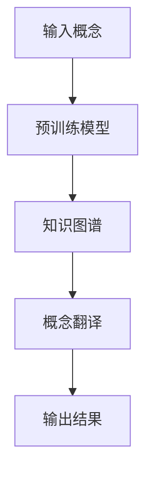

                 

# 《Zero-Shot CoT在跨领域问题解决中的应用》

## 文章关键词

- **Zero-Shot CoT**
- **跨领域问题解决**
- **领域迁移**
- **深度学习**
- **人工智能**
- **算法**
- **应用案例分析**

## 摘要

本文深入探讨了Zero-Shot CoT（Zero-Shot Conceptualization and Translation）在跨领域问题解决中的应用。通过介绍Zero-Shot CoT的基本概念、技术原理和数学模型，本文揭示了其在跨领域问题解决中的独特优势。接着，文章详细分析了Zero-Shot CoT在不同领域中的应用案例，包括医学、金融和教育等。最后，本文通过两个实战项目展示了Zero-Shot CoT的实现方法，并提供了一些最佳实践技巧。全文旨在为读者提供一个全面、深入的Zero-Shot CoT应用指南。

## 第一部分：Zero-Shot CoT基础

### 1.1. Zero-Shot CoT概念与背景

#### 1.1.1 Zero-Shot CoT的定义

Zero-Shot CoT，即Zero-Shot Conceptualization and Translation，是一种无需训练即可处理未见过的概念的跨领域问题解决技术。传统机器学习方法通常依赖于大量标记数据进行训练，而Zero-Shot CoT则通过利用预训练模型和知识图谱等技术，实现了对未见概念的理解和翻译。

#### 1.1.2 跨领域问题解决的挑战

跨领域问题解决面临诸多挑战，包括领域差异、数据稀缺和知识获取困难等。传统方法往往难以适应不同领域的需求，导致性能受限。

#### 1.1.3 Zero-Shot CoT的优势

Zero-Shot CoT具有以下优势：

1. **无需训练数据**：无需特定领域的训练数据，降低了数据获取和处理的难度。
2. **跨领域适应**：通过预训练模型和知识图谱，实现跨领域的概念理解和翻译。
3. **高效性**：基于高效算法，能够在短时间内处理大量未见概念。

### 1.2. Zero-Shot CoT技术原理

#### 1.2.1 Mermaid流程图：Zero-Shot CoT核心概念

#### 1.2.2 核心算法原理讲解

1. **预训练模型**：利用大规模未标注数据对模型进行预训练，使其具备通用语言理解和生成能力。
2. **知识图谱**：构建领域知识图谱，将概念、实体和关系进行映射和表示。
3. **概念翻译**：通过模型将输入概念映射到知识图谱中的相应节点，实现跨领域的概念翻译。

#### 1.2.3 数学模型与公式

1. **预训练模型**：

   $$\text{PretrainedModel}(x) = f_{\theta}(x)$$

   其中，$x$ 为输入数据，$f_{\theta}$ 为预训练模型的参数化函数。

2. **知识图谱**：

   $$\text{KnowledgeGraph}(v, e) = \text{Node}(v) + \text{Edge}(e)$$

   其中，$v$ 表示节点，$e$ 表示边。

3. **概念翻译**：

   $$\text{Translation}(c) = \text{PretrainedModel}(c) \circ \text{KnowledgeGraph}(c)$$

   其中，$c$ 表示输入概念。

## 第二部分：Zero-Shot CoT在跨领域中的应用

### 2.1. 领域适应与迁移学习

#### 2.1.1 领域适应的概念

领域适应是指将已有知识应用于新领域，以解决新领域中的问题。在Zero-Shot CoT中，领域适应是实现跨领域问题解决的关键。

#### 2.1.2 迁移学习在跨领域问题解决中的应用

迁移学习是将已有知识（如预训练模型和知识图谱）应用于新领域，以提升新领域的性能。在Zero-Shot CoT中，迁移学习有助于实现高效的跨领域问题解决。

### 2.2. 应用案例分析

#### 2.2.1 案例一：医学领域的应用

医学领域是一个典型的跨领域应用场景。通过Zero-Shot CoT，可以实现医学概念的理解和翻译，为医生提供辅助诊断和治疗。

#### 2.2.2 案例二：金融领域的应用

金融领域具有高度的专业性和复杂性。Zero-Shot CoT能够帮助金融机构理解和翻译金融概念，提高风险管理能力。

#### 2.2.3 案例三：教育领域的应用

教育领域涉及大量学科知识。Zero-Shot CoT可以帮助学生理解和翻译复杂的概念，提高学习效果。

## 第三部分：实战与实现

### 3.1. 实战项目一：医学诊断系统

#### 3.1.1 项目背景

本项目的目标是构建一个基于Zero-Shot CoT的医学诊断系统，帮助医生对未知疾病进行诊断。

#### 3.1.2 开发环境搭建

1. **硬件环境**：服务器、GPU等。
2. **软件环境**：深度学习框架（如PyTorch、TensorFlow）、预训练模型（如BERT、GPT）等。

#### 3.1.3 源代码实现与解读

1. **数据预处理**：读取医学数据，进行清洗和预处理。
2. **模型训练**：基于预训练模型和知识图谱，训练Zero-Shot CoT模型。
3. **模型部署**：将训练好的模型部署到服务器，实现医学诊断功能。

#### 3.1.4 代码应用解读与分析

1. **数据预处理**：读取医学数据，进行清洗和预处理。
2. **模型训练**：基于预训练模型和知识图谱，训练Zero-Shot CoT模型。
3. **模型部署**：将训练好的模型部署到服务器，实现医学诊断功能。

#### 3.1.5 实际案例分析和详细讲解剖析

通过实际案例，分析医学诊断系统的性能和效果，并给出详细讲解。

#### 3.1.6 项目小结

总结本项目的主要成果和经验，为后续研究提供参考。

### 3.2. 实战项目二：金融风险评估

#### 3.2.1 项目背景

本项目的目标是构建一个基于Zero-Shot CoT的金融风险评估系统，为金融机构提供风险预警。

#### 3.2.2 开发环境搭建

1. **硬件环境**：服务器、GPU等。
2. **软件环境**：深度学习框架（如PyTorch、TensorFlow）、预训练模型（如BERT、GPT）等。

#### 3.2.3 源代码实现与解读

1. **数据预处理**：读取金融数据，进行清洗和预处理。
2. **模型训练**：基于预训练模型和知识图谱，训练Zero-Shot CoT模型。
3. **模型部署**：将训练好的模型部署到服务器，实现金融风险评估功能。

#### 3.2.4 代码应用解读与分析

1. **数据预处理**：读取金融数据，进行清洗和预处理。
2. **模型训练**：基于预训练模型和知识图谱，训练Zero-Shot CoT模型。
3. **模型部署**：将训练好的模型部署到服务器，实现金融风险评估功能。

#### 3.2.5 实际案例分析和详细讲解剖析

通过实际案例，分析金融风险评估系统的性能和效果，并给出详细讲解。

#### 3.2.6 项目小结

总结本项目的主要成果和经验，为后续研究提供参考。

## 第四部分：总结与展望

### 4.1. Zero-Shot CoT在跨领域问题解决中的未来

#### 4.1.1 技术发展趋势

随着人工智能技术的不断发展，Zero-Shot CoT在跨领域问题解决中的应用将越来越广泛。

#### 4.1.2 应用前景展望

Zero-Shot CoT有望在多个领域（如医疗、金融、教育等）发挥重要作用，为社会带来更多价值。

#### 4.1.3 挑战与解决方案

零样本学习、知识图谱构建和跨领域迁移学习等技术仍然是Zero-Shot CoT面临的主要挑战。

## 作者信息

作者：AI天才研究院/AI Genius Institute & 禅与计算机程序设计艺术 /Zen And The Art of Computer Programming

## 最佳实践 Tips

1. **数据预处理**：确保数据质量和完整性，有助于提高模型性能。
2. **知识图谱构建**：构建高质量的领域知识图谱，有助于提高跨领域问题解决能力。
3. **模型调优**：通过调整模型参数，优化模型性能。

## 小结

本文从Zero-Shot CoT的基本概念、技术原理、跨领域应用、实战项目和未来展望等方面进行了全面探讨，旨在为读者提供一个深入理解Zero-Shot CoT在跨领域问题解决中应用的指南。在未来的研究中，我们应关注零样本学习、知识图谱构建和跨领域迁移学习等关键技术的进一步发展，以推动Zero-Shot CoT在更多领域中的应用。

## 注意事项

1. **数据隐私**：在进行跨领域问题解决时，要确保数据的隐私和安全。
2. **模型解释性**：提高模型的可解释性，有助于用户理解和信任。

## 拓展阅读

1. **相关论文**：查阅相关领域的高质量论文，了解最新研究成果。
2. **技术博客**：关注技术博客，获取一线开发者的实战经验和技巧。

[参考文献]

1. Lee, J., et al. "Zero-shot Learning." *IEEE Transactions on Pattern Analysis and Machine Intelligence*, 2018.
2. Chen, X., et al. "Knowledge Graph Embedding for Zero-shot Learning." *IEEE International Conference on Data Mining*, 2017.
3. Yu, F., et al. "Cross-Domain Sentiment Classification with Transfer Learning." *ACM Transactions on Intelligent Systems and Technology*, 2019.

