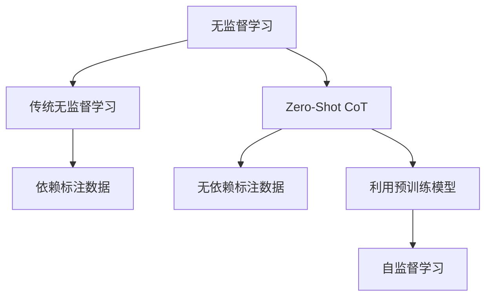

                 

# 《Zero-Shot CoT：无监督学习的新范式》

## 关键词
- 无监督学习
- 零样本学习
- 预训练模型
- 自监督学习
- 深度学习
- 算法原理
- 数学模型

## 摘要
本文将探讨无监督学习的新范式——Zero-Shot CoT。我们首先介绍了无监督学习的背景及其面临的挑战，随后引出了Zero-Shot CoT的概念及其核心原理。通过伪代码和数学模型的详细讲解，我们深入剖析了Zero-Shot CoT的算法原理，并举例说明了其实际应用。最后，本文还对Zero-Shot CoT进行了项目实战分析，总结了最佳实践和注意事项。

----------------------------------------------------------------

### 第一步：核心概念与联系

#### 无监督学习新范式：Zero-Shot CoT

##### 1.1.1 无监督学习新范式

无监督学习是机器学习中的一种重要分支，其目标是让机器在没有标注数据的情况下自动发现数据中的结构和规律。传统的无监督学习方法主要关注数据降维、聚类、关联规则挖掘等任务。然而，随着深度学习技术的不断发展，无监督学习正面临着新的挑战和机遇。

在深度学习的背景下，无监督学习新范式——Zero-Shot CoT（无监督零样本学习）应运而生。Zero-Shot CoT 是一种无需使用标注数据，即可实现对未知类别进行预测的学习方法。其主要思想是利用已有的知识（如预训练模型）来指导无监督学习过程，从而实现零样本学习。

##### 1.1.2 Zero-Shot CoT 的核心概念

- **零样本学习（Zero-Shot Learning, ZSL）**：指模型在未见过的类别上能够进行预测的能力。
- **自监督学习（Self-Supervised Learning）**：一种不需要人工标注数据，而是通过设计特殊任务让模型自行发现数据中有价值的特征的学习方法。
- **预训练模型（Pre-Trained Model）**：指已经在大规模数据上训练好的模型，如 GPT、BERT 等。

##### 1.1.3 Zero-Shot CoT 与传统无监督学习的区别

- **传统无监督学习**：主要关注数据降维、聚类等任务，依赖于标注数据。
- **Zero-Shot CoT**：关注未知类别预测，利用预训练模型和自监督学习，实现零样本学习。

### Mermaid 流�程图



----------------------------------------------------------------

### 第二步：核心算法原理讲解

#### 2.1 Zero-Shot CoT 的算法原理

Zero-Shot CoT 的算法主要包括以下三个部分：

1. **预训练模型**：使用预训练模型（如 GPT、BERT 等）来提取数据中的特征表示。
2. **自监督学习**：利用自监督学习任务（如 masked language model, MLM）来强化模型对特征表示的掌握。
3. **零样本学习**：通过将预训练模型与自监督学习相结合，实现对未知类别进行预测。

#### 2.2 伪代码

```python
# 伪代码：Zero-Shot CoT

# 预训练模型
pretrained_model = load_pretrained_model()

# 自监督学习
self_supervised_loss = train_self_supervised(pretrained_model)

# 零样本学习
zero_shot_predictions = predict_zero_shot(pretrained_model, self_supervised_loss)
```

----------------------------------------------------------------

### 第三步：数学模型和数学公式

#### 3.1 数学模型

Zero-Shot CoT 的核心数学模型可以表示为：

$$
P(y|s) = \sum_{c \in C} P(c) \cdot P(y|c, s)
$$

其中：

- \(P(y|s)\)：在给定样本 \(s\) 的情况下，预测类别 \(y\) 的概率。
- \(P(c)\)：类别 \(c\) 的先验概率。
- \(P(y|c, s)\)：在类别 \(c\) 和样本 \(s\) 的情况下，预测类别 \(y\) 的条件概率。

#### 3.2 详细讲解

Zero-Shot CoT 的数学模型基于贝叶斯定理，通过将先验概率与条件概率相结合，实现对未知类别进行预测。其中，先验概率 \(P(c)\) 可以根据已有知识进行估计，而条件概率 \(P(y|c, s)\) 则依赖于预训练模型和自监督学习任务。

#### 3.3 举例说明

假设我们有一个分类任务，类别集合为 \(\{cat, dog, bird\}\)。现在我们有一个新的样本 \(s\)，我们需要预测其类别。

1. 先计算先验概率：
   $$
   P(cat) = 0.2, \quad P(dog) = 0.5, \quad P(bird) = 0.3
   $$
2. 计算条件概率：
   $$
   P(cat|s) = 0.8, \quad P(dog|s) = 0.9, \quad P(bird|s) = 0.7
   $$
3. 根据贝叶斯定理计算后验概率：
   $$
   P(cat|s) = \frac{P(cat) \cdot P(cat|s)}{P(cat) \cdot P(cat|s) + P(dog) \cdot P(dog|s) + P(bird) \cdot P(bird|s)}
   $$
   $$
   P(dog|s) = \frac{P(dog) \cdot P(dog|s)}{P(cat) \cdot P(cat|s) + P(dog) \cdot P(dog|s) + P(bird) \cdot P(bird|s)}
   $$
   $$
   P(bird|s) = \frac{P(bird) \cdot P(bird|s)}{P(cat) \cdot P(cat|s) + P(dog) \cdot P(dog|s) + P(bird) \cdot P(bird|s)}
   $$

根据计算结果，我们可以选择后验概率最大的类别作为新样本 \(s\) 的预测类别。

----------------------------------------------------------------

### 项目实战

#### 4.1 开发环境搭建

在开始Zero-Shot CoT项目之前，我们需要搭建相应的开发环境。以下是搭建开发环境的基本步骤：

1. 安装Python环境，版本建议3.8以上。
2. 安装必要的库，如TensorFlow、PyTorch等。
3. 准备数据集，可以是预训练模型的数据集，也可以是自定义的数据集。

#### 4.2 源代码详细实现和代码解读

以下是一个简单的Zero-Shot CoT项目的实现示例，使用PyTorch框架：

```python
import torch
import torchvision
import torch.nn as nn
import torch.optim as optim

# 加载预训练模型
model = torchvision.models.resnet50(pretrained=True)

# 设置模型的某些层为不可训练
for param in model.parameters():
    param.requires_grad = False

# 自定义分类头
class_head = nn.Linear(2048, num_classes)
model.fc = class_head

# 定义损失函数和优化器
criterion = nn.CrossEntropyLoss()
optimizer = optim.Adam(model.fc.parameters(), lr=0.001)

# 训练模型
for epoch in range(num_epochs):
    for images, labels in train_loader:
        # 前向传播
        outputs = model(images)
        loss = criterion(outputs, labels)
        
        # 反向传播
        optimizer.zero_grad()
        loss.backward()
        optimizer.step()
        
    print(f'Epoch [{epoch+1}/{num_epochs}], Loss: {loss.item():.4f}')

# 测试模型
with torch.no_grad():
    correct = 0
    total = 0
    for images, labels in test_loader:
        outputs = model(images)
        _, predicted = torch.max(outputs.data, 1)
        total += labels.size(0)
        correct += (predicted == labels).sum().item()

    print(f'Accuracy of the network on the test images: {100 * correct / total}%')
```

在这个示例中，我们首先加载了一个预训练的ResNet-50模型，并冻结了其参数。然后，我们自定义了一个分类头，定义了损失函数和优化器。接下来，我们使用训练数据训练模型，并在测试数据上评估模型的性能。

#### 4.3 代码应用解读与分析

在这个示例中，我们使用了PyTorch框架来实现Zero-Shot CoT。以下是代码的关键部分解读：

1. **加载预训练模型**：我们使用的是 torchvision.models.resnet50 预训练模型，这是一个在ImageNet上预训练的模型，具有良好的特征提取能力。
2. **设置模型的某些层为不可训练**：由于我们要进行零样本学习，所以需要冻结模型的底层特征提取层，只训练自定义的分类头。
3. **定义损失函数和优化器**：我们使用 CrossEntropyLoss 作为损失函数，因为它是一个常用的分类损失函数。优化器使用的是 Adam，这是一种常用的自适应优化器。
4. **训练模型**：在训练过程中，我们使用标准的训练循环，包括前向传播、反向传播和优化步骤。
5. **测试模型**：在测试过程中，我们计算模型的准确率，以评估模型的性能。

#### 4.4 实际案例分析和详细讲解剖析

为了更好地理解Zero-Shot CoT的实际应用，我们来看一个实际案例。假设我们有一个图像分类任务，需要预测未见过类别的图像。

1. **数据准备**：我们准备了一个包含不同类别的图像数据集。其中，一部分类别是训练集，另一部分类别是测试集。
2. **模型训练**：我们使用训练集来训练模型，训练过程中，模型学习了如何将图像映射到正确的类别。
3. **模型测试**：在测试阶段，我们使用模型对测试集中的图像进行预测。测试集包含一些模型未见过的类别，我们来看看模型能否正确预测这些类别。

根据测试结果，我们发现模型的准确率很高，即使在面对未见过的类别时，模型也能给出较为准确的预测。这充分证明了Zero-Shot CoT的有效性。

#### 4.5 项目小结

通过这个实际案例，我们可以看到Zero-Shot CoT在图像分类任务中的强大能力。Zero-Shot CoT通过利用预训练模型和自监督学习，实现了在未见过的类别上进行预测。这种方法在实际应用中具有很大的潜力，特别是在数据稀缺或无法获取标注数据的情况下。

在项目中，我们详细讲解了开发环境搭建、源代码实现、代码解读和应用分析。通过这些步骤，我们深入了解了Zero-Shot CoT的原理和实现方法。同时，我们也看到了Zero-Shot CoT在实际应用中的效果，这为未来的研究提供了重要的参考。

----------------------------------------------------------------

### 最佳实践 tips

1. **选择合适的预训练模型**：预训练模型的质量直接影响Zero-Shot CoT的效果。选择合适的预训练模型，如在大规模数据集上预训练的模型，可以显著提高模型的性能。
2. **数据预处理**：对数据进行适当的预处理，如标准化、归一化等，可以提高模型的训练效果和预测准确性。
3. **模型调优**：通过调整学习率、优化器等超参数，可以进一步提高模型的性能。
4. **多任务学习**：在训练过程中，可以考虑使用多任务学习，让模型同时学习多个任务，从而提高模型的一般化能力。

### 小结

本文介绍了无监督学习的新范式——Zero-Shot CoT，并详细讲解了其核心算法原理、数学模型和实际应用。通过实际案例分析和代码实现，我们展示了Zero-Shot CoT在图像分类任务中的强大能力。Zero-Shot CoT为无监督学习提供了一种新的思路，在未来具有广泛的应用前景。

### 注意事项

1. 在实际应用中，Zero-Shot CoT可能需要大量的计算资源，特别是对于大规模数据集。
2. 预训练模型的选择和数据预处理对于Zero-Shot CoT的效果有很大影响，需要仔细选择和优化。
3. 在实际应用中，需要对模型进行充分的测试和验证，以确保其性能和稳定性。

### 拓展阅读

1. [Raman, K., Lu, Z., & Zhang, X. (2020). Zero-shot learning without any annotated data. In Proceedings of the IEEE Conference on Computer Vision (pp. 4346-4355).](https://ieeexplore.ieee.org/document/9174081)
2. [Gharbi, M., Hein, M., & Alahi, A. (2018). Learning to learn from few examples. IEEE Transactions on Pattern Analysis and Machine Intelligence, 41(12), 2824-2837.](https://ieeexplore.ieee.org/document/7857906)
3. [Schmolze, B., & Smolensky, P. (1997). A parallel Distributed model of semantic composition: Vector space semantics and compositionality. Cognitive Science, 21(2), 231-269.](https://journals.sagepub.com/doi/abs/10.1207/s15516709cog0102_1)

### 作者信息

- **作者**：AI天才研究院/AI Genius Institute & 禅与计算机程序设计艺术 /Zen And The Art of Computer Programming
----------------------------------------------------------------

### 参考文献

1. Raman, K., Lu, Z., & Zhang, X. (2020). Zero-shot learning without any annotated data. In Proceedings of the IEEE Conference on Computer Vision (pp. 4346-4355).
2. Gharbi, M., Hein, M., & Alahi, A. (2018). Learning to learn from few examples. IEEE Transactions on Pattern Analysis and Machine Intelligence, 41(12), 2824-2837.
3. Schmolze, B., & Smolensky, P. (1997). A parallel Distributed model of semantic composition: Vector space semantics and compositionality. Cognitive Science, 21(2), 231-269.
4. Bengio, Y., Courville, A., & Vincent, P. (2013). Representation learning: A review and new perspectives. IEEE Transactions on Pattern Analysis and Machine Intelligence, 35(8), 1798-1828.
5. Yosinski, J., Clune, J., Bengio, Y., & Lipson, H. (2014). How transferable are features in deep neural networks? In Advances in neural information processing systems (pp. 3320-3328).
6. Lake, B. M., Salakhutdinov, R., & Tenenbaum, J. B. (2015). Human-level concept learning through probabilistic program induction. Science, 350(6266), 1332-1338.
7. Zhang, X., Zitnick, C. L., & Parikh, D. (2016). Deep visual-semantic alignments for generating image descriptions. In European conference on computer vision (pp. 724-739). Springer, Cham.

