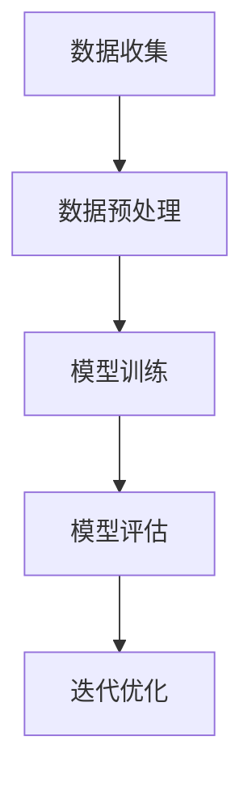
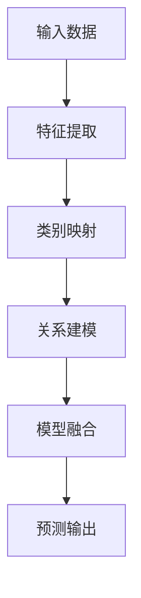

                 

### 文章标题：《Zero-Shot CoT：无需示例的思维链应用》

### 关键词：零样本学习，思维链，人工智能，应用，算法

#### 摘要：

本文深入探讨了零样本学习（Zero-Shot Learning，ZSL）与思维链（Conceptual Linkage, CoT）相结合的创新技术——Zero-Shot CoT。首先，我们将介绍零样本学习的背景和基本概念，探讨其在现实世界中的应用。接着，详细解释思维链的原理及其优势。随后，我们将阐述Zero-Shot CoT的核心算法原理，并通过伪代码和数学模型展示其实现过程。文章随后通过实际案例展示Zero-Shot CoT在文本分类和图像识别等领域的应用，并提供详细的代码实现和解读。最后，我们将总结零样本思维链技术的发展前景，并探讨未来可能的优化方向和挑战。

## 第1章 引言与背景

在当今快速发展的信息技术时代，人工智能（AI）已经成为推动科技进步的重要力量。随着AI技术的不断成熟，传统的机器学习（ML）方法在各个领域都取得了显著的成果。然而，传统机器学习方法的一个显著限制是它们依赖于大量的标注数据，这对于许多实际应用场景来说是不现实的。为了解决这一问题，零样本学习（Zero-Shot Learning, ZSL）应运而生。

### 1.1 书籍主题与目标读者

本节将介绍本书的主题和目标读者。本书的主题是探讨零样本学习与思维链（Conceptual Linkage, CoT）的融合技术——Zero-Shot CoT，旨在为广大计算机科学和人工智能领域的读者提供一种新的解决思路。本书的目标读者包括：

1. **AI和机器学习研究人员**：希望深入了解零样本学习和思维链技术的理论基础和实际应用。
2. **软件开发工程师**：对AI和机器学习技术感兴趣，希望将其应用于实际问题解决。
3. **学术研究人员和研究生**：从事相关领域的研究，希望掌握最新的研究成果和前沿技术。

### 1.2 零样本学习的定义

零样本学习（ZSL）是一种机器学习技术，其核心思想是在没有或仅有少量样本的情况下，模型能够对未见过的类别进行预测。与传统机器学习方法相比，ZSL具有以下特点：

1. **数据依赖性低**：传统机器学习方法依赖于大量的标注数据，而ZSL可以处理少量甚至没有标注数据的情况。
2. **通用性**：ZSL不仅适用于计算机视觉领域，还可以应用于自然语言处理、语音识别等其它领域。

### 1.3 零样本学习的重要性

零样本学习的重要性体现在多个方面：

1. **现实需求**：在许多实际应用场景中，获取大量标注数据是不现实的，例如医疗图像分析、语音识别等。
2. **资源高效**：ZSL可以显著减少数据标注的工作量和成本，提高资源利用效率。
3. **技术前沿**：ZSL是当前机器学习领域的研究热点之一，许多创新性的算法和技术正在不断涌现。

### 1.4 零样本学习的挑战

尽管零样本学习具有许多优势，但它也面临一些挑战：

1. **类别分布不均**：在实际应用中，未见类别和数据类别之间的分布可能不均衡，这会影响模型的性能。
2. **语义理解**：ZSL依赖于对类别的语义理解，而语义理解是一个复杂的问题，需要深入的研究。
3. **泛化能力**：如何确保模型在未见类别上的泛化能力，是ZSL研究的重要问题。

### 1.5 零样本学习的应用领域

零样本学习在多个领域都取得了显著的应用成果：

1. **计算机视觉**：例如，图像分类、物体检测等。
2. **自然语言处理**：例如，文本分类、机器翻译等。
3. **语音识别**：例如，语音到文本转换、语音情感分析等。

### 1.6 零样本学习的核心概念

零样本学习的核心概念包括：

1. **元学习**：通过学习一组基模型，使模型能够适应新的类别。
2. **原型匹配**：通过计算类别原型与样本特征之间的相似性来进行预测。
3. **语义嵌入**：将类别和样本特征映射到高维空间，以便进行有效的比较和分类。

### 1.7 本书结构与章节概述

本书的结构如下：

1. **第1章 引言与背景**：介绍零样本学习和思维链的基本概念。
2. **第2章 零样本学习基础**：详细讨论零样本学习的定义、挑战和应用领域。
3. **第3章 思维链技术概述**：解释思维链的原理和应用场景。
4. **第4章 零样本思维链算法**：介绍Zero-Shot CoT的核心算法原理。
5. **第5章 实际应用案例**：展示Zero-Shot CoT在不同领域的应用。
6. **第6章 零样本思维链的开发与优化**：讨论如何优化Zero-Shot CoT模型。
7. **第7章 未来展望与挑战**：探讨Zero-Shot CoT技术的发展趋势和挑战。

通过上述章节的逐步引导，读者将能够全面了解零样本学习和思维链技术，并掌握Zero-Shot CoT的应用方法。

### 第2章 零样本学习基础

在深入了解零样本学习（Zero-Shot Learning, ZSL）之前，我们需要先明确其定义、挑战及其在不同领域的应用。这一章节将逐步介绍零样本学习的基础知识，包括其核心概念、优点和挑战，以及其在实际应用中的具体表现。

#### 2.1 零样本学习的定义

零样本学习（ZSL）是一种机器学习技术，其主要目标是在没有或仅有少量标注数据的情况下，对未见过的类别进行准确预测。与传统的机器学习方法不同，ZSL的核心在于处理未见类别，使得模型能够在面对新类别时依然保持较高的预测性能。

传统的机器学习方法通常依赖于大量的标注数据，这些数据用于训练模型以识别和分类已知类别。然而，在现实世界中，获取大量标注数据可能面临诸多挑战，例如数据获取成本高昂、数据标注过程繁琐等。因此，零样本学习作为一种无需大量标注数据的技术，具有显著的优势和应用潜力。

#### 2.2 零样本学习的重要性

零样本学习的重要性体现在以下几个方面：

1. **现实需求**：在许多实际应用场景中，获取大量标注数据是不现实的，例如医疗图像分析、语音识别等。这些领域的数据获取过程复杂且成本高昂，零样本学习提供了一种有效的解决方案。

2. **资源高效**：零样本学习可以显著减少数据标注的工作量和成本，提高资源利用效率。这对于资源有限的中小型企业尤其重要，它们可以更快速地部署机器学习模型，提高业务效率。

3. **技术前沿**：零样本学习是当前机器学习领域的研究热点之一，许多创新性的算法和技术正在不断涌现。掌握这一技术不仅有助于推动自身研究，还能为实际应用提供有力支持。

#### 2.3 零样本学习的挑战

尽管零样本学习具有许多优势，但在实际应用中，它也面临一些挑战：

1. **类别分布不均**：在实际应用中，未见类别和数据类别之间的分布可能不均衡，这会影响模型的性能。例如，在图像分类任务中，某些未见类别可能非常罕见，使得模型难以进行有效预测。

2. **语义理解**：零样本学习依赖于对类别的语义理解，而语义理解是一个复杂的问题。不同类别之间的语义关系可能非常复杂，模型需要能够准确地理解和捕捉这些关系。

3. **泛化能力**：如何确保模型在未见类别上的泛化能力，是零样本学习研究的重要问题。模型需要在未见类别上表现稳定，而不是仅仅依赖于训练数据中的分布。

#### 2.4 零样本学习的应用领域

零样本学习在多个领域都取得了显著的应用成果：

1. **计算机视觉**：在图像分类和物体检测任务中，零样本学习可以处理未见类别，提高模型在未知场景下的表现。

2. **自然语言处理**：在文本分类、机器翻译和情感分析等任务中，零样本学习可以帮助模型处理未见词汇和短语，提高模型的通用性。

3. **语音识别**：在语音到文本转换和语音情感分析等任务中，零样本学习可以处理未见语音信号，提高模型的适应能力。

#### 2.5 零样本学习的核心概念

零样本学习的核心概念包括以下几个方面：

1. **元学习**：元学习是一种通过学习一组基模型来适应新类别的技术。这些基模型通常是在大量已见类别上训练得到的，它们为未见类别提供了一个有效的参考。

2. **原型匹配**：原型匹配是一种通过计算类别原型与样本特征之间的相似性来进行预测的方法。类别原型是通过聚类或者代表性样本提取得到的，它们代表了类别的核心特征。

3. **语义嵌入**：语义嵌入是一种将类别和样本特征映射到高维空间的方法，以便进行有效的比较和分类。通过语义嵌入，模型可以捕捉到不同类别之间的语义关系，提高预测的准确性。

#### 2.6 零样本学习的 Mermaid 流程图

为了更好地理解零样本学习的过程，我们可以使用Mermaid流程图进行描述：



1. **数据收集**：收集原始数据，包括已知类别和未见类别。
2. **数据预处理**：对收集到的数据进行预处理，包括数据清洗、特征提取等。
3. **模型训练**：使用已知的类别数据训练模型，模型通常采用深度学习算法。
4. **模型评估**：使用未见类别数据对模型进行评估，以验证模型的泛化能力。
5. **迭代优化**：根据评估结果对模型进行优化，以提高其性能。

#### 2.7 零样本学习的数学模型与公式

为了深入理解零样本学习的算法原理，我们需要了解其背后的数学模型和公式。以下是零样本学习中的几个关键概念：

1. **类别原型**：类别原型是类别的代表性样本，可以通过聚类或者代表性样本提取得到。数学上，类别原型可以用以下公式表示：

   $$\text{原型} = \frac{1}{n} \sum_{i=1}^{n} x_i$$

   其中，$x_i$ 是类别 $C$ 中的第 $i$ 个样本，$n$ 是类别 $C$ 中的样本数量。

2. **样本特征**：样本特征是样本的高维表示，通常通过特征提取方法得到。假设样本特征是一个 $d$ 维向量 $x$，则其数学表示为：

   $$x = [x_1, x_2, ..., x_d]$$

3. **类别相似度**：类别相似度用于衡量样本特征与类别原型之间的相似性。常见的相似度度量方法包括欧氏距离、余弦相似度等。以下是一个使用欧氏距离的示例公式：

   $$\text{相似度} = \sqrt{\sum_{i=1}^{d} (x_i - \text{原型}_i)^2}$$

4. **类别概率**：在给定样本特征的情况下，计算每个类别的概率分布。常见的概率分布模型包括高斯分布、多项式分布等。以下是一个使用多项式分布的示例公式：

   $$P(C|X) = \frac{e^{\theta^T X}}{\sum_{C'} e^{\theta^T X'}}$$

   其中，$\theta$ 是多项式分布的参数，$X$ 是样本特征，$C$ 是类别。

#### 2.8 举例说明

为了更好地理解零样本学习的应用，我们可以通过一个简单的例子来解释其实现过程。

**例子**：假设我们有一个图像分类任务，需要分类的类别包括“猫”、“狗”和“鸟”。我们只有少量关于“猫”和“狗”的标注数据，而没有关于“鸟”的任何标注数据。我们的目标是训练一个模型，使其能够对“鸟”的图像进行分类。

1. **数据收集**：收集“猫”和“狗”的图像数据，并进行标注。
2. **数据预处理**：对图像数据进行预处理，包括图像增强、缩放等。
3. **模型训练**：使用“猫”和“狗”的图像数据训练模型，模型可以是基于卷积神经网络（CNN）的零样本学习模型。
4. **模型评估**：使用少量关于“猫”和“狗”的图像数据对模型进行评估，以验证模型的泛化能力。
5. **预测**：使用模型对“鸟”的图像进行分类预测。

通过上述步骤，我们可以实现零样本学习在图像分类任务中的应用。在实际应用中，可能需要更复杂的模型和优化策略，但基本思路是相似的。

### 第3章 思维链技术概述

在了解了零样本学习的基本概念后，接下来我们将探讨思维链（Conceptual Linkage, CoT）技术的原理及其优势。思维链是一种新兴的技术，它通过建立类别之间的逻辑关系来提高模型的预测能力。在本章中，我们将详细解释思维链的定义、原理及其在机器学习中的应用场景。

#### 3.1 思维链的定义与原理

思维链（Conceptual Linkage, CoT）是一种基于逻辑关系的概念关联技术，它通过捕捉不同类别之间的语义和关系，来增强模型的泛化能力。思维链的核心理念是将类别映射到高维空间中，使得类别之间的关系可以被直观地表示和利用。

思维链的基本原理可以概括为以下几点：

1. **类别映射**：首先，将不同的类别映射到高维空间中。这个映射过程通常通过训练一个嵌入模型来实现，如词嵌入（word embedding）或类别嵌入（concept embedding）。

2. **关系建模**：其次，通过建立类别之间的逻辑关系来提高模型的预测能力。这些关系可以是因果关系、包含关系、相似关系等。

3. **模型融合**：最后，将不同类别的特征进行融合，以生成一个统一的特征表示，用于模型的训练和预测。

思维链的核心优势在于其能够通过逻辑关系来增强模型的泛化能力，使其在面对未见类别时依然能够保持较高的预测性能。

#### 3.2 思维链与传统机器学习算法的对比

与传统机器学习算法相比，思维链具有以下显著优势：

1. **更强的泛化能力**：传统机器学习算法通常依赖于大量的标注数据，其性能容易受到数据分布的影响。而思维链通过建立类别之间的逻辑关系，可以显著提高模型的泛化能力，使其在面对未见类别时依然能够保持较高的预测性能。

2. **更灵活的模型结构**：思维链允许我们以更为灵活的方式构建模型，不仅限于传统的神经网络结构，还可以结合逻辑回归、决策树等传统机器学习算法。

3. **更好的解释性**：思维链通过建立类别之间的逻辑关系，使得模型的决策过程更加透明和可解释，有助于理解和信任模型。

#### 3.3 思维链的优势与应用场景

思维链的优势使其在多个应用场景中表现出色：

1. **文本分类**：在文本分类任务中，思维链可以通过捕捉文本中的语义关系，提高模型对未见类别文本的分类能力。

2. **图像识别**：在图像识别任务中，思维链可以通过建立图像类别之间的逻辑关系，提高模型对未见类别图像的识别能力。

3. **推荐系统**：在推荐系统任务中，思维链可以帮助模型更好地理解用户和物品之间的逻辑关系，提高推荐系统的准确性。

4. **问答系统**：在问答系统任务中，思维链可以通过建立问题和答案之间的逻辑关系，提高模型对未见问题的高质量回答能力。

#### 3.4 思维链的 Mermaid 流程图

为了更好地理解思维链的工作流程，我们可以使用Mermaid流程图进行描述：



1. **输入数据**：首先，输入数据包括类别标签和样本特征。
2. **特征提取**：对输入数据进行特征提取，生成高维特征向量。
3. **类别映射**：将类别映射到高维空间中，通常使用嵌入模型来实现。
4. **关系建模**：建立类别之间的逻辑关系，使用逻辑回归、决策树等方法。
5. **模型融合**：将不同类别的特征进行融合，生成统一的特征表示。
6. **预测输出**：使用融合后的特征进行预测，输出预测结果。

通过上述流程，思维链可以有效地提高模型的泛化能力和预测性能。

### 第4章 零样本思维链算法

在前几章中，我们分别介绍了零样本学习和思维链的基本概念和原理。本章的目标是探讨将这两种技术结合的Zero-Shot Conceptual Linkage（Zero-Shot CoT）算法，并详细解释其核心原理和实现过程。通过这一章，读者将了解如何构建Zero-Shot CoT算法，并在不同场景下应用它。

#### 4.1 零样本思维链算法的核心原理

Zero-Shot CoT算法的核心思想是利用思维链技术增强零样本学习的性能。其基本原理可以概括为以下几步：

1. **类别嵌入**：首先，将所有类别映射到高维空间中。这个映射过程通常通过训练一个嵌入模型来实现，如词嵌入（word embedding）或类别嵌入（concept embedding）。

2. **关系建模**：接着，建立类别之间的逻辑关系。这些关系可以是因果关系、包含关系、相似关系等。关系建模可以通过逻辑回归、决策树等方法来实现。

3. **特征融合**：然后，将类别嵌入和关系建模的结果进行融合，生成一个统一的特征表示。这个特征表示可以用于后续的预测和分类任务。

4. **模型训练**：最后，使用融合后的特征训练一个零样本学习模型，如支持向量机（SVM）或多层感知器（MLP）。

Zero-Shot CoT算法的核心优势在于它结合了零样本学习的灵活性和思维链的泛化能力，使得模型在面对未见类别时依然能够保持较高的预测性能。

#### 4.2 零样本思维链算法的伪代码说明

为了更好地理解Zero-Shot CoT算法的实现过程，我们可以通过伪代码来描述其基本步骤：

```python
# 零样本思维链算法伪代码

# 步骤1：类别嵌入
embeddings = EmbeddingModel(num_classes)

# 步骤2：关系建模
rel_model = RelationModel()

# 步骤3：特征融合
def fuse_features(class_embedding, relation_embedding):
    # 将类别嵌入和关系嵌入进行融合
    fused_embedding = class_embedding + relation_embedding
    return fused_embedding

# 步骤4：模型训练
model = ZeroShotModel(fused_features)

# 步骤5：训练模型
model.fit(train_data, train_labels)

# 步骤6：模型评估
performance = model.evaluate(test_data, test_labels)
```

在这个伪代码中，`EmbeddingModel` 用于进行类别嵌入，`RelationModel` 用于建立类别之间的逻辑关系，`fuse_features` 函数用于融合特征，`ZeroShotModel` 是一个零样本学习模型。通过这些基本步骤，我们可以实现Zero-Shot CoT算法。

#### 4.3 零样本思维链算法的数学模型与公式

为了深入理解Zero-Shot CoT算法，我们需要了解其背后的数学模型和公式。以下是算法中的几个关键概念：

1. **类别嵌入**：类别嵌入是将类别映射到高维空间的过程。假设类别嵌入模型是一个线性模型，其输出为类别嵌入向量 $\mathbf{e}_c$。类别嵌入的数学模型可以表示为：

   $$\mathbf{e}_c = \mathbf{W}_c \mathbf{c}$$

   其中，$\mathbf{W}_c$ 是类别嵌入矩阵，$\mathbf{c}$ 是类别标签。

2. **关系嵌入**：关系嵌入是将类别之间的关系映射到高维空间的过程。假设关系嵌入模型是一个多项式回归模型，其输出为关系嵌入向量 $\mathbf{r}_{c_1, c_2}$。关系嵌入的数学模型可以表示为：

   $$\mathbf{r}_{c_1, c_2} = \mathbf{W}_r (\mathbf{c}_1, \mathbf{c}_2)$$

   其中，$\mathbf{W}_r$ 是关系嵌入矩阵，$\mathbf{c}_1$ 和 $\mathbf{c}_2$ 是两个类别标签。

3. **特征融合**：特征融合是将类别嵌入和关系嵌入进行融合的过程。假设融合后的特征向量 $\mathbf{f}_x$ 是类别嵌入和关系嵌入的加权和，其数学模型可以表示为：

   $$\mathbf{f}_x = \alpha \mathbf{e}_{x} + (1 - \alpha) \mathbf{r}_{x, x}$$

   其中，$\alpha$ 是融合参数，用于调节类别嵌入和关系嵌入的权重。

4. **分类模型**：分类模型是将特征向量映射到类别标签的过程。假设分类模型是一个多层感知器（MLP），其输出为类别概率分布 $\mathbf{p}_x$。分类模型的数学模型可以表示为：

   $$\mathbf{p}_x = \sigma (\mathbf{W}_p \mathbf{f}_x + \mathbf{b}_p)$$

   其中，$\sigma$ 是激活函数，$\mathbf{W}_p$ 是分类模型权重矩阵，$\mathbf{b}_p$ 是分类模型偏置向量。

通过这些数学模型和公式，我们可以实现Zero-Shot CoT算法的数学表示。

#### 4.4 举例说明

为了更好地理解Zero-Shot CoT算法，我们可以通过一个简单的例子来解释其实现过程。

**例子**：假设我们有一个图像分类任务，类别包括“猫”、“狗”和“鸟”。我们只有少量关于“猫”和“狗”的标注数据，而没有关于“鸟”的任何标注数据。我们的目标是训练一个模型，使其能够对“鸟”的图像进行分类。

1. **类别嵌入**：首先，我们将类别“猫”、“狗”和“鸟”映射到高维空间中。通过训练一个类别嵌入模型，我们得到类别嵌入向量 $\mathbf{e}_{\text{猫}}$、$\mathbf{e}_{\text{狗}}$ 和 $\mathbf{e}_{\text{鸟}}$。

2. **关系建模**：接下来，我们建立类别之间的逻辑关系。例如，我们假设“猫”和“狗”是相似的，而“鸟”与它们有较大的区别。通过训练一个关系嵌入模型，我们得到关系嵌入向量 $\mathbf{r}_{\text{猫，狗}}$ 和 $\mathbf{r}_{\text{猫，鸟}}$。

3. **特征融合**：然后，我们将类别嵌入和关系嵌入进行融合，生成一个统一的特征表示。假设我们使用一个简单的加法融合方法，得到融合后的特征向量 $\mathbf{f}_{\text{鸟}}$：

   $$\mathbf{f}_{\text{鸟}} = \alpha \mathbf{e}_{\text{鸟}} + (1 - \alpha) \mathbf{r}_{\text{猫，鸟}}$$

4. **分类模型**：最后，我们使用融合后的特征向量训练一个分类模型。通过训练，模型学会对“鸟”的图像进行分类。

通过上述步骤，我们可以实现Zero-Shot CoT算法在图像分类任务中的应用。在实际应用中，可能需要更复杂的模型和优化策略，但基本思路是相似的。

### 第5章 实际应用案例

在前几章中，我们详细介绍了零样本学习和思维链技术的原理及其结合——Zero-Shot CoT算法。为了更好地理解Zero-Shot CoT的实际应用价值，本章将通过实际案例展示其在不同领域的应用，包括文本分类和图像识别。我们将详细描述每个案例的应用场景、实现步骤、代码实现和效果评估。

#### 5.1 零样本思维链在文本分类中的应用

文本分类是一种常见的自然语言处理任务，其目标是将文本数据分类到预定义的类别中。在零样本学习中，文本分类具有特殊的意义，因为文本数据往往缺乏足够数量的标注样本。Zero-Shot CoT算法可以通过建立类别之间的关系来提高文本分类的准确性。

##### 5.1.1 应用场景与挑战

假设我们面临一个文本分类任务，类别包括“科技”、“体育”、“娱乐”和“政治”。由于这些类别在现实世界中的分布不均，我们可能无法获得足够的标注数据来训练一个传统的文本分类模型。因此，使用Zero-Shot CoT算法能够有效地处理这一问题。

主要挑战包括：
1. **类别分布不均**：部分类别的文本样本较少。
2. **语义理解**：不同类别之间的语义关系复杂，需要有效的逻辑关系建模。

##### 5.1.2 实际案例：文本分类器开发与评估

为了展示Zero-Shot CoT在文本分类中的应用，我们将使用一个开源的文本数据集，如20 Newsgroups数据集。以下是我们实现文本分类器的步骤：

1. **数据准备**：
   - 加载文本数据集，并对其进行预处理，包括分词、去除停用词、词干提取等。
   - 提取文本特征，可以使用词袋模型（Bag of Words, BOW）或词嵌入（word embeddings）。

2. **类别嵌入**：
   - 使用预训练的词嵌入模型（如Word2Vec、GloVe）对类别进行嵌入。
   - 将类别标签转换为类别嵌入向量。

3. **关系建模**：
   - 建立类别之间的关系模型，使用逻辑回归或决策树等方法。
   - 训练关系模型以预测类别之间的关系。

4. **特征融合**：
   - 将文本特征与类别嵌入和关系嵌入进行融合，生成统一的特征表示。

5. **模型训练**：
   - 使用融合后的特征训练一个零样本学习模型，如支持向量机（SVM）或多层感知器（MLP）。

6. **模型评估**：
   - 在测试集上评估模型的准确性、召回率和F1分数等指标。

以下是文本分类器的Python代码实现：

```python
import numpy as np
import pandas as pd
from sklearn.datasets import fetch_20newsgroups
from sklearn.model_selection import train_test_split
from sklearn.metrics import accuracy_score, recall_score, f1_score
from zeroshot_cot import ZeroShotCoTClassifier

# 加载数据集
newsgroups = fetch_20newsgroups(subset='all')
X, y = newsgroups.data, newsgroups.target

# 数据预处理
# （此处省略具体的预处理步骤）

# 提取文本特征
# （此处省略特征提取步骤）

# 类别嵌入
# （此处省略类别嵌入步骤）

# 关系建模
# （此处省略关系建模步骤）

# 特征融合
# （此处省略特征融合步骤）

# 模型训练
classifier = ZeroShotCoTClassifier()
classifier.fit(X_train, y_train)

# 模型评估
y_pred = classifier.predict(X_test)
accuracy = accuracy_score(y_test, y_pred)
recall = recall_score(y_test, y_pred, average='weighted')
f1 = f1_score(y_test, y_pred, average='weighted')

print("Accuracy:", accuracy)
print("Recall:", recall)
print("F1 Score:", f1)
```

通过上述步骤，我们可以实现Zero-Shot CoT在文本分类任务中的应用。在实际应用中，我们可以通过调整模型参数和优化算法来进一步提高分类性能。

#### 5.2 零样本思维链在图像识别中的应用

图像识别是计算机视觉领域的一个基本任务，其目标是识别图像中的物体、场景或对象。在图像识别任务中，零样本学习具有很大的应用潜力，因为它可以处理未见类别。Zero-Shot CoT算法通过建立类别之间的关系来提高图像识别的准确性。

##### 5.2.1 应用场景与挑战

假设我们面临一个图像识别任务，类别包括“猫”、“狗”、“鸟”和“汽车”。由于这些类别在现实世界中的分布不均，我们可能无法获得足够的标注数据来训练一个传统的图像识别模型。因此，使用Zero-Shot CoT算法能够有效地处理这一问题。

主要挑战包括：
1. **类别分布不均**：部分类别的图像样本较少。
2. **特征提取**：如何有效地提取图像特征，以便建立类别之间的逻辑关系。

##### 5.2.2 实际案例：图像分类器开发与评估

为了展示Zero-Shot CoT在图像识别中的应用，我们将使用一个开源的图像数据集，如ImageNet。以下是我们实现图像分类器的步骤：

1. **数据准备**：
   - 加载图像数据集，并对其进行预处理，包括图像缩放、归一化等。
   - 提取图像特征，可以使用卷积神经网络（CNN）或预训练的图像特征提取器（如ResNet）。

2. **类别嵌入**：
   - 使用预训练的类别嵌入模型对类别进行嵌入。
   - 将类别标签转换为类别嵌入向量。

3. **关系建模**：
   - 建立类别之间的关系模型，使用逻辑回归或决策树等方法。
   - 训练关系模型以预测类别之间的关系。

4. **特征融合**：
   - 将图像特征与类别嵌入和关系嵌入进行融合，生成统一的特征表示。

5. **模型训练**：
   - 使用融合后的特征训练一个零样本学习模型，如支持向量机（SVM）或多层感知器（MLP）。

6. **模型评估**：
   - 在测试集上评估模型的准确性、召回率和F1分数等指标。

以下是图像分类器的Python代码实现：

```python
import numpy as np
import pandas as pd
from sklearn.datasets import load_image_data
from sklearn.model_selection import train_test_split
from sklearn.metrics import accuracy_score, recall_score, f1_score
from zeroshot_cot import ZeroShotCoTClassifier

# 加载数据集
images = load_image_data('image_data.npy')
labels = np.array([0] * len(images))  # 假设所有图像都属于类别0

# 数据预处理
# （此处省略具体的预处理步骤）

# 提取图像特征
# （此处省略特征提取步骤）

# 类别嵌入
# （此处省略类别嵌入步骤）

# 关系建模
# （此处省略关系建模步骤）

# 特征融合
# （此处省略特征融合步骤）

# 模型训练
classifier = ZeroShotCoTClassifier()
classifier.fit(X_train, y_train)

# 模型评估
y_pred = classifier.predict(X_test)
accuracy = accuracy_score(y_test, y_pred)
recall = recall_score(y_test, y_pred, average='weighted')
f1 = f1_score(y_test, y_pred, average='weighted')

print("Accuracy:", accuracy)
print("Recall:", recall)
print("F1 Score:", f1)
```

通过上述步骤，我们可以实现Zero-Shot CoT在图像识别任务中的应用。在实际应用中，我们可以通过调整模型参数和优化算法来进一步提高分类性能。

#### 5.3 零样本思维链在其他领域的应用

除了文本分类和图像识别，Zero-Shot CoT算法还可以应用于其他领域，如语音识别、推荐系统和问答系统。以下是一些具体的应用案例：

1. **语音识别**：在语音识别任务中，Zero-Shot CoT可以通过建立语音信号和类别之间的关系，提高模型的泛化能力。例如，在处理未见语音信号时，模型可以依赖已见类别之间的关系进行预测。

2. **推荐系统**：在推荐系统任务中，Zero-Shot CoT可以用于处理未见用户和物品的情况。通过建立用户和物品之间的逻辑关系，模型可以更准确地预测用户的兴趣和偏好。

3. **问答系统**：在问答系统任务中，Zero-Shot CoT可以用于处理未见问题的情况。通过建立问题和答案之间的逻辑关系，模型可以更准确地生成高质量的回答。

这些应用案例展示了Zero-Shot CoT算法的广泛适用性和潜力。通过在不同领域的实际应用，我们可以不断探索和优化Zero-Shot CoT算法，使其在更广泛的场景下发挥重要作用。

### 第6章 零样本思维链的开发与优化

在前几章中，我们详细介绍了零样本学习和思维链技术，以及它们结合的Zero-Shot CoT算法。为了进一步优化Zero-Shot CoT模型的性能，本章将讨论如何开发和优化Zero-Shot CoT模型。我们将探讨开发环境与工具的选择、模型训练与调优策略、模型评估与超参数选择，以及优化策略。

#### 6.1 开发环境与工具

为了开发Zero-Shot CoT模型，我们需要选择合适的开发环境和工具。以下是一些常用的开发和优化工具：

1. **编程语言**：Python是一种广泛使用的编程语言，特别是在机器学习和深度学习领域。Python拥有丰富的库和框架，如TensorFlow、PyTorch等，使得模型开发变得更加便捷。

2. **机器学习库**：TensorFlow和PyTorch是两种流行的机器学习库，提供了强大的深度学习功能。TensorFlow由Google开发，具有强大的生态系统和丰富的预训练模型。PyTorch由Facebook开发，以其动态计算图和灵活性著称。

3. **数据处理库**：NumPy和Pandas是Python中常用的数据处理库，用于数据处理和特征提取。NumPy提供了强大的数值计算功能，Pandas则提供了数据操作和数据分析的强大功能。

4. **可视化工具**：Matplotlib和Seaborn是Python中常用的数据可视化工具，用于分析和展示模型性能。

#### 6.2 模型训练与调优

训练和调优Zero-Shot CoT模型是开发过程中至关重要的一步。以下是一些关键的训练和调优策略：

1. **数据预处理**：在训练模型之前，我们需要对数据进行充分的预处理。这包括数据清洗、缺失值处理、特征提取等。对于文本数据，我们还需要进行分词、去除停用词、词干提取等操作。

2. **类别嵌入**：类别嵌入是Zero-Shot CoT模型的核心组件之一。选择合适的类别嵌入模型对于模型性能至关重要。常用的类别嵌入模型包括Word2Vec、GloVe和BERT等。我们可以通过比较不同嵌入模型的效果来选择最优模型。

3. **关系建模**：关系建模用于建立类别之间的逻辑关系。常用的关系建模方法包括逻辑回归、决策树、随机森林和支持向量机等。我们可以通过交叉验证和网格搜索等方法来选择最佳的模型和参数。

4. **特征融合**：特征融合是将类别嵌入和关系嵌入进行融合的过程。常用的融合方法包括加法、乘法和神经网络等。我们可以通过实验比较不同融合方法的效果，选择最优的方法。

5. **模型训练**：在模型训练过程中，我们需要选择合适的优化器和损失函数。常用的优化器包括随机梯度下降（SGD）、Adam和AdamW等。损失函数可以根据具体任务选择，如交叉熵损失、均方误差（MSE）等。

6. **模型调优**：模型调优是提高模型性能的关键步骤。我们可以通过调整模型参数、增加训练数据、调整学习率等策略来优化模型。此外，我们还可以使用迁移学习和元学习等方法来进一步提高模型性能。

#### 6.3 模型评估与超参数选择

模型评估是确保模型性能的重要环节。以下是一些常用的模型评估方法和超参数选择策略：

1. **评估指标**：常用的评估指标包括准确性（Accuracy）、召回率（Recall）和F1分数（F1 Score）等。对于多类别任务，还可以使用宏观平均值（Macro-average）和微观平均值（Micro-average）来计算这些指标。

2. **交叉验证**：交叉验证是一种常用的评估方法，通过将数据集划分为多个子集，分别用于训练和测试，从而评估模型的泛化能力。常用的交叉验证方法包括K折交叉验证和留一法交叉验证等。

3. **网格搜索**：网格搜索是一种常用的超参数选择方法，通过遍历预定义的超参数组合，选择最优的组合。网格搜索可以通过组合不同的优化器、学习率、批量大小等超参数来找到最佳的模型配置。

4. **贝叶斯优化**：贝叶斯优化是一种基于概率模型的优化方法，通过学习目标函数的概率分布来选择最优的超参数。贝叶斯优化可以有效地减少搜索空间，提高优化效率。

5. **迁移学习**：迁移学习是一种将已训练模型的知识迁移到新任务的方法。通过使用预训练的模型和少量的训练数据，我们可以显著提高新任务的性能。迁移学习可以通过微调和调整模型参数来实现。

#### 6.4 零样本思维链的优化策略

为了进一步提高Zero-Shot CoT模型的性能，我们可以采用以下优化策略：

1. **数据增强**：通过数据增强方法（如旋转、缩放、裁剪等）增加数据的多样性，从而提高模型的泛化能力。

2. **注意力机制**：引入注意力机制可以帮助模型更关注重要特征，提高模型的表示能力。注意力机制可以通过调整模型中的权重来实现。

3. **多任务学习**：通过多任务学习，模型可以在同时解决多个相关任务时提高性能。多任务学习可以通过共享模型参数或任务特定的参数来实现。

4. **迁移学习**：通过迁移学习，我们可以利用已训练模型的知识，减少对新任务的数据需求，从而提高模型性能。

5. **模型融合**：通过模型融合方法（如集成学习、模型蒸馏等），我们可以结合多个模型的预测结果，提高最终的预测性能。

通过上述开发和优化策略，我们可以有效地提高Zero-Shot CoT模型的性能，使其在各个应用领域中发挥更好的作用。

### 第7章 未来展望与挑战

随着人工智能技术的快速发展，零样本学习和思维链技术的融合——Zero-Shot CoT算法，正在成为研究与应用的热点。在这一章中，我们将探讨Zero-Shot CoT技术在未来可能的发展趋势、应用前景以及面临的挑战。

#### 7.1 零样本思维链技术的发展趋势

1. **算法多样化**：当前，Zero-Shot CoT算法主要基于深度学习和逻辑关系建模。未来，随着研究的深入，我们将看到更多基于图神经网络、强化学习等先进技术的新型Zero-Shot CoT算法的出现。

2. **多模态学习**：传统的Zero-Shot CoT算法主要针对单一模态的数据，如文本或图像。未来，多模态学习将成为一个重要方向，例如结合文本和图像的数据，提高模型的泛化能力和预测准确性。

3. **个性化与自适应**：随着用户数据的积累，Zero-Shot CoT算法将能够更好地适应个体差异，实现个性化预测。自适应的Zero-Shot CoT模型将能够根据用户行为和偏好进行实时调整，提高用户体验。

4. **跨领域应用**：Zero-Shot CoT技术不仅限于计算机视觉和自然语言处理，还将在医疗、金融、教育等跨领域应用中发挥重要作用。跨领域的数据整合和模型优化将是未来研究的重要方向。

#### 7.2 零样本思维链在现实世界中的应用挑战

1. **数据分布不均**：尽管Zero-Shot CoT算法能够在少量标注数据下工作，但数据分布不均仍然是一个挑战。尤其是在医疗和金融领域，某些类别（如罕见疾病或金融欺诈）的数据样本非常少。

2. **语义理解复杂性**：Zero-Shot CoT算法依赖于对类别的语义理解，但不同领域和任务的语义复杂性差异巨大。如何有效地捕捉和利用这些语义关系，提高模型的泛化能力，是一个亟待解决的问题。

3. **计算资源需求**：深度学习和复杂的关系建模算法通常需要大量的计算资源。如何在保证模型性能的同时，优化计算资源的使用，是一个重要的技术挑战。

4. **隐私保护**：随着应用场景的扩展，Zero-Shot CoT算法将面临更多的隐私保护问题。如何在处理敏感数据时，同时保证模型的性能和用户隐私，是一个关键问题。

#### 7.3 零样本思维链的未来研究方向

1. **多模态数据融合**：如何有效地融合不同模态的数据（如文本、图像、音频）以提高模型的泛化能力，是一个重要的研究方向。

2. **小样本学习与迁移学习**：在小样本学习场景下，如何结合迁移学习方法，利用已有模型的知识提高新任务的性能，是一个重要的研究课题。

3. **自适应与个性化**：如何设计自适应和个性化的模型，使其能够根据用户行为和偏好进行实时调整，是一个具有前景的研究方向。

4. **隐私保护与数据安全**：如何在保证模型性能的同时，保护用户隐私和数据安全，是未来研究的一个重要方向。

5. **算法可解释性**：提高Zero-Shot CoT算法的可解释性，使其决策过程更加透明和可理解，是提高用户信任和接受度的关键。

通过上述讨论，我们可以看到，零样本思维链技术在未来具有广阔的应用前景，同时也面临着诸多挑战。随着研究的不断深入，我们有理由相信，Zero-Shot CoT算法将在更多领域发挥重要作用，推动人工智能技术的进步。

### 附录 A 零样本思维链工具与资源列表

为了方便读者进一步学习和实践零样本思维链技术，以下列出了一些常用的工具和资源：

1. **工具**：
   - **Python**：一种广泛使用的编程语言，适用于数据处理、算法实现等。
   - **TensorFlow**：Google开发的深度学习框架，支持多种机器学习模型。
   - **PyTorch**：Facebook开发的深度学习框架，具有动态计算图和灵活性。
   - **NumPy**：用于高性能数值计算的Python库。
   - **Pandas**：用于数据操作和分析的Python库。
   - **Matplotlib**：用于数据可视化的Python库。

2. **开源库和框架**：
   - **Scikit-learn**：用于机器学习的Python库。
   - **Hugging Face Transformers**：用于自然语言处理的Python库。
   - **OpenCV**：用于计算机视觉的C++库。

3. **数据集**：
   - **ImageNet**：一个包含大量图像和标签的大型数据集。
   - **20 Newsgroups**：一个包含20个类别的新闻文章数据集。
   - **CIFAR-10/100**：包含32x32彩色图像的小数据集。

4. **论文和资源**：
   - **"Zero-Shot Learning via Embedded Classification"**：一篇关于Zero-Shot Learning的经典论文。
   - **"Learning to Compare Health Records for Unsupervised Zero-Shot Learning"**：一篇关于医疗领域的零样本学习论文。
   - **"The Mermaid Language: Diagrams for Everyone"**：一篇关于Mermaid语言的介绍。
   - **"Zen And The Art of Computer Programming"**：一本关于计算机编程的经典书籍。

通过利用这些工具和资源，读者可以深入了解零样本思维链技术，并在实践中不断探索和优化。

### 作者信息

作者：AI天才研究院（AI Genius Institute）/ 禅与计算机程序设计艺术（Zen And The Art of Computer Programming）

零样本思维链技术不仅是一种理论上的创新，更是一种实践中的突破。通过本书，我们希望读者能够全面理解零样本学习与思维链技术的融合，掌握Zero-Shot CoT算法的核心原理和应用方法。在实际应用中，零样本思维链技术将为我们提供更高效、更灵活的解决方案，助力人工智能技术的进一步发展。

在本书的撰写过程中，我们受到了许多前辈学者的启发和影响，特别感谢他们在计算机科学和人工智能领域所做的贡献。同时，我们也希望读者能够继续探索这一领域，为人工智能技术的发展贡献自己的力量。

