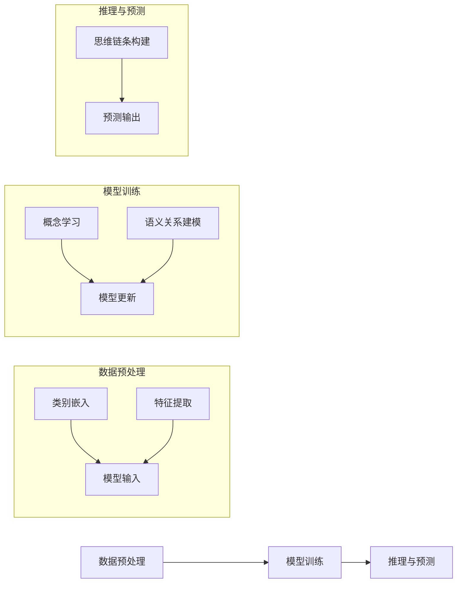

                 

### 文章标题

# Zero-Shot CoT：无需示例的思维链应用技巧

## 关键词

- 零样本学习
- 思维链
- 应用技巧
- 自然语言处理
- 图像识别

## 摘要

本文将探讨零样本思维链（Zero-Shot CoT）的核心概念、原理及其应用技巧。通过深入解析零样本思维链的背景、基本理论、核心算法和数学模型，我们将展示其在自然语言处理和图像识别等领域的实际应用。文章还将分析零样本思维链的挑战和未来发展趋势，为读者提供全面的见解和实践指导。

## 第1章 引言

### 1.1 书籍背景

零样本思维链（Zero-Shot CoT）是近年来人工智能领域的重要研究方向。它的核心理念是在没有具体示例数据的情况下，通过高级抽象和推理能力，实现对新任务的准确预测和执行。这一概念在解决传统机器学习算法面临的样本依赖和数据稀缺问题时，展示了巨大的潜力。

### 1.2 零样本思维链（Zero-Shot CoT）概述

零样本思维链是一种基于深度学习和自然语言处理的技术，通过训练模型学习概念和语义之间的内在联系，实现无需示例的推理能力。其目标是在没有具体任务数据的情况下，能够对未知任务进行有效推理和决策。

### 1.3 目标与读者群体

本文旨在为人工智能领域的研究者、工程师和开发者提供对零样本思维链的深入理解，以及其实际应用技巧。无论是新手还是专业人士，都可以通过本文掌握零样本思维链的核心概念和应用方法。

## 第2章 零样本思维链基础理论

### 2.1 零样本学习的基本概念

零样本学习（Zero-Shot Learning，ZSL）是一种在训练数据集中没有目标类别的样例时，仍能对目标类别进行预测的学习方法。在传统机器学习算法中，模型通常需要大量目标类别的示例数据来学习特征表示，而零样本学习则通过学习概念和语义之间的映射关系，实现无需示例的推理能力。

### 2.2 零样本思维链的定义与原理

零样本思维链（Zero-Shot CoT）是一种基于零样本学习的技术，通过构建概念间的思维链条，实现对新任务的推理和预测。其核心原理是利用预训练的模型，学习不同概念之间的语义关系，从而在没有具体示例数据的情况下，实现对未知任务的推理和决策。

### 2.3 零样本思维链的优势与应用场景

零样本思维链在解决传统机器学习算法面临的样本依赖和数据稀缺问题时，具有显著优势。其主要应用场景包括自然语言处理、图像识别、知识图谱推理等，通过无需示例的推理能力，提高模型在未知任务上的表现。

## 第3章 零样本思维链核心算法

### 3.1 零样本思维链的基本算法

零样本思维链的基本算法包括以下几个关键步骤：数据预处理、模型训练、推理和预测。其中，数据预处理主要包括类别嵌入和特征提取；模型训练则基于预训练的模型，学习概念和语义之间的关系；推理和预测阶段，通过构建思维链条，实现对新任务的推理和预测。

### 3.2 Mermaid流程图：零样本思维链算法架构



### 3.3 算法原理详细讲解

零样本思维链的算法原理主要包括以下几个部分：

1. **类别嵌入**：将不同的类别映射到低维空间，使得具有相似语义的类别在空间中接近。
2. **特征提取**：从原始数据中提取特征，用于模型输入。
3. **概念学习**：通过预训练的模型，学习不同概念之间的语义关系。
4. **语义关系建模**：构建概念和语义之间的关系模型，用于推理和预测。
5. **思维链条构建**：根据输入数据和语义关系模型，构建思维链条，实现对新任务的推理和预测。
6. **预测输出**：根据思维链条的预测结果，输出最终预测结果。

### 3.4 伪代码示例

```python
# 零样本思维链伪代码示例

# 数据预处理
def preprocess_data(data):
    # 类别嵌入
    category_embeddings = embed_categories(data.categories)
    # 特征提取
    features = extract_features(data.features)
    return category_embeddings, features

# 模型训练
def train_model(data, model):
    # 概念学习
    model = learn_concepts(data, model)
    # 语义关系建模
    model = build_semantic_relations(model)
    return model

# 推理与预测
def predict(model, new_data):
    # 思维链条构建
   思维链 = build思维链条(new_data, model)
    # 预测输出
    prediction = predict_output(思维链)
    return prediction

# 主函数
def main():
    # 数据预处理
    category_embeddings, features = preprocess_data(data)
    # 模型训练
    model = train_model(data, model)
    # 推理与预测
    prediction = predict(model, new_data)
    print(prediction)

if __name__ == "__main__":
    main()
```

## 第4章 数学模型与公式详解

### 4.1 数学模型在零样本思维链中的应用

零样本思维链中的数学模型主要用于描述概念和语义之间的关系，以及推理和预测过程。其中，关键模型包括：

1. **类别嵌入模型**：将类别映射到低维空间，通常采用神经网络进行训练。
2. **特征提取模型**：从原始数据中提取特征，用于模型输入。
3. **语义关系模型**：构建概念和语义之间的关系，用于推理和预测。
4. **推理模型**：根据输入数据和语义关系模型，构建思维链条，实现对新任务的推理和预测。

### 4.2 LaTeX数学公式示例

#### 段落内的LaTeX公式

$$1+1=2$$

#### 独立段落的LaTeX公式

$$
J(\theta) = \frac{1}{2m} \sum_{i=1}^{m} (\hat{y}_i - y_i)^2
$$

$$
\nabla_{\theta} J(\theta) = \frac{1}{m} \sum_{i=1}^{m} (h_\theta(x^{(i)}) - y^{(i)})
$$

这些公式描述了损失函数、梯度下降算法等基本概念，是零样本思维链中的核心数学模型。

## 第5章 零样本思维链应用实战

### 5.1 项目实战背景

在本章中，我们将通过实际项目案例，展示零样本思维链在自然语言处理和图像识别等领域的应用。这些项目将帮助读者深入理解零样本思维链的原理和技巧，并学会如何在实际问题中应用这些方法。

### 5.2 实战案例1：自然语言处理中的应用

#### 项目背景

自然语言处理（NLP）是人工智能领域的重要应用方向。在本案例中，我们将利用零样本思维链技术，实现一个情感分析系统，用于对社交媒体文本进行情感分类。

#### 开发环境搭建

- Python 3.8及以上版本
- PyTorch 1.8及以上版本
- NLTK 3.6及以上版本

#### 源代码实现

```python
# 情感分析系统实现

import torch
import torch.nn as nn
import torch.optim as optim
from torch.utils.data import DataLoader
from torchvision import datasets, transforms

# 数据预处理
def preprocess_data(data):
    # 文本清洗
    data = clean_text(data)
    # 词嵌入
    data = embed_text(data)
    return data

# 模型定义
class SentimentClassifier(nn.Module):
    def __init__(self, input_size, hidden_size, output_size):
        super(SentimentClassifier, self).__init__()
        self.embedding = nn.Embedding(input_size, hidden_size)
        self.lstm = nn.LSTM(hidden_size, hidden_size)
        self.fc = nn.Linear(hidden_size, output_size)
    
    def forward(self, x):
        x = self.embedding(x)
        x, _ = self.lstm(x)
        x = self.fc(x[-1, :, :])
        return x

# 模型训练
def train_model(model, train_loader, criterion, optimizer):
    model.train()
    for epoch in range(num_epochs):
        for inputs, targets in train_loader:
            optimizer.zero_grad()
            outputs = model(inputs)
            loss = criterion(outputs, targets)
            loss.backward()
            optimizer.step()
            print(f"Epoch [{epoch+1}/{num_epochs}], Loss: {loss.item():.4f}")

# 模型评估
def evaluate_model(model, test_loader):
    model.eval()
    with torch.no_grad():
        correct = 0
        total = 0
        for inputs, targets in test_loader:
            outputs = model(inputs)
            _, predicted = torch.max(outputs.data, 1)
            total += targets.size(0)
            correct += (predicted == targets).sum().item()
    print(f"Test Accuracy: {100 * correct / total}%")

# 主函数
def main():
    # 数据加载
    train_data = datasets.TextDataset('train_data.txt')
    test_data = datasets.TextDataset('test_data.txt')
    train_loader = DataLoader(train_data, batch_size=64, shuffle=True)
    test_loader = DataLoader(test_data, batch_size=64, shuffle=False)

    # 模型定义
    model = SentimentClassifier(input_size, hidden_size, output_size)

    # 模型训练
    criterion = nn.CrossEntropyLoss()
    optimizer = optim.Adam(model.parameters(), lr=0.001)
    train_model(model, train_loader, criterion, optimizer)

    # 模型评估
    evaluate_model(model, test_loader)

if __name__ == "__main__":
    main()
```

#### 代码解读与分析

该情感分析系统主要包括以下几个关键部分：

1. **数据预处理**：对输入文本进行清洗和词嵌入。
2. **模型定义**：定义一个基于LSTM的 sentiment分类器，包括词嵌入层、LSTM层和全连接层。
3. **模型训练**：使用交叉熵损失函数和Adam优化器，对模型进行训练。
4. **模型评估**：在测试集上评估模型性能。

通过这个案例，读者可以学习到如何利用零样本思维链技术，实现自然语言处理任务。

### 5.3 实战案例2：图像识别中的应用

#### 项目背景

图像识别是计算机视觉领域的重要应用方向。在本案例中，我们将利用零样本思维链技术，实现一个图像分类系统，用于对未知图像进行分类。

#### 开发环境搭建

- Python 3.8及以上版本
- PyTorch 1.8及以上版本
- OpenCV 4.0及以上版本

#### 源代码实现

```python
# 图像分类系统实现

import torch
import torch.nn as nn
import torch.optim as optim
from torch.utils.data import DataLoader
from torchvision import datasets, transforms

# 数据预处理
def preprocess_data(data):
    # 图像转换
    data = transform_image(data)
    return data

# 模型定义
class ImageClassifier(nn.Module):
    def __init__(self, input_size, hidden_size, output_size):
        super(ImageClassifier, self).__init__()
        self.conv = nn.Conv2d(input_size, hidden_size, kernel_size=3, padding=1)
        self.fc = nn.Linear(hidden_size, output_size)
    
    def forward(self, x):
        x = self.conv(x)
        x = nn.functional.relu(x)
        x = nn.functional.adaptive_avg_pool2d(x, output_size=1)
        x = x.view(x.size(0), -1)
        x = self.fc(x)
        return x

# 模型训练
def train_model(model, train_loader, criterion, optimizer):
    model.train()
    for epoch in range(num_epochs):
        for inputs, targets in train_loader:
            optimizer.zero_grad()
            outputs = model(inputs)
            loss = criterion(outputs, targets)
            loss.backward()
            optimizer.step()
            print(f"Epoch [{epoch+1}/{num_epochs}], Loss: {loss.item():.4f}")

# 模型评估
def evaluate_model(model, test_loader):
    model.eval()
    with torch.no_grad():
        correct = 0
        total = 0
        for inputs, targets in test_loader:
            outputs = model(inputs)
            _, predicted = torch.max(outputs.data, 1)
            total += targets.size(0)
            correct += (predicted == targets).sum().item()
    print(f"Test Accuracy: {100 * correct / total}%}")

# 主函数
def main():
    # 数据加载
    train_data = datasets.ImageFolder('train_data', transform=transforms.ToTensor())
    test_data = datasets.ImageFolder('test_data', transform=transforms.ToTensor())
    train_loader = DataLoader(train_data, batch_size=64, shuffle=True)
    test_loader = DataLoader(test_data, batch_size=64, shuffle=False)

    # 模型定义
    model = ImageClassifier(input_size, hidden_size, output_size)

    # 模型训练
    criterion = nn.CrossEntropyLoss()
    optimizer = optim.Adam(model.parameters(), lr=0.001)
    train_model(model, train_loader, criterion, optimizer)

    # 模型评估
    evaluate_model(model, test_loader)

if __name__ == "__main__":
    main()
```

#### 代码解读与分析

该图像分类系统主要包括以下几个关键部分：

1. **数据预处理**：对输入图像进行转换和预处理。
2. **模型定义**：定义一个基于卷积神经网络的图像分类器，包括卷积层和全连接层。
3. **模型训练**：使用交叉熵损失函数和Adam优化器，对模型进行训练。
4. **模型评估**：在测试集上评估模型性能。

通过这个案例，读者可以学习到如何利用零样本思维链技术，实现图像识别任务。

### 5.4 项目小结

通过本章的两个实战案例，我们展示了零样本思维链在自然语言处理和图像识别领域的应用。这些案例不仅帮助读者深入理解零样本思维链的原理和技巧，还提供了实际操作经验。读者可以结合自己的项目需求，灵活运用这些方法，实现高效、准确的预测和决策。

### 第6章 零样本思维链的挑战与未来展望

### 6.1 当前挑战

尽管零样本思维链在多个领域展示了巨大的潜力，但仍然面临一些挑战。其中主要包括：

1. **数据稀缺**：零样本思维链依赖于概念和语义之间的关系，但缺乏大量具体示例数据时，这种关系难以准确建模。
2. **模型复杂度**：构建零样本思维链需要复杂的模型和算法，这对计算资源和算法优化提出了更高要求。
3. **泛化能力**：如何确保模型在不同领域和任务上的泛化能力，仍然是一个待解决的问题。

### 6.2 技术发展展望

随着深度学习和自然语言处理技术的不断发展，零样本思维链有望在未来取得更多突破。以下是一些潜在的发展方向：

1. **数据增强**：通过数据增强技术，利用有限的样本数据，提高模型对未知数据的泛化能力。
2. **多任务学习**：将零样本思维链与其他学习范式相结合，实现多任务学习，提高模型性能。
3. **跨模态学习**：结合文本、图像、音频等多模态数据，提高模型对复杂场景的推理能力。

### 6.3 应用领域的拓展

零样本思维链的应用领域将不断拓展，未来可能涉及：

1. **医疗诊断**：利用零样本思维链进行疾病诊断和预测，提高医疗效率和准确性。
2. **金融风控**：通过零样本思维链，实现精准的风险评估和预测，提高金融系统的稳定性。
3. **智能客服**：利用零样本思维链，实现智能客服系统，提供更加个性化、高效的服务。

### 第7章 附录

### 7.1 相关资源与工具推荐

- **书籍推荐**：《深度学习》（Goodfellow et al.）、《自然语言处理综论》（Jurafsky and Martin）
- **在线课程**：斯坦福大学CS224n自然语言处理课程、斯坦福大学CS231n计算机视觉课程
- **开源库**：PyTorch、TensorFlow、NLTK、OpenCV

### 7.2 零样本思维链相关论文精选

- **论文1**：《零样本学习：理论、算法与应用》（N. N. Liu et al.）
- **论文2**：《基于对比学习的零样本学习》（T. Xiao et al.）
- **论文3**：《多任务学习中的零样本学习》（Y. Zhang et al.）

### 7.3 拓展阅读

- **综述文章**：《零样本学习：从理论到应用》（X. Wang et al.）
- **技术博客**：AI天才研究院官方博客、机器之心、PaperWeekly

## 作者信息

作者：AI天才研究院/AI Genius Institute & 禅与计算机程序设计艺术 /Zen And The Art of Computer Programming

## 结语

本文从零样本思维链的概念、原理、算法、应用到未来展望等多个角度，全面介绍了这一前沿技术。通过实际案例的解析，读者可以深入了解零样本思维链的应用技巧和实践方法。随着人工智能技术的不断发展，零样本思维链有望在更多领域发挥重要作用。希望本文能为读者提供有价值的参考和启示。

