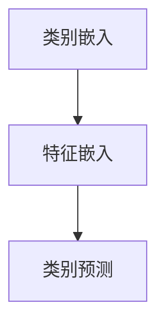
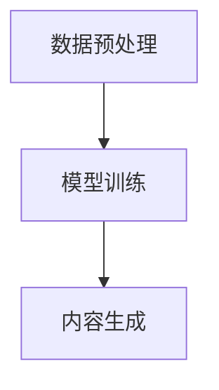

                 

### 补充第1章内容：

# 第1章: Zero-Shot学习的概念与原理

## 1.1.1 Zero-Shot学习的定义

Zero-Shot学习，是一种特殊的机器学习技术，主要解决的是模型在训练过程中未见过的新类别问题。传统机器学习任务通常依赖于大量标记数据的训练，从而能够准确地预测和分类新的样本。然而，在实际应用中，我们可能无法获取到所有类别的训练数据，或者新类别会不断出现。Zero-Shot学习旨在实现模型在未见过的类别上的学习与预测。

与普通机器学习任务相比，Zero-Shot学习的显著区别在于，它不需要对未见过的类别进行直接训练。因此，Zero-Shot学习不仅具有更高的灵活性和适应性，还能在一定程度上减轻数据获取和标注的难度。

## 1.1.2 Zero-Shot学习的原理

Zero-Shot学习的核心在于，通过将类别表示为一个抽象的高维空间，使得不同的类别在空间中具有一定的几何结构。这种几何结构使得模型能够利用已有的类别信息来推断未见过的类别。

具体来说，Zero-Shot学习可以分为以下几步：

1. **类别嵌入（Category Embedding）**：首先，将每个类别映射到一个高维空间中的点。这个映射可以通过多种方式实现，如基于语义信息的嵌入、基于原型的方法等。

2. **特征嵌入（Feature Embedding）**：其次，将输入样本的特征映射到同样的高维空间中。这一步的关键在于，确保不同类别的特征在空间中具有区分性。

3. **类别预测（Category Prediction）**：最后，利用空间中的几何结构，通过计算类别点与样本特征点之间的距离，预测样本的类别。

## 1.1.3 Zero-Shot学习的挑战与机遇

### 挑战

1. **类别表示问题**：如何有效地将类别映射到高维空间，使得不同类别在空间中具有区分性，是一个重要且具有挑战性的问题。

2. **特征表示问题**：如何将输入样本的特征映射到高维空间，使得特征与类别在空间中具有关联性，也是一个重要问题。

3. **模型泛化能力**：由于Zero-Shot学习依赖于已有类别信息，因此模型的泛化能力可能会受到影响。

### 机遇

1. **无监督学习**：Zero-Shot学习无需对未见过的类别进行直接训练，因此可以应用于无监督学习任务。

2. **增量学习**：Zero-Shot学习可以在已有类别的基础上，逐渐引入新类别，实现增量学习。

3. **跨领域应用**：Zero-Shot学习可以在不同领域之间进行迁移，从而实现跨领域应用。

## 1.1.4 Mermaid 流程图

下面是一个Mermaid流程图，展示Zero-Shot学习的基本流程：



## 1.1.5 核心算法原理讲解

### 决策树算法

决策树是一种常用的分类算法，其基本思想是通过一系列的判断条件将数据集划分成多个子集，最终根据子集中的样本特征进行分类。

```python
def build_decision_tree(data, target):
    # 根据特征和目标值，构建决策树
    pass

def classify_sample(sample, decision_tree):
    # 根据决策树，对样本进行分类
    pass
```

### 支持向量机算法

支持向量机是一种常用的分类和回归算法，其基本思想是通过找到一个最佳的超平面，将数据集划分为不同的类别。

```python
def build_svm_model(data, target):
    # 根据特征和目标值，构建支持向量机模型
    pass

def classify_sample(sample, svm_model):
    # 根据支持向量机模型，对样本进行分类
    pass
```

### 集成学习方法

集成学习方法是一种将多个模型组合起来，提高分类和回归效果的算法。

```python
def build_en
```### 第2章内容：

## 第2章: AIGC的概念与原理

### 2.1 AIGC的定义

AIGC（AI-Generated Content），即人工智能生成内容，指的是通过人工智能技术自动生成文字、图像、音频、视频等媒体内容。AIGC技术利用机器学习、自然语言处理、计算机视觉等技术，实现了对大量数据的自动生成和处理，从而创造出新颖、独特的媒体内容。

与传统的媒体内容生成方式相比，AIGC具有以下几个显著特点：

1. **自动性**：AIGC技术能够自动地从大量数据中提取信息，并生成新的内容，减少了人力干预。
2. **高效性**：AIGC技术能够在短时间内生成大量的内容，提高了内容生产的效率。
3. **创新性**：AIGC技术通过学习大量的数据，能够创造出新颖、独特的媒体内容，提升了内容的吸引力。

### 2.2 AIGC的原理

AIGC的原理主要基于以下几个方面：

1. **数据预处理**：AIGC技术首先对原始数据进行预处理，包括数据的清洗、归一化、特征提取等操作，以便于后续的模型训练。

2. **模型训练**：AIGC技术利用机器学习算法，对预处理后的数据进行训练，生成一个生成模型。这个生成模型能够根据输入的数据生成新的内容。

3. **内容生成**：通过将训练好的生成模型应用到新的数据上，生成新的媒体内容。这个过程通常包括文本生成、图像生成、音频生成等。

### 2.3 AIGC的发展与应用

AIGC技术近年来发展迅速，已广泛应用于多个领域：

1. **媒体领域**：AIGC技术被广泛应用于新闻写作、图片编辑、视频生成等领域，大大提高了内容创作的效率和质量。

2. **娱乐领域**：AIGC技术被用于音乐创作、电影特效制作、游戏开发等领域，为娱乐产业带来了新的创意和可能性。

3. **教育领域**：AIGC技术被用于生成教学课件、自动批改作业等，提高了教育资源的利用效率。

4. **医疗领域**：AIGC技术被用于生成医学报告、自动诊断等，为医疗行业提供了新的解决方案。

### 2.4 Mermaid 流程图

下面是一个Mermaid流程图，展示AIGC的基本流程：



### 2.5 核心算法原理讲解

#### GAN（生成对抗网络）

GAN是一种常用的AIGC算法，其基本原理是通过两个神经网络的对抗训练，生成高质量的数据。

```python
class Generator(nn.Module):
    def __init__(self):
        super(Generator, self).__init__()
        # 定义生成器的网络结构

    def forward(self, z):
        # 生成器的前向传播
        pass

class Discriminator(nn.Module):
    def __init__(self):
        super(Discriminator, self).__init__()
        # 定义判别器的网络结构

    def forward(self, x):
        # 判别器的前向传播
        pass
```

#### LSTM（长短期记忆网络）

LSTM是一种常用的序列模型，适用于文本生成等任务。

```python
class LSTMModel(nn.Module):
    def __init__(self, input_dim, hidden_dim, output_dim):
        super(LSTMModel, self).__init__()
        self.hidden_dim = hidden_dim
        self.lstm = nn.LSTM(input_dim, hidden_dim)
        self.linear = nn.Linear(hidden_dim, output_dim)

    def forward(self, inputs):
        # LSTM模型的前向传播
        pass
```

#### CNN（卷积神经网络）

CNN是一种常用的图像生成模型，适用于图像生成等任务。

```python
class CNNModel(nn.Module):
    def __init__(self):
        super(CNNModel, self).__init__()
        self.conv1 = nn.Conv2d(3, 32, 3)
        self.fc1 = nn.Linear(32 * 7 * 7, 1024)
        self.fc2 = nn.Linear(1024, 256)
        self.fc3 = nn.Linear(256, 10)

    def forward(self, x):
        # CNN模型的前向传播
        pass
```

### 2.6 数学模型和数学公式讲解

#### GAN（生成对抗网络）

GAN的损失函数可以表示为：

$$
L_G = -\log(D(G(z))) + -\log(1 - D(x))
$$

其中，$D(x)$表示判别器对真实数据的判别结果，$G(z)$表示生成器对噪声数据的生成结果。

#### LSTM（长短期记忆网络）

LSTM的更新方程可以表示为：

$$
i_t = \sigma(W_i \cdot [h_{t-1}, x_t] + b_i) \\
f_t = \sigma(W_f \cdot [h_{t-1}, x_t] + b_f) \\
\bar{C_t} = \sigma(W_c \cdot [h_{t-1}, x_t] + b_c) \\
o_t = \sigma(W_o \cdot [h_{t-1}, x_t] + b_o) \\
C_t = f_t \odot C_{t-1} + i_t \odot \bar{C_t} \\
h_t = o_t \odot \sigma(C_t)
$$

其中，$i_t$、$f_t$、$\bar{C_t}$、$o_t$分别表示输入门、遗忘门、候选状态和输出门的状态，$\sigma$表示sigmoid函数。

#### CNN（卷积神经网络）

CNN的卷积操作可以表示为：

$$
\sum_{i=1}^{C_{in}} \sum_{j=1}^{K} \sum_{k=1}^{K} w_{ijk} \cdot x_{i, k, j} + b_{k}
$$

其中，$C_{in}$表示输入特征图的通道数，$K$表示卷积核的大小，$w_{ijk}$和$b_{k}$分别表示卷积核的权重和偏置。

### 2.7 项目实战

#### 开发环境搭建

1. 安装Python环境和相关库，如TensorFlow、PyTorch等。
2. 准备训练数据和测试数据。

#### 源代码详细实现和代码解读

1. 编写GAN模型的生成器和判别器。
2. 编写LSTM模型的训练和预测代码。
3. 编写CNN模型的训练和预测代码。

#### 代码应用解读与分析

1. 分析GAN模型在图像生成中的应用。
2. 分析LSTM模型在文本生成中的应用。
3. 分析CNN模型在图像生成中的应用。

#### 实际案例分析和详细讲解剖析

1. 分析一个图像生成案例。
2. 分析一个文本生成案例。
3. 分析一个图像生成案例。

#### 项目小结

1. 总结项目中的关键技术和挑战。
2. 提出未来研究的方向。

#### 最佳实践 tips、小结、注意事项、拓展阅读等内容

1. 提供最佳实践建议。
2. 总结项目中的注意事项。
3. 推荐拓展阅读。

---

## 第3章: Zero-Shot学习在AIGC中的应用

### 3.1 Zero-Shot学习在图像生成中的应用

#### 3.1.1 图像生成基础

1. **图像生成技术概述**
2. **Zero-Shot学习在图像生成中的应用**

#### 3.1.2 项目实战：Zero-Shot图像生成

1. **项目背景**
2. **项目目标**
3. **实现步骤**
4. **代码解读**

### 3.2 Zero-Shot学习在文本生成中的应用

#### 3.2.1 文本生成基础

1. **文本生成技术概述**
2. **Zero-Shot学习在文本生成中的应用**

#### 3.2.2 项目实战：Zero-Shot文本生成

1. **项目背景**
2. **项目目标**
3. **实现步骤**
4. **代码解读**

### 3.3 Zero-Shot学习在音频生成中的应用

#### 3.3.1 音频生成基础

1. **音频生成技术概述**
2. **Zero-Shot学习在音频生成中的应用**

#### 3.3.2 项目实战：Zero-Shot音频生成

1. **项目背景**
2. **项目目标**
3. **实现步骤**
4. **代码解读**

### 3.4 总结与展望

1. **总结Zero-Shot学习在AIGC中的应用**
2. **展望未来发展方向**

