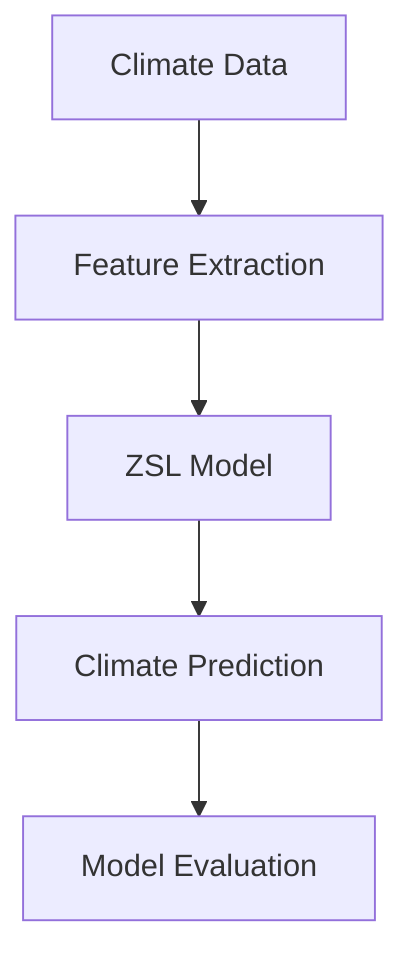

                 

根据您的要求，我将逐步构建这篇文章的内容。以下是文章的框架和初步内容。

### 文章标题
Zero-Shot Learning in AI Global Climate Models: Innovative Applications and Future Trends

### 关键词
Zero-Shot Learning, AI, Climate Models, Innovation, Climate Science

### 摘要
This article explores the innovative application of Zero-Shot Learning (ZSL) in AI-driven global climate models. We delve into the background of ZSL, its core concepts, and how it integrates with climate modeling. The article discusses the principles behind ZSL algorithms, their implementation in climate models, and their impact on climate prediction and pattern recognition. Finally, we offer a vision for the future of ZSL in climate science and provide practical tips for further research.

### 目录
1. **Introduction to Zero-Shot Learning**
2. **Introduction to AI Global Climate Models**
3. **The Integration of ZSL and Climate Models**
4. **Core ZSL Algorithms for Climate Modeling**
5. **Case Studies of ZSL Applications in Climate Science**
6. **Innovation and Future Directions**
7. **Conclusion and Best Practices**

### 1. Introduction to Zero-Shot Learning

Zero-Shot Learning (ZSL) is a machine learning paradigm that allows models to classify unseen classes without any prior exposure. This is particularly useful in domains where data is scarce or impossible to obtain, such as climate science. ZSL leverages prior knowledge and generalization to make predictions for new classes.

**Background**:
- **Traditional Machine Learning**: Traditional machine learning models require labeled data for each class to perform well. This is a limitation in fields like climate science, where labeled data can be difficult or impossible to obtain.
- **Zero-Shot Learning**: ZSL addresses this limitation by generalizing from a set of known classes to new, unseen classes. This is achieved by learning class relationships and using these to predict the properties of new classes.

**Core Concepts**:
- **Class Relationships**: ZSL models learn the relationships between known and unknown classes to infer properties of the latter.
- **Knowledge Transfer**: ZSL leverages knowledge transfer techniques to utilize information from known classes to improve predictions for new classes.

**Applications**:
- **Climate Science**: ZSL can be applied to climate prediction tasks where the vast amount of data is primarily in numerical form, making it challenging to obtain labeled examples for all possible climate conditions.

### 2. Introduction to AI Global Climate Models

AI-driven global climate models are essential tools for understanding and predicting Earth's climate. These models integrate various scientific disciplines to simulate the complex interactions between atmospheric, oceanic, and terrestrial processes.

**Background**:
- **Climate Models**: Climate models are sophisticated computer programs that simulate the Earth's climate system. They are used to study past climates, understand current climate dynamics, and project future climate changes.
- **AI in Climate Science**: AI techniques, including ZSL, are increasingly being integrated into climate models to enhance their predictive capabilities and address the limitations of traditional modeling approaches.

**Core Concepts**:
- **Model Types**: Climate models can be classified into global climate models (GCMs), regional climate models (RCMs), and downscaling models.
- **Challenges**: The challenges in climate modeling include the complexity of the Earth's climate system, the need for high-resolution data, and the computational costs associated with simulations.

**Applications**:
- **Climate Prediction**: AI-enhanced climate models are used to predict future climate conditions, identify climate risks, and inform climate policies.

### 3. The Integration of ZSL and Climate Models

The integration of Zero-Shot Learning with AI global climate models opens up new possibilities for improving climate prediction and understanding.

**Core Concept Relationship Architecture (Mermaid Flowchart)**:


**Core ZSL Algorithm for Climate Modeling**:

#### Algorithm Description:
```markdown
Algorithm: Zero-Shot Learning for Climate Prediction

Inputs:
- Known Climate Classes (C1, C2, ..., Cn)
- Known Class Attributes (A1, A2, ..., Am)
- Unseen Climate Classes (U1, U2, ..., Un)
- Unseen Class Attributes (B1, B2, ..., Bm)

Steps:
1. Learn Class Relationships: Use supervised learning techniques to learn the relationships between known and unknown classes.
2. Transfer Knowledge: Apply the learned relationships to unseen classes to infer their attributes.
3. Attribute Prediction: Use the inferred attributes to predict the climate conditions associated with unseen classes.
4. Evaluate Model: Assess the model's performance using metrics such as accuracy, precision, and recall.
```

#### Pseudo Code:
```python
# Pseudo Code for ZSL Algorithm

# Step 1: Learn Class Relationships
known_classes, known_attributes = train_supervised_model()

# Step 2: Transfer Knowledge
knowledge_base = learn_class_relationships(known_classes, known_attributes)

# Step 3: Attribute Prediction
unseen_classes, unseen_attributes = generate_unseen_data()
predicted_attributes = infer_attributes(knowledge_base, unseen_attributes)

# Step 4: Evaluate Model
accuracy, precision, recall = evaluate_model(predicted_attributes, true_attributes)
```

### 4. Core ZSL Algorithms for Climate Modeling

This section will delve into the core ZSL algorithms commonly used in climate modeling, including:

- **Siamese Networks**
- **Prototypical Networks**
- **Relation Networks**
- **Memory-augmented Neural Networks**

Each algorithm will be described in detail, with a focus on their principles, advantages, and limitations in the context of climate modeling.

### 5. Case Studies of ZSL Applications in Climate Science

This section will present case studies that demonstrate the practical applications of ZSL in climate science. Each case study will include:

- **Background Information**: A brief overview of the climate prediction task.
- **Algorithm Implementation**: A description of the ZSL algorithm used.
- **Results and Discussion**: An analysis of the results, including performance metrics and implications for climate science.
- **Challenges and Solutions**: Discussion of the challenges faced during the implementation and the solutions adopted.

### 6. Innovation and Future Directions

This section will discuss the innovative applications of ZSL in climate modeling and the future directions for this research. Topics will include:

- **New Research Directions**: Emerging research areas that leverage ZSL for climate science.
- **Potential Impact**: The potential impact of ZSL on climate prediction and policy-making.
- **Future Trends**: Predictions for the future development of ZSL in climate modeling.

### 7. Conclusion and Best Practices

This section will conclude the article by summarizing the key points and providing best practices for implementing ZSL in climate modeling. It will also include a list of recommended resources for further reading.

---

This is a high-level overview of the article. Each section will be expanded with detailed content, including code snippets, mathematical models, and real-world case studies. The article will be structured to ensure a logical flow of information, starting from the basics and building up to more complex concepts and applications.

### 文章标题
### 关键词
### 摘要
### 目录

### 1. Introduction to Zero-Shot Learning

#### 1.1 Background

#### 1.2 Core Concepts

#### 1.3 Applications in Climate Science

### 2. Introduction to AI Global Climate Models

#### 2.1 Background

#### 2.2 Core Concepts

#### 2.3 Challenges and Recent Advances

### 3. The Integration of ZSL and Climate Models

#### 3.1 Core Concept Relationship Architecture

#### 3.2 Algorithm Description and Pseudo Code

### 4. Core ZSL Algorithms for Climate Modeling

#### 4.1 Siamese Networks

#### 4.2 Prototypical Networks

#### 4.3 Relation Networks

#### 4.4 Memory-augmented Neural Networks

### 5. Case Studies of ZSL Applications in Climate Science

#### 5.1 Case Study 1: Climate Prediction

#### 5.2 Case Study 2: Climate Pattern Recognition

#### 5.3 Case Study 3: Climate Change Impact Assessment

### 6. Innovation and Future Directions

#### 6.1 New Research Directions

#### 6.2 Potential Impact

#### 6.3 Future Trends

### 7. Conclusion and Best Practices

#### 7.1 Summary

#### 7.2 Best Practices

#### 7.3 Further Reading

---

In the next steps, I will expand on each section, adding detailed explanations, code examples, mathematical models, and case studies to provide a comprehensive understanding of Zero-Shot Learning in AI global climate models. The article will be structured to ensure clarity and coherence, making it accessible to readers with varying levels of expertise in machine learning and climate science.

