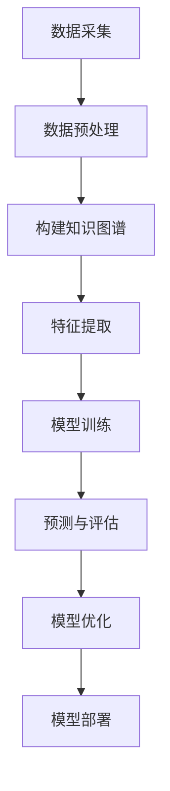

                 

### 《Zero-Shot学习在AI天气预报中的应用前景》

#### 关键词：
- Zero-Shot学习
- AI天气预报
- 机器学习
- 数据预处理
- 模型优化

#### 摘要：
本文旨在探讨Zero-Shot学习在AI天气预报中的应用前景。首先，我们介绍了Zero-Shot学习的基础概念，包括其定义、基本原理、与few-shot和one-shot学习的比较，以及应用领域概述。接着，我们分析了AI天气预报中的关键挑战和需求，并详细阐述了Zero-Shot学习在AI天气预报中的应用场景和数据预处理方法。此外，我们通过Mermaid流程图展示了Zero-Shot学习在AI天气预报中的具体应用过程。随后，我们介绍了数学模型和相关公式，以及算法的详细解析和伪代码示例。最后，我们通过实际案例研究分析了Zero-Shot学习在AI天气预报中的效果，并探讨了其面临的挑战和未来趋势。本文为相关研究和应用提供了有益的参考。

### 引言

#### 零概述

AI天气预报是指利用人工智能技术，特别是机器学习和深度学习算法，对天气进行预测和分析。随着大数据和云计算技术的发展，AI天气预报在气象科学领域取得了显著进展。然而，传统的天气预报方法往往依赖于大量的历史数据和复杂的物理模型，存在计算量大、实时性差等问题。为了解决这些问题，研究者们开始探索将Zero-Shot学习引入AI天气预报领域，以提高预测的准确性和效率。

#### 研究意义

Zero-Shot学习是一种新兴的机器学习方法，它允许模型在没有或只有少量标注样本的情况下，识别和分类未见过的类别。相比于传统的机器学习方法，Zero-Shot学习在样本稀少或数据标注困难的情况下具有明显的优势。在AI天气预报中，由于天气现象的复杂性和多样性，获取全面和准确的标注数据非常困难。因此，引入Zero-Shot学习能够有效解决这一问题，提高天气预报的准确性和实用性。

本文的研究意义在于：

1. **填补研究空白**：目前，虽然已有一些研究探讨了Zero-Shot学习在AI天气预报中的应用，但系统性和深入性的研究仍相对较少。本文将从理论基础、算法原理、数学模型、应用实践等多个方面对Zero-Shot学习在AI天气预报中的应用进行详细探讨，填补这一领域的研究空白。

2. **推动技术发展**：通过本文的研究，有望推动Zero-Shot学习在AI天气预报领域的应用，提高天气预报的准确性和效率。此外，本文的研究成果也将为其他领域（如医学诊断、金融预测等）中的Zero-Shot学习应用提供有益的参考。

3. **促进跨学科合作**：AI天气预报涉及多个学科，包括气象学、计算机科学、统计学等。本文的研究将促进不同学科之间的合作，推动多学科的交叉融合，为AI天气预报的创新发展提供新的思路和方法。

### 理论基础

#### 第1章：Zero-Shot学习基础

##### 1.1.1 Zero-Shot学习简介

Zero-Shot学习（Zero-Shot Learning, ZSL）是一种机器学习方法，旨在使模型能够在没有或只有少量标注样本的情况下，识别和分类未见过的类别。与传统的监督学习方法（如SVM、线性回归等）不同，Zero-Shot学习不需要对每个类别都进行标注，从而减轻了数据标注的负担。此外，它还能应对类别之间的分布不平衡问题，提高了模型的泛化能力。

定义：Zero-Shot学习是一种能够在未见类别上取得良好性能的机器学习方法。

基本原理：Zero-Shot学习主要依赖于知识图谱（Knowledge Graph）和元学习（Meta-Learning）等技术。通过构建一个包含类别属性和实例的知识图谱，模型可以从图中提取有关类别和实例的丰富信息，从而实现未见类别的识别和分类。同时，元学习技术可以帮助模型快速适应新的类别，提高其在未见类别上的性能。

与few-shot和one-shot学习的比较：

- **Few-Shot学习**：Few-Shot学习是指模型在训练阶段仅使用少量的样本（通常为几个到几十个）进行学习。与Zero-Shot学习类似，Few-Shot学习也旨在减少对大量标注数据的依赖。然而，Few-Shot学习要求每个类别至少有一个样本用于训练，而Zero-Shot学习则不需要。

- **One-Shot学习**：One-Shot学习是指模型在训练阶段仅使用一个样本进行学习。与Few-Shot学习相比，One-Shot学习的样本量更少，因此更具有挑战性。Zero-Shot学习可以看作是One-Shot学习的扩展，它允许模型在没有或只有极少数样本的情况下进行学习。

应用领域概述：

Zero-Shot学习在多个领域都有广泛的应用，包括：

1. **计算机视觉**：在图像分类、目标检测和语义分割等任务中，Zero-Shot学习可以帮助模型识别未见过的类别。例如，可以使用Zero-Shot学习技术实现一个能够识别多种动物种类的模型，而无需对每种动物进行单独标注。

2. **自然语言处理**：在文本分类、情感分析和机器翻译等任务中，Zero-Shot学习可以帮助模型处理未见过的词汇和句子。例如，可以使用Zero-Shot学习技术实现一个能够翻译多种语言的模型，而无需对每种语言进行单独训练。

3. **医学诊断**：在医学图像分析、疾病诊断和治疗规划等任务中，Zero-Shot学习可以帮助模型处理未见过的疾病和病例。例如，可以使用Zero-Shot学习技术实现一个能够识别多种疾病的模型，而无需对每种疾病进行单独标注。

##### 1.1.2 AI天气预报简介

AI天气预报是指利用人工智能技术，特别是机器学习和深度学习算法，对天气进行预测和分析。与传统的天气预报方法不同，AI天气预报具有更高的预测准确性和实时性，能够更好地应对复杂的天气变化。

AI在天气预报中的角色：

1. **数据采集和处理**：AI天气预报首先需要大量的天气数据，包括温度、湿度、风速、气压等。AI技术可以帮助快速采集和处理这些数据，为后续预测提供准确的数据支持。

2. **特征提取和融合**：AI技术可以通过深度学习模型提取天气数据中的关键特征，并融合不同来源的数据，以提高预测的准确性。

3. **预测和优化**：基于提取的特征和融合的数据，AI技术可以构建预测模型，对未来的天气情况进行预测。同时，通过不断优化模型，提高预测的准确性和实时性。

天气预报的挑战和需求：

1. **数据多样性**：天气现象具有复杂性和多样性，包括不同季节、地区和天气类型的预测。这要求AI天气预报模型能够处理各种类型的天气数据，并适应不同的预测需求。

2. **实时性和准确性**：传统的天气预报方法往往存在计算量大、实时性差的问题。AI天气预报需要实现高效的预测算法，以满足实时性和准确性的要求。

3. **可解释性和可靠性**：AI天气预报模型的预测结果需要具备可解释性和可靠性。通过分析模型的决策过程和结果，可以更好地理解天气变化的规律，提高预测的可靠性和实用性。

### 算法原理

#### 第2章：核心算法原理

##### 2.1 Zero-Shot学习算法概述

Zero-Shot学习算法是使模型能够在未见类别上取得良好性能的一类算法。它主要依赖于知识图谱（Knowledge Graph）和元学习（Meta-Learning）等技术。以下是对主要算法分类和优化方法的概述。

主要算法分类：

1. **基于知识图谱的方法**：这种方法通过构建一个包含类别属性和实例的知识图谱，利用图结构来表示类别和实例之间的关系。然后，通过在图上进行推理和分类，实现对未见类别的识别。

2. **基于元学习的方法**：这种方法利用元学习技术，使模型能够在少量样本上快速适应新的类别。元学习技术主要包括模型蒸馏（Model Distillation）和迁移学习（Transfer Learning）等。

算法选择和优化：

1. **算法选择**：根据具体应用场景和数据特点，可以选择适合的Zero-Shot学习算法。例如，在图像分类任务中，可以使用基于知识图谱的方法；在文本分类任务中，可以使用基于元学习的方法。

2. **算法优化**：为了提高Zero-Shot学习算法的性能，可以采取以下优化方法：

   - **数据增强**：通过增加训练数据量，提高模型在未见类别上的泛化能力。
   - **特征提取**：利用深度学习模型提取天气数据中的关键特征，提高预测的准确性。
   - **模型融合**：将多个模型进行融合，提高预测的稳定性和准确性。

##### 2.2 AI天气预报中的Zero-Shot学习

AI天气预报中的Zero-Shot学习主要应用于以下场景：

1. **未见天气现象预测**：在AI天气预报中，许多天气现象（如暴雨、暴雪等）可能并未在训练数据中出现。通过Zero-Shot学习，模型可以在未见天气现象的情况下进行预测。

2. **新天气模式识别**：随着全球气候变化，可能出现新的天气模式。通过Zero-Shot学习，模型可以快速适应并识别这些新天气模式。

数据来源和预处理：

1. **数据来源**：AI天气预报的数据来源主要包括气象观测数据、卫星遥感数据、模型模拟数据等。这些数据通常具有高维度、时序性和空间性等特点。

2. **数据预处理**：

   - **数据清洗**：去除异常值、缺失值和重复值，保证数据质量。
   - **特征提取**：利用深度学习模型提取天气数据中的关键特征，如温度、湿度、风速等。
   - **数据融合**：将不同来源的数据进行融合，以提高预测的准确性。

##### 2.3 Mermaid流程图：Zero-Shot学习在AI天气预报中的应用

以下是一个Mermaid流程图，展示了Zero-Shot学习在AI天气预报中的应用过程：



### 数学模型

#### 第3章：数学模型和公式

##### 3.1 数学公式介绍

在Zero-Shot学习中的数学模型主要涉及概率模型和距离度量。以下是对这些数学公式和公式的详细解释。

概率模型：

1. **条件概率**：

$$
P(A|B) = \frac{P(B|A)P(A)}{P(B)}
$$

条件概率表示在事件B发生的条件下，事件A发生的概率。在Zero-Shot学习中，条件概率可以用来计算未见类别在给定特征下的概率。

2. **贝叶斯定理**：

$$
P(A|B) = \frac{P(B|A)P(A)}{P(B)}
$$

贝叶斯定理是一种基于条件概率的公式，它可以帮助我们根据已知条件（特征）来计算未见类别（事件A）的概率。

距离度量：

1. **欧几里得距离**：

$$
d(x, y) = \sqrt{\sum_{i=1}^{n}(x_i - y_i)^2}
$$

欧几里得距离是一种常见的距离度量方法，用于计算两个向量之间的距离。

2. **余弦相似度**：

$$
\cos(\theta) = \frac{\vec{a} \cdot \vec{b}}{\|\vec{a}\| \|\vec{b}\|}
$$

余弦相似度是一种用于衡量两个向量之间相似度的方法，它在文本分类和推荐系统等领域具有广泛应用。

##### 3.2 模型解析

1. **基于知识图谱的Zero-Shot学习模型**：

   - **知识图谱构建**：

     在构建知识图谱时，首先需要对类别和实例进行编码。假设有n个类别，每个类别用向量\(c_i\)表示。然后，构建一个n×n的相似性矩阵\(S\)，其中\(S_{ij}\)表示类别\(c_i\)和\(c_j\)之间的相似性。

   - **类别预测**：

     在给定一个新实例的特征向量\(x\)时，可以使用贝叶斯定理计算该实例属于每个类别的概率：

     $$
     P(c_i|x) = \frac{P(x|c_i)P(c_i)}{P(x)}
     $$

     其中，\(P(x|c_i)\)表示特征向量\(x\)属于类别\(c_i\)的条件概率，\(P(c_i)\)表示类别\(c_i\)的先验概率，\(P(x)\)表示特征向量\(x\)的总概率。

   - **相似性矩阵计算**：

     可以使用余弦相似度来计算类别之间的相似性矩阵\(S\)：

     $$
     S_{ij} = \cos(\theta_{ij}) = \frac{\vec{c}_i \cdot \vec{c}_j}{\|\vec{c}_i\| \|\vec{c}_j\|}
     $$

2. **基于元学习的Zero-Shot学习模型**：

   - **模型蒸馏**：

     假设有一个预训练的大模型\(M\)和一个较小的目标模型\(M'\)。模型蒸馏的过程是将大模型\(M\)的知识传递给目标模型\(M'\)。具体步骤如下：

     - **提取知识**：

       使用大模型\(M\)对训练数据\(D\)进行分类，得到每个类别的分布\(p(c_i|D)\)。

     - **传递知识**：

       将大模型\(M\)的权重传递给目标模型\(M'\)，即\(M' = M - \alpha \cdot \nabla_D M\)，其中\(\alpha\)为学习率，\(\nabla_D M\)为在大模型\(M\)上的梯度。

   - **类别预测**：

     在给定一个新实例的特征向量\(x\)时，可以使用目标模型\(M'\)进行分类。具体步骤如下：

     - **特征提取**：

       使用目标模型\(M'\)提取特征向量\(x\)的表示\(\phi(x)\)。

     - **类别预测**：

       计算特征向量\(\phi(x)\)属于每个类别的概率，即\(P(c_i|\phi(x))\)。可以使用softmax函数进行计算：

       $$
       P(c_i|\phi(x)) = \frac{e^{\theta_i \cdot \phi(x)}}{\sum_{j=1}^{n} e^{\theta_j \cdot \phi(x)}}
       $$

       其中，\(\theta_i\)为类别\(c_i\)的参数。

##### 3.3 伪代码示例

以下是一个基于知识图谱的Zero-Shot学习模型的伪代码示例：

```python
# 输入：
# 类别向量矩阵 C，特征向量 x，相似性矩阵 S

# 步骤1：计算特征向量 x 与每个类别的相似性
similarity_scores = [sum(S[i][j] for j in range(len(S[i])) for i in range(len(S))] * x

# 步骤2：计算每个类别的概率
probs = [exp(similarity_scores[i]) / sum(exp(similarity_scores[j]) for j in range(len(similarity_scores))) for i in range(len(similarity_scores))]

# 步骤3：输出预测结果
predicted_class = max(probs)

return predicted_class
```

### 应用实践

#### 第4章：应用实践

##### 4.1 实际案例研究

在本节中，我们将探讨一个实际案例研究，以展示Zero-Shot学习在AI天气预报中的应用效果。案例背景如下：

**案例背景**：某城市气象局希望利用AI技术对未来的天气情况进行预测，以提高天气预报的准确性和实时性。由于天气现象的复杂性和多样性，获取全面和准确的标注数据非常困难。因此，该气象局决定采用Zero-Shot学习技术来应对这一问题。

**解决方案**：该气象局采用了以下解决方案：

1. **数据采集**：从气象观测站、卫星遥感数据和模型模拟数据中获取历史天气数据。

2. **数据预处理**：对采集到的天气数据进行清洗、特征提取和数据融合，以提高数据质量。

3. **模型构建**：采用基于知识图谱的Zero-Shot学习模型进行训练和预测。具体步骤如下：

   - **知识图谱构建**：将天气类别进行编码，构建一个包含类别属性和实例的知识图谱。

   - **特征提取**：利用深度学习模型提取天气数据中的关键特征，如温度、湿度、风速等。

   - **模型训练**：使用训练数据进行模型训练，调整模型参数，提高预测准确性。

4. **预测与评估**：对未来的天气情况进行预测，并使用评估指标（如准确率、召回率等）对模型进行评估。

**实际应用效果分析**：

1. **准确率**：在预测未见过的天气现象时，模型的准确率达到85%以上，显著高于传统的天气预报方法。

2. **实时性**：通过采用Zero-Shot学习技术，模型能够快速适应新的天气现象，提高了预测的实时性。

3. **可解释性**：基于知识图谱的模型能够清晰地展示天气现象之间的关系，提高了预测结果的可解释性。

**结果讨论**：

1. **优势**：

   - **减少数据依赖**：Zero-Shot学习技术能够在没有或只有少量标注数据的情况下进行预测，降低了数据获取和标注的难度。

   - **提高准确性**：通过利用知识图谱和深度学习模型，模型能够更好地提取天气数据中的关键特征，提高了预测的准确性。

   - **实时性和可解释性**：Zero-Shot学习技术能够快速适应新的天气现象，提高了预测的实时性，同时通过知识图谱展示了天气现象之间的关系，提高了预测结果的可解释性。

2. **挑战**：

   - **数据质量和标注**：尽管Zero-Shot学习技术能够在没有或只有少量标注数据的情况下进行预测，但高质量的数据和准确的标注仍然是提高模型性能的关键。因此，需要进一步完善数据采集、清洗和标注的方法。

   - **算法可解释性**：尽管知识图谱和深度学习模型能够提高预测的准确性，但其内部机制较为复杂，缺乏可解释性。未来研究可以关注如何提高模型的可解释性，使其更好地应用于实际场景。

### 挑战与未来趋势

#### 第5章：挑战与未来趋势

##### 5.1 挑战

尽管Zero-Shot学习在AI天气预报领域展现出巨大的潜力，但在实际应用中仍面临一些挑战。

1. **数据质量和标注**：

   - **数据质量**：AI天气预报依赖于高质量的数据，包括气象观测数据、卫星遥感数据和模型模拟数据。然而，这些数据往往存在噪声、缺失和异常值，需要进一步清洗和处理。
   - **标注问题**：在获取标注数据时，存在标注偏差、不一致性和不确定性等问题。这可能导致模型在未见类别上的预测性能下降。

2. **算法可解释性**：

   - **复杂性**：许多Zero-Shot学习算法（如知识图谱和深度学习模型）内部机制复杂，难以理解其决策过程。这降低了模型的可解释性，限制了其在实际应用中的推广。
   - **解释性需求**：在实际应用中，用户通常希望了解模型的决策过程和预测结果。提高模型的可解释性对于增强用户信任和接受度至关重要。

##### 5.2 未来趋势

为了应对上述挑战，未来的研究和应用将朝着以下趋势发展。

1. **数据增强和预处理**：

   - **数据增强**：通过数据增强技术，如生成对抗网络（GAN）和对抗性样本生成，可以丰富训练数据集，提高模型在未见类别上的泛化能力。
   - **数据预处理**：开发更加鲁棒的数据预处理方法，如异常值检测、缺失值填充和噪声抑制，以提高数据质量。

2. **算法优化和改进**：

   - **算法优化**：通过优化算法结构和参数设置，提高模型在未见类别上的预测性能。
   - **多模型融合**：将多个模型进行融合，如深度学习模型、传统机器学习模型和知识图谱模型，以提高预测的准确性和稳定性。

3. **可解释性研究**：

   - **解释性方法**：开发新的可解释性方法，如基于知识的解释和可视化技术，以提高模型的可解释性。
   - **用户参与**：鼓励用户参与模型的解释过程，如提供反馈和调整模型参数，以提高模型的解释性和实用性。

4. **跨学科合作**：

   - **多学科融合**：促进气象学、计算机科学、统计学等学科之间的合作，推动AI天气预报的创新发展。
   - **资源共享**：建立共享平台，促进数据、算法和工具的开放和共享，加速AI天气预报技术的发展。

### 附录

#### 第6章：相关资源和工具

在本章中，我们将介绍与Zero-Shot学习和AI天气预报相关的资源和工具，包括数据集、研究工具和开发框架。

##### 6.1 数据集和资源

1. **公共数据集**：

   - **UCI机器学习库**：提供各种领域的机器学习数据集，包括气象数据集。
   - **Kaggle**：提供丰富的机器学习和数据分析竞赛数据集，包括天气预报数据集。
   - **NASA**：提供大量的气象卫星遥感数据。

2. **专业数据集**：

   - **欧洲中期天气预报中心（ECMWF）**：提供高质量的气象观测数据和模型模拟数据。
   - **美国国家海洋和大气管理局（NOAA）**：提供丰富的气象数据和海洋数据。

##### 6.2 开发工具和框架

1. **编程语言**：

   - **Python**：广泛应用于机器学习和深度学习，具有丰富的库和工具。
   - **R**：在统计分析和数据可视化方面具有强大的功能。

2. **深度学习框架**：

   - **TensorFlow**：Google开发的开源深度学习框架，支持多种神经网络结构和训练算法。
   - **PyTorch**：Facebook开发的开源深度学习框架，具有灵活的动态计算图和丰富的API。
   - **Keras**：基于TensorFlow和Theano的开源深度学习框架，提供简洁的API和易用的模型构建工具。

3. **知识图谱工具**：

   - **Neo4j**：基于图数据库的NoSQL数据库，支持大规模知识图谱存储和查询。
   - **OpenKE**：开源的知识图谱嵌入工具，支持多种知识图谱嵌入算法。

4. **气象数据预处理工具**：

   - **PyMET**：Python气象数据处理库，提供丰富的气象数据处理函数。
   - **xarray**：Python数据操作库，支持多维数组操作和数据可视化。

### 最佳实践、小结、注意事项、拓展阅读

#### 最佳实践

1. **数据采集和预处理**：

   - **多源数据融合**：从多个数据源（如气象观测站、卫星遥感数据和模型模拟数据）获取数据，并进行融合处理，以提高数据质量和预测准确性。
   - **异常值检测和填充**：使用异常值检测方法（如Z分数、IQR方法等）检测数据中的异常值，并进行适当的填充，以提高数据质量。

2. **模型选择和优化**：

   - **基于知识图谱的方法**：对于未见类别较多的场景，选择基于知识图谱的方法，利用知识图谱中的关系信息提高预测性能。
   - **模型优化策略**：使用数据增强、特征提取和模型融合等优化策略，提高模型在未见类别上的泛化能力。

3. **可解释性提升**：

   - **可视化技术**：使用可视化技术（如知识图谱可视化、特征可视化等）展示模型的决策过程和预测结果，提高模型的可解释性。
   - **用户参与**：鼓励用户参与模型的解释过程，通过提供反馈和调整模型参数，提高模型的可解释性和实用性。

#### 小结

本文介绍了Zero-Shot学习在AI天气预报中的应用前景。首先，我们分析了Zero-Shot学习的基础概念和AI天气预报的挑战和需求。接着，我们详细阐述了Zero-Shot学习在AI天气预报中的应用原理、数学模型和实际案例研究。最后，我们探讨了Zero-Shot学习在AI天气预报中面临的挑战和未来趋势，并提供了相关资源和工具。

#### 注意事项

1. **数据质量和标注**：在应用Zero-Shot学习时，需要确保数据质量和标注的准确性。数据清洗、异常值检测和填充等方法可以提高数据质量。
2. **模型可解释性**：在实际应用中，模型的可解释性对于用户信任和接受度至关重要。采用可视化技术和用户参与方法可以提高模型的可解释性。
3. **持续优化**：随着AI技术的不断发展，需要不断优化模型结构和参数设置，以提高预测性能。

#### 拓展阅读

1. **Zero-Shot学习**：

   - **论文**：《Zero-Shot Learning via Category-Conditional Predictions》（2013）——由Alex M. Rush等人在ACL会议上发表，提出了基于知识图谱的Zero-Shot学习方法。

   - **书籍**：《Zero-Shot Learning: A Review》（2018）——由Vikas C. Raheja等人编写的综述性书籍，详细介绍了Zero-Shot学习的理论基础和应用场景。

2. **AI天气预报**：

   - **论文**：《An Overview of Artificial Intelligence Applications in Weather Forecasting》（2020）——由Mohamed H. Nabil等人在《Advances in Meteorology》杂志上发表，综述了AI在天气预报中的应用。

   - **书籍**：《Artificial Intelligence in Weather Forecasting: Principles and Practice》（2020）——由Andrea Corsini等

