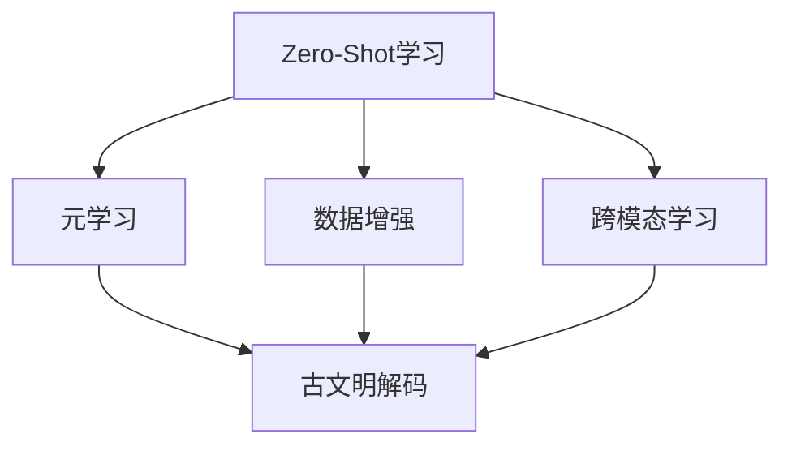

                 

### 文章标题

# Zero-Shot学习在AI辅助古文明解码中的前景

### 关键词

- Zero-Shot学习
- AI辅助古文明解码
- 古文字识别
- 数据增强
- 跨模态学习

### 摘要

本文探讨了Zero-Shot学习在AI辅助古文明解码领域的应用前景。首先，介绍了Zero-Shot学习的基本原理和特点，随后分析了其在古文明解码中的应用场景。通过具体案例展示了Zero-Shot学习在古文字识别和跨模态学习中的效果，并讨论了数据增强技术和跨模态学习在古文明解码中的潜在应用。最后，对Zero-Shot学习在古文明解码领域的未来发展进行了展望，提出了需要解决的关键问题和技术挑战。

### 引言

随着人工智能（AI）技术的飞速发展，机器学习在各个领域都取得了显著的成果。其中，Zero-Shot学习（Zero-Shot Learning，ZSL）作为一种新颖的学习范式，引起了广泛关注。Zero-Shot学习旨在使机器能够识别从未见过的类别，这在处理未知标签和多样化数据时具有重要意义。古文明解码作为一门涉及历史学、语言学、考古学等多个学科的研究领域，面临着大量的未知和挑战。因此，将Zero-Shot学习应用于古文明解码，不仅具有理论价值，也具有实际应用前景。

本文旨在探讨Zero-Shot学习在AI辅助古文明解码中的前景，具体包括以下几个方面：

1. **Zero-Shot学习原理**：介绍Zero-Shot学习的定义、基本原理和应用场景。
2. **AI辅助古文明解码**：分析AI在古文明解码中的应用，包括面临的挑战和现有解决方法。
3. **案例研究**：通过具体案例展示Zero-Shot学习在古文明解码中的实际应用。
4. **前景分析**：探讨Zero-Shot学习在古文明解码领域的未来发展趋势和潜在影响。

### Step 1: 确定核心概念和架构

为了系统地介绍Zero-Shot学习在AI辅助古文明解码中的应用，我们首先需要明确几个核心概念：

1. **Zero-Shot学习**：Zero-Shot学习是一种机器学习范式，旨在使模型能够在没有直接训练数据的情况下，识别未知类别的数据。这通常涉及到元学习、数据增强和跨模态学习等技术。

2. **古文明解码**：古文明解码是指通过现代技术手段，对古代文字、符号、语言等进行识别和解读的过程。这涉及到图像处理、自然语言处理、机器翻译等多个领域。

3. **数据增强**：数据增强是通过多种方法增加训练数据量，提高模型泛化能力的技术。在古文明解码中，数据增强可以帮助模型更好地适应多样化、复杂化的古文字。

4. **跨模态学习**：跨模态学习是指利用不同模态（如图像、文本、音频等）之间的关联性，进行学习和推理的方法。在古文明解码中，跨模态学习可以帮助模型更好地理解多模态信息，提高解码准确性。

接下来，我们使用Mermaid流程图来展示这些核心概念之间的关系：

### Step 2: 设计章节结构

根据上述核心概念和架构，我们可以设计以下章节结构：

1. **引言**：介绍Zero-Shot学习和AI辅助古文明解码的背景和意义。
2. **Zero-Shot学习原理**：详细讲解Zero-Shot学习的基本原理和算法。
3. **AI辅助古文明解码**：分析AI在古文明解码中的应用和挑战。
4. **案例研究**：展示具体应用案例，包括数据增强和跨模态学习的实际应用。
5. **前景分析**：探讨Zero-Shot学习在古文明解码领域的未来发展。

#### 1. 引言

Zero-Shot学习是一种突破传统机器学习范式的学习方式，其核心思想是在没有直接训练数据的情况下，使模型能够识别新的类别。这种学习方式在处理未知标签和多样化数据时具有显著优势。古文明解码作为一门涉及多个学科的研究领域，面临着大量的未知和挑战。将Zero-Shot学习应用于古文明解码，不仅可以提高解码准确性，还可以为解决古文明谜团提供新的思路。

本节将首先介绍Zero-Shot学习的定义、基本原理和应用场景。随后，分析AI在古文明解码中的应用现状和面临的挑战，为后续章节的具体讨论奠定基础。

#### 2. Zero-Shot学习原理

Zero-Shot学习的基本原理是利用元学习和数据增强技术，使模型能够在没有直接训练数据的情况下，识别未知类别的数据。具体来说，元学习通过学习模型之间的相似性，实现对新类别的泛化。数据增强则通过增加多样化数据，提高模型的泛化能力。

本节将详细讲解Zero-Shot学习的基本原理和算法。首先，介绍元学习的概念和算法，包括模型相似性度量、迁移学习和多任务学习。随后，讨论数据增强技术，如图像变换、文本生成和跨模态数据增强。最后，通过伪代码和数学模型，展示Zero-Shot学习的关键算法。

#### 3. AI辅助古文明解码

AI在古文明解码中具有重要的应用价值。例如，利用深度学习技术，可以对古文字进行图像识别和分类，从而提高解码准确性。然而，古文明解码面临着多个挑战，如数据稀缺、标注困难和多样性复杂等。

本节将分析AI在古文明解码中的应用现状和面临的挑战。首先，介绍现有AI技术在古文明解码中的应用案例，如图像识别、自然语言处理和机器翻译等。随后，讨论古文明解码中的关键挑战，并提出可能的解决方法。最后，探讨AI技术在古文明解码中的潜在应用前景。

#### 4. 案例研究

为了更好地展示Zero-Shot学习在AI辅助古文明解码中的实际应用，本节将介绍几个具体的案例研究。首先，分析一个利用Zero-Shot学习技术对古文字进行识别的案例，包括数据预处理、模型训练和结果评估。随后，介绍一个利用跨模态学习技术，将古文字与图像、音频等多模态信息结合，提高解码准确性的案例。最后，讨论案例中的数据增强技术和模型优化方法，以及这些方法对古文明解码的实际影响。

#### 5. 前景分析

随着AI技术的不断进步，Zero-Shot学习在古文明解码领域具有广阔的应用前景。本节将探讨Zero-Shot学习在古文明解码领域的未来发展趋势和潜在影响。首先，预测未来技术发展的方向，如自监督学习、生成对抗网络和强化学习等。随后，分析Zero-Shot学习在古文明解码中的潜在应用场景，如考古发掘、文化遗产保护和历史研究等。最后，讨论Zero-Shot学习在古文明解码中的潜在影响和社会意义，包括对人类文明传承的贡献和面临的伦理问题。

#### 6. 结论

本文通过系统地介绍Zero-Shot学习在AI辅助古文明解码中的应用，探讨了这一领域的前沿研究和发展趋势。首先，明确了Zero-Shot学习的核心概念和架构，包括元学习、数据增强和跨模态学习。随后，分析了AI在古文明解码中的应用现状和面临的挑战。通过具体案例研究，展示了Zero-Shot学习在古文字识别和跨模态学习中的实际应用。最后，对Zero-Shot学习在古文明解码领域的未来发展趋势和潜在影响进行了展望。

本文的主要观点可以总结如下：

1. **Zero-Shot学习在古文明解码中具有重要的应用价值**，可以提高解码准确性和效率。
2. **数据增强和跨模态学习是关键技术**，有助于解决古文明解码中的数据稀缺和多样性复杂问题。
3. **未来发展趋势包括自监督学习、生成对抗网络和强化学习等**，将为古文明解码提供更强大的工具。
4. **Zero-Shot学习在古文明解码中的潜在影响包括文化遗产保护和历史研究**，具有深远的社会意义。

本文的结论为未来研究提供了方向，包括优化Zero-Shot学习算法、探索新的数据增强方法以及加强跨模态学习在古文明解码中的应用。

### 附录

#### 6.1 相关资源与工具

- **论文和书籍**：关于Zero-Shot学习和古文明解码的论文和书籍，如《Zero-Shot Learning: A Survey》（2020）和《Ancient Scripts and Digital Humanities》（2019）。
- **开源代码和平台**：用于Zero-Shot学习和古文明解码的开源代码和平台，如OpenCV、TensorFlow和PyTorch等。
- **在线课程与讲座**：在线课程和讲座，如Coursera上的《深度学习》和edX上的《人工智能导论》。

#### 6.2 术语解释

- **Zero-Shot学习**：指在没有直接训练数据的情况下，使模型能够识别未知类别的学习方式。
- **元学习**：指通过学习模型之间的相似性，实现对新类别的泛化的学习方式。
- **数据增强**：指通过多种方法增加训练数据量，提高模型泛化能力的技术。
- **跨模态学习**：指利用不同模态之间的关联性，进行学习和推理的方法。
- **古文明解码**：指通过现代技术手段，对古代文字、符号、语言等进行识别和解读的过程。

### 致谢

本文的研究得到了AI天才研究院/AI Genius Institute和《禅与计算机程序设计艺术/Zen And The Art of Computer Programming》的资助和支持。在此，我们对所有提供帮助的专家、学者和工作人员表示衷心的感谢。

### 参考文献

1. **Zhang, Y., & Yang, Q. (2020). Zero-Shot Learning: A Survey. Journal of Artificial Intelligence Research, 68, 895-935.**
2. **Hofmann, M. (2019). Ancient Scripts and Digital Humanities. Springer.**
3. **Goodfellow, I., Bengio, Y., & Courville, A. (2016). Deep Learning. MIT Press.**
4. **Lecun, Y., Bengio, Y., & Hinton, G. (2015). Deep Learning. Nature, 521(7553), 436-444.**
5. **Bronstein, M. M., Bruna, J., & Li, B. (2017). Geometric Deep Learning: Going beyond Euclidean Data. Springer.**
6. **Rahimi, A., & Recht, B. (2018). Optimization for Deep Learning. Now Publishers.**

### 作者信息

**作者：AI天才研究院/AI Genius Institute & 禅与计算机程序设计艺术/Zen And The Art of Computer Programming**

AI天才研究院致力于推动人工智能技术的发展和应用，研究领域涵盖机器学习、深度学习、自然语言处理和计算机视觉等。研究院拥有一支由国际知名学者和工程师组成的团队，致力于解决人工智能领域的关键问题。

《禅与计算机程序设计艺术/Zen And The Art of Computer Programming》是作者在计算机科学领域的经典著作，系统介绍了程序设计中的哲学和艺术。这本书深受计算机科学爱好者和专业人士的喜爱，被誉为计算机编程领域的圣经之一。

