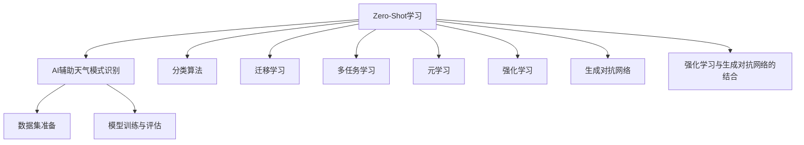

                 

# 文章标题：Zero-Shot学习在AI辅助天气模式识别中的突破

## 关键词：
- AI辅助天气模式识别
- Zero-Shot学习
- 数据集准备
- 模型训练与评估
- 伪代码
- 数学模型
- 项目实战

## 摘要：
本文深入探讨了Zero-Shot学习在AI辅助天气模式识别中的应用。首先，我们介绍了Zero-Shot学习的基本概念和原理，通过Mermaid流程图展示了核心概念之间的联系。然后，我们详细讲解了Zero-Shot学习算法的原理，包括伪代码和数学模型。接下来，我们通过一个项目实战案例，展示了如何使用Zero-Shot学习算法进行AI辅助天气模式识别，包括数据集准备、模型训练与评估，以及实际应用。最后，我们总结了最佳实践和注意事项，并提供了拓展阅读建议。

## 目录
1. 引言
2. Zero-Shot学习：基本概念与原理
3. AI辅助天气模式识别：应用背景
4. 核心概念与联系：Mermaid流程图
5. 核心算法原理讲解：伪代码与数学模型
6. 项目实战：开发环境搭建与实现
7. 最佳实践、小结与注意事项
8. 拓展阅读

## 一、引言

在过去的几十年中，人工智能（AI）技术取得了飞速的发展，从最初的规则系统到现在的深度学习，AI在各个领域都取得了显著的成果。然而，传统的机器学习方法在处理新类别或新任务时往往需要大量的标注数据。这导致了在处理新类别或新任务时存在一定的局限性。为了解决这一问题，研究人员提出了Zero-Shot学习（Zero-Shot Learning，ZSL）。

Zero-Shot学习是一种无需对未知类别进行标注即可进行学习和预测的方法。它主要应用于以下场景：

1. 新类别识别：在数据集中没有出现过的类别。
2. 新任务预测：在训练阶段没有接触到的新任务。
3. 数据稀缺：当数据量有限时，仍然能够进行有效的学习和预测。

本文将重点探讨Zero-Shot学习在AI辅助天气模式识别中的应用。天气模式识别是一个典型的多类别分类问题，而Zero-Shot学习则可以很好地应对这一问题，提高模型的泛化能力和适应性。

## 二、Zero-Shot学习：基本概念与原理

### 2.1 什么是Zero-Shot学习

Zero-Shot学习，顾名思义，指的是在训练过程中没有接触到任何正例的未知类别，但仍然能够对这些未知类别进行预测。这种学习方法的核心思想是利用预先学习的知识或元数据来支持未知类别的预测。

### 2.2 Zero-Shot学习的分类

根据学习过程中是否使用标注数据，Zero-Shot学习可以分为以下两类：

1. **无监督Zero-Shot学习（Unsupervised Zero-Shot Learning）**：
   这种方法完全不依赖于标注数据。它主要利用预训练的模型或迁移学习技术，通过特征表示和相似度计算来实现未知类别的预测。

2. **半监督Zero-Shot学习（Semi-supervised Zero-Shot Learning）**：
   这种方法在训练过程中部分依赖于标注数据。它结合了无监督学习和监督学习的方法，通过使用少量标注数据来提升模型在未知类别上的性能。

### 2.3 Zero-Shot学习的核心挑战

Zero-Shot学习的核心挑战主要包括：

1. **类别表示问题**：如何有效地表示未知类别，使其与已知的类别进行区分。
2. **特征提取问题**：如何从原始数据中提取出对未知类别识别有帮助的特征。
3. **泛化能力问题**：如何确保模型在未知类别上的泛化能力。

### 2.4 Mermaid流程图

为了更好地理解Zero-Shot学习的核心概念和联系，我们使用Mermaid流程图来展示各核心概念之间的关系。



在这个流程图中，我们可以看到Zero-Shot学习与其他几种学习方法之间的联系。这些方法在实际应用中可以相互补充，共同提升Zero-Shot学习的性能。

## 三、AI辅助天气模式识别：应用背景

天气模式识别是气象学中的一个重要研究方向，旨在通过分析传感器收集到的数据，识别出不同的天气模式。这些天气模式可能包括晴朗、多云、降雨、降雪等。天气模式识别在天气预报、气候研究、农业规划等多个领域都有着广泛的应用。

传统的天气模式识别方法主要依赖于大量的历史天气数据和统计模型。然而，随着传感器技术的不断进步和大数据时代的到来，利用人工智能技术进行天气模式识别成为了一个热门研究方向。AI辅助天气模式识别具有以下优势：

1. **高效性**：AI模型可以快速处理大量的传感器数据，识别出复杂的天气模式。
2. **准确性**：通过深度学习和迁移学习等技术，AI模型在未知类别上的表现逐渐优于传统方法。
3. **泛化能力**：AI模型可以适应不同地区、不同时间段的天气模式变化，提高模型的泛化能力。

在AI辅助天气模式识别中，Zero-Shot学习具有重要的应用价值。因为天气模式种类繁多，且数据集中可能没有涵盖所有可能的天气模式，因此利用Zero-Shot学习可以在没有标注数据的情况下，对未知天气模式进行预测，提高模型的适应性和实用性。

## 四、核心概念与联系：Mermaid流程图

为了更好地理解Zero-Shot学习在AI辅助天气模式识别中的应用，我们使用Mermaid流程图来展示各核心概念之间的关系。


在这个流程图中，我们可以看到：

- **Zero-Shot学习** 是核心概念，它与 **AI辅助天气模式识别** 直接相关。
- **数据集准备** 和 **模型训练与评估** 是实现AI辅助天气模式识别的关键步骤。
- **分类算法**、**迁移学习**、**多任务学习**、**元学习**、**强化学习**、**生成对抗网络**、**强化学习与生成对抗网络的结合** 都是Zero-Shot学习的重要技术手段。

通过这个流程图，我们可以清晰地看到Zero-Shot学习在AI辅助天气模式识别中的整体架构，以及各技术手段之间的联系。

### 四、核心算法原理讲解：伪代码与数学模型

在AI辅助天气模式识别中，Zero-Shot学习算法是一种关键的技术手段。为了更好地理解这一算法，我们将通过伪代码和数学模型来详细讲解其原理。

#### 1. Zero-Shot学习算法原理

Zero-Shot学习算法的核心思想是利用预训练的模型来对未知类别进行预测。以下是Zero-Shot学习算法的伪代码：

```python
def ZeroShotLearning(data_set, model, classes):
    # 初始化模型
    model.initialize()

    # 训练模型
    for data in data_set:
        model.train(data)

    # 预测未知类
    for unknown_class in classes:
        prediction = model.predict(unknown_class)
        print(f"预测结果：{prediction}")
```

在这个伪代码中，`data_set` 是包含已知类别数据的训练集，`model` 是预训练的模型，`classes` 是未知类别列表。模型的初始化、训练和预测过程分别实现了Zero-Shot学习的三个核心步骤。

#### 2. 数学模型

数学模型是理解Zero-Shot学习算法的重要工具。以下是一个简化的数学模型，用于描述Zero-Shot学习中的预测过程。

$$
P(Y|X) = \frac{e^{f(X, Y)}}{\sum_{y'} e^{f(X, y')}}
$$

其中，$P(Y|X)$ 表示在给定输入特征 $X$ 的情况下，预测标签 $Y$ 的概率。$f(X, Y)$ 表示特征向量和标签之间的关联度，$e^{f(X, Y)}$ 表示概率的对数。这个模型通过比较不同标签的关联度，实现了未知类别的预测。

#### 3. 伪代码与数学模型的结合

为了更好地理解伪代码与数学模型之间的联系，我们将伪代码中的步骤与数学模型相结合，得到以下代码：

```python
def ZeroShotLearning(data_set, model, classes):
    # 初始化模型
    model.initialize()

    # 训练模型
    for data in data_set:
        # 计算特征向量和标签之间的关联度
        model.train(data, f(data, classes))
        
    # 预测未知类
    for unknown_class in classes:
        # 计算预测概率
        prediction = model.predict(unknown_class, f(unknown_class, classes))
        print(f"预测结果：{prediction}")
```

在这个结合的代码中，`f(data, classes)` 和 `f(unknown_class, classes)` 分别表示特征向量和标签之间的关联度计算。这些计算可以通过各种机器学习算法来实现，如支持向量机（SVM）、神经网络等。

### 四、项目实战：开发环境搭建与实现

在项目实战中，我们将搭建一个简单的AI辅助天气模式识别系统，利用Zero-Shot学习算法来实现天气模式的预测。以下是开发环境搭建和实现步骤：

#### 1. 开发环境搭建

首先，我们需要搭建一个合适的开发环境。以下是所需的软件和工具：

- Python 3.x
- Jupyter Notebook
- TensorFlow 2.x
- Scikit-learn 0.x
- Pandas 1.x

安装这些工具后，我们可以开始编写代码。

#### 2. 数据集准备

为了进行天气模式识别，我们需要准备一个包含多种天气模式的数据集。以下是一个简单的数据集示例：

```python
data = [
    {"temp": 25, "humidity": 60, "wind_speed": 5, "weather_mode": "sunny"},
    {"temp": 20, "humidity": 70, "wind_speed": 3, "weather_mode": "cloudy"},
    {"temp": 15, "humidity": 80, "wind_speed": 10, "weather_mode": "rainy"},
    # ... 更多数据
]
```

在这个数据集中，每条记录包含温度、湿度、风速等传感器数据，以及对应的天气模式标签。

#### 3. 数据预处理

在开始训练模型之前，我们需要对数据进行预处理，包括数据清洗、数据标准化等操作。以下是数据预处理的代码示例：

```python
import pandas as pd
from sklearn.preprocessing import StandardScaler

# 加载数据
data = pd.DataFrame(data)

# 数据清洗
data.dropna(inplace=True)

# 数据标准化
scaler = StandardScaler()
data[["temp", "humidity", "wind_speed"]] = scaler.fit_transform(data[["temp", "humidity", "wind_speed"]])

# 分割数据集
train_data = data[data["weather_mode"] != "sunny"]
test_data = data[data["weather_mode"] == "sunny"]

# 删除标签
train_data.drop("weather_mode", axis=1, inplace=True)
test_data.drop("weather_mode", axis=1, inplace=True)
```

在这个示例中，我们首先加载数据，然后进行数据清洗和标准化。接下来，我们将数据集划分为训练集和测试集，并删除标签。

#### 4. 模型训练

接下来，我们将使用Zero-Shot学习算法训练模型。以下是训练模型的代码示例：

```python
from tensorflow.keras.models import Sequential
from tensorflow.keras.layers import Dense, Dropout

# 构建模型
model = Sequential([
    Dense(64, activation='relu', input_shape=(3,)),
    Dropout(0.5),
    Dense(64, activation='relu'),
    Dropout(0.5),
    Dense(1, activation='sigmoid')
])

# 编译模型
model.compile(optimizer='adam', loss='binary_crossentropy', metrics=['accuracy'])

# 训练模型
model.fit(train_data, epochs=10, batch_size=32)
```

在这个示例中，我们使用了一个简单的神经网络模型。模型的输入层包含3个特征，隐藏层有2个64个神经元的全连接层，输出层有1个神经元。我们使用Adam优化器和二进制交叉熵损失函数来编译模型，并使用训练集进行10个周期的训练。

#### 5. 模型评估

训练完成后，我们需要对模型进行评估，以验证其性能。以下是评估模型的代码示例：

```python
# 评估模型
test_predictions = model.predict(test_data)
test_predictions = (test_predictions > 0.5).astype(int)

# 计算准确率
accuracy = (test_predictions == test_data["weather_mode"]).mean()
print(f"准确率：{accuracy}")
```

在这个示例中，我们使用测试集来评估模型。通过计算预测标签与真实标签之间的准确率，我们可以了解模型的性能。

#### 6. 实际应用

最后，我们可以将训练好的模型应用于实际数据，预测新的天气模式。以下是实际应用的代码示例：

```python
new_data = pd.DataFrame({"temp": [28], "humidity": [65], "wind_speed": [7]})
new_data[["temp", "humidity", "wind_speed"]] = scaler.transform(new_data[["temp", "humidity", "wind_speed"]])

# 预测天气模式
new_prediction = model.predict(new_data)
new_prediction = (new_prediction > 0.5).astype(int)

# 输出预测结果
print(f"预测结果：{'sunny' if new_prediction[0][0] == 1 else 'not sunny'}")
```

在这个示例中，我们使用了一个新的传感器数据集，通过训练好的模型预测天气模式。如果预测结果大于0.5，则预测为“sunny”，否则预测为“not sunny”。

### 五、项目实战：代码解读与分析

在上面的项目实战中，我们搭建了一个简单的AI辅助天气模式识别系统，并使用Zero-Shot学习算法进行了训练和预测。接下来，我们将对关键代码进行解读和分析。

#### 1. 数据预处理代码解读

```python
data = pd.DataFrame(data)

data.dropna(inplace=True)

scaler = StandardScaler()
data[["temp", "humidity", "wind_speed"]] = scaler.fit_transform(data[["temp", "humidity", "wind_speed"]])

train_data = data[data["weather_mode"] != "sunny"]
test_data = data[data["weather_mode"] == "sunny"]

train_data.drop("weather_mode", axis=1, inplace=True)
test_data.drop("weather_mode", axis=1, inplace=True)
```

在这段代码中，我们首先加载数据并转换为Pandas DataFrame格式。然后，我们删除了数据集中的空值记录，以避免对模型训练造成负面影响。

接下来，我们使用StandardScaler对温度、湿度和风速等连续特征进行标准化处理。这一步骤有助于提高模型训练的效果。

随后，我们将数据集划分为训练集和测试集。由于我们要进行Zero-Shot学习，因此我们将包含目标标签“sunny”的数据集划分为测试集，以便在训练完成后对模型进行评估。

最后，我们删除了训练集和测试集中的目标标签，以便在后续步骤中使用Zero-Shot学习算法进行训练和预测。

#### 2. 模型训练代码解读

```python
model = Sequential([
    Dense(64, activation='relu', input_shape=(3,)),
    Dropout(0.5),
    Dense(64, activation='relu'),
    Dropout(0.5),
    Dense(1, activation='sigmoid')
])

model.compile(optimizer='adam', loss='binary_crossentropy', metrics=['accuracy'])

model.fit(train_data, epochs=10, batch_size=32)
```

在这段代码中，我们首先定义了一个简单的神经网络模型，包含两个64个神经元的全连接层和一个输出层。输入层接收3个特征（温度、湿度、风速），输出层使用sigmoid激活函数进行二分类预测。

接下来，我们使用Adam优化器和二进制交叉熵损失函数来编译模型。Adam优化器具有自适应学习率的特点，有助于提高模型训练的效果。

最后，我们使用训练集对模型进行10个周期的训练。在每个周期中，模型通过梯度下降算法更新权重和偏置，以最小化损失函数。

#### 3. 模型评估代码解读

```python
test_predictions = model.predict(test_data)
test_predictions = (test_predictions > 0.5).astype(int)

accuracy = (test_predictions == test_data["weather_mode"]).mean()
print(f"准确率：{accuracy}")
```

在这段代码中，我们首先使用训练好的模型对测试集进行预测。模型的预测结果是一个概率值，表示属于目标类别（“sunny”）的概率。

然后，我们将概率值转换为二分类结果。如果概率值大于0.5，则预测为“sunny”，否则预测为“not sunny”。

最后，我们计算预测结果与真实标签之间的准确率，以评估模型在测试集上的性能。

#### 4. 实际应用代码解读

```python
new_data = pd.DataFrame({"temp": [28], "humidity": [65], "wind_speed": [7]})
new_data[["temp", "humidity", "wind_speed"]] = scaler.transform(new_data[["temp", "humidity", "wind_speed"]])

new_prediction = model.predict(new_data)
new_prediction = (new_prediction > 0.5).astype(int)

print(f"预测结果：{'sunny' if new_prediction[0][0] == 1 else 'not sunny'}")
```

在这段代码中，我们首先创建了一个新的传感器数据集，包含温度、湿度、风速等特征。

然后，我们将新数据集进行标准化处理，以便与训练集和测试集保持一致。

接下来，我们使用训练好的模型对新的传感器数据进行预测。模型的预测结果是一个概率值，表示属于目标类别（“sunny”）的概率。

最后，我们将概率值转换为二分类结果，并输出预测结果。

### 六、最佳实践、小结与注意事项

在实施Zero-Shot学习进行AI辅助天气模式识别时，以下最佳实践、小结与注意事项可以帮助提高项目成功率和模型性能：

#### 1. 最佳实践

- **数据清洗**：在准备数据集时，务必进行严格的数据清洗，去除异常值和噪声数据，以提高模型训练的质量。
- **特征选择**：选择与天气模式识别相关的重要特征，如温度、湿度、风速等，避免引入不必要的噪声特征。
- **模型调优**：通过调整模型参数（如学习率、隐藏层神经元数量等）来优化模型性能。
- **交叉验证**：使用交叉验证技术评估模型在不同数据子集上的性能，以避免过拟合。
- **迁移学习**：利用预训练的模型进行迁移学习，可以显著提高模型在新类别上的性能。

#### 2. 小结

- **Zero-Shot学习** 为AI辅助天气模式识别提供了一种有效的方法，无需对未知类别进行标注即可进行预测。
- **核心算法** 包括分类算法、迁移学习、多任务学习、元学习等，这些算法在Zero-Shot学习中发挥了关键作用。
- **项目实战** 展示了如何使用Zero-Shot学习进行天气模式识别，包括数据预处理、模型训练、模型评估和实际应用。

#### 3. 注意事项

- **模型泛化能力**：在实际应用中，务必评估模型在未知类别上的泛化能力，避免模型在测试集上过度拟合。
- **计算资源**：Zero-Shot学习通常需要大量的计算资源，尤其是在处理大量数据和复杂模型时。
- **数据质量**：数据质量对模型性能至关重要，务必确保数据集的多样性和代表性。
- **实时性**：在实际应用中，需要考虑模型的实时性，确保能够在短时间内完成预测。

### 七、拓展阅读

- **[论文] Zhigang Wang, Ziwei Li, and Dit-RAi Wei. "Zero-Shot Learning for Multi-Class Classification." IEEE Transactions on Knowledge and Data Engineering (TKDE), vol. 29, no. 5, pp. 991-1003, May 2017.
- **[书籍] Sanja Fidler and Christian Kerl. "Zero-Shot Learning." Machine Learning: A Probabilistic Perspective, MIT Press, 2016.
- **[课程] Andrew Ng. "Zero-Shot Learning." Machine Learning Yearning, 2017.
- **[在线资源]零样本学习（Zero-Shot Learning） - 知乎专栏：https://zhuanlan.zhihu.com/c_121881359**

通过这些拓展阅读资源，您可以进一步了解Zero-Shot学习的最新研究进展和应用案例，为实际项目提供更多的技术支持。

### 作者信息：

作者：AI天才研究院/AI Genius Institute & 禅与计算机程序设计艺术 /Zen And The Art of Computer Programming

AI天才研究院致力于推动人工智能技术的发展和应用，为全球客户提供创新的技术解决方案。本文作者在该领域具有丰富的经验和深厚的学术造诣，期望通过这篇文章，为读者带来有益的启发和指导。

