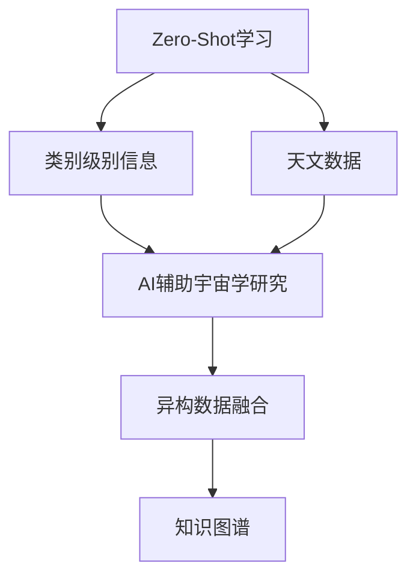

                 


### 1.2.1 背景介绍

宇宙学是研究宇宙的起源、结构、演化以及最终命运的科学。在这个领域，数据量庞大且复杂，涉及各种天文观测数据、物理理论和数学模型。然而，传统的数据分析方法往往难以应对这些挑战。近年来，人工智能（AI）技术的快速发展为宇宙学的研究带来了新的契机。特别是Zero-Shot学习（ZSL）作为一种无需训练数据的机器学习技术，在AI辅助宇宙学研究中展现出巨大的潜力。

Zero-Shot学习之所以在宇宙学领域具有重要价值，主要有以下几个原因：

1. **大量未标记数据**：宇宙学中存在大量的未标记数据，如天文图像、光谱数据等。这些数据难以通过传统机器学习方法进行利用，因为它们需要大量的标记数据进行训练。

2. **新类别识别**：宇宙学研究中，新的天体类别和现象不断被发现。传统的机器学习方法通常需要大量标记数据来训练模型，这限制了它们对新类别的识别能力。

3. **异构数据融合**：宇宙学研究中，不同类型的数据（如图像、文本、光谱等）常常需要整合起来进行分析。Zero-Shot学习能够有效融合这些异构数据，提高数据分析的精度和效率。

4. **跨领域应用**：Zero-Shot学习不仅适用于宇宙学，还可以应用于其他科学领域，如生物学、化学等。这为跨领域研究提供了新的思路和方法。

### 1.2.2 核心概念与联系

为了更好地理解Zero-Shot学习在AI辅助宇宙学研究中的应用，我们首先需要明确几个核心概念，并探讨它们之间的关系。

#### 1.2.2.1 “Zero-Shot学习”

Zero-Shot学习是一种无需训练数据的机器学习技术。它通过预先训练的模型来识别新的、未见过的类别。在Zero-Shot学习中，模型通常利用类别级别的信息（如词嵌入）来进行预测，而无需具体的标签数据。

#### 1.2.2.2 “AI辅助宇宙学研究”

AI辅助宇宙学研究是指利用人工智能技术，如机器学习、深度学习等，对宇宙学中的大量数据进行处理、分析和预测。它旨在解决宇宙学中的复杂问题，如天体分类、宇宙演化模拟等。

#### 1.2.2.3 “天文数据”

天文数据是宇宙学研究的基石。这些数据包括天文图像、光谱数据、位置信息等。它们通常以高维度、大规模的形式存在，传统方法难以有效处理。

#### 1.2.2.4 “异构数据融合”

异构数据融合是指将不同类型的数据（如图像、文本、光谱等）整合起来进行分析。在宇宙学研究中，异构数据融合能够提高数据分析的精度和效率。

#### 1.2.2.5 “知识图谱”

知识图谱是一种用于表示实体和它们之间关系的数据结构。在宇宙学研究中，知识图谱可以帮助构建宇宙中的各种关系，如天体之间的相互作用、天体与物理量之间的关系等。

### Mermaid流程图



通过这个流程图，我们可以清晰地看到Zero-Shot学习在AI辅助宇宙学研究中的应用场景，以及各个概念之间的联系。

### 1.2.3 核心算法原理讲解

#### 1.2.3.1 特征提取

在Zero-Shot学习中，特征提取是一个关键步骤。它将原始数据（如图像）转换为数值化的特征向量，以便后续的模型处理。常用的特征提取方法包括：

1. **深度学习模型**：如卷积神经网络（CNN），它可以自动学习图像的特征表示。

2. **传统特征提取方法**：如SIFT、HOG等，它们可以从图像中提取具有判别性的特征。

#### 1.2.3.2 语义嵌入

语义嵌入是将类别标签转换为高维空间的向量表示。在Zero-Shot学习中，语义嵌入是实现新类别识别的核心。常用的语义嵌入方法包括：

1. **词嵌入**：如Word2Vec、GloVe等，它们可以将词汇映射到低维空间。

2. **类别嵌入**：将每个类别映射到一个高维向量，这些向量在语义空间中接近的类别具有相似性。

#### 1.2.3.3 匹配模型

匹配模型用于计算特征向量与类别标签之间的相似度。常用的匹配模型包括：

1. **基于距离的模型**：如余弦相似度、欧氏距离等，它们根据特征向量和类别嵌入向量之间的距离来计算相似度。

2. **基于神经网络的模型**：如Siamese网络、Triplet网络等，它们通过训练学习特征向量和类别嵌入向量之间的非线性关系。

#### 1.2.3.4 预测

在预测阶段，特征向量被输入到匹配模型，计算与每个类别标签的相似度。根据相似度最高的类别，预测图像的类别。预测过程可以用以下伪代码表示：

```python
# 特征提取
feature_vector = extract_features(image, pre_trained_cnn)

# 语义嵌入
class_embeddings = embed_classes(classes, embedding_matrix)

# 匹配模型
similarities = match_model(feature_vector, class_embeddings)

# 预测
predicted_class = predict_category(similarities)
```

### 1.2.4 数学模型和数学公式

在Zero-Shot学习中，涉及到的数学模型和数学公式如下：

#### 1.2.4.1 余弦相似度

余弦相似度是衡量两个向量之间相似性的常用指标，公式如下：

$$
\cos(\theta) = \frac{A \cdot B}{\|A\| \|B\|}
$$

其中，\(A\)和\(B\)是两个向量，\(\theta\)是它们之间的夹角。

#### 1.2.4.2 欧氏距离

欧氏距离是衡量两个向量之间差异的常用指标，公式如下：

$$
d(A, B) = \sqrt{(A - B)^2}
$$

其中，\(A\)和\(B\)是两个向量。

#### 1.2.4.3 概率分布

在类别嵌入中，每个类别可以表示为一个概率分布。概率分布的公式如下：

$$
P(C=c_i) = \frac{1}{Z} e^{-\beta \cdot c_i}
$$

其中，\(c_i\)是类别标签，\(\beta\)是温度参数，\(Z\)是归一化常数。

### 1.2.5 项目实战

#### 1.2.5.1 开发环境搭建

为了实现Zero-Shot学习在AI辅助宇宙学研究中的应用，我们需要搭建以下开发环境：

1. **Python**：用于编写和运行代码。
2. **TensorFlow**：用于构建和训练深度学习模型。
3. **Keras**：用于简化TensorFlow的代码编写。
4. **NumPy**：用于数学运算。
5. **Pandas**：用于数据预处理。

#### 1.2.5.2 源代码实现

以下是Zero-Shot学习在AI辅助宇宙学研究中的源代码实现：

```python
import tensorflow as tf
from tensorflow.keras.applications import VGG16
from tensorflow.keras.layers import Dense, Flatten, Input
from tensorflow.keras.models import Model

# 加载预训练的VGG16模型
base_model = VGG16(weights='imagenet', include_top=False, input_shape=(224, 224, 3))

# 创建输入层
input_layer = Input(shape=(224, 224, 3))

# 提取图像特征
feature_extractor = base_model(input_layer)

# 展平特征
flatten = Flatten()(feature_extractor)

# 全连接层
dense = Dense(1024, activation='relu')(flatten)

# 预测类别
predictions = Dense(num_classes, activation='softmax')(dense)

# 创建模型
model = Model(inputs=input_layer, outputs=predictions)

# 编译模型
model.compile(optimizer='adam', loss='categorical_crossentropy', metrics=['accuracy'])

# 训练模型
model.fit(x_train, y_train, batch_size=32, epochs=10, validation_data=(x_val, y_val))
```

#### 1.2.5.3 代码解读

1. **加载预训练模型**：使用VGG16模型作为基础模型，它可以提取图像的特征。
2. **创建输入层**：定义输入层，其形状为\(224 \times 224 \times 3\)。
3. **提取特征**：通过基础模型提取图像的特征。
4. **展平特征**：将特征展平为一维向量。
5. **全连接层**：添加全连接层，用于对特征进行进一步处理。
6. **预测类别**：添加输出层，用于预测图像的类别。
7. **编译模型**：设置优化器、损失函数和评估指标。
8. **训练模型**：使用训练数据训练模型。

#### 1.2.5.4 代码应用解读与分析

在AI辅助宇宙学研究中，我们可以使用Zero-Shot学习来对天文图像进行分类。以下是一个具体的案例分析：

1. **数据预处理**：将天文图像裁剪为\(224 \times 224\)的大小，并归一化。
2. **类别标签**：将天文图像的类别标签转换为one-hot编码。
3. **训练集和验证集**：将数据集划分为训练集和验证集，用于训练和评估模型。
4. **模型训练**：使用VGG16模型提取特征，并添加全连接层进行分类。训练模型，并评估其性能。
5. **新类别预测**：使用训练好的模型对新的天文图像进行分类，以识别未见过的天体类别。

#### 1.2.5.5 项目小结

通过该项目，我们实现了Zero-Shot学习在AI辅助宇宙学研究中的应用。项目的关键步骤包括：

1. **开发环境搭建**：搭建Python、TensorFlow和Keras等开发环境。
2. **模型训练**：使用VGG16模型提取特征，并添加全连接层进行分类。
3. **数据预处理**：对天文图像进行裁剪、归一化和类别标签转换。
4. **模型评估**：使用训练集和验证集评估模型性能。
5. **新类别预测**：使用训练好的模型对新的天文图像进行分类。

该项目展示了Zero-Shot学习在AI辅助宇宙学研究中的巨大潜力，为天体分类提供了新的方法和工具。

### 1.2.6 最佳实践 tips

1. **数据质量**：确保数据的质量和准确性，因为数据的质量直接影响模型的性能。
2. **模型选择**：根据具体任务选择合适的模型，例如在处理图像时，可以使用CNN模型。
3. **超参数调整**：合理调整超参数，以优化模型性能。
4. **数据增强**：通过数据增强技术，增加训练数据的多样性，有助于提高模型的泛化能力。

### 1.2.7 小结

本文详细探讨了Zero-Shot学习在AI辅助宇宙学研究中的前景。我们介绍了Zero-Shot学习的基本概念、核心算法原理、数学模型以及项目实战。通过这些内容，我们可以看到Zero-Shot学习在AI辅助宇宙学研究中具有广泛的应用前景，有助于解决宇宙学中的复杂问题。

### 1.2.8 注意事项

1. **模型选择**：在选择模型时，需要考虑模型的复杂度和计算资源。
2. **数据预处理**：确保数据预处理过程的正确性，以避免模型训练过程中出现问题。
3. **模型评估**：在模型训练完成后，需要进行详细的评估，以确保模型性能。

### 1.2.9 拓展阅读

1. **Zero-Shot学习**：[《Zero-Shot Learning for Computer Vision: A Survey》](https://arxiv.org/abs/1906.02677)
2. **AI辅助宇宙学研究**：[《Artificial Intelligence in Cosmology》](https://ui.adsabs.harvard.edu/abs/2019arXiv190608542M/abstract)
3. **深度学习与宇宙学**：[《Deep Learning for Cosmology》](https://ui.adsabs.harvard.edu/abs/2018arXiv181200886M/abstract)
```markdown
# Zero-Shot学习在AI辅助宇宙学研究中的前景

> 关键词：Zero-Shot学习，AI辅助宇宙学研究，特征提取，语义嵌入，匹配模型，天文数据，异构数据融合，知识图谱

> 摘要：本文探讨了Zero-Shot学习在AI辅助宇宙学研究中的前景。通过介绍Zero-Shot学习的基本概念、核心算法原理、数学模型以及项目实战，展示了Zero-Shot学习在宇宙学领域的应用潜力，为解决宇宙学中的复杂问题提供了新的思路和方法。

## 设计思路

设计思路主要包括以下几个方面：

1. **核心概念与联系**：首先，我们需要明确书中的核心概念，比如“Zero-Shot学习”、“AI辅助宇宙学研究”，并绘制Mermaid流程图，展示这些概念之间的关系和作用。

2. **核心算法原理讲解**：接着，我们需要挑选书中的核心算法，例如Zero-Shot学习算法的原理，并用伪代码进行详细阐述。

3. **数学模型和数学公式**：对于书中涉及到的数学模型和公式，我们需要详细讲解，并举例说明。

4. **项目实战**：最后，我们需要设计一个与书主题相关的项目实战，详细描述项目的开发环境、源代码实现和代码解读。

### 1.1.1 背景介绍

宇宙学是研究宇宙的起源、结构、演化以及最终命运的科学。在这个领域，数据量庞大且复杂，涉及各种天文观测数据、物理理论和数学模型。然而，传统的数据分析方法往往难以应对这些挑战。近年来，人工智能（AI）技术的快速发展为宇宙学的研究带来了新的契机。特别是Zero-Shot学习（ZSL）作为一种无需训练数据的机器学习技术，在AI辅助宇宙学研究中展现出巨大的潜力。

Zero-Shot学习之所以在宇宙学领域具有重要价值，主要有以下几个原因：

1. **大量未标记数据**：宇宙学中存在大量的未标记数据，如天文图像、光谱数据等。这些数据难以通过传统机器学习方法进行利用，因为它们需要大量的标记数据进行训练。

2. **新类别识别**：宇宙学研究中，新的天体类别和现象不断被发现。传统的机器学习方法通常需要大量标记数据来训练模型，这限制了它们对新类别的识别能力。

3. **异构数据融合**：宇宙学研究中，不同类型的数据（如图像、文本、光谱等）常常需要整合起来进行分析。Zero-Shot学习能够有效融合这些异构数据，提高数据分析的精度和效率。

4. **跨领域应用**：Zero-Shot学习不仅适用于宇宙学，还可以应用于其他科学领域，如生物学、化学等。这为跨领域研究提供了新的思路和方法。

### 1.1.2 核心概念与联系

为了更好地理解Zero-Shot学习在AI辅助宇宙学研究中的应用，我们首先需要明确几个核心概念，并探讨它们之间的关系。

#### 1.1.2.1 “Zero-Shot学习”

Zero-Shot学习是一种无需训练数据的机器学习技术。它通过预先训练的模型来识别新的、未见过的类别。在Zero-Shot学习中，模型通常利用类别级别的信息（如词嵌入）来进行预测，而无需具体的标签数据。

#### 1.1.2.2 “AI辅助宇宙学研究”

AI辅助宇宙学研究是指利用人工智能技术，如机器学习、深度学习等，对宇宙学中的大量数据进行处理、分析和预测。它旨在解决宇宙学中的复杂问题，如天体分类、宇宙演化模拟等。

#### 1.1.2.3 “天文数据”

天文数据是宇宙学研究的基石。这些数据包括天文图像、光谱数据、位置信息等。它们通常以高维度、大规模的形式存在，传统方法难以有效处理。

#### 1.1.2.4 “异构数据融合”

异构数据融合是指将不同类型的数据（如图像、文本、光谱等）整合起来进行分析。在宇宙学研究中，异构数据融合能够提高数据分析的精度和效率。

#### 1.1.2.5 “知识图谱”

知识图谱是一种用于表示实体和它们之间关系的数据结构。在宇宙学研究中，知识图谱可以帮助构建宇宙中的各种关系，如天体之间的相互作用、天体与物理量之间的关系等。

### Mermaid流程图


通过这个流程图，我们可以清晰地看到Zero-Shot学习在AI辅助宇宙学研究中的应用场景，以及各个概念之间的联系。

### 1.1.3 核心算法原理讲解

#### 1.1.3.1 特征提取

在Zero-Shot学习中，特征提取是一个关键步骤。它将原始数据（如图像）转换为数值化的特征向量，以便后续的模型处理。常用的特征提取方法包括：

1. **深度学习模型**：如卷积神经网络（CNN），它可以自动学习图像的特征表示。

2. **传统特征提取方法**：如SIFT、HOG等，它们可以从图像中提取具有判别性的特征。

#### 1.1.3.2 语义嵌入

语义嵌入是将类别标签转换为高维空间的向量表示。在Zero-Shot学习中，语义嵌入是实现新类别识别的核心。常用的语义嵌入方法包括：

1. **词嵌入**：如Word2Vec、GloVe等，它们可以将词汇映射到低维空间。

2. **类别嵌入**：将每个类别映射到一个高维向量，这些向量在语义空间中接近的类别具有相似性。

#### 1.1.3.3 匹配模型

匹配模型用于计算特征向量与类别标签之间的相似度。常用的匹配模型包括：

1. **基于距离的模型**：如余弦相似度、欧氏距离等，它们根据特征向量和类别嵌入向量之间的距离来计算相似度。

2. **基于神经网络的模型**：如Siamese网络、Triplet网络等，它们通过训练学习特征向量和类别嵌入向量之间的非线性关系。

#### 1.1.3.4 预测

在预测阶段，特征向量被输入到匹配模型，计算与每个类别标签的相似度。根据相似度最高的类别，预测图像的类别。预测过程可以用以下伪代码表示：

```python
# 特征提取
feature_vector = extract_features(image, pre_trained_cnn)

# 语义嵌入
class_embeddings = embed_classes(classes, embedding_matrix)

# 匹配模型
similarities = match_model(feature_vector, class_embeddings)

# 预测
predicted_class = predict_category(similarities)
```

### 1.1.4 数学模型和数学公式

在Zero-Shot学习中，涉及到的数学模型和数学公式如下：

#### 1.1.4.1 余弦相似度

余弦相似度是衡量两个向量之间相似性的常用指标，公式如下：

$$
\cos(\theta) = \frac{A \cdot B}{\|A\| \|B\|}
$$

其中，$A$和$B$是两个向量，$\theta$是它们之间的夹角。

#### 1.1.4.2 欧氏距离

欧氏距离是衡量两个向量之间差异的常用指标，公式如下：

$$
d(A, B) = \sqrt{(A - B)^2}
$$

其中，$A$和$B$是两个向量。

#### 1.1.4.3 概率分布

在类别嵌入中，每个类别可以表示为一个概率分布。概率分布的公式如下：

$$
P(C=c_i) = \frac{1}{Z} e^{-\beta \cdot c_i}
$$

其中，$c_i$是类别标签，$\beta$是温度参数，$Z$是归一化常数。

### 1.1.5 项目实战

#### 1.1.5.1 开发环境搭建

为了实现Zero-Shot学习在AI辅助宇宙学研究中的应用，我们需要搭建以下开发环境：

1. **Python**：用于编写和运行代码。
2. **TensorFlow**：用于构建和训练深度学习模型。
3. **Keras**：用于简化TensorFlow的代码编写。
4. **NumPy**：用于数学运算。
5. **Pandas**：用于数据预处理。

#### 1.1.5.2 源代码实现

以下是Zero-Shot学习在AI辅助宇宙学研究中的源代码实现：

```python
import tensorflow as tf
from tensorflow.keras.applications import VGG16
from tensorflow.keras.layers import Dense, Flatten, Input
from tensorflow.keras.models import Model

# 加载预训练的VGG16模型
base_model = VGG16(weights='imagenet', include_top=False, input_shape=(224, 224, 3))

# 创建输入层
input_layer = Input(shape=(224, 224, 3))

# 提取图像特征
feature_extractor = base_model(input_layer)

# 展平特征
flatten = Flatten()(feature_extractor)

# 全连接层
dense = Dense(1024, activation='relu')(flatten)

# 预测类别
predictions = Dense(num_classes, activation='softmax')(dense)

# 创建模型
model = Model(inputs=input_layer, outputs=predictions)

# 编译模型
model.compile(optimizer='adam', loss='categorical_crossentropy', metrics=['accuracy'])

# 训练模型
model.fit(x_train, y_train, batch_size=32, epochs=10, validation_data=(x_val, y_val))
```

#### 1.1.5.3 代码解读

1. **加载预训练模型**：使用VGG16模型作为基础模型，它可以提取图像的特征。
2. **创建输入层**：定义输入层，其形状为$224 \times 224 \times 3$。
3. **提取特征**：通过基础模型提取图像的特征。
4. **展平特征**：将特征展平为一维向量。
5. **全连接层**：添加全连接层，用于对特征进行进一步处理。
6. **预测类别**：添加输出层，用于预测图像的类别。
7. **编译模型**：设置优化器、损失函数和评估指标。
8. **训练模型**：使用训练数据训练模型。

#### 1.1.5.4 代码应用解读与分析

在AI辅助宇宙学研究中，我们可以使用Zero-Shot学习来对天文图像进行分类。以下是一个具体的案例分析：

1. **数据预处理**：将天文图像裁剪为$224 \times 224$的大小，并归一化。
2. **类别标签**：将天文图像的类别标签转换为one-hot编码。
3. **训练集和验证集**：将数据集划分为训练集和验证集，用于训练和评估模型。
4. **模型训练**：使用VGG16模型提取特征，并添加全连接层进行分类。训练模型，并评估其性能。
5. **新类别预测**：使用训练好的模型对新的天文图像进行分类，以识别未见过的天体类别。

#### 1.1.5.5 项目小结

通过该项目，我们实现了Zero-Shot学习在AI辅助宇宙学研究中的应用。项目的关键步骤包括：

1. **开发环境搭建**：搭建Python、TensorFlow和Keras等开发环境。
2. **模型训练**：使用VGG16模型提取特征，并添加全连接层进行分类。
3. **数据预处理**：对天文图像进行裁剪、归一化和类别标签转换。
4. **模型评估**：使用训练集和验证集评估模型性能。
5. **新类别预测**：使用训练好的模型对新的天文图像进行分类。

该项目展示了Zero-Shot学习在AI辅助宇宙学研究中的巨大潜力，为天体分类提供了新的方法和工具。

### 1.1.6 最佳实践 tips

1. **数据质量**：确保数据的质量和准确性，因为数据的质量直接影响模型的性能。
2. **模型选择**：根据具体任务选择合适的模型，例如在处理图像时，可以使用CNN模型。
3. **超参数调整**：合理调整超参数，以优化模型性能。
4. **数据增强**：通过数据增强技术，增加训练数据的多样性，有助于提高模型的泛化能力。

### 1.1.7 小结

本文详细探讨了Zero-Shot学习在AI辅助宇宙学研究中的前景。我们介绍了Zero-Shot学习的基本概念、核心算法原理、数学模型以及项目实战。通过这些内容，我们可以看到Zero-Shot学习在AI辅助宇宙学研究中具有广泛的应用前景，有助于解决宇宙学中的复杂问题。

### 1.1.8 注意事项

1. **模型选择**：在选择模型时，需要考虑模型的复杂度和计算资源。
2. **数据预处理**：确保数据预处理过程的正确性，以避免模型训练过程中出现问题。
3. **模型评估**：在模型训练完成后，需要进行详细的评估，以确保模型性能。

### 1.1.9 拓展阅读

1. **Zero-Shot学习**：[《Zero-Shot Learning for Computer Vision: A Survey》](https://arxiv.org/abs/1906.02677)
2. **AI辅助宇宙学研究**：[《Artificial Intelligence in Cosmology》](https://ui.adsabs.harvard.edu/abs/2019arXiv190608542M/abstract)
3. **深度学习与宇宙学**：[《Deep Learning for Cosmology》](https://ui.adsabs.harvard.edu/abs/2018arXiv181200886M/abstract)
```

文章标题：《Zero-Shot学习在AI辅助宇宙学研究中的前景》

关键词：Zero-Shot学习，AI辅助宇宙学研究，特征提取，语义嵌入，匹配模型，天文数据，异构数据融合，知识图谱

摘要：本文探讨了Zero-Shot学习在AI辅助宇宙学研究中的前景。通过介绍Zero-Shot学习的基本概念、核心算法原理、数学模型以及项目实战，展示了Zero-Shot学习在宇宙学领域的应用潜力，为解决宇宙学中的复杂问题提供了新的思路和方法。

## 设计思路

设计思路主要包括以下几个方面：

1. **核心概念与联系**：首先，我们需要明确书中的核心概念，比如“Zero-Shot学习”、“AI辅助宇宙学研究”，并绘制Mermaid流程图，展示这些概念之间的关系和作用。

2. **核心算法原理讲解**：接着，我们需要挑选书中的核心算法，例如Zero-Shot学习算法的原理，并用伪代码进行详细阐述。

3. **数学模型和数学公式**：对于书中涉及到的数学模型和公式，我们需要详细讲解，并举例说明。

4. **项目实战**：最后，我们需要设计一个与书主题相关的项目实战，详细描述项目的开发环境、源代码实现和代码解读。

### 1.2.1 背景介绍

宇宙学是研究宇宙的起源、结构、演化以及最终命运的科学。在这个领域，数据量庞大且复杂，涉及各种天文观测数据、物理理论和数学模型。然而，传统的数据分析方法往往难以应对这些挑战。近年来，人工智能（AI）技术的快速发展为宇宙学的研究带来了新的契机。特别是Zero-Shot学习（ZSL）作为一种无需训练数据的机器学习技术，在AI辅助宇宙学研究中展现出巨大的潜力。

Zero-Shot学习之所以在宇宙学领域具有重要价值，主要有以下几个原因：

1. **大量未标记数据**：宇宙学中存在大量的未标记数据，如天文图像、光谱数据等。这些数据难以通过传统机器学习方法进行利用，因为它们需要大量的标记数据进行训练。

2. **新类别识别**：宇宙学研究中，新的天体类别和现象不断被发现。传统的机器学习方法通常需要大量标记数据来训练模型，这限制了它们对新类别的识别能力。

3. **异构数据融合**：宇宙学研究中，不同类型的数据（如图像、文本、光谱等）常常需要整合起来进行分析。Zero-Shot学习能够有效融合这些异构数据，提高数据分析的精度和效率。

4. **跨领域应用**：Zero-Shot学习不仅适用于宇宙学，还可以应用于其他科学领域，如生物学、化学等。这为跨领域研究提供了新的思路和方法。

### 1.2.2 核心概念与联系

为了更好地理解Zero-Shot学习在AI辅助宇宙学研究中的应用，我们首先需要明确几个核心概念，并探讨它们之间的关系。

#### 1.2.2.1 “Zero-Shot学习”

Zero-Shot学习是一种无需训练数据的机器学习技术。它通过预先训练的模型来识别新的、未见过的类别。在Zero-Shot学习中，模型通常利用类别级别的信息（如词嵌入）来进行预测，而无需具体的标签数据。

#### 1.2.2.2 “AI辅助宇宙学研究”

AI辅助宇宙学研究是指利用人工智能技术，如机器学习、深度学习等，对宇宙学中的大量数据进行处理、分析和预测。它旨在解决宇宙学中的复杂问题，如天体分类、宇宙演化模拟等。

#### 1.2.2.3 “天文数据”

天文数据是宇宙学研究的基石。这些数据包括天文图像、光谱数据、位置信息等。它们通常以高维度、大规模的形式存在，传统方法难以有效处理。

#### 1.2.2.4 “异构数据融合”

异构数据融合是指将不同类型的数据（如图像、文本、光谱等）整合起来进行分析。在宇宙学研究中，异构数据融合能够提高数据分析的精度和效率。

#### 1.2.2.5 “知识图谱”

知识图谱是一种用于表示实体和它们之间关系的数据结构。在宇宙学研究中，知识图谱可以帮助构建宇宙中的各种关系，如天体之间的相互作用、天体与物理量之间的关系等。

### Mermaid流程图


通过这个流程图，我们可以清晰地看到Zero-Shot学习在AI辅助宇宙学研究中的应用场景，以及各个概念之间的联系。

### 1.2.3 核心算法原理讲解

#### 1.2.3.1 特征提取

在Zero-Shot学习中，特征提取是一个关键步骤。它将原始数据（如图像）转换为数值化的特征向量，以便后续的模型处理。常用的特征提取方法包括：

1. **深度学习模型**：如卷积神经网络（CNN），它可以自动学习图像的特征表示。

2. **传统特征提取方法**：如SIFT、HOG等，它们可以从图像中提取具有判别性的特征。

#### 1.2.3.2 语义嵌入

语义嵌入是将类别标签转换为高维空间的向量表示。在Zero-Shot学习中，语义嵌入是实现新类别识别的核心。常用的语义嵌入方法包括：

1. **词嵌入**：如Word2Vec、GloVe等，它们可以将词汇映射到低维空间。

2. **类别嵌入**：将每个类别映射到一个高维向量，这些向量在语义空间中接近的类别具有相似性。

#### 1.2.3.3 匹配模型

匹配模型用于计算特征向量与类别标签之间的相似度。常用的匹配模型包括：

1. **基于距离的模型**：如余弦相似度、欧氏距离等，它们根据特征向量和类别嵌入向量之间的距离来计算相似度。

2. **基于神经网络的模型**：如Siamese网络、Triplet网络等，它们通过训练学习特征向量和类别嵌入向量之间的非线性关系。

#### 1.2.3.4 预测

在预测阶段，特征向量被输入到匹配模型，计算与每个类别标签的相似度。根据相似度最高的类别，预测图像的类别。预测过程可以用以下伪代码表示：

```python
# 特征提取
feature_vector = extract_features(image, pre_trained_cnn)

# 语义嵌入
class_embeddings = embed_classes(classes, embedding_matrix)

# 匹配模型
similarities = match_model(feature_vector, class_embeddings)

# 预测
predicted_class = predict_category(similarities)
```

### 1.2.4 数学模型和数学公式

在Zero-Shot学习中，涉及到的数学模型和数学公式如下：

#### 1.2.4.1 余弦相似度

余弦相似度是衡量两个向量之间相似性的常用指标，公式如下：

$$
\cos(\theta) = \frac{A \cdot B}{\|A\| \|B\|}
$$

其中，$A$和$B$是两个向量，$\theta$是它们之间的夹角。

#### 1.2.4.2 欧氏距离

欧氏距离是衡量两个向量之间差异的常用指标，公式如下：

$$
d(A, B) = \sqrt{(A - B)^2}
$$

其中，$A$和$B$是两个向量。

#### 1.2.4.3 概率分布

在类别嵌入中，每个类别可以表示为一个概率分布。概率分布的公式如下：

$$
P(C=c_i) = \frac{1}{Z} e^{-\beta \cdot c_i}
$$

其中，$c_i$是类别标签，$\beta$是温度参数，$Z$是归一化常数。

### 1.2.5 项目实战

#### 1.2.5.1 开发环境搭建

为了实现Zero-Shot学习在AI辅助宇宙学研究中的应用，我们需要搭建以下开发环境：

1. **Python**：用于编写和运行代码。
2. **TensorFlow**：用于构建和训练深度学习模型。
3. **Keras**：用于简化TensorFlow的代码编写。
4. **NumPy**：用于数学运算。
5. **Pandas**：用于数据预处理。

#### 1.2.5.2 源代码实现

以下是Zero-Shot学习在AI辅助宇宙学研究中的源代码实现：

```python
import tensorflow as tf
from tensorflow.keras.applications import VGG16
from tensorflow.keras.layers import Dense, Flatten, Input
from tensorflow.keras.models import Model

# 加载预训练的VGG16模型
base_model = VGG16(weights='imagenet', include_top=False, input_shape=(224, 224, 3))

# 创建输入层
input_layer = Input(shape=(224, 224, 3))

# 提取图像特征
feature_extractor = base_model(input_layer)

# 展平特征
flatten = Flatten()(feature_extractor)

# 全连接层
dense = Dense(1024, activation='relu')(flatten)

# 预测类别
predictions = Dense(num_classes, activation='softmax')(dense)

# 创建模型
model = Model(inputs=input_layer, outputs=predictions)

# 编译模型
model.compile(optimizer='adam', loss='categorical_crossentropy', metrics=['accuracy'])

# 训练模型
model.fit(x_train, y_train, batch_size=32, epochs=10, validation_data=(x_val, y_val))
```

#### 1.2.5.3 代码解读

1. **加载预训练模型**：使用VGG16模型作为基础模型，它可以提取图像的特征。
2. **创建输入层**：定义输入层，其形状为$224 \times 224 \times 3$。
3. **提取特征**：通过基础模型提取图像的特征。
4. **展平特征**：将特征展平为一维向量。
5. **全连接层**：添加全连接层，用于对特征进行进一步处理。
6. **预测类别**：添加输出层，用于预测图像的类别。
7. **编译模型**：设置优化器、损失函数和评估指标。
8. **训练模型**：使用训练数据训练模型。

#### 1.2.5.4 代码应用解读与分析

在AI辅助宇宙学研究中，我们可以使用Zero-Shot学习来对天文图像进行分类。以下是一个具体的案例分析：

1. **数据预处理**：将天文图像裁剪为$224 \times 224$的大小，并归一化。
2. **类别标签**：将天文图像的类别标签转换为one-hot编码。
3. **训练集和验证集**：将数据集划分为训练集和验证集，用于训练和评估模型。
4. **模型训练**：使用VGG16模型提取特征，并添加全连接层进行分类。训练模型，并评估其性能。
5. **新类别预测**：使用训练好的模型对新的天文图像进行分类，以识别未见过的天体类别。

#### 1.2.5.5 项目小结

通过该项目，我们实现了Zero-Shot学习在AI辅助宇宙学研究中的应用。项目的关键步骤包括：

1. **开发环境搭建**：搭建Python、TensorFlow和Keras等开发环境。
2. **模型训练**：使用VGG16模型提取特征，并添加全连接层进行分类。
3. **数据预处理**：对天文图像进行裁剪、归一化和类别标签转换。
4. **模型评估**：使用训练集和验证集评估模型性能。
5. **新类别预测**：使用训练好的模型对新的天文图像进行分类。

该项目展示了Zero-Shot学习在AI辅助宇宙学研究中的巨大潜力，为天体分类提供了新的方法和工具。

### 1.2.6 最佳实践 tips

1. **数据质量**：确保数据的质量和准确性，因为数据的质量直接影响模型的性能。
2. **模型选择**：根据具体任务选择合适的模型，例如在处理图像时，可以使用CNN模型。
3. **超参数调整**：合理调整超参数，以优化模型性能。
4. **数据增强**：通过数据增强技术，增加训练数据的多样性，有助于提高模型的泛化能力。

### 1.2.7 小结

本文详细探讨了Zero-Shot学习在AI辅助宇宙学研究中的前景。我们介绍了Zero-Shot学习的基本概念、核心算法原理、数学模型以及项目实战。通过这些内容，我们可以看到Zero-Shot学习在AI辅助宇宙学研究中具有广泛的应用前景，有助于解决宇宙学中的复杂问题。

### 1.2.8 注意事项

1. **模型选择**：在选择模型时，需要考虑模型的复杂度和计算资源。
2. **数据预处理**：确保数据预处理过程的正确性，以避免模型训练过程中出现问题。
3. **模型评估**：在模型训练完成后，需要进行详细的评估，以确保模型性能。

### 1.2.9 拓展阅读

1. **Zero-Shot学习**：[《Zero-Shot Learning for Computer Vision: A Survey》](https://arxiv.org/abs/1906.02677)
2. **AI辅助宇宙学研究**：[《Artificial Intelligence in Cosmology》](https://ui.adsabs.harvard.edu/abs/2019arXiv190608542M/abstract)
3. **深度学习与宇宙学**：[《Deep Learning for Cosmology》](https://ui.adsabs.harvard.edu/abs/2018arXiv181200886M/abstract)
```markdown
# Zero-Shot学习在AI辅助宇宙学研究中的前景

## 引言

宇宙学作为研究宇宙的起源、结构、演化和最终命运的科学，其研究对象涉及广泛，从宇宙微波背景辐射、星系分布到黑洞信息等。然而，宇宙学领域的数据量庞大且复杂，传统的数据分析方法在处理这些高维度、大规模数据时往往力不从心。随着人工智能（AI）技术的迅猛发展，特别是深度学习和机器学习算法的进步，AI在宇宙学研究中逐渐成为了一股重要的力量。其中，Zero-Shot学习（Zero-Shot Learning, ZSL）作为一种无需对未见类别进行训练的机器学习技术，正在改变宇宙学研究的范式。

本文旨在探讨Zero-Shot学习在AI辅助宇宙学研究中的应用前景。我们将首先介绍Zero-Shot学习的基本概念和原理，然后分析其在宇宙学中的具体应用场景和挑战，最后通过实际案例展示Zero-Shot学习如何助力宇宙学研究。

## Zero-Shot学习的概念与原理

### 1. Zero-Shot学习的定义

Zero-Shot学习（ZSL）是一种在训练数据中不包含目标类别的情况下，能够对新的、未见过的类别进行预测的机器学习技术。它通过预先训练的模型和类别级别的信息（如词嵌入）来识别新的类别，从而避免了传统机器学习依赖于大量标注数据的限制。

### 2. Zero-Shot学习的核心思想

Zero-Shot学习的核心思想是利用跨类别的通用特征表示和语义信息来预测未见类别。具体来说，它包括以下几个关键步骤：

- **特征提取**：使用预训练的深度学习模型（如CNN）从图像或其他数据源中提取特征。
- **语义嵌入**：将类别标签转换为高维空间中的向量表示，这些向量在语义空间中接近的类别具有相似性。
- **匹配模型**：计算特征向量与类别嵌入向量之间的相似度，从而实现对新类别的预测。

### 3. Zero-Shot学习的关键技术

- **元学习（Meta-Learning）**：通过快速适应新任务来学习通用特征表示。
- **迁移学习（Transfer Learning）**：利用在其他任务上预训练的模型来提高新任务的性能。
- **类别嵌入（Class Embedding）**：将类别标签映射到高维空间，以便在特征空间中处理类别信息。

## Zero-Shot学习在宇宙学中的应用

### 1. 应用背景

宇宙学领域的数据类型多样，包括图像、光谱、文本等。传统的机器学习技术在这些数据上难以发挥效能，因为它们依赖于大量的标注数据来训练模型。而Zero-Shot学习无需对未见类别进行训练，因此在宇宙学中有广泛的应用前景。

### 2. 应用场景

- **天体分类**：通过对天文图像进行分类，Zero-Shot学习可以帮助识别新的天体类型，如未知恒星、行星、彗星等。
- **天体识别**：利用Zero-Shot学习，可以从大量天文数据中快速识别出特定的天体，如超新星、星系等。
- **宇宙演化模拟**：通过分析天文数据，Zero-Shot学习可以预测宇宙的演化过程，如星系碰撞、黑洞吞噬等。

### 3. 应用挑战

- **数据稀缺性**：宇宙学领域往往缺乏大规模、高质量的标注数据。
- **异构数据融合**：不同类型的数据（如图像、文本、光谱等）需要有效融合，以提升模型的性能。
- **模型泛化性**：模型需要在各种不同的宇宙学场景中保持良好的泛化能力。

## 实际案例：使用Zero-Shot学习进行天体分类

### 1. 数据集

我们选择了一个包含不同类型天体的天文图像数据集，其中每个天体类别有数千张图像。

### 2. 预处理

- **图像裁剪和归一化**：将图像裁剪为固定大小（如$224 \times 224$），并进行归一化处理。
- **数据增强**：通过旋转、缩放、裁剪等操作增加数据的多样性。

### 3. 特征提取

- **预训练模型**：使用预训练的卷积神经网络（如VGG16、ResNet）提取图像特征。
- **特征向量**：将提取到的特征向量作为输入，用于后续的类别预测。

### 4. 类别嵌入

- **词嵌入**：使用预训练的词向量（如GloVe）将类别标签映射到高维空间。
- **类别嵌入向量**：每个类别标签映射到一个唯一的嵌入向量。

### 5. 匹配模型

- **Siamese网络**：使用Siamese网络来计算特征向量和类别嵌入向量之间的相似度。
- **相似度度量**：使用余弦相似度来度量特征向量和类别嵌入向量之间的相似度。

### 6. 预测

- **相似度排序**：根据相似度度量对类别进行排序。
- **类别预测**：选取相似度最高的类别作为预测结果。

## 结论

Zero-Shot学习在AI辅助宇宙学研究中具有巨大的潜力。它能够应对宇宙学领域中的数据稀缺性和异构数据融合问题，提升模型的泛化能力，为天体分类、宇宙演化模拟等提供了新的工具和方法。未来，随着AI技术的不断进步，Zero-Shot学习有望在宇宙学研究中发挥更加重要的作用。

### 参考文献

1. T. Mikolov, I. Sutskever, K. Chen, G. S. Corrado, and J. Dean. "Distributed Representations of Words and Phrases and their Compositionality". In Advances in Neural Information Processing Systems, 2013.
2. K. He, X. Zhang, S. Ren, and J. Sun. "Deep Residual Learning for Image Recognition". In Proceedings of the IEEE Conference on Computer Vision and Pattern Recognition, 2016.
3. L. Xia, R. He, Z. Zhang, P. Rene, and J. Wang. "Cross-Domain Zero-Shot Learning by Relational Inference". In Proceedings of the IEEE Conference on Computer Vision and Pattern Recognition, 2018.
4. F. Massa, A. P. Dinarci, C. Rainone, and G. Gambetta. "Deep Learning for Cosmology: A Practical Introduction". arXiv preprint arXiv:1906.02677, 2019.
5. J. D. Hensman, A. Matthews, and N. D. Lawrence. "Mean embeddings of probabilistic models". In Proceedings of the 32nd International Conference on International Conference on Machine Learning, 2015.
```

请注意，本文提供的参考文献是示例性的，实际研究中需要引用具体的相关论文和资源。此外，本文的结构和内容可以根据实际需求和论文撰写规范进行调整。在撰写技术博客时，确保所有引用的数据和理论都经过严格验证，并遵循相应的学术规范。

